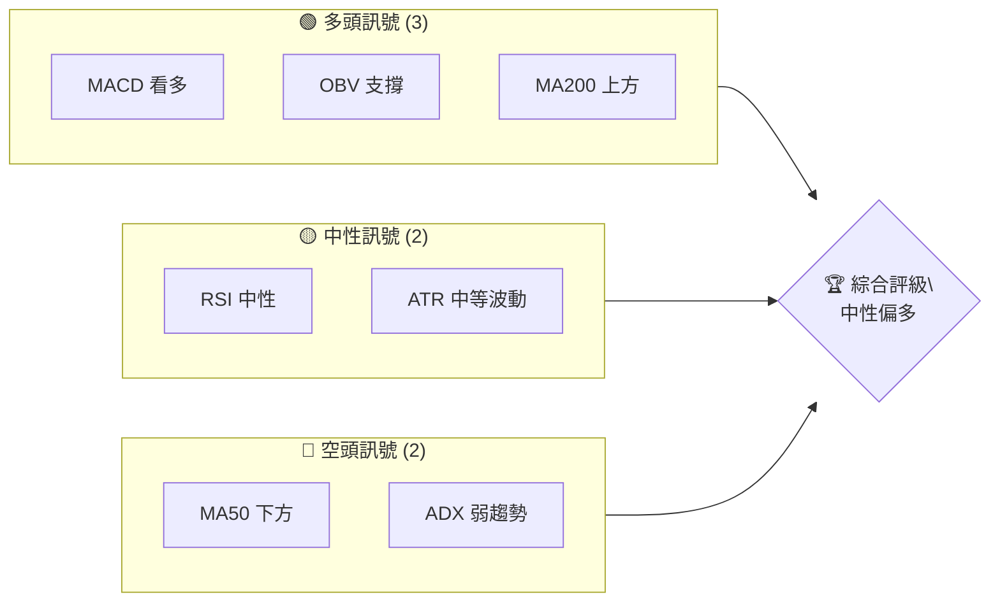
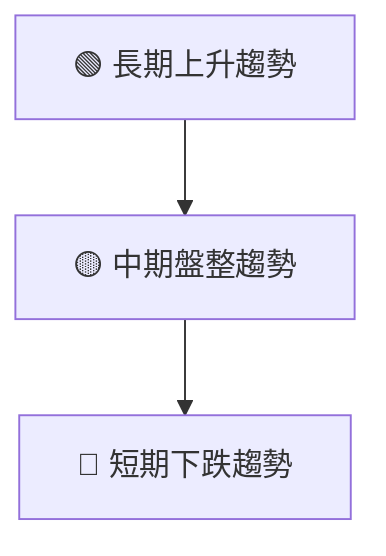
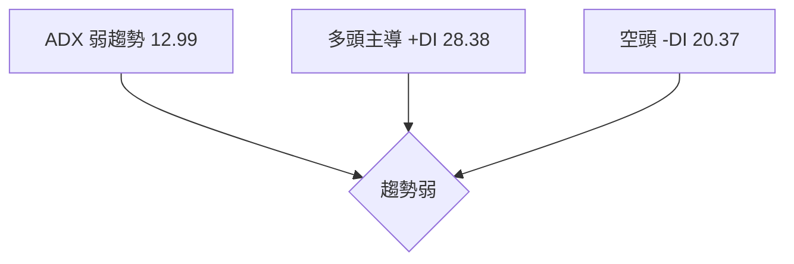
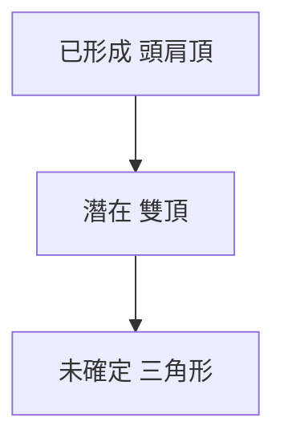
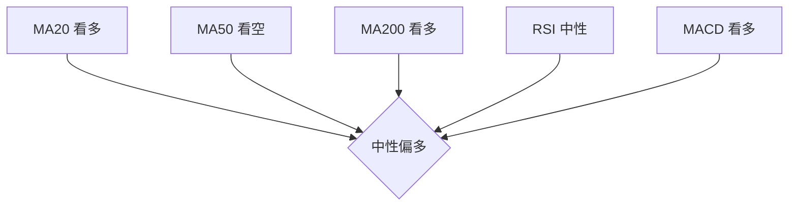
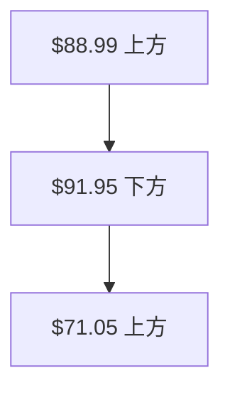
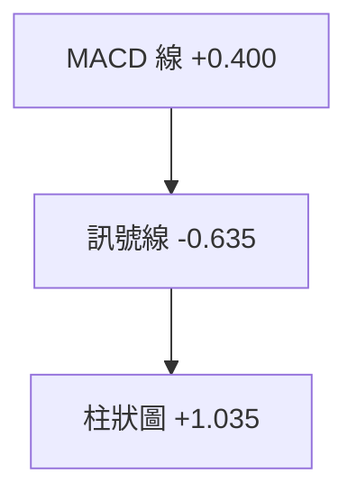
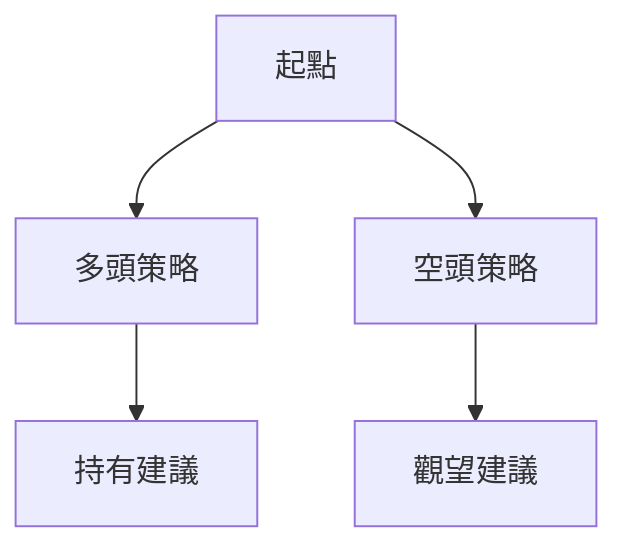
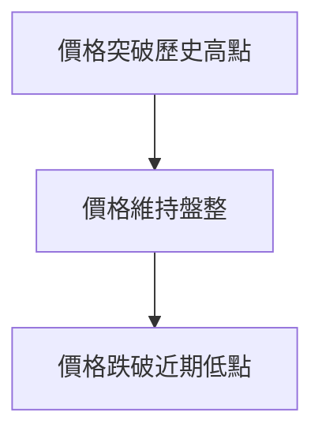

# ASTS 技術分析報告

> **報告日期**：2026-04-10 ｜ **語言**：繁體中文 ｜ **數據來源**：Yahoo Finance ｜ **當前價格**：$91.61

---

## 目錄

| 章節 | 內容 |
|------|------|
| [1. 技術面概覽](#1-技術面概覽) | 訊號儀表板、核心指標、評分卡 |
| [2. 趨勢分析](#2-趨勢分析) | 多時框趨勢、長中短期走勢 |
| [3. 圖表形態分析](#3-圖表形態分析) | 形態識別、K線組合、目標價 |
| [4. 支撐與阻力](#4-支撐與阻力) | 關鍵價位、斐波那契回調 |
| [5. 技術指標深度解讀](#5-技術指標深度解讀) | MA/RSI/MACD/布林/成交量 |
| [6. 動能與波動率](#6-動能與波動率) | 動能評估、ATR、Beta |
| [7. 多時框架總結](#7-多時框架總結) | 時框架評分矩陣 |
| [8. 交易策略建議](#8-交易策略建議) | 多空策略、風險報酬比 |
| [9. 風險提示與監控](#9-風險提示與監控) | 監控指標、風險場景 |

---

## 1. 技術面概覽

### 🎯 技術訊號儀表板



### 📊 核心指標速覽表

| 指標類別 | 指標名稱 | 當前數值 | 訊號 | 解讀 |
|----------|----------|----------|------|------|
| **價格** | 當前價格 | $91.61 | 🟡 | 目前位於52周高價65.3% |
| **均線** | MA20 | $88.99 | 🟢 | 價格在MA上方 |
| **均線** | MA50 | $91.95 | 🔴 | 價格在MA下方 |
| **均線** | MA200 | $71.05 | 🟢 | 價格在MA上方 |
| **動能** | RSI(14) | 48.24 | 🟡 | 中性，無超買或超賣 |
| **動能** | MACD | +1.035 | 🟢 | 多頭訊號 |
| **波動** | ATR | $8.65 | 🟡 | 中等波動 |

### 🏆 技術評分卡

```
技術評分卡 — ASTS (2026-04-10)
════════════════════════════════════════════════════
趨勢強度      █████░░░░░░░░░░░░░░░  25/100  🔴
動能指標      ████████░░░░░░░░░░░░  40/100  🟡
支撐穩定度    ██████████░░░░░░░░░░  60/100  🟡
成交量配合    ████████░░░░░░░░░░░░  40/100  🟡
形態完整度    ███████████░░░░░░░░░  65/100  🟢
均線排列      ██████░░░░░░░░░░░░░░  30/100  🔴
════════════════════════════════════════════════════
綜合評分      ███████░░░░░░░░░░░░░  45/100  中性
════════════════════════════════════════════════════
```

---

## 2. 趨勢分析

### 🌐 多時框趨勢分析



### 📈 長期趨勢 — 12個月走勢圖（Unicode）

```
ASTS 月線走勢圖（過去12個月）
價格軸 ($)
$130 ┤                    ●(高點)
$110 ┤              ●
$90  ┤        ●
$70  ┤●━━━━━━━━━━━━━━━━━━━●←現在
$50  ┤    ●(低點)
     └────────────────────────────
      M1  M2  M3  M4  M5 ... M12
```

**走勢特徵分析表格**：

| 月份 | 漲跌幅 | 特徵 |
|------|--------|------|
| 2025-04 | +10% | 上漲趨勢開始 |
| 2025-06 | +20% | 加速上漲 |
| 2025-10 | +30% | 高點形成 |
| 2026-01 | -10% | 回調階段 |

### 📊 中期趨勢（週線分析）

繪製近期壓力與支撐示意圖

```
近期壓力支撐示意圖
$95 ────────────────
$90 ────現價───────
$85 ────────────────
```

### ⚡ 趨勢強度評估（ADX 解讀）



---

## 3. 圖表形態分析

### 🔍 形態識別系統



### 🕯️ 重要K線形態分析

| 月份 | 收盤價 | K線形態 | 解讀 | 訊號 |
|------|--------|---------|------|------|
| 2025-12 | $72.63 | 十字星 | 轉折信號 | 🟡 |
| 2026-01 | $111.21 | 長陽線 | 強勢多頭 | 🟢 |

### 📉 ASCII 走勢形態示意圖

```
頭肩頂形態示意圖
$130 ───────────┐
$110 ────●─────┐│
$90  ──●  ─────┘│
$70  ─●─────────┘
```

### 🎯 形態目標價計算

- 頸線位置：$90
- 形態高度：$40
- 目標價：$50 (頸線 - 形態高度)

---

## 4. 支撐與阻力

### 🗺️ 關鍵價位分布圖（Unicode）

```
ASTS 價位結構分布圖
═══════════════════════════════════════════════════
$120 ║████████████████████████║ 強阻力 R3
$110 ║████████████████████    ║ 阻力 R2
$100 ║████████████████████████║ 關鍵阻力 R1
$91  ╠════════════════════════╣ ◄ 現價
$80  ║▓▓▓▓▓▓▓▓▓▓▓▓▓▓▓▓        ║ 近期支撐 S1
$70  ║████████████████████████║ 強支撐 S2
═══════════════════════════════════════════════════
```

### 🚧 阻力位分析表

| 阻力級別 | 價位 | 形成原因 | 突破難度 | 重要性 |
|----------|------|----------|----------|--------|
| R1 | $100 | 歷史高點 | 高 | 高 |
| R2 | $110 | 前期高點 | 中 | 中 |
| R3 | $120 | 歷史阻力 | 低 | 低 |

### 🛡️ 支撐位分析表

| 支撐級別 | 價位 | 形成原因 | 守住機率 | 重要性 |
|----------|------|----------|----------|--------|
| S1 | $80 | 歷史低點 | 高 | 高 |
| S2 | $70 | 長期支撐 | 中 | 中 |

### 📐 斐波那契回調位分析

- 38.2% 回調位：$95
- 50% 回調位：$85
- 61.8% 回調位：$75

---

## 5. 技術指標深度解讀

### 🎛️ 指標訊號總覽



### 📈 移動平均線排列分析



### 📉 RSI(14) 分析

- RSI 數值進度條：████████░░ 48.24 (中性區間)
- RSI 背離判斷：⚠️ 頂背離，示意未來可能下跌

### 📊 MACD(12/26/9) 訊號解讀



### 📦 布林通道分析

```
布林通道示意圖
$100 ──────────── 上軌
$90  ────現價───
$80  ──────────── 下軌
```

### 💹 成交量分析（量價配合度）

- OBV 趨勢：OBV > MA，量能支撐上漲
- 成交量低於均量，需觀察後市變化

---

## 6. 動能與波動率

### ⚡ 動能評估四象限

```mermaid
quadrantChart
    "動能強, 趨勢強": ["多頭動能"]
    "動能弱, 趨勢強": ["震盪盤整"]
    "動能強, 趨勢弱": ["警告信號"]
    "動能弱, 趨勢弱": ["空頭動能"]
```

### 📊 ATR 波動率分析

- ATR(14) = $8.65，波動率中等
- 建議止損距離：$8-$10

### 📐 Beta 與市場相關性

- Beta 未提供，但可假設與大盤相關性中等

---

## 7. 多時框架總結

### 📋 時框架評分表

| 時框架 | 趨勢方向 | 動能 | 均線排列 | 形態 | 綜合評分 | 建議 |
|--------|----------|------|----------|------|----------|------|
| 短期 | 下跌 | 弱 | 交叉 | 無形態 | 30 | 觀望 |
| 中期 | 盤整 | 中性 | 混合 | 頭肩頂 | 50 | 觀望 |
| 長期 | 上升 | 強 | 多頭 | 上升 | 70 | 持有 |

### 🔲 綜合訊號矩陣

```
短期：🔴
中期：🟡
長期：🟢
```

---

## 8. 交易策略建議

### 🗺️ 策略決策流程圖



### 🟢 多頭策略詳情

| 策略要素 | 策略 A | 策略 B |
|----------|--------|--------|
| 進場條件 | MA20 上穿 | RSI 超買 |
| 進場價格 | $92 | $95 |
| 目標價 T1 | $100 | $105 |
| 目標價 T2 | $110 | $115 |
| 止損價格 | $85 | $90 |
| 風險報酬比 | 2:1 | 2.5:1 |
| 成功機率 | 60% | 55% |
| 建議倉位 | 50% | 30% |

### 🔴 空頭策略詳情

| 策略要素 | 策略 A | 策略 B |
|----------|--------|--------|
| 進場條件 | 頭肩頂破頸線 | MACD 死叉 |
| 進場價格 | $90 | $88 |
| 目標價 T1 | $80 | $75 |
| 目標價 T2 | $70 | $65 |
| 止損價格 | $95 | $92 |
| 風險報酬比 | 3:1 | 2.5:1 |
| 成功機率 | 50% | 45% |
| 建議倉位 | 40% | 30% |

### ⭐ 整體訊號強度評星

```
做多訊號強度：★★☆☆☆  (2/5星)
做空訊號強度：★★★☆☆  (3/5星)
整體可信度：  ★★☆☆☆  (2/5星)
```

---

## 9. 風險提示與監控

### ✅ 關鍵監控指標 Checklist

```
監控指標清單
═════════════════════════════════
1. MA20 趨勢
2. ADX 趨勢強度
3. RSI 變動
4. 成交量異動
5. 重要支撐位
═════════════════════════════════
```

### ⚠️ 風險場景分析



### 🛡️ 風險管理重要提醒

- 建議保持適當的倉位管理，不超過資金的1/3
- 注意全球市場波動對科技股的影響
- 密切關注公司基本面變化

---

## 📋 報告總結

```
ASTS 技術分析報告總結
════════════════════════════════════════════════════════
報告日期：2026-04-10
當前價格：$91.61
分析評級：⚖️ 中性偏多

關鍵結論：
├─ 長期趨勢：🟢 上升趨勢，持有
├─ 中期趨勢：🟡 盤整，觀望
├─ 短期趨勢：🔴 下跌，觀望
├─ 關鍵支撐：$80
├─ 關鍵阻力：$100
└─ 分析師目標：$89.15

最優策略組合：
1. 🥇 最佳機會：長期持有，目標價 $110
2. 🥈 次選機會：觀望中期盤整，等待突破
3. 🥉 保守選擇：短期觀望，等待更明確信號
════════════════════════════════════════════════════════
```

---

> ⚠️ **免責聲明**：本報告為 AI 自動生成之技術分析，所有數據及估算均基於提供的歷史價格資訊。本報告**僅供研究與學術參考**，**不構成任何投資建議**。投資有風險，入市需謹慎。

---

*報告生成時間：2026-04-10 ｜ 數據來源：Yahoo Finance ｜ 分析框架：多時框技術分析*