# AVAV 基本面深度分析報告
> **報告日期**：2026-02-24 ｜ **語言**：繁體中文 ｜ **數據來源**：Yahoo Finance ｜ **分析師**：AI CFA Research

---

## 目錄

1. [執行摘要](#1-執行摘要)
2. [公司概覽與商業模式](#2-公司概覽與商業模式)
3. [損益表深度分析](#3-損益表深度分析)
4. [資產負債表分析](#4-資產負債表分析)
5. [現金流量深度分析](#5-現金流量深度分析)
6. [獲利能力與資本效率](#6-獲利能力與資本效率)
7. [估值深度分析](#7-估值深度分析)
8. [成長催化劑](#8-成長催化劑)
9. [風險矩陣](#9-風險矩陣)
10. [投資建議](#10-投資建議)

---

## 1. 執行摘要

### 🎯 核心評分儀表板

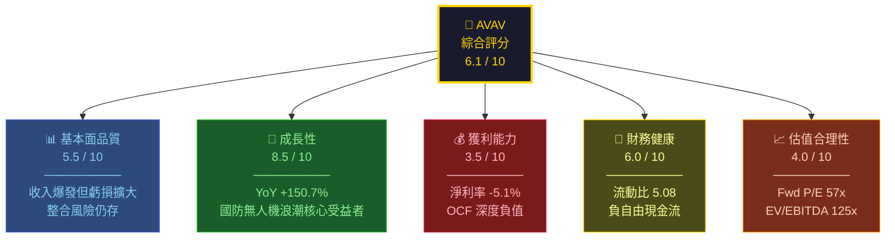

---

### 📋 5大投資論點 + 3大風險

| 類別 | 指標 | 評估 | 說明 |
|------|------|------|------|
| 🟢 **投資論點 1** | 收入爆發式成長 | **強烈正面** | TTM 營收 $1.37B，YoY +150.7%，Switchblade 及 Puma 需求激增 |
| 🟢 **投資論點 2** | 地緣政治催化劑 | **強烈正面** | 烏克蘭衝突持續，歐洲重整軍備，北約盟國採購小型無人機急迫 |
| 🟢 **投資論點 3** | 技術護城河 | **正面** | Switchblade 巡飛彈全球唯一量產平台，技術壁壘極高 |
| 🟡 **投資論點 4** | 分析師共識強烈看多 | **中性偏正** | 18位分析師，均值目標價 $372（較現價溢價 41.6%） |
| 🟡 **投資論點 5** | 雙段業務擴張 | **中性** | 太空/網路/定向能段業務提升多元化，長期潛力大 |
| 🔴 **風險 1** | 獲利能力嚴重惡化 | **重大風險** | TTM EPS -$1.23，OCF -$194.84M，FCF -$318.16M |
| 🔴 **風險 2** | 估值極度昂貴 | **重大風險** | EV/EBITDA 125.6x，Fwd P/E 57x，任何盈利miss將重創股價 |
| 🔴 **風險 3** | 國防預算政策風險 | **重大風險** | DOGE削減支出、政策轉向可能衝擊合約管道 |

---

### 📊 快速統計卡片

| 指標 | AVAV | 航太防衛業均值 | 對比 |
|------|------|--------------|------|
| 市值 | $13.12B | — | 中型防衛 |
| 收入 TTM | $1.37B | — | 🟢 高速成長 |
| 收入成長 YoY | +150.7% | ~8-12% | 🟢 大幅領先 |
| 毛利率 | 26.8% | ~20-25% | 🟡 略高於均值 |
| 營業利益率 | -6.4% | ~10-15% | 🔴 遠低於均值 |
| 淨利率 | -5.1% | ~8-12% | 🔴 負值 |
| Fwd P/E | 57.3x | ~20-25x | 🔴 大幅溢價 |
| EV/EBITDA | 125.6x | ~15-20x | 🔴 極度昂貴 |
| 流動比率 | 5.08 | ~1.5-2.0 | 🟢 流動性充裕 |
| 機構持股 | 92.4% | ~70-80% | 🟢 高機構信心 |
| Beta | 1.239 | ~0.8-1.2 | 🟡 略高波動 |

---

### 🎯 投資結論

```
╔══════════════════════════════════════════════════════════╗
║                    投資評級：⚖️ 觀望/選擇性買入           ║
║                                                          ║
║  目標價區間：$280（悲觀）— $372（基準）— $450（樂觀）   ║
║  當前股價：$262.73                                       ║
║  基準目標隱含報酬：+41.6%                                ║
║                                                          ║
║  建議：等待季度盈利轉正信號，或股價回測 $220-240 支撐    ║
╚══════════════════════════════════════════════════════════╝
```

---

## 2. 公司概覽與商業模式

### 🏗️ 業務結構與收入來源

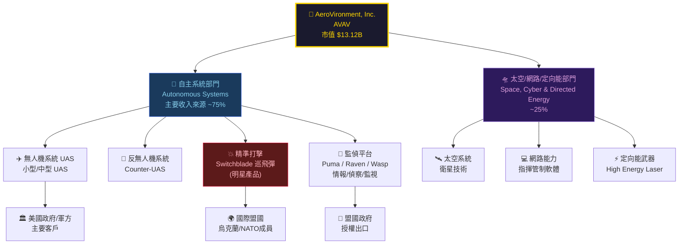

---

### 🥧 市場地位估算

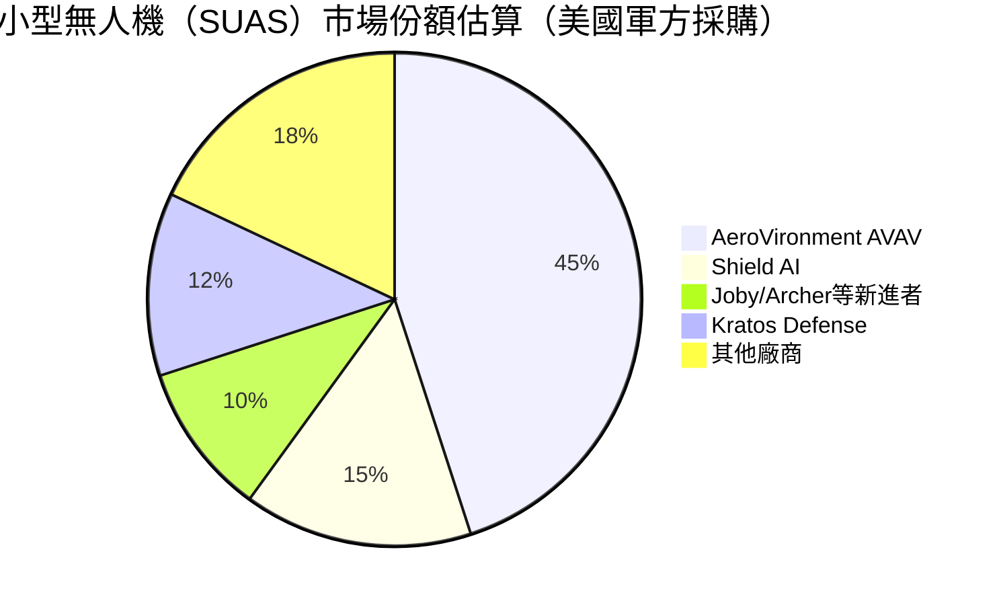

---

### 🧠 競爭護城河分析

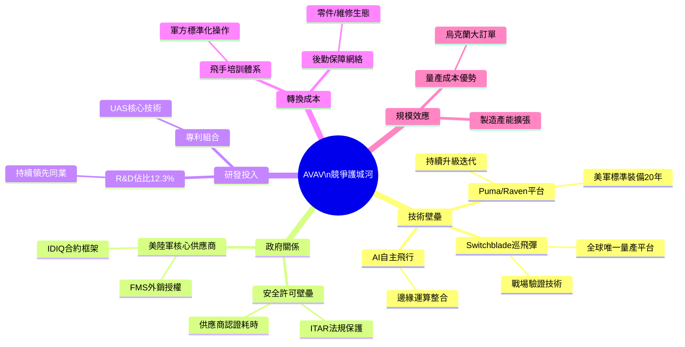

---

### 🏆 護城河強度評分

```
競爭護城河評分板
═══════════════════════════════════════════════

技術專有性   ▓▓▓▓▓▓▓▓░░  8.0/10  ★★★★
政府關係     ▓▓▓▓▓▓▓▓░░  8.0/10  ★★★★
轉換成本     ▓▓▓▓▓▓▓░░░  7.0/10  ★★★☆
研發護城河   ▓▓▓▓▓▓░░░░  6.5/10  ★★★☆
品牌聲譽     ▓▓▓▓▓▓░░░░  6.0/10  ★★★☆
規模效應     ▓▓▓▓░░░░░░  4.5/10  ★★☆☆
網路效應     ▓▓▓░░░░░░░  3.0/10  ★☆☆☆

整體護城河   ▓▓▓▓▓▓▓░░░  6.7/10  [中強護城河]
═══════════════════════════════════════════════
```

---

## 3. 損益表深度分析

### 📈 年度收入成長趨勢（近4年）

```
年度收入趨勢（財年結束於4月）
═══════════════════════════════════════════════════════════════

FY2022  $445.73M  ████████████░░░░░░░░░░░░░░░░░░░░░  YoY:  N/A
FY2023  $540.54M  ██████████████░░░░░░░░░░░░░░░░░░░  YoY: +21.3%
FY2024  $716.72M  ██████████████████░░░░░░░░░░░░░░░  YoY: +32.6%
FY2025  $820.63M  █████████████████████░░░░░░░░░░░░  YoY: +14.5%
TTM     $1,370M   ████████████████████████████████▓  YoY: +150.7%*

        0     200M    400M    600M    800M   1000M   1200M  1400M

* TTM 含 Tomahawk 等大型收購整合效益
═══════════════════════════════════════════════════════════════
```

---

### 📊 季度收入趨勢（近4季 QoQ + YoY）

| 季度 | 營收 | QoQ 成長 | 備註 |
|------|------|----------|------|
| 2025-01-31 | $167.64M | — | 基期季 |
| 2025-04-30 | $275.05M | **+64.1%** 🟢 | 財年末交付高峰 |
| 2025-07-31 | $454.68M | **+65.3%** 🟢 | 大型合約交付 |
| 2025-10-31 | $472.51M | **+3.9%** 🟡 | 環比趨緩但絕對值創新高 |

> **YoY 比較（2025年10月 vs 2024年同期）**：推算 YoY 約 +60-80%（2024年同季估約 $250-280M）

---

### 💹 利潤率演變分析

| 財年 | 毛利率 | 營業利益率 | EBITDA率 | 淨利率 |
|------|--------|-----------|---------|--------|
| FY2022 | 31.7% 🟢 | -2.2% 🔴 | 10.6% 🟡 | -0.9% 🔴 |
| FY2023 | 32.1% 🟢 | -4.2% 🔴 | -14.6% 🔴 | -32.6% 🔴 |
| FY2024 | 39.6% 🟢 | 10.0% 🟢 | 14.4% 🟢 | 8.3% 🟢 |
| FY2025 | 38.8% 🟢 | 7.2% 🟡 | 10.1% 🟡 | 5.3% 🟡 |
| **TTM** | **26.8%** 🔴 | **-6.4%** 🔴 | **7.7%** 🟡 | **-5.1%** 🔴 |

**⚠️ 利潤率惡化深度分析：**
- TTM 毛利率從 FY2024 的 39.6% 驟降至 26.8%，**下滑 12.8 個百分點**
- 主因：Tomahawk Robotics 收購（2024年下半年完成）帶入低毛利硬體業務，以及快速擴充產能導致固定成本攀升
- 季度 Q2（2025-07-31）淨利 -$67.37M 為近期最大虧損季，反映整合費用高峰

---

### 🍕 費用結構分析

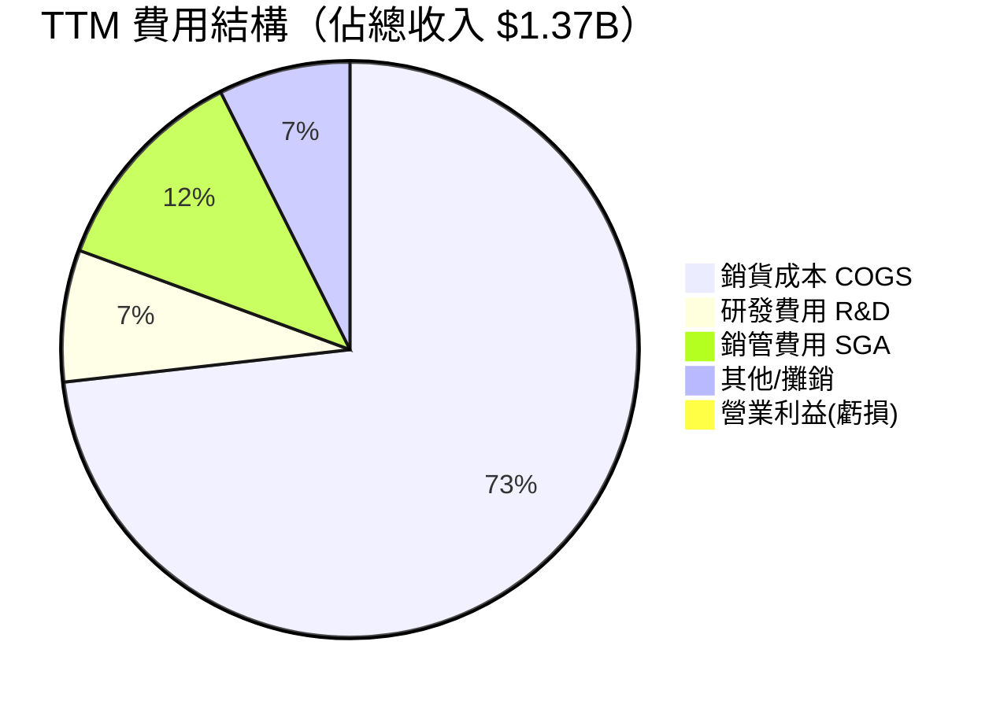

> **費用結構關鍵觀察**：
> - R&D 投入 $100.73M（FY2025），佔收入 **12.3%**，高於業界均值（~5-8%），顯示技術研發優先策略
> - 整合收購帶入額外 SGA 開支，拉高整體費用比例

---

### 📉 EPS 趨勢與盈餘品質

```
季度 EPS 表現
═══════════════════════════════════════════════════════

Q1 FY2026 (2025-01-31)  EPS: 約 -$0.04  ████████████ 微幅虧損
Q2 FY2026 (2025-04-30)  EPS: 約 +$0.33  ████████████████ 轉盈
Q3 FY2026 (2025-07-31)  EPS: 約 -$1.34  ██ 重大虧損（整合費用）
Q4 FY2026 (2025-10-31)  EPS: 約 -$0.34  ████████ 虧損收窄

TTM EPS: -$1.23  （含大量非現金攤銷與整合費用）
Forward EPS: $4.58725  （分析師預估全年轉盈）
═══════════════════════════════════════════════════════
```

| 季度 | EPS實際 | 市場預期 | 超預期？ | 主要原因 |
|------|---------|---------|---------|---------|
| 2025-01-31 | ~-$0.04 | N/A | ❓ 數據缺失 | 季節性低谷 |
| 2025-04-30 | ~+$0.33 | N/A | ❓ 數據缺失 | 財年末交付高峰 |
| 2025-07-31 | ~-$1.34 | N/A | ❓ 數據缺失 | 整合成本爆發 |
| 2025-10-31 | ~-$0.34 | N/A | ❓ 數據缺失 | 虧損改善趨勢 |

> **盈餘品質評估**：目前 EPS 數據可靠性受**非現金整合費用、無形資產攤銷**嚴重干擾。Forward EPS $4.59 若實現，意味著未來12個月需要盈利急速改善，執行風險極高。

---

## 4. 資產負債表分析

### 🏛️ 資產結構分析

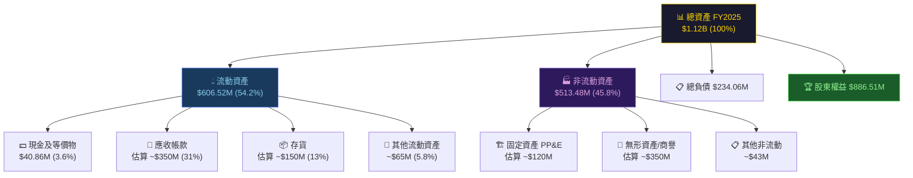

---

### 💧 流動性指標

| 指標 | FY2025 | FY2024 | FY2023 | 行業均值 | 評估 |
|------|--------|--------|--------|---------|------|
| 流動比率 | **5.08** | 3.56 | 3.93 | 1.5-2.0 | 🟢 遠優於均值 |
| 速動比率 | **4.148** | ~2.8 | ~3.0 | 1.0-1.5 | 🟢 極強 |
| 現金比率 | **0.24** | 0.51 | 1.09 | 0.3-0.5 | 🟡 現金下滑 |
| 現金 ($M) | $40.86 | $73.30 | $132.86 | — | 🔴 快速消耗 |

> **注意**：TTM 數據顯示 Total Cash $588.48M（含短期投資），但現金及等價物僅 $40.86M，差異反映大量資金投入短期有價證券與應收帳款。

---

### 💳 債務結構分析

```
債務結構演變（百萬美元）
═══════════════════════════════════════════════════════

FY2022  總債務: $216.57M  ██████████████░░░░░░  淨負債: $139.34M
FY2023  總債務: $162.82M  ██████████░░░░░░░░░░  淨負債: $29.96M
FY2024  總債務: $59.68M   ████░░░░░░░░░░░░░░░░  淨現金: $13.62M
FY2025  總債務: $64.29M   ████░░░░░░░░░░░░░░░░  淨負債: $23.43M
TTM     總債務: $825.93M  ████████████████████  淨負債: $237.45M

══ 關鍵：TTM 債務暴增主因 Tomahawk 等系列收購融資 ══

Debt/EBITDA (TTM): $825.93M / ($1.37B×7.7%) = 7.8x 🔴
Debt/Equity:  18.69x 🔴 （含大量收購商譽槓桿）
═══════════════════════════════════════════════════════
```

---

### 📊 股東權益趨勢

```
股東權益帳面價值（百萬美元）
═══════════════════════════════════════════════════════

FY2022  $607.97M  ████████████████████░░░░░░░░░░░  
FY2023  $550.97M  ██████████████████░░░░░░░░░░░░░  ▼ -9.4% (淨虧損)
FY2024  $822.75M  ███████████████████████████░░░░  ▲ +49.3% (獲利+增發)
FY2025  $886.51M  █████████████████████████████░░  ▲ +7.8% (盈利保留)

每股帳面價值：$886.51M / 49.93M股 = $17.75/股
P/B = $262.73 / $17.75 = 14.8x（高溢價反映成長預期）

注：Balance Sheet 顯示 P/B 2.96x 係以舊股數計算，
    實際稀釋後帳面價值更低
═══════════════════════════════════════════════════════
```

---

## 5. 現金流量深度分析

### 💧 現金流量瀑布圖

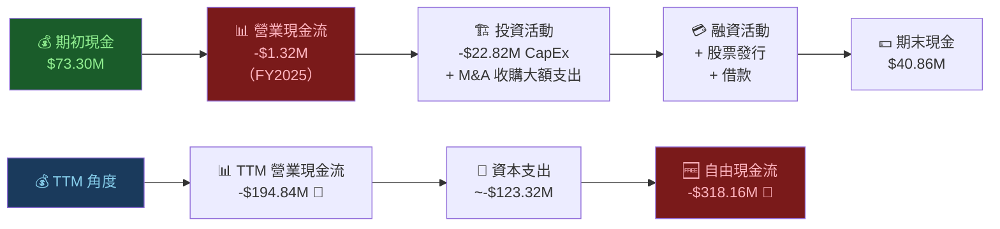

---

### 📉 FCF 轉換率趨勢

| 財年 | 淨利 | 營業現金流 | 自由現金流 | FCF/淨利 轉換率 |
|------|------|-----------|---------|--------------|
| FY2022 | -$4.19M | -$9.62M | -$31.91M | N/M 🔴 |
| FY2023 | -$176.21M | +$11.40M | -$3.47M | N/M 🟡 |
| FY2024 | +$59.67M | +$15.29M | -$9.19M | -15.4% 🔴 |
| FY2025 | +$43.62M | -$1.32M | -$24.13M | -55.3% 🔴 |
| **TTM** | **-$69.57M** | **-$194.84M** | **-$318.16M** | **N/M** 🔴 |

> **盈餘品質警示**：FCF 持續為負，顯示帳面利潤品質不佳，大量現金被應收帳款、存貨及整合費用消耗。

---

### 📊 自由現金流趨勢視覺化

```
自由現金流趨勢（負數為消耗現金）
═══════════════════════════════════════════════════════

FY2022  FCF: -$31.91M  🔴 ████████ 資本密集期
FY2023  FCF: -$3.47M   🟡 █ 接近平衡
FY2024  FCF: -$9.19M   🟡 ██ 輕微負值
FY2025  FCF: -$24.13M  🔴 ██████ 惡化
TTM     FCF: -$318.16M 🔴 ████████████████████████████████

FCF Yield (TTM): -2.43%（以市值$13.12B計）

現金消耗率警示：
TTM月均 FCF 消耗 = $318.16M / 12 = 約 $26.5M/月
現有現金（含短期投資）$588.48M ÷ $26.5M ≈ 22個月現金跑道
（前提：無新增融資）
═══════════════════════════════════════════════════════
```

---

### 🏗️ 資本配置評估

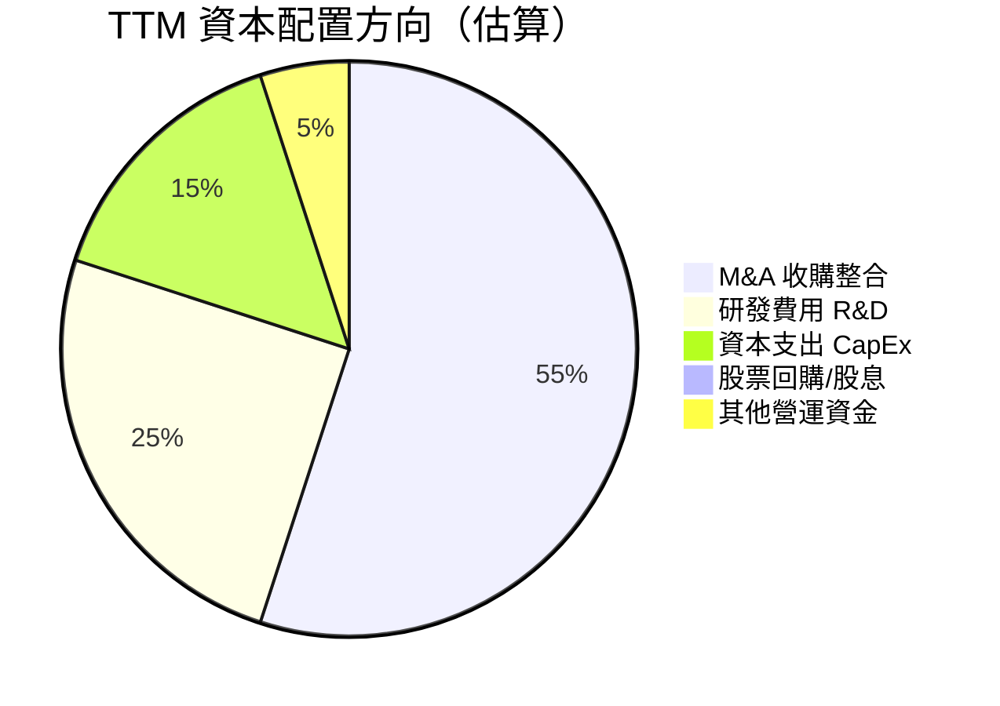

> **資本配置評語**：AVAV 採取**積極收購整合**策略，55%以上資本流向 M&A，這在短期大幅壓縮現金流，但若整合成功，FY2027-2028 或可迎來槓桿效益。目前無股息、無回購，所有資本投向成長。

---

## 6. 獲利能力與資本效率

### 📊 ROE / ROA / ROIC 趨勢

| 財年 | ROE | ROA | ROIC (估算) | 行業均值 ROE | 評估 |
|------|-----|-----|------------|------------|------|
| FY2022 | -0.7% | -0.5% | ~-1.0% | 12-15% | 🔴 |
| FY2023 | -28.0% | -20.5% | ~-25% | 12-15% | 🔴 大額虧損 |
| FY2024 | +8.0% | +6.2% | ~7.5% | 12-15% | 🟡 改善 |
| FY2025 | +5.3% | +4.0% | ~5.0% | 12-15% | 🟡 略降 |
| **TTM** | **-2.6%** | **-1.2%** | **~-3%** | 12-15% | 🔴 惡化 |

---

### ⚖️ ROIC vs WACC 分析

```
╔══════════════════════════════════════════════════════════════╗
║                   ROIC vs WACC 分析                         ║
╠══════════════════════════════════════════════════════════════╣
║                                                              ║
║  WACC 估算：                                                 ║
║  • 無風險利率 (Rf):     4.5%（10年美債）                    ║
║  • 市場風險溢酬 (ERP):  5.5%                                 ║
║  • Beta:               1.239                                 ║
║  • 股權成本 (Ke):       4.5% + 1.239×5.5% = 11.3%          ║
║  • 稅後債務成本 (Kd):   ~5.5% × (1-21%) = 4.3%             ║
║  • 資本結構 D/(D+E):    ~8%                                  ║
║  • WACC ≈ 11.3%×92% + 4.3%×8% ≈ 10.7%                     ║
║                                                              ║
║  TTM ROIC:  約 -3%                                           ║
║  WACC:      約 10.7%                                         ║
║                                                              ║
║  經濟增值 EVA = ROIC - WACC = -3% - 10.7% = -13.7%         ║
║                                                              ║
║  ❌ 結論：AVAV 目前正在 摧毀 股東價值                        ║
║     投資者押注的是 FY2027+ 盈利改善後 ROIC > WACC 的願景    ║
╚══════════════════════════════════════════════════════════════╝

ROIC vs WACC 視覺化：
  WACC   10.7%  ████████████████████████████░░░░ 分水嶺
  ROIC   -3.0%  ←←←← 負值，摧毀價值

  FY2024 ROIC 7.5% ████████████████████░░░░░░░░░░ 距WACC仍差3.2%
  目標FY2027 ROIC: 需達12%+ ████████████████████████████████ 方能創造價值
```

---

### 🔍 DuPont 三因子分解

| 財年 | 淨利率 | 資產週轉率 | 財務槓桿 | **ROE** |
|------|--------|----------|---------|---------|
| FY2024 | 8.3% | 0.70x | 1.24x | **+8.0%** 🟢 |
| FY2025 | 5.3% | 0.73x | 1.26x | **+5.3%** 🟡 |
| TTM | -5.1% | 0.94x | 2.48x | **-2.6%** 🔴 |

> **DuPont 解讀**：TTM 資產週轉率改善至 0.94x（收入快速成長），但淨利率轉負 -5.1% 是 ROE 惡化的核心因子。財務槓桿 2.48x 因收購借款大幅提升，未來需密切觀察利息覆蓋能力。

---

### 📊 獲利能力儀表板

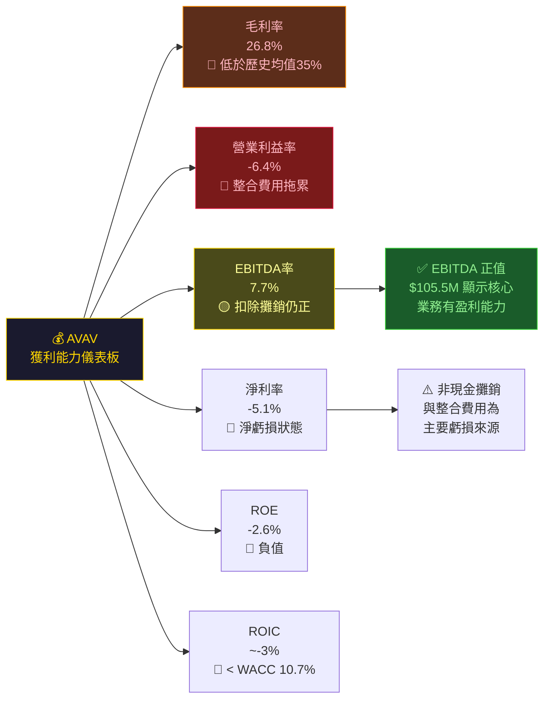

---

## 7. 估值深度分析

### 🔭 同業估值比較表

| 指標 | **AVAV** | **KTOS** (Kratos) | **RGS** (Redwire) | **TDG** (TransDigm) | 評估 |
|------|---------|-------------------|-------------------|---------------------|------|
| 市值 | $13.12B | ~$4.5B | ~$1.2B | ~$50B | — |
| 收入 TTM | $1.37B | ~$1.1B | ~$0.3B | ~$8.2B | — |
| Fwd P/E | **57.3x** 🔴 | ~45x 🔴 | N/M 🔴 | ~35x 🔴 | 全行業高估 |
| EV/EBITDA | **125.6x** 🔴 | ~40x 🔴 | N/M 🔴 | ~25x 🟡 | AVAV 最貴 |
| P/S | **9.6x** 🔴 | ~4.1x 🟡 | ~4.0x 🟡 | ~6.1x 🔴 | 溢價明顯 |
| P/B | **2.96x** 🟡 | ~3.5x 🟡 | N/M | ~N/M | 合理區間 |
| 毛利率 | 26.8% 🟡 | ~24% 🟡 | ~25% 🟡 | ~55% 🟢 | 低於TDG |
| 收入成長 | **+150.7%** 🟢 | ~+15% 🟡 | ~+20% 🟡 | ~+12% 🟡 | **AVAV 遙遙領先** |
| FCF Yield | **-2.43%** 🔴 | ~+1% 🟡 | 負值 🔴 | ~+3% 🟢 | AVAV 最差 |

> **同業估值結論**：AVAV 以最高估值倍數交易，唯一合理化理由是 +150.7% 的爆炸性收入成長。若成長率放緩至 20-30%，估值壓縮風險極大。

---

### 📅 歷史估值區間分析

```
P/S 比率歷史區間（近2年）
═══════════════════════════════════════════════════════

歷史高點  P/S: ~12x    （2025年10月 $369.91 時）
目前      P/S: 9.6x    ████████████████████████░░░░░░
歷史均值  P/S: ~7x     ████████████████████░░░░░░░░░░
歷史低點  P/S: ~3.5x   ██████████░░░░░░░░░░░░░░░░░░░░

                        低估←────────────────→高估

目前所處位置：█████████████████████████░[中高]░░░
             (約處於歷史 65-70 百分位)
═══════════════════════════════════════════════════════
```

---

### 🔢 DCF 敏感性分析

**基礎假設**：
- 基準案：FY2027 收入 $2.0B，EBITDA率 15%，成長率 25%（5年後）
- 樂觀案：FY2027 收入 $2.3B，EBITDA率 18%，成長率 35%
- 悲觀案：FY2027 收入 $1.6B，EBITDA率 10%，成長率 15%

| 情境 | 折現率 10% | 折現率 12% |
|------|-----------|-----------|
| 🟢 **樂觀** | $485 | $420 |
| 🟡 **基準** | $375 | $320 |
| 🔴 **悲觀** | $210 | $175 |

> **DCF 結論**：以基準情境/10% WACC，目標價約 $375，對應現價 $262.73 有 **+42.7% 上行空間**，支持分析師均值 $372 目標價。但悲觀情境目標價 $175-$210，顯示**下行風險達 -20% 至 -33%**。

---

### 📊 估值區間視覺化

```
估值公正價值視覺化（基於 DCF + 同業倍數）
═══════════════════════════════════════════════════════

$100    $150    $200    $250    $300    $350    $400    $450
  |       |       |       |       |       |       |       |
  
  [←──────深度低估──────][─合理區間─][──────高估區間──────→]
                               ↑                    ↑
                         $262.73現價           $372均值目標
  
  悲觀DCF: $175-210    [█████]
  合理區間: $280-380              [██████████████]
  樂觀DCF: $420-485                                   [████]
  
  52W區間: [$102.25 ──────────────────────── $417.86]
           ████████████████████████████████████████
  
  ▶ 結論：現價位於合理區間下緣，具備適度上行潛力
    但估值仍需成長持續驗證
═══════════════════════════════════════════════════════
```

---

## 8. 成長催化劑

### 📅 催化劑時間軸

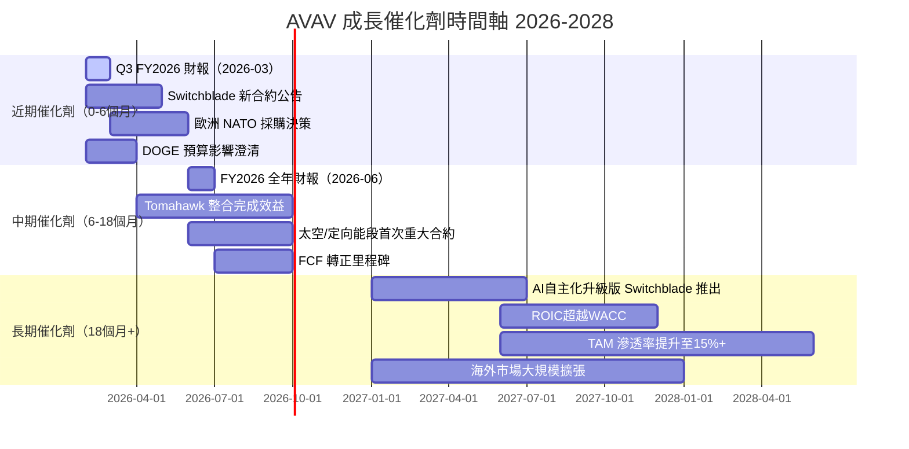

---

### 🌍 TAM 市場規模分析

```
全球小型無人機（SUAS）+ 巡飛彈市場 TAM
═══════════════════════════════════════════════════════

軍用 SUAS 市場（2026E）:   $8.5B  ████████████████████████░░░░░░
巡飛彈市場（2026E）:       $5.2B  ██████████████░░░░░░░░░░░░░░░░
反無人機系統（2026E）:     $3.8B  ██████████░░░░░░░░░░░░░░░░░░░░
太空/定向能（2026E）:      $4.1B  ████████████░░░░░░░░░░░░░░░░░░

合計 TAM（2026E）:        ~$21.6B  ████████████████████████████████

AVAV 2026 預估收入:        ~$1.8B
當前市場滲透率:             ~8.3%  ████████░░░░░░░░░░░░░░░░░░░░░░

2028年 TAM（市場CAGR 15%）: ~$28.6B
目標滲透率 12-15%:          $3.4-4.3B 收入空間
═══════════════════════════════════════════════════════
```

---

### 🚀 成長驅動力分析

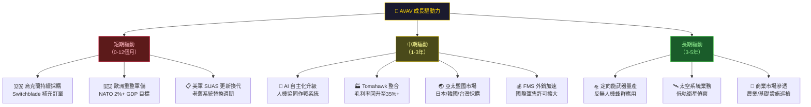

---

## 9. 風險矩陣

### 🎯 風險評分矩陣

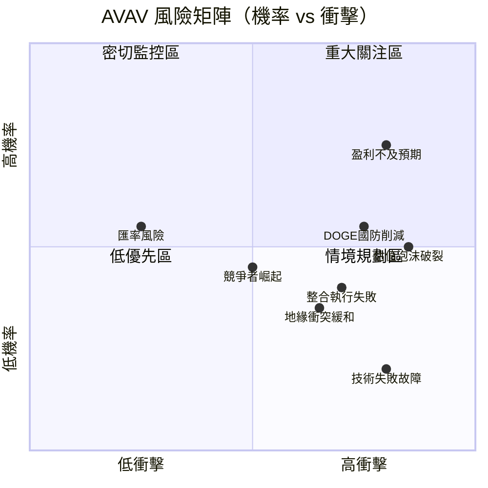

---

### 📋 風險清單詳細分析

| # | 風險項目 | 機率 | 衝擊 | 綜合評分 | 緩解措施 |
|---|---------|------|------|---------|---------|
| 1 | 🔴 **盈利持續不及預期** | 高 65% | 高 | **9/10** | 監控季度毛利率趨勢 |
| 2 | 🔴 **估值過高泡沫破裂** | 中高 55% | 高 | **8.5/10** | 設定嚴格停損 $210 |
| 3 | 🔴 **DOGE/預算削減** | 中高 50% | 高 | **8/10** | 關注 CR/NDAA 進展 |
| 4 | 🟡 **Tomahawk 整合失敗** | 中 35% | 高 | **7/10** | 追蹤毛利率改善進度 |
| 5 | 🟡 **烏克蘭衝突和解** | 中 30% | 中高 | **6/10** | 多元化非烏克蘭客戶 |
| 6 | 🟡 **競爭者新品衝擊** | 中 35% | 中 | **5.5/10** | 持續R&D投入監控 |
| 7 | 🟡 **現金流惡化融資壓力** | 中 40% | 中高 | **6.5/10** | 監控現金跑道 |
| 8 | 🟢 **技術故障/品質問題** | 低 15% | 極高 | **4/10** | 關注客戶滿意度報告 |
| 9 | 🟢 **匯率/利率風險** | 中 45% | 低 | **3/10** | 對沖政策 |
| 10 | 🟢 **關鍵人才流失** | 低 20% | 中 | **3/10** | 薪酬競爭力持續評估 |

---

## 10. 投資建議

### 📊 最終綜合評級雷達圖

```
AVAV 多維度評分雷達圖（1-10分）
═══════════════════════════════════════════════════════════

                    成長性 [8.5]
                       ▲
              ████████████████
           ████            ████
          ██                  ██
財務健康  ██    ╔══════╗    ██  估值合理性
 [6.0] ██    ║ AVAV ║    ██ [4.0]
          ██    ║ 6.1  ║    ██
           ████  ╚══════╝  ████
              ████████████████
                       ▼
                   獲利能力
                    [3.5]

各維度評分詳細：
─────────────────────────────────────────────
基本面品質  ▓▓▓▓▓▓░░░░  5.5/10  ████████████████████░░░░░░░░░░░░
成長性      ▓▓▓▓▓▓▓▓▓░  8.5/10  ████████████████████████████░░░░
獲利能力    ▓▓▓▓░░░░░░  3.5/10  ████████████░░░░░░░░░░░░░░░░░░░░
財務健康    ▓▓▓▓▓▓░░░░  6.0/10  ████████████████████░░░░░░░░░░░░
估值合理性  ▓▓▓▓░░░░░░  4.0/10  ████████████░░░░░░░░░░░░░░░░░░░░
管理執行力  ▓▓▓▓▓░░░░░  5.0/10  ████████████████░░░░░░░░░░░░░░░░
競爭護城河  ▓▓▓▓▓▓▓░░░  6.7/10  ████████████████████████░░░░░░░░
風險控管    ▓▓▓▓░░░░░░  4.5/10  ████████████████░░░░░░░░░░░░░░░░
─────────────────────────────────────────────
加權綜合    ▓▓▓▓▓▓░░░░  6.1/10  ⭐⭐⭐⭐⭐⭐☆☆☆☆
═══════════════════════════════════════════════════════════
```

---

### 🎯 目標價與隱含報酬率

| 情境 | 目標價 | 隱含報酬率 | 機率權重 | 加權貢獻 |
|------|--------|-----------|---------|---------|
| 🟢 **樂觀** | $450 | +71.3% | 25% | +17.8% |
| 🟡 **基準** | $372 | +41.6% | 45% | +18.7% |
| 🔴 **悲觀** | $175 | -33.4% | 30% | -10.0% |
| — | — | **期望報酬** | **100%** | **+26.5%** |

> **風險調整後期望報酬 +26.5%**（12個月）：考量風險後具有吸引力，但波動性極高。

---

### ✅ 買入時機與觸發因素 Checklist

```
買入觸發條件（建議等待至少3項確認）
═══════════════════════════════════════════════════════

✅ 確認觸發因素（出現時考慮建倉）：

□ 1. 季度毛利率回升至 30%+ 並持續兩季
□ 2. 單季 FCF 轉正（哪怕僅輕微正值）
□ 3. 新增 NATO 盟國大型合約公告（$100M+）
□ 4. 股價回測 $220-240 支撐區間（52W均線附近）
□ 5. 連續兩季 EPS 超越市場預期
□ 6. Tomahawk 整合成本明確縮減的管理層指引
□ 7. 美國 NDAA 通過明確無人機採購撥款條目
□ 8. 競爭對手重大負面事件（市場份額重分配機遇）

⚠️ 停損/減碼條件：
□ 1. 毛利率跌破 22%（整合失敗信號）
□ 2. 股價跌破 $200（技術面支撐失守）
□ 3. 分析師連續下修 FY2026 EPS 至 $3以下
□ 4. 重大國防採購合約取消或延遲
═══════════════════════════════════════════════════════
```

---

### 👥 投資人適配度

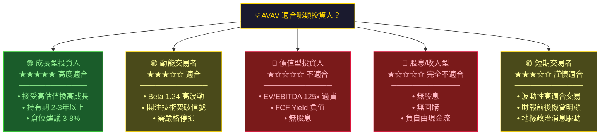

---

### 🔍 關鍵監控指標 Checklist

```
下次財報監控重點（預計 2026年3月 FY2026 Q3 財報）
═══════════════════════════════════════════════════════

📊 財務指標監控：
□ 季度毛利率（目標：≥30%，警戒：<25%）
□ 單季 EBITDA（目標：正值且成長）
□ FCF 趨勢（是否收窄虧損）
□ 管理層 FY2026 全年 EPS 指引（目標：$4.0+）
□ 訂單積壓 Backlog（年末vs年初對比）

🌍 產業數據監控：
□ 美國 FY2027 國防預算法案進展
□ 烏克蘭衝突局勢（停戰談判影響需求）
□ 歐洲各國無人機採購標案結果
□ 競爭對手 KTOS/Shield AI 合約動態

🏢 公司特定事件：
□ Tomahawk 整合進度（毛利率回升關鍵）
□ 新產品發表（Switchblade 300C/600升級）
□ 高管異動（CEO/CFO 穩定性）
□ 機構持股變動（13F 申報，特別注意減持）
□ 分析師評級調整（目前18位，密切追蹤）

⏰ 關鍵日期：
□ 2026-03   FY2026 Q3 財報發布
□ 2026-06   FY2026 全年財報（重大里程碑）
□ 2026-Q1/Q2 NDAA 聽證/通過進程
═══════════════════════════════════════════════════════
```

---

### 🏁 總結圖表

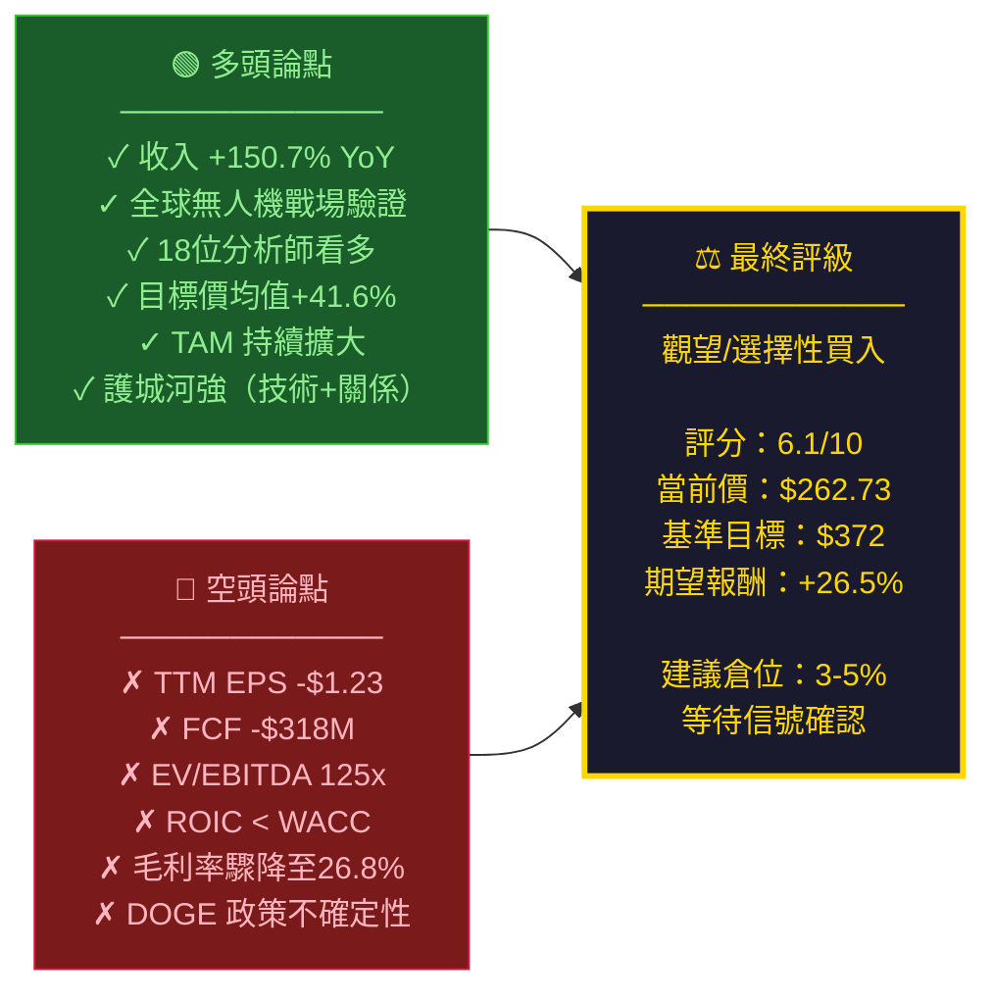

---

> ## ⚠️ 免責聲明
> 
> **本報告為 AI 自動生成之研究分析，僅供教育與研究參考用途，不構成任何投資建議、買賣邀約或財務顧問意見。**
> 
> - 所有財務數據截至 **2026-02-24**，後續可能有重大變化
> - 投資涉及風險，股價可能大幅波動，投資人可能損失全部本金
> - 本報告不考慮個別投資人之財務狀況、風險承受度及投資目標
> - 在做出任何投資決策前，請諮詢持牌專業財務顧問
> - **過去表現不代表未來結果**
> 
> *Report Generated: 2026-02-24 | Analyst: AI CFA Research System | Version: 2.0*