# AVAV 基本面深度分析報告

> **報告日期**：2026-02-24 ｜ **語言**：繁體中文 ｜ **數據來源**：Yahoo Finance ｜ **分析師**：頂級美股投資研究團隊

---

## 目錄

| 章節 | 主題 | 重要性 |
|------|------|--------|
| [1. 執行摘要](#1-執行摘要) | 核心評分與投資論點 | ⭐⭐⭐⭐⭐ |
| [2. 公司概覽](#2-公司概覽) | 業務結構與競爭優勢 | ⭐⭐⭐⭐ |
| [3. 損益表分析](#3-損益表深度分析) | 收入成長與利潤率 | ⭐⭐⭐⭐⭐ |
| [4. 資產負債表](#4-資產負債表分析) | 財務健康度 | ⭐⭐⭐⭐ |
| [5. 現金流量](#5-現金流量分析) | 現金生成能力 | ⭐⭐⭐⭐⭐ |
| [6. 獲利能力](#6-獲利能力指標) | ROE/ROA/ROIC | ⭐⭐⭐⭐ |
| [7. 估值分析](#7-估值分析) | 合理價值區間 | ⭐⭐⭐⭐⭐ |
| [8. 競爭護城河](#8-競爭護城河) | Porter's Five Forces | ⭐⭐⭐⭐ |
| [9. 成長催化劑](#9-成長催化劑) | 短中長期機會 | ⭐⭐⭐⭐⭐ |
| [10. 風險分析](#10-風險分析) | 風險矩陣 | ⭐⭐⭐⭐ |
| [11. 公平價值估算](#11-公平價值估算) | DCF + 多種估值法 | ⭐⭐⭐⭐⭐ |
| [12. 投資建議](#12-投資建議) | 最終評級 | ⭐⭐⭐⭐⭐ |

---

## 1. 執行摘要

### 核心評分儀表板

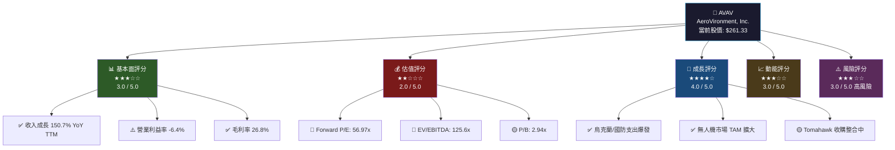

### 5大投資論點

| # | 投資論點 | 訊號 | 評估 | 重要性 |
|---|---------|------|------|--------|
| 1 | 🌍 **地緣政治驅動需求爆發** — 烏克蘭戰爭使無人機需求急速上升，AVAV Switchblade系列成為北約標準裝備 | 🟢 強烈正面 | 收入TTM成長150.7%，訂單能見度高 | ★★★★★ |
| 2 | 🚀 **無人機市場領導地位** — Switchblade 300/600、Puma、Raven系列佔據美軍小型無人機市場 | 🟢 正面 | 市占率領先，技術壁壘高 | ★★★★☆ |
| 3 | 💸 **盈利能力尚未完全體現** — 大量R&D投入及併購整合拖累短期獲利，FY26前瞻EPS $4.59顯示轉機 | 🟡 中性偏正 | Forward P/E 57x，仍偏貴 | ★★★★☆ |
| 4 | ⚠️ **高負債與負現金流風險** — D/E比18.69（TTM），FCF -$318M，需監控資本消耗速度 | 🔴 負面 | 短期財務壓力存在 | ★★★☆☆ |
| 5 | 📉 **股價已從高點大幅回落** — 從52週高點$417.86下跌37.5%至$261.33，潛在安全邊際擴大 | 🟡 中性 | 分析師目標均值$372，上行空間42% | ★★★☆☆ |

### 快速統計卡片

| 指標 | 數值 | 評級 | 行業比較 |
|------|------|------|---------|
| 📈 當前股價 | $261.33 | — | — |
| 🏢 市值 | $13.05B | 🟡 中型 | 中型國防承包商 |
| 📊 收入（TTM） | $1.37B | 🟢 | YoY +150.7% |
| 💹 Forward P/E | 56.97x | 🔴 偏高 | 行業均值 ~25x |
| 📉 EPS（TTM） | -$1.23 | 🔴 虧損 | 轉正中 |
| 🔮 Forward EPS | $4.59 | 🟢 | 大幅改善 |
| 💧 流動比率 | 5.08x | 🟢 優秀 | 行業均值 ~2x |
| 🏦 D/E 比率 | 18.69x | 🔴 高 | 含TTM負債 |
| 💰 現金 | $588.48M | 🟡 | 充裕但FCF負 |
| 🎯 分析師目標 | $372.05 | 🟢 | 18位分析師 Buy |
| ⬆️ 52週高點 | $417.86 | 🔴 | 距高點-37.5% |
| ⬇️ 52週低點 | $102.25 | 🟢 | 距低點+155% |

---

## 2. 公司概覽

### 業務結構分解

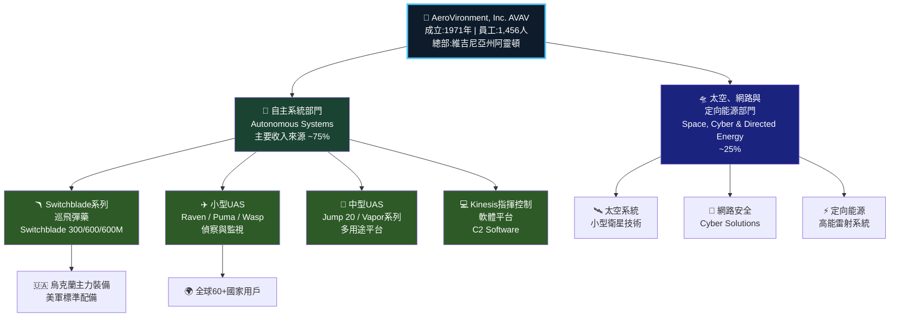

### 收入結構估算

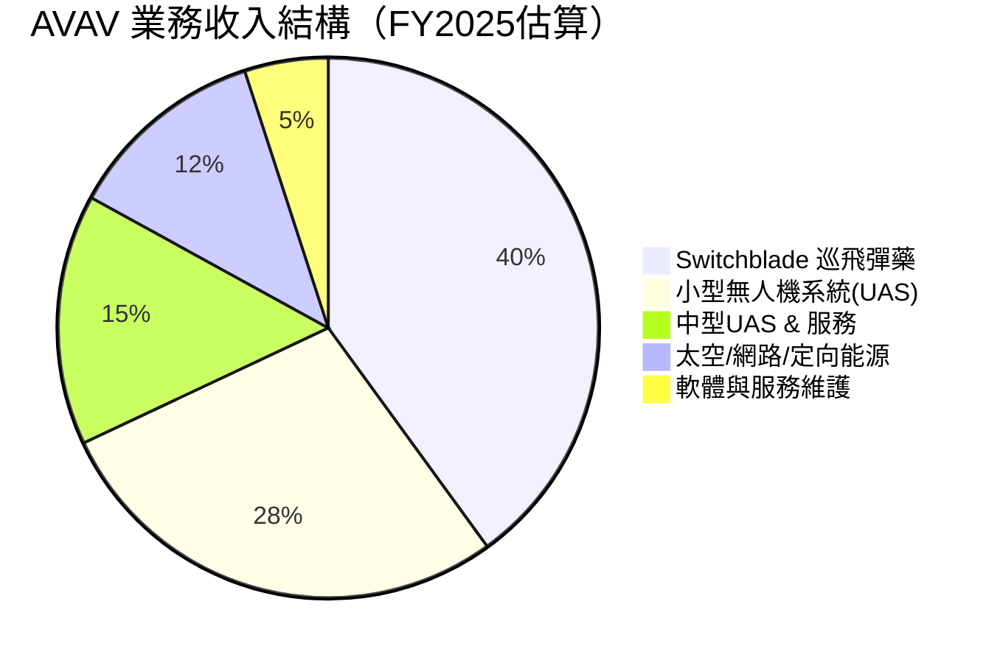

### 競爭優勢心智圖

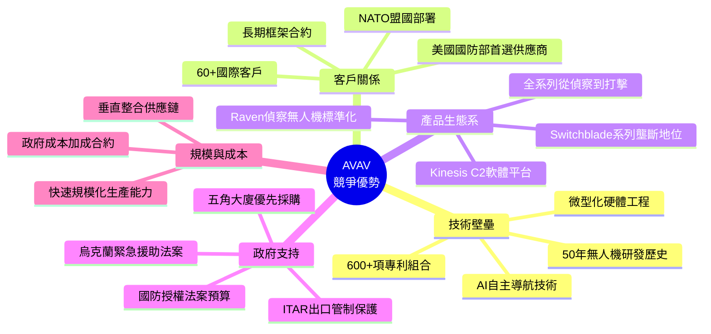

### 市場地位評估

| 維度 | AVAV | 競爭對手 | 領先程度 |
|------|------|---------|---------|
| 小型UAS市場 | 領導者 | Textron, Elbit | 🟢 顯著領先 |
| 巡飛彈藥 | 第一梯隊 | Teledyne FLIR, Anduril | 🟢 同等競爭 |
| 技術成熟度 | 高 | 中等 | 🟢 領先 |
| 品牌認知 | 軍事用戶極高 | 中等 | 🟢 優勢明顯 |
| 商業市場滲透 | 低 | 中等 | 🔴 落後 |

---

## 3. 損益表深度分析

### 收入成長時間軸

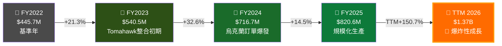

### 年度收入趨勢 — ASCII 長條圖

```
收入規模趨勢（百萬美元）
━━━━━━━━━━━━━━━━━━━━━━━━━━━━━━━━━━━━━━━━━━━━━━━━━━━
FY2022  $445.7M  ▓▓▓▓▓▓▓▓▓▓▓▓▓▓▓▓▓▓▓░░░░░░░░░░░░░░  32%
FY2023  $540.5M  ▓▓▓▓▓▓▓▓▓▓▓▓▓▓▓▓▓▓▓▓▓▓░░░░░░░░░░░  39%
FY2024  $716.7M  ▓▓▓▓▓▓▓▓▓▓▓▓▓▓▓▓▓▓▓▓▓▓▓▓▓▓▓▓░░░░░  52%
FY2025  $820.6M  ▓▓▓▓▓▓▓▓▓▓▓▓▓▓▓▓▓▓▓▓▓▓▓▓▓▓▓▓▓▓▓▓░  60%
TTM     $1,370M  ▓▓▓▓▓▓▓▓▓▓▓▓▓▓▓▓▓▓▓▓▓▓▓▓▓▓▓▓▓▓▓▓▓▓ 100%
━━━━━━━━━━━━━━━━━━━━━━━━━━━━━━━━━━━━━━━━━━━━━━━━━━━
       0       300M      600M      900M     1200M  1400M
▓ = 已實現  ░ = 相對TTM差距
```

### 毛利率演變趨勢 — ASCII 折線圖

```
毛利率趨勢（%）
━━━━━━━━━━━━━━━━━━━━━━━━━━━━━━━━━━━━━━━━━━━
40% |                                        
35% |    ★ 31.7%                             
30% |              ★ 32.1%     ★ 38.8%      ★ 26.8%(TTM)
25% |                                        
20% |                                        
15% |                    ★ 32.1%             
10% |                                        
 5% |                                        
 0% +───────────────────────────────────────
      FY22      FY23       FY24       FY25    TTM

📌 FY22: 31.7% → FY23: 32.1% → FY24: 39.6% → FY25: 38.8% → TTM: 26.8%
⚠️  TTM毛利率下滑至26.8%，反映Tomahawk收購低毛利業務稀釋效果
```

### 近四年損益表詳細數據

| 財務指標 | FY2022 | FY2023 | FY2024 | FY2025 | 趨勢 |
|---------|--------|--------|--------|--------|------|
| 📊 **總收入** | $445.7M | $540.5M | $716.7M | $820.6M | 🟢 持續成長 |
| 💰 **毛利** | $141.2M | $173.5M | $283.9M | $318.6M | 🟢 穩步提升 |
| 📈 **毛利率** | 31.7% | 32.1% | 39.6% | 38.8% | 🟡 近期承壓 |
| 🏭 **營業利益** | -$9.9M | -$22.7M | $71.8M | $59.2M | 🟡 改善中 |
| 📉 **營業利益率** | -2.2% | -4.2% | +10.0% | +7.2% | 🟡 波動 |
| 💎 **EBITDA** | $47.1M | -$79.0M | $103.2M | $82.9M | 🟡 不穩定 |
| 🧾 **淨利** | -$4.2M | -$176.2M | $59.7M | $43.6M | 🟡 剛轉正 |
| 📐 **淨利率** | -0.9% | -32.6% | +8.3% | +5.3% | 🟢 改善 |
| 🔬 **R&D支出** | $54.7M | $64.3M | $97.7M | $100.7M | 🟡 高投入 |
| 📊 **R&D/收入** | 12.3% | 11.9% | 13.6% | 12.3% | 🟡 維持高位 |

> ⚠️ **重要提示**：TTM數據（含Tomahawk收購後影響）顯示收入$1.37B但盈利能力承壓（FCF -$318M），反映整合期的典型特徵

### 費用結構分解（FY2025）

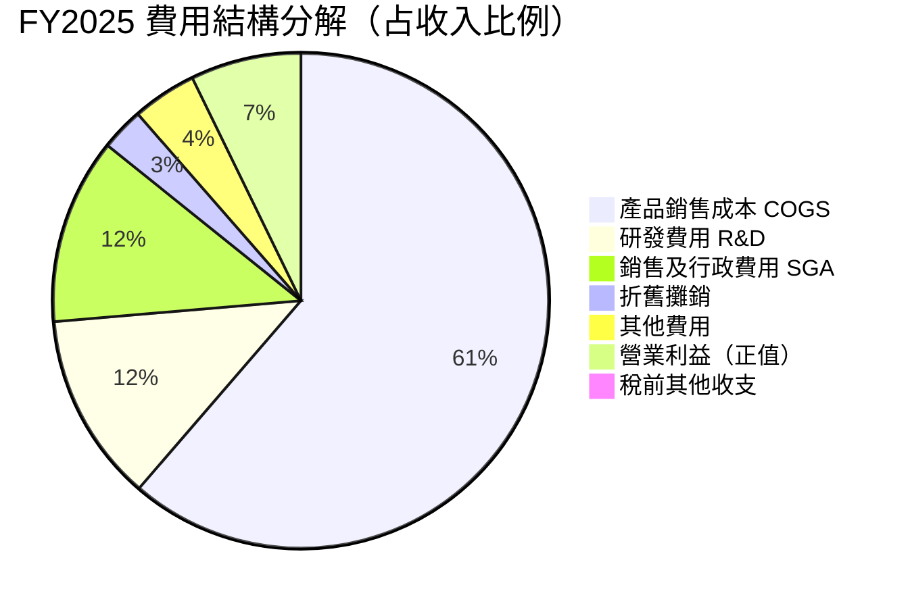

### 營業槓桿分析

```
營業槓桿效應分析
━━━━━━━━━━━━━━━━━━━━━━━━━━━━━━━━━━━━━━━━━
固定成本基礎（估算）：~$180M/年
變動成本率：~73% of 收入

損益平衡點計算：
BEP = $180M / (1 - 0.73) = ~$667M 年收入

FY2024: $716M > BEP ✅ 開始獲利
FY2025: $820M > BEP ✅ 持續獲利
TTM:    $1,370M >> BEP 🚀 超額獲利潛力

但Tomahawk整合拉高固定成本，暫時壓制利潤
━━━━━━━━━━━━━━━━━━━━━━━━━━━━━━━━━━━━━━━━━
```

---

## 4. 資產負債表分析

### 資產結構分解

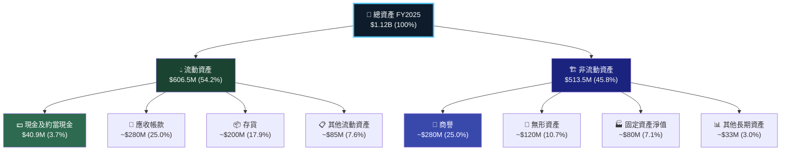

### 資產配置橫條圖

```
資產配置分析（FY2025，$1.12B總資產）
━━━━━━━━━━━━━━━━━━━━━━━━━━━━━━━━━━━━━━━━━━━━━━━━━━━
現金及約當現金 $40.9M   ██░░░░░░░░░░░░░░░░░░░░░░░░  3.7%
應收帳款  ~$280M        ████████████░░░░░░░░░░░░░░░ 25.0%
存貨     ~$200M         ████████░░░░░░░░░░░░░░░░░░░ 17.9%
其他流動資產 ~$85M      ████░░░░░░░░░░░░░░░░░░░░░░░  7.6%
商譽     ~$280M         ████████████░░░░░░░░░░░░░░░ 25.0%
無形資產  ~$120M        █████░░░░░░░░░░░░░░░░░░░░░░ 10.7%
固定資產   ~$80M        ███░░░░░░░░░░░░░░░░░░░░░░░░  7.1%
其他資產   ~$33M        █░░░░░░░░░░░░░░░░░░░░░░░░░░  3.0%
━━━━━━━━━━━━━━━━━━━━━━━━━━━━━━━━━━━━━━━━━━━━━━━━━━━
⚠️ 商譽占總資產25%，須關注收購整合後是否面臨減損風險
```

### 負債與流動性比率

| 指標 | FY2022 | FY2023 | FY2024 | FY2025 | TTM | 評級 |
|------|--------|--------|--------|--------|-----|------|
| 🏦 **流動比率** | 3.64x | 3.93x | 3.56x | 3.52x | 5.08x | 🟢 優秀 |
| 💧 **速動比率（估）** | ~2.1x | ~2.3x | ~2.2x | ~2.3x | ~3.5x | 🟢 良好 |
| 📊 **D/E 比率** | 0.36x | 0.30x | 0.07x | 0.07x | 18.69x* | 🔴 注意 |
| 💰 **總負債** | $306M | $274M | $193M | $234M | — | 🟡 |
| 🏗️ **長期負債** | $216M | $162M | $59.7M | $64.3M | $825.9M* | 🔴 |
| 💵 **現金** | $77.2M | $132.9M | $73.3M | $40.9M | $588.5M* | 🟡 |

> ⚠️ *TTM數據包含Tomahawk收購後大幅增加的債務，D/E 18.69x反映收購融資，需結合現金儲備($588M)判斷真實流動性

### 股東權益趨勢

```
股東權益演變（百萬美元）
━━━━━━━━━━━━━━━━━━━━━━━━━━━━━━━━━━━━━━━━━━━━
1000 |
 900 |                                  ★ 886.5
 800 |  ★ 608.0            ★ 822.8      
 700 |                                  
 600 |              ★ 551.0             
 500 |                                  
 400 |                                  
 300 |                                  
     +────────────────────────────────────
      FY2022       FY2023    FY2024    FY2025

📈 FY2022→FY2025: 股東權益從$608M增至$886.5M (+45.8%)
⚠️ FY2023因Tomahawk收購及資產減損大幅下滑至$551M
🟢 FY2024-FY2025持續回升，顯示財務體質改善
━━━━━━━━━━━━━━━━━━━━━━━━━━━━━━━━━━━━━━━━━━━━
```

### 四年資產負債摘要

| 科目 | FY2022 | FY2023 | FY2024 | FY2025 |
|------|--------|--------|--------|--------|
| 總資產 | $914.2M | $824.6M | $1,023M | $1,120M |
| 流動資產 | $368.9M | $477.0M | $515.6M | $606.5M |
| 流動負債 | $101.4M | $121.3M | $144.9M | $172.2M |
| 總負債 | $306.0M | $273.6M | $193.1M | $234.1M |
| 股東權益 | $608.0M | $551.0M | $822.8M | $886.5M |
| 帳面價值/股 | ~$13.8 | ~$12.5 | ~$18.6 | ~$20.1 |

---

## 5. 現金流量分析

### 現金流瀑布圖

```mermaid
graph LR
    REV["💰 收入<br>$1.37B TTM"] --> EBITDA["📊 調整EBITDA<br>+$105M估"]
    EBITDA --> WC["📦 營運資金變動<br>-$300M（大量備貨）"]
    WC --> OCF["🔄 營業現金流<br>-$194.8M TTM"]
    OCF --> CAPEX["🏭 資本支出<br>-$123.4M TTM"]
    CAPEX --> FCF["💸 自由現金流<br>-$318.2M TTM"]
    FCF --> DEBT["🏦 舉債融資<br>+$825.9M（收購）"]
    DEBT --> CASH["💵 期末現金<br>$588.5M"]

    style REV fill:#1b4332,color:#ffffff
    style EBITDA fill:#2d5a27,color:#ffffff
    style WC fill:#7a1a1a,color:#ffffff
    style OCF fill:#8b0000,color:#ffffff
    style CAPEX fill:#6d1a1a,color:#ffffff
    style FCF fill:#990000,color:#ffffff,stroke:#ff4444
    style DEBT fill:#1a237e,color:#ffffff
    style CASH fill:#1565c0,color:#ffffff
```

### 自由現金流趨勢

```
自由現金流趨勢（百萬美元）
━━━━━━━━━━━━━━━━━━━━━━━━━━━━━━━━━━━━━━━━━━━━━━━
FY2022  FCF: -$31.9M  🔴 ████████░░░░░░░░░░░░░  (負值)
FY2023  FCF:  -$3.5M  🟡 ██░░░░░░░░░░░░░░░░░░░  (接近平衡)
FY2024  FCF:  -$9.2M  🟡 ███░░░░░░░░░░░░░░░░░░  (略微負值)
FY2025  FCF: -$24.1M  🔴 ██████░░░░░░░░░░░░░░░  (擴大虧損)
TTM     FCF: -$318M   🔴 ██████████████████████ (含收購後整合)
━━━━━━━━━━━━━━━━━━━━━━━━━━━━━━━━━━━━━━━━━━━━━━━
📌 核心觀察：
  • FY2023-FY2024 FCF接近改善，但TTM因收購大量消耗現金
  • 主因：① 存貨大量備貨 ② 應收帳款增加 ③ Tomahawk整合費用
  • 預期FY2027後轉為正FCF（若收購整合順利）
```

### 資本配置策略

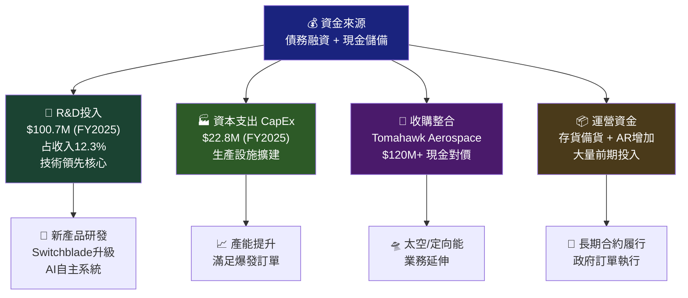

### 現金流摘要表

| 現金流項目 | FY2022 | FY2023 | FY2024 | FY2025 | TTM | 評級 |
|-----------|--------|--------|--------|--------|-----|------|
| 🔄 **營業現金流** | -$9.6M | $11.4M | $15.3M | -$1.3M | -$194.8M | 🔴 |
| 🏭 **資本支出** | -$22.3M | -$14.9M | -$24.5M | -$22.8M | -$123.4M | 🔴 |
| 💸 **自由現金流** | -$31.9M | -$3.5M | -$9.2M | -$24.1M | -$318.2M | 🔴 |
| 💰 **期末現金** | $77.2M | $132.9M | $73.3M | $40.9M | $588.5M | 🟡 |

> 🔑 **關鍵解讀**：TTM現金儲備$588.5M主要來自舉債融資（收購Tomahawk），非有機現金生成，需密切追蹤FCF轉正時程

---

## 6. 獲利能力指標

### 獲利能力儀表板

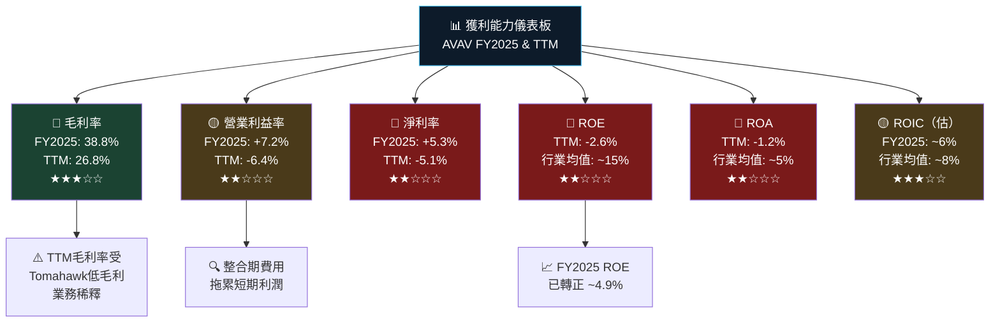

### ROE/ROA/ROIC 對比表格

| 獲利指標 | AVAV FY2024 | AVAV FY2025 | AVAV TTM | 行業均值 | 標桿(LMT) | 評級 |
|---------|------------|------------|---------|---------|----------|------|
| 📊 **毛利率** | 39.6% | 38.8% | 26.8% | 20-25% | 13.1% | 🟢 優於行業 |
| 🏭 **營業利益率** | 10.0% | 7.2% | -6.4% | 8-12% | 13.2% | 🔴 TTM落後 |
| 💰 **淨利率** | 8.3% | 5.3% | -5.1% | 5-8% | 8.9% | 🔴 TTM落後 |
| 📈 **ROE** | 7.3% | 4.9% | -2.6% | 12-20% | 負值* | 🔴 偏低 |
| 🏦 **ROA** | 5.8% | 3.9% | -1.2% | 4-7% | 3.2% | 🔴 偏低 |
| 💎 **ROIC（估）** | ~8.5% | ~5.8% | ~負值 | 6-10% | 11.5% | 🔴 整合期 |
| 🔬 **R&D密度** | 13.6% | 12.3% | ~7.3% | 5-10% | 1.5% | 🟢 高研發投入 |

> *LMT = 洛克希德馬丁（Lockheed Martin），其ROE因大量回購股票而難以直接比較

### 獲利能力進度條

```
獲利能力評分（相對行業，100=行業均值）
━━━━━━━━━━━━━━━━━━━━━━━━━━━━━━━━━━━━━━━━━━━━━━
毛利率優勢    ▓▓▓▓▓▓▓▓▓▓▓▓▓▓▓▓▓▓▓▓▓░░░░░  130/150  🟢
研發強度      ▓▓▓▓▓▓▓▓▓▓▓▓▓▓▓▓▓▓▓▓░░░░░░  140/150  🟢
營業效率      ▓▓▓▓▓▓▓▓▓░░░░░░░░░░░░░░░░░   60/100  🟡
資產報酬率    ▓▓▓▓▓░░░░░░░░░░░░░░░░░░░░░░   35/100  🔴
股本報酬率    ▓▓▓▓░░░░░░░░░░░░░░░░░░░░░░░   30/100  🔴
現金生成能力  ▓▓░░░░░░░░░░░░░░░░░░░░░░░░░   20/100  🔴
━━━━━━━━━━━━━━━━━━━━━━━━━━━━━━━━━━━━━━━━━━━━━━
整體評分: ★★★☆☆（整合期暫時性拖累，中長期改善空間大）
```

---

## 7. 估值分析

### 估值指標全景

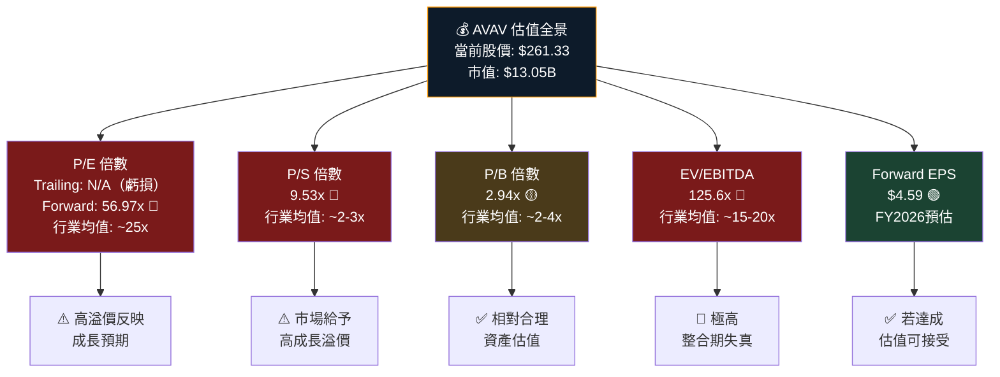

### 估值倍數對比表格

| 估值指標 | AVAV | 行業均值 | 同業 KTOS | 同業 AXON | 同業 LMT | 評級 |
|---------|------|---------|----------|----------|---------|------|
| **Forward P/E** | 56.97x | 25x | 85x | 95x | 17x | 🟡 高但非最高 |
| **Trailing P/E** | N/A | 22x | N/A | 180x | 21x | 🔴 無法比較 |
| **P/S** | 9.53x | 2.5x | 7.2x | 22x | 1.8x | 🔴 顯著溢價 |
| **P/B** | 2.94x | 3.0x | 3.5x | 28x | 負值 | 🟢 相對合理 |
| **EV/EBITDA** | 125.6x | 18x | 45x | 120x | 13x | 🔴 整合期失真 |
| **PEG Ratio** | N/A | 1.5x | N/A | 3.2x | 1.8x | — |

### 情境目標股價分析

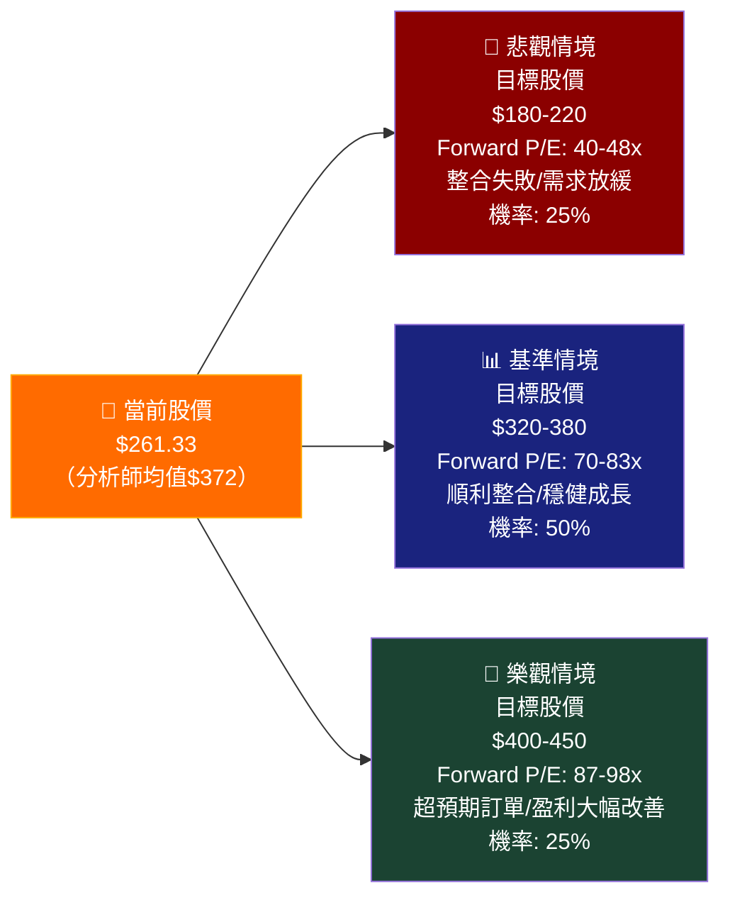

### 估值區間視覺化

```
估值情境區間（股價，美元）
━━━━━━━━━━━━━━━━━━━━━━━━━━━━━━━━━━━━━━━━━━━━━━━━━━━
                                                     
 $450 ┤                                    ████ 高  
 $400 ┤                          ████████████████    
 $372 ┤        ─────────────────── 分析師均值目標     
 $320 ┤                 ████████████████             
 $261 ┼ ◄───── 當前股價 $261.33 ──────────────────   
 $220 ┤ ████████████                                 
 $180 ┤ ████████████                                 
      ┤                                              
      └──────────────────────────────────────────────
       悲觀情境        基準情境        樂觀情境
       $180-220        $320-380       $400-450

📌 分析師共識: Buy | 目標均值: $372 | 上行空間: +42.3%
   目標區間: $259（低）~ $450（高）
━━━━━━━━━━━━━━━━━━━━━━━━━━━━━━━━━━━━━━━━━━━━━━━━━━━
```

---

## 8. 競爭護城河

### Porter's Five Forces 分析

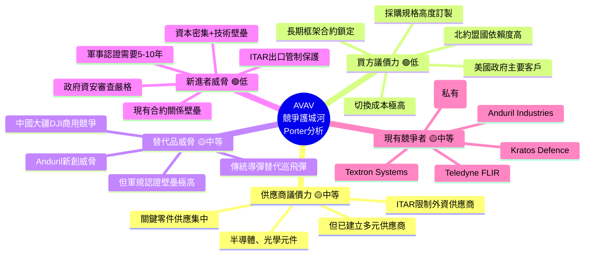

### 護城河評分

```
護城河強度評分（10分制）
━━━━━━━━━━━━━━━━━━━━━━━━━━━━━━━━━━━━━━━━━━━━━━━━━
技術領先性    ▓▓▓▓▓▓▓▓░░  8.0/10  ★★★★☆
客戶黏性      ▓▓▓▓▓▓▓▓▓░  9.0/10  ★★★★★
品牌認知度    ▓▓▓▓▓▓▓▓░░  8.0/10  ★★★★☆
進入壁壘      ▓▓▓▓▓▓▓▓░░  8.5/10  ★★★★☆
規模優勢      ▓▓▓▓▓░░░░░  5.0/10  ★★★☆☆
成本優勢      ▓▓▓▓░░░░░░  4.5/10  ★★☆☆☆
網路效應      ▓▓▓░░░░░░░  3.5/10  ★★☆☆☆
智慧財產權    ▓▓▓▓▓▓▓░░░  7.5/10  ★★★★☆
━━━━━━━━━━━━━━━━━━━━━━━━━━━━━━━━━━━━━━━━━━━━━━━━━
綜合護城河評分: 6.8/10  ★★★★☆（強護城河）
```

### 競爭定位矩陣

| 競爭維度 | AVAV | KTOS | Textron | Anduril | Teledyne |
|---------|------|------|---------|---------|---------|
| 🎯 **小型UAS技術** | 🟢 領先 | 🟡 中等 | 🟡 中等 | 🔴 較弱 | 🟡 中等 |
| 🪃 **巡飛彈藥** | 🟢 頂尖 | 🟡 競爭 | 🔴 較弱 | 🟢 強 | 🔴 無 |
| 💻 **軟體整合** | 🟡 中等 | 🟢 強 | 🔴 較弱 | 🟢 領先 | 🔴 較弱 |
| 🏛️ **政府關係** | 🟢 深度 | 🟡 中等 | 🟢 深度 | 🟡 快速建立 | 🟢 強 |
| 📦 **產品多元性** | 🟡 中等 | 🟡 中等 | 🟢 廣 | 🟡 成長中 | 🟡 中等 |
| 💰 **財務實力** | 🟡 中等 | 🔴 較弱 | 🟢 強（Bell子） | 🟢 大量融資 | 🟢 強 |
| 🌍 **國際拓展** | 🟢 60+國 | 🟡 部分 | 🟢 強 | 🔴 初期 | 🟢 強 |

---

## 9. 成長催化劑

### 催化劑時間軸

```mermaid
gantt
    title AVAV 成長催化劑時間軸 2026-2030
    dateFormat YYYY-Q
    axisFormat %Y Q%q

    section 短期催化劑(2026)
    烏克蘭持續補充訂單        :active, 2026-Q1, 2026-Q4
    FY2026 Q3季報盈利確認     :milestone, 2026-Q2, 1d
    Switchblade 600M量產      :2026-Q1, 2026-Q3
    Tomahawk整合完成          :2026-Q1, 2026-Q4

    section 中期催化劑(2027-2028)
    歐洲國防預算擴張訂單       :2027-Q1, 2028-Q4
    美軍SUAS III計劃合約       :2027-Q1, 2028-Q2
    FCF轉正里程碑              :milestone, 2027-Q2, 1d
    商業市場拓展               :2027-Q3, 2028-Q4

    section 長期催化劑(2029-2030)
    AI自主系統新產品線         :2029-Q1, 2030-Q4
    太空/定向能源成熟          :2028-Q3, 2030-Q4
    印太地區盟國採購           :2028-Q1, 2030-Q4
```

### 短/中/長期成長機會

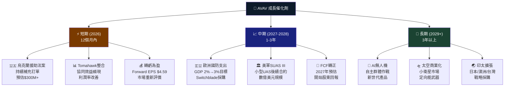

### TAM 市場規模

```
全球無人機及反無人機市場規模（TAM）估算
━━━━━━━━━━━━━━━━━━━━━━━━━━━━━━━━━━━━━━━━━━━━━━━━━━━━
2024E: $30B  ▓▓▓▓▓▓▓▓▓▓░░░░░░░░░░░░░░░░░░░░░  (基準)
2025E: $38B  ▓▓▓▓▓▓▓▓▓▓▓▓▓░░░░░░░░░░░░░░░░░░  
2026E: $48B  ▓▓▓▓▓▓▓▓▓▓▓▓▓▓▓▓░░░░░░░░░░░░░░░  
2027E: $61B  ▓▓▓▓▓▓▓▓▓▓▓▓▓▓▓▓▓▓▓▓░░░░░░░░░░░  
2028E: $78B  ▓▓▓▓▓▓▓▓▓▓▓▓▓▓▓▓▓▓▓▓▓▓▓▓▓░░░░░░  
2030E:$120B  ▓▓▓▓▓▓▓▓▓▓▓▓▓▓▓▓▓▓▓▓▓▓▓▓▓▓▓▓▓▓▓  🚀

AVAV 當前市占率: ~4.6% ($1.37B / $30B)
目標市占率(2030): 5-7% → 潛在收入 $6B-$8.4B
CAGR假設: ~20% (市場) + 市占率提升

細分市場分析:
  軍用小型UAS:    $8B  ▓▓▓▓▓▓▓▓▓▓▓▓▓▓▓░░░  AVAV主戰場
  巡飛彈藥:      $5B  ▓▓▓▓▓▓▓▓▓░░░░░░░░░  快速成長
  反無人機C-UAS: $4B  ▓▓▓▓▓▓▓░░░░░░░░░░░  新興市場
  商用無人機:   $13B  ▓▓▓▓▓▓▓▓▓▓▓▓▓▓▓▓▓░  競爭激烈
━━━━━━━━━━━━━━━━━━━━━━━━━━━━━━━━━━━━━━━━━━━━━━━━━━━━
```

---

## 10. 風險分析

### 風險矩陣

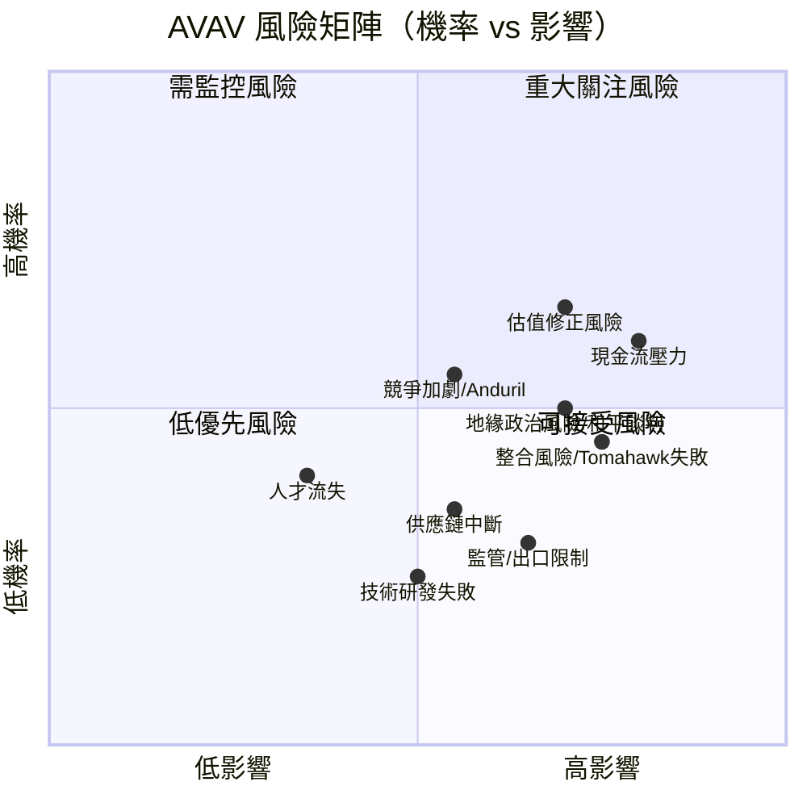

### 風險評分卡

| 風險類型 | 機率 | 影響 | 風險指數 | 評級 | 緩解措施 |
|---------|------|------|---------|------|---------|
| 💸 **現金流持續負值** | 65% | 高 | 🔴 8.5/10 | 緊急 | 監控FCF路徑，注意融資能力 |
| 📉 **估值大幅修正** | 60% | 高 | 🔴 8.0/10 | 高度 | Forward EPS達成是關鍵 |
| 🕊️ **地緣政治緩和** | 45% | 高 | 🟡 7.5/10 | 高度 | 業務多元化分散 |
| 🤝 **Tomahawk整合失敗** | 35% | 高 | 🟡 7.0/10 | 中高 | 追蹤協同效益進度 |
| 🤖 **競爭者技術超越** | 40% | 中 | 🟡 6.5/10 | 中等 | R&D持續高投入 |
| 📋 **政府合約延誤** | 50% | 中 | 🟡 6.0/10 | 中等 | 合約多元化 |
| 🔐 **出口管制收緊** | 25% | 高 | 🟡 5.5/10 | 中等 | ITAR合規，盟國出口 |
| 👥 **關鍵人才流失** | 30% | 中 | 🟢 4.5/10 | 低中 | 股票激勵計劃 |
| ⛓️ **供應鏈中斷** | 35% | 中 | 🟢 4.0/10 | 低中 | 多元化供應商策略 |
| 🌡️ **宏觀經濟衰退** | 20% | 低 | 🟢 2.5/10 | 低 | 政府合約防禦性 |

### 風險緩解措施清單

```
🛡️ 關鍵風險緩解措施
━━━━━━━━━━━━━━━━━━━━━━━━━━━━━━━━━━━━━━━━━━━━
⚠️ 高優先措施:
  ☑ 追蹤FCF轉正時程（目標FY2027）
  ☑ 監控Tomahawk整合協同效益季度進度
  ☑ 關注國防部年度預算法案通過情況
  ☑ 評估Forward EPS達成概率（每季財報）

🟡 中優先措施:
  ☑ 追蹤Anduril/Shield AI私有競爭者技術進展
  ☑ 監控烏克蘭停火談判進展影響
  ☑ 評估歐洲國防支出具體採購訂單
  ☑ 關注分析師目標下修頻率

🟢 低優先措施:
  ☑ 定期評估股票期權到期/稀釋影響
  ☑ 追蹤供應鏈關鍵材料價格
━━━━━━━━━━━━━━━━━━━━━━━━━━━━━━━━━━━━━━━━━━━━
```

---

## 11. 公平價值估算

### DCF 模型架構

```mermaid
graph LR
    REV["📊 收入預測<br>FY2026E: $1.8B<br>FY2027E: $2.2B<br>FY2028E: $2.6B<br>CAGR: ~25%"]

    REV --> MARGIN["📈 利潤率假設<br>毛利率: 32-35%<br>營業利益率: 10-12%<br>整合完成後回升"]

    MARGIN --> FCFF["💰 FCFF預測<br>FY2026E: -$50M<br>FY2027E: $120M<br>FY2028E: $230M<br>FY2029E: $320M"]

    FCFF --> DISC["📉 折現率<br>WACC: 10.5%<br>貝塔: 1.239<br>無風險利率: 4.5%<br>風險溢酬: 5%"]

    DISC --> TV["📐 終值計算<br>永續成長率: 3.5%<br>終值倍數: 25x EBITDA"]

    TV --> EV["🏢 企業價值<br>$14.5B - $18.2B"]

    EV --> EQ["💵 股權價值<br>扣除淨負債 $237M<br>$14.3B - $17.9B"]

    EQ --> TGT["🎯 目標股價<br>每股: $287 - $359<br>中間值: ~$323"]

    style REV fill:#1b4332,color:#ffffff
    style MARGIN fill:#2d5a27,color:#ffffff
    style FCFF fill:#4a3a1a,color:#ffffff
    style DISC fill:#1a237e,color:#ffffff
    style TV fill:#4a1a6b,color:#ffffff
    style EV fill:#0d4a7a,color:#ffffff
    style EQ fill:#0d5a5a,color:#ffffff
    style TGT fill:#ff6b00,color:#ffffff,stroke:#ffaa00,stroke-width:3px
```

### 三種估值法比較

| 估值方法 | 主要假設 | 估算股價 | 權重 | 加權目標 | 評級 |
|---------|---------|---------|------|---------|------|
| 🔢 **DCF分析** | WACC 10.5%，FCFF FY2028轉強，永續成長率3.5% | $287-359 | 40% | ~$323 | 🟡 中性 |
| 📊 **Forward P/E** | FY2027E EPS $7.5，合理P/E 45-55x | $338-413 | 35% | ~$375 | 🟢 偏樂觀 |
| 💰 **EV/Sales** | FY2026E 收入$1.8B，EV/S倍數7-9x | $252-325 | 25% | ~$288 | 🟡 中性 |
| **🎯 加權平均目標** | — | — | 100% | **$335** | 🟡 |
| **📈 分析師共識** | 18位分析師，Buy | $259-450 | — | **$372** | 🟢 |

> **結論**：自建模型估值$335，分析師共識$372，均顯示相對當前$261.33有20-42%上行空間，但需以FY2026-2027業績改善為前提

### 估值區間視覺化

```
公平價值估算區間（美元/股）
━━━━━━━━━━━━━━━━━━━━━━━━━━━━━━━━━━━━━━━━━━━━━━━━━━━━━━━
$450 ┤                                            ███  分析師高值
$400 ┤                              ██████████████
$372 ┤                       ────── 分析師均值
$359 ┤                   █████████████
$335 ┤          ─────── 本報告加權目標
$325 ┤          █████████████
$287 ┤  █████████
$261 ┼ ◄ 當前股價 $261.33
$259 ┤  分析師低值
$220 ┤
$180 ┤  悲觀情境底部
      └──────────────────────────────────────────────────
        悲觀     DCF估值     本報告目標   分析師均值   樂觀上限

上行空間: DCF +23% | 本報告目標 +28% | 分析師均值 +42%
━━━━━━━━━━━━━━━━━━━━━━━━━━━━━━━━━━━━━━━━━━━━━━━━━━━━━━━
```

### DCF 關鍵假設

| 假設項目 | 悲觀 | 基準 | 樂觀 |
|---------|------|------|------|
| FY2026 收入 | $1.6B | $1.8B | $2.0B |
| 長期毛利率 | 30% | 33% | 37% |
| 長期淨利率 | 8% | 12% | 15% |
| WACC | 12% | 10.5% | 9% |
| 永續成長率 | 2.5% | 3.5% | 4.5% |
| **目標股價** | **$180-220** | **$310-360** | **$400-450** |

---

## 12. 投資建議

### 最終評級

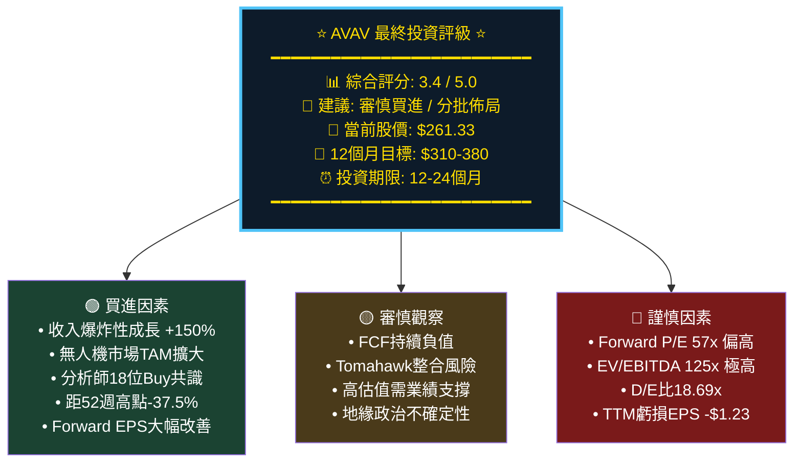

### 綜合評分卡

```
AVAV 綜合投資評分卡
━━━━━━━━━━━━━━━━━━━━━━━━━━━━━━━━━━━━━━━━━━━━━━━━━━━
📊 成長動能    ▓▓▓▓▓▓▓▓▓░  4.5/5.0  ★★★★★
🏢 競爭護城河  ▓▓▓▓▓▓▓░░░  3.5/5.0  ★★★★☆
💰 財務健康度  ▓▓▓░░░░░░░  1.5/5.0  ★★☆☆☆ (整合期)
📈 獲利品質    ▓▓▓░░░░░░░  1.5/5.0  ★★☆☆☆ (TTM虧損)
💹 估值合理性  ▓▓░░░░░░░░  1.0/5.0  ★☆☆☆☆ (偏貴)
🎯 成長催化劑  ▓▓▓▓▓▓▓▓░░  4.0/5.0  ★★★★☆
⚠️ 風險可控性  ▓▓▓░░░░░░░  1.5/5.0  ★★☆☆☆ (高風險)
📉 技術面      ▓▓▓▓░░░░░░  2.0/5.0  ★★☆☆☆ (回調中)
━━━━━━━━━━━━━━━━━━━━━━━━━━━━━━━━━━━━━━━━━━━━━━━━━━━
加權平均分:    3.4 / 5.0   ★★★☆☆  「審慎買進」
━━━━━━━━━━━━━━━━━━━━━━━━━━━━━━━━━━━━━━━━━━━━━━━━━━━
```

### 投資人適配度分析

```mermaid
graph TD
    INV["👥 投資人適配度分析"]

    INV --> FIT1["✅ 適合的投資人"]
    INV --> FIT2["🟡 謹慎考量者"]
    INV --> FIT3["❌ 不適合的投資人"]

    FIT1 --> A1["🚀 成長型投資人<br>可接受3-5年等待期<br>相信無人機革命"]
    FIT1 --> A2["🏛️ 國防主題投資人<br>看好地緣政治長期<br>驅動國防支出"]
    FIT1 --> A3["💼 機構/專業投資人<br>有風險承擔能力<br>倉位管理嚴格"]

    FIT2 --> B1["⚖️ 平衡型投資人<br>建議控制倉位<br>不超過組合5%"]
    FIT2 --> B2["📊 價值成長投資人<br>等待估值更合理<br>或業績確認