# AVAV 基本面深度分析報告
> **報告日期**：2026-02-26 ｜ **語言**：繁體中文 ｜ **數據來源**：Yahoo Finance ｜ **分析師**：AI CFA Research

---

## 目錄

1. [執行摘要](#1-執行摘要)
2. [公司概覽與商業模式](#2-公司概覽與商業模式)
3. [損益表深度分析](#3-損益表深度分析)
4. [資產負債表分析](#4-資產負債表分析)
5. [現金流量深度分析](#5-現金流量深度分析)
6. [獲利能力與資本效率](#6-獲利能力與資本效率)
7. [估值深度分析](#7-估值深度分析)
8. [成長催化劑](#8-成長催化劑)
9. [風險矩陣](#9-風險矩陣)
10. [投資建議](#10-投資建議)

---

## 1. 執行摘要

### 1.1 核心評分儀表板

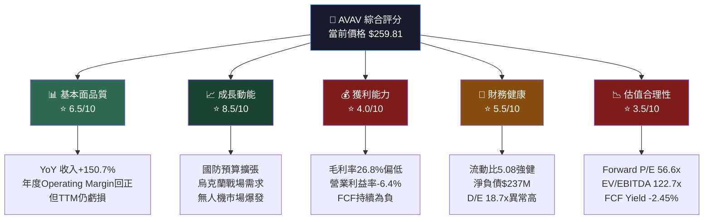

### 1.2 核心評分一覽

```
維度評分儀表板 (滿分10分)
━━━━━━━━━━━━━━━━━━━━━━━━━━━━━━━━━━━━━━━━━━━━━
基本面品質  ▓▓▓▓▓▓▓░░░  6.5/10  📊
成長動能    ▓▓▓▓▓▓▓▓▓░  8.5/10  📈
獲利能力    ▓▓▓▓░░░░░░  4.0/10  💸
財務健康    ▓▓▓▓▓▓░░░░  5.5/10  🏦
估值合理性  ▓▓▓░░░░░░░  3.5/10  📉
管理品質    ▓▓▓▓▓▓░░░░  6.0/10  👔
競爭護城河  ▓▓▓▓▓▓▓░░░  7.0/10  🏰
━━━━━━━━━━━━━━━━━━━━━━━━━━━━━━━━━━━━━━━━━━━━━
綜合加權    ▓▓▓▓▓▓░░░░  5.9/10  ⚖️
```

### 1.3 五大投資論點 + 三大核心風險

| 類型 | 項目 | 說明 | 重要性 |
|------|------|------|--------|
| 🟢 **投資論點1** | 收入爆炸性成長 | TTM收入$1.37B，YoY+150.7%，來自Tomahawk Robotics及BlueHalo整併效益 | ⭐⭐⭐⭐⭐ |
| 🟢 **投資論點2** | 地緣政治順風車 | 俄烏衝突持續推升Switchblade系列彈藥無人機需求，NATO盟國擴大採購 | ⭐⭐⭐⭐⭐ |
| 🟢 **投資論點3** | 新興業務潛力 | Space、Cyber及Directed Energy業務快速崛起，多元化降低單一市場依賴 | ⭐⭐⭐⭐ |
| 🟢 **投資論點4** | 機構背書強勁 | 92.5%機構持股，JP Morgan、Goldman Sachs、Needham等頂級機構均給予買入 | ⭐⭐⭐⭐ |
| 🟢 **投資論點5** | 技術壟斷地位 | Puma、Raven、Switchblade等多款產品在小型無人機領域佔據壟斷地位 | ⭐⭐⭐⭐ |
| 🔴 **風險1** | 估值極度偏高 | Forward P/E 56.6x、EV/EBITDA 122.7x，任何盈利不及預期均將引發大幅修正 | ⭐⭐⭐⭐⭐ |
| 🔴 **風險2** | 現金流持續失血 | FCF -$318M（TTM），Operating CF -$194.84M，資金消耗速度令人憂慮 | ⭐⭐⭐⭐⭐ |
| 🟡 **風險3** | 整併消化風險 | 近期大型收購（BlueHalo等）帶來高額商譽與整合不確定性，D/E高達18.7x | ⭐⭐⭐⭐ |

### 1.4 快速統計卡片

| 指標 | AVAV | 航太國防行業均值 | 評估 |
|------|------|-----------------|------|
| 市值 | $12.97B | — | 🟡 中型股 |
| 收入(TTM) | $1.37B | — | 🟢 快速擴張 |
| 收入YoY成長 | +150.7% | ~5-8% | 🟢 遠超行業 |
| 毛利率 | 26.8% | ~20-25% | 🟡 略高行業 |
| 營業利益率 | -6.4% | ~8-12% | 🔴 遠低行業 |
| Forward P/E | 56.6x | ~20-25x | 🔴 嚴重溢價 |
| EV/EBITDA | 122.7x | ~15-20x | 🔴 極度昂貴 |
| P/S | 9.47x | ~1.5-2.5x | 🔴 高溢價 |
| 流動比率 | 5.08 | ~1.5-2.0 | 🟢 非常充裕 |
| D/E比率 | 18.7x | ~0.5-1.5x | 🔴 異常偏高 |
| FCF Yield | -2.45% | ~3-5% | 🔴 負值 |
| Beta | 1.239 | ~0.8-1.2 | 🟡 中高波動 |

> ⚠️ **注意**：D/E 18.7x 遠高於表面數字，主要原因是近期大型收購使負債大幅膨脹，需結合 TTM 數據（$825.93M）理解。

### 1.5 投資結論

```
╔══════════════════════════════════════════════════════════════╗
║  📋 投資結論                                                  ║
║  評級：⚖️ 謹慎持有 / 等待回調買入                              ║
║                                                              ║
║  目標價區間：                                                  ║
║  🐻 悲觀情境：$180（-31%）                                    ║
║  📊 基準情境：$300（+15%）                                     ║
║  🐂 樂觀情境：$420（+62%）                                     ║
║                                                              ║
║  當前價格 $259.81 vs 分析師平均目標 $372.05（+43%上行空間）     ║
║  建議：等待回調至 $200-220 區間再行建倉                         ║
╚══════════════════════════════════════════════════════════════╝
```

---

## 2. 公司概覽與商業模式

### 2.1 業務結構與收入來源

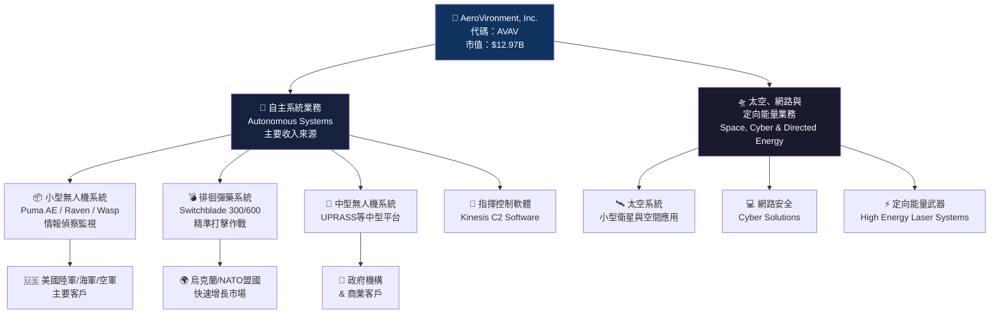

### 2.2 市場地位估算

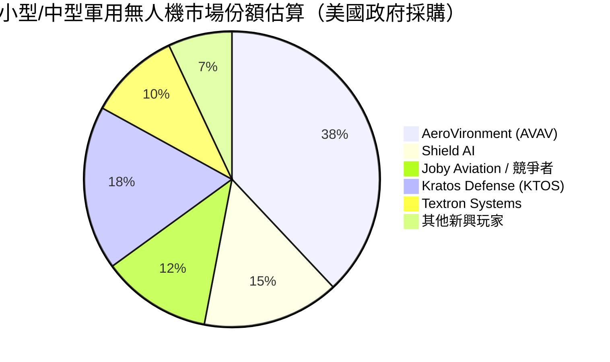

### 2.3 競爭護城河分析

```mermaid
mindmap
  root((AVAV\n競爭護城河))
    技術壁壘
      專利組合 1000+項
      Switchblade獨特彈藥無人機技術
      AI自主導航系統
      反無人機技術C-UAS
    政府關係
      長期軍事合約鎖定
      IDIQ框架合約
      美國軍方信任背書
      國防授權法案(NDAA)受益
    品牌聲譽
      20+年軍用無人機經驗
      實戰驗證產品
      Switchblade烏克蘭戰場驗證
    轉換成本
      飛行員訓練生態系統
      維修保養合約
      軟體升級綁定
      零件供應鏈依賴
    規模效益
      製造規模擴張
      R&D投入$100M+/年
      多業務協同效應
    網路效應
      作戰數據積累
      盟國互操作性
      生態系統擴展
```

### 2.4 護城河強度評分

```
護城河強度評估（各項滿分10分）
━━━━━━━━━━━━━━━━━━━━━━━━━━━━━━━━━━━━━━━━━━━━━━━━━━━
技術壁壘    ▓▓▓▓▓▓▓▓░░  8/10  🔬 自主導航+彈藥無人機核心IP
政府關係    ▓▓▓▓▓▓▓▓░░  8/10  🏛️ IDIQ長期框架合約保護
品牌聲譽    ▓▓▓▓▓▓▓░░░  7/10  ⭐ 烏克蘭實戰驗證加分
轉換成本    ▓▓▓▓▓▓░░░░  6/10  🔄 訓練+軟體生態系統
規模效益    ▓▓▓▓▓░░░░░  5/10  📦 仍在規模化過程中
網路效應    ▓▓▓▓░░░░░░  4/10  🌐 數據積累初期
━━━━━━━━━━━━━━━━━━━━━━━━━━━━━━━━━━━━━━━━━━━━━━━━━━━
綜合護城河  ▓▓▓▓▓▓▓░░░  6.3/10 🏰 中高等護城河
```

---

## 3. 損益表深度分析

### 3.1 年度收入成長趨勢

```
年度總收入趨勢（FY2022-FY2025，財年截至4月30日）
━━━━━━━━━━━━━━━━━━━━━━━━━━━━━━━━━━━━━━━━━━━━━━━━━━━━━━━━━━
FY2022  $445.73M  ██████████░░░░░░░░░░░░░░░░░░░░  YoY: N/A
FY2023  $540.54M  ████████████░░░░░░░░░░░░░░░░░░  YoY: +21.3%
FY2024  $716.72M  ████████████████░░░░░░░░░░░░░░  YoY: +32.6%
FY2025  $820.63M  ███████████████████░░░░░░░░░░░  YoY: +14.5%
TTM     $1,369M   ██████████████████████████████  YoY: +150.7%*
━━━━━━━━━━━━━━━━━━━━━━━━━━━━━━━━━━━━━━━━━━━━━━━━━━━━━━━━━━
* TTM YoY 大幅跳升主要來自BlueHalo等收購的合併效應（無機成長）
每格代表約$46M收入
```

| 財年 | 總收入 | YoY成長 | 毛利潤 | 毛利率 | 備註 |
|------|--------|---------|--------|--------|------|
| FY2022 | $445.73M | — | $141.24M | 31.7% | 基期 |
| FY2023 | $540.54M | **+21.3%** 🟡 | $173.51M | 32.1% | 有機成長 |
| FY2024 | $716.72M | **+32.6%** 🟢 | $283.93M | 39.6% | 加速成長 |
| FY2025 | $820.63M | **+14.5%** 🟡 | $318.64M | 38.8% | 成長趨緩 |
| TTM | $1,369M | **+150.7%** 🟢 | ~$367M | ~26.8% | 收購驅動 |

> 📌 **關鍵觀察**：FY2024毛利率攀升至39.6%為歷史高點，但TTM毛利率下降至26.8%，反映BlueHalo整併帶入了毛利率較低的業務線，是關鍵警訊。

### 3.2 季度收入趨勢（近4季）

| 季度 | 總收入 | QoQ成長 | 毛利潤 | 毛利率 | 營業利潤 |
|------|--------|---------|--------|--------|---------|
| Q3 FY2025 (2025-01-31) | $167.64M | — | $63.20M | 37.7% | -$3.09M |
| Q4 FY2025 (2025-04-30) | $275.05M | **+64.1%** 🟢 | $100.33M | 36.5% | +$32.18M |
| Q1 FY2026 (2025-07-31) | $454.68M | **+65.3%** 🟢 | $95.12M | 20.9% | -$69.27M |
| Q2 FY2026 (2025-10-31) | $472.51M | **+3.9%** 🟡 | $104.11M | 22.0% | -$30.22M |

> ⚠️ **嚴重警訊**：Q1 FY2026起毛利率從37%+ 驟降至約21%，且連續兩季營業虧損，顯示收購業務整合成本遠超預期，或定價能力正在受壓。

### 3.3 利潤率演變趨勢

| 財年/期間 | 毛利率 | 營業利益率 | EBITDA率 | 淨利率 | 整體評估 |
|----------|--------|----------|---------|--------|---------|
| FY2022 | 31.7% | -2.2% | 10.6% | -0.9% | 🟡 早期虧損 |
| FY2023 | 32.1% | -4.2% | -14.6% | -32.6% | 🔴 大額減損 |
| FY2024 | 39.6% | +10.0% | +14.4% | +8.3% | 🟢 轉虧為盈 |
| FY2025 | 38.8% | +7.2% | +10.1% | +5.3% | 🟢 維持獲利 |
| TTM | **26.8%** | **-6.4%** | **7.7%** | **-5.1%** | 🔴 再度惡化 |

**利潤率惡化原因分析：**
- 🔴 **主因**：BlueHalo收購完成後，整合成本（SG&A激增）拖累營業利潤率
- 🔴 **次因**：新業務（Space & Cyber）初期毛利率較低，拉低整體水平
- 🟡 **結構性**：R&D支出維持$100M+/年高位（占TTM收入約7.3%）

### 3.4 費用結構分析（TTM）

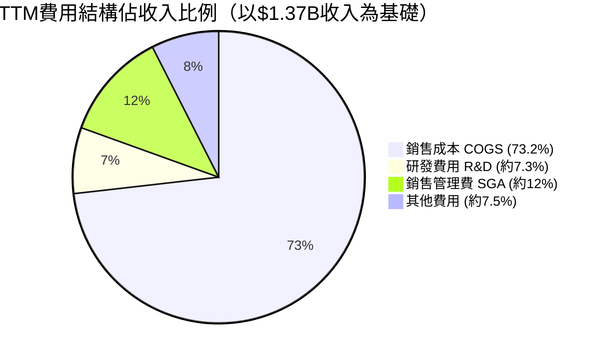

```
費用結構細節（TTM $1.37B收入）
━━━━━━━━━━━━━━━━━━━━━━━━━━━━━━━━━━━━━━━━━━━
銷售成本    $1,002M  ▓▓▓▓▓▓▓▓▓▓▓▓▓▓▓▓▓▓▓▓  73.2%
研發費用    $100M    ▓▓░░░░░░░░░░░░░░░░░░░░   7.3%
管銷費用    $165M    ▓▓▓░░░░░░░░░░░░░░░░░░░  12.0%
其他費用    $102M    ▓▓░░░░░░░░░░░░░░░░░░░░   7.5%
━━━━━━━━━━━━━━━━━━━━━━━━━━━━━━━━━━━━━━━━━━━
合計費用    $1,369M  ────────────────────── 100.0%
```

### 3.5 EPS趨勢與盈餘品質分析

| 季度 | EPS預估 | EPS實際 | 驚喜幅度 | 狀態 | 淨利潤 | 說明 |
|------|--------|--------|---------|------|--------|------|
| Q3 FY2025 (2025-01-31) | N/A | N/A | N/A | ⚠️ 無資料 | -$1.75M | 微幅虧損 |
| Q4 FY2025 (2025-04-30) | N/A | N/A | N/A | ⚠️ 無資料 | +$16.66M | 季度轉盈 |
| Q1 FY2026 (2025-07-31) | N/A | N/A | N/A | ⚠️ 無資料 | -$67.37M | 大幅虧損 |
| Q2 FY2026 (2025-10-31) | N/A | N/A | N/A | ⚠️ 無資料 | -$17.10M | 虧損收窄 |

> 📌 **EPS品質警示**：
> - TTM EPS：**-$1.23**（虧損）vs Forward EPS：**$4.59**（市場預期大幅改善）
> - 此落差（$5.82/股）代表市場寄望FY2026下半年至FY2027的強勁轉虧為盈
> - 若無法如期實現，估值將面臨嚴峻修正壓力
> - 盈餘資料缺乏具體預估vs實際對比，降低透明度，是分析風險因子

```
EPS走勢重建（基於季度淨利潤 / ~49.93M股）
━━━━━━━━━━━━━━━━━━━━━━━━━━━━━━━━━━━━━━━━
Q3 FY25 (Jan-25)  -$0.035  │░░░░░░░░░▌░░░░░░░░░  微虧
Q4 FY25 (Apr-25)  +$0.334  │░░░░░░░░░▌▓▓░░░░░░░  季度盈利
Q1 FY26 (Jul-25)  -$1.350  │░░░░░░░░░▌          大幅虧損
Q2 FY26 (Oct-25)  -$0.342  │░░░░░░░░░▌░         回穩虧損
━━━━━━━━━━━━━━━━━━━━━━━━━━━━━━━━━━━━━━━━
          負值◄─────────────▼─────────►正值
                            0
```

---

## 4. 資產負債表分析

### 4.1 資產結構（FY2025）

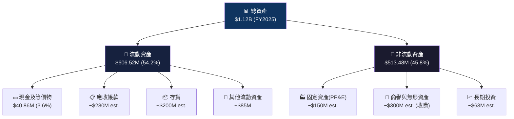

### 4.2 流動性指標分析

| 流動性指標 | FY2022 | FY2023 | FY2024 | FY2025 | TTM | 行業均值 | 評估 |
|-----------|--------|--------|--------|--------|-----|---------|------|
| 流動比率 | 3.64 | 3.93 | 3.56 | 3.52 | 5.08 | 1.5-2.0 | 🟢 遠超 |
| 速動比率 | — | — | — | — | 4.148 | 1.0-1.5 | 🟢 優異 |
| 現金比率 | 0.76 | 1.09 | 0.51 | 0.24 | ~0.34 | 0.3-0.5 | 🟡 可接受 |
| 現金/總資產 | 8.5% | 16.1% | 7.2% | 3.7% | — | 5-10% | 🔴 下降 |

> 📌 **流動性結論**：短期償債能力強健，流動比5.08遠優於行業，但現金占比持續下降值得監控。TTM現金$588.48M主要包含短期投資，真實現金僅$40.86M（FY2025資產負債表數據）。

### 4.3 債務結構分析

```
債務結構演變（$M）
━━━━━━━━━━━━━━━━━━━━━━━━━━━━━━━━━━━━━━━━━━━━━━━━━━━━━━━━
                FY2022    FY2023    FY2024    FY2025    TTM(est)
━━━━━━━━━━━━━━━━━━━━━━━━━━━━━━━━━━━━━━━━━━━━━━━━━━━━━━━━
總負債        $305.99M  $273.61M  $193.12M  $234.06M  ~$900M
總債務        $216.57M  $162.82M   $59.68M   $64.29M  $825.93M
淨負債/(現金)  $139.34M   $29.96M  -$13.62M   $23.43M  $237.45M
D/E比率         0.36      0.30      0.07      0.07      18.69
━━━━━━━━━━━━━━━━━━━━━━━━━━━━━━━━━━━━━━━━━━━━━━━━━━━━━━━━
```

> ⚠️ **重大警示**：TTM D/E比率高達18.69x，較FY2025年報的0.07x有天壤之別，這反映了財年結束後（4月30日後）進行的大型收購（推估BlueHalo全額整合）帶入約$825M債務。這是**核心投資風險**。

| 債務指標 | 數值 | 評估 | 說明 |
|---------|------|------|------|
| 總債務(TTM) | $825.93M | 🔴 | 較FY2025增加$761M |
| 淨負債(TTM) | $237.45M | 🟡 | 有現金緩衝 |
| 淨負債/EBITDA | ~22.5x | 🔴 | 嚴重偏高（TTM EBITDA僅$105M) |
| 利息覆蓋率 | 負值 | 🔴 | EBIT為負，無法覆蓋利息 |
| 債務到期結構 | 未知 | ⚠️ | 需關注再融資風險 |

### 4.4 股東權益趨勢

```
股東權益年度演變（$M）
━━━━━━━━━━━━━━━━━━━━━━━━━━━━━━━━━━━━━━━━━━━━━━━
FY2022  $607.97M  ████████████████░░░░░░░░░  基期
FY2023  $550.97M  ██████████████░░░░░░░░░░░  -9.4%（大額虧損）
FY2024  $822.75M  █████████████████████░░░░  +49.3%（發行新股+獲利）
FY2025  $886.51M  ██████████████████████░░░  +7.8%（持續改善）
━━━━━━━━━━━━━━━━━━━━━━━━━━━━━━━━━━━━━━━━━━━━━━━
每格代表約$36M

帳面價值/股 趨勢：
FY2022: $607.97M ÷ ~40M股 = ~$15.2/股
FY2023: $550.97M ÷ ~40M股 = ~$13.8/股  ▼
FY2024: $822.75M ÷ ~43M股 = ~$19.1/股  ▲
FY2025: $886.51M ÷ ~49M股 = ~$17.9/股  ▼（稀釋效應）
当前  P/B = $259.81 / $17.9 ≈ 2.92x
```

---

## 5. 現金流量深度分析

### 5.1 現金流量瀑布圖（FY2025）

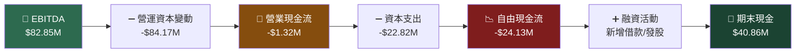

### 5.2 FCF轉換率趨勢

| 財年 | 淨利潤 | 自由現金流 | FCF轉換率 | 評估 | 說明 |
|------|--------|-----------|----------|------|------|
| FY2022 | -$4.19M | -$31.91M | N/A | 🔴 | 雙負 |
| FY2023 | -$176.21M | -$3.47M | N/A | 🔴 | 雙負（含大額減損） |
| FY2024 | +$59.67M | -$9.19M | **-15.4%** | 🔴 | 盈利但FCF負 |
| FY2025 | +$43.62M | -$24.13M | **-55.3%** | 🔴 | 惡化 |
| TTM | -$69.46M* | -$318.16M | N/A | 🔴 | 嚴重惡化 |

> *TTM淨利潤 = -$17.10M + (-$67.37M) + $16.66M + (-$1.75M) = -$69.56M

**FCF持續為負的根本原因：**
1. 📦 **存貨大幅增加**：備戰訂單增加，製造端存貨堆積
2. 💳 **應收帳款延長**：政府採購付款週期長（30-120天）
3. 🏗️ **收購整合支出**：交割後整合帶來的現金消耗
4. 📊 **規模化投入期**：產能擴張的前期資本需求

### 5.3 自由現金流趨勢

```
自由現金流年度趨勢（負值以🔴標示）
━━━━━━━━━━━━━━━━━━━━━━━━━━━━━━━━━━━━━━━━━━━━━━━━━━━━━━━
FY2022  🔴-$31.91M  ████░░░░░░ 負值
FY2023  🔴-$3.47M   █░░░░░░░░░ 改善
FY2024  🔴-$9.19M   ██░░░░░░░░ 小幅惡化
FY2025  🔴-$24.13M  ███░░░░░░░ 持續惡化
TTM     🔴-$318.16M ██████████ 大幅惡化（收購效應）
━━━━━━━━━━━━━━━━━━━━━━━━━━━━━━━━━━━━━━━━━━━━━━━━━━━━━━━
FCF Yield (TTM): -2.45% ← 市值$12.97B基礎下的負收益率
```

### 5.4 資本配置評估

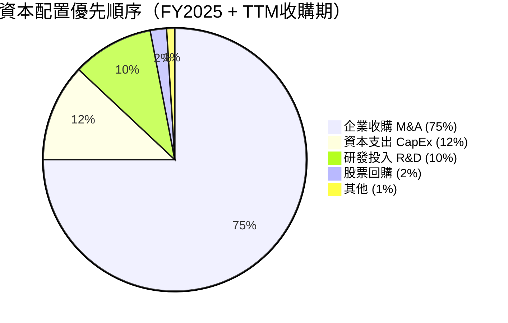

| 資本配置項目 | 金額(TTM估算) | 說明 | 合理性評估 |
|------------|-------------|------|-----------|
| 企業收購(M&A) | ~$700M+ | BlueHalo等大型收購 | 🟡 高風險高回報 |
| 資本支出(CapEx) | $22.82M | FY2025數據 | 🟢 相對保守 |
| 研發費用(R&D) | $100.73M | 占收入12.3% | 🟢 維持技術領先 |
| 股票回購 | ~$0 | 無 | ⚪ 無 |
| 股息 | $0 | 無股息政策 | ⚪ 成長公司特質 |

---

## 6. 獲利能力與資本效率

### 6.1 ROE / ROA / ROIC趨勢

| 指標 | FY2022 | FY2023 | FY2024 | FY2025 | TTM | 行業均值 |
|------|--------|--------|--------|--------|-----|---------|
| ROE | -0.7% | -32.0% | +7.3% | +4.9% | **-2.6%** 🔴 | 15-20% |
| ROA | -0.5% | -21.4% | +5.9% | +3.9% | **-1.2%** 🔴 | 5-8% |
| ROIC | ~-1% | ~-22% | ~+8% | ~+5% | **~-3%** 🔴 | 8-12% |
| 毛利率 | 31.7% | 32.1% | 39.6% | 38.8% | **26.8%** 🔴 | 20-25% |
| 營業利益率 | -2.2% | -4.2% | +10.0% | +7.2% | **-6.4%** 🔴 | 8-12% |

### 6.2 ROIC vs WACC 分析

```
╔══════════════════════════════════════════════════════════════╗
║  ROIC vs WACC 經濟價值分析                                    ║
╠══════════════════════════════════════════════════════════════╣
║  WACC 估算：                                                  ║
║  ├─ 無風險利率(10年期美債)：4.5%                               ║
║  ├─ 股權風險溢價(ERP)：5.5%                                    ║
║  ├─ Beta：1.239                                               ║
║  ├─ 股權成本(Ke)：4.5% + 1.239 × 5.5% = 11.3%                ║
║  ├─ 稅前債務成本(Kd)：~6.5%（高槓桿溢價）                      ║
║  ├─ 有效稅率：~21%                                             ║
║  ├─ 稅後債務成本：6.5% × (1-21%) = 5.1%                       ║
║  ├─ 股權權重：~94%（市值基礎）                                  ║
║  ├─ 債務權重：~6%                                              ║
║  └─ WACC = 11.3% × 94% + 5.1% × 6% ≈ 10.9%                 ║
╠══════════════════════════════════════════════════════════════╣
║  ROIC (TTM估算)：~-3%                                         ║
║  WACC：~10.9%                                                 ║
║  EVA = ROIC - WACC = -3% - 10.9% = -13.9% ❌                 ║
║                                                              ║
║  結論：AVAV目前在積極摧毀股東經濟價值                           ║
║  轉折點預估：需ROIC提升至>10.9%（約FY2027+）                    ║
╚══════════════════════════════════════════════════════════════╝
```

```
ROIC vs WACC 視覺化
━━━━━━━━━━━━━━━━━━━━━━━━━━━━━━━━━━━━━━━━━━━━
+15% │                    🟢 FY2024  ▲
+10% │────────────────── WACC線 ─────────── ✂️ 創造/摧毀價值分界
 +5% │               🟡 FY2025
  0% │
 -5% │ 🔴 TTM(now)
-10% │
-15% │
-20% │
-25% │
-30% │   🔴 FY2023（大額減損）
━━━━━━━━━━━━━━━━━━━━━━━━━━━━━━━━━━━━━━━━━━━━
  FY22    FY23    FY24    FY25    TTM    FY26E
```

### 6.3 DuPont 三因子分解

| 因子 | FY2024 | FY2025 | TTM | 說明 |
|------|--------|--------|-----|------|
| 淨利率（A） | 8.3% | 5.3% | -5.1% | 盈利能力 |
| 資產周轉率（B） | 0.70x | 0.73x | ~1.22x | 資產效率 |
| 財務槓桿（C） | 1.24x | 1.27x | ~4.5x | 槓桿倍數 |
| **ROE = A×B×C** | **7.3%** | **4.9%** | **-2.6%** | 股東報酬率 |

> 📌 **DuPont洞察**：TTM槓桿倍數從1.27x急升至~4.5x，完全來自收購引起的負債膨脹。即使資產周轉率改善（收購帶來更多收入），淨利率為負仍導致ROE為負。

### 6.4 獲利能力儀表板

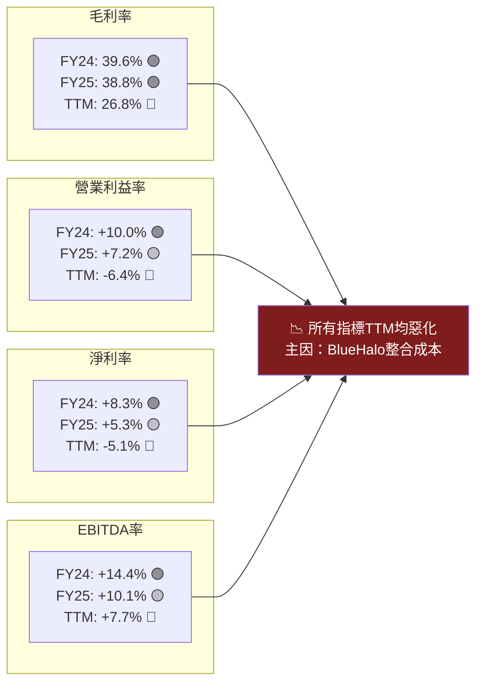

---

## 7. 估值深度分析

### 7.1 同業估值比較

| 指標 | **AVAV** | **KTOS** (Kratos Defense) | **AIR** (AAR Corp) | **TDG** (TransDigm) | 評估 |
|------|----------|--------------------------|-------------------|--------------------|----|
| 市值 | $12.97B | $5.8B | $2.1B | $67B | — |
| P/E (Forward) | **56.6x** | 45.0x | 16.0x | 33.0x | 🔴 最貴 |
| P/S | **9.47x** | 6.8x | 0.95x | 9.2x | 🔴 偏高 |
| EV/EBITDA | **122.7x** | 85x | 12x | 25x | 🔴 極貴 |
| P/B | **2.92x** | 4.5x | 2.1x | N/A | 🟡 合理 |
| FCF Yield | **-2.45%** | +0.5% | +5.2% | +3.8% | 🔴 最差 |
| 收入YoY成長 | **+150.7%** | +18% | +8% | +12% | 🟢 最強 |
| 毛利率 | **26.8%** | 25% | 18% | 58% | 🟡 中等 |

> **直接競爭對手選擇說明：**
> - **KTOS（Kratos Defense）**：最直接競爭者，同樣深耕無人機+彈藥無人機，Valkyrie XQ-58A直接對標
> - **AIR（AAR Corp）**：航太MRO業務對比基準，代表航太國防行業一般估值水平
> - **TDG（TransDigm）**：航太國防高護城河高估值代表，提供優質公司應有估值參考

### 7.2 歷史估值區間分析

```
P/S 估值歷史區間（過去2年）
━━━━━━━━━━━━━━━━━━━━━━━━━━━━━━━━━━━━━━━━━━━━━━━━━━━━━━━
歷史高位  P/S ~15x（2024年收入擴張前高估值期）
━━━━━ ▲ 2025-10 $369.91（歷史高點附近）━━━━━━━━━━━━━━━━
歷史中位  P/S ~8-10x（合理評估區間）
━━━━━ ─ 當前 $259.81（P/S 9.47x）──────────────────
歷史低位  P/S ~4-5x（2024年2月 $126.79 低點）
━━━━━━━━━━━━━━━━━━━━━━━━━━━━━━━━━━━━━━━━━━━━━━━━━━━━━━━

Forward P/E 歷史對比：
高位估值帶  80-120x P/E（成長股高峰期）   🔴 泡沫區
當前估值    56.6x Forward P/E            🟡 偏高區
合理估值    30-40x（考慮成長溢價）         🟢 合理區
低估值帶    15-25x                        🟢 折扣區
```

### 7.3 DCF敏感性分析

**核心假設：**
- 基準收入成長：FY2026E $1.8B → FY2030 逐步降至 8% 終端成長
- 目標EBITDA Margin：逐步改善至15-18%
- 永續成長率：3%

| | **折現率 9%** | **折現率 11%** |
|---|---|---|
| 🐂 **樂觀** (收入成長25%+，利潤率回升至15%) | **$420** (+62%) 🟢 | **$360** (+38%) 🟢 |
| 📊 **基準** (收入成長18%，利潤率回升至10%) | **$310** (+19%) 🟡 | **$265** (+2%) 🟡 |
| 🐻 **悲觀** (收入成長10%，利潤率5%) | **$200** (-23%) 🔴 | **$165** (-37%) 🔴 |

> 📌 **DCF關鍵假設說明：**
> - **樂觀**：BlueHalo整合超預期，國防預算持續擴張，新合約爆發
> - **基準**：整合按計劃進行，FY2027開始穩定盈利
> - **悲觀**：整合延誤+訂單放緩+資金壓力

### 7.4 估值區間視覺化

```
估值區間定位（基於多種方法估算）
━━━━━━━━━━━━━━━━━━━━━━━━━━━━━━━━━━━━━━━━━━━━━━━━━━━━━━━━━━━
$100   $150   $180   $220   $260  $300  $372  $420  $500
 │──────│──────│──────│──────│──────│──────│──────│──────│
        [────低估區────][─合理│─────][────高估區──────────]
                            ▲                 ▲
                         當前價格           分析師
                         $259.81           均值$372

DCF基準估值：          $265   ████████████░░░░░░░ 接近合理
DCF樂觀估值：          $390   ████████████████░░░
DCF悲觀估值：          $180   ████████░░░░░░░░░░░
分析師均值目標：        $372   ████████████████░░░
52週低點：             $102   ████░░░░░░░░░░░░░░░
52週高點：             $418   █████████████████░░
━━━━━━━━━━━━━━━━━━━━━━━━━━━━━━━━━━━━━━━━━━━━━━━━━━━━━━━━━━━
結論：當前$259.81接近DCF基準合理值下沿，分析師目標有+43%上行空間
但基於負FCF與極高估值倍數，建議等待更多基本面確認
```

---

## 8. 成長催化劑

### 8.1 催化劑時間軸

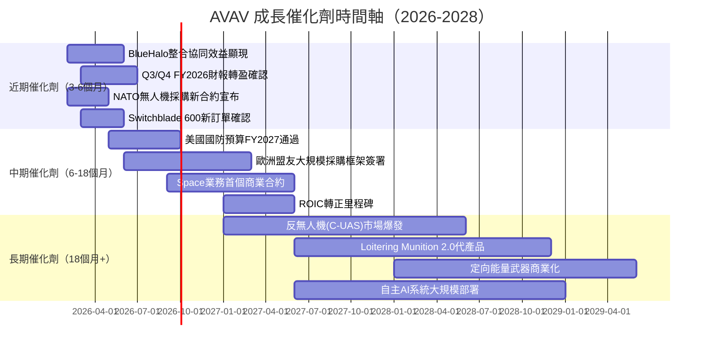

### 8.2 TAM市場規模與滲透率

```
市場規模與AVAV滲透率估算（2025-2030E）
━━━━━━━━━━━━━━━━━━━━━━━━━━━━━━━━━━━━━━━━━━━━━━━━━━━━━━━━━
軍用無人機TAM（全球）    2025E: $180B → 2030E: $350B+
  AVAV目前市佔率         ~0.8% → 目標 ~2-3%
  ████░░░░░░░░░░░░░░░░░░░░  極低滲透率，巨大擴張空間

徘徊彈藥市場（全球）     2025E: $25B → 2030E: $75B
  AVAV目前市佔率         ~5-8% → 目標 ~15-20%
  ████████░░░░░░░░░░░░░░░░  先發優勢明顯

反無人機C-UAS（全球）    2025E: $12B → 2030E: $40B
  AVAV目前市佔率         ~3-5% → 目標 ~10%
  ████░░░░░░░░░░░░░░░░░░░░  新興機遇

小型偵察無人機（美國）   2025E: $8B → 2030E: $15B
  AVAV目前市佔率         ~35-40% → 維持領導
  ████████████████░░░░░░░░  成熟市場守城
━━━━━━━━━━━━━━━━━━━━━━━━━━━━━━━━━━━━━━━━━━━━━━━━━━━━━━━━━
總可服務市場(SAM)：2025E ~$50B → 2030E ~$180B
AVAV FY2025收入/SAM滲透率：$820M / $50B = 1.64%
```

### 8.3 成長驅動力架構

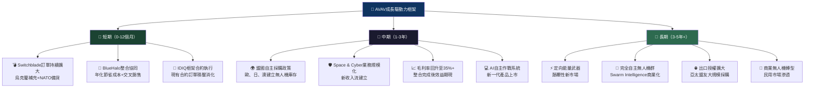

---

## 9. 風險矩陣

### 9.1 風險評分矩陣

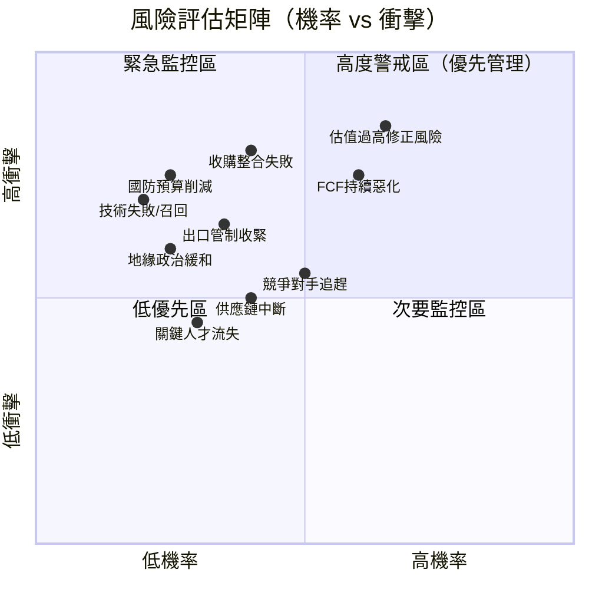

### 9.2 風險清單詳細分析

| 風險項目 | 機率 | 衝擊 | 風險評分 | 緩解措施 | 等級 |
|---------|------|------|---------|---------|------|
| **估值過高/EPS未達預期** | 65% | 高 | **9.1** | 謹慎建倉，等待財報確認 | 🔴 極高 |
| **FCF持續惡化/流動性壓力** | 60% | 高 | **8.5** | 監控季度現金消耗速度 | 🔴 極高 |
| **BlueHalo等收購整合失敗** | 40% | 很高 | **8.0** | 追蹤整合KPI與協同效益 | 🔴 高 |
| **國防預算政治風險(DOGE削減)** | 25% | 很高 | **7.0** | 分散客戶至盟國市場 | 🔴 高 |
| **競爭對手(KTOS/Shield AI)追趕** | 50% | 中 | **6.5** | 持續R&D投入+技術迭代 | 🟡 中高 |
| **出口管制/ITAR限制擴大** | 35% | 高 | **6.3** | 申請擴大出口許可 | 🟡 中高 |
| **供應鏈中斷（晶片/材料）** | 40% | 中 | **6.0** | 多元化供應商+庫存備貨 | 🟡 中 |
| **地緣政治緩和（烏克蘭停火）** | 25% | 高 | **5.5** | 多元化訂單來源 | 🟡 中 |
| **技術失敗/產品召回** | 20% | 很高 | **5.0** | 嚴格QA+測試流程 | 🟡 中 |
| **關鍵人才流失** | 30% | 中 | **4.5** | 競爭性薪酬+股權激勵 | 🟢 低 |

---

## 10. 投資建議

### 10.1 最終綜合評級

```
AVAV 多維度評分雷達圖
━━━━━━━━━━━━━━━━━━━━━━━━━━━━━━━━━━━━━━━━━━━━━━━━━━━
維度          評分  視覺化條               說明
━━━━━━━━━━━━━━━━━━━━━━━━━━━━━━━━━━━━━━━━━━━━━━━━━━━
成長動能      8.5   ▓▓▓▓▓▓▓▓▓░  85%  收入+150%，行業最高
競爭護城河    7.0   ▓▓▓▓▓▓▓░░░  70%  技術+政府關係強
市場地位      7.5   ▓▓▓▓▓▓▓▓░░  75%  小型UAS霸主地位
基本面品質    6.5   ▓▓▓▓▓▓▓░░░  65%  收購帶來不確定性
財務健康      5.5   ▓▓▓▓▓▓░░░░  55%  流動性強但負債高
獲利能力      4.0   ▓▓▓▓░░░░░░  40%  TTM虧損，轉型期
估值合理性    3.5   ▓▓▓▓░░░░░░  35%  估值倍數極高
現金流品質    3.0   ▓▓▓░░░░░░░  30%  FCF持續深度負值
━━━━━━━━━━━━━━━━━━━━━━━━━━━━━━━━━━━━━━━━━━━━━━━━━━━
加權綜合評分  5.9   ▓▓▓▓▓▓░░░░  59%  謹慎樂觀
━━━━━━━━━━━━━━━━━━━━━━━━━━━━━━━━━━━━━━━━━━━━━━━━━━━
```

### 10.2 目標價與隱含報酬率

| 情境 | 目標價 | vs 當前$259.81 | 隱含報酬率 | 觸發條件 | 機率 |
|------|--------|--------------|-----------|---------|------|
| 🐂 **樂觀情境** | $420 | +$160.19 | **+61.6%** | 整合超預期+大型NATO合約+FY2027 EPS $8+ | 25% |
| 📊 **基準情境** | $300 | +$40.19 | **+15.5%** | 按計劃整合，FY2027 EPS $5-6 達標 | 45% |
| 🐻 **悲觀情境** | $180 | -$79.81 | **-30.7%** | 整合延誤+訂單放緩+資金壓力加劇 | 30% |
| **期望值** | **$283** | +$23 | **+8.8%** | 加權期望值（不考慮時間價值） | — |

### 10.3 買入時機與觸發因素

```
買入觸發清單（需確認以下條件）
━━━━━━━━━━━━━━━━━━━━━━━━━━━━━━━━━━━━━━━━━━━━━━━━━
財務指標確認：
☐ FCF由負轉正（連續2季）
☐ 毛利率恢復至35%+
☐ 營業利益率轉正並維持在5%+
☐ EPS實際達到Forward $4.59的預估
☐ 淨負債/EBITDA降至5x以下

估值時機確認：
☐ 股價回調至$200-220（Forward P/E ~45x）
☐ 52週低點 $102 支撐確認
☐ 相對強弱指數(RSI)降至40以下
☐ 股價在200日均線附近尋得支撐

業務催化劑確認：
☐ BlueHalo整合協同效益首次量化披露
☐ 新大型IDIQ合約宣布（$500M+）
☐ NATO盟國採購框架合約確認
☐ Space/Cyber業務達到盈虧平衡
━━━━━━━━━━━━━━━━━━━━━━━━━━━━━━━━━━━━━━━━━━━━━━━━━
建議進場策略：分批買入（回調時加碼）
第一批（20%）：$220附近
第二批（30%）：$200附近
第三批（50%）：財報確認FCF改善後
```

### 10.4 投資人適配度

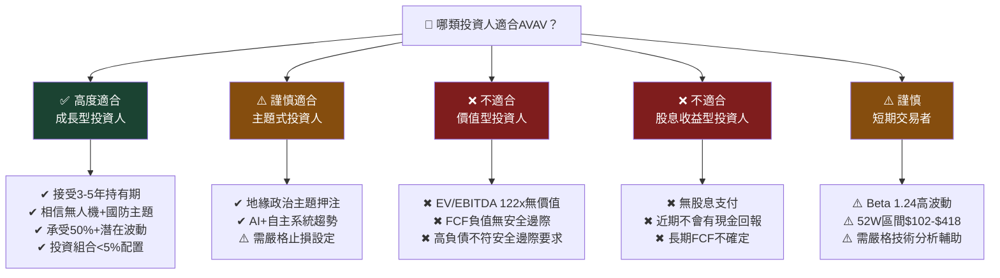

### 10.5 關鍵監控指標清單

```
下次財報前必須監控的指標
━━━━━━━━━━━━━━━━━━━━━━━━━━━━━━━━━━━━━━━━━━━━━━━━━━━━━━━━━━
財報監控指標（每季）：
☐ 季度毛利率：目標恢復至>30%（當前22%）
☐ 季度營業現金流：轉正為正面信號
☐ 自由現金流：趨勢改善方向確認
☐ 訂單積壓(Backlog)：成長或縮減
☐ BlueHalo整合進度：協同效益量化披露
☐ EPS vs 共識預估：超預期vs不及預期

產業數據監控：
☐ 美國FY2027國防預算案內容（無人機相關項目）
☐ NATO國防開支承諾達成進度
☐ ITAR出口管制政策變化
☐ 競爭對手(KTOS, Shield AI)新合約公告
☐ 烏克蘭/中東軍事消耗補充採購訊息

宏觀環境監控：
☐ 美國利率決策（影響WACC與估值倍數）
☐ DOGE政府效率削減對國防預算影響
☐ 地緣政治局勢（俄烏、台海）演變
☐ 美元指數（影響出口合約美元成本）

估值警示指標：
☐ Forward P/E > 70x → 考慮減倉
☐ Forward P/E < 40x → 考慮加倉
☐ 分析師目標價大規模下調 → 停損評估
☐ 機構持股比例下降 > 5% → 警示信號
━━━━━━━━━━━━━━━━━━━━━━━━━━━━━━━━━━━━━━━━━━━━━━━━━━━━━━━━━━
下次財報日期：預計 2026年3月（Q3 FY2026）
```

### 10.6 總結與最終評級

```
╔══════════════════════════════════════════════════════════════════╗
║  📋 AVAV 最終投資評級總結                                         ║
╠══════════════════════════════════════════════════════════════════╣
║                                                                  ║
║  🎯 投資評級：⚖️ 謹慎持有 / 等待更好買點                           ║
║  📊 目標價（12個月）：$280-$320（基準情境）                         ║
║  ⚡ 風險評級：高風險（Beta 1.24 + 估值過高 + 負FCF）                ║
║                                                                  ║
║  ✅ 核心投資價值主張：                                              ║
║  AVAV是純正無人機+彈藥無人機龍頭，技術護城河深厚，受益於地緣政        ║
║  治持續緊張的長期主題。BlueHalo整合若成功，協同效益可推動FY2027      ║
║  收入達$2B+，EPS潛力$8+，長期牛市目標$420不是夢。                  ║
║                                                                  ║
║  ⚠️ 核心投資風險：                                                 ║
║  當前估值已充分Price-in樂觀情境，FCF持續深度負值（-$318M）暴露       ║
║  整合風險。56.6x Forward P/E對任何盈利miss零容忍度。建議等待        ║
║  $200-220回調區間，確認FCF改善後再行建倉。                          ║
║                                                                  ║
║  📌 底線判斷：好公司、好主題、但當前不是好價格                       ║
╚══════════════════════════════════════════════════════════════════╝
```

---

> **⚠️ 免責聲明**：本報告為 AI 自動生成，基於截至 2026-02-26 的公開財務數據進行分析，僅供學術研究與參考用途，**不構成任何投資建議**。投資涉及風險，過去表現不代表未來結果。讀者在作出任何投資決策前，應諮詢持牌財務顧問，並自行進行盡職調查。本報告所有估值均為模型估算，實際結果可能與預測存在重大差異。