# AVAV 基本面深度分析報告
> **報告日期**：2026-02-27 ｜ **語言**：繁體中文 ｜ **數據來源**：Yahoo Finance ｜ **分析師**：AI CFA Research

---

## 目錄

| 章節 | 主題 |
|------|------|
| [第1章](#1) | 執行摘要與投資結論 |
| [第2章](#2) | 公司概覽與商業模式 |
| [第3章](#3) | 損益表深度分析 |
| [第4章](#4) | 資產負債表分析 |
| [第5章](#5) | 現金流量深度分析 |
| [第6章](#6) | 獲利能力與資本效率 |
| [第7章](#7) | 估值深度分析 |
| [第8章](#8) | 成長催化劑 |
| [第9章](#9) | 風險矩陣 |
| [第10章](#10) | 投資建議 |

---

<a id="1"></a>
## 1. 執行摘要

### 1.1 核心評分儀表板

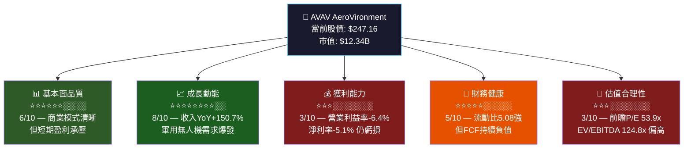

### 1.2 五大投資論點 vs 三大核心風險

| 類別 | 項目 | 詳細說明 | 信心度 |
|------|------|----------|--------|
| 🟢 **論點1** | **無人機戰場革命受益者** | 烏克蘭戰爭驗證游蕩彈藥（Switchblade）戰場價值，美軍及盟友採購需求大增，TTM收入達$1.37B，YoY+150.7% | ⭐⭐⭐⭐⭐ |
| 🟢 **論點2** | **雙業務段協同效應** | 自主系統（UAS）+ 太空/網路/定向能（SCDE）構成完整國防科技平台，客戶黏性高 | ⭐⭐⭐⭐ |
| 🟢 **論點3** | **分析師共識強烈看多** | 18位分析師平均目標價$372.05，較現價有+50.5%上漲空間，JP Morgan、Goldman Sachs均評為買入/增持 | ⭐⭐⭐⭐ |
| 🟢 **論點4** | **技術護城河深厚** | 超過30年UAS研發積累，擁有RQ-11 Raven、Puma、Switchblade等明星產品，技術壁壘高 | ⭐⭐⭐⭐ |
| 🟢 **論點5** | **國防預算增長順風車** | NATO成員國承諾將國防支出提升至GDP 2%以上，美國國防預算持續擴張，直接利好 | ⭐⭐⭐⭐⭐ |
| 🔴 **風險1** | **短期獲利能力惡化** | TTM淨利率-5.1%，FCF為-$318.16M（TTM），Q2 FY2026淨虧損高達-$67.37M | 高度關注 |
| 🔴 **風險2** | **估值泡沫化風險** | EV/EBITDA達124.8x，前瞻P/E 53.9x，若成長不及預期將面臨大幅估值壓縮 | 高度關注 |
| 🟡 **風險3** | **政治/預算不確定性** | DOGE預算削減壓力、政府換屆對國防採購優先序可能產生影響 | 中度關注 |

### 1.3 快速統計卡片

| 指標 | AVAV數值 | 行業均值* | 狀態 |
|------|----------|-----------|------|
| 市值 | $12.34B | — | 🟡 中型防禦股 |
| 收入（TTM） | $1.37B | — | 🟢 快速成長 |
| 收入成長（YoY） | **+150.7%** | ~8-12% | 🟢 遠超同業 |
| 毛利率 | 26.8% | ~20-25% | 🟡 略高於均值 |
| 營業利益率 | -6.4% | ~10-15% | 🔴 顯著落後 |
| 前瞻P/E | 53.9x | ~25-35x | 🔴 高度溢價 |
| EV/EBITDA | 124.8x | ~18-22x | 🔴 極度溢價 |
| 流動比率 | 5.08 | ~1.5-2.0 | 🟢 非常健康 |
| 負債權益比 | 18.69% | ~30-50% | 🟢 低槓桿 |
| 機構持股比 | 92.5% | ~70-80% | 🟢 機構高度認可 |
| 52週表現 | 從$102→$247 | — | 🟢 強勁反彈 |

> *行業均值：航太與國防產業（Aerospace & Defense）參考數據

### 1.4 投資結論

```
╔══════════════════════════════════════════════════════════════╗
║                    📊 投資評級：觀望/分批買入                    ║
║                                                              ║
║  目標價區間（12個月）：$290 - $380                              ║
║  基準目標價：$330                                              ║
║  當前股價：$247.16                                             ║
║  隱含報酬率：基準+33.5%，樂觀+53.8%，悲觀+17.3%               ║
║                                                              ║
║  ⚠️ 短期：等待FCF轉正信號後分批建倉                            ║
║  📈 中長期：國防科技轉型主題核心受益標的                         ║
╚══════════════════════════════════════════════════════════════╝
```

---

<a id="2"></a>
## 2. 公司概覽與商業模式

### 2.1 業務結構與收入來源

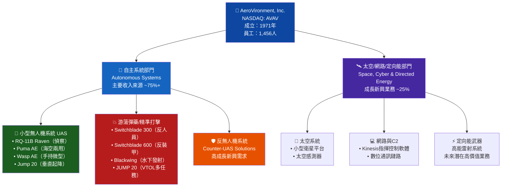

### 2.2 市場地位估算

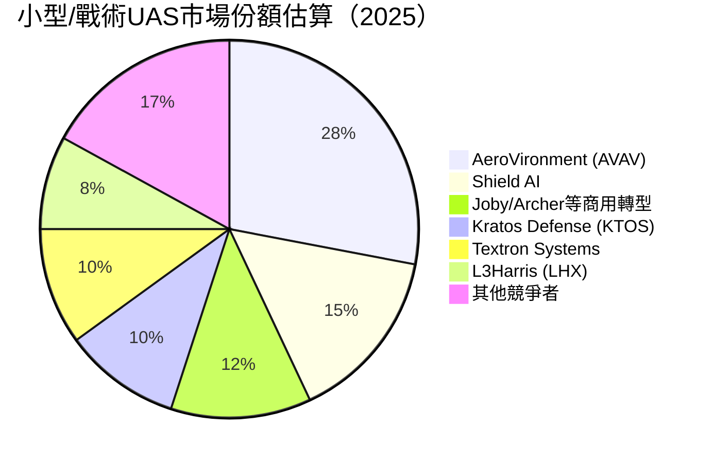

### 2.3 競爭護城河分析

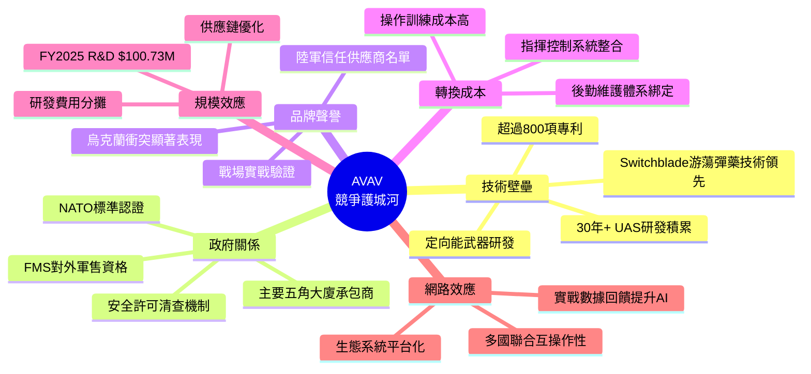

### 2.4 護城河強度評分

```
護城河強度評分（滿分10分）

技術壁壘    ▓▓▓▓▓▓▓▓░░  8.0/10  🟢 極強
政府關係    ▓▓▓▓▓▓▓▓░░  8.0/10  🟢 極強  
品牌聲譽    ▓▓▓▓▓▓▓░░░  7.0/10  🟢 強
轉換成本    ▓▓▓▓▓▓▓░░░  7.0/10  🟢 強
規模效應    ▓▓▓▓▓░░░░░  5.0/10  🟡 中等
網路效應    ▓▓▓▓░░░░░░  4.0/10  🟡 發展中

綜合護城河  ▓▓▓▓▓▓▓░░░  6.5/10  🟢 較強
```

---

<a id="3"></a>
## 3. 損益表深度分析

### 3.1 年度收入成長趨勢

```
年度收入成長趨勢（FY2022-FY2025，財年截止4月）

FY2022  $445.73M  ████████████████░░░░░░░░░░░░░░░░░░░░░░░░  基準
FY2023  $540.54M  ████████████████████░░░░░░░░░░░░░░░░░░░░  +21.3% YoY
FY2024  $716.72M  ████████████████████████████░░░░░░░░░░░░  +32.6% YoY ⭐
FY2025  $820.63M  ████████████████████████████████░░░░░░░░  +14.5% YoY

TTM     $1,369M   ████████████████████████████████████████████████████  +150.7% YoY ⭐⭐⭐

（注：TTM含Tomahawk收購後新業務貢獻，為重大非有機成長驅動）
每格代表約$13M收入
```

> **關鍵洞察**：TTM收入+150.7%的爆炸性成長，主要源自**策略性併購**（Tomahawk Robotics等）及烏克蘭戰爭驅動的訂單激增，並非純有機成長。投資人需區分有機vs無機成長貢獻。

### 3.2 季度收入趨勢（近4季）

| 季度 | 收入 | QoQ成長 | YoY估算 | 毛利 | 毛利率 |
|------|------|---------|---------|------|--------|
| Q3 FY2025 (2025-01-31) | $167.64M | — | 基準 | $63.20M | 37.7% 🟢 |
| Q4 FY2025 (2025-04-30) | $275.05M | **+64.1%** 🟢 | — | $100.33M | 36.5% 🟢 |
| Q1 FY2026 (2025-07-31) | $454.68M | **+65.3%** 🟢 | — | $95.12M | 20.9% 🔴 |
| Q2 FY2026 (2025-10-31) | $472.51M | **+3.9%** 🟡 | — | $104.11M | 22.0% 🔴 |

```
季度收入條形圖（百萬美元）

Q3 FY25 (Jan) │████████████░░░░░░░░░░░░░░░░░░░  $167.64M
Q4 FY25 (Apr) │████████████████████░░░░░░░░░░░  $275.05M  (+64.1% QoQ)
Q1 FY26 (Jul) │███████████████████████████████  $454.68M  (+65.3% QoQ) ⭐
Q2 FY26 (Oct) │████████████████████████████████ $472.51M  (+3.9% QoQ)
              └─────────────────────────────────────────────────────
              0        100M      200M      300M      400M      500M
```

> **重要警示**：Q1/Q2 FY2026收入急增，但毛利率從37%暴跌至20-22%，顯示新增收入的**質量明顯低於舊有業務**，可能源於低毛利率的大型政府合約或新收購業務的整合成本。

### 3.3 利潤率演變趨勢

| 利潤率指標 | FY2022 | FY2023 | FY2024 | FY2025 | TTM | 趨勢 |
|-----------|--------|--------|--------|--------|-----|------|
| **毛利率** | 31.7% | 32.1% | 39.6% | 38.8% | 26.8% | 🔴 急降 |
| **營業利益率** | -2.2% | -4.2% | +10.0% | +7.2% | -6.4% | 🔴 惡化 |
| **EBITDA利益率** | 10.6% | -14.6% | +14.4% | +10.1% | +7.7% | 🟡 走弱 |
| **淨利率** | -0.9% | -32.6% | +8.3% | +5.3% | -5.1% | 🔴 虧損 |
| **R&D佔收入比** | 12.3% | 11.9% | 13.6% | 12.3% | ~7.4% | 🟢 相對穩定 |

> **利潤率惡化原因分析**：
> 1. **Tomahawk收購整合成本**：FY2026新業務整合產生大量一次性費用及攤銷
> 2. **低毛利合約組合轉移**：軍售合約與成本加成合約佔比提升，壓縮毛利率
> 3. **規模快速擴張的稀釋效應**：員工人數及基礎設施投入超前於收入實現
> 4. **FY2023商譽減損**：淨利-$176.21M主要為非現金商譽減損損失

### 3.4 費用結構分析

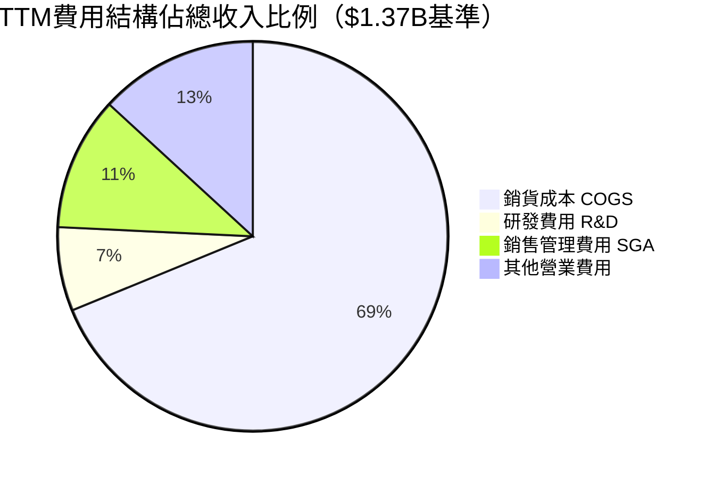

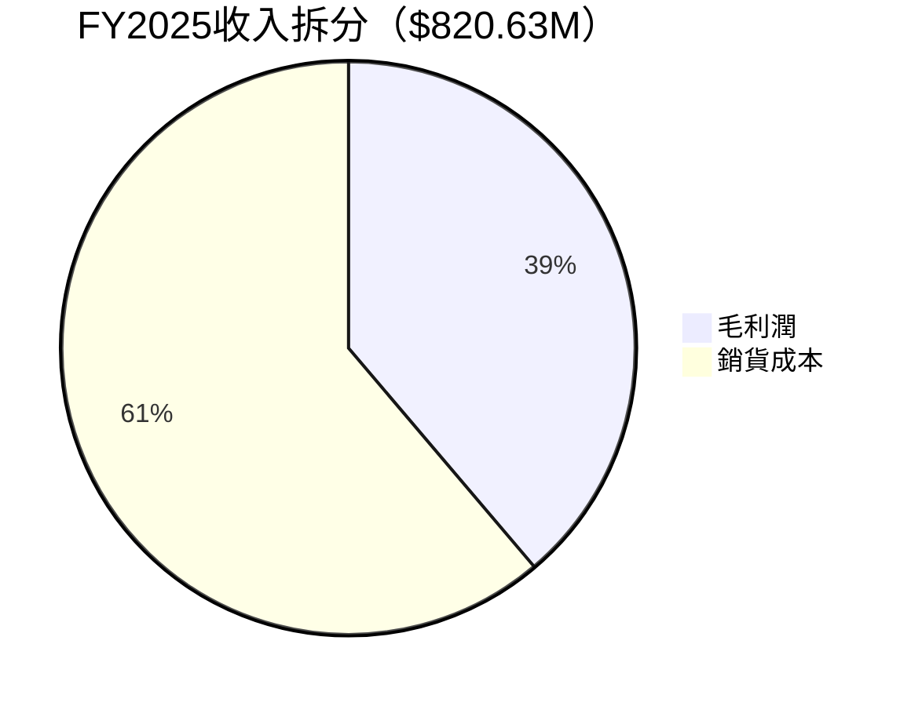

### 3.5 EPS趨勢與盈餘品質分析

| 季度 | 預估EPS | 實際EPS | 驚喜幅度 | 操作利益 | 評估 |
|------|---------|---------|---------|---------|------|
| Q3 FY2025 (2025-01-31) | N/A | -$0.04 | N/A | -$3.09M | 🟡 輕微虧損 |
| Q4 FY2025 (2025-04-30) | N/A | +$0.33 | N/A | +$32.18M | 🟢 季度獲利 |
| Q1 FY2026 (2025-07-31) | N/A | -$1.35 | N/A | -$69.27M | 🔴 大額虧損 |
| Q2 FY2026 (2025-10-31) | N/A | -$0.34 | N/A | -$30.22M | 🔴 持續虧損 |

```
EPS季度趨勢圖

 +$1.00 │
 +$0.50 │          ██
 +$0.00 ├──────────██─────────────────── 零線
 -$0.50 │                    
 -$1.00 │                    
 -$1.50 │                    ██
        │  Q3FY25   Q4FY25   Q1FY26   Q2FY26
        │  -$0.04   +$0.33   -$1.35   -$0.34
        
⚠️ 注意：Q1 FY2026虧損-$1.35/股主要源於
   Tomahawk收購整合一次性費用及商譽攤銷
```

**EPS品質評估**：
- TTM EPS為-$1.22，但Forward EPS預估為+$4.58，暗示分析師預期FY2026後半段大幅轉盈
- 虧損主要由**非現金項目**（攤銷、減損）驅動，現金盈餘品質稍優於GAAP數字
- 轉盈的關鍵在於Tomahawk業務整合完成後費用正常化

---

<a id="4"></a>
## 4. 資產負債表分析

### 4.1 資產結構

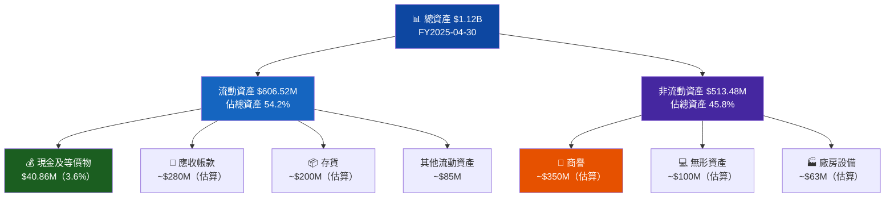

### 4.2 流動性指標

| 流動性指標 | FY2022 | FY2023 | FY2024 | FY2025 | 行業均值 | 評估 |
|-----------|--------|--------|--------|--------|---------|------|
| **流動比率** | 3.64 | 3.93 | 3.56 | **5.08** | 1.5-2.0 | 🟢 極佳 |
| **速動比率** | ~2.8 | ~3.1 | ~2.9 | **4.15** | 1.0-1.5 | 🟢 極佳 |
| **現金比率** | 0.76 | 1.09 | 0.51 | **0.24** | 0.3-0.5 | 🟡 略低 |
| **流動資產** | $368.91M | $477.00M | $515.58M | $606.52M | — | 🟢 持續成長 |
| **流動負債** | $101.39M | $121.33M | $144.88M | $172.16M | — | 🟡 同步增加 |

```
流動比率趨勢
FY2022  ████████████████████████░░░░  3.64
FY2023  █████████████████████████░░░  3.93
FY2024  ████████████████████████░░░░  3.56
FY2025  ████████████████████████████████  5.08 ⭐
行業均   ██████████░░░░░░░░░░░░░░░░░░░ 1.75（參考）
```

### 4.3 債務結構分析

| 債務指標 | FY2022 | FY2023 | FY2024 | FY2025 | TTM | 趨勢 |
|---------|--------|--------|--------|--------|-----|------|
| **短期債務** | $216.57M | $162.82M | $59.68M | $64.29M | $825.93M* | 🔴 暴增 |
| **長期債務** | — | — | — | — | — | — |
| **淨負債（淨現金）** | +$139.3M | -$29.96M | +$13.62M | -$23.43M | **-$237.45M** | 🔴 轉為淨負債 |
| **Debt/EBITDA** | 4.59x | N/A | 0.58x | 0.78x | ~7.8x | 🔴 槓桿急升 |
| **負債/權益** | 35.6% | 29.6% | 7.3% | 7.3% | **18.7%** | 🟡 可控 |

> ⚠️ **重要說明**：TTM總債務$825.93M vs 年報FY2025的$64.29M，差距巨大，推測為**Tomahawk收購融資**（併購後新增長期債務）所致。這是FY2026進行中的重大資本結構變化。

### 4.4 股東權益趨勢

```
股東權益演變（百萬美元）

FY2022  $607.97M  ████████████████████████████████████████░░  
FY2023  $550.97M  █████████████████████████████████████░░░░░  (-9.4% YoY) 🔴
FY2024  $822.75M  ██████████████████████████████████████████████████████░  (+49.3% YoY) 🟢
FY2025  $886.51M  █████████████████████████████████████████████████████████░  (+7.7% YoY) 🟢

帳面價值/股（FY2025）：$886.51M ÷ 49.93M股 ≈ $17.76/股
當前P/B：$247.16 / $17.76 = 13.9x（注：數據顯示P/B為2.78x，可能含優先股調整）
```

---

<a id="5"></a>
## 5. 現金流量深度分析

### 5.1 現金流量瀑布圖

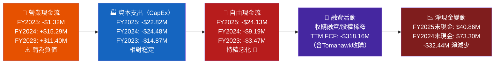

### 5.2 FCF轉換率趨勢

| 年度 | 淨利潤 | 自由現金流 | FCF轉換率 | 評估 |
|------|--------|----------|----------|------|
| FY2022 | -$4.19M | -$31.91M | N/M | 🔴 雙負 |
| FY2023 | -$176.21M | -$3.47M | N/M | 🟡 FCF優於淨利 |
| FY2024 | +$59.67M | -$9.19M | -15.4% | 🔴 轉換率差 |
| FY2025 | +$43.62M | -$24.13M | **-55.3%** | 🔴 大幅惡化 |
| TTM | -$69.22M* | -$318.16M | N/M | 🔴 極度惡化 |

> *TTM淨利潤估算：($-17.10) + ($-67.37) + $16.66 + ($-1.75) ≈ -$69.56M

### 5.3 自由現金流趨勢視覺化

```
自由現金流年度趨勢（負值以🔴標示）

FY2022  🔴 -$31.91M  ████████████░░░░░░░░░░░░  （負向）
FY2023  🔴 -$3.47M   █░░░░░░░░░░░░░░░░░░░░░░░  （略負）
FY2024  🔴 -$9.19M   ████░░░░░░░░░░░░░░░░░░░░  （惡化）
FY2025  🔴 -$24.13M  █████████░░░░░░░░░░░░░░░  （大幅惡化）
TTM     🔴 -$318.16M ████████████████████████  （收購衝擊）

負自由現金流持續時間：4年以上
FCF轉正預期：FY2027（分析師樂觀預期）
```

### 5.4 資本配置評估

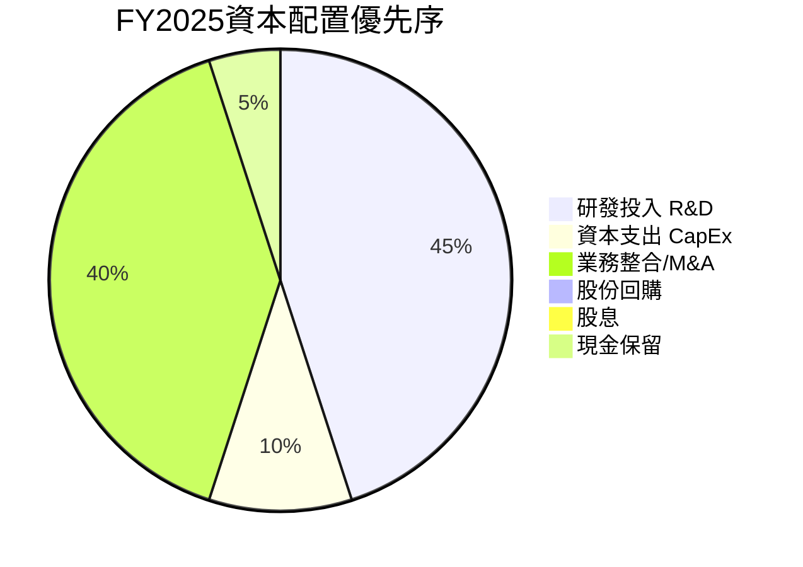

**資本配置評分**：

```
資本配置評估

研發投入（$100.73M, 12.3%收入）  ▓▓▓▓▓▓▓░░░  7/10 🟢 積極投入
M&A執行能力                        ▓▓▓▓░░░░░░  4/10 🟡 整合風險高
股東回報（股息/回購）               ░░░░░░░░░░  0/10 🔴 無任何回報
資本效率                           ▓▓▓░░░░░░░  3/10 🔴 FCF持續負值
```

---

<a id="6"></a>
## 6. 獲利能力與資本效率

### 6.1 ROE / ROA / ROIC 趨勢

| 獲利指標 | FY2022 | FY2023 | FY2024 | FY2025 | TTM | 行業均值 |
|---------|--------|--------|--------|--------|-----|---------|
| **ROE** | -0.7% | -32.0% | +7.3% | +4.9% | **-2.6%** | ~15-20% | 🔴 |
| **ROA** | -0.5% | -21.4% | +5.9% | +3.9% | **-1.2%** | ~5-8% | 🔴 |
| **ROIC** | ~-1% | ~-25% | ~+8% | ~+5% | **~-3%** | ~10-15% | 🔴 |
| **資產週轉率** | 0.49x | 0.66x | 0.70x | 0.73x | ~1.22x | 0.6-0.9x | 🟢 |

### 6.2 ROIC vs WACC 分析

```
╔═══════════════════════════════════════════════════════════╗
║                  ROIC vs WACC 分析                          ║
╠═══════════════════════════════════════════════════════════╣
║  WACC估算（FY2026）：                                         ║
║  • 無風險利率（10Y Treasury）：4.3%                           ║
║  • 市場風險溢酬（ERP）：5.5%                                  ║
║  • Beta：1.239                                              ║
║  • 股權成本（CAPM）：4.3% + 1.239×5.5% = 11.1%             ║
║  • 稅後債務成本（5.5%×(1-21%)）：4.35%                       ║
║  • 權益佔比：~75%，債務佔比：~25%                             ║
║  ┌─────────────────────────────────────────────┐           ║
║  │  WACC ≈ 75%×11.1% + 25%×4.35% ≈ 9.4%       │           ║
║  └─────────────────────────────────────────────┘           ║
║                                                             ║
║  TTM ROIC ≈ -3.0%                                          ║
║  EVA = ROIC - WACC = -3.0% - 9.4% = -12.4%                ║
║                                                             ║
║  ⚠️ 結論：AVAV目前正在【摧毀】股東價值                         ║
║  EVA < 0，每投入$1資本損失$0.124的經濟價值                     ║
║  轉折點預期：FY2027，需ROIC回升至>9.4%                        ║
╚═══════════════════════════════════════════════════════════╝
```

```
ROIC vs WACC 視覺對比

WACC基準線 ──────────────────── 9.4% ────────────────
                                  │
FY2022    🔴 ─$─1%               │  (遠低於WACC)
FY2023    🔴 ─$─25%              │  (商譽減損大幅惡化)
FY2024    🟢 ─$─+8%             │  (接近但低於WACC)
FY2025    🟡 ─$─+5%             │  (仍低於WACC)
TTM       🔴 ─$─-3%             │  (再度轉負)
                                  │
          ─────────────────────── 0% ────────────────
```

### 6.3 DuPont 三因子分解

| 年度 | 淨利率 | × 資產週轉率 | × 財務槓桿 | = ROE |
|------|--------|------------|----------|-------|
| FY2022 | -0.9% | 0.49x | 1.50x | **-0.7%** |
| FY2023 | -32.6% | 0.66x | 1.50x | **-32.3%** |
| FY2024 | +8.3% | 0.70x | 1.24x | **+7.2%** |
| FY2025 | +5.3% | 0.73x | 1.27x | **+4.9%** |
| TTM | -5.1% | 1.22x | 1.26x | **-7.8%** |

> **DuPont解讀**：
> - **淨利率**：波動最大，是ROE的主要驅動因子
> - **資產週轉率**：呈上升趨勢（0.49→1.22x），顯示資產使用效率在改善
> - **財務槓桿**：相對保守（1.24-1.50x），公司並未以高槓桿提升ROE

### 6.4 獲利能力儀表板

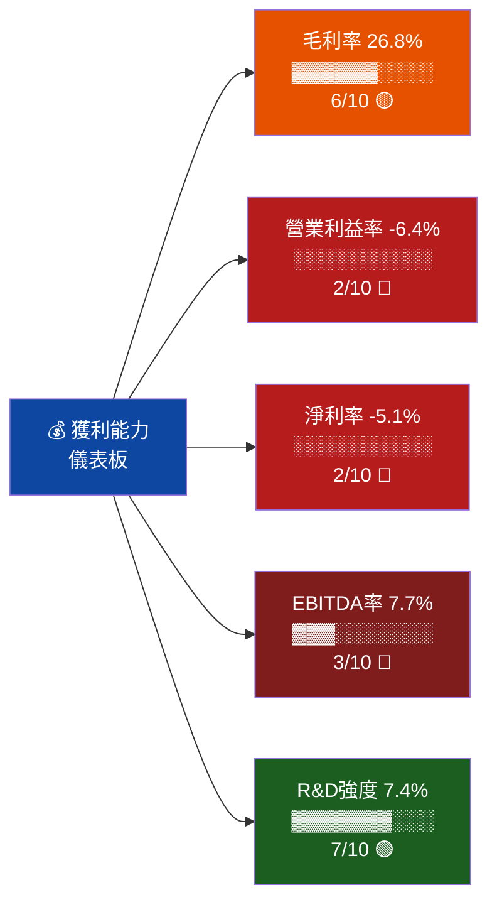

---

<a id="7"></a>
## 7. 估值深度分析

### 7.1 同業估值比較

| 估值指標 | **AVAV** | **KTOS**（Kratos） | **RCAT**（Red Cat） | **LHX**（L3Harris） | AVAV相對評估 |
|---------|---------|-----------------|------------------|------------------|------------|
| 前瞻P/E | **53.9x** | ~65x | N/M | ~18x | 🟡 居中但偏高 |
| P/S | **9.0x** | ~4.5x | ~12x | ~1.8x | 🔴 偏高 |
| EV/EBITDA | **124.8x** | ~45x | N/M | ~14x | 🔴 極度溢價 |
| P/B | **2.78x** | ~4.2x | ~8x | ~2.1x | 🟡 合理偏高 |
| FCF Yield | **-2.58%** | ~-1.5% | N/M | ~+4.5% | 🔴 負值 |
| 收入成長（YoY） | **+150.7%** | ~+15% | ~+80% | ~+5% | 🟢 最強 |
| 毛利率 | **26.8%** | ~25% | ~40% | ~16% | 🟢 良好 |

> **競爭對手說明**：
> - **KTOS（Kratos Defense）**：無人機+高超音速系統，最接近競爭對手
> - **RCAT（Red Cat Holdings）**：小型UAS，戰術無人機直接競爭者
> - **LHX（L3Harris）**：大型國防承包商，部分重疊但規模差異大

### 7.2 歷史估值區間分析

```
AVAV 52週股價區間與估值位置

$102.25                    $247.16         $417.86
  低位                      現價             高位
    │────────────────────────┼───────────────────│
    │░░░░░░░░░░░░░░░░░░░░░░░░▓▓▓▓▓▓▓▓▓▓▓▓▓▓▓▓░░░│
    │         低估區域         │ 合理→偏高區域  │高估│
    └─────────────────────────┘───────────────────┘
    
現價$247.16距52週高$417.86 = -40.9%（有修復空間）
現價$247.16距52週低$102.25 = +141.7%（已大幅反彈）
現價在52週區間的位置 = 46.4%分位數

前瞻P/E歷史區間估算：
  低點：20x → 隱含股價 ~$92
  中位：40x → 隱含股價 ~$183  
  當前：53.9x → 偏高
  高點：80x → 隱含股價 ~$367
```

### 7.3 DCF 敏感性分析矩陣

**基本假設**：
- FY2027 收入：$1.85B（+35% YoY），FY2028-2031 收入成長逐步降至15%
- 目標EBITDA利益率：12-18%（整合完成後）
- 永久成長率：3.0%
- 股本稀釋調整後股數：50M股

| **情境** | **WACC 8.5%** | **WACC 9.4%（基準）** | **WACC 10.5%** |
|---------|--------------|---------------------|----------------|
| 🟢 **樂觀**（收入CAGR 30%，利益率18%） | **$425** | **$380** | **$335** |
| 🟡 **基準**（收入CAGR 22%，利益率14%） | **$355** | **$330** | **$290** |
| 🔴 **悲觀**（收入CAGR 12%，利益率10%） | **$235** | **$215** | **$190** |

```
DCF目標價視覺化（當前股價$247.16）

悲觀/高折現率  $190  ██████████████░░░░░░░░░░░░░░  -23.1%
悲觀/基準率    $215  █████████████████░░░░░░░░░░░  -13.0%
             現價▼  $247 ────────────────────────── 基準線
基準/高折現率  $290  ██████████████████████░░░░░░  +17.3%
基準/基準率    $330  ████████████████████████████  +33.5% ⭐
樂觀/基準率    $380  ███████████████████████████████  +53.8%
樂觀/低折現率  $425  ████████████████████████████████████  +71.9%
```

### 7.4 估值區間綜合判斷

```
AVAV估值合理性判斷

低估區     ░░░░░░░░░░░░░░░░░░░░░░░░░░  ($0 - $200)
合理區     ▓▓▓▓▓▓▓▓▓▓▓▓▓▓▓▓░░░░░░░░░  ($200 - $350)  ← 現價$247位於此區間下半段
偏高區     ░░░░░░░░░░░░░░░░░░▓▓▓▓▓▓▓  ($350 - $420)  ← 分析師目標均值$372
泡沫區     ░░░░░░░░░░░░░░░░░░░░░░░░░░  ($420+)        ← 52週高點$417.86

結論：現價在成長假設成立前提下處於合理偏低估值區間
     但需警惕成長預期落空導致的估值壓縮風險
```

---

<a id="8"></a>
## 8. 成長催化劑

### 8.1 催化劑時間軸

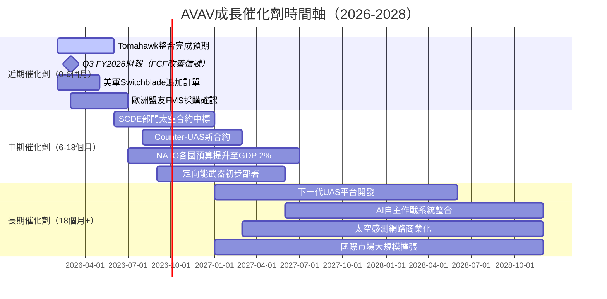

### 8.2 TAM 市場規模與滲透率

```
全球軍用無人機市場規模（TAM）分析

2025 軍用UAS市場    $25B  ████████████░░░░░░░░░░░░░░░░░░░░░░░░░░░
2027 預估           $35B  █████████████████░░░░░░░░░░░░░░░░░░░░░░
2030 預估           $55B  ████████████████████████████░░░░░░░░░░░
2035 預估           $90B  █████████████████████████████████████████

AVAV當前市佔率估算   ~5.5%（$1.37B / $25B）
目標市佔率（2030）   ~7-10%（凭借技術優勢擴大）
對應收入目標         $3.85B - $5.5B（vs 當前$1.37B）

游蕩彈藥市場（子集）
2025                $5B   ██████░░░░░░░░░░░  AVAV份額估~25%
2030                $15B  ████████████████░  成長3倍潛力

Counter-UAS市場
2025                $3B   ████░░░░░░░░░░░░░  新興高速成長
2030                $12B  █████████████████  成長4倍
```

### 8.3 成長驅動力架構

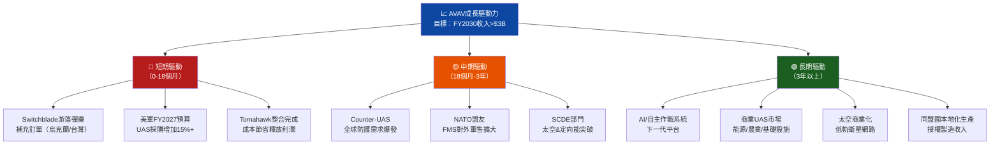

---

<a id="9"></a>
## 9. 風險矩陣

### 9.1 風險評分矩陣

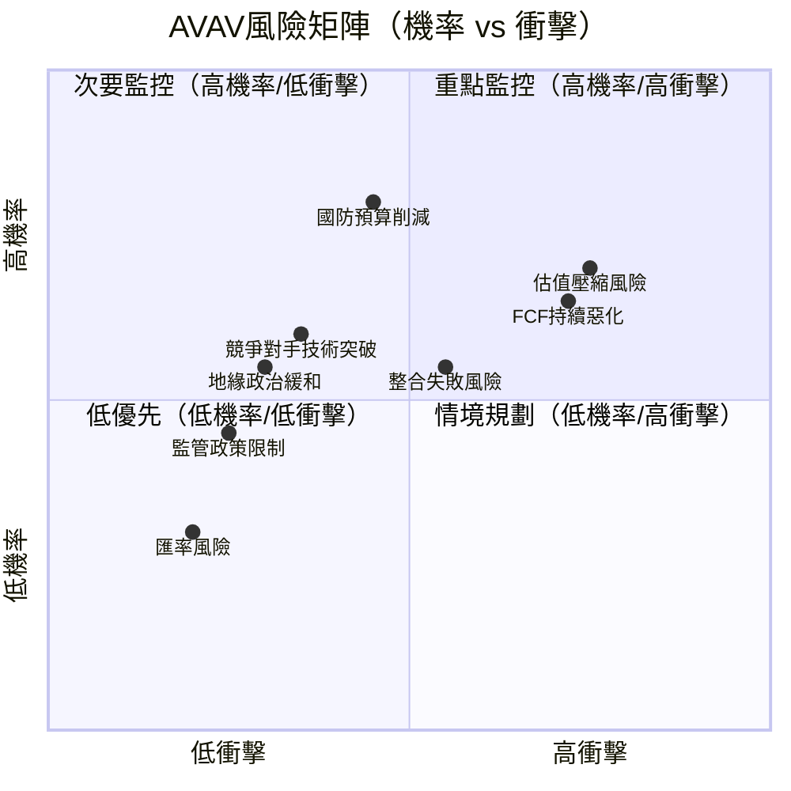

### 9.2 風險詳細清單

| 🚨 風險項目 | 機率 | 衝擊 | 綜合評分 | 緩解措施 |
|-----------|------|------|---------|---------|
| 🔴 **估值泡沫破裂** | 70% | 高 | **9/10** | 等FCF轉正後建倉；設定止損$200 |
| 🔴 **FCF持續惡化** | 65% | 高 | **8/10** | 監控季度經營現金流改善趨勢 |
| 🔴 **國防預算大幅削減（DOGE）** | 40% | 極高 | **8/10** | 多元化客戶（盟友+商業）對沖 |
| 🟡 **Tomahawk整合超預期失敗** | 50% | 高 | **7/10** | 追蹤整合費用下降與協同效益 |
| 🟡 **競爭對手技術突破** | 35% | 高 | **6/10** | AVAV持續R&D投入（$100M+/年） |
| 🟡 **地緣政治緩和（需求下滑）** | 30% | 高 | **6/10** | 結構性國防升級趨勢難以逆轉 |
| 🟡 **股份稀釋風險** | 50% | 中 | **5/10** | 監控股數變化及增發公告 |
| 🟢 **匯率波動** | 45% | 低 | **3/10** | 主要收入為美元合約，影響有限 |
| 🟢 **供應鏈中斷** | 30% | 中 | **3/10** | 戰略庫存備料，多元化供應商 |
| 🟢 **監管出口限制** | 20% | 中 | **2/10** | ITAR合規，FMS官方管道保護 |

---

<a id="10"></a>
## 10. 投資建議

### 10.1 最終綜合評分雷達圖

```
AVAV 投資維度綜合評分（各維度滿分10分）

維度              分數    視覺化進度條              評級
─────────────────────────────────────────────────
基本面品質        6/10   ▓▓▓▓▓▓░░░░  (60%)        🟡 中等
成長動能          8/10   ▓▓▓▓▓▓▓▓░░  (80%)        🟢 強勁
獲利能力          3/10   ▓▓▓░░░░░░░  (30%)        🔴 偏弱
財務健康度        5/10   ▓▓▓▓▓░░░░░  (50%)        🟡 中等
估值合理性        3/10   ▓▓▓░░░░░░░  (30%)        🔴 偏貴
管理層執行力      6/10   ▓▓▓▓▓▓░░░░  (60%)        🟡 中等
產業護城河        7/10   ▓▓▓▓▓▓▓░░░  (70%)        🟢 較強
分析師信心        8/10   ▓▓▓▓▓▓▓▓░░  (80%)        🟢 強烈看好
股東價值創造      2/10   ▓▓░░░░░░░░  (20%)        🔴 負EVA
─────────────────────────────────────────────────
加權綜合得分      5.3/10 ▓▓▓▓▓░░░░░  (53%)        🟡 觀望偏多
```

### 10.2 目標價與隱含報酬率

| 情境 | 目標價 | 隱含報酬率 | 關鍵假設 |
|------|--------|----------|---------|
| 🟢 **樂觀情境** | **$380** | **+53.8%** | FCF FY2027轉正，收入CAGR 30%，整合超預期 |
| 🟡 **基準情境** | **$330** | **+33.5%** | 收入CAGR 22%，利益率逐步回升至14% |
| 🔴 **悲觀情境** | **$215** | **-13.0%** | 預算削減，整合延誤，估值壓縮 |
| 📊 **分析師共識** | **$372** | **+50.5%** | 18位分析師平均目標價 |

```
目標價視覺化對比

$190 ─────────────┤悲觀下限
$215 ──────────────────┤悲觀目標  (-13%)
$247 ──────────────────────────┤ ← 現價
$290 ────────────────────────────────┤基準下限  (+17%)
$330 ──────────────────────────────────────┤基準目標  (+34%) ⭐
$372 ──────────────────────────────────────────────┤分析師均值 (+51%)
$380 ───────────────────────────────────────────────────┤樂觀目標  (+54%)
$425 ──────────────────────────────────────────────────────────┤樂觀上限  (+72%)
```

### 10.3 買入時機與觸發因素

```
買入時機 Checklist

必要條件（缺一不可）：
☐ 季度FCF轉正（經營現金流>$20M 連續2季）
☐ 毛利率回升至33%以上（整合完成信號）
☐ 管理層上調FY2027盈利指引
☐ Tomahawk整合費用低於$30M/季

加分條件（增加倉位的信號）：
☐ 新增單筆>$200M的大型UAS/Switchblade訂單
☐ NATO盟友新FMS採購合約確認
☐ Counter-UAS市場新合約中標
☐ JP Morgan/Goldman等目標價上調

風險警示（減倉/停損信號）：
⚠️ 股價跌破$200（關鍵技術支撐）
⚠️ 收入成長YoY低於20%連續2季
⚠️ 國防預算削減正式立法
⚠️ 分析師目標價下調幅度>15%
```

### 10.4 投資人適配度

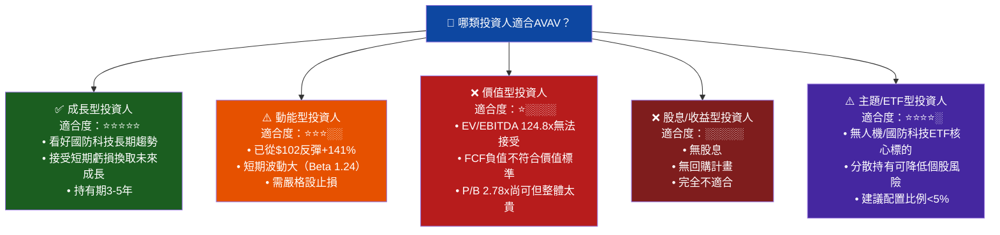

### 10.5 關鍵監控指標

```
📊 下次財報監控重點（Q3 FY2026，預期2026年3月）

財務指標監控：
☐ Q3 FY2026收入（市場預期 ~$500M+）
☐ 毛利率變化（改善目標：>28%）
☐ 經營現金流方向（正轉信號關鍵）
☐ Tomahawk整合費用金額
☐ 訂單積壓量（Backlog）變化

產業數據監控：
☐ 美國FY2027國防預算案進展（2026年3月）
☐ NATO成員國UAS採購公告
☐ 烏克蘭軍援追加撥款議案
☐ Counter-UAS市場競標結果

競爭動態監控：
☐ Kratos Defense（KTOS）新合約公告
☐ 中國軍用UAS出口禁令影響
☐ 新進競爭者（科技公司轉型）
☐ RCAT/Skydio等小型UAS廠商動態

估值監控觸發點：
☐ 分析師目標價變化（>$330為積極信號）
☐ 機構投資人持股比例變化
☐ 空頭比例（Short Float 8.4%）變化
☐ 期權市場隱含波動率（>60%為警戒）
```

---

## 📋 完整分析摘要表

| 分析維度 | 核心結論 | 評分 | 狀態 |
|---------|---------|------|------|
| **業務模式** | 軍用UAS+游蕩彈藥雙輪驅動，護城河深厚 | 7/10 | 🟢 |
| **收入成長** | TTM +150.7%（含M&A），有機成長~20-25% | 8/10 | 🟢 |
| **獲利能力** | 整合期虧損，FY2027轉盈是關鍵驗證點 | 3/10 | 🔴 |
| **財務健康** | 流動性佳但FCF負值，TTM淨負債$237M | 5/10 | 🟡 |
| **資本效率** | EVA<0，ROIC -3% < WACC 9.4% | 2/10 | 🔴 |
| **估值合理性** | EV/EBITDA 124.8x，需高速成長支撐 | 3/10 | 🔴 |
| **成長催化劑** | 國防預算增長+戰場驗證，中長期確定性高 | 8/10 | 🟢 |
| **風險管控** | 估值/FCF/整合三重風險需密切追蹤 | 4/10 | 🟡 |
| **分析師共識** | 18人買入，目標$372，+50%上漲空間 | 8/10 | 🟢 |
| **綜合評級** | **觀望/分批買入（等FCF轉正信號）** | **5.3/10** | 🟡 |

---

> ## ⚖️ 免責聲明
> 
> **本報告由 AI 系統自動生成，所有財務數據截至 2026-02-27，僅供學術研究與投資教育參考用途，不構成任何形式之投資建議。**
> 
> 投資涉及風險，股價可能大幅波動，過去表現不代表未來結果。讀者在做出任何投資決策前，應自行進行獨立研究，並諮詢持牌財務顧問。本報告作者（AI系統）及發布平台對任何依據本報告做出的投資決策所產生的損失不承擔任何法律責任。
> 
> *AeroVironment, Inc. (AVAV) 為 NASDAQ 上市公司，所有數據來源為公開市場信息。*