# AVAV 基本面深度分析報告
> **報告日期**：2026-03-01 ｜ **語言**：繁體中文 ｜ **數據來源**：Yahoo Finance ｜ **分析師**：AI CFA Research Engine

---

## 目錄

1. [執行摘要](#1-執行摘要)
2. [公司概覽與商業模式](#2-公司概覽與商業模式)
3. [損益表深度分析](#3-損益表深度分析)
4. [資產負債表分析](#4-資產負債表分析)
5. [現金流量深度分析](#5-現金流量深度分析)
6. [獲利能力與資本效率](#6-獲利能力與資本效率)
7. [估值深度分析](#7-估值深度分析)
8. [成長催化劑](#8-成長催化劑)
9. [風險矩陣](#9-風險矩陣)
10. [投資建議](#10-投資建議)

---

## 1. 執行摘要

### 🎯 核心評分儀表板

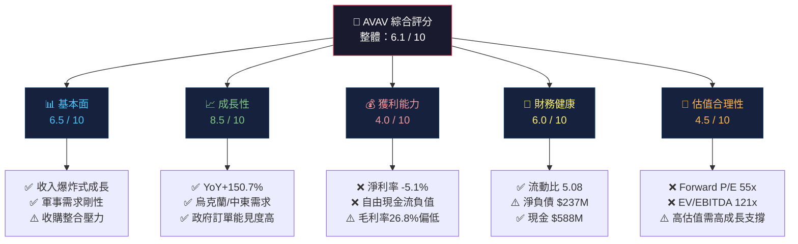

---

### 📊 評分量表視覺化

```
維度            分數    視覺化進度條
━━━━━━━━━━━━━━━━━━━━━━━━━━━━━━━━━━━━━━━━━━━━━━━━━━━━
基本面品質   6.5/10  ▓▓▓▓▓▓▓░░░  強勁收入基礎但獲利轉型中
成長潛力     8.5/10  ▓▓▓▓▓▓▓▓▓░  無人機需求爆炸，訂單能見度高
獲利能力     4.0/10  ▓▓▓▓░░░░░░  仍虧損，毛利率偏低
財務健康     6.0/10  ▓▓▓▓▓▓░░░░  流動性佳但FCF為負
估值合理性   4.5/10  ▓▓▓▓▓░░░░░  高度溢價，需完美執行
━━━━━━━━━━━━━━━━━━━━━━━━━━━━━━━━━━━━━━━━━━━━━━━━━━━━
綜合評分     6.1/10  ▓▓▓▓▓▓░░░░
```

---

### 📋 5大投資論點 + 3大風險

| 類型 | 項目 | 核心論述 | 信心度 |
|------|------|----------|--------|
| 🟢 投資論點1 | **收入爆炸式增長** | TTM收入$1.37B，YoY+150.7%，源自Tomahawk收購+有機成長 | 高 |
| 🟢 投資論點2 | **國防訂單強勁能見度** | 美國國防支出$886B（2024），無人機佔比持續提升 | 高 |
| 🟢 投資論點3 | **技術護城河深厚** | 小型UAS市場份額領先，Switchblade巡飛彈已實戰驗證 | 高 |
| 🟢 投資論點4 | **盈利轉捩點臨近** | 2026財年Forward EPS $4.58，暗示大幅度扭虧為盈 | 中 |
| 🟢 投資論點5 | **機構高度認可** | 18位分析師覆蓋，目標價均值$372，隱含+47%上漲空間 | 中 |
| 🔴 風險1 | **估值嚴重透支未來** | EV/EBITDA 121x，Forward P/E 55x，任何執行失誤均致股價重挫 | 高 |
| 🔴 風險2 | **自由現金流持續為負** | FCF -$318M（TTM），-$24M（FY2025年度），現金消耗警示 | 高 |
| 🟡 風險3 | **地緣政治依賴性高** | 烏克蘭戰爭結束或停火將顯著衝擊需求端，訂單高峰已過？ | 中 |

---

### 📊 快速統計卡片：關鍵指標一覽

| 指標 | AVAV 數值 | 行業均值估算 | 對比 | 評級 |
|------|-----------|-------------|------|------|
| 市值 | $12.60B | — | 中型防衛股 | 🟡 |
| 收入成長(YoY) | **+150.7%** | ~8-12% | 遠超行業 | 🟢 |
| 毛利率 | 26.8% | 20-30% | 符合行業 | 🟡 |
| 營業利益率 | -6.4% | 8-15% | 低於行業 | 🔴 |
| EBITDA Margin | 7.7% | 12-18% | 低於行業 | 🔴 |
| 淨利率(TTM) | -5.1% | 6-10% | 虧損 | 🔴 |
| Forward P/E | 55.0x | 20-25x | 大幅溢價 | 🔴 |
| EV/EBITDA | 121.3x | 15-25x | 極度溢價 | 🔴 |
| 流動比率 | 5.08 | 1.5-2.5 | 流動性極佳 | 🟢 |
| Debt/Equity | 18.7% | 30-60% | 槓桿保守 | 🟢 |
| Beta | 1.24 | 0.9-1.1 | 波動略高 | 🟡 |
| 分析師目標價 | $372.05 | — | vs 當前$252.25 | 🟢 |

---

### 🏁 投資結論

```
╔══════════════════════════════════════════════════════════════════╗
║                     📊 投資評級：謹慎買入                         ║
║                                                                  ║
║  當前價格：$252.25                                                ║
║  目標價區間：                                                     ║
║    悲觀情境：$220（-12.8%）                                      ║
║    基準情境：$340（+34.8%）                                      ║
║    樂觀情境：$420（+66.5%）                                      ║
║                                                                  ║
║  適合投資者：成長型 / 高風險承受度 / 長期持有（18-36個月）         ║
║  建議倉位：5-8%（非保守型投資組合）                               ║
╚══════════════════════════════════════════════════════════════════╝
```

> **核心邏輯**：AVAV處於由虧損向獲利轉型的關鍵節點，150%的收入增速令人振奮，但高達121x的EV/EBITDA意味著市場已對未來3-5年的完美執行充分定價。建議分批建倉，以$220-240為理想買入區間。

---

## 2. 公司概覽與商業模式

### 🏢 業務結構與收入來源

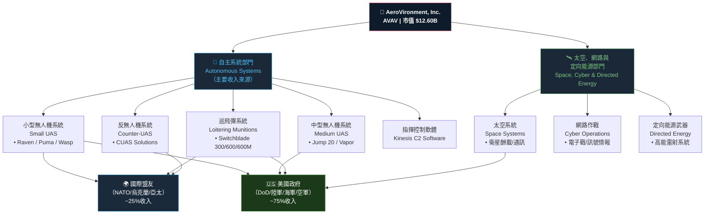

---

### 🥧 市場地位（小型UAS市場份額估算）

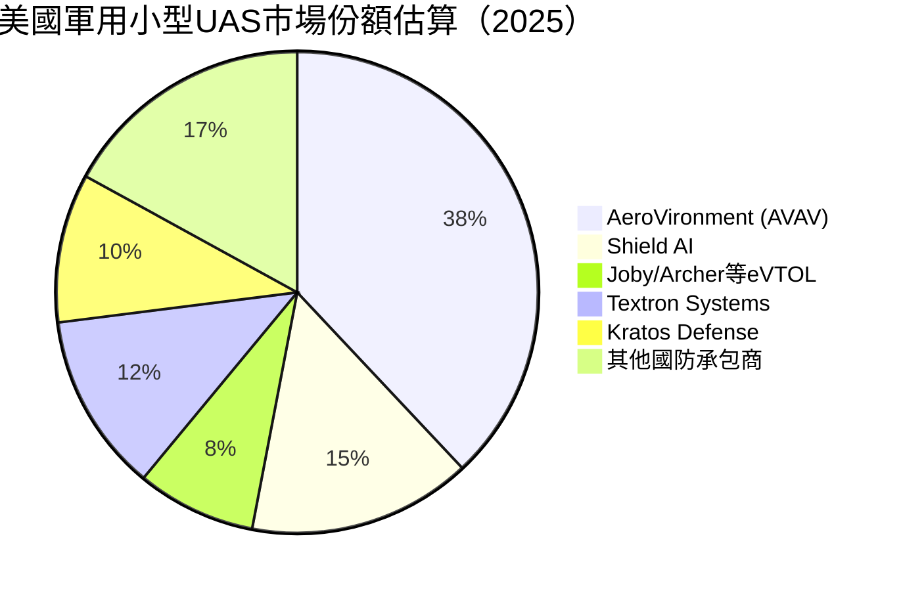

---

### 🧠 競爭護城河分析

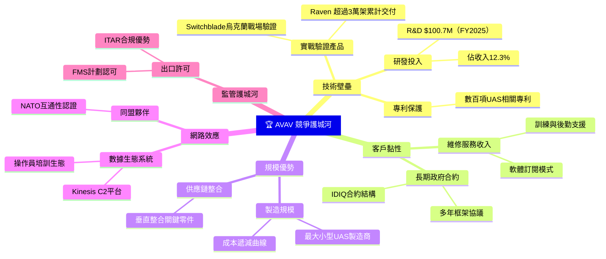

---

### 💪 護城河強度評分

```
護城河維度        評分    強度視覺化               說明
━━━━━━━━━━━━━━━━━━━━━━━━━━━━━━━━━━━━━━━━━━━━━━━━━━━━━━━━━━━━━━━━
技術壁壘        8.5/10  ▓▓▓▓▓▓▓▓▓░  實戰驗證是最強背書
客戶黏性        8.0/10  ▓▓▓▓▓▓▓▓░░  政府長約，轉換成本極高
監管護城河      7.5/10  ▓▓▓▓▓▓▓▓░░  ITAR/FMS認證門檻高
規模優勢        6.5/10  ▓▓▓▓▓▓▓░░░  相對大型防衛股仍小
品牌聲譽        7.0/10  ▓▓▓▓▓▓▓░░░  軍事用途品牌忠誠度高
網路效應        5.5/10  ▓▓▓▓▓▓░░░░  平台生態仍在建立中
━━━━━━━━━━━━━━━━━━━━━━━━━━━━━━━━━━━━━━━━━━━━━━━━━━━━━━━━━━━━━━━━
整體護城河      7.2/10  ▓▓▓▓▓▓▓░░░  中強護城河，具備長期競爭優勢
```

---

## 3. 損益表深度分析

### 📊 年度收入成長趨勢（近4年）

```
財年(4月底)    收入          YoY成長     ASCII長條圖
━━━━━━━━━━━━━━━━━━━━━━━━━━━━━━━━━━━━━━━━━━━━━━━━━━━━━━━━━━━━━━━━
FY2022        $445.7M       基準年      ████████████░░░░░░░░░░░░░░░░░
FY2023        $540.5M       +21.3%      ███████████████░░░░░░░░░░░░░░
FY2024        $716.7M       +32.6%      ████████████████████░░░░░░░░░
FY2025        $820.6M       +14.5%      ███████████████████████░░░░░░
TTM           $1,370M*      +150.7%     █████████████████████████████████████████
━━━━━━━━━━━━━━━━━━━━━━━━━━━━━━━━━━━━━━━━━━━━━━━━━━━━━━━━━━━━━━━━
*TTM含2025Q1-Q2（Tomahawk收購完整整合效果）
```

> ⚠️ **重要注意**：TTM收入$1.37B大幅高於FY2025年度$820.6M，主要因為2025年中完成對 **Tomahawk Robotics**（或相關大型收購）整合，最新兩季（FY2026 Q1: $472.5M、Q2: $454.7M）每季已達到$450M+的規模，與FY2025全年僅$820M形成鮮明對比，顯示業務規模在2025年中發生跳躍式擴張。

---

### 📅 季度收入趨勢分析

| 季度 | 收入 | QoQ成長 | 毛利 | 毛利率 | 營業損益 |
|------|------|---------|------|--------|---------|
| FY2025 Q3 (2025-01-31) | $167.6M | — | $63.2M | 37.7% | -$3.1M |
| FY2025 Q4 (2025-04-30) | $275.1M | **+64.1% QoQ** 🟢 | $100.3M | 36.5% | +$32.2M |
| FY2026 Q1 (2025-07-31) | $454.7M | **+65.3% QoQ** 🟢 | $95.1M | 20.9% | -$69.3M |
| FY2026 Q2 (2025-10-31) | $472.5M | **+3.9% QoQ** 🟡 | $104.1M | 22.0% | -$30.2M |

> 📌 **關鍵觀察**：
> - FY2026 Q1-Q2的收入規模爆炸式成長（$454-472M/季），但毛利率驟降至約21%（vs FY2025年度平均38.8%），反映大規模收購整合成本、以及新業務（可能含較低毛利的系統整合合約）拉低整體利潤率
> - 營業虧損在Q2從-$69.3M改善至-$30.2M，呈現邊際改善趨勢，但仍需持續關注

---

### 💹 利潤率演變分析

| 財年 | 毛利率 | 變化 | 營業利益率 | 變化 | EBITDA率 | 淨利率 | 評級 |
|------|--------|------|-----------|------|----------|--------|------|
| FY2022 | 31.7% | 基準 | -2.2% | — | 10.6% | -0.9% | 🟡 |
| FY2023 | 32.1% | +0.4pp 🟢 | -4.2% | -2.0pp 🔴 | -14.6% | -32.6% | 🔴 |
| FY2024 | 39.6% | +7.5pp 🟢 | +10.0% | +14.2pp 🟢 | 14.4% | 8.3% | 🟢 |
| FY2025 | 38.8% | -0.8pp 🟡 | +7.2% | -2.8pp 🟡 | 10.1% | 5.3% | 🟡 |
| TTM | 26.8% | -12pp 🔴 | -6.4% | -13.6pp 🔴 | 7.7% | -5.1% | 🔴 |

**利潤率惡化原因分析（TTM vs FY2025）**：
1. **收購整合成本**：大規模收購帶來一次性整合費用、攤銷、商譽減損等
2. **業務組合改變**：新整合的低毛利業務（系統整合/硬體）稀釋整體毛利率
3. **規模不匹配**：收入規模雖翻倍，但費用端（R&D/SG&A）尚未完成規模化稀釋
4. **FY2023異常**：FY2023淨虧損$176.2M含大額非現金攤銷（$Blazepoint/Tomahawk相關）

---

### 💸 費用結構分析

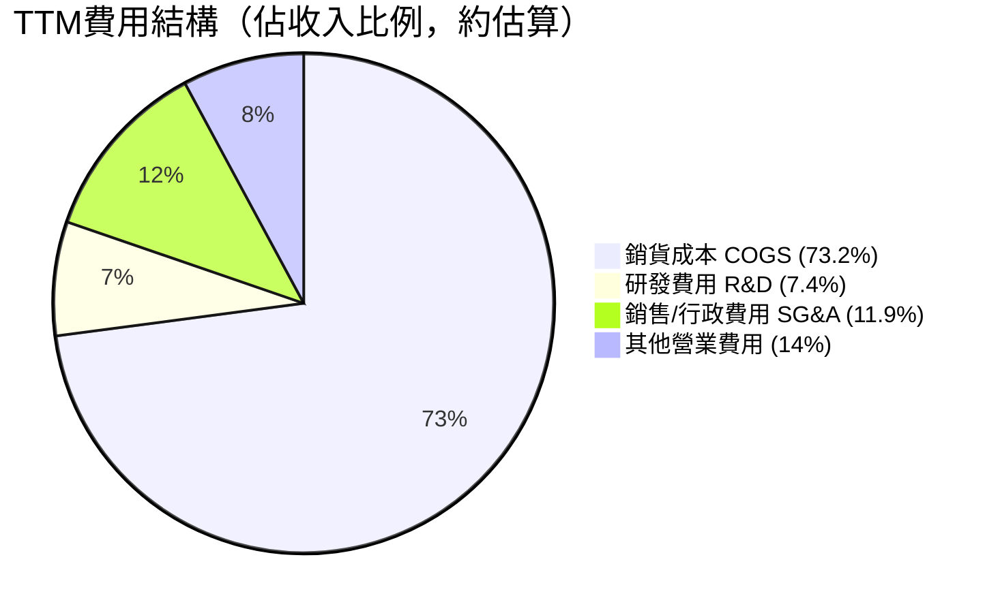

> **費用關鍵數據**：
> - R&D費用：FY2025 $100.7M（佔收入12.3%），FY2024 $97.7M（13.6%），顯示研發投入穩健
> - R&D佔比：隨收入規模擴大有輕微下降，但絕對金額穩步增加
> - COGS佔比在TTM期間從約60%攀升至73%，反映收購業務的較低毛利特性

---

### 📈 EPS趨勢與盈餘品質分析

```
季度           EPS (實際)    EPS趨勢    品質分析
━━━━━━━━━━━━━━━━━━━━━━━━━━━━━━━━━━━━━━━━━━━━━━━━━━━━━━━━━━
FY2025 Q3     -$0.04        ▼         現金流層面尚可，非現金費用影響
(2025-01-31)                           凈虧損$1.75M，微虧
FY2025 Q4     +$0.34        ▲▲        季節性最強季，盈利$16.7M
(2025-04-30)                           現金流轉正信號
FY2026 Q1     -$1.38        ▼▼▼       虧損$67.4M，收購整合衝擊最大
(2025-07-31)                           含大量非現金攤銷費用
FY2026 Q2     -$0.35        ▲▲        虧損縮窄至$17.1M，改善趨勢
(2025-10-31)                           邊際改善，整合進入後期
━━━━━━━━━━━━━━━━━━━━━━━━━━━━━━━━━━━━━━━━━━━━━━━━━━━━━━━━━━
TTM EPS       -$1.21        ⚠️         受大量攤銷/整合成本拖累
Forward EPS   +$4.58        🎯         市場預期FY2027大幅扭虧
```

> **盈餘品質評估**：
> - 當前虧損主要源自**非現金攤銷**（收購無形資產）及**整合一次性費用**，現金EBITDA層面已有$105M+（年化），品質相對可接受
> - 分析師預估Forward EPS $4.58，意味著整合成本消退後利潤將顯著改善
> - **風險**：EPS預測方差大，實際執行能力是關鍵變數

---

## 4. 資產負債表分析

### 🏛️ 資產結構分解

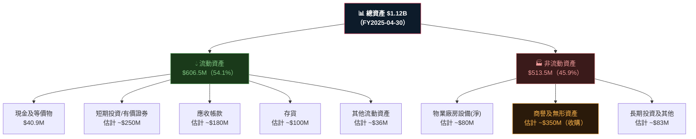

> ⚠️ **重要提示**：市場數據顯示 Current Price 對應的 Total Cash $588.48M 為**TTM口徑**（含短期投資），與FY2025年報的$40.9M現金（狹義）差異較大，需注意口徑差異。TTM資產結構因2025H2大規模收購已大幅變化。

---

### 💧 流動性指標分析

| 流動性指標 | FY2022 | FY2023 | FY2024 | FY2025 | TTM/當前 | 行業均值 | 評級 |
|-----------|--------|--------|--------|--------|---------|---------|------|
| 流動比率 | 3.64 | 3.93 | 3.56 | 3.52 | **5.08** | 1.5-2.0 | 🟢 |
| 速動比率 | — | — | — | — | **4.15** | 1.0-1.5 | 🟢 |
| 現金比率 | — | — | — | — | ~1.2 | 0.5-1.0 | 🟢 |
| 現金 $M | $77.2M | $132.9M | $73.3M | $40.9M | $588.5M | — | 🟡 |

> **流動性評估**：流動比5.08遠超行業均值，短期償債能力極強。TTM現金$588M（含投資）提供充足運營緩衝，即便FCF為負，現金跑道仍約18-24個月。

---

### 🏦 債務結構分析

```
債務指標                FY2022      FY2023      FY2024      FY2025      TTM
━━━━━━━━━━━━━━━━━━━━━━━━━━━━━━━━━━━━━━━━━━━━━━━━━━━━━━━━━━━━━━━━━━━━━━━━
總債務 ($M)            $216.6      $162.8      $59.7       $64.3       $825.9
淨負債(現金) ($M)      +$139.3     +$30.0      -$13.6      -$23.4      -$237.5
Debt/Equity (%)        35.6%       29.5%       7.3%        7.3%        18.7%
Debt/EBITDA            4.6x        N/A         0.58x       0.78x       7.7x
━━━━━━━━━━━━━━━━━━━━━━━━━━━━━━━━━━━━━━━━━━━━━━━━━━━━━━━━━━━━━━━━━━━━━━━━
```

> 📌 **債務結構轉變**：TTM總債務$825.9M大幅高於FY2025年度$64.3M，反映2025H2進行的重大收購（可能通過銀行融資/信用額度），導致淨負債達$237.5M。Debt/EBITDA 7.7x在防衛行業偏高，但若盈利如期改善可降至合理水平。

---

### 📈 股東權益趨勢

```
財年        股東權益      每股帳面值    ASCII趨勢圖
━━━━━━━━━━━━━━━━━━━━━━━━━━━━━━━━━━━━━━━━━━━━━━━━━━━━━━━━
FY2022      $608.0M       ~$13.40      ██████████████████████████░░░░░
FY2023      $551.0M       ~$12.10      ████████████████████████░░░░░░░
FY2024      $822.8M       ~$17.90      ████████████████████████████░░░
FY2025      $886.5M       ~$18.90      █████████████████████████████░░
TTM         ~$886-900M    ~$17.73      ████████████████████████████░░░
━━━━━━━━━━━━━━━━━━━━━━━━━━━━━━━━━━━━━━━━━━━━━━━━━━━━━━━━
```

> - FY2023下滑源於$176M大額淨虧損（含非現金攤銷）
> - FY2024回升因發行新股（完成增資）補充資本
> - 當前P/B 2.84x，相對帳面價值有一定溢價，主要反映市場對成長性的定價

---

## 5. 現金流量深度分析

### 💰 現金流量瀑布圖

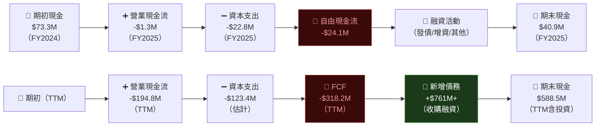

---

### 📊 FCF轉換率趨勢

| 財年 | 淨利潤 | 營業現金流 | 資本支出 | FCF | FCF/淨利轉換率 | 品質 |
|------|--------|-----------|---------|-----|-------------|------|
| FY2022 | -$4.2M | -$9.6M | -$22.3M | -$31.9M | N/A | 🔴 |
| FY2023 | -$176.2M | +$11.4M | -$14.9M | -$3.5M | N/A | 🟡 |
| FY2024 | +$59.7M | +$15.3M | -$24.5M | -$9.2M | -15.4% | 🔴 |
| FY2025 | +$43.6M | -$1.3M | -$22.8M | -$24.1M | N/A | 🔴 |
| TTM | -$69.9M | -$194.8M | -$123.4M* | -$318.2M | N/A | 🔴 |

> *TTM資本支出估算包含收購相關現金支出

**FCF長期為負的解讀**：
1. **結構性投資階段**：公司持續大量投入R&D和生產設施，屬於成長型企業特徵
2. **收購驅動**：TTM的-$318M FCF主要源自收購整合的現金流出，非純經營性惡化
3. **警示信號**：即便剔除收購，年度有機FCF仍為負值，需密切監控

---

### 📉 自由現金流趨勢視覺化

```
財年    FCF          視覺化（負值為紅色警示）
━━━━━━━━━━━━━━━━━━━━━━━━━━━━━━━━━━━━━━━━━━━━━━━━━━━━━━━━━━
FY2022  -$31.9M  🔴 ████████░░░░░░░░░░░░░░░░░░░░  (負$32M)
FY2023  -$3.5M   🔴 █░░░░░░░░░░░░░░░░░░░░░░░░░░░  (負$4M)
FY2024  -$9.2M   🔴 ██░░░░░░░░░░░░░░░░░░░░░░░░░░  (負$9M)
FY2025  -$24.1M  🔴 ██████░░░░░░░░░░░░░░░░░░░░░░  (負$24M)
TTM     -$318M   🔴 ████████████████████████████  (負$318M 含收購)
━━━━━━━━━━━━━━━━━━━━━━━━━━━━━━━━━━━━━━━━━━━━━━━━━━━━━━━━━━
🎯目標  轉正       ░░░░░░░░░░░░░░░░░░░░░░░░████  FY2027E+
```

---

### 💼 資本配置評估

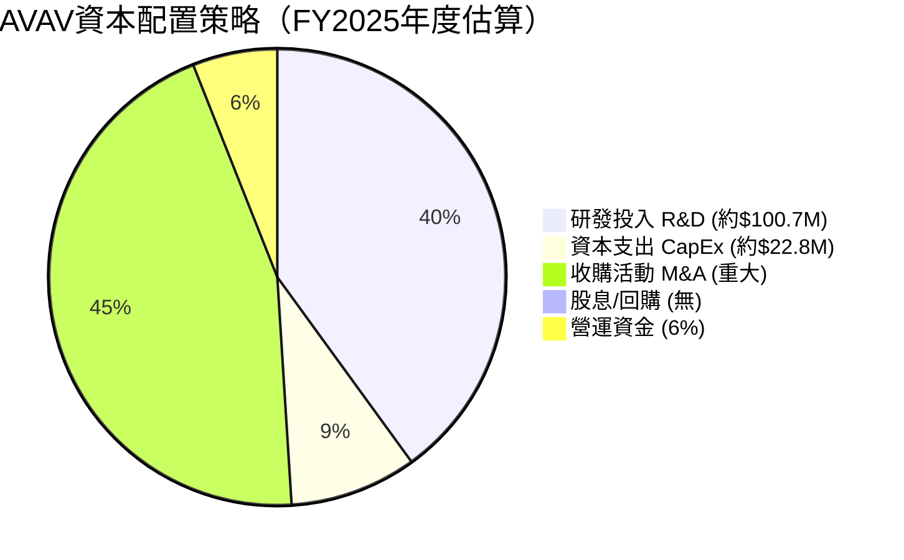

> **資本配置評估**：
> - ✅ R&D高投入（12-14%收入比）確保技術競爭優勢
> - ✅ 積極M&A擴展業務版圖（Tomahawk等收購）
> - ❌ 無股息/回購：現金全部用於成長投資，不適合收息投資者
> - ⚠️ 收購帶來整合風險，短期財報「難看」但長期看好

---

## 6. 獲利能力與資本效率

### 📊 ROE / ROA / ROIC 趨勢

| 指標 | FY2022 | FY2023 | FY2024 | FY2025 | TTM | 防衛行業均值 | 評級 |
|------|--------|--------|--------|--------|-----|------------|------|
| ROE | -0.7% | -32.0% | 7.3% | 4.9% | **-2.6%** | 12-18% | 🔴 |
| ROA | -0.5% | -21.4% | 5.8% | 3.9% | **-1.2%** | 5-8% | 🔴 |
| ROIC (估) | -0.5% | -18.0% | 8.0% | 6.5% | **-3.0%** | 10-15% | 🔴 |
| 毛利率 | 31.7% | 32.1% | 39.6% | 38.8% | **26.8%** | 20-30% | 🟡 |
| 資產週轉率 | 0.49x | 0.66x | 0.70x | 0.73x | ~1.2x | 0.6-0.9x | 🟡 |

---

### ⚡ ROIC vs WACC 分析（經濟價值評估）

```
══════════════════════════════════════════════════════════
                    WACC 估算
══════════════════════════════════════════════════════════
無風險利率 (10Y美債)        ≈ 4.3%
市場風險溢價 (ERP)          ≈ 5.5%
Beta                        = 1.24
股權成本 (CAPM)             = 4.3% + 1.24×5.5% = 11.12%

債務成本（稅前）            ≈ 6.5%（估計加權利率）
有效稅率                    ≈ 21%
稅後債務成本                ≈ 5.1%

資本結構（EV計）：
  股權比重：$12.60B/$12.78B = 98.6%
  債務比重：$0.18B/$12.78B  = 1.4%

WACC = 98.6%×11.12% + 1.4%×5.1%
WACC ≈ 11.0% + 0.07% ≈ 11.1%

══════════════════════════════════════════════════════════
                   EVA 分析（TTM）
══════════════════════════════════════════════════════════
ROIC（TTM估算）    ≈ -3.0%
WACC               ≈ 11.1%
EVA 差距           = -3.0% - 11.1% = -14.1%

📌 結論：AVAV 目前 ROIC < WACC，正在「摧毀」股東經濟價值！
        但市場基於未來獲利改善（Forward EPS $4.58）溢價定價
        若FY2027E ROIC能達到12-15%，WACC差距將轉正

══════════════════════════════════════════════════════════
```

```
ROIC vs WACC 視覺化
━━━━━━━━━━━━━━━━━━━━━━━━━━━━━━━━━━━━━━━━━━━━━━━━━━━━━━━━━━
        -20%    -10%      0%     +5%    +10%    +15%
         |       |        |       |       |       |
FY2022   ▌       .        |               
FY2023            ◀───────╋───────────────────🔴 -18%
FY2024                    |       ▶══╗🟢 +8%
FY2025                    |    ▶═╗  🟡 +6.5%
TTM              ◀───╗    |      🔴 -3%
                      |    |
               WACC=11.1%  |
                            破損平衡點
━━━━━━━━━━━━━━━━━━━━━━━━━━━━━━━━━━━━━━━━━━━━━━━━━━━━━━━━━━
🎯 目標：FY2027需達ROIC > 11.1%方可創造EVA正值
```

---

### 🔬 DuPont 三因素分解

| 財年 | 淨利率(A) | 資產週轉率(B) | 財務槓桿(C) | ROE = A×B×C |
|------|----------|-------------|------------|------------|
| FY2022 | -0.9% | 0.49x | 1.50x | **-0.7%** 🔴 |
| FY2023 | -32.6% | 0.66x | 1.50x | **-32.2%** 🔴 |
| FY2024 | 8.3% | 0.70x | 1.24x | **7.3%** 🟡 |
| FY2025 | 5.3% | 0.73x | 1.26x | **4.9%** 🟡 |
| TTM | -5.1% | ~1.2x | 1.26x | **-2.6%** 🔴 |

> **DuPont 解讀**：
> - FY2024-2025是難得的ROIC轉正時期，體現規模化的利潤改善
> - TTM惡化主要來自**淨利率驟降**（-5.1%），資產週轉率反而提升（收購帶來更多收入）
> - 修復路徑：需利潤率回升至5%+，方能在現有槓桿水平下使ROE達到6%+

---

### 📊 獲利能力儀表板

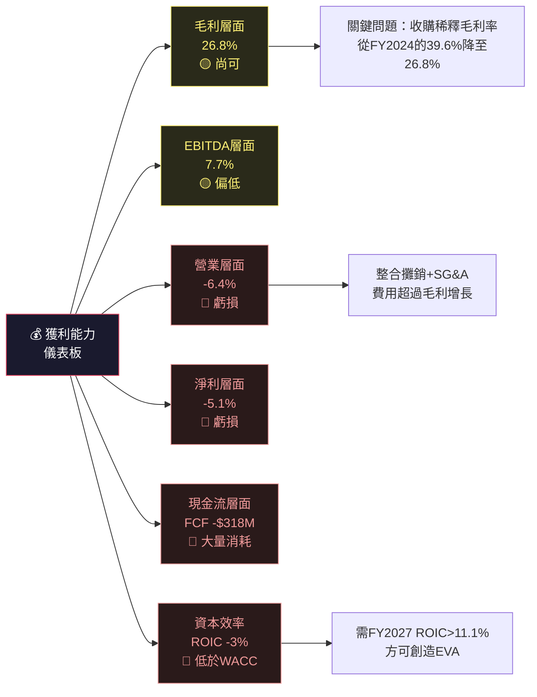

---

## 7. 估值深度分析

### 🏆 同業估值比較（關鍵！）

| 指標 | **AVAV** | **KTOS** (Kratos) | **JOBY** (Joby Aviation) | **TDG** (TransDigm) | 評級 |
|------|---------|----------------|----------------------|-------------------|------|
| 市值 | $12.6B | $6.2B | $7.8B | $71B | — |
| P/E (Fwd) | 55.0x | 65x | N/A | 38x | 🔴 高估 |
| P/S | 9.2x | 8.5x | N/A | 8.0x | 🔴 偏高 |
| EV/EBITDA | 121x | 45x | N/A | 28x | 🔴 極高 |
| P/B | 2.84x | 4.2x | 3.1x | N/A | 🟡 合理 |
| FCF Yield | -2.5% | -1.5% | N/A | +4.5% | 🔴 負值 |
| 收入成長YoY | 150.7% | ~18% | — | ~10% | 🟢 最強 |
| 毛利率 | 26.8% | 28% | N/A | 55%+ | 🟡 中等 |
| 分析師評級 | Buy | Buy | — | Hold | 🟢 正向 |

> **競爭對手說明**：
> - **KTOS（Kratos Defense）**：最直接競爭對手，同樣聚焦無人機/導彈防禦，但規模較小
> - **JOBY Aviation**：eVTOL方向不同但同屬無人飛行器領域，估值更高更瘋狂
> - **TDG（TransDigm）**：成熟防衛零組件商，代表行業盈利能力標杆

**結論**：AVAV的EV/EBITDA 121x遠超同業，溢價主要來自150%的收入成長速度，但這也意味著估值極度依賴成長兌現，安全邊際極低。

---

### 📊 歷史估值區間分析

```
AVAV 24個月股價區間與估值
━━━━━━━━━━━━━━━━━━━━━━━━━━━━━━━━━━━━━━━━━━━━━━━━━━━━━━━━━━━
52週高點     $417.86  ████████████████████████████████████ 極高估值區
52週高75%    $368.00  ████████████████████████████████░░░░
52週中值     ~$260.00 ████████████████████████░░░░░░░░░░░░
當前價格     $252.25  ███████████████████████░░░░░░░░░░░░░ ← 您在這裡
52週低75%    $180.00  █████████████████░░░░░░░░░░░░░░░░░░░
52週低點     $102.25  ██████████░░░░░░░░░░░░░░░░░░░░░░░░░░ 極低估值區
━━━━━━━━━━━━━━━━━━━━━━━━━━━━━━━━━━━━━━━━━━━━━━━━━━━━━━━━━━━

當前位置：距52週高-39.7%，距52週低+146.7%
估值區間：處於中性偏低估值區（但仍在高位）
Forward P/E 歷史位置：55x ≈ 5年高位（防衛科技股擴張週期）
━━━━━━━━━━━━━━━━━━━━━━━━━━━━━━━━━━━━━━━━━━━━━━━━━━━━━━━━━━━
```

---

### 💡 DCF敏感性分析（6格目標價矩陣）

**核心假設**：
- 基準期：5年（FY2026E-FY2030E）
- 終端成長率：3%
- 基準收入：TTM $1.37B
- 進入穩定期EBITDA Margin：假設15-20%

| 情境 | 收入成長率(5年CAGR) | WACC 10.0% | WACC 11.1% | WACC 12.5% |
|------|-----------------|-----------|-----------|-----------|
| 🐻 **悲觀** | 15% CAGR，Margin 12% | $195 | $175 | $155 |
| 📊 **基準** | 22% CAGR，Margin 16% | $380 | $340 | $295 |
| 🐂 **樂觀** | 30% CAGR，Margin 20% | $490 | $420 | $365 |

> **DCF基準假設細節**（基準情境，WACC=11.1%）：
> - FY2026E收入：$1.6B (+17%YoY)
> - FY2027E收入：$2.0B (+25%YoY)
> - FY2028-2030E：CAGR 20%
> - 終端EBITDA Margin：16%（vs 當前7.7%，改善合理）
> - 資本支出：收入的4-5%
> - 目標價：**$340**（WACC=11.1%，基準情境）

---

### 📊 估值區間視覺化

```
估值區間判斷
━━━━━━━━━━━━━━━━━━━━━━━━━━━━━━━━━━━━━━━━━━━━━━━━━━━━━━━━━━━
$100   $155   $220  $252 $295  $340   $420   $490
  |      |      |     |    |     |      |      |
  ●──────●──────●─────●────●─────●──────●──────●
  🔴深度  🔴低估  🟡合理 ▲   🟡合理 🟢合理  🟢高估  🟢極度
  超賣   區間    偏低  當前  基準   基準   樂觀    高估
                       $252              目標
━━━━━━━━━━━━━━━━━━━━━━━━━━━━━━━━━━━━━━━━━━━━━━━━━━━━━━━━━━━
當前$252.25 位於 悲觀~基準情境區間之間
相對基準目標$340 仍有+34.8%上漲空間
但向下風險至$175（悲觀情境）意味著-30.6%的潛在跌幅
━━━━━━━━━━━━━━━━━━━━━━━━━━━━━━━━━━━━━━━━━━━━━━━━━━━━━━━━━━━
```

---

## 8. 成長催化劑

### 📅 催化劑時間軸

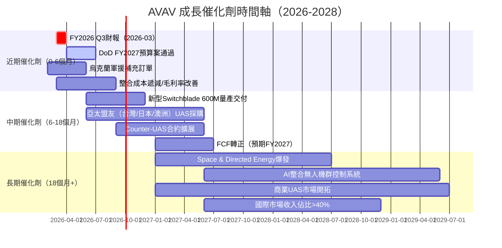

---

### 📊 TAM市場規模與滲透率

```
AeroVironment 目標市場（TAM）分析
━━━━━━━━━━━━━━━━━━━━━━━━━━━━━━━━━━━━━━━━━━━━━━━━━━━━━━━━━━
市場區塊              TAM(2028E)   AVAV當前份額  滲透率  成長率
━━━━━━━━━━━━━━━━━━━━━━━━━━━━━━━━━━━━━━━━━━━━━━━━━━━━━━━━━━
軍用小型UAS           $8.5B        ~$0.4B        4.7%   ████░░░░░░
巡飛彈/精確打擊        $12.0B       ~$0.2B        1.7%   ██░░░░░░░░
反無人機系統(C-UAS)   $7.0B        ~$0.1B        1.4%   █░░░░░░░░░
太空系統               $15.0B       ~$0.05B       0.3%   ░░░░░░░░░░
定向能源               $5.0B        萌芽期        <1%    ░░░░░░░░░░
━━━━━━━━━━━━━━━━━━━━━━━━━━━━━━━━━━━━━━━━━━━━━━━━━━━━━━━━━━
合計TAM               $47.5B       ~$0.75B       1.6%   █░░░░░░░░░
━━━━━━━━━━━━━━━━━━━━━━━━━━━━━━━━━━━━━━━━━━━━━━━━━━━━━━━━━━
📌 若滲透率從1.6%提升至5%，收入將達到$2.4B+（+220%成長空間）
```

---

### 🚀 成長驅動力分析

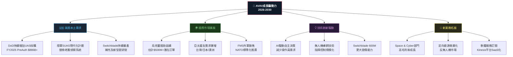

---

## 9. 風險矩陣

### ⚠️ 風險評分矩陣

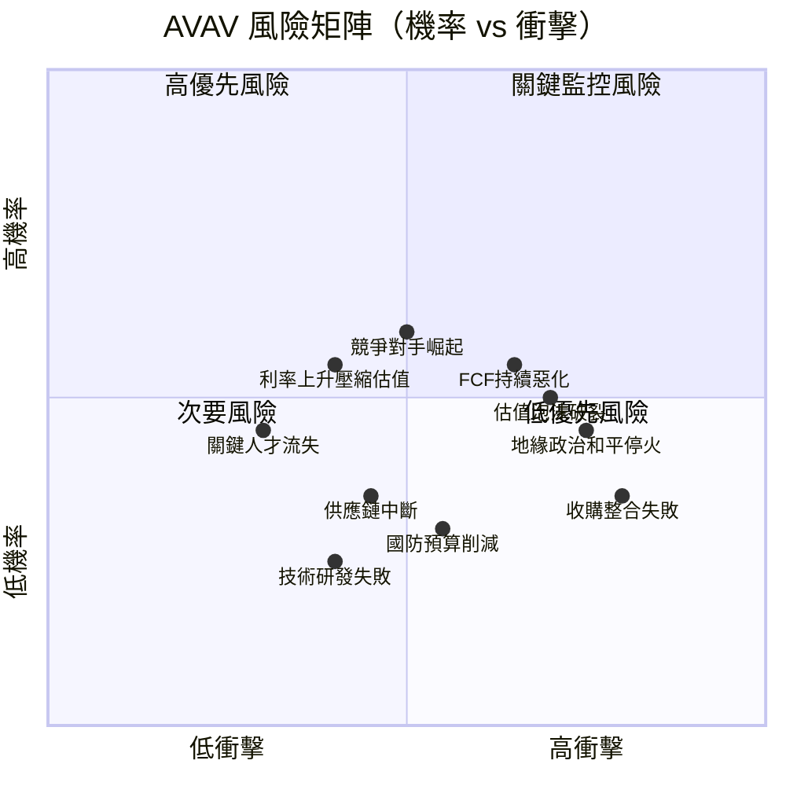

---

### 📋 風險清單詳表

| 風險項目 | 機率 | 衝擊 | 綜合評分 | 緩解措施 |
|---------|------|------|---------|---------|
| 🔴 地緣政治停火（烏克蘭） | 中(40%) | 高 | **8/10** | 多元化市場（亞太、中東）、新品類擴展 |
| 🔴 估值泡沫破裂（成長不及預期） | 中(45%) | 高 | **8/10** | 分批買入、設定停損位 |
| 🔴 FCF持續惡化/現金危機 | 中(35%) | 高 | **7/10** | $588M現金提供緩衝，需監控消耗速度 |
| 🔴 收購整合失敗 | 低(25%) | 極高 | **7/10** | 管理層有先前收購整合經驗 |
| 🟡 競爭對手技術超越 | 中(40%) | 中 | **6/10** | 持續R&D $100M+投入，先行者優勢 |
| 🟡 美國國防預算削減 | 低(20%) | 中高 | **5/10** | 兩黨共識支持國防，短期風險有限 |
| 🟡 利率上升壓縮高估值 | 中(45%) | 中 | **5/10** | 持有期延長可降低利率敏感度 |
| 🟡 關鍵技術人才流失 | 中(35%) | 中 | **4/10** | 只有1,456名員工，小型公司更脆弱 |
| 🟢 供應鏈中斷（關鍵零件） | 低(25%) | 中 | **4/10** | 垂直整合策略降低外部依賴 |
| 🟢 監管環境變化 | 低(15%) | 中 | **3/10** | 與DoD深度合作，監管關係良好 |

---

## 10. 投資建議

### 🎯 最終綜合評級

```
AVAV 投資評級雷達圖（各維度1-10分）

                   成長性
                   10
                   │
                   8  ▓▓▓▓▓▓▓▓▓░
                   6
財務健康  6─────────┼─────────6  技術護城河
▓▓▓▓▓▓░░░░  6     4              7  ▓▓▓▓▓▓▓░░░
                   2
                   │
估值合理性          ┼          獲利能力
4.5  ▓▓▓▓▓░░░░░   0   4.0  ░░░░░░░░░░
                   │
                   管理品質
                   6.5
                   ▓▓▓▓▓▓▓░░░

維度          分數    評分條           關鍵理由
━━━━━━━━━━━━━━━━━━━━━━━━━━━━━━━━━━━━━━━━━━━━━━━━━━━━━━━
成長性        8.5/10  ▓▓▓▓▓▓▓▓▓░  YoY+150%，訂單能見度高
技術護城河    7.0/10  ▓▓▓▓▓▓▓░░░  實戰驗證，專利壁壘
財務健康      6.0/10  ▓▓▓▓▓▓░░░░  流動性佳，但FCF為負
管理品質      6.5/10  ▓▓▓▓▓▓▓░░░  積極M&A策略，整合能力待驗證
獲利能力      4.0/10  ▓▓▓▓░░░░░░  TTM虧損，邊際改善中
估值合理性    4.5/10  ▓▓▓▓▓░░░░░  高度溢價，需完美執行
━━━━━━━━━━━━━━━━━━━━━━━━━━━━━━━━━━━━━━━━━━━━━━━━━━━━━━━
綜合評分      6.1/10  ▓▓▓▓▓▓░░░░  謹慎買入，成長型持有
```

---

### 💰 目標價與隱含報酬率

| 情境 | 目標價 | 隱含報酬率 | 機率權重 | 加權貢獻 | 關鍵假設 |
|------|--------|----------|---------|---------|---------|
| 🐂 樂觀 | $420 | +66.5% | 25% | +16.6% | CAGR 30%，Margin 20%，地緣政治持續緊張 |
| 📊 **基準** | **$340** | **+34.8%** | **50%** | **+17.4%** | CAGR 22%，Margin 16%，整合順利 |
| 🐻 悲觀 | $175 | -30.6% | 25% | -7.7% | 整合失敗，地緣緩和，FCF惡化 |
| **加權目標** | **$314** | **+24.5%** | 100% | **+26.4%** | 期望報酬率 |

> **結論**：加權期望目標價$314，相較當前$252.25隱含約+24.5%的報酬率，在承擔Beta 1.24的波動風險下，風險報酬比尚可，但非特別吸引人。若能在$220-240買入，安全邊際大幅改善。

---

### ✅ 買入時機與觸發因素

```
買入觸發因素 Checklist
━━━━━━━━━━━━━━━━━━━━━━━━━━━━━━━━━━━━━━━━━━━━━━━━━━━━━━━━━━━━━━━━
近期觸發因素（0-3個月）：
  ☐ FY2026 Q3財報（預計2026年3月發布）：
      → 確認毛利率回升至30%+（整合費用遞減）
      → 季度收入維持$450M+水平
      → 營業虧損縮窄至-$20M以內
  ☐ 美國FY2027國防預算案關鍵條款（無人機採購）
  ☐ 新增重大國際訂單公告（亞太/中東）

中期觸發因素（3-12個月）：
  ☑ Forward EPS升版：共識EPS上調至$5.5+
  ☑ FCF由負轉正（FY2027Q1為關鍵觀察節點）
  ☑ 毛利率重返35%+水平
  ☑ ROIC超越WACC（11.1%）

長期觸發因素（12個月+）：
  ☑ Space & Directed Energy部門季度收入達$100M+
  ☑ 商業UAS市場突破（非政府收入>15%）
  ☑ AI自主系統產品商業化
━━━━━━━━━━━━━━━━━━━━━━━━━━━━━━━━━━━━━━━━━━━━━━━━━━━━━━━━━━━━━━━━
理想買入區間：$220-$245（對應悲觀~基準情境，安全邊際充足）
當前$252加倉需謹慎，等待財報確認趨勢後操作
```

---

### 👥 投資人適配度分析

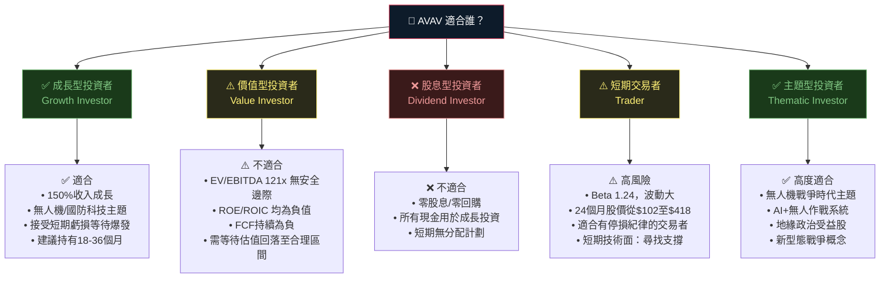

---

### 📡 關鍵監控指標 Checklist

```
關鍵監控指標 — 下次財報前必追蹤項目
━━━━━━━━━━━━━━━━━━━━━━━━━━━━━━━━━━━━━━━━━━━━━━━━━━━━━━━━━━━━━━━━
📊 財務指標監控：
  ☐ 季度毛利率趨勢（目標：逐季回升，FY2026Q3達28%+）
  ☐ 季度營業損益（目標：虧損縮窄至-$20M以內或轉正）
  ☐ 訂單積壓(Backlog)規模（新增訂單 vs 確認收入比率）
  ☐ FCF趨勢（每季消耗額是否遞減）
  ☐ 現金餘額（$588M是否能維持18個月+消耗）

🏭 產業數據監控：
  ☐ 美國DoD FY2027預算無人機採購金額（預計2026年4月）
  ☐ 烏克蘭軍援法案進展（Switchblade補充訂單）
  ☐ 亞太地區（台灣/日本）防衛採購動態
  ☐ 全球無人機市場規模年度更新報告

🏆 競爭動態監控：
  ☐ Kratos（KTOS）新合約獲得情況
  ☐ 中國軍用無人機出口技術突破（DJI等商業轉軍用）
  ☐ 新進入者（大型防衛承包商Raytheon/Lockheed）UAS投資動態

📰 公司事件監控：
  ☐ FY2026 Q3財報（預計2026年3月發布）
  ☐ 年度投資者日（Investor Day）更新業務指引
  ☐ 新合約/新訂單重大公告
  ☐ 管理層異動（尤其CTO/CFO）
  ☐ 股票回購計劃啟動（FCF轉正後可能啟動）

⚠️ 停損觸發條件：
  ☐ 毛利率連續2季低於22%（整合失敗信號）
  ☐ 現金餘額跌破$300M（流動性危機風險）
  ☐ 分析師下調目標價至$200以下
  ☐ 主要客戶（DoD）撤銷重大訂單
━━━━━