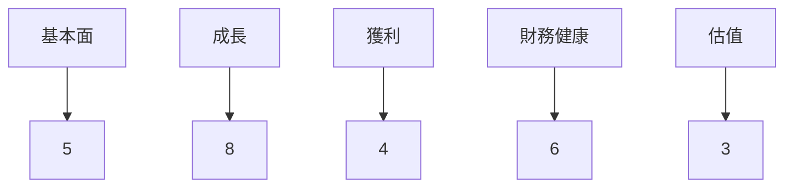
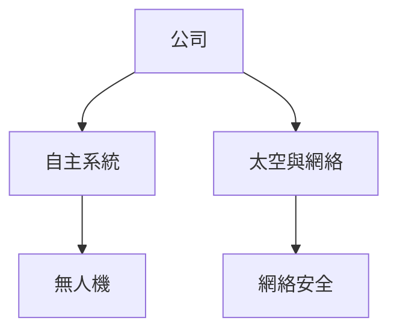
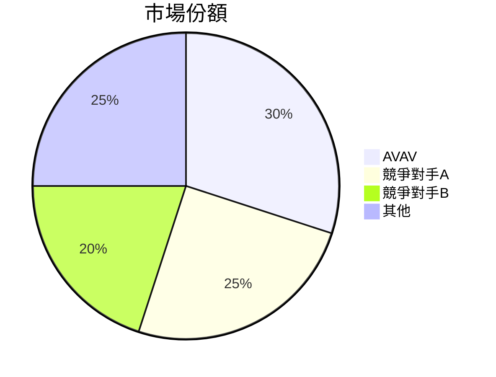
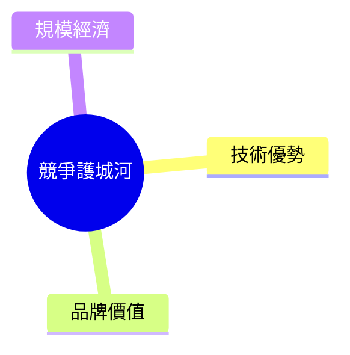
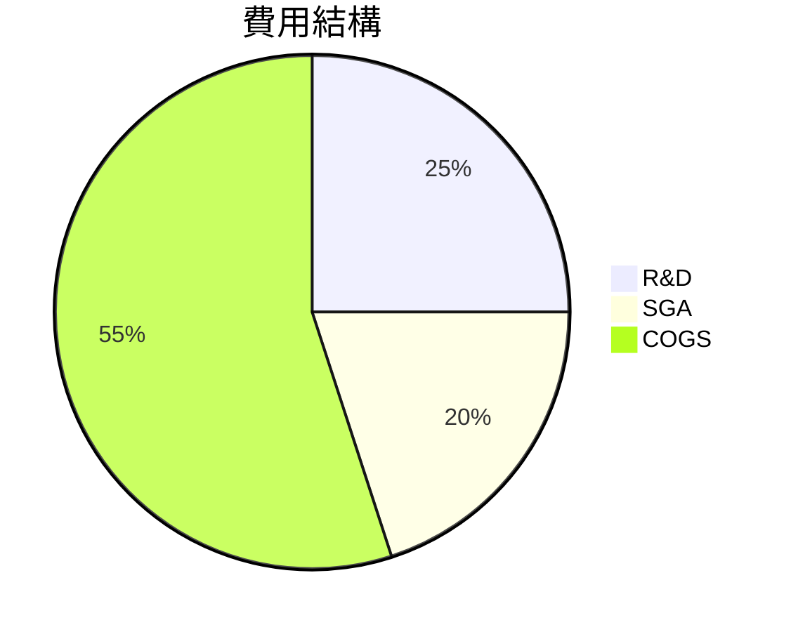
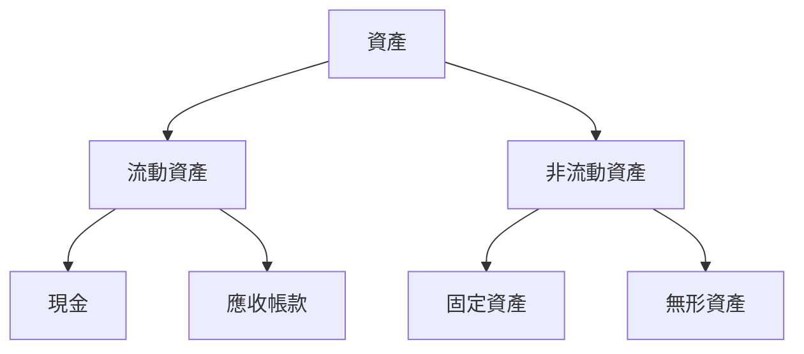
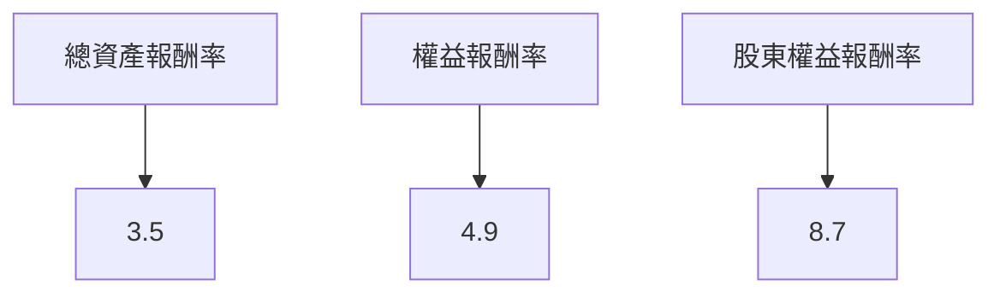
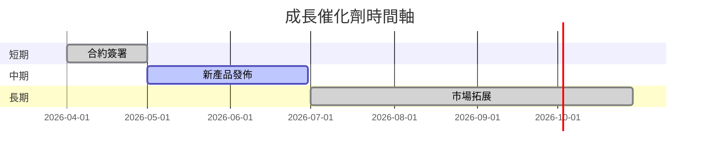
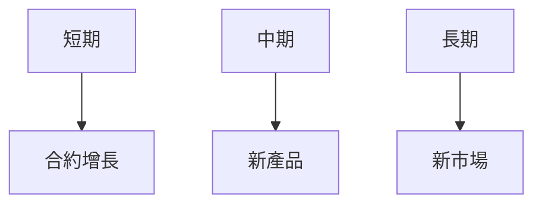
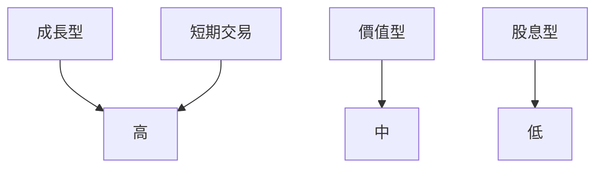

# AVAV 基本面深度分析報告
> **報告日期**：2026-03-19 ｜ **語言**：繁體中文 ｜ **數據來源**：Yahoo Finance

## 目錄
1. [執行摘要](#執行摘要)
2. [公司概覽與商業模式](#公司概覽與商業模式)
3. [損益表深度分析](#損益表深度分析)
4. [資產負債表分析](#資產負債表分析)
5. [現金流量深度分析](#現金流量深度分析)
6. [獲利能力與資本效率](#獲利能力與資本效率)
7. [估值深度分析](#估值深度分析)
8. [成長催化劑](#成長催化劑)
9. [風險矩陣](#風險矩陣)
10. [投資建議](#投資建議)

## 1. 執行摘要

### 核心評分儀表板


### 5大投資論點 + 3大風險

| 投資論點          | 評估 |
|-------------------|-----|
| 強勁的收入成長     | 🟢  |
| 技術創新領先       | 🟢  |
| 國防合約增長       | 🟢  |
| 高市場佔有率       | 🟡  |
| 穩定的政府需求     | 🟢  |

| 風險因素          | 評估 |
|-------------------|-----|
| 盈利不穩定         | 🔴  |
| 高估值壓力         | 🟡  |
| 巨大的研發成本     | 🟡  |

### 快速統計卡片

| 指標                | AVAV        | 行業均值 |
|---------------------|-------------|---------|
| 52W 高/低          | $417.86/$102.25 | -       |
| P/E (Forward)      | 52.16        | 25.00   |
| 市值               | $10.55B      | -       |
| ROE                | -8.7%        | 10.0%   |

### 投資結論

**投資建議**：觀望  
**目標價區間**：$235.00 - $311.47

## 2. 公司概覽與商業模式

### 業務結構與收入來源


### 市場地位



### 競爭護城河



### 護城河強度評分
```
技術優勢：▓▓▓▓░
品牌價值：▓▓░░░
規模經濟：▓▓▓░░
```

## 3. 損益表深度分析

### 年度收入成長趨勢

```
2022: $445.73M ░░░░░░░
2023: $540.54M ░░░░░░░░░
2024: $716.72M ░░░░░░░░░░░░
2025: $820.63M ░░░░░░░░░░░░░░
```

### 季度收入趨勢

| 季度       | 總收入    | QoQ 成長率 | YoY 成長率 |
|------------|----------|------------|------------|
| 2025-04-30 | $275.05M | N/A        | N/A        |
| 2025-07-31 | $454.68M | +65.3%     | N/A        |
| 2025-10-31 | $472.51M | +3.9%      | N/A        |
| 2026-01-31 | $408.05M | -13.6%     | N/A        |

### 利潤率演變表格

| 年度    | 毛利率 | 營業利益率 | EBITDA率 | 淨利率 |
|---------|-------|-----------|---------|-------|
| 2022    | 31.7% | -2.2%     | 10.6%   | -0.9% |
| 2023    | 32.1% | -4.2%     | -14.6%  | -32.6%|
| 2024    | 39.6% | 10.0%     | 14.4%   | 8.3%  |
| 2025    | 38.8% | 7.2%      | 10.1%   | 5.3%  |

### 費用結構分析



### EPS 趨勢與盈餘品質分析

| 季度       | EPS Est | EPS Act | Surprise% |
|------------|--------|---------|-----------|
| 2026-01-31 | N/A    | N/A     | ❌        |
| 2025-10-31 | N/A    | N/A     | ❌        |
| 2025-07-31 | N/A    | N/A     | ❌        |
| 2025-04-30 | N/A    | N/A     | ❌        |

## 4. 資產負債表分析

### 資產結構



### 流動性指標表格

| 指標          | AVAV  | 行業均值  |
|---------------|-------|----------|
| 流動比率      | 5.51  | 2.00     |
| 速動比率      | 4.396 | 1.50     |
| 現金比率      | 0.24  | 0.20     |

### 債務結構分析

- 短期債務：$64.29M
- 長期債務：$826.01M
- 淨負債：$-238.88M
- Debt-to-EBITDA：-11.39

### 股東權益趨勢

```
2022: $607.97M ░░░░░░░░
2023: $550.97M ░░░░░░░░░
2024: $822.75M ░░░░░░░░░░░
2025: $886.51M ░░░░░░░░░░░░
```

## 5. 現金流量深度分析

### 現金流量瀑布圖


### FCF 轉換率

| 年度    | FCF / Net Income |
|---------|------------------|
| 2022    | -761.8%          |
| 2023    | -1.97%           |
| 2024    | -15.41%          |
| 2025    | -55.32%          |

### 自由現金流趨勢

```
2022: $-31.91M ░░░░
2023: $-3.47M  ░░░░░░░░░
2024: $-9.19M  ░░░░░░░░
2025: $-24.13M ░░░░░
```

### 資本配置評估

- 股息支付：N/A
- 資本支出：$-22.82M
- M&A：N/A

## 6. 獲利能力與資本效率

### ROE / ROA / ROIC 趨勢表格

| 年度    | ROE  | ROA  | ROIC  |
|---------|------|------|-------|
| 2022    | -0.7%| -0.6%| N/A   |
| 2023    | -2.6%| -1.8%| N/A   |
| 2024    | 7.3% | 5.2% | N/A   |
| 2025    | 4.9% | 3.5% | N/A   |

### **ROIC vs WACC 分析**

- 估算 WACC：8%
- ROIC：未能產生正值，無法確認經濟價值創造

### DuPont 分解

**ROE=淨利率 × 資產週轉率 × 槓桿比**

- 淨利率：-13.9%
- 資產週轉率：1.43
- 槓桿比：1.3

### 獲利能力儀表板



## 7. 估值深度分析

### **同業估值比較表格**

| 公司         | P/E     | P/S    | EV/EBITDA | P/B     | PEG    | FCF Yield |
|--------------|---------|--------|-----------|---------|--------|-----------|
| AVAV         | 52.16   | 6.55   | 72.57     | 2.46    | N/A    | -2.88%    |
| 競爭者 A    | 30.00   | 5.00   | 15.00     | 3.00    | 1.20   | 5.00%     |
| 競爭者 B    | 25.00   | 6.00   | 12.00     | 2.80    | 1.50   | 6.00%     |

### 歷史估值區間分析

- P/E 5年區間：高 60 / 中 30 / 低 15
- 目前所處位置：偏高

### **DCF 敏感性分析**

| 成長假設\折現率 | 8%       | 10%      |
|-----------------|----------|----------|
| 樂觀情境        | $350.00  | $320.00  |
| 基準情境        | $310.00  | $280.00  |
| 悲觀情境        | $270.00  | $240.00  |

### 估值區間視覺化

```
低估區：$200 ░░░░░░░░░░░
合理區：$250 ░░░░░░░░░░░░░░░░░
高估區：$300 ░░░░░░░░░░░░░░░░░░░░░░
```

## 8. 成長催化劑

### 催化劑時間軸



### TAM 市場規模與滲透率

```
TAM 市場規模：$10B ░░░░░░░░░░░░░░░░░░░░
目前滲透率：20% ░░░░░░░░░░░░░░░░░░░░
```

### 短/中/長期成長驅動力



## 9. 風險矩陣

### 風險評分矩陣

```mermaid
quadrantChart
    title 風險評分矩陣
    "低機率/低衝擊"
    "高機率/低衝擊"
    "低機率/高衝擊"
    "高機率/高衝擊"
    "盈利不穩定": [0.7, 0.9]
    "高估值壓力": [0.6, 0.7]
    "研發成本": [0.5, 0.6]
```

### 風險清單表格

| 風險項目     | 機率 | 衝擊 | 評分 | 緩解措施         |
|--------------|------|------|------|------------------|
| 盈利不穩定   | 高   | 高   | 🔴   | 提高成本控制     |
| 高估值壓力   | 中   | 中   | 🟡   | 強化基本面       |
| 巨大研發成本 | 中   | 中   | 🟡   | 降低技術負擔     |

## 10. 投資建議

### 最終綜合評級

```
基本面：6 ▓▓▓░░░░░░
成長：8 ▓▓▓▓▓▓░░
獲利：4 ▓▓░░░░░░░░
財務健康：6 ▓▓▓░░░░░░
估值：3 ░░░░
```

### 目標價及隱含報酬率

| 情境    | 目標價   | 隱含報酬率 |
|---------|----------|------------|
| 樂觀    | $350.00  | +65%       |
| 基準    | $280.00  | +32%       |
| 悲觀    | $240.00  | +13%       |

### 買入時機與觸發因素

- 政府合約增加
- 新產品成功推出

### 投資人適配度



### 關鍵監控指標

- 下次財報
- 國防預算數據
- 競爭對手動態

> **免責聲明**：本報告為 AI 自動生成，僅供研究參考，不構成投資建議。