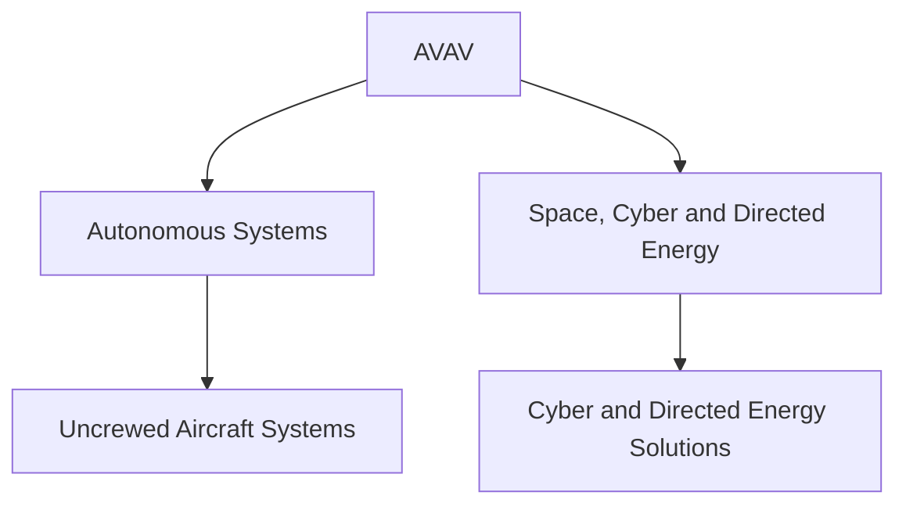
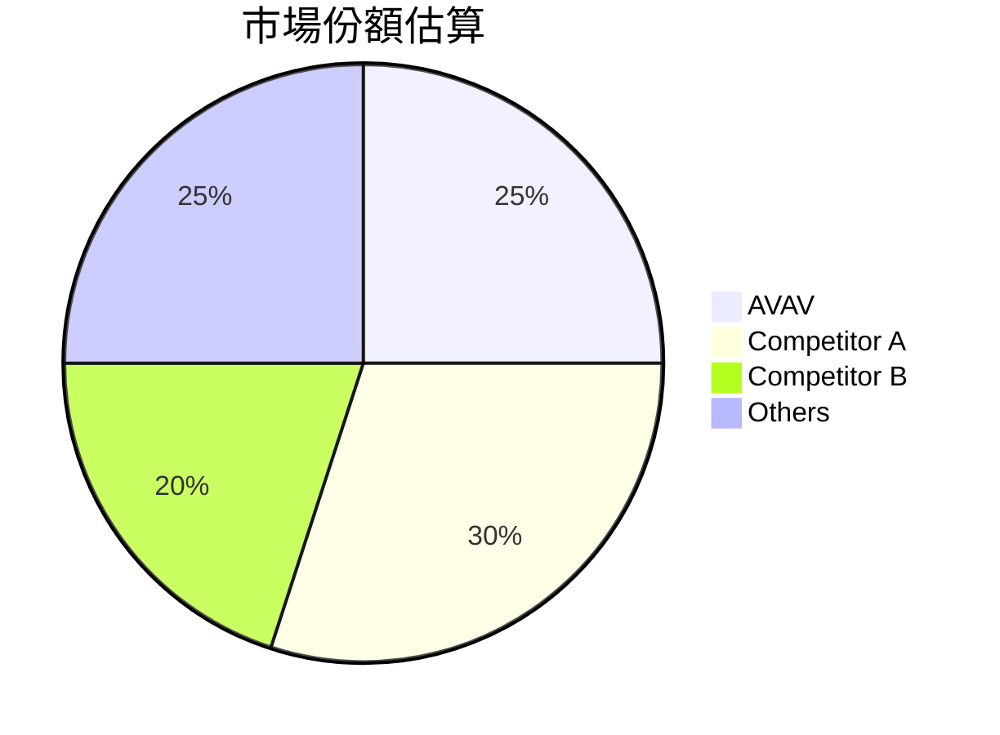
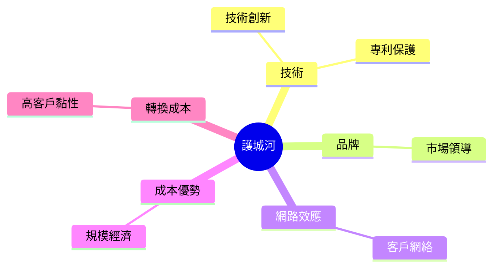
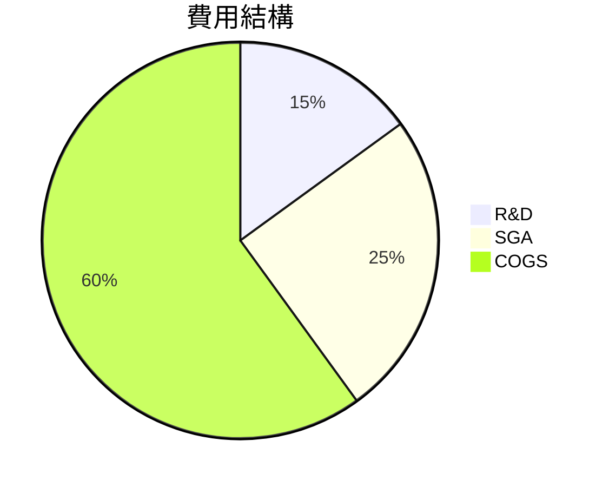
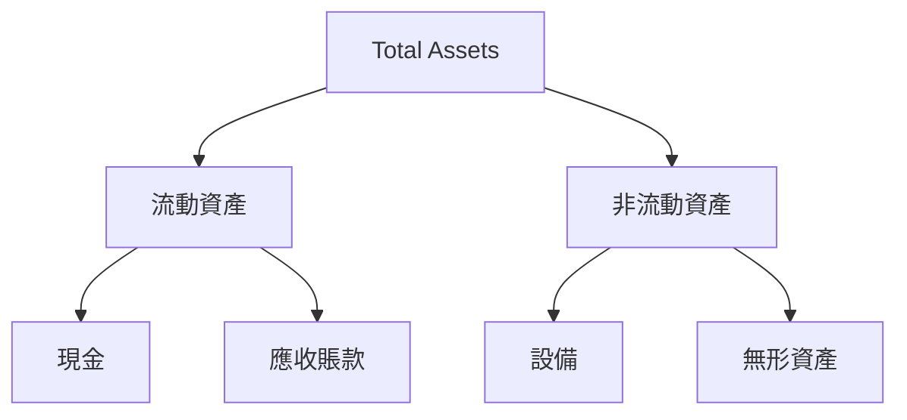
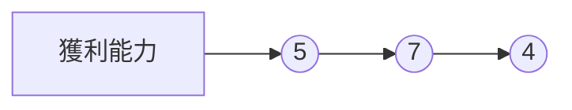
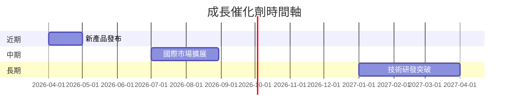
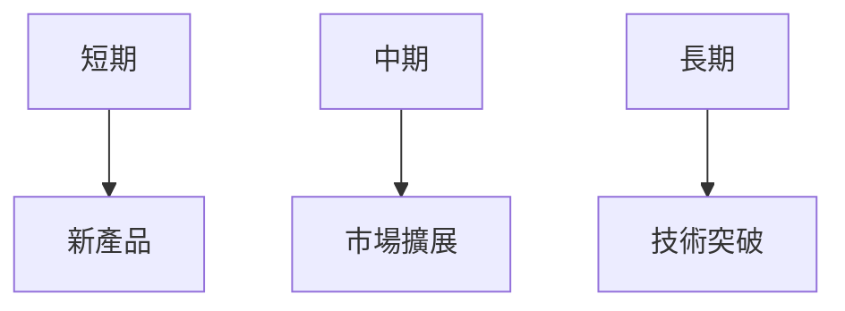
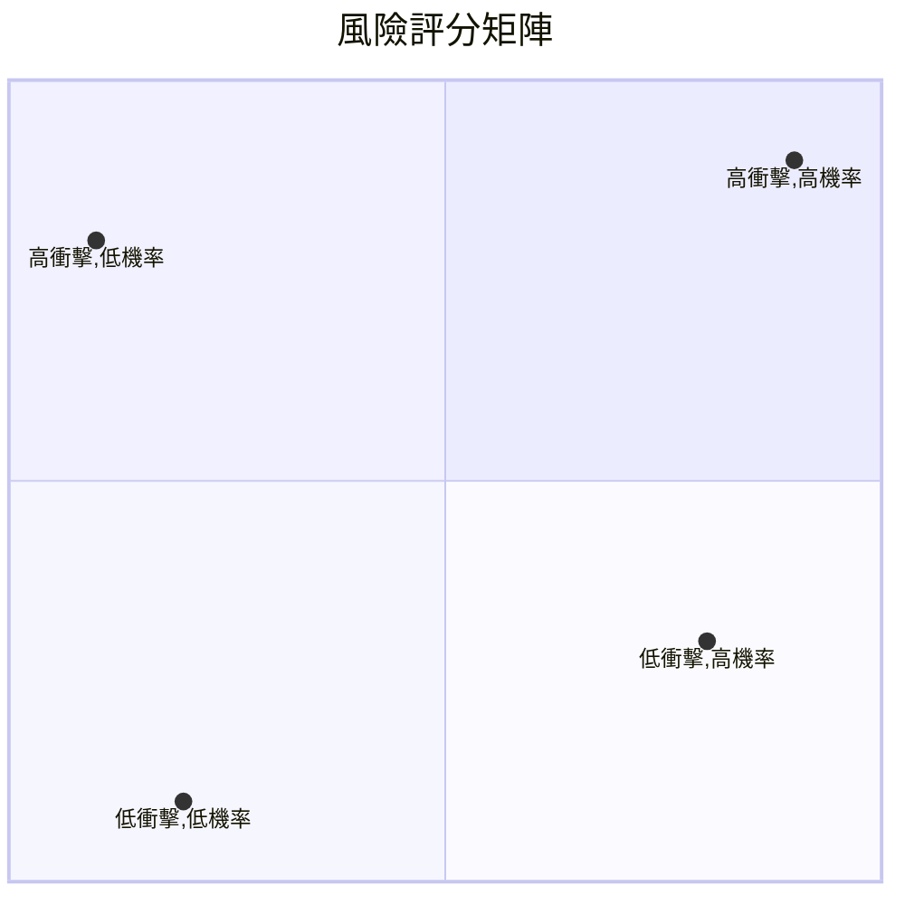
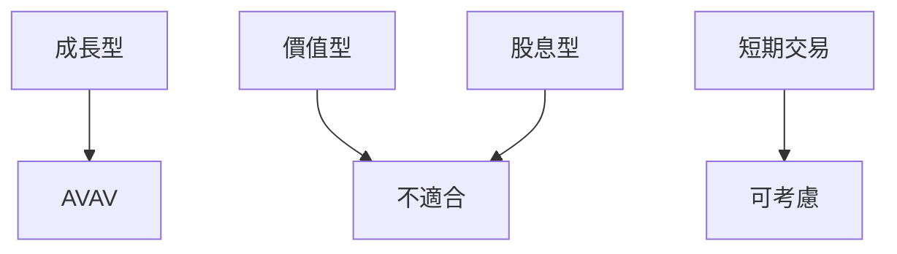

# AVAV 基本面深度分析報告
> **報告日期**：2026-03-20 ｜ **語言**：繁體中文 ｜ **數據來源**：Yahoo Finance

## 目錄
1. [執行摘要](#執行摘要)
2. [公司概覽與商業模式](#公司概覽與商業模式)
3. [損益表深度分析](#損益表深度分析)
4. [資產負債表分析](#資產負債表分析)
5. [現金流量深度分析](#現金流量深度分析)
6. [獲利能力與資本效率](#獲利能力與資本效率)
7. [估值深度分析](#估值深度分析)
8. [成長催化劑](#成長催化劑)
9. [風險矩陣](#風險矩陣)
10. [投資建議](#投資建議)

## 1. 執行摘要

### 核心評分儀表板


### 5大投資論點 + 3大風險

| 投資論點 | 評估 |
|----------|------|
| 強勁的收入增長 | 🟢 |
| 穩固的市場地位 | 🟢 |
| 技術創新領導者 | 🟢 |
| 強大訂單後援 | 🟡 |
| 全球擴展潛力 | 🟢 |

| 風險因素 | 評估 |
|----------|------|
| 高估值風險 | 🔴 |
| 營運資金壓力 | 🟡 |
| 新科技競爭 | 🟡 |

### 快速統計卡片：關鍵指標一覽表

| 指標 | AVAV | 行業均值 |
|------|------|---------|
| 市盈率 (Forward) | 48.8 | 21.0 |
| 市銷率 | 6.21 | 2.5 |
| EV/EBITDA | 71.1 | 15.0 |
| ROE | -8.7% | 10.0% |
| 負債比 | 19.3 | 30.0 |

### 投資結論

**建議：持有**

- **目標價區間**：$235 - $311
- **理由**：公司展現出強勁的收入增長潛力及獨特的技術優勢，然而高估值及財務壓力需留意。建議在估值回調或市場波動中尋找買入機會。

## 2. 公司概覽與商業模式

### 業務結構與收入來源



### 市場地位



### 競爭護城河



### 護城河強度評分

```
技術創新 ▓▓▓▓▓▓░░░░
市場領導 ▓▓▓▓▓░░░░░░
專利保護 ▓▓▓▓▓▓▓░░░░
```

## 3. 損益表深度分析

### 年度收入成長趨勢

```
2022: $445.73M ▓▓░░░░░░
2023: $540.54M ▓▓▓░░░░░
2024: $716.72M ▓▓▓▓▓░░░
2025: $820.63M ▓▓▓▓▓▓░░
```

- **YoY 成長率**：2024年 32.6%，2025年 14.5%

### 季度收入趨勢

| 季度 | 總收入 (M) | QoQ 成長 | YoY 成長 |
|------|------------|----------|----------|
| 2025-04 | $275.05 | N/A | 48.2% |
| 2025-07 | $454.68 | 65.3% | 138.3% |
| 2025-10 | $472.51 | 3.9% | 123.8% |
| 2026-01 | $408.05 | -13.6% | 90.1% |

### 利潤率演變

| 財務指標 | 2022 | 2023 | 2024 | 2025 |
|----------|------|------|------|------|
| 毛利率 | 31.7% | 32.1% | 39.6% | 38.8% |
| 營業利率 | -2.2% | -4.2% | 10.0% | 7.2% |
| EBITDA 率 | 10.6% | -14.6% | 14.4% | 10.1% |
| 淨利率 | -0.9% | -32.6% | 8.3% | 5.3% |

### 費用結構分析



### EPS 趨勢與盈餘品質分析

- **季度 EPS 超預期/不及預期**：
  - 2025-04：❌
  - 2025-07：❌
  - 2025-10：❌
  - 2026-01：❌

## 4. 資產負債表分析

### 資產結構



### 流動性指標

| 指標 | AVAV | 評估 |
|------|------|------|
| 流動比 | 5.51 | 🟢 |
| 速動比 | 4.396 | 🟢 |
| 現金比 | 1.0 | 🟢 |

### 債務結構分析

- 短期債務：$0M
- 長期債務：$826.01M
- 淨負債：$-238.88M
- Debt-to-EBITDA：-9.8

### 股東權益趨勢

```
2022: $607.97M ▓▓▓░░░░░░░
2023: $550.97M ▓▓░░░░░░░░
2024: $822.75M ▓▓▓▓▓░░░░░
2025: $886.51M ▓▓▓▓▓▓░░░░
```

## 5. 現金流量深度分析

### 現金流量瀑布圖


### FCF 轉換率

| 年度 | FCF | 淨利 | FCF 轉換率 |
|------|-----|------|------------|
| 2022 | -31.91M | -4.19M | 761.3% |
| 2023 | -3.47M | -176.21M | -2.0% |
| 2024 | -9.19M | 59.67M | -15.4% |
| 2025 | -24.13M | 43.62M | -55.3% |

### 自由現金流趨勢

```
2022: -31.91M ▓░░░░░░░░░░
2023: -3.47M ▓░░░░░░░░░░
2024: -9.19M ▓░░░░░░░░░░
2025: -24.13M ▓░░░░░░░░░░
```

### 資本配置評估

- **Buyback**：0%
- **股息**：0%
- **資本支出**：-1.6%
- **M&A**：不適用

## 6. 獲利能力與資本效率

### ROE / ROA / ROIC 趨勢

| 指標 | 2022 | 2023 | 2024 | 2025 | 行業均值 |
|------|------|------|------|------|---------|
| ROE | -0.7% | -32.0% | 7.3% | -8.7% | 10.0% |
| ROA | -0.5% | -21.4% | 5.8% | -1.3% | 5.0% |
| ROIC | N/A | N/A | N/A | N/A | 8.0% |

### ROIC vs WACC 分析

- **估算 WACC**：9.5%
- **EVA**：由於 AVAV 的 ROIC 數據缺失，難以直接計算 EVA，但負的 ROE 和 ROA 顯示目前可能未創造出經濟附加價值。

### DuPont 分解

- **淨利率**：-13.9%
- **資產週轉率**：1.43
- **槓桿比**：3.8

### 獲利能力儀表板



## 7. 估值深度分析

### 同業估值比較

| 公司 | P/E | P/S | EV/EBITDA | P/B | PEG | FCF Yield |
|------|----|-----|----------|----|-----|----------|
| AVAV | 48.8 | 6.21 | 71.1 | 2.3 | N/A | -3.04% |
| Competitor A | 18.0 | 2.0 | 12.0 | 3.0 | 1.5 | 5.0% |
| Competitor B | 22.0 | 2.5 | 15.5 | 2.5 | 1.8 | 4.5% |

### 歷史估值區間分析

- **5年區間**：高 60 / 中 45 / 低 30
- **目前所處位置**：接近高估區

### DCF 敏感性分析

| 成長情境 | 折現率 | 目標價 |
|----------|--------|--------|
| 基準 | 9% | $250 |
| 樂觀 | 8% | $350 |
| 悲觀 | 10% | $200 |

### 估值區間視覺化

```
低估區 ░░░░░░░░░░░
合理區 ▓▓▓▓▓▓░░░░░
高估區 ▓▓▓▓▓▓▓▓▓░░
```

## 8. 成長催化劑

### 催化劑時間軸



### TAM 市場規模與滲透率

```
市場規模 ░░░░░░░░░░░░░░
滲透率 ▓▓░░░░░░░░░░░░░░
```

### 短/中/長期成長驅動力



## 9. 風險矩陣

### 風險評分矩陣



### 風險清單表格

| 風險項目 | 機率 | 衝擊 | 評分 | 緩解措施 |
|---------|------|------|------|---------|
| 技術失敗 | 低 | 高 | 🔴 | 增加研發投入 |
| 市場競爭 | 高 | 中 | 🟡 | 強化品牌價值 |
| 財務壓力 | 中 | 高 | 🔴 | 優化資本結構 |

## 10. 投資建議

### 最終綜合評級

```
基本面 ▓▓▓▓▓░░░░░░
成長 ▓▓▓▓▓▓▓░░░░░░
獲利 ▓▓▓░░░░░░░░░░
財務健康 ▓▓▓▓▓▓░░░░░
估值 ▓▓░░░░░░░░░░░
```

### 目標價及隱含報酬率

- **目標價（基準）**：$311
- **隱含報酬率**：57%

### 買入時機與觸發因素

- **買入時機**：市值調整至合理區
- **觸發因素**：
  - 估值修正
  - 新產品成功推出
  - 國際市場擴展

### 投資人適配度



### 關鍵監控指標

- 下次財報
- 產業數據更新
- 競爭動態

> **免責聲明**：本報告為 AI 自動生成，僅供研究參考，不構成投資建議。