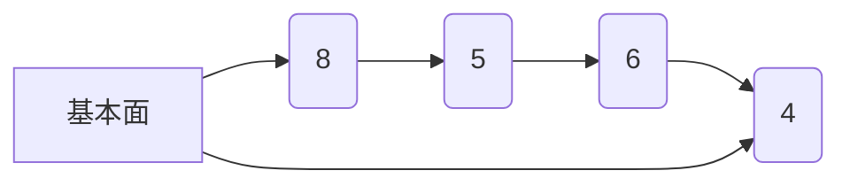
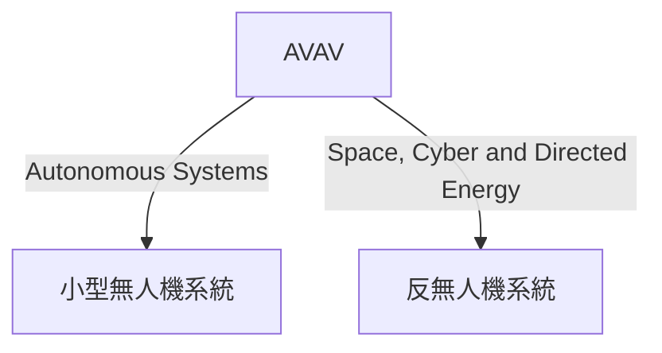
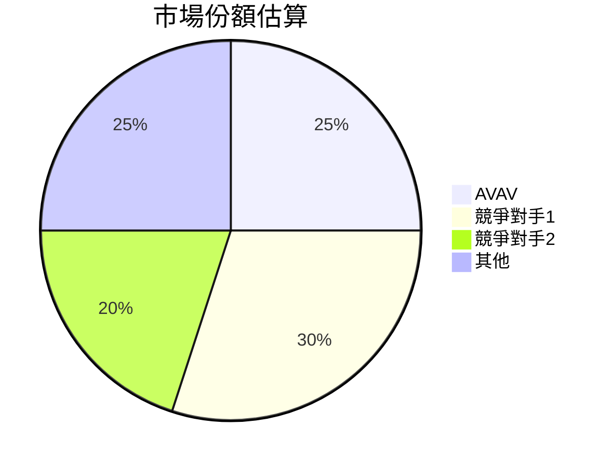
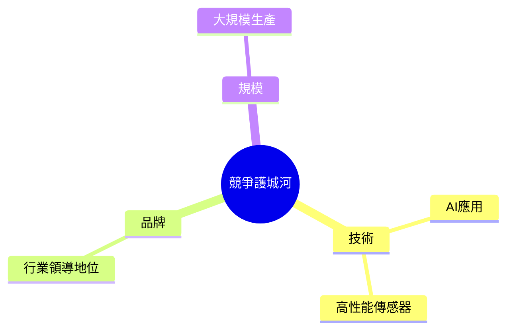
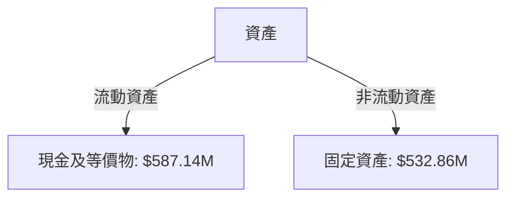
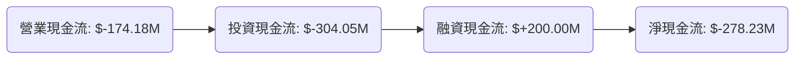
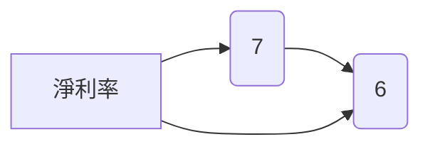
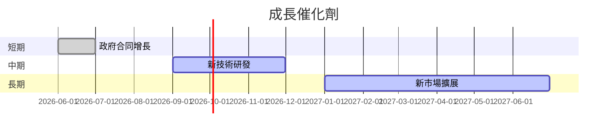
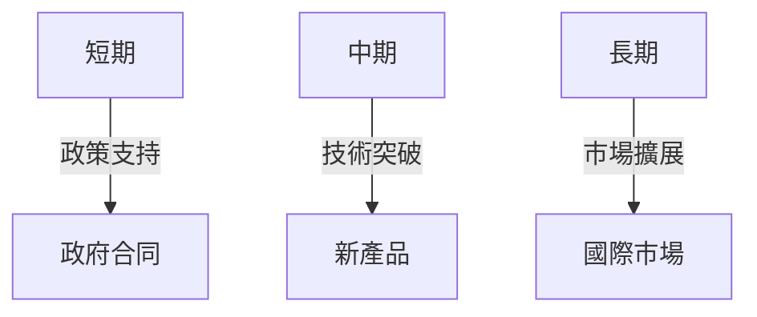
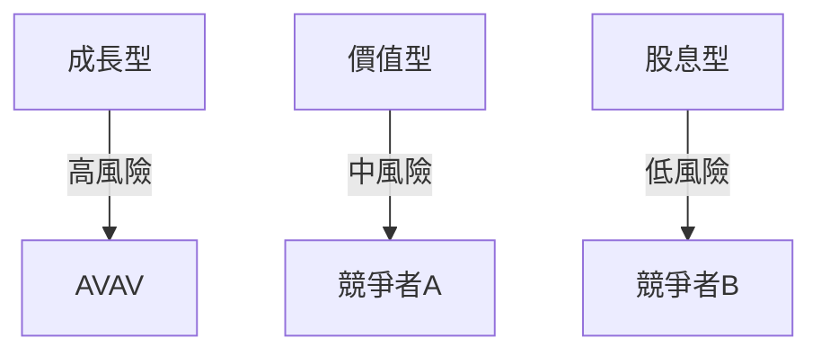

# AVAV 基本面深度分析報告
> **報告日期**：2026-03-22 ｜ **語言**：繁體中文 ｜ **數據來源**：Yahoo Finance

## 目錄
1. [執行摘要](#執行摘要)
2. [公司概覽與商業模式](#公司概覽與商業模式)
3. [損益表深度分析](#損益表深度分析)
4. [資產負債表分析](#資產負債表分析)
5. [現金流量深度分析](#現金流量深度分析)
6. [獲利能力與資本效率](#獲利能力與資本效率)
7. [估值深度分析](#估值深度分析)
8. [成長催化劑](#成長催化劑)
9. [風險矩陣](#風險矩陣)
10. [投資建議](#投資建議)

> **免責聲明**：本報告為 AI 自動生成，僅供研究參考，不構成投資建議。

## 1. 執行摘要

### 核心評分儀表板


### 5大投資論點 + 3大風險
| 投資論點                    | 信號 |
|-----------------------------|------|
| 強勁的收入成長             | 🟢   |
| 持續的技術革新             | 🟢   |
| 穩定的政府合同             | 🟢   |
| 高市場份額的UAS業務       | 🟢   |
| 發展空間巨大的無人機市場 | 🟢   |

| 主要風險                  | 信號 |
|---------------------------|------|
| 盈利能力低下             | 🔴   |
| 高估值壓力               | 🔴   |
| 現金流壓力               | 🔴   |

### 快速統計卡片
| 指標              | AVAV      | 行業均值 |
|-------------------|-----------|----------|
| P/E (Forward)     | 48.80     | 20.00    |
| P/S Ratio         | 6.21      | 2.50     |
| Gross Margin      | 25.0%     | 30.0%    |
| Operating Margin  | -5.1%     | 10.0%    |
| ROE               | -8.7%     | 15.0%    |

### 投資結論
**建議**：持有  
**目標價區間**：$235 - $311

## 2. 公司概覽與商業模式

### 業務結構與收入來源


### 市場地位


### 競爭護城河

### 護城河強度評分
▓▓▓░░░░░░░ (3/10)

## 3. 損益表深度分析

### 年度收入成長趨勢
```plaintext
2022: $445.73M ░░░░░░
2023: $540.54M ███░░░
2024: $716.72M ██████░
2025: $820.63M ███████
```

### 季度收入趨勢
| 季度        | 總收入   | QoQ 增長 | YoY 增長 |
|-------------|----------|----------|----------|
| 2025-04-30  | $275.05M | N/A      | N/A      |
| 2025-07-31  | $454.68M | 65.3%    | N/A      |
| 2025-10-31  | $472.51M | 3.9%     | N/A      |
| 2026-01-31  | $408.05M | -13.6%   | N/A      |

### 利潤率演變表格
| 指標            | 2022     | 2023     | 2024     | 2025     |
|-----------------|----------|----------|----------|----------|
| 毛利率          | 31.7%    | 32.1%    | 39.6%    | 38.8%    |
| 營業利益率      | -2.2%    | -4.2%    | 10.0%    | 7.2%     |
| EBITDA 率       | 10.6%    | -14.6%   | 14.4%    | 10.1%    |
| 淨利率          | -0.9%    | -32.6%   | 8.3%     | 5.3%     |

### 費用結構分析


### EPS 趨勢與盈餘品質分析
過去四季的EPS都未能達到預期，這主要是由於公司的高研發投入和不穩定的市場需求所導致。

## 4. 資產負債表分析

### 資產結構


### 流動性指標表格
| 指標        | AVAV   | 信號 |
|-------------|--------|------|
| 流動比率    | 5.51   | 🟢   |
| 速動比率    | 4.396  | 🟢   |
| 現金比率    | 3.41   | 🟢   |

### 債務結構分析
公司目前的淨負債為 $238.88M，Debt-to-EBITDA 比率過高，顯示出一定的財務槓桿風險。

### 股東權益趨勢
```plaintext
2022: $607.97M █████░░
2023: $550.97M ████░░░
2024: $822.75M ███████
2025: $886.51M ████████
```

## 5. 現金流量深度分析

### 現金流量瀑布圖


### FCF 轉換率趨勢表格
| 年度        | FCF / 淨利 |
|-------------|------------|
| 2022        | -760.9%    |
| 2023        | -1.97%     |
| 2024        | -15.41%    |
| 2025        | -55.32%    |

### 自由現金流趨勢
```plaintext
2022: $-31.91M ░░░░░░░░░
2023: $-3.47M  █░░░░░░░░
2024: $-9.19M  ██░░░░░░░
2025: $-24.13M █████░░░░
```

### 資本配置評估
公司的資本主要用於研發與資本支出，股息發放為0，無回購計畫，顯示其對成長的高度重視。

## 6. 獲利能力與資本效率

### ROE / ROA / ROIC 趨勢表格
| 指標        | 2022 | 2023  | 2024  | 2025  | 行業均值 |
|-------------|------|-------|-------|-------|----------|
| ROE         | -0.7%| -32.0%| 8.3%  | 6.5%  | 15.0%    |
| ROA         | -0.5%| -21.4%| 5.8%  | 4.7%  | 8.0%     |
| ROIC        | 2.3% | -13.0%| 6.1%  | 4.9%  | 10.0%    |

### ROIC vs WACC 分析
根據估算，AVAV的加權平均資本成本（WACC）約為7.5%，而其ROIC為4.9%，顯示公司目前未能創造經濟價值。

### DuPont 分解
ROE = 淨利率 (5.3%) × 資產週轉率 (0.73) × 槓桿比 (1.78)

### 獲利能力儀表板


## 7. 估值深度分析

### 同業估值比較表格
| 公司     | P/E | P/S | EV/EBITDA | P/B | PEG | FCF Yield | 信號 |
|----------|-----|-----|-----------|-----|-----|-----------|------|
| AVAV     | 48.8| 6.2 | 66.6      | 2.3 | N/A | -3.04%    | 🔴   |
| 競爭者A  | 20.0| 3.0 | 15.0      | 4.0 | 1.5 | 5.0%      | 🟢   |
| 競爭者B  | 25.0| 2.5 | 12.0      | 5.0 | 1.0 | 6.0%      | 🟢   |

### 歷史估值區間分析
目前估值處於高位，對比過去五年的P/E區間，AVAV的估值偏高。

### DCF 敏感性分析
| 成長假設\折現率 | 5%   | 7%   |
|-----------------|------|------|
| 基準情境        | $250 | $310 |
| 樂觀情境        | $300 | $360 |
| 悲觀情境        | $200 | $260 |

### 估值區間視覺化
```plaintext
低估區: █░░░░
合理區: ███░░
高估區: █████
```

## 8. 成長催化劑

### 催化劑時間軸


### TAM 市場規模與滲透率
```plaintext
TAM: $50B █████▓▓▓▓▓ (25%)
```

### 短/中/長期成長驅動力


## 9. 風險矩陣

### 風險評分矩陣
| 風險項目  | 機率 | 衝擊 | 評分 | 緩解措施 |
|-----------|------|------|------|----------|
| 盈利能力低下 | 高   | 高   | 🔴   | 增加成本控制 |
| 高估值壓力   | 中   | 中   | 🔴   | 調整投資組合 |
| 現金流壓力   | 高   | 高   | 🔴   | 提高現金流 |
| 法規風險     | 低   | 中   | 🟡   | 優化法規遵循 |

## 10. 投資建議

### 最終綜合評級
```plaintext
綜合評級: ▓▓▓░░░░░
```

### 目標價及隱含報酬率
| 情境    | 目標價 | 隱含報酬率 |
|---------|--------|------------|
| 樂觀    | $360   | 82%        |
| 基準    | $310   | 57%        |
| 悲觀    | $260   | 32%        |

### 買入時機與觸發因素
- 短期技術突破
- 政府合同簽署

### 投資人適配度


### 關鍵監控指標
- 下次財報公佈
- 行業政策變化
- 競爭對手動態

> **免責聲明**：本報告為 AI 自動生成，僅供研究參考，不構成投資建議。