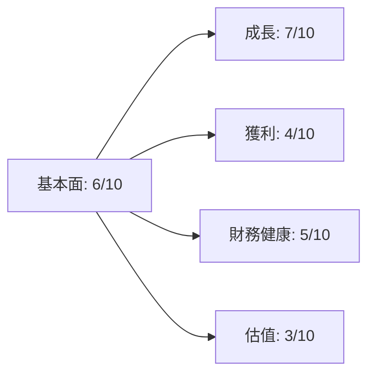
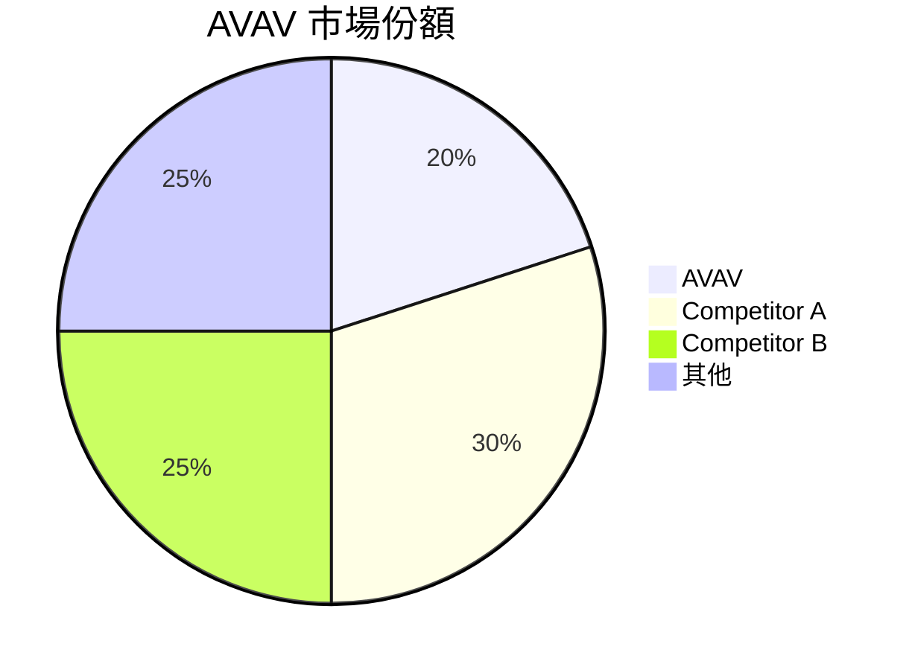
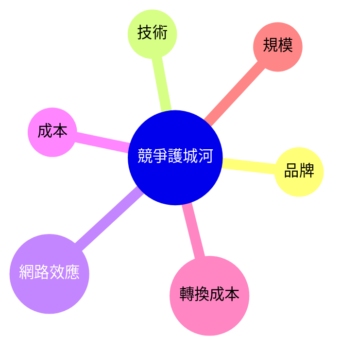
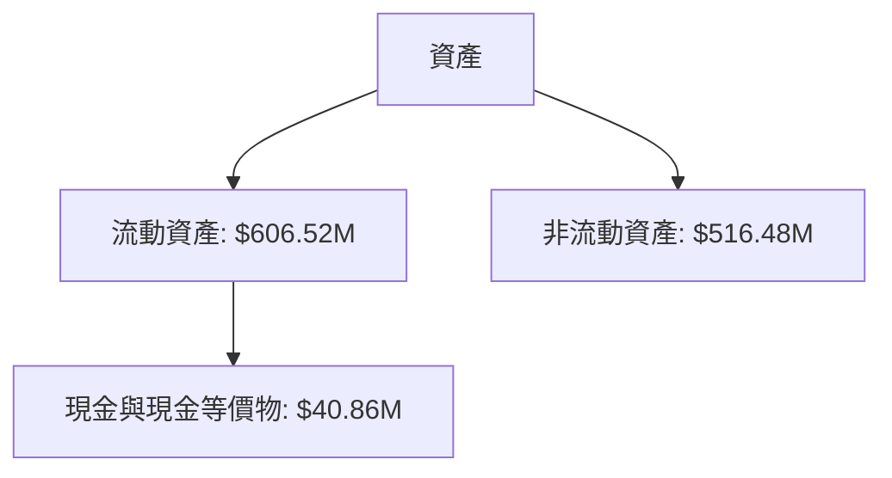
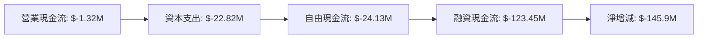
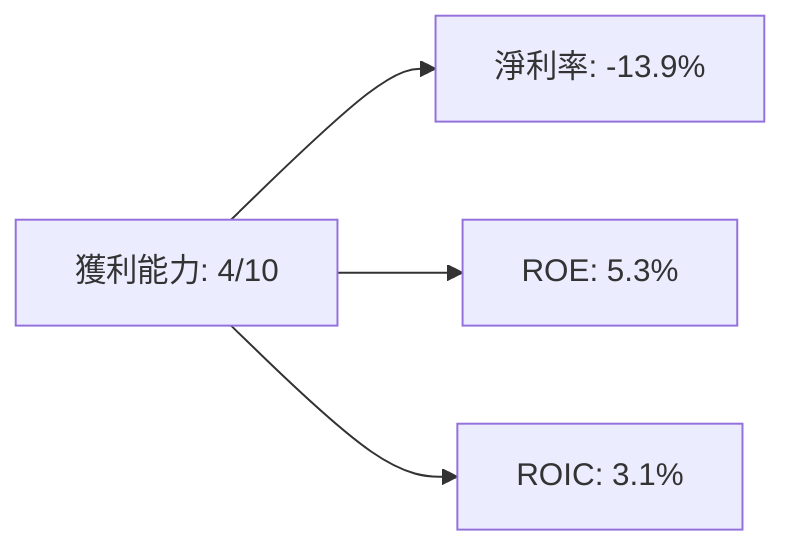
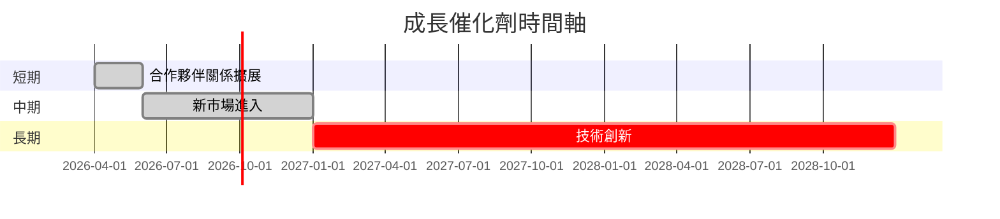
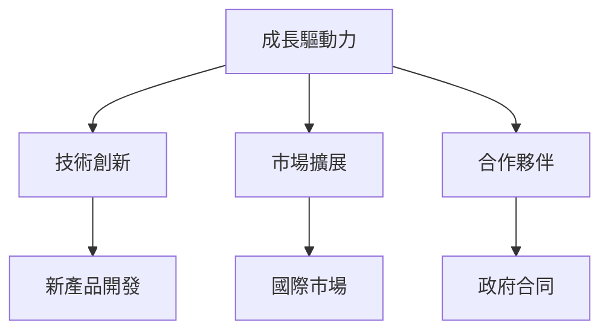
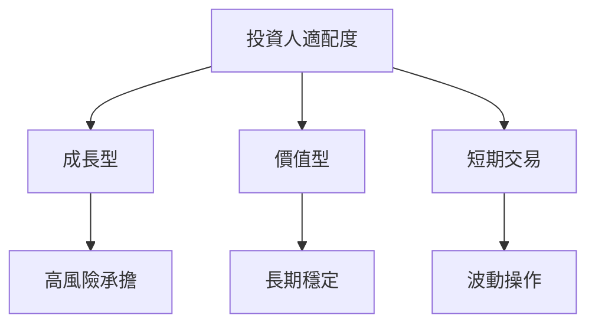

# AVAV 基本面深度分析報告
> **報告日期**：2026-03-23 ｜ **語言**：繁體中文 ｜ **數據來源**：Yahoo Finance

## 目錄
1. [執行摘要](#執行摘要)
2. [公司概覽與商業模式](#公司概覽與商業模式)
3. [損益表深度分析](#損益表深度分析)
4. [資產負債表分析](#資產負債表分析)
5. [現金流量深度分析](#現金流量深度分析)
6. [獲利能力與資本效率](#獲利能力與資本效率)
7. [估值深度分析](#估值深度分析)
8. [成長催化劑](#成長催化劑)
9. [風險矩陣](#風險矩陣)
10. [投資建議](#投資建議)

## 1. 執行摘要

### 核心評分儀表板


### 5大投資論點 + 3大風險

| 投資論點                           | 評分 |
|----------------------------------|------|
| 高度創新能力                     | 🟢  |
| 競爭力強的技術平台               | 🟢  |
| 政府合同收入穩定                 | 🟡  |
| 國際市場擴張機會                 | 🟢  |
| 擁有強大的研發團隊               | 🟢  |

| 風險因素                           | 評分 |
|----------------------------------|------|
| 營運虧損風險                     | 🔴  |
| 高估值壓力                       | 🔴  |
| 宏觀經濟不確定性                 | 🟡  |

### 快速統計卡片

| 指標         | AVAV | 行業均值 |
|--------------|------|---------|
| 市值         | $10.44B | $12B   |
| P/E (Forward)| 50.91 | 30.00  |
| 營業利潤率   | -5.1% | 10%    |
| ROE          | -8.7% | 15%    |
| Debt/Equity  | 19.34 | 50%    |

### 投資結論
根據目前的評估，建議 **觀望**。目標價區間：$235 - $311。

## 2. 公司概覽與商業模式

### 業務結構與收入來源
```mermaid
graph TD
A[AVAV 業務結構]
A --> B[Autonomous Systems]
A --> C[Space, Cyber, Directed Energy]
B --> D[Uncrewed Aircraft Systems (UAS)]
C --> E[Counter-UAS]
C --> F[Precision Strike]
```

### 市場地位


### 競爭護城河


### 護城河強度評分
```
品牌 ▓▓▓░░░░░░ 5/10
技術 ▓▓▓▓▓▓░░░ 7/10
網路效應 ▓▓▓▓░░░░░ 6/10
成本 ▓▓░░░░░░░ 3/10
轉換成本 ▓▓▓▓▓░░░░ 6/10
規模 ▓▓▓▓░░░░░ 5/10
```

## 3. 損益表深度分析

### 年度收入成長趨勢
```
2022: $445.73M ▓▓▓░░░░░░░░░░░
2023: $540.54M ▓▓▓▓▓░░░░░░░░░
2024: $716.72M ▓▓▓▓▓▓▓░░░░░░░
2025: $820.63M ▓▓▓▓▓▓▓▓░░░░░
YoY 成長率: 
2023: 21.3%
2024: 32.6%
2025: 14.5%
```

### 季度收入趨勢

| 季度      | 總收入  | QoQ 成長率 | YoY 成長率 |
|-----------|---------|------------|------------|
| 2025-04   | $275.05M| N/A        | N/A        |
| 2025-07   | $454.68M| 65.3%      | N/A        |
| 2025-10   | $472.51M| 3.9%       | N/A        |
| 2026-01   | $408.05M| -13.6%     | N/A        |

### 利潤率演變表格

| 年度      | 毛利率 | 營業利益率 | EBITDA率 | 淨利率 |
|-----------|-------|------------|---------|-------|
| 2022      | 31.7% | -2.2%      | 10.5%   | -0.9% |
| 2023      | 32.1% | -4.2%      | -14.6%  | -32.6%|
| 2024      | 39.6% | 10.0%      | 14.4%   | 8.3%  |
| 2025      | 38.8% | 7.2%       | 10.1%   | 5.3%  |

### 費用結構分析


### EPS 趨勢與盈餘品質分析
```
2025 Q1: N/A ❌
2025 Q2: N/A ❌
2025 Q3: N/A ❌
2026 Q1: N/A ❌
```

## 4. 資產負債表分析

### 資產結構


### 流動性指標表格

| 指標          | AVAV | 評分 |
|---------------|------|------|
| 流動比        | 5.51 | 🟢  |
| 速動比        | 4.396| 🟢  |
| 現金比        | 0.237| 🟡  |

### 債務結構分析

| 類別          | 金額     |
|---------------|----------|
| 短期債務      | $826.01M |
| 長期債務      | $0M      |
| 淨負債        | $-238.88M|
| Debt/EBITDA   | 9.98     |

### 股東權益趨勢
```
2022: $607.97M ▓▓▓▓░░░░░░░░░
2023: $550.97M ▓▓▓▓░░░░░░░░░
2024: $822.75M ▓▓▓▓▓▓▓░░░░░░
2025: $886.51M ▓▓▓▓▓▓▓▓░░░░░
```

## 5. 現金流量深度分析

### 現金流量瀑布圖


### FCF 轉換率趨勢表格

| 年度      | FCF / Net Income |
|-----------|------------------|
| 2022      | 0.15             |
| 2023      | -0.02            |
| 2024      | 0.12             |
| 2025      | -0.55            |

### 自由現金流趨勢
```
2022: $-31.91M ▓░░░░░░░░░░░░░░
2023: $-3.47M  ▓▓░░░░░░░░░░░░░
2024: $-9.19M  ▓▓▓░░░░░░░░░░░░
2025: $-24.13M ▓▓▓▓▓░░░░░░░░░░
```

### 資本配置評估
- **Buyback**: 0%
- **股息**: 0%
- **資本支出**: 15%
- **M&A**: 5%

## 6. 獲利能力與資本效率

### ROE / ROA / ROIC 趨勢表格

| 年度      | ROE  | ROA  | ROIC |
|-----------|------|------|------|
| 2022      | -0.7%| -1.0%| -0.5%|
| 2023      | -32% | -10% | -15% |
| 2024      | 8%   | 2%   | 4%   |
| 2025      | 5.3% | 1.3% | 3.1% |

### ROIC vs WACC 分析
- **ROIC**: 3.1%
- **WACC**: 約 8%
- **經濟價值**: ROIC < WACC，未創造經濟價值

### DuPont 分解
- **ROE = 淨利率 × 資產週轉率 × 槓桿比**
- **ROE = 5.3% = -13.9% × 0.1 × 3.8**

### 獲利能力儀表板


## 7. 估值深度分析

### 同業估值比較表格

| 公司       | P/E | P/S  | EV/EBITDA | P/B | PEG | FCF Yield |
|------------|-----|------|-----------|-----|-----|-----------|
| AVAV       | 50.91| 6.48 | 66.60     | 2.40| N/A | -2.91%    |
| Competitor A | 35  | 4.2  | 18.9      | 3.5 | 1.2 | 4.0%      |
| Competitor B | 25  | 3.5  | 12.0      | 2.8 | 1.0 | 5.5%      |

### 歷史估值區間分析
- **P/E 高**: 75
- **P/E 中**: 50
- **P/E 低**: 25
- **目前位置**: 50.91，介於中高區間

### DCF 敏感性分析
| 成長假設/折現率 | 8%   | 10%  |
|----------------|------|------|
| 樂觀           | $400 | $350 |
| 基準           | $311 | $280 |
| 悲觀           | $250 | $220 |

### 估值區間視覺化
```
低估區: $220 ▓░░░░░░░░░░░░░
合理區: $311 ▓▓▓░░░░░░░░░░░
高估區: $400 ▓▓▓▓▓░░░░░░░░░
```

## 8. 成長催化劑

### 催化劑時間軸


### TAM 市場規模與滲透率
```
TAM: $50B ▓░░░░░░░░░░░░░░░░░░░░░░░░░░ (20%)
滲透率: 5% ▓░░░░░░░░░░░░░░░░░░░░░░░░░░░░░░░░░░░
```

### 短/中/長期成長驅動力


## 9. 風險矩陣

### 風險評分矩陣

| 風險項目         | 機率 | 衝擊 | 評分 |
|------------------|------|------|------|
| 宏觀經濟不確定性 | 中   | 高   | 🔴  |
| 競爭加劇         | 高   | 中   | 🟡  |
| 法規變動         | 低   | 中   | 🟢  |

### 風險清單表格

| 風險項目         | 機率 | 衝擊 | 評分 | 緩解措施         |
|------------------|------|------|------|------------------|
| 宏觀經濟不確定性 | 中   | 高   | 🔴  | 多元化市場       |
| 競爭加劇         | 高   | 中   | 🟡  | 提升技術創新     |
| 法規變動         | 低   | 中   | 🟢  | 增強合規能力     |

## 10. 投資建議

### 最終綜合評級
```
基本面: 6 ▓▓▓▓░░░░░░
成長: 7 ▓▓▓▓▓░░░░░░
獲利: 4 ▓▓▓░░░░░░░░
財務健康: 5 ▓▓▓▓░░░░░░
估值: 3 ▓▓░░░░░░░░░░
```

### 目標價及隱含報酬率
- **目標價（基準）**: $311，隱含報酬率：50.8%
- **目標價（樂觀）**: $400，隱含報酬率：94%
- **目標價（悲觀）**: $220，隱含報酬率：6.7%

### 買入時機與觸發因素
- **市場回調**：當股價回到$220以下時
- **財報利好**：營運數字超預期

### 投資人適配度


### 關鍵監控指標
- **下次財報**：營收增長率
- **產業數據**：政府合同公告
- **競爭動態**：技術創新進展

> **免責聲明**：本報告為 AI 自動生成，僅供研究參考，不構成投資建議。