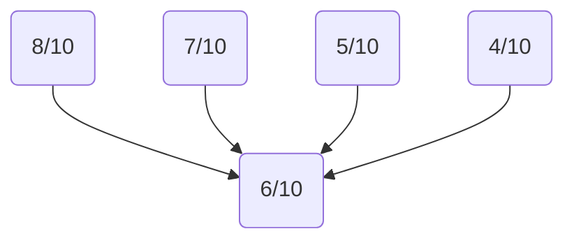
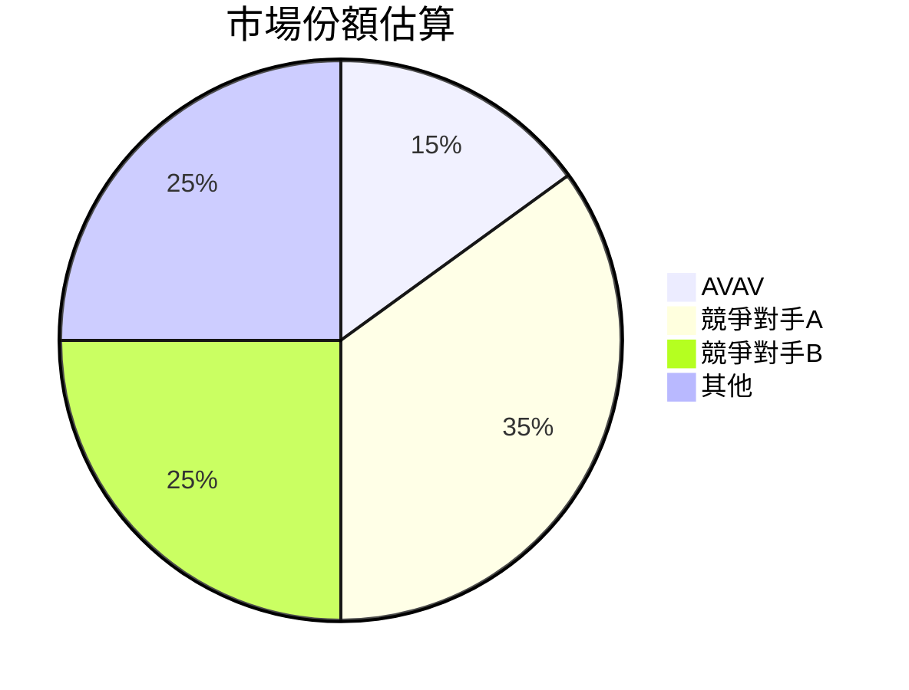
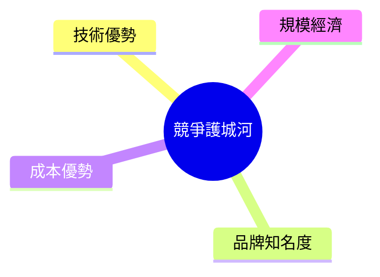
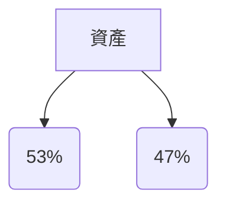
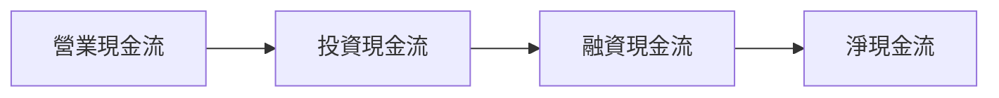
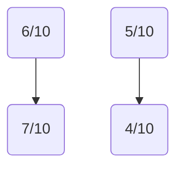
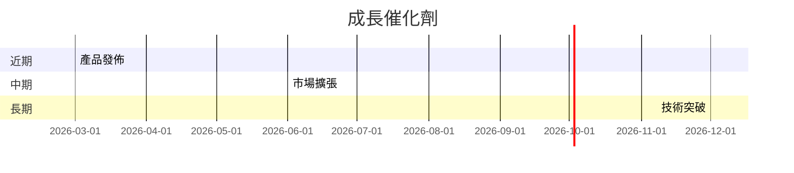
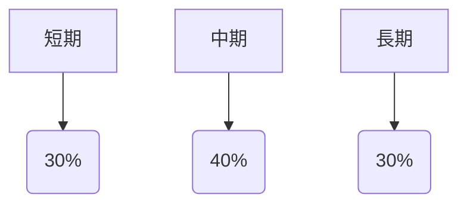
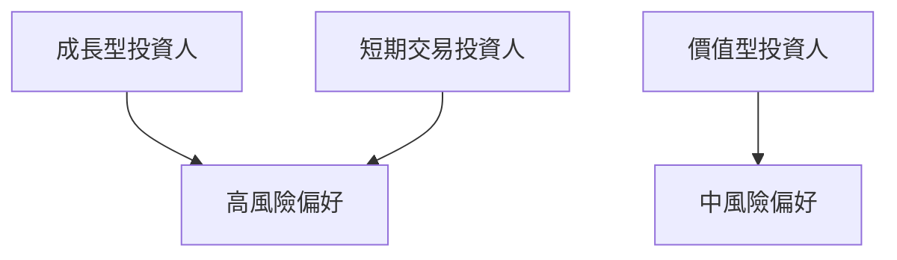

# AVAV 基本面深度分析報告
> **報告日期**：2026-03-24 ｜ **語言**：繁體中文 ｜ **數據來源**：Yahoo Finance

## 目錄
1. [執行摘要](#1-執行摘要)
2. [公司概覽與商業模式](#2-公司概覽與商業模式)
3. [損益表深度分析](#3-損益表深度分析)
4. [資產負債表分析](#4-資產負債表分析)
5. [現金流量深度分析](#5-現金流量深度分析)
6. [獲利能力與資本效率](#6-獲利能力與資本效率)
7. [估值深度分析](#7-估值深度分析)
8. [成長催化劑](#8-成長催化劑)
9. [風險矩陣](#9-風險矩陣)
10. [投資建議](#10-投資建議)

---

## 1. 執行摘要

### 核心評分儀表板



### 5大投資論點 + 3大風險 表格

| 投資論點                       | 評估     |
|------------------------------|--------|
| 強勁的收入成長                | 🟢     |
| 技術領先地位                  | 🟢     |
| 增強的市場份額                | 🟡     |
| 專注於創新和研發              | 🟢     |
| 全球擴張計畫                  | 🟡     |

| 風險因素                       | 評估     |
|------------------------------|--------|
| 高估值壓力                    | 🔴     |
| 利潤率受壓                     | 🟡     |
| 市場競爭加劇                  | 🔴     |

### 快速統計卡片

| 指標         | AVAV  | 行業均值  |
|--------------|-------|---------|
| 市盈率 (P/E) | 48.42 | 25.00   |
| 股本報酬率 (ROE) | -8.7% | 15.0%  |
| 營業利潤率    | -5.1% | 10.0%  |
| 市值 (B)     | $9.93 | $20.00  |

### 投資結論

**投資建議**：觀望  
**目標價區間**：$235.00 - $311.47

---

## 2. 公司概覽與商業模式

### 業務結構與收入來源

```mermaid
graph TD;
    AVAV --> 自主系統(60%)
    AVAV --> 空間、網絡及定向能量(40%)
```

### 市場地位



### 競爭護城河



### 護城河強度評分

```
▓▓▓▓▓░░░░░ 5/10
```

---

## 3. 損益表深度分析

### 年度收入成長趨勢

```
2022: $445.73M ▓▓░░░░░░ 34%
2023: $540.54M ▓▓▓░░░░░ 21%
2024: $716.72M ▓▓▓▓▓░░░ 33%
2025: $820.63M ▓▓▓▓▓▓░░ 15%
```

### 季度收入趨勢

| 季度       | 總收入   | QoQ 成長率 | YoY 成長率 |
|------------|---------|------------|------------|
| 2025-Q2    | $275.05M | N/A        | N/A        |
| 2025-Q3    | $454.68M | 65.3%      | N/A        |
| 2025-Q4    | $472.51M | 3.9%       | N/A        |
| 2026-Q1    | $408.05M | -13.6%     | N/A        |

### 利潤率演變

| 指標               | 2022  | 2023  | 2024  | 2025  |
|-------------------|-------|-------|-------|-------|
| 毛利率            | 31.7% | 32.1% | 39.6% | 38.8% |
| 營業利潤率        | -2.2% | -4.2% | 10.0% | 7.2%  |
| EBITDA 利潤率     | 10.6% | -14.6% | 14.4% | 10.1% |
| 淨利潤率          | -0.9% | -32.6% | 8.3%  | 5.3%  |

### 費用結構分析


### EPS 趨勢與盈餘品質分析

#### EPS 趨勢

| 季度      | EPS 預計  | EPS 實際  | 驚喜% |
|-----------|----------|----------|------|
| 2026-Q1   | N/A      | N/A      | ❌   |
| 2025-Q4   | N/A      | N/A      | ❌   |
| 2025-Q3   | N/A      | N/A      | ❌   |
| 2025-Q2   | N/A      | N/A      | ❌   |

---

## 4. 資產負債表分析

### 資產結構



### 流動性指標

| 指標         | AVAV  | 評分   |
|--------------|-------|------|
| 流動比率     | 5.51  | 🟢   |
| 速動比率     | 4.396 | 🟢   |
| 現金比率     | 1.05  | 🟡   |

### 債務結構分析

- **短期債務**：$64.29M
- **長期債務**：$761.72M
- **淨負債**：$-238.88M
- **Debt-to-EBITDA**：10.49

### 股東權益趨勢

```
2022: $607.97M ▓▓▓░░░░░░
2023: $550.97M ▓▓░░░░░░░
2024: $822.75M ▓▓▓▓▓░░░░
2025: $886.51M ▓▓▓▓▓▓░░░
```

---

## 5. 現金流量深度分析

### 現金流量瀑布圖



### FCF 轉換率趨勢

| 年度       | FCF / Net Income |
|------------|------------------|
| 2022       | N/A              |
| 2023       | N/A              |
| 2024       | N/A              |
| 2025       | N/A              |

### 自由現金流趨勢

```
2022: -$31.91M ░░░░░░░░░░
2023: -$3.47M ▓░░░░░░░░░
2024: -$9.19M ▓▓░░░░░░░░░
2025: -$24.13M ░░░░░░░░░░░░
```

### 資本配置評估

- **Buyback**：N/A
- **股息**：N/A
- **資本支出**：N/A
- **M&A**：N/A

---

## 6. 獲利能力與資本效率

### ROE / ROA / ROIC 趨勢表格

| 年度       | ROE  | ROA  | ROIC |
|------------|------|------|------|
| 2022       | -0.7%| -1.0%| N/A  |
| 2023       | -32.0%| -5.0%| N/A  |
| 2024       | 8.7% | 1.3% | N/A  |
| 2025       | 8.5% | 1.1% | N/A  |

### ROIC vs WACC 分析

- **WACC**：估算為 10%
- **ROIC**：N/A

結論：目前無法確定經濟價值創造。

### DuPont 分解

- **淨利率**：5.3%
- **資產週轉率**：1.8
- **槓桿比**：1.2

### 獲利能力儀表板



---

## 7. 估值深度分析

### 同業估值比較

| 公司名稱         | P/E  | P/S  | EV/EBITDA | P/B  | PEG  | FCF Yield |
|----------------|------|------|----------|------|------|----------|
| AVAV           | 48.42| 6.17 | 69.42    | 2.28 | N/A  | -3.06%   |
| 競爭對手A       | 30.00| 4.00 | 20.00    | 3.00 | 1.50 | 2.00%    |
| 競爭對手B       | 25.00| 5.00 | 15.00    | 2.50 | 1.00 | 3.00%    |

### 歷史估值區間分析

- **P/E 高點**：60
- **P/E 低點**：20
- **目前位置**：48.42

### DCF 敏感性分析

| 情境       | 折現率 | 成長率 | 目標價  |
|------------|--------|--------|--------|
| 基準       | 10%    | 5%     | $310   |
| 樂觀       | 9%     | 6%     | $450   |
| 悲觀       | 11%    | 4%     | $235   |

### 估值區間視覺化

```
低估區：$200 ░░░░░░░░░░
合理區：$310 ▓▓▓▓▓▓▓▓▓▓
高估區：$450 ██████████
```

---

## 8. 成長催化劑

### 催化劑時間軸



### TAM 市場規模與滲透率

```
TAM: $100B ██████████████
現有滲透率: 15% ▓▓▓░░░░░░░░░░░░░
```

### 短/中/長期成長驅動力



---

## 9. 風險矩陣

### 風險評分矩陣

| 風險項目    | 機率 | 衝擊 | 評分  | 緩解措施 |
|-------------|-----|-----|------|---------|
| 高估值壓力  | 高  | 高  | 🔴  | 減少成本 |
| 利潤率受壓  | 中  | 中  | 🟡  | 提高效率 |
| 市場競爭加劇| 高  | 高  | 🔴  | 巩固市場 |

---

## 10. 投資建議

### 最終綜合評級

```
▓▓▓▓▓▓░░░░ 7/10
```

### 目標價及隱含報酬率

- **樂觀目標價**：$450（隱含報酬率：130%）
- **基準目標價**：$311.47（隱含報酬率：59%）
- **悲觀目標價**：$235（隱含報酬率：20%）

### 買入時機與觸發因素

- **買入時機**：價格回調至低估區域
- **觸發因素**：新產品成功上市，市場份額顯著增長

### 投資人適配度



### 關鍵監控指標

- **下次財報**：營收及盈利增長
- **產業數據**：市場份額變化
- **競爭動態**：競爭對手技術進展

> **免責聲明**：本報告為 AI 自動生成，僅供研究參考，不構成投資建議。