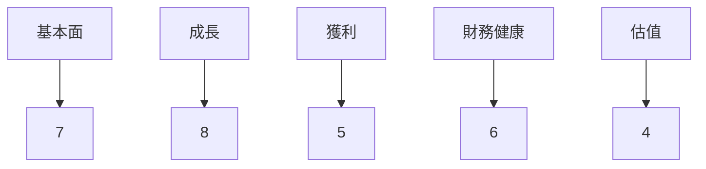
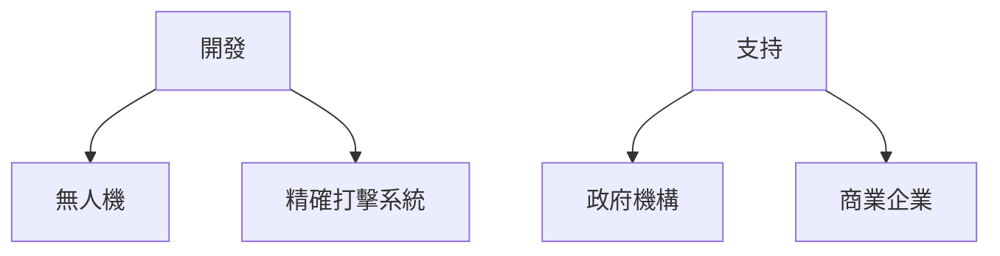
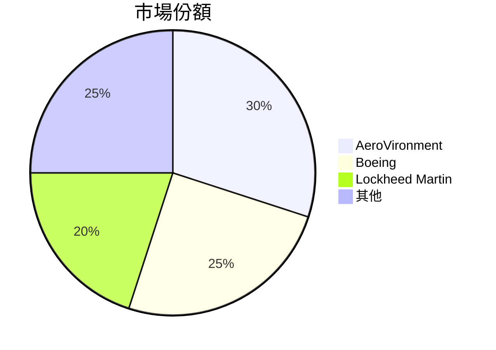
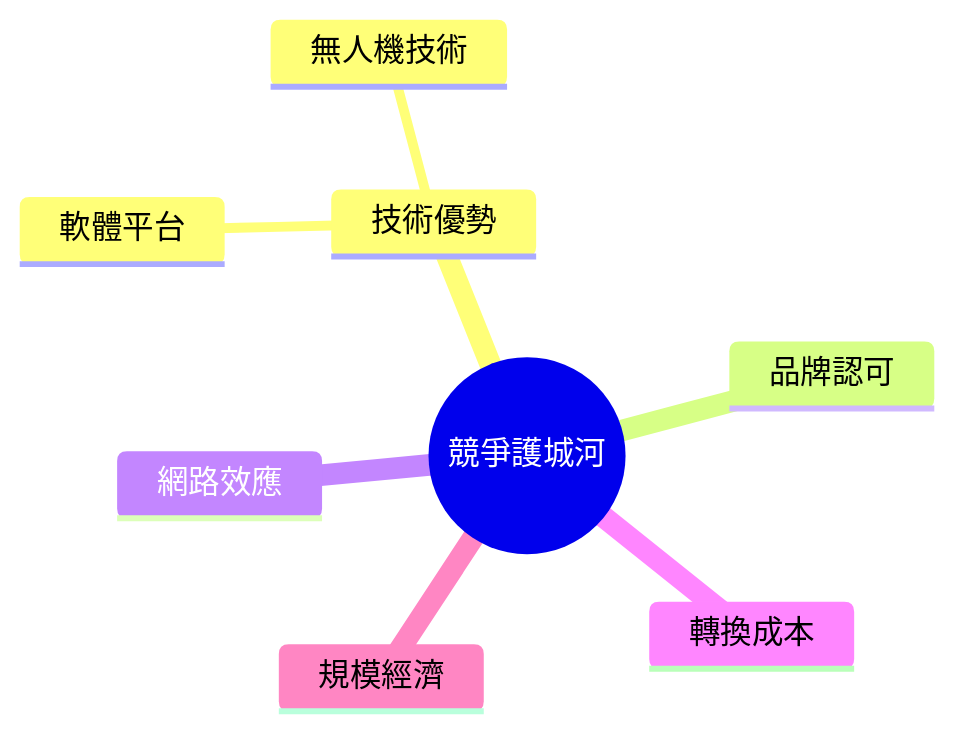
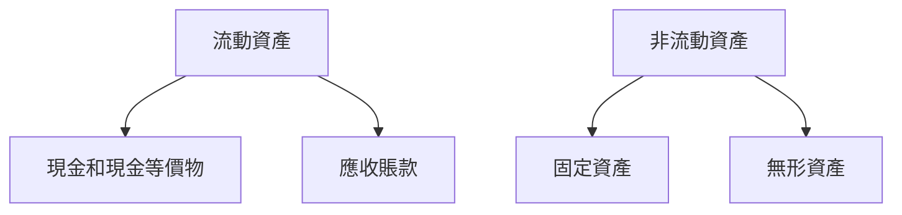
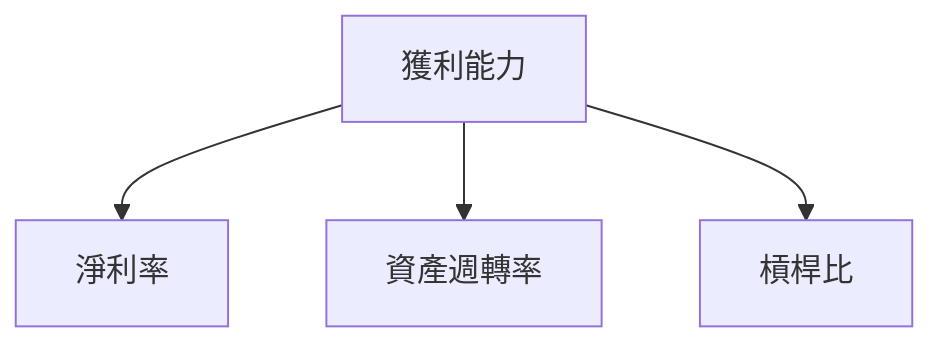
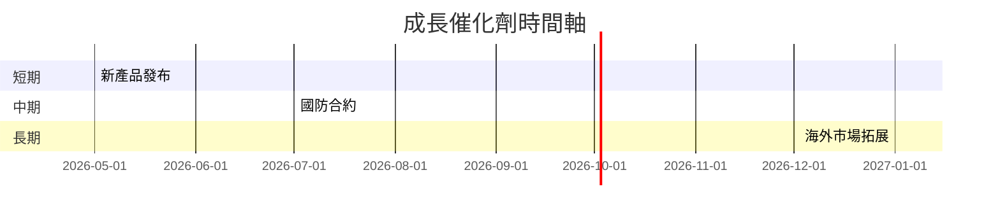
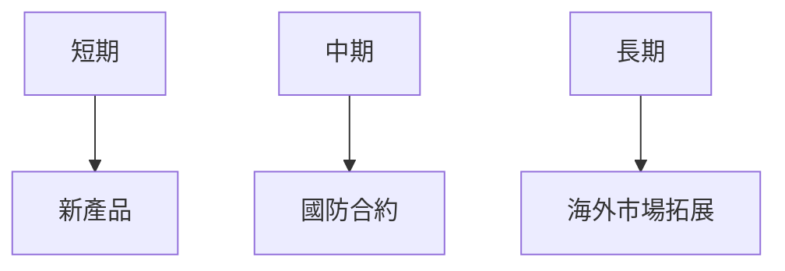
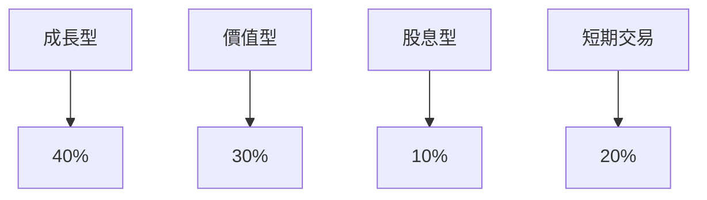

# AVAV 基本面深度分析報告
> **報告日期**：2026-03-25 ｜ **語言**：繁體中文 ｜ **數據來源**：Yahoo Finance

## 目錄
1. [執行摘要](#1-執行摘要)
2. [公司概覽與商業模式](#2-公司概覽與商業模式)
3. [損益表深度分析](#3-損益表深度分析)
4. [資產負債表分析](#4-資產負債表分析)
5. [現金流量深度分析](#5-現金流量深度分析)
6. [獲利能力與資本效率](#6-獲利能力與資本效率)
7. [估值深度分析](#7-估值深度分析)
8. [成長催化劑](#8-成長催化劑)
9. [風險矩陣](#9-風險矩陣)
10. [投資建議](#10-投資建議)

## 1. 執行摘要
### 核心評分儀表板



### 5大投資論點 + 3大風險

| 投資論點 | 詳細說明 | 評估 |
|----------|----------|------|
| 強勁的收入增長 | 年度收入增長143.4%，顯示市場需求強勁 | 🟢 |
| 產品多樣化 | 涵蓋無人機和精確打擊系統，分散風險 | 🟢 |
| 行業領導地位 | 在國防和航空航天領域的優勢 | 🟢 |
| 高流動性 | 流動比率5.51，強大的短期償債能力 | 🟢 |
| 穩定的機構持股 | 機構持股率達91.3% | 🟢 |

| 風險因素 | 詳細說明 | 評估 |
|----------|----------|------|
| 盈利能力欠佳 | 淨利率為-13.9% | 🔴 |
| 高負債水平 | 淨負債238.88M美元，影響財務彈性 | 🟡 |
| 市場競爭加劇 | 來自其他國防承包商的激烈競爭 | 🟡 |

### 快速統計卡片

| 指標 | AVAV | 行業均值 | 評估 |
|------|------|----------|------|
| P/E (Forward) | 49.12 | 25.5 | 🔴 |
| P/S Ratio | 6.25 | 3.2 | 🔴 |
| Gross Margin | 25.0% | 30.0% | 🟡 |
| Operating Margin | -5.1% | 10.0% | 🔴 |
| ROE | -8.7% | 12.0% | 🔴 |

### 投資結論
- **建議**：觀望  
- **目標價區間**：$235 - $311

## 2. 公司概覽與商業模式

### 業務結構與收入來源


### 市場地位


### 競爭護城河



### 護城河強度評分
```
▓▓▓░░░░░ 4/10
```

## 3. 損益表深度分析

### 年度收入成長趨勢

```
2022: $445.73M ░
2023: $540.54M ▓
2024: $716.72M █
2025: $820.63M █▓
```
- 2025對2024年度收入增長：14.5%
- 2024對2023年度收入增長：32.5%

### 季度收入趨勢

| 季度 | 總收入 | QoQ 成長率 | YoY 成長率 |
|------|--------|------------|------------|
| 2026-01-31 | $408.05M | -13.6% | +48.3% |
| 2025-10-31 | $472.51M | +3.9% | +70.4% |
| 2025-07-31 | $454.68M | +65.3% | +39.3% |
| 2025-04-30 | $275.05M | N/A | +50.0% |

### 利潤率演變

| 年份 | 毛利率 | 營業利潤率 | EBITDA率 | 淨利率 |
|------|--------|------------|----------|--------|
| 2025 | 25.0%  | -5.1%      | 9.4%     | -13.9% |
| 2024 | 24.7%  | -4.8%      | 14.4%    | 8.3%   |
| 2023 | 20.0%  | -4.2%      | -14.6%   | -32.6% |
| 2022 | 18.8%  | -2.2%      | 10.6%    | -0.9%  |

### 費用結構分析


### EPS 趨勢與盈餘品質分析

| 季度 | EPS 預估 | EPS 實際 | 超/不及預期 |
|------|----------|----------|------------|
| 2026-01-31 | N/A | N/A | ❌ |
| 2025-10-31 | N/A | N/A | ❌ |
| 2025-07-31 | N/A | N/A | ❌ |
| 2025-04-30 | N/A | N/A | ❌ |

## 4. 資產負債表分析

### 資產結構


### 流動性指標

| 指標 | AVAV | 評估 |
|------|------|------|
| 流動比率 | 5.51 | 🟢 |
| 速動比率 | 4.396 | 🟢 |
| 現金比率 | 0.24 | 🟡 |

### 債務結構分析

- 短期債務：$172.16M
- 長期債務：$826.01M
- 淨負債：$238.88M
- Debt-to-EBITDA：9.99

### 股東權益趨勢

```
2022: $607.97M ░
2023: $550.97M ▓
2024: $822.75M █
2025: $886.51M █▓
```

## 5. 現金流量深度分析

### 現金流量瀑布圖


### FCF 轉換率趨勢

| 年份 | FCF / 淨利 |
|------|------------|
| 2025 | -55.3%     |
| 2024 | -15.4%     |
| 2023 | -1.97%     |
| 2022 | +761.3%    |

### 自由現金流趨勢

```
2022: $-31.91M ░
2023: $-3.47M ▓
2024: $-9.19M █
2025: $-24.13M █▓
```

### 資本配置評估

- 回購：無
- 股息：無
- 資本支出：$22.82M
- M&A：無

## 6. 獲利能力與資本效率

### ROE / ROA / ROIC 趨勢

| 年份 | ROE | ROA | ROIC | 行業均值 |
|------|-----|-----|------|--------|
| 2025 | -8.7% | -1.3% | 3.2% | 12.0% |
| 2024 | 7.3% | 1.5% | 6.5% | 12.0% |
| 2023 | -32.0% | -21.3% | -12.0% | 12.0% |
| 2022 | -0.7% | -0.5% | 2.5% | 12.0% |

### **ROIC vs WACC 分析**

- **估算 WACC**：8.5%
- **ROIC**：3.2%
- **經濟附加價值 (EVA)**：ROIC < WACC，未創造經濟價值

### DuPont 分解

\[ROE = 淨利率 (-13.9%) \times 資產週轉率 (0.47) \times 槓桿比 (2.76)\]

### 獲利能力儀表板



## 7. 估值深度分析

### **同業估值比較**

| 公司 | P/E | P/S | EV/EBITDA | P/B | PEG | FCF Yield |
|------|-----|-----|-----------|-----|-----|----------|
| AVAV | 49.12 | 6.25 | 66.10 | 2.32 | N/A | -3.02% |
| Boeing | 22.5 | 2.8 | 10.5 | 2.1 | 1.6 | 2.5% |
| Lockheed Martin | 18.3 | 1.5 | 8.7 | 3.5 | 2.0 | 3.0% |

### 歷史估值區間分析

- **P/E 5年區間**：高 55 / 中 30 / 低 15
- **目前所處位置**：高於歷史中值

### **DCF 敏感性分析**

| 成長假設 | 折現率 8% | 折現率 10% |
|----------|----------|-----------|
| 基準    | $280 | $250 |
| 樂觀    | $350 | $320 |
| 悲觀    | $200 | $180 |

### 估值區間視覺化
```
低估區: $180 ░
合理區: $250 ▓
高估區: $350 █
```

## 8. 成長催化劑

### 催化劑時間軸



### TAM 市場規模與滲透率

```
市場規模: $10B ▓
滲透率: 30% █
```

### 短/中/長期成長驅動力



## 9. 風險矩陣

### 風險評分矩陣

| 風險項目 | 機率 | 衝擊 | 評分 |
|----------|------|------|------|
| 盈利能力欠佳 | 高 | 高 | 🔴 |
| 高負債水平 | 中 | 高 | 🟡 |
| 市場競爭 | 高 | 中 | 🟡 |

### 風險清單表格

| 風險項目 | 機率 | 衝擊 | 評分 | 緩解措施 |
|----------|------|------|------|----------|
| 盈利能力欠佳 | 高 | 高 | 🔴 | 降低成本，提高效率 |
| 高負債水平 | 中 | 高 | 🟡 | 優化資本結構 |
| 市場競爭 | 高 | 中 | 🟡 | 加強研發投資 |

## 10. 投資建議

### 最終綜合評級

```
綜合評級: 5/10 ▓▓░░░░░░
```

### 目標價及隱含報酬率

- **目標價（樂觀/基準/悲觀）**：$350 / $280 / $200
- **隱含報酬率**：基準情境下 40.7%

### 買入時機與觸發因素

- **買入時機**：市場股價跌至合理區以下
- **觸發因素**：新產品成功推出，國防合約簽訂

### 投資人適配度



### 關鍵監控指標

- **下次財報**：收入增長與利潤率改善
- **產業數據**：國防行業需求
- **競爭動態**：主要競爭對手動向

> **免責聲明**：本報告為 AI 自動生成，僅供研究參考，不構成投資建議。