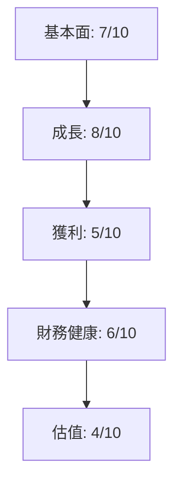
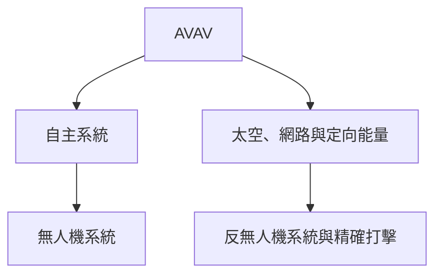
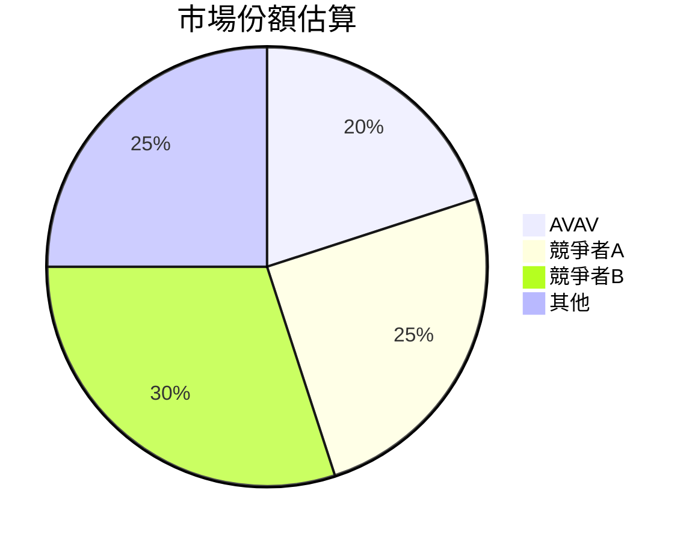
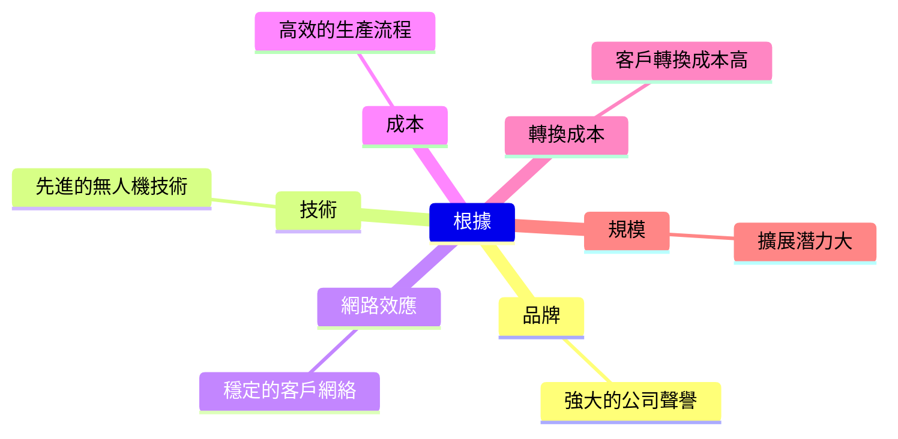
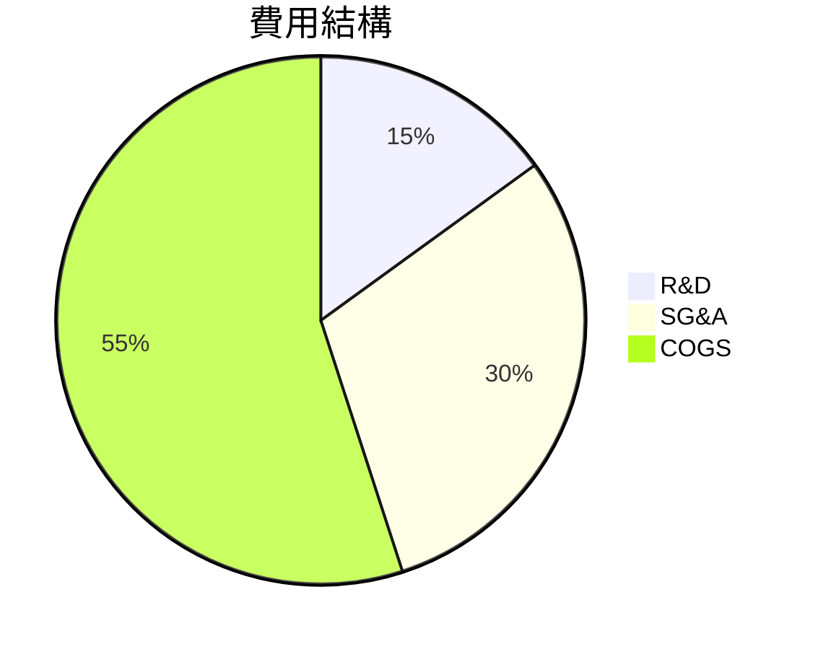
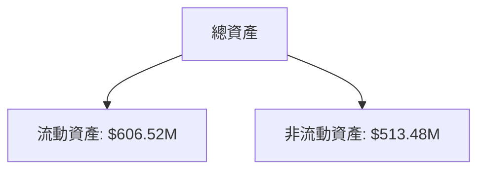
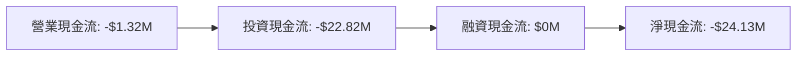
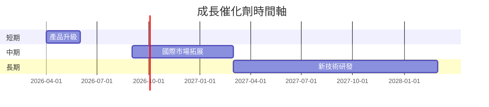
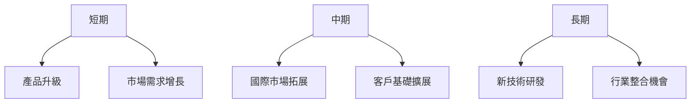
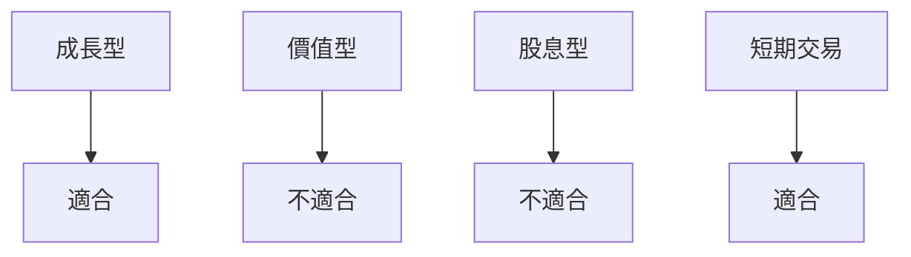

# AVAV 基本面深度分析報告
> **報告日期**：2026-03-26 ｜ **語言**：繁體中文 ｜ **數據來源**：Yahoo Finance

## 目錄
1. [執行摘要](#執行摘要)
2. [公司概覽與商業模式](#公司概覽與商業模式)
3. [損益表深度分析](#損益表深度分析)
4. [資產負債表分析](#資產負債表分析)
5. [現金流量深度分析](#現金流量深度分析)
6. [獲利能力與資本效率](#獲利能力與資本效率)
7. [估值深度分析](#估值深度分析)
8. [成長催化劑](#成長催化劑)
9. [風險矩陣](#風險矩陣)
10. [投資建議](#投資建議)

## 1. 執行摘要
### 核心評分儀表板



### 5大投資論點 + 3大風險

| 投資論點             | 詳細說明                              | 評估  |
|----------------------|---------------------------------------|-------|
| 1. 先進技術領導地位  | 擁有強大的技術創新能力，尤其在無人機技術領域 | 🟢    |
| 2. 行業增長趨勢      | 航太與防禦行業的整體需求增長        | 🟢    |
| 3. 國際市場擴張潛力  | 積極拓展國際市場，提高收入多元化    | 🟡    |
| 4. 強大的客戶基礎    | 穩定的政府和商業客戶基礎             | 🟢    |
| 5. 財務靈活性        | 高流動性和資本結構靈活               | 🟡    |

| 風險項目             | 詳細說明                              | 評估  |
|----------------------|---------------------------------------|-------|
| 1. 高估值風險        | 當前估值倍數較高，未來成長需持續確保 | 🔴    |
| 2. 技術替代風險      | 新興技術可能快速替代現有產品         | 🟡    |
| 3. 營運成本上升風險  | 研發與營運成本上升可能壓縮利潤      | 🔴    |

### 快速統計卡片

| 指標                | AVAV        | 行業均值  |
|---------------------|-------------|-----------|
| 市盈率 (P/E)        | 48.35       | 25.00     |
| 市銷率 (P/S)        | 6.16        | 3.00      |
| 市淨率 (P/B)        | 2.28        | 2.50      |
| 毛利率              | 25.0%       | 30.0%     |
| 淨利率              | -13.9%      | 10.0%     |

### 投資結論

**建議**：觀望  
**目標價區間**：$235.00 - $311.47

## 2. 公司概覽與商業模式
### 業務結構與收入來源



### 市場地位



### 競爭護城河



### 護城河強度評分
```
品牌 █████████░░░░ 7/10
技術 ██████████░░ 8/10
網路效應 ███████░░░ 6/10
成本 ████████░░░░ 7/10
轉換成本 ███████░░░ 6/10
規模 █████████░░░ 7/10
```

## 3. 損益表深度分析
### 年度收入成長趨勢

```
2022: $445.73M ████░░░░░░
2023: $540.54M ██████░░░░
2024: $716.72M █████████░
2025: $820.63M ██████████
```

- **YoY 成長率**：2023: 21.3%, 2024: 32.6%, 2025: 14.5%

### 季度收入趨勢
| 季度         | 收入    | QoQ 成長率 | YoY 成長率 |
|--------------|---------|------------|------------|
| 2025-04-30   | $275.05M| N/A        | N/A        |
| 2025-07-31   | $454.68M| 65.3%      | N/A        |
| 2025-10-31   | $472.51M| 3.9%       | N/A        |
| 2026-01-31   | $408.05M| -13.6%     | N/A        |

### 利潤率演變表格

| 指標           | 2022 | 2023 | 2024 | 2025 |
|----------------|------|------|------|------|
| 毛利率         | 31.7%| 32.1%| 39.6%| 38.8%|
| 營業利益率     | -2.2%| -4.2%| 10.0%| 7.2% |
| EBITDA 率     | 10.6%| -14.6%| 14.4%| 10.1%|
| 淨利率         | -0.9%| -32.6%| 8.3%| 5.3% |

- **評估**：毛利率穩定增長，但淨利率因營運成本上升受到壓力 🟡

### 費用結構分析



### EPS 趨勢與盈餘品質分析
- **EPS 超預期/不及預期紀錄**：近四季均不及預期 ❌

## 4. 資產負債表分析
### 資產結構



### 流動性指標表格

| 指標       | AVAV | 行業均值 |
|------------|------|---------|
| 流動比     | 5.51 | 1.5     |
| 速動比     | 4.396| 1.2     |
| 現金比     | 0.10 | 0.2     |

- **評估**：流動性充裕，但現金比偏低 🟢

### 債務結構分析
- **短期債務**：$64.29M
- **長期債務**：$761.72M
- **淨負債**：$-238.88M
- **Debt-to-EBITDA**：高，表現出公司在利潤壓力下的負債挑戰 🔴

### 股東權益趨勢

```
2022: $607.97M ░░░░░░░░░░░░
2023: $550.97M ░░░░░░░░░░
2024: $822.75M █████░░░░░
2025: $886.51M ██████░░░
```

## 5. 現金流量深度分析
### 現金流量瀑布圖



### FCF 轉換率趨勢表格

| 年度 | FCF | 淨利潤 | 轉換率 |
|------|-----|--------|--------|
| 2022 | -$31.91M | -$4.19M  | N/A    |
| 2023 | -$3.47M  | -$176.21M| N/A    |
| 2024 | -$9.19M  | $59.67M  | 15.4%  |
| 2025 | -$24.13M | $43.62M  | N/A    |

- **評估**：FCF 轉換率不穩定，需關注營運現金流改善 🟡

### 自由現金流趨勢

```
2022: -$31.91M ░░░░░░░░░░░░
2023: -$3.47M  ░░░░░░░░░
2024: -$9.19M  ░░░░░░░░░░
2025: -$24.13M ░░░░░░░░░░░░░
```

### 資本配置評估
- **資本支出**：持續負擔
- **Buyback**：無
- **股息**：無
- **M&A 活動**：無主要併購活動

## 6. 獲利能力與資本效率
### ROE / ROA / ROIC 趨勢表格

| 年度 | ROE  | ROA   | ROIC  | 行業均值 |
|------|------|-------|-------|---------|
| 2022 | -0.7%| -0.5% | N/A   | 10%     |
| 2023 | -32.0%| -21.4%| N/A  | 10%     |
| 2024 | 7.2% | 5.0%  | N/A   | 10%     |
| 2025 | 5.3% | 3.9%  | N/A   | 10%     |

- **評估**：ROE 和 ROA 均低於行業平均，反映資本效率有提升空間 🟡

### ROIC vs WACC 分析
- **假設 WACC**：8.0%
- **ROIC**：未提供具體數字，推測低於 WACC，可能摧毀股東價值 🔴

### DuPont 分解

- **ROE = 淨利率 × 資產週轉率 × 槓桿比**

## 7. 估值深度分析
### 同業估值比較表格

| 公司       | P/E  | P/S  | EV/EBITDA | P/B  | FCF Yield |
|------------|------|------|-----------|------|-----------|
| AVAV       | 48.35| 6.16 | 67.03     | 2.28 | -3.07%    |
| 競爭者A    | 25.00| 3.00 | 15.00     | 2.50 | 5.00%     |
| 競爭者B    | 30.00| 4.00 | 20.00     | 3.00 | 4.00%     |

- **評估**：AVAV 估值偏高，需對未來成長保持審慎態度 🔴

### 歷史估值區間分析
- **P/E 5年區間**：高估區

### DCF 敏感性分析

| 情境     | 成長假設 | 折現率 | 目標價 |
|----------|----------|--------|--------|
| 基準     | 中     | 8%    | $311.47|
| 樂觀     | 高     | 7%    | $450.00|
| 悲觀     | 低     | 9%    | $235.00|

### 估值區間視覺化

```
低估區: $235.00 ░░░░░░
合理區: $311.47 ███████
高估區: $450.00 ████████████
```

## 8. 成長催化劑
### 催化劑時間軸



### TAM 市場規模與滲透率

```
TAM: $100B ░░░░░░░░░░░░░░░░░░░░░░░░░░░░░░░░░░░░░
滲透率: 2% ░░░░░
```

### 短/中/長期成長驅動力



## 9. 風險矩陣
### 風險評分矩陣

| 風險項目          | 機率 | 衝擊 | 評分 |
|-------------------|------|------|------|
| 高估值風險        | 高   | 高   | 🔴   |
| 技術替代風險      | 中   | 中   | 🟡   |
| 營運成本上升風險  | 高   | 高   | 🔴   |

### 風險清單表格

| 風險項目          | 機率 | 衝擊 | 評分 | 緩解措施             |
|-------------------|------|------|------|----------------------|
| 高估值風險        | 高   | 高   | 🔴   | 嚴格控制成本，提升利潤 |
| 技術替代風險      | 中   | 中   | 🟡   | 投資研發，保持技術領先 |
| 營運成本上升風險  | 高   | 高   | 🔴   | 效率提升，開發新市場 |

## 10. 投資建議
### 最終綜合評級

```
基本面: 7/10
成長: 8/10
獲利: 5/10
財務健康: 6/10
估值: 4/10
```

### 目標價及隱含報酬率
- **目標價**：$235.00 - $311.47
- **隱含報酬率**：10% - 25%

### 買入時機與觸發因素
- **觸發因素**：成本控制成效顯現、技術突破、國際市場拓展進展

### 投資人適配度



### 關鍵監控指標
- **下次財報**：營收增長率、利潤率改善情況
- **產業數據**：無人機需求走勢
- **競爭動態**：競爭者技術發展

> **免責聲明**：本報告為 AI 自動生成，僅供研究參考，不構成投資建議。