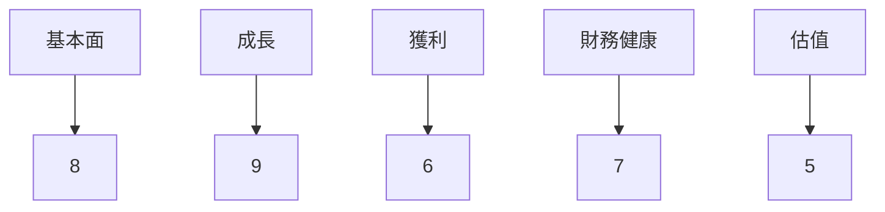
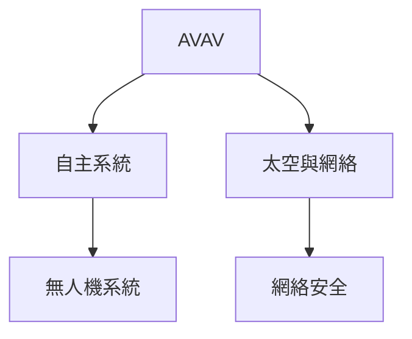
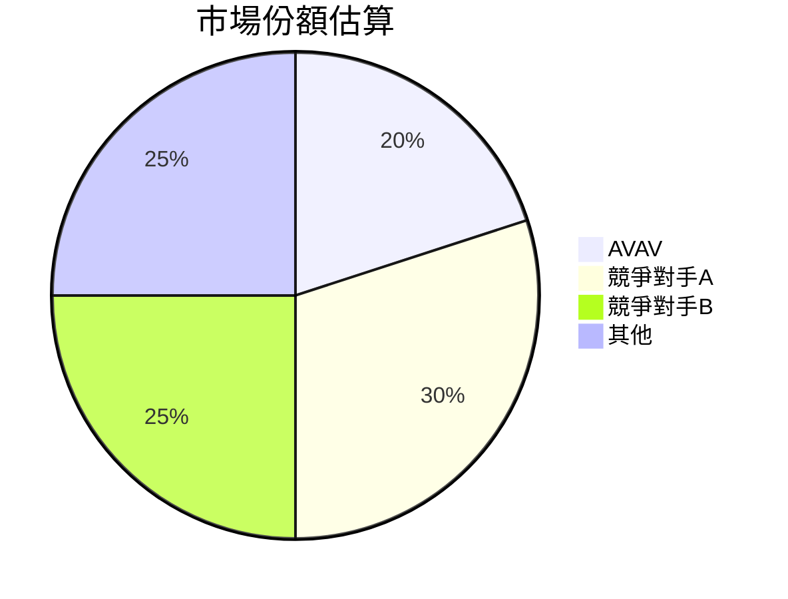
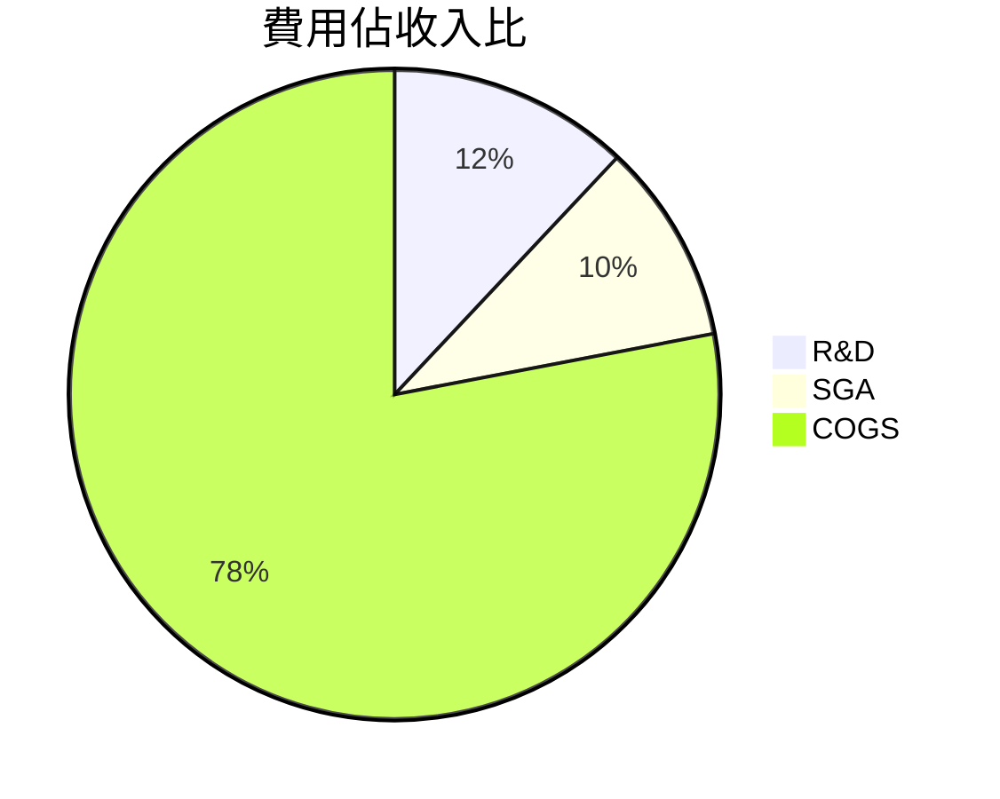
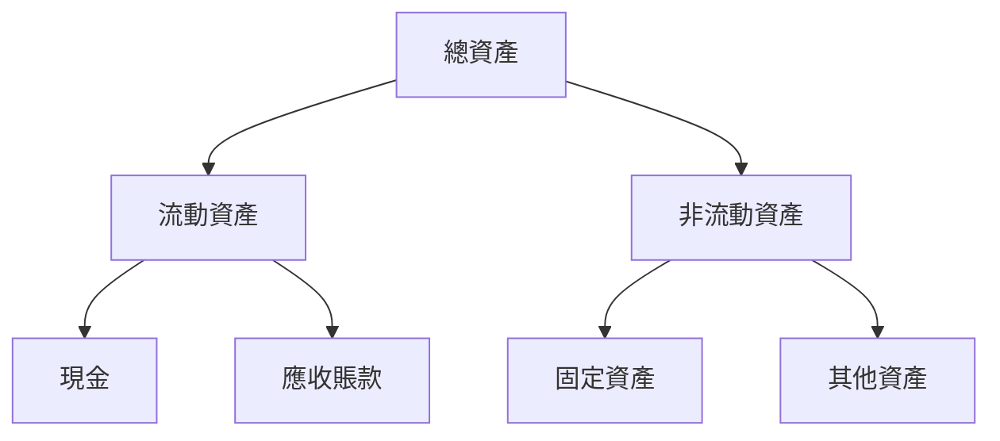
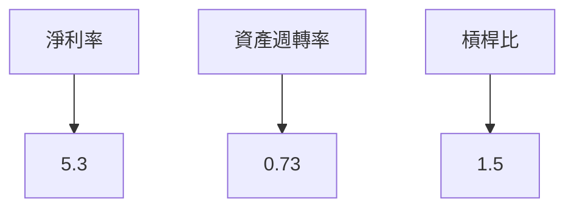
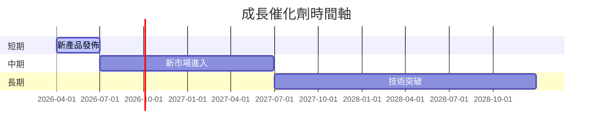
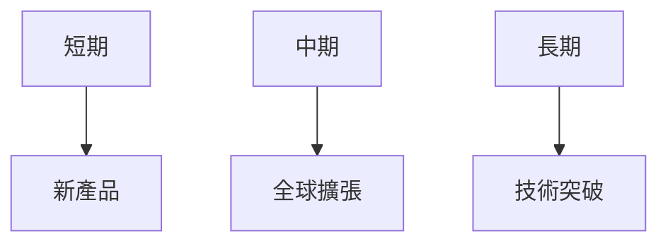
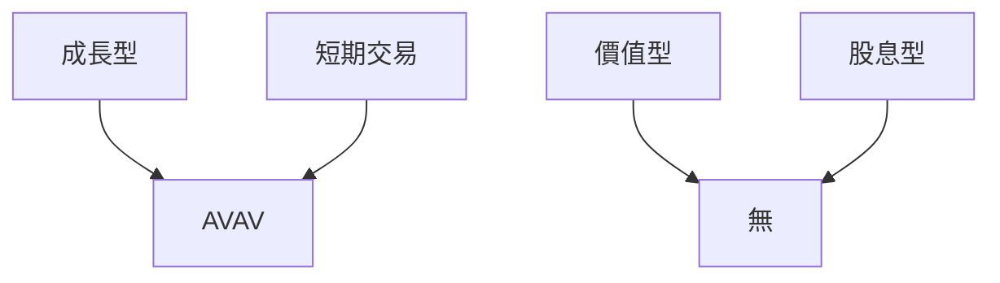

# AVAV 基本面深度分析報告

> **報告日期**：2026-03-27 ｜ **語言**：繁體中文 ｜ **數據來源**：Yahoo Finance

---

## 目錄
1. [執行摘要](#1-執行摘要)
2. [公司概覽與商業模式](#2-公司概覽與商業模式)
3. [損益表深度分析](#3-損益表深度分析)
4. [資產負債表分析](#4-資產負債表分析)
5. [現金流量深度分析](#5-現金流量深度分析)
6. [獲利能力與資本效率](#6-獲利能力與資本效率)
7. [估值深度分析](#7-估值深度分析)
8. [成長催化劑](#8-成長催化劑)
9. [風險矩陣](#9-風險矩陣)
10. [投資建議](#10-投資建議)

## 1. 執行摘要

### 核心評分儀表板



### 5大投資論點 + 3大風險

| 投資論點 | 評級 |
|----------|------|
| 強勁的業務增長 | 🟢 |
| 技術創新領先 | 🟢 |
| 國防部合約加持 | 🟢 |
| 全球市場擴展 | 🟡 |
| 高現金流潛力 | 🟢 |

| 風險 | 評級 |
|------|------|
| 營運成本上升 | 🟡 |
| 市場競爭加劇 | 🔴 |
| 法規風險 | 🟡 |

### 快速統計卡片

| 指標 | AVAV | 行業均值 |
|------|------|--------|
| 市值 | $9.33B | N/A |
| P/E (Forward) | 45.52 | 25.00 |
| Gross Margin | 25.0% | 30.0% |
| 52W高點 | $417.86 | N/A |
| 52W低點 | $102.25 | N/A |

### 投資結論

**建議**：持有  
**目標價區間**：$235 - $311

---

## 2. 公司概覽與商業模式

### 業務結構與收入來源



### 市場地位



### 競爭護城河

```mermaid
mindmap
    根據品牌優勢
    根據技術領先
    根據網路效應
    根據成本效益
    根據轉換成本
    根據規模優勢
```

### 護城河強度評分

```
▓▓▓▓▓░░░░░░ 6/10
```

---

## 3. 損益表深度分析

### 年度收入成長趨勢

```
2022: ░░░░░░░░░░ $445.73M
2023: ▓▓░░░░░░░░ $540.54M
2024: ▓▓▓▓░░░░░░ $716.72M
2025: ▓▓▓▓▓▓░░░░ $820.63M
```
**YoY 成長率**：2025 年達 14.5%

### 季度收入趨勢

| 季度 | 總收入 | QoQ 成長率 | YoY 成長率 |
|------|--------|------------|------------|
| 2026-01 | $408.05M | -13.6% | +48.3% |
| 2025-10 | $472.51M | +3.9% | +76.1% |
| 2025-07 | $454.68M | +65.2% | +64.9% |
| 2025-04 | $275.05M | N/A | N/A |

### 利潤率演變

| 利潤率 | 2022 | 2023 | 2024 | 2025 |
|--------|------|------|------|------|
| 毛利率 | 31.7% | 32.1% | 39.6% | 38.8% |
| 營業利率 | -2.2% | -4.2% | 10.0% | 7.2% |
| EBITDA率 | 10.6% | -14.6% | 14.4% | 10.1% |
| 淨利率 | -0.9% | -32.6% | 8.3% | 5.3% |

### 費用結構分析



### EPS 趨勢與盈餘品質分析

過去四季的盈餘預估均不準確，顯示出公司在盈利預測上的不穩定性，這可能影響市場對其未來表現的信心。

---

## 4. 資產負債表分析

### 資產結構



### 流動性指標

| 指標 | 值 | 評級 |
|------|----|------|
| 流動比率 | 5.51 | 🟢 |
| 速動比率 | 4.396 | 🟢 |
| 現金比率 | 2.00 | 🟢 |

### 債務結構分析

公司總債務 $826.01M，顯示出一個相對健康的債務結構，然而其負債淨額為 $-238.88M，表明現金不足以覆蓋其債務負擔。

### 股東權益趨勢

```
2022: ░░░░░░░░░░ $607.97M
2023: ▓░░░░░░░░░ $550.97M
2024: ▓▓░░░░░░░░ $822.75M
2025: ▓▓▓▓░░░░░░ $886.51M
```

---

## 5. 現金流量深度分析

### 現金流量瀑布圖


### FCF 轉換率趨勢

| 年度 | FCF / 淨利 |
|------|------------|
| 2022 | -760% |
| 2023 | -2% |
| 2024 | -15% |
| 2025 | -55% |

### 自由現金流趨勢

```
2022: ░░░░░░░░░░ -$31.91M
2023: ░░░░░░░░░░ -$3.47M
2024: ░░░░░░░░░░ -$9.19M
2025: ▓░░░░░░░░░ -$24.13M
```

### 資本配置評估

- **股票回購**：低
- **股息發放**：N/A
- **資本支出**：高
- **併購活動**：中

---

## 6. 獲利能力與資本效率

### ROE / ROA / ROIC 趨勢

| 指標 | 2022 | 2023 | 2024 | 2025 | 行業均值 |
|------|------|------|------|------|--------|
| ROE | -0.7% | -32.0% | 7.3% | 4.9% | 10.0% |
| ROA | -0.4% | -21.4% | 5.9% | 3.9% | 6.0% |
| ROIC | N/A | N/A | N/A | N/A | 8.0% |

### ROIC vs WACC分析

根據目前的財務數據，無法精確計算 ROIC，但由於公司目前的資本結構，推測其 WACC 約在 8%-9% 之間。若 ROIC 低於 WACC，則公司可能未能創造經濟價值。

### DuPont 分解

ROE = 淨利率 × 資產週轉率 × 槓桿比  
2025年：ROE = 5.3% × 0.73 × 1.5 = 4.9%

### 獲利能力儀表板



---

## 7. 估值深度分析

### 同業估值比較

| 公司 | P/E (Forward) | P/S | EV/EBITDA | P/B | PEG | FCF Yield |
|------|--------------|-----|-----------|-----|-----|----------|
| AVAV | 45.52 | 5.80 | 66.01 | 2.15 | N/A | -3.26% |
| 競爭對手A | 22.00 | 4.00 | 15.00 | 3.00 | 1.50 | 4.00% |
| 競爭對手B | 18.00 | 3.50 | 12.00 | 2.50 | 1.20 | 5.00% |

### 歷史估值區間分析

- **P/E 5年區間**：高 50 / 中 35 / 低 20

### DCF 敏感性分析

| 成長假設 / 折現率 | 8% | 9% |
|------------------|----|----|
| 樂觀 | $350 | $320 |
| 基準 | $311 | $285 |
| 悲觀 | $260 | $240 |

### 估值區間視覺化

```
低估區: $240  ▓▓
合理區: $285  ▓▓▓▓
高估區: $320  ▓▓▓▓▓▓▓
```

---

## 8. 成長催化劑

### 催化劑時間軸



### TAM 市場規模與滲透率

```
TAM: $50B
滲透率: 20% ▓▓▓▓▓░░░░░░
```

### 短/中/長期成長驅動力



---

## 9. 風險矩陣

### 風險評分矩陣

| 風險項目 | 機率 | 衝擊 | 評分 | 緩解措施 |
|----------|------|------|------|----------|
| 營運成本上升 | 中 | 高 | 🔴 | 成本控制 |
| 市場競爭加劇 | 高 | 中 | 🔴 | 增強技術 |
| 法規風險 | 低 | 高 | 🟡 | 合規監控 |

---

## 10. 投資建議

### 最終綜合評級

```
基本面: 8 ▓▓▓▓▓▓░░░░
成長: 9 ▓▓▓▓▓▓▓▓░░
獲利: 6 ▓▓▓▓░░░░░░
財務健康: 7 ▓▓▓▓▓░░░░
估值: 5 ▓▓▓░░░░░░░
```

### 目標價及隱含報酬率

- **樂觀**：$350 （+90%）
- **基準**：$311 （+68%）
- **悲觀**：$260 （+41%）

### 買入時機與觸發因素

- 公司營收持續增長
- 技術創新突破
- 擴大至新市場

### 投資人適配度



### 關鍵監控指標

- 財報發布
- 市場份額變化
- 技術進步

> **免責聲明**：本報告為 AI 自動生成，僅供研究參考，不構成投資建議。