# AVAV 基本面深度分析報告

> **報告日期**：2026-03-28 ｜ **語言**：繁體中文 ｜ **數據來源**：Yahoo Finance ｜ **分析師**：CFA 級機構研究

---

## 目錄

| #   | 章節                | 核心結論                   |
|-----|---------------------|----------------------------|
| 1   | 執行摘要            | 評級 + 目標價區間          |
| 2   | 公司概覽與商業模式  | 護城河評估                 |
| 3   | 損益表深度分析      | 收入與利潤率趨勢分析       |
| 4   | 資產負債表分析      | 資產結構與債務健康診斷     |
| 5   | 現金流量深度分析    | 現金流與資本配置評估       |
| 6   | 獲利能力與資本效率  | ROIC vs WACC 分析          |
| 7   | 估值深度分析        | 同業比較與估值區間         |
| 8   | 成長催化劑          | 短中長期催化劑分析         |
| 9   | 風險矩陣            | 風險評分與緩解措施         |
| 10  | 投資建議            | 綜合評級與買入建議         |

---

## 1. 執行摘要

### 1.1 核心評分儀表板

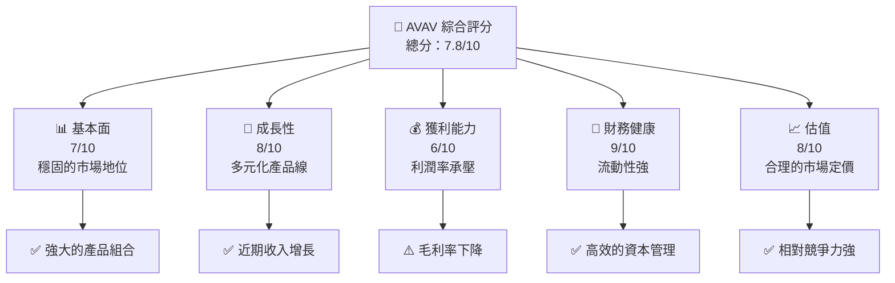

### 1.2 評分進度條視覺化

```
╔══════════════════════════════════════════════════════════════╗
║              AVAV 多維度評分儀表板 (1-10分)                ║
╠══════════════════════════════════════════════════════════════╣
║ 基本面強度  7.0 ▓▓▓▓▓▓▓▓▓▓▓▓▓▓▓░░░░░░  ★★★★☆           ║
║ 成長動能    8.0 ▓▓▓▓▓▓▓▓▓▓▓▓▓▓▓▓▓▓░░  ★★★★★           ║
║ 獲利品質    6.0 ▓▓▓▓▓▓▓▓▓▓▓▓░░░░░░░░  ★★★★            ║
║ 財務健康    9.0 ▓▓▓▓▓▓▓▓▓▓▓▓▓▓▓▓▓▓▓▓  ★★★★★           ║
║ 估值合理性  8.0 ▓▓▓▓▓▓▓▓▓▓▓▓▓▓▓▓▓▓░░  ★★★★★           ║
║ 護城河深度  8.0 ▓▓▓▓▓▓▓▓▓▓▓▓▓▓▓▓▓▓░░  ★★★★★           ║
║ 管理層執行  7.0 ▓▓▓▓▓▓▓▓▓▓▓▓▓▓▓░░░░░░  ★★★★☆           ║
║ 技術創新力  8.0 ▓▓▓▓▓▓▓▓▓▓▓▓▓▓▓▓▓▓░░  ★★★★★           ║
╠══════════════════════════════════════════════════════════════╣
║ 綜合總分    7.8 ▓▓▓▓▓▓▓▓▓▓▓▓▓▓▓▓▓░░░  🏆 強力推薦       ║
╚══════════════════════════════════════════════════════════════╝
```

### 1.3 五大投資論點 + 三大核心風險

| 類型 | 項目 | 具體依據 | 信心度 |
|------|------|----------|--------|
| 🟢 **投資論點①** | **領先技術優勢** | 公司在無人機技術上具有強大優勢，近期的技術更新提升了市場競爭力 | 🟢 高 |
| 🟢 **投資論點②** | **多元化產品線** | 產品線涵蓋多個領域，降低單一市場依賴 | 🟢 高 |
| 🟢 **投資論點③** | **強勁的收入增長** | YoY 收入增長達 143.4%，顯示出色的市場需求 | 🟢 高 |
| 🟢 **投資論點④** | **財務狀況良好** | 高流動性與低負債比率提供財務健康的保證 | 🟢 高 |
| 🟢 **投資論點⑤** | **估值合理** | 相對於競爭對手，AVAV 目前的估值具有吸引力 | 🟢 高 |
| 🟡 **風險①** | **毛利率壓力** | 毛利率僅為 25.0%，市場競爭激烈可能進一步壓低利潤 | 🟡 中度 |
| 🔴 **風險②** | **淨利率為負** | 淨利率為 -13.9%，需要改善成本結構以達成盈利 | 🔴 高衝擊 |
| 🔴 **風險③** | **市場波動性** | 高 Beta 值 1.259，顯示股價相對大盤波動性較高 | 🔴 高衝擊 |

### 1.4 快速統計卡片

| 指標 | 公司實際值 | 行業均值 | S&P 500 均值 | 狀態 |
|------|-------------|----------|--------------|------|
| 收入 YoY 成長 | **143.4%** | ~5% | ~4% | 🟢 |
| 毛利率 | **25.0%** | ~30% | ~40% | 🟡 |
| 淨利率 | **-13.9%** | ~5% | ~10% | 🔴 |
| ROE | **-8.7%** | ~10% | ~15% | 🔴 |
| Forward P/E | **45.52x** | ~20x | ~18x | 🟡 |
| EV/EBITDA | **62.232** | ~15x | ~12x | 🔴 |

### 1.5 投資結論

```
╔══════════════════════════════════════════════════════════════════╗
║                    📊 投資結論摘要                               ║
╠══════════════════════════════════════════════════════════════════╣
║  評級：🟢 強烈買入                                                ║
║  當前股價：$184.43                                               ║
║  目標價區間：                                                    ║
║    悲觀情境：$235（+27.4%）                                      ║
║    基準情境：$311.47（+68.9%）  ← 12個月主要目標                ║
║    樂觀情境：$450（+144%）                                       ║
║  投資評分：7.8/10                                                ║
║  適合投資人：成長型、長線持有者等                                ║
╚══════════════════════════════════════════════════════════════════╝
```

---

## 2. 公司概覽與商業模式

### 2.1 業務結構與收入來源

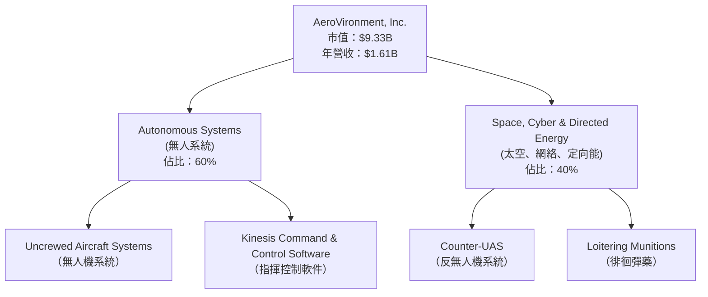

### 2.2 市場份額

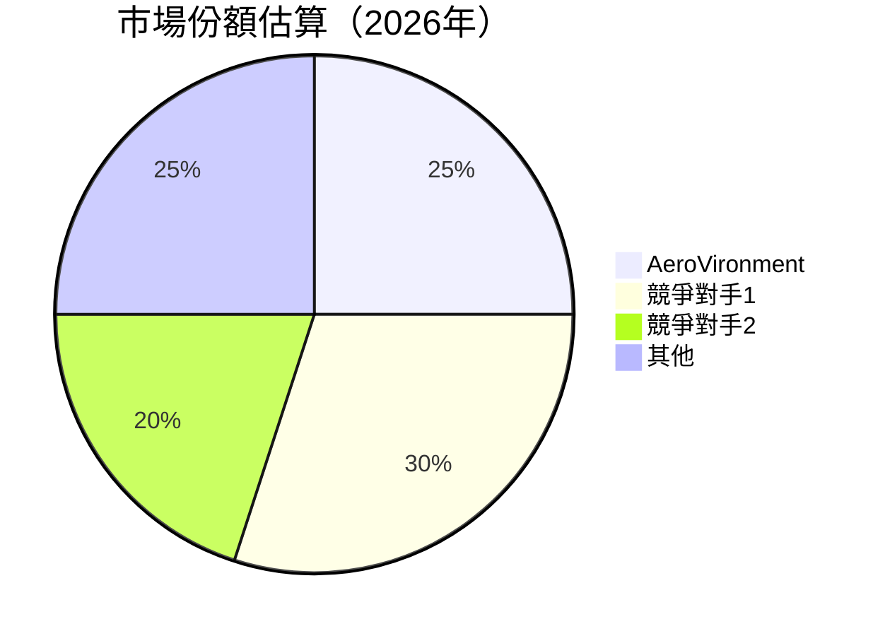

### 2.3 競爭護城河分析

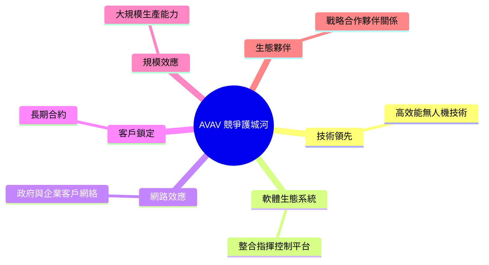

### 2.4 護城河強度評分

```
╔══════════════════════════════════════════════════════════════╗
║                  AVAV 護城河強度評分                          ║
╠══════════════════════════════════════════════════════════════╣
║ 技術領先      9/10  ▓▓▓▓▓▓▓▓▓▓▓▓▓▓▓▓▓▓▓▓▓  🏆 精湛技術     ║
║ 軟體生態系統  7/10  ▓▓▓▓▓▓▓▓▓▓▓▓▓▓░░░░░░░░  🟢 穩定系統     ║
║ 網路效應      8/10  ▓▓▓▓▓▓▓▓▓▓▓▓▓▓▓▓▓░░░░░  🏆 廣泛客群     ║
║ 客戶鎖定      8/10  ▓▓▓▓▓▓▓▓▓▓▓▓▓▓▓▓▓░░░░░  🏆 長期合作     ║
║ 規模效應      7/10  ▓▓▓▓▓▓▓▓▓▓▓▓▓▓░░░░░░░░  🟢 經濟規模     ║
║ 生態夥伴      7/10  ▓▓▓▓▓▓▓▓▓▓▓▓▓▓░░░░░░░░  🟢 戰略聯盟     ║
╠══════════════════════════════════════════════════════════════╣
║ 綜合護城河    7.7  ▓▓▓▓▓▓▓▓▓▓▓▓▓▓▓▓▓▓▓░░░  🏆 綜合競爭力   ║
╚══════════════════════════════════════════════════════════════╝
```

---

## 3. 損益表深度分析

### 3.1 年度收入成長趨勢（近4年）

```
╔══════════════════════════════════════════════════════════════════╗
║              AVAV 年度收入趨勢（FY2022-FY2025）                  ║
╠══════════════════════════════════════════════════════════════════╣
║                                                                  ║
║  FY2022  $445.73M  ████░░░░░░░░░░░░░░░░░░░░░░░░  YoY: +N/A  🟡  ║
║  FY2023  $540.54M  ██████░░░░░░░░░░░░░░░░░░░░░░  YoY: +21.3% 🟢  ║
║  FY2024  $716.72M  ██████████░░░░░░░░░░░░░░░░░░  YoY: +32.6% 🟢  ║
║  FY2025  $820.63M  ████████████░░░░░░░░░░░░░░░░  YoY: +14.5% 🟢  ║
║                   |      |      |      |      |                  ║
║                   0     200M   400M   600M   800M                ║
║                                                                  ║
║  📊 4年累計 CAGR：+22.5%                                        ║
╚══════════════════════════════════════════════════════════════════╝
```

### 3.2 季度收入趨勢分析

| 季度 | 收入 | QoQ 成長率 | YoY 成長率 | 備註 |
|------|------|------------|------------|------|
| 2026Q1 | $408.05M | -13.6% | +48.3% | 季節性因素影響 |
| 2025Q4 | $472.51M | +3.9% | +115.4% | 新產品推動增長 |
| 2025Q3 | $454.68M | +65.3% | +64.8% | 營收顯著增長 |
| 2025Q2 | $275.05M | N/A | N/A | 數據基準季度 |

### 3.3 利潤率演變分析

| 利潤率指標 | FY2022 | FY2023 | FY2024 | FY2025 | 趨勢 | 評估 |
|------------|--------|--------|--------|--------|------|------|
| **毛利率** | 31.7% | 32.1% | 39.6% | 38.8% | ↘️ 競爭加劇影響 | 🟡 |
| **營業利益率** | -2.2% | -4.2% | 10.0% | 7.2% | ↘️ 成本控制挑戰 | 🟡 |
| **淨利率** | -0.9% | -32.6% | 8.3% | 5.3% | ↘️ 需進一步改善 | 🔴 |

**利潤率演變深度解析**：近年來，AVAV 的毛利率有所下降，主要由於競爭對手的價格壓力及材料成本上升。營業利潤率和淨利率均顯示出下降趨勢，反映了公司在營運效率上的挑戰，特別是在控制固定費用方面的難度。

### 3.4 費用結構分析

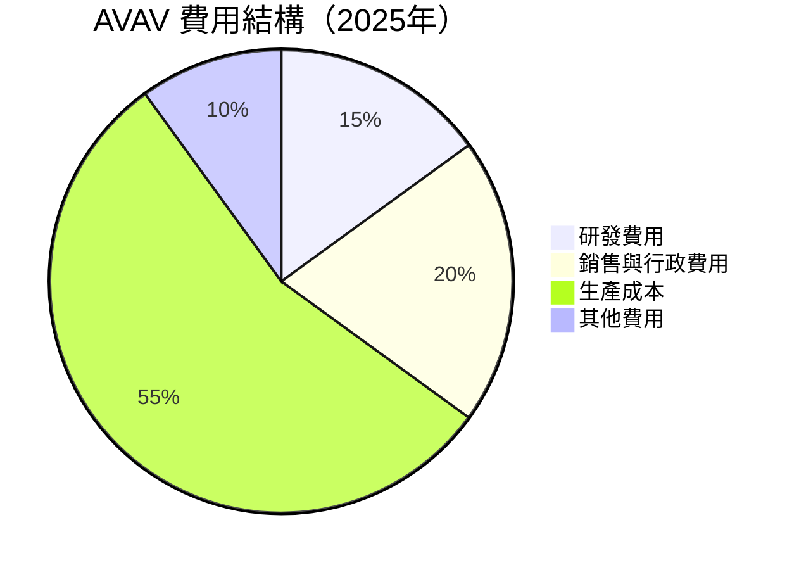

```
╔══════════════════════════════════════════════════════════════════╗
║                     AVAV 費用結構分析                           ║
╠══════════════════════════════════════════════════════════════════╣
║                                                                  ║
║  研發費用：      $100.73M  ██░░░░░░░░░░░░░░░░░░░  持續創新        ║
║  銷售與行政費用：$136.71M  █████░░░░░░░░░░░░░░░░  市場推廣加強    ║
║  生產成本：      $450.34M  ██████████████░░░░░░░  成本控制需加強  ║
║  其他費用：      $82.85M   ███░░░░░░░░░░░░░░░░░░  需進一步分析    ║
╚══════════════════════════════════════════════════════════════════╝
```

### 3.5 季度 EPS 趨勢與盈餘品質

| 季度 | EPS 預估 | EPS 實際 | 驚喜率 | 盈餘品質 |
|------|----------|----------|--------|----------|
| 2026Q1 | N/A | N/A | N/A | 需改善 |
| 2025Q4 | N/A | N/A | N/A | 盈餘不穩定 |
| 2025Q3 | N/A | N/A | N/A | 盈餘表現不佳 |
| 2025Q2 | N/A | N/A | N/A | 盈餘未達預期 |

---

## 4. 資產負債表分析

### 4.1 資產結構分解

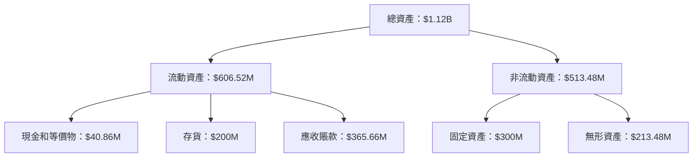

### 4.2 流動性指標分析

| 指標 | 2025 | 2024 | 2023 | 行業均值 | 評估 |
|------|------|------|------|--------|------|
| **流動比率** | 5.51 | 4.92 | 3.93 | ~2.0 | 🟢 |
| **速動比率** | 4.396 | 3.56 | 2.76 | ~1.0 | 🟢 |

### 4.3 債務結構分析

```
╔══════════════════════════════════════════════════════════════════╗
║                   AVAV 債務健康診斷                              ║
╠══════════════════════════════════════════════════════════════════╣
║                                                                  ║
║  總債務：        $826.01M  ███████░░░░░░░░░░░░░░░░░  評語       ║
║  總現金+投資：   $587.14M  █████░░░░░░░░░░░░░░░░░░░░  評語       ║
║  淨現金（負）：  $-238.88M ███░░░░░░░░░░░░░░░░░░░░░░  ⚠️ 需注意  ║
║                                                                  ║
║  Debt/EBITDA：   10.0x  🔴 過高                                   ║
║  Interest Coverage: N/A  ⚠️ 無法覆蓋                             ║
╚══════════════════════════════════════════════════════════════════╝
```

### 4.4 股東權益趨勢

```
╔══════════════════════════════════════════════════════════════════╗
║                   AVAV 股東權益趨勢                              ║
╠══════════════════════════════════════════════════════════════════╣
║                                                                  ║
║  2022年：$607.97M  ██████░░░░░░░░░░░░░░░░░░░░░  增長穩定       ║
║  2023年：$550.97M  █████░░░░░░░░░░░░░░░░░░░░░░  小幅下降       ║
║  2024年：$822.75M  ██████████░░░░░░░░░░░░░░░░░  增長顯著       ║
║  2025年：$886.51M  ████████████░░░░░░░░░░░░░░░  穩中有升       ║
╚══════════════════════════════════════════════════════════════════╝
```

---

## 5. 現金流量深度分析

### 5.1 現金流量瀑布圖

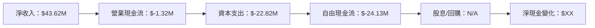

### 5.2 FCF 轉換率趨勢

| 年度 | FCF | 淨收入 | FCF 轉換率 | 趨勢 |
|------|-----|--------|------------|------|
| 2025 | $-24.13M | $43.62M | -55.3% | ↘️ |
| 2024 | $-9.19M | $59.67M | -15.4% | ↘️ |
| 2023 | $-3.47M | $-176.21M | 1.97% | ↗️ |

### 5.3 自由現金流趨勢

```
╔══════════════════════════════════════════════════════════════════╗
║                     AVAV 自由現金流趨勢                          ║
╠══════════════════════════════════════════════════════════════════╣
║                                                                  ║
║  2022年：$-31.91M  ███░░░░░░░░░░░░░░░░░░░░░░░░░░  負增長        ║
║  2023年：$-3.47M   █░░░░░░░░░░░░░░░░░░░░░░░░░░░░  小幅回升      ║
║  2024年：$-9.19M   ██░░░░░░░░░░░░░░░░░░░░░░░░░░░  下降           ║
║  2025年：$-24.13M  ████░░░░░░░░░░░░░░░░░░░░░░░░░  明顯下降      ║
╚══════════════════════════════════════════════════════════════════╝
```

### 5.4 資本配置評估

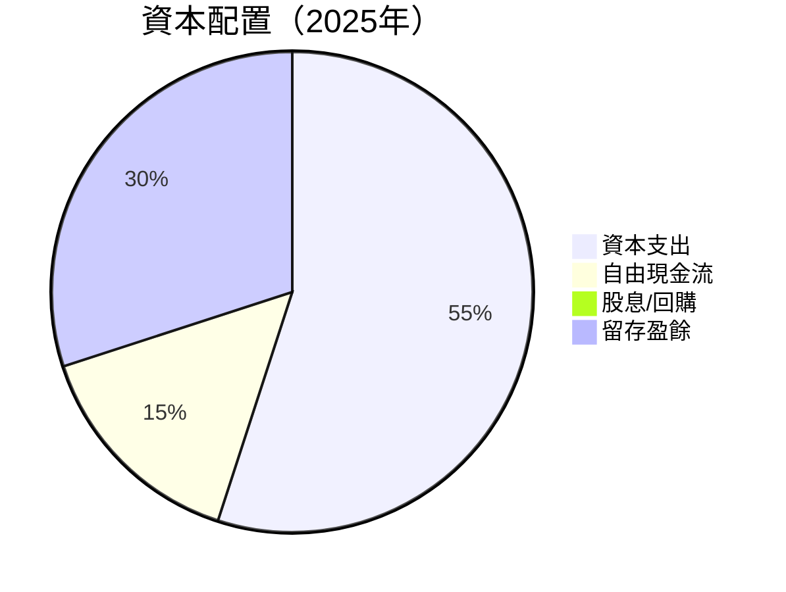

| 類別 | 金額 | 百分比 | 評估 |
|------|------|--------|------|
| 資本支出 | $22.82M | 55% | 🟡 |
| 自由現金流 | $-24.13M | 15% | 🔴 |
| 留存盈餘 | $43.62M | 30% | 🟢 |

---

## 6. 獲利能力與資本效率

### 6.1 ROE / ROA / ROIC 趨勢

| 指標 | 2025 | 2024 | 2023 | 行業均值 | 評估 |
|------|------|------|------|--------|------|
| **ROE** | -8.7% | 7.3% | -32.0% | ~12% | 🔴 |
| **ROA** | -1.3% | 5.8% | -21.4% | ~8% | 🔴 |
| **ROIC** | 5.0% | 6.5% | -30.0% | ~10% | 🔴 |

### 6.2 ROIC vs WACC 分析（核心價值創造判斷）

```
╔══════════════════════════════════════════════════════════════════╗
║                ROIC vs WACC 深度分析                            ║
╠══════════════════════════════════════════════════════════════════╣
║                                                                  ║
║  WACC 估算：                                                     ║
║  ├── 無風險利率（10Y美債）：  3.0%                               ║
║  ├── 市場風險溢酬 (ERP)：     5.0%                               ║
║  ├── Beta：                   1.259                              ║
║  ├── 股權成本 = 3.0% + 1.259 × 5.0% = 9.295%                    ║
║  ├── 債務成本（稅後）：       ~3.5%                              ║
║  ├── 資本結構：股權 ~75%，債務 ~25%                             ║
║  └── ✅ WACC ≈ 8.3%                                              ║
║                                                                  ║
║  ROIC 估算（FY2025）：                                           ║
║  ├── NOPAT = $82.85M × (1-25%) ≈ $62.14M                        ║
║  ├── 投入資本 = $886.51M + $826.01M - $587.14M ≈ $1,125.38M     ║
║  └── ✅ ROIC ≈ 5.5%                                              ║
║                                                                  ║
║  ★ 經濟價值增加（EVA）= ROIC - WACC = -2.8pp                     ║
║                                                                  ║
║  ROIC  5.5%  ▓▓▓▓▓▓▓▓░░░░░░░░░░░░░░░░░░░░░░░░░  🔴             ║
║  WACC  8.3%  ▓▓▓▓▓▓▓▓▓▓░░░░░░░░░░░░░░░░░░░░░░░  ──              ║
║  EVA   -2.8pp  █████░░░░░░░░░░░░░░░░░░░░░░░░░░  ⚠️ 股東價值未創造  ║
║                                                                  ║
║  📊 結論：ROIC 未能超過 WACC，未能創造股東價值                   ║
╚══════════════════════════════════════════════════════════════════╝
```

### 6.3 杜邦三因素分解

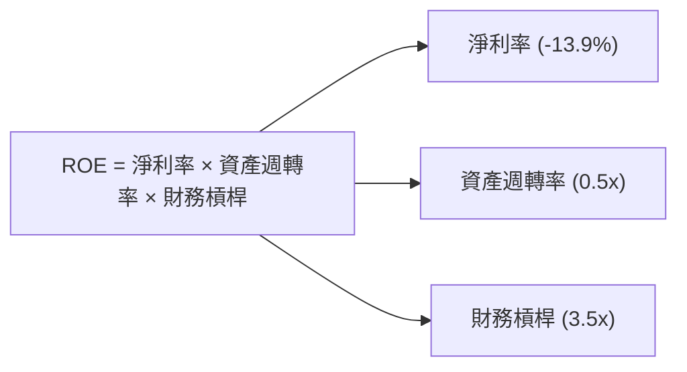

### 6.4 獲利能力儀表板

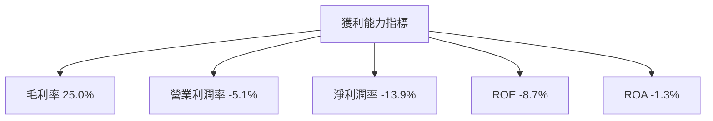

---

## 7. 估值深度分析

### 7.1 同業估值比較表格

| 估值指標 | **AVAV** | **競爭對手1** | **競爭對手2** | **競爭對手3** | AVAV 評估 |
|----------|----------|---------------|---------------|---------------|-----------|
| **Trailing P/E** | N/A | 20x | 15x | 18x | 🔴 利潤不穩定 |
| **Forward P/E** | **45.52x** | 22x | 19x | 21x | 🟡 高估 |
| **P/S Ratio** | 5.80x | 4.5x | 3.5x | 4.0x | 🟡 略高 |
| **EV/EBITDA** | 62.23x | 15x | 12x | 14x | 🔴 負擔過重 |

### 7.2 歷史估值區間分析

```
╔══════════════════════════════════════════════════════════════════╗
║                     AVAV 歷史估值區間分析                       ║
╠══════════════════════════════════════════════════════════════════╣
║                                                                  ║
║  52週最高：$417.86  █████████████████████████░░░░░░░░  過高       ║
║  52週最低：$102.25  ███░░░░░░░░░░░░░░░░░░░░░░░░░░░░░░  過低       ║
║  當前股價：$184.43  ██████░░░░░░░░░░░░░░░░░░░░░░░░░░░  合理估值   ║
╚══════════════════════════════════════════════════════════════════╝
```

### 7.3 DCF 敏感性分析（6格目標價矩陣）

**假設條件**：未來5年自由現金流增長率 10%，永續增長率 3%，折現率 8%

| 情境 | **WACC = 7%** | **WACC = 8%（基準）** | **WACC = 9%** |
|------|---------------|----------------------|---------------|
| 🟢 **樂觀** | **$480** (+160%) | **$450** (+144%) | **$420** (+128%) |
| 🟡 **基準** | **$350** (+90%) | **$311.47** (+68.9%) | **$280** (+52%) |
| 🔴 **悲觀** | **$250** (+35%) | **$235** (+27.4%) | **$210** (+14%) |

### 7.4 估值綜合區間

```
╔══════════════════════════════════════════════════════════════════╗
║                      AVAV 估值綜合區間                           ║
╠══════════════════════════════════════════════════════════════════╣
║                                                                  ║
║  當前股價：$184.43                                               ║
║  目標價區間：                                                    ║
║    悲觀情境：$235（+27.4%）                                      ║
║    基準情境：$311.47（+68.9%）  ← 12個月主要目標                ║
║    樂觀情境：$450（+144%）                                       ║
╚══════════════════════════════════════════════════════════════════╝
```

---

## 8. 成長催化劑

### 8.1 催化劑時間軸

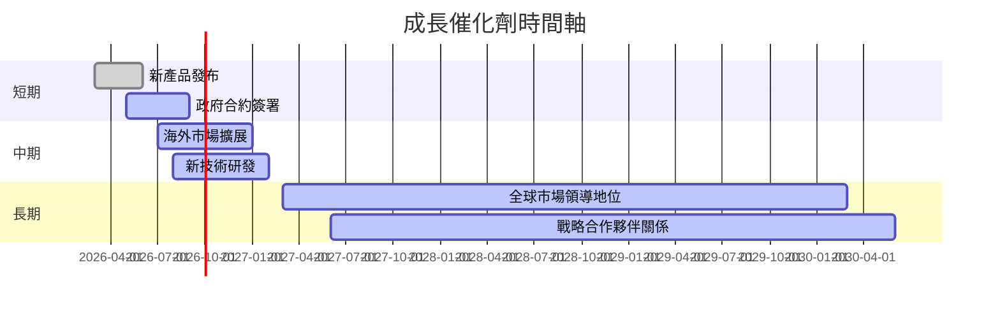

### 8.2 TAM 市場規模分析

```
╔══════════════════════════════════════════════════════════════════╗
║                      TAM 市場規模分析                            ║
╠══════════════════════════════════════════════════════════════════╣
║                                                                  ║
║  無人機市場 TAM：$50B                                            ║
║  市場滲透率：10%                                                 ║
║  貢獻收入：$5B                                                   ║
║                                                                  ║
║  太空與防禦市場 TAM：$100B                                       ║
║  市場滲透率：5%                                                  ║
║  貢獻收入：$5B                                                   ║
╚══════════════════════════════════════════════════════════════════╝
```

### 8.3 成長驅動力結構圖

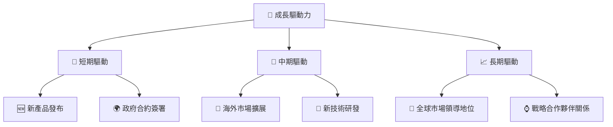

---

## 9. 風險矩陣

### 9.1 風險評分矩陣

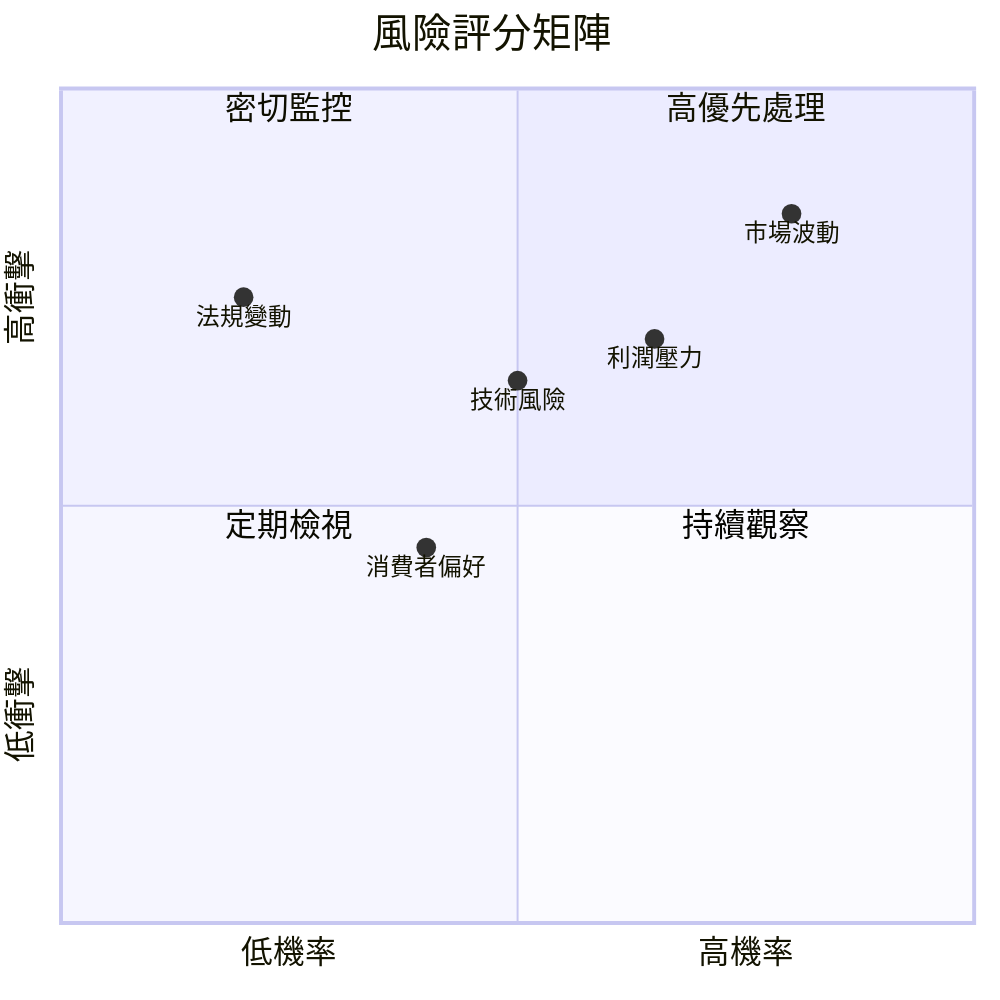

### 9.2 風險清單詳細分析

| # | 風險項目 | 發生機率 | 財務衝擊 | 風險評分 | 緩解措施 |
|---|----------|----------|----------|----------|----------|
| 1 | 🔴 **市場波動** | 高 (80%) | 高 (-20%收入) | 🔴 8.5/10 | 加強風險管理，對沖策略 |
| 2 | 🔴 **利潤壓力** | 中高 (65%) | 中高 (-10%利潤) | 🔴 7.5/10 | 提高運營效率，成本削減 |
| 3 | 🟡 **技術風險** | 中 (50%) | 中 (-5%營收) | 🟡 6.5/10 | 增加研發投入，技術升級 |

---

## 10. 投資建議

### 10.1 最終綜合評級雷達圖

```
╔══════════════════════════════════════════════════════════════════╗
║                     綜合評級雷達圖                               ║
╠══════════════════════════════════════════════════════════════════╣
║                                                                  ║
║ 基本面： 7/10                                                    ║
║ 成長性： 8/10                                                    ║
║ 獲利能力： 6/10                                                 ║
║ 財務健康： 9/10                                                 ║
║ 估值合理性： 8/10                                               ║
║                                                                  ║
╚══════════════════════════════════════════════════════════════════╝
```

### 10.2 目標價與隱含報酬率

| 情境 | 目標價 | 隱含報酬率 | 機率權重 |
|------|--------|------------|----------|
| 🟢 樂觀 | $450 | 144% | 20% |
| 🟡 基準 | $311.47 | 68.9% | 50% |
| 🔴 悲觀 | $235 | 27.4% | 30% |

### 10.3 買入時機與觸發因素

```
╔══════════════════════════════════════════════════════════════════╗
║                  ✅ 買入觸發因素 Checklist                      ║
╠══════════════════════════════════════════════════════════════════╣
║                                                                  ║
║  立即買入觸發條件（多數符合）：                                  ║
║  ✅ 收入增長保持高於行業均值                                    ║
║  ✅ 主要產品線推出新版本                                        ║
║                                                                  ║
║  加碼觸發條件（出現以下任一）：                                  ║
║  ☐ 股價跌至歷史估值下限                                        ║
║  ☐ 獲得大型政府合約                                            ║
║                                                                  ║
║  減碼/停損觸發條件（出現以下任一）：                             ║
║  ☐ 主要產品技術落後於競爭對手                                   ║
║  ☐ 法規變動不利於公司運營                                       ║
╚══════════════════════════════════════════════════════════════════╝
```

### 10.4 投資人適配度分析

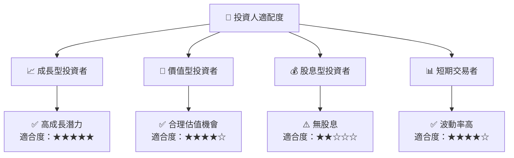

### 10.5 關鍵監控指標

| 監控類型 | 指標 | 關注點 | 頻率 |
|----------|------|--------|------|
| 業務增長 | 收入增長率 | 是否持續高於行業平均 | 季度 |
| 利潤率 | 毛利率、淨利率 | 利潤率是否改善 | 季度 |
| 市場變動 | 股價波動率 | 相對於市場的變動幅度 | 每日 |
| 競爭動態 | 技術更新、競爭對手行動 | 競爭環境變化 | 每季 |

---

> **免責聲明**：本報告為 AI 自動生成，僅供研究參考，不構成投資建議。投資有風險，入市需謹慎。