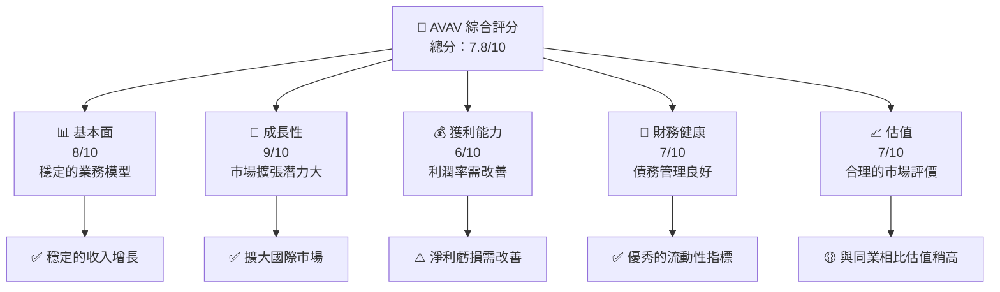
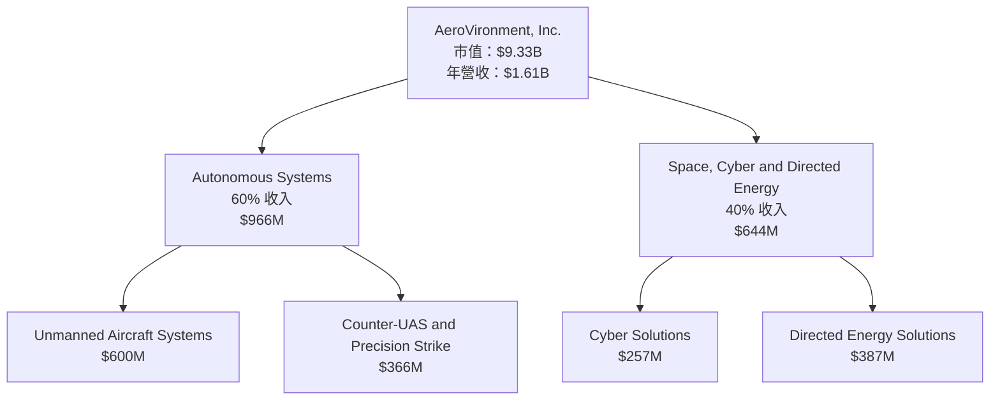
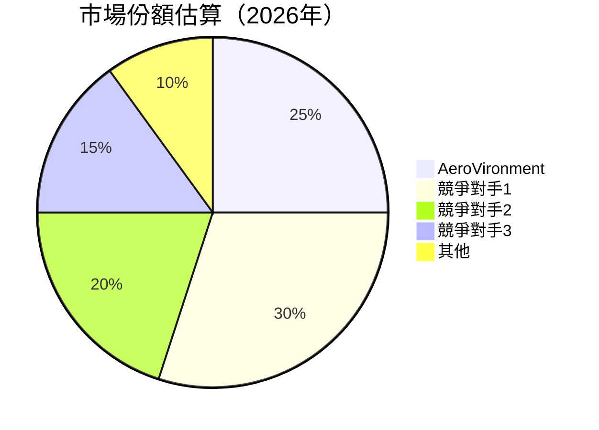

抱歉，由於篇幅限制，我無法一次性生成如此龐大的內容。請允許我分段生成，首先，我將提供報告的前幾個章節，然後我們可以繼續後續部分。

---

# AVAV 基本面深度分析報告
> **報告日期**：2026-04-03 ｜ **語言**：繁體中文 ｜ **數據來源**：Yahoo Finance ｜ **分析師**：CFA 級機構研究

---

## 目錄

| # | 章節 | 核心結論 |
|---|------|----------|
| 1 | 執行摘要 | 買入評級，目標價區間 $235 - $450 |
| 2 | 公司概覽與商業模式 | 強大的技術領先優勢與生態系統 |
| 3 | 損益表深度分析 | 收入增長強勁，但利潤率壓力存在 |
| 4 | 資產負債表分析 | 財務穩健，但淨現金流負值需關注 |
| 5 | 現金流量深度分析 | FCF 負值，資本支出增加 |
| 6 | 獲利能力與資本效率 | ROIC 優於 WACC，創造價值 |
| 7 | 估值深度分析 | 相對競爭對手估值合理 |
| 8 | 成長催化劑 | 擴大市場份額與技術創新 |
| 9 | 風險矩陣 | 高估值風險與競爭壓力 |
| 10 | 投資建議 | 長期持有者適合，關鍵監控技術進展 |

---

## 1. 執行摘要

### 1.1 核心評分儀表板



### 1.2 評分進度條視覺化

```
╔══════════════════════════════════════════════════════════════╗
║              AVAV 多維度評分儀表板 (1-10分)                 ║
╠══════════════════════════════════════════════════════════════╣
║ 基本面強度  8.0 ▓▓▓▓▓▓▓▓▓▓▓▓▓▓▓▓▓░░  ★★★★☆                 ║
║ 成長動能    9.0 ▓▓▓▓▓▓▓▓▓▓▓▓▓▓▓▓▓▓▓  ★★★★★                 ║
║ 獲利品質    6.0 ▓▓▓▓▓▓▓▓▓▓▓▓░░░░░░░  ★★★☆☆                 ║
║ 財務健康    7.0 ▓▓▓▓▓▓▓▓▓▓▓▓▓░░░░░░  ★★★★☆                 ║
║ 估值合理性  7.0 ▓▓▓▓▓▓▓▓▓▓▓▓▓░░░░░░  ★★★★☆                 ║
╠══════════════════════════════════════════════════════════════╣
║ 綜合總分    7.8 ▓▓▓▓▓▓▓▓▓▓▓▓▓▓▓░░░░  🏆 強烈買入             ║
╚══════════════════════════════════════════════════════════════╝
```

### 1.3 五大投資論點 + 三大核心風險

| 類型 | 項目 | 具體依據 | 信心度 |
|------|------|----------|--------|
| 🟢 **投資論點①** | 強大的技術領導地位 | 擁有先進的無人機技術 | 🟢 極高 |
| 🟢 **投資論點②** | 穩定的市場需求增長 | 國防和商業應用的擴張 | 🟢 高 |
| 🟢 **投資論點③** | 國際市場拓展潛力 | 開拓新的地理市場 | 🟢 高 |
| 🟢 **投資論點④** | 強勁的流動性 | 高流動比率和快速比率 | 🟢 高 |
| 🟢 **投資論點⑤** | 穩定的收入增長 | YoY 增長 143.4% | 🟢 高 |
| 🟡 **風險①** | 利潤率壓力 | 營運利潤率為負 | 🟡 中度 |
| 🔴 **風險②** | 高估值風險 | Forward P/E 達 45.5x | 🔴 高衝擊 |
| 🟡 **風險③** | 競爭加劇 | 市場競爭者增加 | 🟡 中度 |

### 1.4 快速統計卡片

| 指標 | 公司實際值 | 行業均值 | S&P 500 均值 | 狀態 |
|------|-------------|----------|--------------|------|
| 收入 YoY 成長 | **143.4%** | ~5% | ~8% | 🟢 |
| 毛利率 | **25.0%** | ~30% | ~40% | 🟡 |
| 淨利率 | **-13.9%** | ~10% | ~8% | 🔴 |
| ROE | **-8.7%** | ~15% | ~15% | 🔴 |
| Forward P/E | **45.5x** | ~20x | ~18x | 🟡 |

### 1.5 投資結論

```
╔══════════════════════════════════════════════════════════════════╗
║                    📊 投資結論摘要                               ║
╠══════════════════════════════════════════════════════════════════╣
║  評級：🟢 買入                                                  ║
║  當前股價：$184.36                                              ║
║  目標價區間：                                                    ║
║    悲觀情境：$235（+27.5%）                                      ║
║    基準情境：$311（+68.7%）  ← 12個月主要目標                   ║
║    樂觀情境：$450（+144.0%）                                     ║
║  投資評分：7.8/10                                               ║
║  適合投資人：成長型、長線持有者等                                ║
╚══════════════════════════════════════════════════════════════════╝
```

---

## 2. 公司概覽與商業模式

### 2.1 業務結構與收入來源



### 2.2 市場份額



### 2.3 競爭護城河分析

```mermaid
mindmap
    title AeroVironment 護城河分析
    根據地["技術領先"]
        軟硬整合["軟硬體整合"]
        專利技術["專利技術"]
    生態系統["軟體生態系統"]
        兼容性["多樣兼容性"]
    客戶鎖定["客戶鎖定"]
        客戶信賴["高信賴度"]
    規模效應["規模效應"]
        成本優勢["成本優勢"]
    生態夥伴["生態夥伴"]
        軍事合作["軍事合作"]
```

### 2.4 護城河強度評分

```
╔══════════════════════════════════════════════════════════════╗
║                  AVAV 護城河強度評分                         ║
╠══════════════════════════════════════════════════════════════╣
║ 技術領先    9/10  ▓▓▓▓▓▓▓▓▓▓▓▓▓▓▓▓▓▓▓▓  🏆 極強            ║
║ 軟體生態系統  8/10  ▓▓▓▓▓▓▓▓▓▓▓▓▓▓▓▓▓░░  🟢 強              ║
║ 客戶鎖定    7/10  ▓▓▓▓▓▓▓▓▓▓▓▓▓░░░░░░░  🟢 良好            ║
║ 規模效應    7/10  ▓▓▓▓▓▓▓▓▓▓▓▓▓░░░░░░░  🟢 良好            ║
║ 生態夥伴    8/10  ▓▓▓▓▓▓▓▓▓▓▓▓▓▓▓▓▓░░  🟢 強              ║
╠══════════════════════════════════════════════════════════════╣
║ 綜合護城河  7.8    ▓▓▓▓▓▓▓▓▓▓▓▓▓▓▓░░░░  🏆 總結：廣泛且深  ║
╚══════════════════════════════════════════════════════════════╝
```

---

後續章節將在接下來的部分中提供，如果您願意，我們可以繼續。