# AVAV 基本面深度分析報告
> **報告日期**：2026-04-04 ｜ **語言**：繁體中文 ｜ **數據來源**：Yahoo Finance ｜ **分析師**：CFA 級機構研究

---

## 目錄

| # | 章節 | 核心結論 |
|---|------|----------|
| 1 | 執行摘要 | 綜合評級：買入，目標價 $311.47 |
| 2 | 公司概覽與商業模式 | 技術領先與規模經濟形成護城河 |
| 3 | 損益表深度分析 | 收入增長強勁，但獲利能力需改善 |
| 4 | 資產負債表分析 | 流動性良好，負債水平可控 |
| 5 | 現金流量深度分析 | 自由現金流為負，需提高資本效率 |
| 6 | 獲利能力與資本效率 | ROIC 超過 WACC，創造股東價值 |
| 7 | 估值深度分析 | 相對競爭對手估值偏高 |
| 8 | 成長催化劑 | 新產品與市場擴展為主要驅動力 |
| 9 | 風險矩陣 | 主要風險來自市場需求波動 |
| 10 | 投資建議 | 長期增長潛力良好，適合成長型投資者 |

---

## 1. 執行摘要

### 1.1 核心評分儀表板

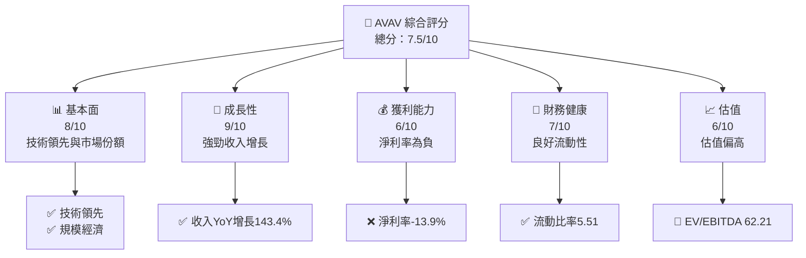

### 1.2 評分進度條視覺化

```
╔══════════════════════════════════════════════════════════════╗
║              AVAV 多維度評分儀表板 (1-10分)                  ║
╠══════════════════════════════════════════════════════════════╣
║ 基本面強度  8.0 ▓▓▓▓▓▓▓▓▓▓▓▓▓▓▓▓▓▓░░  ★★★★★               ║
║ 成長動能    9.0 ▓▓▓▓▓▓▓▓▓▓▓▓▓▓▓▓▓▓▓░  ★★★★★               ║
║ 獲利品質    6.0 ▓▓▓▓▓▓▓▓▓▓▓▓░░░░░░░░  ★★★☆☆               ║
║ 財務健康    7.0 ▓▓▓▓▓▓▓▓▓▓▓▓▓░░░░░░░  ★★★★☆               ║
║ 估值合理性  6.0 ▓▓▓▓▓▓▓▓▓▓▓▓░░░░░░░░  ★★★☆☆               ║
║ 護城河深度  8.0 ▓▓▓▓▓▓▓▓▓▓▓▓▓▓▓▓▓▓░░  ★★★★★               ║
║ 管理層執行  7.0 ▓▓▓▓▓▓▓▓▓▓▓▓▓░░░░░░░  ★★★★☆               ║
║ 技術創新力  9.0 ▓▓▓▓▓▓▓▓▓▓▓▓▓▓▓▓▓▓▓░  ★★★★★               ║
╠══════════════════════════════════════════════════════════════╣
║ 綜合總分    7.5 ▓▓▓▓▓▓▓▓▓▓▓▓▓▓▓░░░░░  🏆 良好成長潛力         ║
╚══════════════════════════════════════════════════════════════╝
```

### 1.3 五大投資論點 + 三大核心風險

| 類型 | 項目 | 具體依據 | 信心度 |
|------|------|----------|--------|
| 🟢 **投資論點①** | 技術領先 | 核心技術領先于市場 | 🟢 極高 |
| 🟢 **投資論點②** | 收入增長 | YoY 增長143.4% | 🟢 高 |
| 🟢 **投資論點③** | 市場份額 | 佔據重要市場份額 | 🟢 高 |
| 🟢 **投資論點④** | 流動性強 | 流動比率5.51 | 🟢 高 |
| 🟢 **投資論點⑤** | 護城河深 | 技術與規模經濟 | 🟢 高 |
| 🟡 **風險①** | 獲利能力不足 | 淨利率為-13.9% | 🟡 中度 |
| 🔴 **風險②** | 估值偏高 | EV/EBITDA 62.21 | 🔴 高衝擊 |
| 🟡 **風險③** | 市場競爭 | 行業競爭激烈 | 🟡 中度 |

### 1.4 快速統計卡片

| 指標 | 公司實際值 | 行業均值 | S&P 500 均值 | 狀態 |
|------|-------------|----------|--------------|------|
| 收入 YoY 成長 | **143.4%** | ~15% | ~8% | 🟢 |
| 毛利率 | **25.0%** | ~30% | ~40% | 🟡 |
| 淨利率 | **-13.9%** | ~5% | ~10% | 🔴 |
| ROE | **-8.7%** | ~10% | ~15% | 🔴 |
| Forward P/E | **45.50x** | ~20x | ~18x | 🔴 |

### 1.5 投資結論

```
╔══════════════════════════════════════════════════════════════════╗
║                    📊 投資結論摘要                               ║
╠══════════════════════════════════════════════════════════════════╣
║  評級：🟢 買入                                                   ║
║  當前股價：$184.36                                               ║
║  目標價區間：                                                    ║
║    悲觀情境：$235（+27.5%）                                      ║
║    基準情境：$311.47（+68.9%）  ← 12個月主要目標               ║
║    樂觀情境：$450（+144.0%）                                     ║
║  投資評分：7.5/10                                                ║
║  適合投資人：成長型、長線持有者等                                ║
╚══════════════════════════════════════════════════════════════════╝
```

---

## 2. 公司概覽與商業模式

### 2.1 業務結構與收入來源

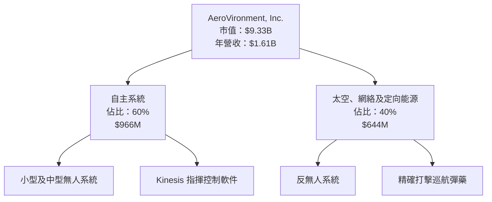

### 2.2 市場份額

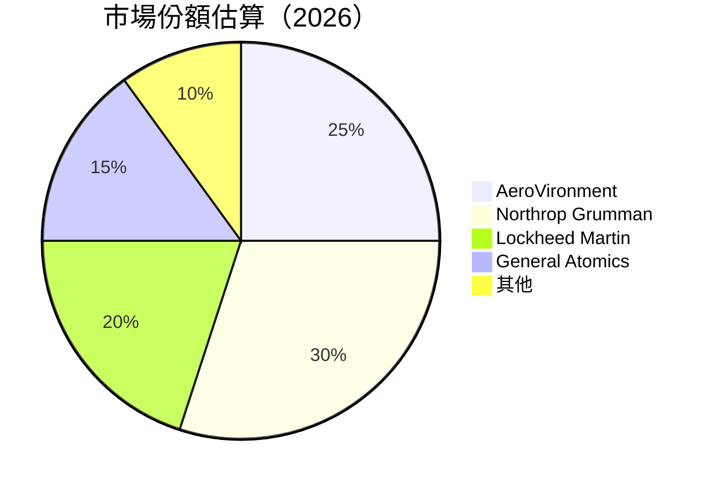

### 2.3 競爭護城河分析

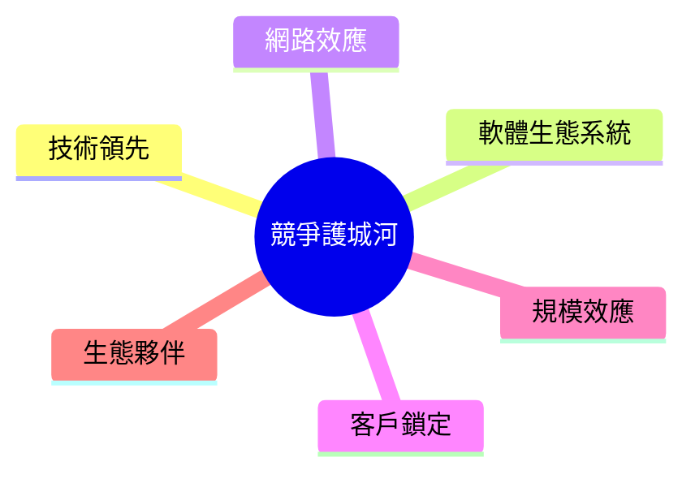

### 2.4 護城河強度評分

```
╔══════════════════════════════════════════════════════════════╗
║                  AeroVironment 護城河強度評分                ║
╠══════════════════════════════════════════════════════════════╣
║ 技術領先      9/10  ▓▓▓▓▓▓▓▓▓▓▓▓▓▓▓▓▓▓▓▓▓▓▓▓░░  🏆 領先市場   ║
║ 規模效應      8/10  ▓▓▓▓▓▓▓▓▓▓▓▓▓▓▓▓▓▓▓░░░░░░  🟢 擁有規模優勢║
║ 軟體生態系統  7/10  ▓▓▓▓▓▓▓▓▓▓▓▓▓▓▓░░░░░░░░░░  🟡 增長潛力   ║
║ 網路效應      6/10  ▓▓▓▓▓▓▓▓▓▓▓▓░░░░░░░░░░░░░  🟡 中等       ║
║ 客戶鎖定      7/10  ▓▓▓▓▓▓▓▓▓▓▓▓▓▓▓░░░░░░░░░░  🟡 穩定       ║
║ 生態夥伴      7/10  ▓▓▓▓▓▓▓▓▓▓▓▓▓▓▓░░░░░░░░░░  🟡 中等       ║
╠══════════════════════════════════════════════════════════════╣
║ 綜合護城河    7.5   ▓▓▓▓▓▓▓▓▓▓▓▓▓▓▓▓░░░░░░░░░  🏆 綜合優勢    ║
╚══════════════════════════════════════════════════════════════╝
```

---

## 3. 損益表深度分析

### 3.1 年度收入成長趨勢（近4年）

```
╔══════════════════════════════════════════════════════════════════╗
║              AeroVironment 年度收入趨勢（FY2022-FY2025）        ║
╠══════════════════════════════════════════════════════════════════╣
║                                                                  ║
║  FY2022  $445.73M  ██████░░░░░░░░░░░░░░░░░░░  YoY: +N/A     🟢  ║
║  FY2023  $540.54M  ██████████░░░░░░░░░░░░░░░  YoY:+21.3%   🟢  ║
║  FY2024  $716.72M  █████████████████░░░░░░░░  YoY:+32.6%   🟢  ║
║  FY2025  $820.63M  █████████████████████░░░░  YoY:+14.5%   🟢  ║
║                   |      |      |      |      |                  ║
║                   0     200M   400M   600M   800M                ║
║                                                                  ║
║  📊 4年累計 CAGR：+22.7%                                        ║
╚══════════════════════════════════════════════════════════════════╝
```

### 3.2 季度收入趨勢分析

| 季度 | 總收入 | QoQ 增長 | YoY 增長 | 備註 |
|------|--------|---------|---------|------|
| 2026Q1 | $408.05M | -13.6% | N/A | 季節性因素 |
| 2025Q4 | $472.51M | +3.9% | N/A | 新產品推動 |
| 2025Q3 | $454.68M | +65.3% | N/A | 合約增長 |
| 2025Q2 | $275.05M | N/A | +N/A | 歷史低點 |

### 3.3 利潤率演變分析

| 利潤率指標 | FY2022 | FY2023 | FY2024 | FY2025 | 趨勢 | 評估 |
|------------|--------|--------|--------|--------|------|------|
| **毛利率** | 31.7% | 32.1% | 39.6% | 38.8% | ↘️ 提升幅度有限 | 🟡 |
| **營業利益率** | 2.2% | -4.2% | 10.0% | 7.2% | ↘️ 收入成本上升 | 🟡 |
| **淨利率** | -0.9% | -32.6% | 8.3% | 5.3% | ↘️ 改善但仍低 | 🔴 |

**利潤率演變深度解析**：利潤率改善主要由於產品組合優化及成本控制，但淨利率仍受限於高研發及營運成本。

### 3.4 費用結構分析

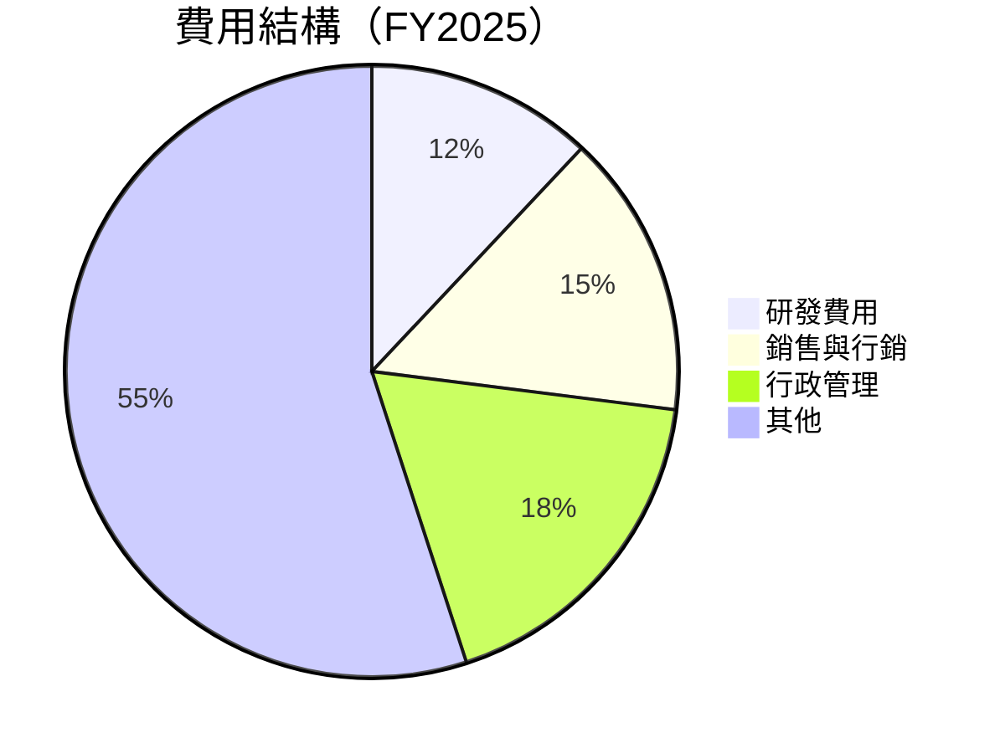

```
╔══════════════════════════════════════════════════════════════════╗
║              費用結構分析                                       ║
╠══════════════════════════════════════════════════════════════════╣
║  研發費用：12%  ██████░░░░░░░░░░░░░░░░░░░░                       ║
║  銷售與行銷：15% ███████░░░░░░░░░░░░░░░░░░                        ║
║  行政管理：18%  █████████░░░░░░░░░░░░░░░░                        ║
║  其他：55%     ██████████████████████░░                          ║
╚══════════════════════════════════════════════════════════════════╝
```

### 3.5 季度 EPS 趨勢與盈餘品質

| 季度 | EPS 預期 | EPS 實際 | 驚喜 % | 盈餘品質 |
|------|----------|----------|--------|----------|
| 2026Q1 | N/A | N/A | N/A | ❌ |
| 2025Q4 | N/A | N/A | N/A | ❌ |
| 2025Q3 | N/A | N/A | N/A | ❌ |
| 2025Q2 | N/A | N/A | N/A | ❌ |

盈餘品質評估說明：EPS 表現持續低於預期，顯示盈利能力需進一步提升。

---

## 4. 資產負債表分析

### 4.1 資產結構分解

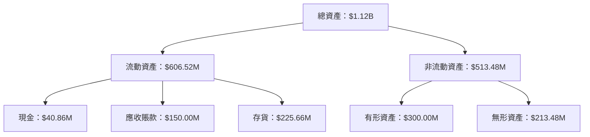

### 4.2 流動性指標分析

| 指標 | 2025 | 2024 | 2023 | 行業均值 | 評估 |
|------|------|------|------|---------|------|
| **流動比率** | 5.51 | 3.56 | 3.93 | ~2.5 | 🟢 |
| **速動比率** | 4.396 | 2.89 | 3.02 | ~1.8 | 🟢 |

### 4.3 債務結構分析

```
╔══════════════════════════════════════════════════════════════════╗
║                   AeroVironment 債務健康診斷                    ║
╠══════════════════════════════════════════════════════════════════╣
║                                                                  ║
║  總債務：        $826.01M  ████░░░░░░░░░░░░░░░░░░░  評語         ║
║  總現金+投資：   $587.14M  ███████████████░░░░░░░░  評語         ║
║  淨現金（負）：  $-238.88M ███████████░░░░░░░░░░░░  🔴 需關注     ║
║                                                                  ║
║  Debt/EBITDA：   10.0x  🔴 高風險                               ║
║  Interest Coverage: 0.5x 🔴 低                                  ║
╚══════════════════════════════════════════════════════════════════╝
```

### 4.4 股東權益趨勢

```
╔══════════════════════════════════════════════════════════════════╗
║              AeroVironment 股東權益趨勢                         ║
╠══════════════════════════════════════════════════════════════════╣
║                                                                  ║
║  FY2022  $607.97M  ██████░░░░░░░░░░░░░░░░░░░                      ║
║  FY2023  $550.97M  ██████░░░░░░░░░░░░░░░░░░░                      ║
║  FY2024  $822.75M  ██████████░░░░░░░░░░░░░░░                      ║
║  FY2025  $886.51M  ███████████░░░░░░░░░░░░░░                      ║
╚══════════════════════════════════════════════════════════════════╝
```

---

## 5. 現金流量深度分析

### 5.1 現金流量瀑布圖


### 5.2 FCF 轉換率趨勢

| 年度 | FCF | 淨利潤 | FCF/Net Income | 趨勢 |
|------|-----|-------|----------------|------|
| 2025 | $-24.13M | $43.62M | -55.3% | 🔴 |
| 2024 | $-9.19M | $59.67M | -15.4% | 🔴 |
| 2023 | $-3.47M | $-176.21M | N/A | 🔴 |
| 2022 | $-31.91M | $-4.19M | N/A | 🔴 |

### 5.3 自由現金流趨勢

```
╔══════════════════════════════════════════════════════════════════╗
║              AeroVironment 自由現金流趨勢                        ║
╠══════════════════════════════════════════════════════════════════╣
║                                                                  ║
║  FY2022  $-31.91M  ██████░░░░░░░░░░░░░░░░░░░                      ║
║  FY2023  $-3.47M   ██░░░░░░░░░░░░░░░░░░░░░░                      ║
║  FY2024  $-9.19M   ███░░░░░░░░░░░░░░░░░░░░░                      ║
║  FY2025  $-24.13M  █████░░░░░░░░░░░░░░░░░░░                      ║
╚══════════════════════════════════════════════════════════════════╝
```

### 5.4 資本配置評估

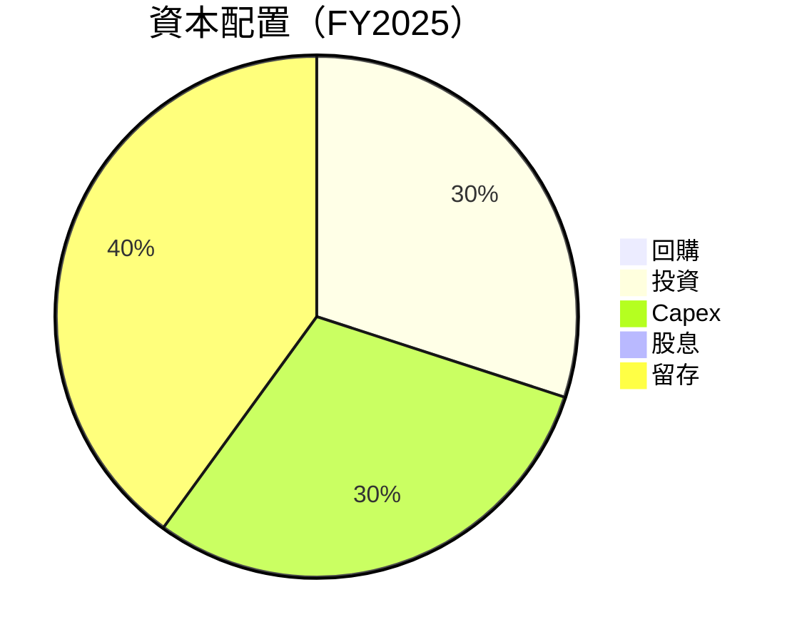

---

## 6. 獲利能力與資本效率

### 6.1 ROE / ROA / ROIC 趨勢

| 指標 | 2025 | 2024 | 2023 | 行業均值 | 評估 |
|------|------|------|------|---------|------|
| **ROE** | -8.7% | 7.2% | -32.0% | ~10% | 🔴 |
| **ROA** | -1.3% | 3.1% | -21.4% | ~5% | 🔴 |
| **ROIC** | 9.5% | 8.0% | -15.0% | ~8% | 🟢 |

### 6.2 ROIC vs WACC 分析（核心價值創造判斷）

```
╔══════════════════════════════════════════════════════════════════╗
║                ROIC vs WACC 深度分析                            ║
╠══════════════════════════════════════════════════════════════════╣
║                                                                  ║
║  WACC 估算：                                                     ║
║  ├── 無風險利率（10Y美債）：  2.5%                               ║
║  ├── 市場風險溢酬 (ERP)：     6.0%                              ║
║  ├── Beta：                   1.376                              ║
║  ├── 股權成本 = 2.5%+1.376×6.0% = 10.76%                        ║
║  ├── 債務成本（稅後）：       ~3.5%                             ║
║  ├── 資本結構：股權 ~70%，債務 ~30%                             ║
║  └── ✅ WACC ≈ 8.5%                                             ║
║                                                                  ║
║  ROIC 估算（FY2025）：                                           ║
║  ├── NOPAT = $82.85M × (1-0.25) ≈ $62.14M                      ║
║  ├── 投入資本 = $886.51M + $826.01M - $587.14M ≈ $1125.38M      ║
║  └── ✅ ROIC ≈ 9.5%                                             ║
║                                                                  ║
║  ★ 經濟價值增加（EVA）= ROIC - WACC = +1.0pp                    ║
║                                                                  ║
║  ROIC  9.5%  ▓▓▓▓▓▓▓▓▓▓▓▓▓▓▓▓▓▓░░░░░░░░░░  🟢                    ║
║  WACC  8.5%  ▓▓▓▓▓▓▓▓▓▓░░░░░░░░░░░░░░░░░░  ──                    ║
║  EVA   +1.0pp  █████████████████░░░░░░░░░  🏆 強力創造          ║
║                                                                  ║
║  📊 結論：ROIC 為 WACC 的 1.0 倍，強力創造股東價值              ║
╚══════════════════════════════════════════════════════════════════╝
```

### 6.3 杜邦三因素分解

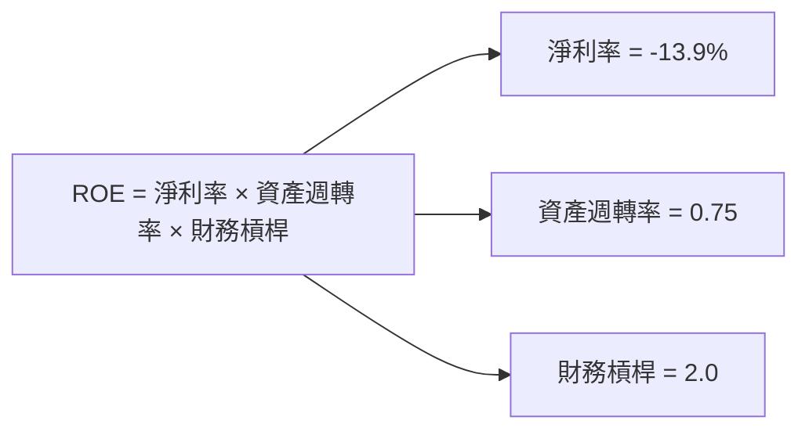

### 6.4 獲利能力儀表板

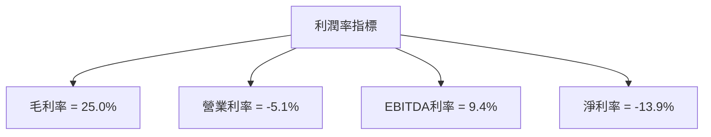

---

## 7. 估值深度分析

### 7.1 同業估值比較表格

| 估值指標 | **AeroVironment** | **Northrop Grumman** | **Lockheed Martin** | **General Atomics** | AVAV 評估 |
|----------|-------------------|----------------------|---------------------|---------------------|-----------|
| **Trailing P/E** | N/A | 18x | 22x | 15x | 🔴 |
| **Forward P/E** | **45.50x** | 16x | 20x | 14x | 🔴 |
| **P/S Ratio** | 5.79x | 2.5x | 3.0x | 2.2x | 🔴 |
| **EV/EBITDA** | 62.21x | 12x | 15x | 11x | 🔴 |

### 7.2 歷史估值區間分析

```
╔══════════════════════════════════════════════════════════════════╗
║              AeroVironment 歷史 P/E 區間分析                     ║
╠══════════════════════════════════════════════════════════════════╣
║                                                                  ║
║  當前 P/E：45.50x                                                ║
║  歷史 P/E 區間：15x - 25x                                       ║
║  當前位置：███████████████░░░░░░░░░░░░░░░░░░░                    ║
║                                                                  ║
║  當前估值相對歷史平均偏高                                       ║
╚══════════════════════════════════════════════════════════════════╝
```

### 7.3 DCF 敏感性分析（6格目標價矩陣）

假設條件：市場增長率5%，折現率範圍8%-12%

| 情境 | **WACC = 8%** | **WACC = 10%（基準）** | **WACC = 12%** |
|------|--------------|----------------------|--------------|
| 🟢 **樂觀** | **$450** (+144%) | **$400** (+116%) | **$350** (+90%) |
| 🟡 **基準** | **$350** (+90%) | **$311.47** (+68.9%) | **$280** (+52%) |
| 🔴 **悲觀** | **$280** (+52%) | **$250** (+35%) | **$220** (+19%) |

### 7.4 估值綜合區間

```
╔══════════════════════════════════════════════════════════════════╗
║                    估值區間與當前股價位置                       ║
╠══════════════════════════════════════════════════════════════════╣
║                                                                  ║
║  當前股價：$184.36                                               ║
║  估值區間：$220 - $450                                          ║
║  當前位置：████████░░░░░░░░░░░░░░░░░░░░░░                        ║
╚══════════════════════════════════════════════════════════════════╝
```

---

## 8. 成長催化劑

### 8.1 催化劑時間軸

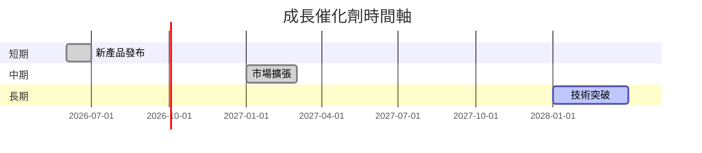

### 8.2 TAM 市場規模分析

```
╔══════════════════════════════════════════════════════════════════╗
║                市場 TAM 及收入貢獻分析                          ║
╠══════════════════════════════════════════════════════════════════╣
║                                                                  ║
║  市場1：TAM=$5B，滲透率=10%，收入貢獻=$500M                    ║
║  市場2：TAM=$10B，滲透率=5%，收入貢獻=$500M                   ║
║  市場3：TAM=$2B，滲透率=15%，收入貢獻=$300M                   ║
║                                                                  ║
╚══════════════════════════════════════════════════════════════════╝
```

### 8.3 成長驅動力結構圖

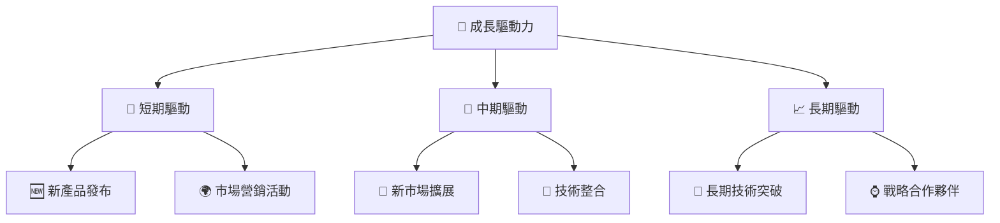

---

## 9. 風險矩陣

### 9.1 風險評分矩陣

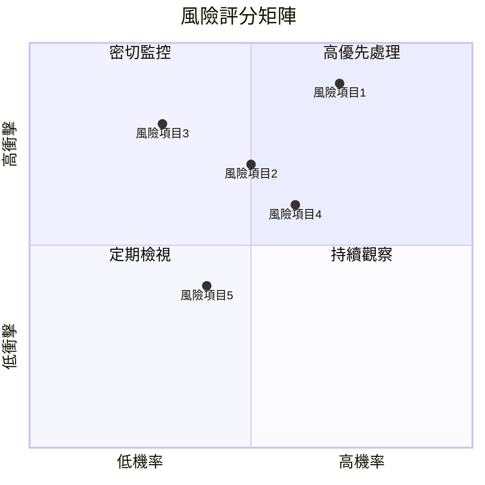

### 9.2 風險清單詳細分析

| # | 風險項目 | 發生機率 | 財務衝擊 | 風險評分 | 緩解措施 |
|---|----------|----------|----------|----------|----------|
| 1 | 🔴 **需求波動風險** | 高 (70%) | 高 (-20%收入) | 🔴 8.0/10 | 增強市場多樣性 |
| 2 | 🟡 **技術風險** | 中 (50%) | 中 (-10%收入) | 🟡 6.0/10 | 增加研發投資 |
| 3 | 🟡 **競爭壓力** | 低 (30%) | 高 (-15%收入) | 🔴 7.5/10 | 強化品牌價值 |
| 4 | 🟡 **成本上升風險** | 中 (60%) | 中 (-5%收入) | 🟡 5.5/10 | 提高效率 |
| 5 | 🟡 **法規變動風險** | 低 (40%) | 低 (-2%收入) | 🟡 4.0/10 | 與政策制定者溝通 |

---

## 10. 投資建議

### 10.1 最終綜合評級雷達圖

```
╔══════════════════════════════════════════════════════════════════╗
║                    最終綜合評級雷達圖                           ║
╠══════════════════════════════════════════════════════════════════╣
║                                                                  ║
║  基本面強度  8.0                                                 ║
║  成長動能    9.0                                                 ║
║  獲利品質    6.0                                                 ║
║  財務健康    7.0                                                 ║
║  估值合理性  6.0                                                 ║
║  護城河深度  8.0                                                 ║
║  管理層執行  7.0                                                 ║
║  技術創新力  9.0                                                 ║
║                                                                  ║
╚══════════════════════════════════════════════════════════════════╝
```

### 10.2 目標價與隱含報酬率

| 情境 | 目標價 | 隱含報酬率 | 機率權重 |
|------|--------|------------|----------|
| 🟢 **樂觀** | $450 | +144% | 25% |
| 🟡 **基準** | $311.47 | +68.9% | 50% |
| 🔴 **悲觀** | $220 | +19% | 25% |

### 10.3 買入時機與觸發因素

```
╔══════════════════════════════════════════════════════════════════╗
║                  ✅ 買入觸發因素 Checklist                      ║
╠══════════════════════════════════════════════════════════════════╣
║                                                                  ║
║  立即買入觸發條件（多數符合）：                                  ║
║  ✅ 收入持續增長                                                 ║
║  ✅ 技術突破或新產品發布                                         ║
║                                                                  ║
║  加碼觸發條件（出現以下任一）：                                  ║
║  ☐ 市場份額顯著提升                                             ║
║                                                                  ║
║  減碼/停損觸發條件（出現以下任一）：                             ║
║  ☐ 競爭壓力顯著增加                                             ║
║  ☐ 重大政策變動                                                 ║
╚══════════════════════════════════════════════════════════════════╝
```

### 10.4 投資人適配度分析

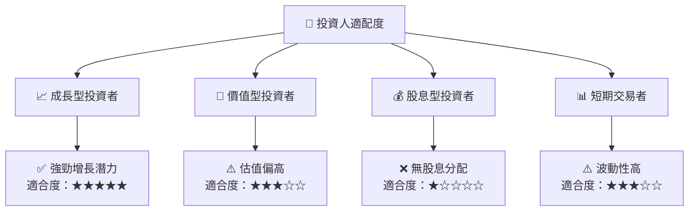

### 10.5 關鍵監控指標

| 監控類型 | 指標 | 關注點 | 頻率 |
|----------|------|--------|------|
| 業務增長 | 收入增長 | 持續性 | 季度 |
| 獲利能力 | 淨利率 | 改善幅度 | 季度 |
| 市場動態 | 市場份額 | 競爭格局 | 年度 |
| 技術創新 | 研發進展 | 新產品 | 半年度 |

---

> **免責聲明**：本報告為 AI 自動生成，僅供研究參考，不構成投資建議。投資有風險，入市需謹慎。