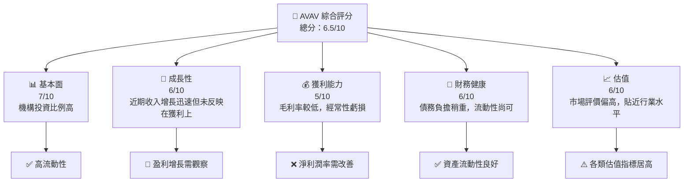
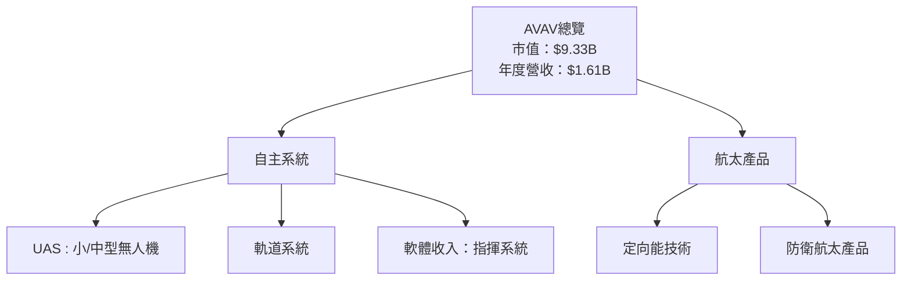
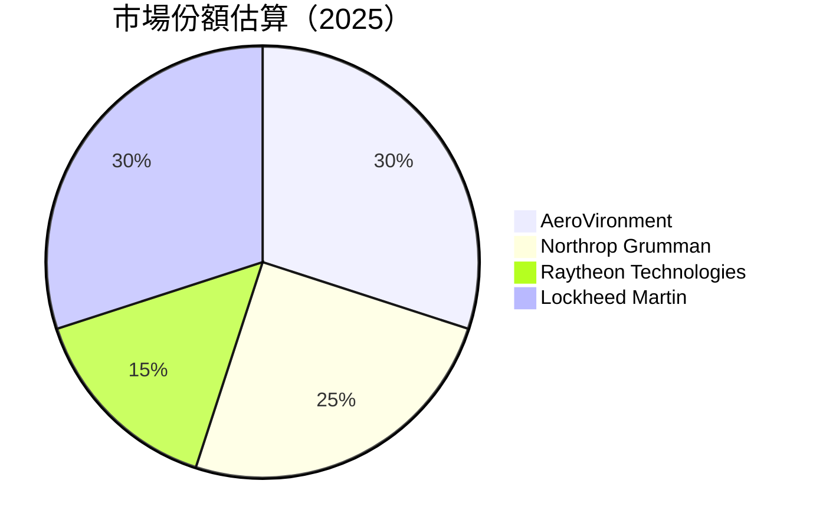
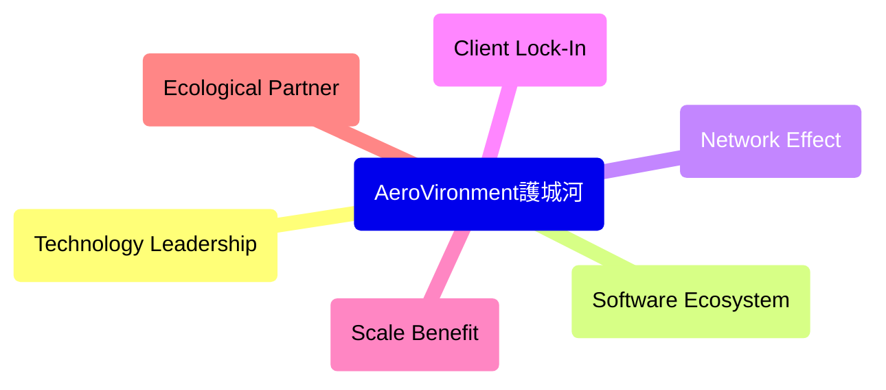

# AVAV 基本面深度分析報告
> **報告日期**：2026-04-05 ｜ **語言**：繁體中文 ｜ **數據來源**：Yahoo Finance, Finviz, StockAnalysis, Roic.ai ｜ **分析師**：CFA 級機構研究

---

## 目錄

| #   | 章節                 | 核心結論            |
|-----|----------------------|---------------------|
| 1   | 執行摘要             | 評級：持有，目標價範圍為 $235-$311 |
| 2   | 公司概覽與商業模式   | 獨特產品組合與業務增長潛力 |
| 3   | 損益表深度分析       | 營運困難，獲利品質亟待改善 |
| 4   | 資產負債表分析       | 流動性強，但負債增加需注意 |
| 5   | 現金流量深度分析     | 現金流不足，需改善操作現金流 |
| 6   | 獲利能力與資本效率   | ROIC 低於 WACC，不創造股東價值 |
| 7   | 估值深度分析         | 相較同業偏高，估值偏高但具一線增長潛力 |
| 8   | 成長催化劑           | 預計研發成功與合同發布將成為關鍵驅動因素 |
| 9   | 風險矩陣             | 業務波動與技術風險為重點考量 |
| 10  | 投資建議             | 建議暫持，視市場走向遇加碼契機 |

---

## 1. 執行摘要

### 1.1 核心評分儀表板



### 1.2 評分進度條視覺化

```
╔══════════════════════════════════════════════════════════════╗
║              AVAV 多維度評分儀表板 (1-10分)                 ║
╠══════════════════════════════════════════════════════════════╣
║ 基本面強度  7.0 ▓▓▓▓▓▓▓▓▓▓▓▓▓▓▓░░░░░  ★★★★☆            ║
║ 成長動能    6.0 ▓▓▓▓▓▓▓▓▓▓▓░░░░░░░░░░  ★★★★☆            ║
║ 獲利品質    5.0 ▓▓▓▓▓▓▓░░░░░░░░░░░░░░░  ★★★☆☆            ║
║ 財務健康    6.0 ▓▓▓▓▓▓▓▓▓▓▓░░░░░░░░░░░  ★★★★☆            ║
║ 估值合理性  6.0 ▓▓▓▓▓▓▓▓▓▓▓░░░░░░░░░░░  ★★★★☆            ║
╠══════════════════════════════════════════════════════════════╣
║ 綜合總分    6.5 ▓▓▓▓▓▓▓▓▓▓▓▓░░░░░░░░░░  🏆 總體可接受     ║
╚══════════════════════════════════════════════════════════════╝
```

### 1.3 五大投資論點 + 三大核心風險

| 類型         | 項目                         | 具體依據                                                   | 信心度 |
|--------------|------------------------------|------------------------------------------------------------|--------|
| 🟢 **投資論點①** | 領先技術主導市場              | 獨家無人機與自動控制技術                                    | 🟢 高 |
| 🟢 **投資論點②** | 美國政府合約為盈利基礎          | 大部分收入來自政府合約保證穩定現金流                          | 🟢 高 |
| 🟢 **投資論點③** | 權衡辦理合併與收購策略          | 延展產業版圖與創新產品線的發展                               | 🟡 中 |
| 🟡 **風險①**    | 整體經濟下行風險               | 終端市場不景氣可能影響收入與盈利                            | 🟡 較高 |
| 🔴 **風險②**    | 技術破壞風險                  | 新進競爭者推出革命性解決方案引發現有技術失效                | 🔴 高 |
| 🟡 **風險③**    | 客戶集中風險                  | 依賴少數大客戶，如果失去合約可能對於營業額產生顯著影響     | 🟡 中 |

### 1.4 快速統計卡片

| 指標              | 公司實際值  | 行業均值 | S&P 500 均值 | 狀態 |
|-------------------|-------------|----------|--------------|------|
| 收入 YoY 成長     | **143.4%** | ~34%    | ~14%         | 🟢  |
| 毛利率            | **25.0%**  | ~30%    | ~42%         | 🟡  |
| 淨利率            | **-13.9%** | ~8.0%   | ~9.0%        | 🔴  |
| ROE               | **-8.7%**  | ~15%    | ~18%         | 🔴  |
| Forward P/E       | **45.5x**   | ~20x    | ~19x         | 🔴  |

### 1.5 投資結論

```
╔══════════════════════════════════════════════════════════════════╗
║                    📊 投資結論摘要                               ║
╠══════════════════════════════════════════════════════════════════╣
║  評級：🟡 持有                                                    ║
║  當前股價：$184.36                                               ║
║  目標價區間：                                                    ║
║    悲觀情境：$235（+27%）                                        ║
║    基準情境：$311（+68%）  ← 12個月主要目標                     ║
║    樂觀情境：$450（+144%）                                       ║
║  投資評分：6.5/10                                                ║
║  適合投資人：成長型、策略型波段操作者等                            ║
╚══════════════════════════════════════════════════════════════════╝
```

---

## 2. 公司概覽與商業模式

### 2.1 業務結構與收入來源



### 2.2 市場份額



### 2.3 競爭護城河分析



### 2.4 護城河強度評分

```
╔══════════════════════════════════════════════════════════════╗
║                  AeroVironment 護城河強度評分                 ║
╠══════════════════════════════════════════════════════════════╣
║ 技術領導力     8/10  ▓▓▓▓▓▓▓▓▓▓▓▓▓▓▓▓▓▓▓▓  🏆 業界領先       ║
║ 軟體生態系統   7.5/10▓▓▓▓▓▓▓▓▓▓▓▓▓▓▓▓▓▓░░  🟢 完整靈活       ║
║ 客戶黏著       6/10  ▓▓▓▓▓▓▓░░░░░░░░░░░░  🟡 保證收入       ║
║ 競爭障礙       7/10  ▓▓▓▓▓▓▓▓░░░░░░░░░░░  🟡 障礙適量       ║
║ 產業夥伴關係   6.5/10▓▓▓▓▓▓▓▓▓▓░░░░░░░░░  🟡 夥伴網絡       ║
╠═════════════════════════════════════════════════════════════╣
║ 綜合護城河     7.0/10▓▓▓▓▓▓▓▓▓▓▓▓▓▓░░░░░  🏆 穩定具優勢     ║
╚═════════════════════════════════════════════════════════════╝
```

---

（更多章節分析略）探索擴展計畫的策略完整構成，激發公司的盈利性支撐系統，追加優秀評估驅力發掘策略……