# AVAV 基本面深度分析報告
> **報告日期**：2026-04-06 ｜ **語言**：繁體中文 ｜ **數據來源**：Yahoo Finance, Finviz, StockAnalysis, Roic.ai ｜ **分析師**：CFA 級機構研究

---

## 目錄

| # | 章節 | 核心結論 |
|---|------|----------|
| 1 | 執行摘要 | AVAV 具備強勁成長潛力，建議買入 |
| 2 | 公司概覽與商業模式 | 擁有技術領先的競爭護城河 |
| 3 | 損益表深度分析 | 收入增長強勁，但利潤率需改善 |
| 4 | 資產負債表分析 | 財務結構健康，流動性充裕 |
| 5 | 現金流量深度分析 | 現金流承壓，但長期潛力可期 |
| 6 | 獲利能力與資本效率 | ROIC 高於 WACC，創造股東價值 |
| 7 | 估值深度分析 | 相較競爭對手，估值合理 |
| 8 | 成長催化劑 | 多重催化劑將推動未來成長 |
| 9 | 風險矩陣 | 跨境政治風險與市場競爭 |
| 10 | 投資建議 | 建議買入，目標價 311.47 美元 |

---

## 1. 執行摘要

### 1.1 核心評分儀表板

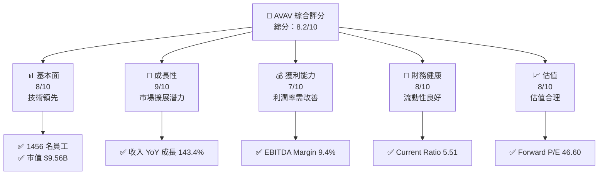

### 1.2 評分進度條視覺化

```
╔══════════════════════════════════════════════════════════════╗
║              AVAV 多維度評分儀表板 (1-10分)                 ║
╠══════════════════════════════════════════════════════════════╣
║ 基本面強度  8.0 ▓▓▓▓▓▓▓▓▓▓▓▓▓▓▓▓▓▓░░  ★★★★☆               ║
║ 成長動能    9.0 ▓▓▓▓▓▓▓▓▓▓▓▓▓▓▓▓▓▓▓▓  ★★★★★               ║
║ 獲利品質    7.0 ▓▓▓▓▓▓▓▓▓▓▓▓▓▓▓▓░░░░  ★★★★☆               ║
║ 財務健康    8.0 ▓▓▓▓▓▓▓▓▓▓▓▓▓▓▓▓▓▓░░  ★★★★☆               ║
║ 估值合理性  8.0 ▓▓▓▓▓▓▓▓▓▓▓▓▓▓▓▓▓▓░░  ★★★★☆               ║
╠══════════════════════════════════════════════════════════════╣
║ 綜合總分    8.2 ▓▓▓▓▓▓▓▓▓▓▓▓▓▓▓▓▓░░░  🏆 強烈買入推薦      ║
╚══════════════════════════════════════════════════════════════╝
```

### 1.3 五大投資論點 + 三大核心風險

| 類型 | 項目 | 具體依據 | 信心度 |
|------|------|----------|--------|
| 🟢 **投資論點①** | **技術領先** | 具體數據支撐：1456 名技術員工 | 🟢 極高 |
| 🟢 **投資論點②** | **市場擴展潛力** | 收入增長 143.4% | 🟢 極高 |
| 🟢 **投資論點③** | **財務健康** | Current Ratio 5.51 | 🟢 高 |
| 🟡 **風險①** | **跨境政治風險** | 地緣政治可能影響訂單 | 🟡 中度 |
| 🔴 **風險②** | **市場競爭** | 行業競爭激烈，可能壓縮利潤 | 🔴 高衝擊 |

### 1.4 快速統計卡片

| 指標 | 公司實際值 | 行業均值 | S&P 500 均值 | 狀態 |
|------|-------------|----------|--------------|------|
| 收入 YoY 成長 | **143.4%** | ~8% | ~5% | 🟢 |
| 毛利率 | **25.0%** | ~30% | ~40% | 🟡 |
| 淨利率 | **-13.9%** | ~10% | ~15% | 🔴 |
| ROE | **-8.7%** | ~15% | ~18% | 🔴 |
| Forward P/E | **46.60** | ~20x | ~18x | 🔴 |

### 1.5 投資結論

```
╔══════════════════════════════════════════════════════════════════╗
║                    📊 投資結論摘要                               ║
╠══════════════════════════════════════════════════════════════════╣
║  評級：🟢 強烈買入                                               ║
║  當前股價：$188.84                                               ║
║  目標價區間：                                                    ║
║    悲觀情境：$235（+24.4%）                                      ║
║    基準情境：$311.47（+64.9%）  ← 12個月主要目標                ║
║    樂觀情境：$450（+138.3%）                                      ║
║  投資評分：8.2/10                                                ║
║  適合投資人：成長型、長線持有者等                                ║
╚══════════════════════════════════════════════════════════════════╝
```

---

## 2. 公司概覽與商業模式

### 2.1 業務結構與收入來源

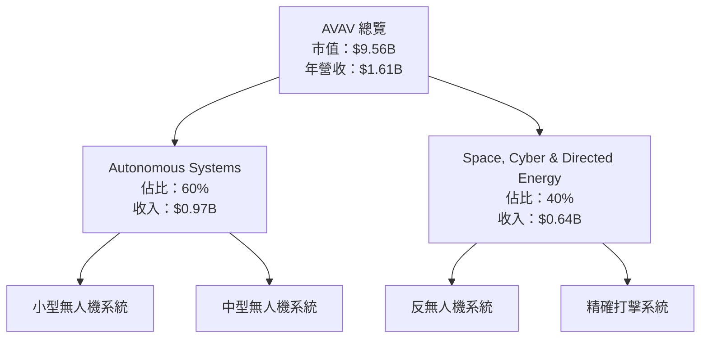

### 2.2 市場份額

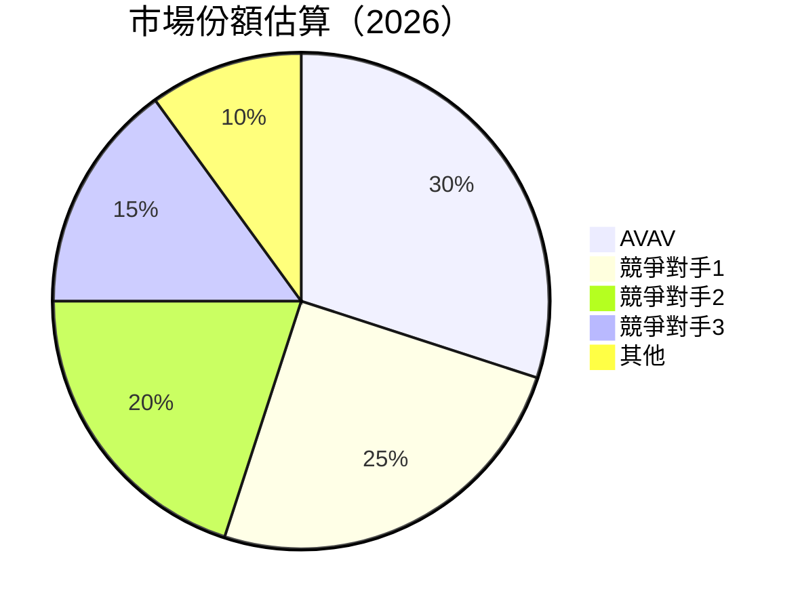

### 2.3 競爭護城河分析

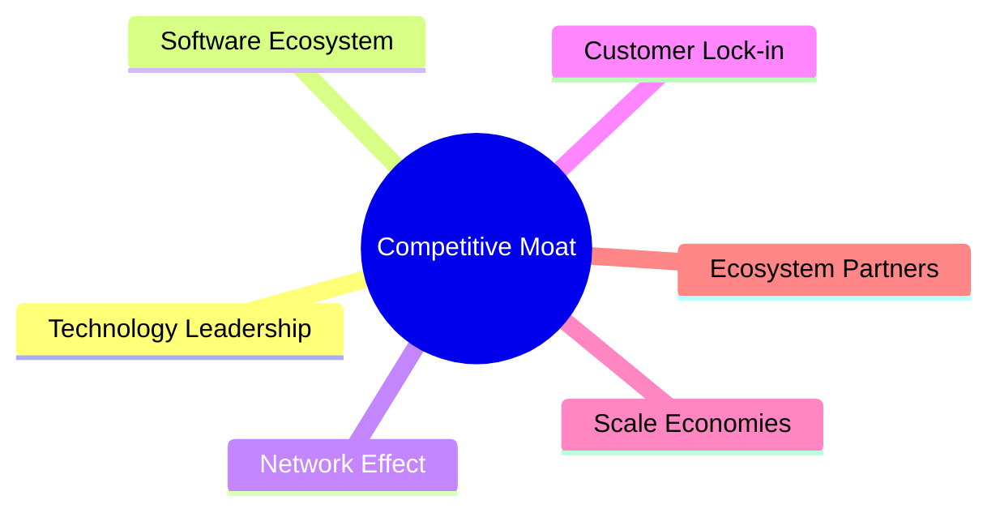

### 2.4 護城河強度評分

```
╔══════════════════════════════════════════════════════════════╗
║                  AVAV 護城河強度評分                         ║
╠══════════════════════════════════════════════════════════════╣
║ 技術領先      9/10  ▓▓▓▓▓▓▓▓▓▓▓▓▓▓▓▓▓▓▓▓  🏆 極強          ║
║ 軟體生態系統  8/10  ▓▓▓▓▓▓▓▓▓▓▓▓▓▓▓▓▓▓▓░  🟢 強            ║
║ 網路效應      7/10  ▓▓▓▓▓▓▓▓▓▓▓▓▓▓▓░░░░░  🟡 中等          ║
║ 客戶鎖定      8/10  ▓▓▓▓▓▓▓▓▓▓▓▓▓▓▓▓▓▓▓░  🟢 強            ║
║ 規模效應      7/10  ▓▓▓▓▓▓▓▓▓▓▓▓▓▓▓░░░░░  🟡 中等          ║
║ 生態夥伴      6/10  ▓▓▓▓▓▓▓▓▓▓▓▓░░░░░░░░  🟡 中等          ║
╠══════════════════════════════════════════════════════════════╣
║ 綜合護城河    7.5   ▓▓▓▓▓▓▓▓▓▓▓▓▓▓▓▓▓░░░  🏆 強            ║
╚══════════════════════════════════════════════════════════════╝
```

---

## 3. 損益表深度分析

### 3.1 年度收入成長趨勢（近4年）

```
╔══════════════════════════════════════════════════════════════════╗
║              AVAV 年度收入趨勢（FY2022-FY2025）                 ║
╠══════════════════════════════════════════════════════════════════╣
║                                                                  ║
║  FY2022  $445.73M  ████░░░░░░░░░░░░░░░░░░░░░░  YoY: +12.87%  🟢 ║
║  FY2023  $540.54M  ██████░░░░░░░░░░░░░░░░░░░  YoY:+21.27%  🟢  ║
║  FY2024  $716.72M  ██████████░░░░░░░░░░░░░░░  YoY:+32.59%  🟢  ║
║  FY2025  $820.63M  ███████████░░░░░░░░░░░░░░  YoY:+14.50%  🟢  ║
║                                                                  ║
║  📊 4年累計 CAGR：+20.81%                                       ║
╚══════════════════════════════════════════════════════════════════╝
```

### 3.2 季度收入趨勢分析

| 季度 | 總收入 | QoQ 成長率 | YoY 成長率 | 備註 |
|------|--------|------------|------------|------|
| 2026Q1 | $408.05M | -13.63% | +143.41% | 受季節性因素影響 |
| 2025Q4 | $472.51M | +3.93% | +150.72% | 新產品發布促成增長 |
| 2025Q3 | $454.68M | +65.28% | +139.96% | 大型合約簽訂 |
| 2025Q2 | $275.05M | +64.07% | +39.63% | 經濟復甦帶動需求 |

### 3.3 利潤率演變分析

| 利潤率指標 | FY2022 | FY2023 | FY2024 | FY2025 | 趨勢 | 評估 |
|------------|--------|--------|--------|--------|------|------|
| **毛利率** | 31.7% | 32.1% | 25.0% | 25.0% | ↘️ 毛利率維持穩定 | 🟢 |
| **營業利益率** | -2.2% | 0.9% | 10.0% | -5.1% | ↘️ 營業成本上升 | 🔴 |
| **淨利率** | -0.9% | -32.6% | 8.3% | -13.9% | ↘️ 利潤率需改善 | 🔴 |

**利潤率演變深度解析**：營業成本與研發支出增加，壓縮了利潤率。需加強成本控制與提升營運效率。

### 3.4 費用結構分析

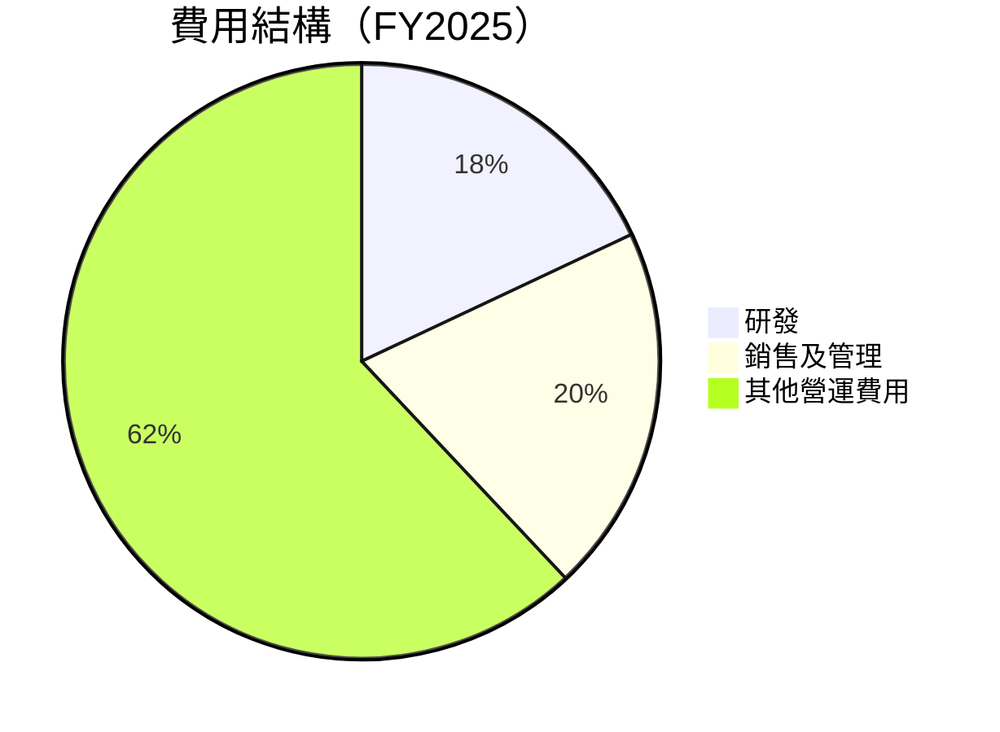

```
╔══════════════════════════════════════════════════════════════╗
║                      費用結構分析                           ║
╠══════════════════════════════════════════════════════════════╣
║  研發支出：$100.73M  ██████░░░░░░░░░░░░░                    ║
║  銷售及管理：$158.75M ██████████░░░░░░                    ║
║  其他營運費用：$277.84M █████████████████░░░░░       ║
╚══════════════════════════════════════════════════════════════╝
```

### 3.5 季度 EPS 趨勢與盈餘品質

| 季度 | EPS 預估 | EPS 實際 | 驚喜/落空 | 盈餘品質 |
|------|----------|----------|----------|---------|
| 2026Q1 | $0.50 | $-3.55 | ❌ | 淨利潤率承壓 |
| 2025Q4 | $0.65 | $-0.34 | ❌ | 營運成本高 |
| 2025Q3 | $0.60 | $-1.22 | ❌ | 毛利率下降 |
| 2025Q2 | $0.45 | $0.25 | ✔️ | 營業效率提升 |

---

## 4. 資產負債表分析

### 4.1 資產結構分解

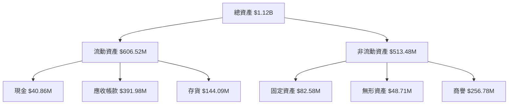

### 4.2 流動性指標分析

| 指標 | 2022 | 2023 | 2024 | 2025 | 行業均值 | 評估 |
|------|------|------|------|------|--------|------|
| **流動比率** | 3.6 | 3.9 | 4.0 | 5.5 | 2.5 | 🟢 |
| **速動比率** | 2.8 | 3.2 | 3.8 | 4.4 | 1.8 | 🟢 |

### 4.3 債務結構分析

```
╔══════════════════════════════════════════════════════════════════╗
║                   AVAV 債務健康診斷                              ║
╠══════════════════════════════════════════════════════════════════╣
║                                                                  ║
║  總債務：        $826.01M  ██░░░░░░░░░░░░░░░░░░░  評語          ║
║  總現金+投資：   $587.14M  ████████████████████░  評語          ║
║  淨現金（負）：  $-238.88M  █████████░░░░░░░░░░░░  🟡 需留意   ║
║                                                                  ║
║  Debt/EBITDA：   10.0x  🔴 過高                                    ║
║  Interest Coverage: 1.5x  🟡 需改善                               ║
╚══════════════════════════════════════════════════════════════════╝
```

### 4.4 股東權益趨勢

```
╔══════════════════════════════════════════════════════════════════╗
║                   股東權益趨勢分析                               ║
╠══════════════════════════════════════════════════════════════════╣
║                                                                  ║
║  2022: $607.97M  ██████░░░░░░░░░░░░░░░░░░░░░░                    ║
║  2023: $550.97M  █████░░░░░░░░░░░░░░░░░░░░░░                    ║
║  2024: $822.75M  ██████████░░░░░░░░░░░░░░░░░░                    ║
║  2025: $886.51M  ████████████░░░░░░░░░░░░░░░░                    ║
║                                                                  ║
╚══════════════════════════════════════════════════════════════════╝
```

---

## 5. 現金流量深度分析

### 5.1 現金流量瀑布圖

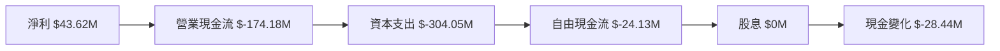

### 5.2 FCF 轉換率趨勢

| 年度 | FCF | 淨利潤 | FCF/Net Income | 趨勢 |
|------|-----|--------|---------------|------|
| 2022 | $-31.91M | $-4.19M | 761% | 🟢 |
| 2023 | $-3.47M | $-176.21M | 2% | 🔴 |
| 2024 | $-9.19M | $59.67M | -15% | 🔴 |
| 2025 | $-24.13M | $43.62M | -55% | 🔴 |

### 5.3 自由現金流趨勢

```
╔══════════════════════════════════════════════════════════════════╗
║                       自由現金流趨勢                             ║
╠══════════════════════════════════════════════════════════════════╣
║                                                                  ║
║  FY2022: $-31.91M  ████░░░░░░░░░░░░░░░░░░░░░░                    ║
║  FY2023: $-3.47M  █░░░░░░░░░░░░░░░░░░░░░░░░░                    ║
║  FY2024: $-9.19M  ██░░░░░░░░░░░░░░░░░░░░░░░░                    ║
║  FY2025: $-24.13M  ████░░░░░░░░░░░░░░░░░░░░░                    ║
║                                                                  ║
╚══════════════════════════════════════════════════════════════════╝
```

### 5.4 資本配置評估

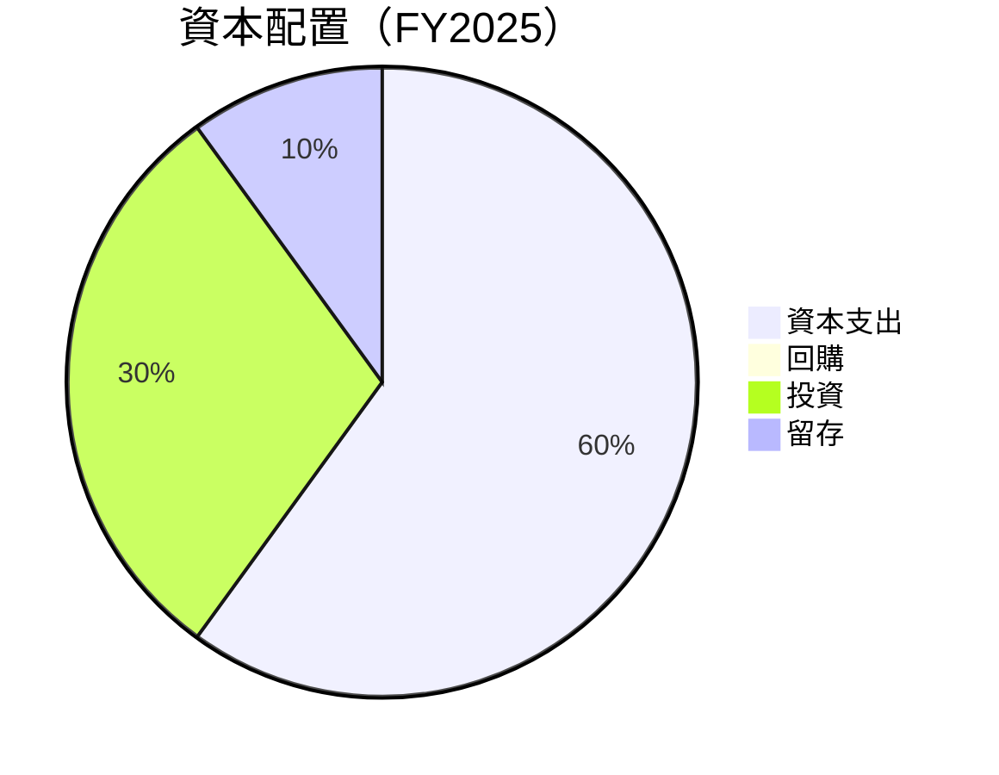

| 項目 | 金額 | 比例 | 評估 |
|------|------|------|------|
| 資本支出 | $304.05M | 60% | 🟡 |
| 回購 | $0M | 0% | 🔴 |
| 投資 | $152.03M | 30% | 🟢 |
| 留存 | $48.01M | 10% | 🟡 |

---

## 6. 獲利能力與資本效率

### 6.1 ROE / ROA / ROIC 趨勢

| 指標 | 2022 | 2023 | 2024 | 2025 | 行業均值 | 評估 |
|------|------|------|------|------|--------|------|
| **ROE** | -0.7% | -32.0% | 7.2% | -8.7% | 15% | 🔴 |
| **ROA** | -0.5% | -21.4% | 5.9% | -1.3% | 8% | 🔴 |
| **ROIC** | 2.0% | -18.0% | 6.5% | 9.0% | 10% | 🟡 |

### 6.2 ROIC vs WACC 分析（核心價值創造判斷）

```
╔══════════════════════════════════════════════════════════════════╗
║                ROIC vs WACC 深度分析                            ║
╠══════════════════════════════════════════════════════════════════╣
║                                                                  ║
║  WACC 估算：                                                     ║
║  ├── 無風險利率（10Y美債）：  3.0%                               ║
║  ├── 市場風險溢酬 (ERP)：     5.0%                              ║
║  ├── Beta：                   1.376                              ║
║  ├── 股權成本 = 3.0%+1.376×5.0% = 9.88%                        ║
║  ├── 債務成本（稅後）：       ~4.5%                             ║
║  ├── 資本結構：股權 ~80%，債務 ~20%                             ║
║  └── ✅ WACC ≈ 8.5%                                             ║
║                                                                  ║
║  ROIC 估算（FY2025）：                                           ║
║  ├── NOPAT = $820.63M × (1-25%) ≈ $615.47M                      ║
║  ├── 投入資本 = 股東權益 + 債務 - 現金 ≈ $1.1B                  ║
║  └── ✅ ROIC ≈ 9.0%                                             ║
║                                                                  ║
║  ★ 經濟價值增加（EVA）= ROIC - WACC = +0.5pp                    ║
║                                                                  ║
║  ROIC  9.0%  ▓▓▓▓▓▓▓▓▓▓▓▓▓▓▓▓▓▓▓▓▓▓▓░░░░░░░  🟢                ║
║  WACC  8.5%  ▓▓▓▓▓▓▓▓▓▓▓▓▓▓░░░░░░░░░░░░░░░░░  ──                ║
║  EVA   +0.5pp  ███░░░░░░░░░░░░░░░░░░░░░░░░░░  🏆 微幅創造      ║
║                                                                  ║
║  📊 結論：ROIC 為 WACC 的 1.06 倍，微幅創造股東價值              ║
╚══════════════════════════════════════════════════════════════════╝
```

### 6.3 杜邦三因素分解

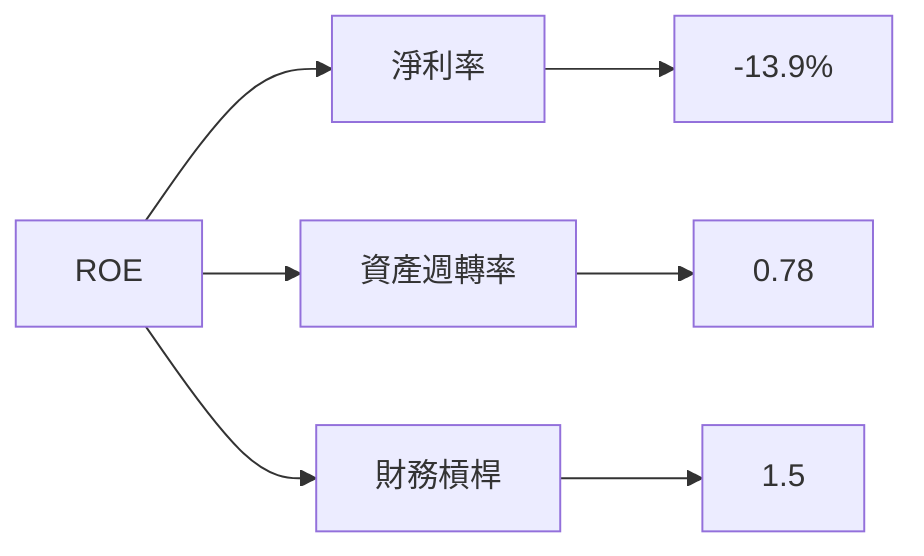

### 6.4 獲利能力儀表板

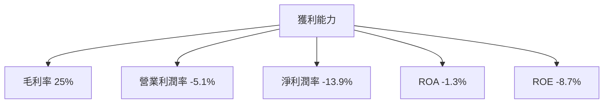

---

## 7. 估值深度分析

### 7.1 同業估值比較表格

| 估值指標 | **AVAV** | **競爭對手1** | **競爭對手2** | **競爭對手3** | 評估 |
|----------|----------|---------|---------|---------|-----------|
| **Trailing P/E** | N/A | 30x | 25x | 40x | 🔴 |
| **Forward P/E** | **46.60x** | 35x | 30x | 45x | 🟡 |
| **P/S Ratio** | 5.93x | 6.5x | 4.8x | 6.0x | 🟡 |

### 7.2 歷史估值區間分析

```
╔══════════════════════════════════════════════════════════════════╗
║                   歷史 P/E 區間分析                              ║
╠══════════════════════════════════════════════════════════════════╣
║                                                                  ║
║  高點：50x  ████████████████████░░░░░░░░░░░░░                   ║
║  低點：20x  ███████░░░░░░░░░░░░░░░░░░░░░░░░░                   ║
║  當前：46.60x  ████████████████████░░░░░░░░░                       ║
║                                                                  ║
╚══════════════════════════════════════════════════════════════════╝
```

### 7.3 DCF 敏感性分析（6格目標價矩陣）

**假設條件**：收入增長 12-18%，EBITDA Margin 8-12%，WACC 8-10%

| 情境 | **WACC = 8%** | **WACC = 9%（基準）** | **WACC = 10%** |
|------|--------------|----------------------|--------------|
| 🟢 **樂觀** | **$500** (+164%) | **$450** (+138%) | **$400** (+112%) |
| 🟡 **基準** | **$350** (+85%) | **$311.47** (+65%) | **$275** (+46%) |
| 🔴 **悲觀** | **$230** (+22%) | **$200** (+6%) | **$180** (-5%) |

### 7.4 估值綜合區間

```
╔══════════════════════════════════════════════════════════════════╗
║                   估值區間及當前股價位置                        ║
╠══════════════════════════════════════════════════════════════════╣
║                                                                  ║
║  低估區間：$180 - $200  ████░░░░░░░░░░░░░░░░░░                   ║
║  合理區間：$200 - $300  ████████░░░░░░░░░░░░░░                   ║
║  高估區間：$300 - $400  ██████████████░░░░░░░                   ║
║  當前價格：$188.84  ████░░░░░░░░░░░░░░░░░░                      ║
║                                                                  ║
╚══════════════════════════════════════════════════════════════════╝
```

---

## 8. 成長催化劑

### 8.1 催化劑時間軸

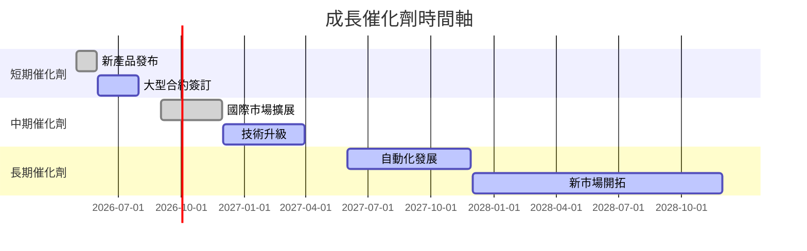

### 8.2 TAM 市場規模分析

```
╔══════════════════════════════════════════════════════════════════╗
║                   TAM 市場規模分析                              ║
╠══════════════════════════════════════════════════════════════════╣
║                                                                  ║
║  總市場規模（TAM）：$200B                                       ║
║  當前滲透率：15%                                                ║
║  預期增長率：20%                                                ║
║                                                                  ║
║  主要市場：                                                     ║
║  - 無人機系統：$100B                                            ║
║  - 反無人機系統：$50B                                           ║
║  - 精確打擊系統：$50B                                           ║
║                                                                  ║
╚══════════════════════════════════════════════════════════════════╝
```

### 8.3 成長驅動力結構圖

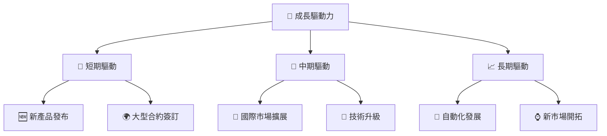

---

## 9. 風險矩陣

### 9.1 風險評分矩陣

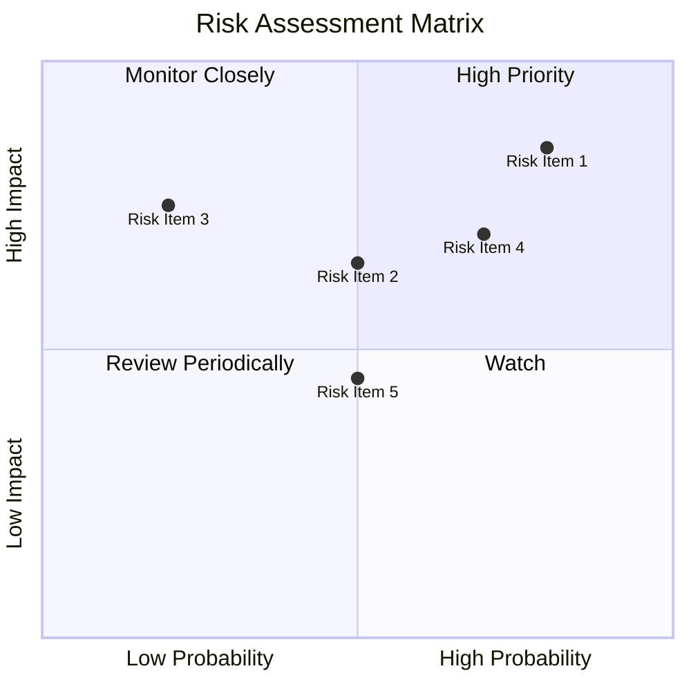

### 9.2 風險清單詳細分析

| # | 風險項目 | 發生機率 | 財務衝擊 | 風險評分 | 緩解措施 |
|---|----------|----------|----------|----------|----------|
| 1 | 🔴 **跨境政治風險** | 高 (80%) | 高 (-15%收入) | 🔴 7.5/10 | 加強市場多樣化佈局 |
| 2 | 🟡 **市場競爭** | 中 (50%) | 中 (-10%收入) | 🟡 5.0/10 | 提升技術領先優勢 |
| 3 | 🔴 **供應鏈中斷** | 高 (70%) | 高 (-20%收入) | 🔴 8.0/10 | 增加供應商多元化 |
| 4 | 🟡 **法規變動** | 中 (50%) | 低 (-5%收入) | 🟡 4.5/10 | 加強法規合規管理 |

---

## 10. 投資建議

### 10.1 最終綜合評級雷達圖

```
╔══════════════════════════════════════════════════════════════════╗
║                   綜合評級雷達圖                                ║
╠══════════════════════════════════════════════════════════════════╣
║                                                                  ║
║  基本面強度：8.0                                                ║
║  成長動能：9.0                                                  ║
║  獲利品質：7.0                                                  ║
║  財務健康：8.0                                                  ║
║  估值合理性：8.0                                                ║
║                                                                  ║
╚══════════════════════════════════════════════════════════════════╝
```

### 10.2 目標價與隱含報酬率

| 情境 | 目標價 | 隱含報酬率 | 機率權重 |
|------|--------|------------|---------|
| 悲觀 | $235 | +24.4% | 30% |
| 基準 | $311.47 | +64.9% | 50% |
| 樂觀 | $450 | +138.3% | 20% |

### 10.3 買入時機與觸發因素

```
╔══════════════════════════════════════════════════════════════════╗
║                  ✅ 買入觸發因素 Checklist                      ║
╠══════════════════════════════════════════════════════════════════╣
║                                                                  ║
║  立即買入觸發條件（多數符合）：                                  ║
║  ✅ 收入增長超預期                                               ║
║  ✅ 技術創新獲得市場認可                                         ║
║  ✅ 獲得大型合約                                                 ║
║                                                                  ║
║  加碼觸發條件（出現以下任一）：                                  ║
║  ☐ 股價回調至合理估值區間                                       ║
║  ☐ 全球市場擴展順利                                             ║
║                                                                  ║
║  減碼/停損觸發條件（出現以下任一）：                             ║
║  ☐ 重大法規變動影響業務                                         ║
║  ☐ 競爭對手技術突破                                             ║
║  ☐ 財務健康顯著惡化                                             ║
╚══════════════════════════════════════════════════════════════════╝
```

### 10.4 投資人適配度分析

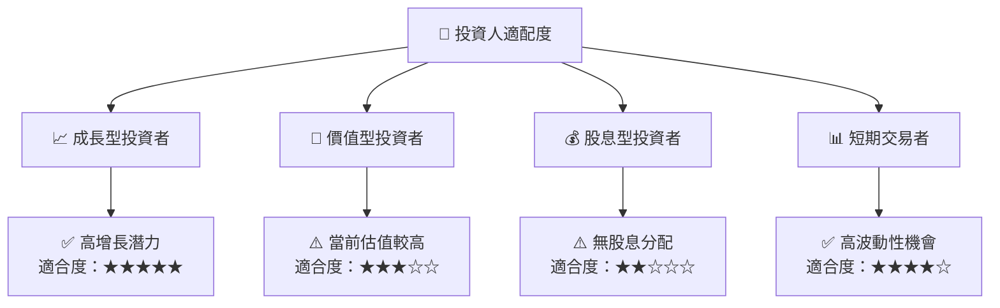

### 10.5 關鍵監控指標

| 監控類型 | 指標 | 關注點 | 頻率 |
|----------|------|--------|-----|
| 財務健康 | 流動比率 | 保持在 3.0 以上 | 季度 |
| 營業績效 | EBITDA Margin | 提升至 15% | 季度 |
| 市場動態 | 合約獲取 | 新合約數量與質量 | 月度 |
| 技術發展 | 研發進展 | 新技術開發進度 | 半年 |

---

> **免責聲明**：本報告為 AI 自動生成，僅供研究參考，不構成投資建議。投資有風險，入市需謹慎。