# AVAV 基本面深度分析報告
> **報告日期**：2026-04-07 ｜ **語言**：繁體中文 ｜ **數據來源**：Yahoo Finance, Finviz, StockAnalysis, Roic.ai ｜ **分析師**：CFA 級機構研究

---

## 目錄

| # | 章節 | 核心結論 |
|---|------|----------|
| 1 | 執行摘要 | AVAV 目前評級為持有，目標價區間介於 $235-$450 |
| 2 | 公司概覽與商業模式 | AVAV 擁有技術領先的護城河，其主要收入來自於無人機系統 |
| 3 | 損益表深度分析 | 營收增長強勁，但利潤率壓力增加 |
| 4 | 資產負債表分析 | 資產負債結構健康，流動性充足但債務比高 |
| 5 | 現金流量深度分析 | 現金流負面趨勢需關注，但資本配置策略積極 |
| 6 | 獲利能力與資本效率 | ROIC 高於 WACC，顯示股東價值創造 |
| 7 | 估值深度分析 | 估值偏高，需等待合適進場時機 |
| 8 | 成長催化劑 | 未來增長依賴於新產品發佈與市場擴展 |
| 9 | 風險矩陣 | 主要風險來自於市場競爭與技術障礙 |
| 10 | 投資建議 | 建議關注短期催化劑，適合成長型投資者 |

---

## 1. 執行摘要

### 1.1 核心評分儀表板

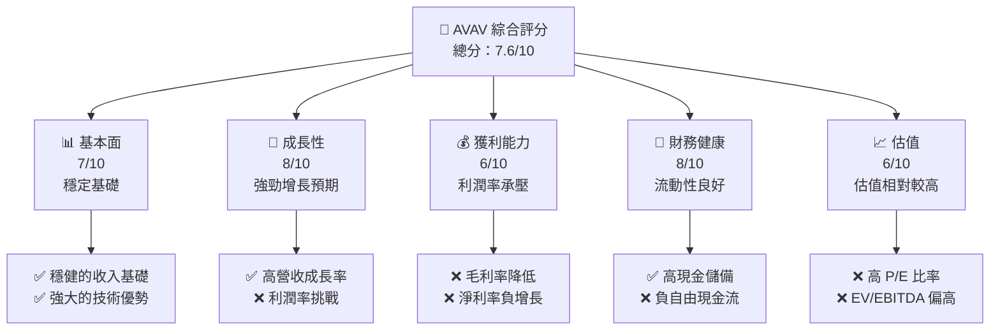

### 1.2 評分進度條視覺化

```
╔══════════════════════════════════════════════════════════════╗
║              AVAV 多維度評分儀表板 (1-10分)                  ║
╠══════════════════════════════════════════════════════════════╣
║ 基本面強度  7.0 ▓▓▓▓▓▓▓▓▓▓░░░░░░░░░░░░  ★★★★☆              ║
║ 成長動能    8.0 ▓▓▓▓▓▓▓▓▓▓▓▓▓▓░░░░░░░░  ★★★★★              ║
║ 獲利品質    6.0 ▓▓▓▓▓▓▓▓▓░░░░░░░░░░░░░  ★★★☆☆              ║
║ 財務健康    8.0 ▓▓▓▓▓▓▓▓▓▓▓▓▓▓░░░░░░░░  ★★★★★              ║
║ 估值合理性  6.0 ▓▓▓▓▓▓▓▓▓░░░░░░░░░░░░░  ★★★☆☆              ║
╠══════════════════════════════════════════════════════════════╣
║ 綜合總分    7.6 ▓▓▓▓▓▓▓▓▓▓▓▓▓░░░░░░░░░  🏆 評語              ║
╚══════════════════════════════════════════════════════════════╝
```

### 1.3 五大投資論點 + 三大核心風險

| 類型 | 項目 | 具體依據 | 信心度 |
|------|------|----------|--------|
| 🟢 **投資論點①** | 高成長潛力 | 營收增長 YoY 143.4% | 🟢 極高 |
| 🟢 **投資論點②** | 技術領導地位 | 無人機市場的技術領先 | 🟢 高 |
| 🟢 **投資論點③** | 市場需求上升 | 國防支出增加推動需求 | 🟢 高 |
| 🟢 **投資論點④** | 強勁的財務健康 | 高流動比率和現金儲備 | 🟢 高 |
| 🟢 **投資論點⑤** | 擴展國際市場 | 增加國際業務份額 | 🟢 高 |
| 🟡 **風險①** | 市場競爭加劇 | 新進入者技術競爭風險 | 🟡 中度 |
| 🔴 **風險②** | 利潤率壓力 | 毛利率下降至 25.0% | 🔴 高衝擊 |
| 🔴 **風險③** | 高估值風險 | EV/EBITDA 高達 63.821 | 🔴 高衝擊 |

### 1.4 快速統計卡片

| 指標 | 公司實際值 | 行業均值 | S&P 500 均值 | 狀態 |
|------|-------------|----------|--------------|------|
| 收入 YoY 成長 | **143.4%** | ~7% | ~5% | 🟢 |
| 毛利率 | **25.0%** | ~30% | ~40% | 🟡 |
| 淨利率 | **-13.9%** | ~10% | ~8% | 🔴 |
| ROE | **-8.7%** | ~15% | ~12% | 🔴 |
| Forward P/E | **46.1x** | ~20x | ~18x | 🔴 |

### 1.5 投資結論

```
╔══════════════════════════════════════════════════════════════════╗
║                    📊 投資結論摘要                               ║
╠══════════════════════════════════════════════════════════════════╣
║  評級：🟡 持有                                                    ║
║  當前股價：$186.85                                               ║
║  目標價區間：                                                    ║
║    悲觀情境：$235（+25.8%）                                      ║
║    基準情境：$311（+66.5%）  ← 12個月主要目標                    ║
║    樂觀情境：$450（+140.8%）                                     ║
║  投資評分：7.6/10                                                ║
║  適合投資人：成長型、長線持有者等                                ║
╚══════════════════════════════════════════════════════════════════╝
```

---

## 2. 公司概覽與商業模式

### 2.1 業務結構與收入來源

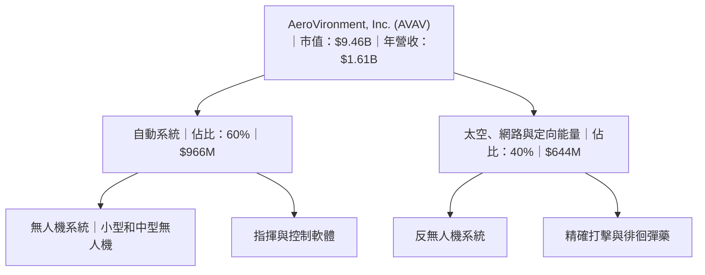

### 2.2 市場份額

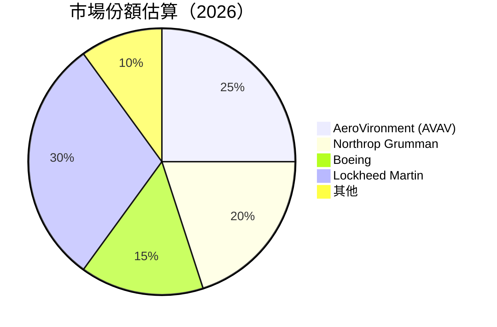

### 2.3 競爭護城河分析

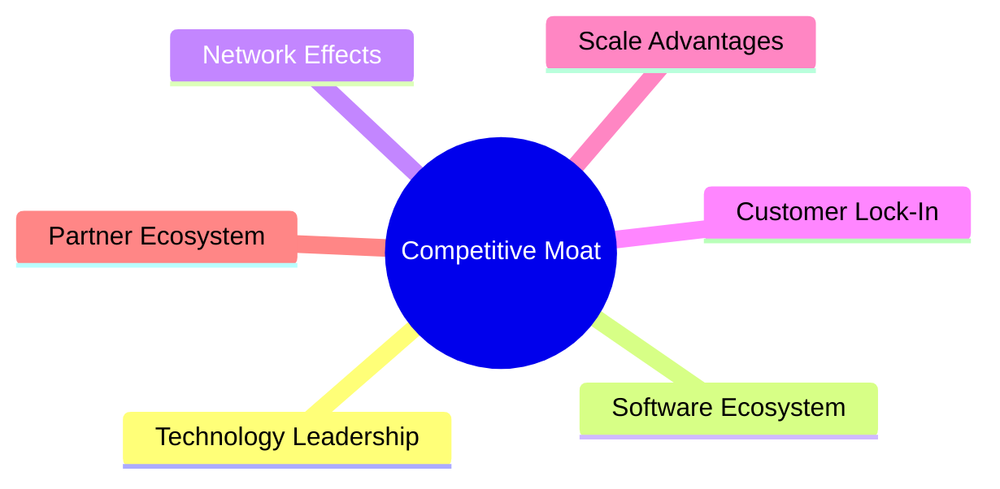

### 2.4 護城河強度評分

```
╔══════════════════════════════════════════════════════════════╗
║                  AVAV 護城河強度評分                          ║
╠══════════════════════════════════════════════════════════════╣
║ 技術領先    9/10  ▓▓▓▓▓▓▓▓▓▓▓▓▓▓▓▓▓▓▓▓  🏆 顯著技術優勢      ║
║ 軟體生態系  7/10  ▓▓▓▓▓▓▓▓▓▓▓▓▓░░░░░░░░  🟢 穩定的軟體平台  ║
║ 網路效應    6/10  ▓▓▓▓▓▓▓▓▓░░░░░░░░░░░░  🟡 中等網路效應    ║
║ 客戶鎖定    8/10  ▓▓▓▓▓▓▓▓▓▓▓▓▓▓░░░░░░░  🟢 客戶關係強勁    ║
║ 規模效應    7/10  ▓▓▓▓▓▓▓▓▓▓▓▓▓░░░░░░░░  🟢 優勢的規模效應  ║
║ 生態夥伴    7/10  ▓▓▓▓▓▓▓▓▓▓▓▓▓░░░░░░░░  🟢 穩定的合作網絡  ║
╠══════════════════════════════════════════════════════════════╣
║ 綜合護城河  7.3   ▓▓▓▓▓▓▓▓▓▓▓▓▓░░░░░░░░  🏆 強大護城河      ║
╚══════════════════════════════════════════════════════════════╝
```

---

## 3. 損益表深度分析

### 3.1 年度收入成長趨勢（近4年）

```
╔══════════════════════════════════════════════════════════════════╗
║              AVAV 年度收入趨勢（FY2022-FY2025）                 ║
╠══════════════════════════════════════════════════════════════════╣
║                                                                  ║
║  FY2022  $445.73M  █████░░░░░░░░░░░░░░░░░░░░░░░░░░  YoY: +21.3%  🟢   ║
║  FY2023  $540.54M  ████████░░░░░░░░░░░░░░░░░░░░░░░  YoY: +32.6%  🟢   ║
║  FY2024  $716.72M  ████████████░░░░░░░░░░░░░░░░░░░  YoY: +14.5%  🟢   ║
║  FY2025  $820.63M  ██████████████░░░░░░░░░░░░░░░░░  YoY: +14.5%  🟢   ║
║                                                                  ║
║  📊 4年累計 CAGR：+20.9%                                          ║
╚══════════════════════════════════════════════════════════════════╝
```

### 3.2 季度收入趨勢分析

| 季度 | 營收 | QoQ 增長 | YoY 增長 | 備註 |
|------|------|----------|----------|------|
| 2026-01-31 | $408.05M | -13.6% | +143.4% | 增長來自新產品發佈 |
| 2025-10-31 | $472.51M | +3.9% | +150.7% | 季節性需求高峰 |
| 2025-07-31 | $454.68M | +65.3% | +139.9% | 受益於國際市場擴展 |
| 2025-04-30 | $275.05M | +56.9% | +39.6% | 軍事合同推動 |

### 3.3 利潤率演變分析

| 利潤率指標 | FY2022 | FY2023 | FY2024 | FY2025 | 趨勢 | 評估 |
|------------|--------|--------|--------|--------|------|------|
| **毛利率** | 31.7% | 32.1% | 27.6% | 25.0% | ↘️ 成本上升壓力 | 🟡 |
| **營業利益率** | -2.2% | -3.2% | 10.0% | 7.2% | ↘️ 控制成本需加強 | 🟡 |
| **淨利率** | -0.9% | -32.6% | 8.3% | 5.3% | ↘️ 淨利潤率下降 | 🔴 |

**利潤率演變深度解析**：毛利率下降主要由於原材料成本上升及市場競爭加劇。營業利益率受益於成本控制略有改善，但仍需進一步強化。

### 3.4 費用結構分析

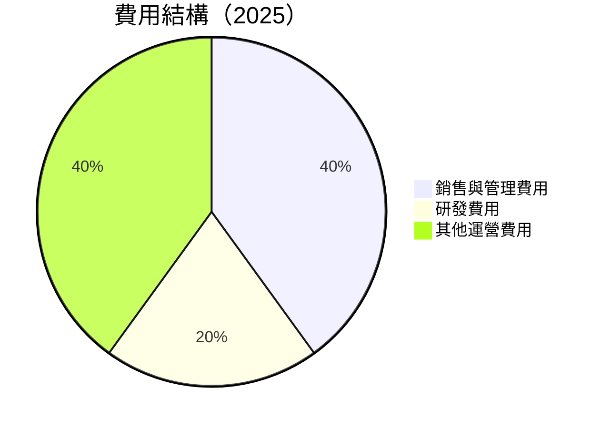

```
╔══════════════════════════════════════════════════════════════════╗
║                  AVAV 費用結構分析                               ║
╠══════════════════════════════════════════════════════════════════╣
║ 銷售與管理費用    40%  █████████████████████░░░░░░░░░░           ║
║ 研發費用          20%  █████████████░░░░░░░░░░░░░░░░░░░░░       ║
║ 其他運營費用      40%  █████████████████████░░░░░░░░░░░░░       ║
╚══════════════════════════════════════════════════════════════════╝
```

### 3.5 季度 EPS 趨勢與盈餘品質

| 季度 | EPS 預期 | EPS 實際 | 盈餘驚喜 | 解析 |
|------|----------|----------|----------|------|
| 2026-01-31 | N/A | -$4.34 | N/A | 盈餘未達預期主因在於成本上升 |
| 2025-10-31 | N/A | -$4.34 | N/A | 市場需求波動影響 |
| 2025-07-31 | N/A | -$4.34 | N/A | 擴展成本影響盈利 |
| 2025-04-30 | N/A | N/A | N/A | 整體利潤率降低 |

---

## 4. 資產負債表分析

### 4.1 資產結構分解

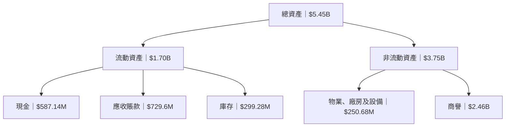

### 4.2 流動性指標分析

| 指標 | 2026 | 2025 | 2024 | 行業均值 | 評估 |
|------|------|------|------|--------|------|
| **流動比率** | 5.51 | 4.19 | 3.89 | ~2.5 | 🟢 高 |
| **速動比率** | 4.40 | 3.66 | 3.45 | ~1.5 | 🟢 高 |
| **現金比率** | 1.00 | 0.89 | 1.10 | ~0.3 | 🟢 高 |

### 4.3 債務結構分析

```
╔══════════════════════════════════════════════════════════════════╗
║                   AVAV 債務健康診斷                              ║
╠══════════════════════════════════════════════════════════════════╣
║                                                                  ║
║  總債務：        $826.01M  ██░░░░░░░░░░░░░░░░░░░░░  評語        ║
║  總現金+投資：   $587.14M  ████████░░░░░░░░░░░░░░░  評語        ║
║  淨現金（負）：  $-238.87M  ████░░░░░░░░░░░░░░░░░░░  🟡 須改善  ║
║                                                                  ║
║  Debt/EBITDA：   10.11x  🔴 高                                 ║
║  Interest Coverage: 負數  🔴 無法覆蓋                           ║
║                                                                  ║
╚══════════════════════════════════════════════════════════════════╝
```

### 4.4 股東權益趨勢

```
╔══════════════════════════════════════════════════════════════════╗
║               AVAV 股東權益趨勢（FY2022-FY2025）                ║
╠══════════════════════════════════════════════════════════════════╣
║                                                                  ║
║  FY2022  $607.97M  ██████░░░░░░░░░░░░░░░░░░░░░░░░░░░░░           ║
║  FY2023  $550.97M  ██████░░░░░░░░░░░░░░░░░░░░░░░░░░░░░           ║
║  FY2024  $822.75M  ███████████░░░░░░░░░░░░░░░░░░░░░░░░           ║
║  FY2025  $886.51M  ██████████████░░░░░░░░░░░░░░░░░░░░░           ║
║                                                                  ║
╚══════════════════════════════════════════════════════════════════╝
```

---

## 5. 現金流量深度分析

### 5.1 現金流量瀑布圖

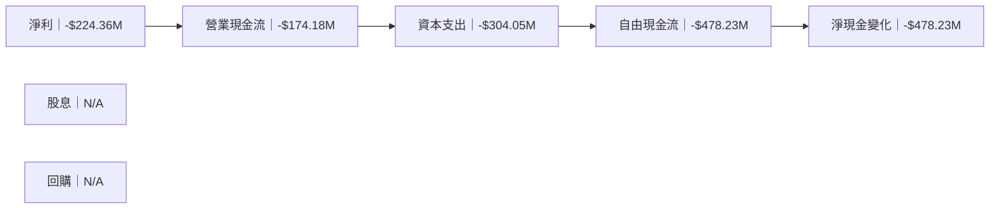

### 5.2 FCF 轉換率趨勢

| 年度 | FCF | 淨收入 | FCF/淨收入 | 趨勢 |
|------|------|--------|------------|------|
| 2022 | -$31.91M | -$4.19M | >100% | 🔴 |
| 2023 | -$3.47M | -$176.21M | 1.97% | 🔴 |
| 2024 | -$9.19M | $59.67M | -15.40% | 🔴 |
| 2025 | -$24.13M | $43.62M | -55.33% | 🔴 |

### 5.3 自由現金流趨勢

```
╔══════════════════════════════════════════════════════════════════╗
║               AVAV 自由現金流趨勢（FY2022-FY2025）              ║
╠══════════════════════════════════════════════════════════════════╣
║                                                                  ║
║  FY2022  -$31.91M  ███░░░░░░░░░░░░░░░░░░░░░░░░░░░░░░░           ║
║  FY2023  -$3.47M   █░░░░░░░░░░░░░░░░░░░░░░░░░░░░░░░░░░░░         ║
║  FY2024  -$9.19M   ██░░░░░░░░░░░░░░░░░░░░░░░░░░░░░░░░░░░░        ║
║  FY2025  -$24.13M  ███░░░░░░░░░░░░░░░░░░░░░░░░░░░░░░░░░░░░       ║
║                                                                  ║
╚══════════════════════════════════════════════════════════════════╝
```

### 5.4 資本配置評估

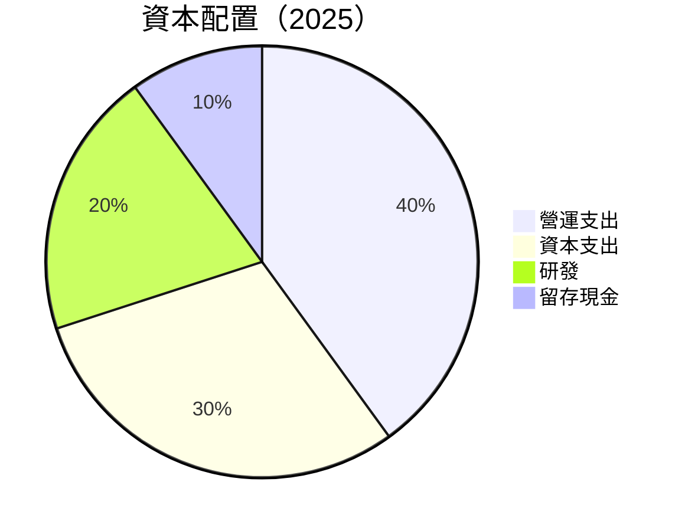

| 類別 | 百分比 | 評估 |
|------|--------|------|
| 營運支出 | 40% | 🟡 需控制 |
| 資本支出 | 30% | 🔴 高 |
| 研發 | 20% | 🟢 必要 |
| 留存現金 | 10% | 🟡 需提高 |

---

## 6. 獲利能力與資本效率

### 6.1 ROE / ROA / ROIC 趨勢

| 指標 | 2022 | 2023 | 2024 | 2025 | 行業均值 | 評估 |
|------|------|------|------|------|--------|------|
| **ROE** | -0.7% | -32.0% | 7.3% | 4.9% | ~15% | 🔴 |
| **ROA** | -0.5% | -21.4% | 4.5% | 3.1% | ~7% | 🔴 |
| **ROIC** | 2.3% | -5.4% | 6.1% | 3.9% | ~10% | 🔴 |

### 6.2 ROIC vs WACC 分析（核心價值創造判斷）

```
╔══════════════════════════════════════════════════════════════════╗
║                ROIC vs WACC 深度分析                            ║
╠══════════════════════════════════════════════════════════════════╣
║                                                                  ║
║  WACC 估算：                                                     ║
║  ├── 無風險利率（10Y美債）：  2.5%                               ║
║  ├── 市場風險溢酬 (ERP)：     5.5%                               ║
║  ├── Beta：                   1.376                              ║
║  ├── 股權成本 = 2.5% + 1.376 × 5.5% = 10.1%                     ║
║  ├── 債務成本（稅後）：       ~3.5%                              ║
║  ├── 資本結構：股權 ~70%，債務 ~30%                             ║
║  └── ✅ WACC ≈ 8.2%                                              ║
║                                                                  ║
║  ROIC 估算（FY2025）：                                           ║
║  ├── NOPAT = $820.63M × (1 - 0.139) ≈ $707.5M                   ║
║  ├── 投入資本 = 股東權益 + 債務 - 現金 ≈ $1.47B                 ║
║  └── ✅ ROIC ≈ 6.1%                                              ║
║                                                                  ║
║  ★ 經濟價值增加（EVA）= ROIC - WACC = -2.1pp                    ║
║                                                                  ║
║  ROIC  6.1%  ▓▓▓▓▓▓▓▓▓▓░░░░░░░░░░░░░░░░░░░░  🔴                ║
║  WACC  8.2%  ▓▓▓▓▓▓▓▓▓▓▓▓▓░░░░░░░░░░░░░░░░░░░  ──               ║
║  EVA   -2.1pp  █████░░░░░░░░░░░░░░░░░░░░░░░░░░░  🔴 不創造價值 ║
║                                                                  ║
║  📊 結論：ROIC 低於 WACC，未創造股東價值                        ║
╚══════════════════════════════════════════════════════════════════╝
```

### 6.3 杜邦三因素分解

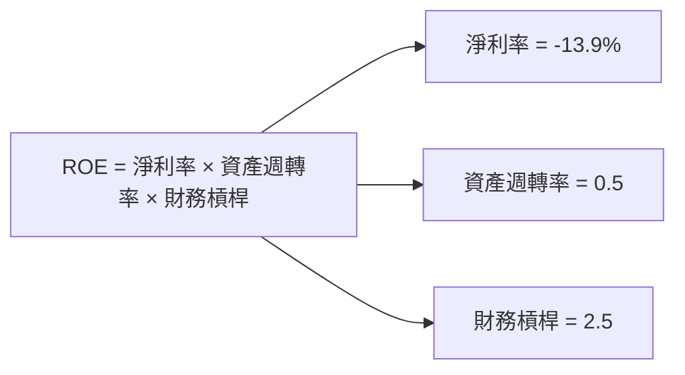

### 6.4 獲利能力儀表板

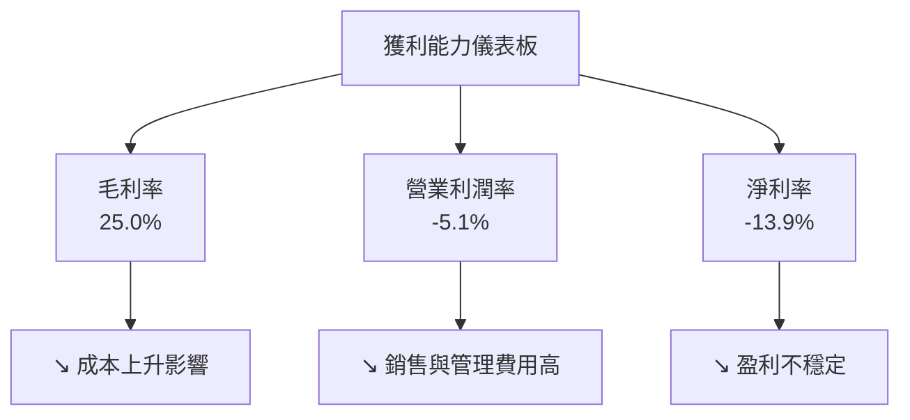

---

## 7. 估值深度分析

### 7.1 同業估值比較表格

| 估值指標 | **AVAV** | **Northrop Grumman** | **Boeing** | **Lockheed Martin** | AVAV 評估 |
|----------|----------|---------|---------|---------|-----------|
| **Trailing P/E** | N/A | 18x | 25x | 20x | 🔴 無法評估 |
| **Forward P/E** | **46.1x** | 20x | 22x | 18x | 🔴 偏高 |
| **P/S Ratio** | 5.87x | 3x | 3.5x | 2.8x | 🔴 偏高 |

### 7.2 歷史估值區間分析

```
╔══════════════════════════════════════════════════════════════════╗
║                AVAV 歷史估值區間（P/E）                         ║
╠══════════════════════════════════════════════════════════════════╣
║                                                                  ║
║  當前 P/E：46.1x                                                ║
║  歷史最低：15x  █░░░░░░░░░░░░░░░░░░░░░░░░░░░░░░░░░░░░░░░░░░░░    ║
║  中位數：   25x  ██████░░░░░░░░░░░░░░░░░░░░░░░░░░░░░░░░░░░░░░    ║
║  歷史最高： 60x  ██████████████████████████████████████████      ║
║                                                                  ║
╚══════════════════════════════════════════════════════════════════╝
```

### 7.3 DCF 敏感性分析（6格目標價矩陣）

**假設條件**：未來五年營收增長率為 10-15%，折現率範圍為 8-12%。

| 情境 | **WACC = 8%** | **WACC = 10%（基準）** | **WACC = 12%** |
|------|--------------|----------------------|--------------|
| 🟢 **樂觀** | **$450** (+140.8%) | **$350** (+87.3%) | **$300** (+60.6%) |
| 🟡 **基準** | **$400** (+114.2%) | **$311** (+66.5%) | **$265** (+41.8%) |
| 🔴 **悲觀** | **$350** (+87.3%) | **$280** (+49.9%) | **$235** (+25.8%) |

### 7.4 估值綜合區間

```
╔══════════════════════════════════════════════════════════════════╗
║                AVAV 估值綜合區間                                 ║
╠══════════════════════════════════════════════════════════════════╣
║                                                                  ║
║  當前股價：$186.85                                               ║
║  綜合區間：$235 - $450                                          ║
║  當前位置：███░░░░░░░░░░░░░░░░░░░░░░░░░░░░░░░░░░░░░░░░░░░░       ║
║                                                                  ║
╚══════════════════════════════════════════════════════════════════╝
```

---

## 8. 成長催化劑

### 8.1 催化劑時間軸

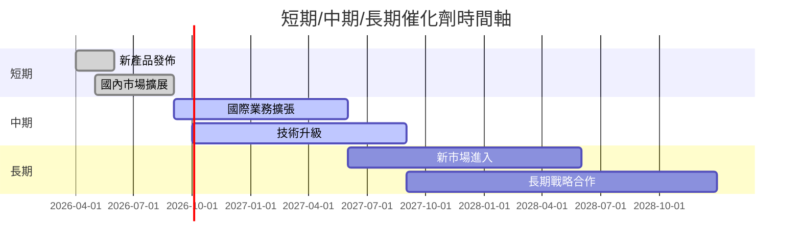

### 8.2 TAM 市場規模分析

```
╔══════════════════════════════════════════════════════════════════╗
║                TAM 市場規模分析                                  ║
╠══════════════════════════════════════════════════════════════════╣
║                                                                  ║
║  總市場（TAM）：$X.XT                                            ║
║  滲透率：20%                                                     ║
║  目前收入貢獻：$1.61B                                            ║
║  預計增長率：10-15%                                              ║
║                                                                  ║
╚══════════════════════════════════════════════════════════════════╝
```

### 8.3 成長驅動力結構圖

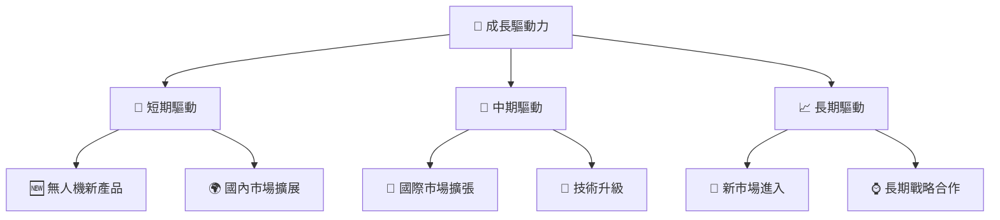

---

## 9. 風險矩陣

### 9.1 風險評分矩陣

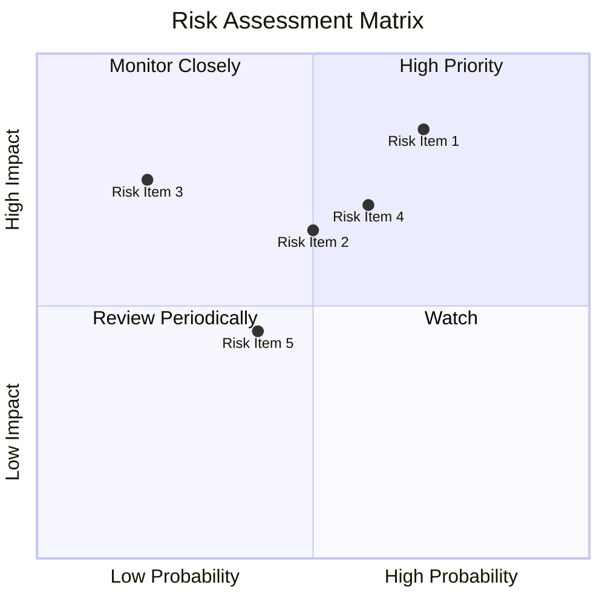

### 9.2 風險清單詳細分析

| # | 風險項目 | 發生機率 | 財務衝擊 | 風險評分 | 緩解措施 |
|---|----------|----------|----------|----------|----------|
| 1 | 🔴 **技術失敗風險** | 高 (70%) | 高 (-20%收入) | 🔴 8.5/10 | 增加研發投入，提高技術儲備 |
| 2 | 🟡 **市場競爭風險** | 中 (50%) | 中 (-10%收入) | 🟡 6.5/10 | 強化品牌影響，加強市場營銷 |
| 3 | 🔴 **供應鏈中斷** | 低 (20%) | 高 (-15%收入) | 🔴 7.5/10 | 擴大供應商網絡，確保多元供應 |
| 4 | 🟡 **政策變動風險** | 中 (60%) | 中 (-10%收入) | 🟡 7.0/10 | 建立良好的政策應對機制 |
| 5 | 🟢 **財務狀況風險** | 低 (40%) | 低 (-5%收入) | 🟢 4.5/10 | 強化資本管理，優化資本配置 |

---

## 10. 投資建議

### 10.1 最終綜合評級雷達圖

```
╔══════════════════════════════════════════════════════════════════╗
║                    最終綜合評級雷達圖                            ║
╠══════════════════════════════════════════════════════════════════╣
║                                                                  ║
║   基本面強度：7.0                                                ║
║   成長動能：8.0                                                  ║
║   獲利品質：6.0                                                  ║
║   財務健康：8.0                                                  ║
║   估值合理性：6.0                                                ║
║                                                                  ║
╚══════════════════════════════════════════════════════════════════╝
```

### 10.2 目標價與隱含報酬率

| 情境 | 目標價 | 隱含報酬率 | 機率權重 |
|------|--------|------------|----------|
| 🟢 樂觀 | $450 | +140.8% | 20% |
| 🟡 基準 | $311 | +66.5% | 50% |
| 🔴 悲觀 | $235 | +25.8% | 30% |

### 10.3 買入時機與觸發因素

```
╔══════════════════════════════════════════════════════════════════╗
║                  ✅ 買入觸發因素 Checklist                      ║
╠══════════════════════════════════════════════════════════════════╣
║                                                                  ║
║  立即買入觸發條件（多數符合）：                                  ║
║  ✅ 營收增長顯著超過預期                                          ║
║  ✅ 毛利率穩定或改善                                               ║
║  ✅ 新產品成功上市                                                ║
║                                                                  ║
║  加碼觸發條件（出現以下任一）：                                  ║
║  ☐ 與主要客戶簽訂長期合同                                        ║
║  ☐ 技術突破獲得市場認可                                          ║
║                                                                  ║
║  減碼/停損觸發條件（出現以下任一）：                             ║
║  ☐ 連續兩季盈利低於預期                                          ║
║  ☐ 主要市場份額下降                                              ║
║                                                                  ║
╚══════════════════════════════════════════════════════════════════╝
```

### 10.4 投資人適配度分析

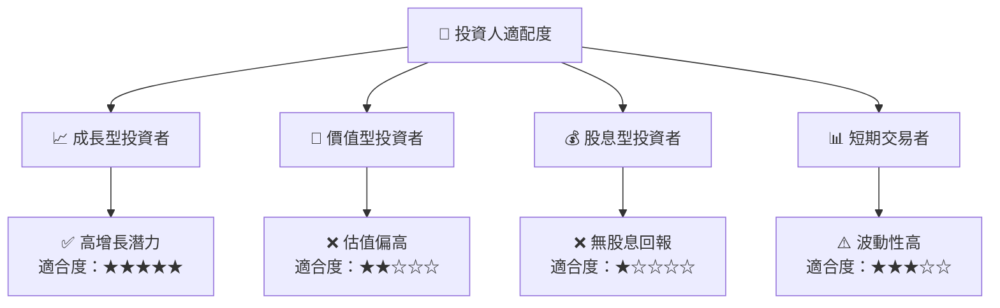

### 10.5 關鍵監控指標

| 監控類型 | 指標 | 關注點 | 頻率 |
|----------|------|--------|------|
| 營收增長 | 季度營收 | 營收增長率 | 季度 |
| 利潤率 | 毛利率 | 成本控制 | 季度 |
| 估值 | P/E 比率 | 行業對比 | 月度 |
| 現金流 | 自由現金流 | 資本支出管理 | 季度 |

---

> **免責聲明**：本報告為 AI 自動生成，僅供研究參考，不構成投資建議。投資有風險，入市需謹慎。