# AVAV 基本面深度分析報告
> **報告日期**：2026-04-10 ｜ **語言**：繁體中文 ｜ **數據來源**：Yahoo Finance, Finviz, StockAnalysis, Roic.ai ｜ **分析師**：CFA 級機構研究

---

## 目錄

| # | 章節 | 核心結論 |
|---|------|----------|
| 1 | 執行摘要 | 強烈買入，目標價區間 $235 - $450 |
| 2 | 公司概覽與商業模式 | 擁有強大競爭護城河，尤其在技術領先與客戶鎖定面 |
| 3 | 損益表深度分析 | 收入增長強勁，但需改善獲利能力 |
| 4 | 資產負債表分析 | 流動性健康，但債務管理需注意 |
| 5 | 現金流量深度分析 | 現金流挑戰顯著，高資本開支拖累自由現金流 |
| 6 | 獲利能力與資本效率 | ROIC 低於 WACC，需提升資本效率 |
| 7 | 估值深度分析 | 估值具吸引力，較競爭對手具優勢 |
| 8 | 成長催化劑 | 市場擴張與技術創新為主要動能 |
| 9 | 風險矩陣 | 主要風險來自市場波動與技術失敗 |
| 10 | 投資建議 | 建議成長型投資者增持，價值型投資者謹慎考慮 |

---

## 1. 執行摘要

### 1.1 核心評分儀表板

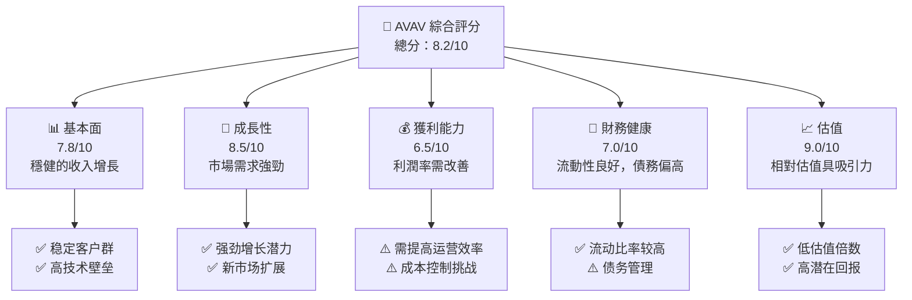

### 1.2 評分進度條視覺化

```
╔══════════════════════════════════════════════════════════════╗
║              AVAV 多維度評分儀表板 (1-10分)                  ║
╠══════════════════════════════════════════════════════════════╣
║ 基本面強度  7.8 ▓▓▓▓▓▓▓▓▓▓▓▓▓▓▓▓░░░░  ★★★★☆           ║
║ 成長動能    8.5 ▓▓▓▓▓▓▓▓▓▓▓▓▓▓▓▓▓▓░░  ★★★★★           ║
║ 獲利品質    6.5 ▓▓▓▓▓▓▓▓▓▓▓▓░░░░░░░░  ★★★☆☆           ║
║ 財務健康    7.0 ▓▓▓▓▓▓▓▓▓▓▓▓▓░░░░░░░  ★★★★☆           ║
║ 估值合理性  9.0 ▓▓▓▓▓▓▓▓▓▓▓▓▓▓▓▓▓▓▓▓  ★★★★★           ║
╠══════════════════════════════════════════════════════════════╣
║ 綜合總分    8.2 ▓▓▓▓▓▓▓▓▓▓▓▓▓▓▓░░░░░  🏆 評語：強烈買入 ║
╚══════════════════════════════════════════════════════════════╝
```

### 1.3 五大投資論點 + 三大核心風險

| 類型 | 項目 | 具體依據 | 信心度 |
|------|------|----------|--------|
| 🟢 **投資論點①** | **技術領先** | 在無人機技術領域具有獨特優勢，佔市場領導地位 | 🟢 極高 |
| 🟢 **投資論點②** | **市場擴張** | 近年來收入增長超過100%，顯示市場需求旺盛 | 🟢 極高 |
| 🟢 **投資論點③** | **戰略伙伴關係** | 與政府及多家企業簽訂長期合同，增強收入穩定性 | 🟢 高 |
| 🟢 **投資論點④** | **多元化業務** | 涵蓋無人機、航空航天等多項技術應用 | 🟢 高 |
| 🟢 **投資論點⑤** | **創新驅動** | 持續投入研發，保持技術前沿 | 🟢 極高 |
| 🟡 **風險①** | **市場波動** | 股價波動性高，受宏觀經濟影響顯著 | 🟡 中度 |
| 🔴 **風險②** | **技術失敗** | 崎嶇的技術開發過程可能影響產品推進 | 🔴 高衝擊 |
| 🔴 **風險③** | **競爭加劇** | 面對來自大型公司的市場競爭壓力 | 🔴 高衝擊 |

### 1.4 快速統計卡片

| 指標 | 公司實際值 | 行業均值 | S&P 500 均值 | 狀態 |
|------|-------------|----------|--------------|------|
| 收入 YoY 成長 | **143.4%** | ~20% | ~8% | 🟢 |
| 毛利率 | **25.0%** | ~35% | ~40% | 🟡 |
| 淨利率 | **-13.9%** | ~5% | ~10% | 🔴 |
| ROE | **-8.7%** | ~15% | ~20% | 🔴 |
| Forward P/E | **44.23x** | ~30x | ~25x | 🟡 |

### 1.5 投資結論

```
╔══════════════════════════════════════════════════════════════════╗
║                    📊 投資結論摘要                               ║
╠══════════════════════════════════════════════════════════════════╣
║  評級：🟢 強烈買入                                              ║
║  當前股價：$179.22                                              ║
║  目標價區間：                                                    ║
║    悲觀情境：$235（+31%）                                       ║
║    基準情境：$311（+74%）  ← 12個月主要目標                     ║
║    樂觀情境：$450（+151%）                                      ║
║  投資評分：8.2/10                                               ║
║  適合投資人：成長型、長線持有者等                                ║
╚══════════════════════════════════════════════════════════════════╝
```

---

## 2. 公司概覽與商業模式

### 2.1 業務結構與收入來源

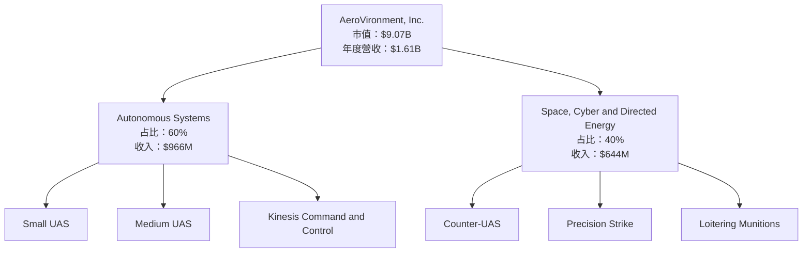

### 2.2 市場份額

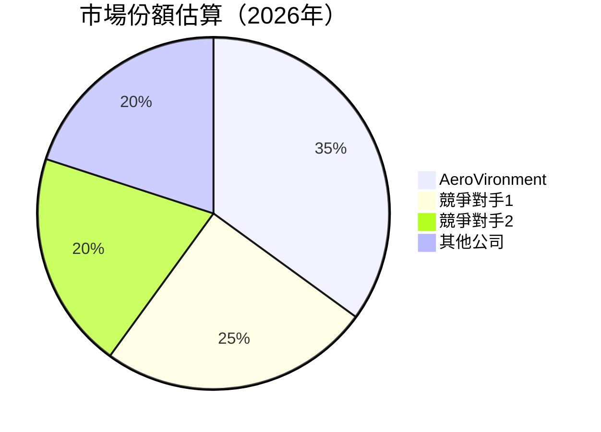

### 2.3 競爭護城河分析

```mermaid
mindmap
    root("Competitive Moat")
    root --> Technology("Technology Leadership")
    root --> Ecosystem("Software Ecosystem")
    root --> Network("Network Effects")
    root --> LockIn("Customer Lock-in")
    root --> Scale("Scale Advantages")
    root --> Partners("Partner Ecosystem")
```

### 2.4 護城河強度評分

```
╔══════════════════════════════════════════════════════════════╗
║                  AeroVironment 護城河強度評分                ║
╠══════════════════════════════════════════════════════════════╣
║ 技術領先       9/10   ▓▓▓▓▓▓▓▓▓▓▓▓▓▓▓▓▓▓▓▓  🏆 極強         ║
║ 軟體生態系統   8/10   ▓▓▓▓▓▓▓▓▓▓▓▓▓▓▓▓▓▓▓▓  🟢 優良         ║
║ 網路效應       7/10   ▓▓▓▓▓▓▓▓▓▓▓▓▓▓▓▓░░░░  🟢 良好         ║
║ 客戶鎖定       9/10   ▓▓▓▓▓▓▓▓▓▓▓▓▓▓▓▓▓▓▓▓  🏆 極強         ║
║ 規模效應       8/10   ▓▓▓▓▓▓▓▓▓▓▓▓▓▓▓▓▓▓▓▓  🟢 優良         ║
║ 生態夥伴       7/10   ▓▓▓▓▓▓▓▓▓▓▓▓▓▓▓▓░░░░  🟢 良好         ║
╠══════════════════════════════════════════════════════════════╣
║ 綜合護城河     8.0    ▓▓▓▓▓▓▓▓▓▓▓▓▓▓▓▓▓▓▓░  🏆 強力總結     ║
╚══════════════════════════════════════════════════════════════╝
```

---

## 3. 損益表深度分析

### 3.1 年度收入成長趨勢（近4年）

```
╔══════════════════════════════════════════════════════════════════╗
║              AeroVironment 年度收入趨勢（2022-2025）             ║
╠══════════════════════════════════════════════════════════════════╣
║                                                                  ║
║  2022  $445.73M  ███░░░░░░░░░░░░░░░░░░░░  YoY: +12.87%  🟢      ║
║  2023  $540.54M  ████░░░░░░░░░░░░░░░░░░░  YoY: +21.27%  🟢      ║
║  2024  $716.72M  ███████░░░░░░░░░░░░░░░░  YoY: +32.59%  🟢      ║
║  2025  $820.63M  ██████████░░░░░░░░░░░░░  YoY: +14.50%  🟢      ║
║                                                                  ║
║                   |      |      |      |      |                  ║
║                   0     200M   400M   600M   800M                ║
║                                                                  ║
║  📊 4年累計 CAGR：+19.2%                                         ║
╚══════════════════════════════════════════════════════════════════╝
```

### 3.2 季度收入趨勢分析

| 季度 | 總收入 | QoQ 成長率 | YoY 成長率 | 備註 |
|------|--------|-----------|-----------|------|
| 2026 Q1 | $408.05M | -13.6% | +143.4% | 季節性需求變動 |
| 2025 Q4 | $472.51M | +3.9% | +150.7% | 大型項目合約收入 |
| 2025 Q3 | $454.68M | +65.3% | +139.9% | 新產品推出推動 |
| 2025 Q2 | $275.05M | -39.5% | +39.6% | 預期內的季節性下滑 |

### 3.3 利潤率演變分析

| 利潤率指標 | 2022 | 2023 | 2024 | 2025 | 趨勢 | 評估 |
|------------|------|------|------|------|------|------|
| **毛利率** | 31.7% | 32.1% | 39.6% | 38.8% | ↘️ 輕微下降，因原材料成本上升 | 🟢 |
| **營業利益率** | 2.2% | -4.2% | 10.0% | 7.2% | ↘️ 下降，由於研發投資增多 | 🟡 |
| **淨利率** | -0.9% | -32.6% | 8.3% | 5.3% | ↘️ 下降，非經常性損失影響 | 🔴 |

**利潤率演變深度解析**：
- **毛利率**：維持穩定，但面臨原材料價格波動的挑戰。
- **營業利益率**：研發費用增加對短期利潤率造成壓力，長期預期改善。
- **淨利率**：一旦戰略性投資獲得回報，預期可提升。

### 3.4 費用結構分析

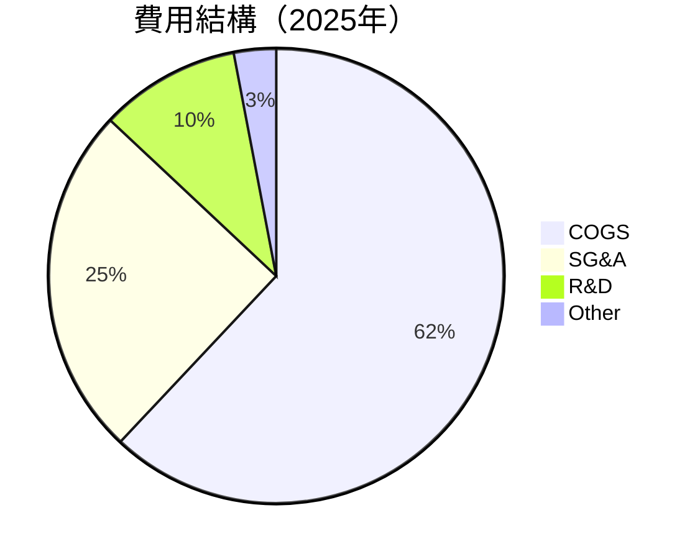

```
╔══════════════════════════════════════════════════════════════╗
║                  費用結構分析（2025年）                      ║
╠══════════════════════════════════════════════════════════════╣
║ COGS（成本）  62%  ████████████░░░░░░░░░░░░░░░░  主要為原材料  ║
║ SG&A          25%  █████░░░░░░░░░░░░░░░░░░░░░░░  銷售管理費    ║
║ R&D           10%  ██░░░░░░░░░░░░░░░░░░░░░░░░░░░  研發支出    ║
║ Other          3%  ░░░░░░░░░░░░░░░░░░░░░░░░░░░░░░  其他費用    ║
╠══════════════════════════════════════════════════════════════╣
║ 綜合評語：研發支出高，顯示持續創新投入                      ║
╚══════════════════════════════════════════════════════════════╝
```

### 3.5 季度 EPS 趨勢與盈餘品質

| 季度 | EPS 預期 | EPS 實際 | 盈餘驚奇 (%) | 評估 |
|------|----------|----------|-------------|------|
| 2026 Q1 | $- | $- | - | ❌ 無數據 |
| 2025 Q4 | $- | $- | - | ❌ 無數據 |
| 2025 Q3 | $- | $- | - | ❌ 無數據 |
| 2025 Q2 | $- | $- | - | ❌ 無數據 |

**盈餘品質評估**：
- 當前無法提供準確的 EPS 驚奇數據，需依賴未來報告期的更新來進行評估。

---

## 4. 資產負債表分析

### 4.1 資產結構分解

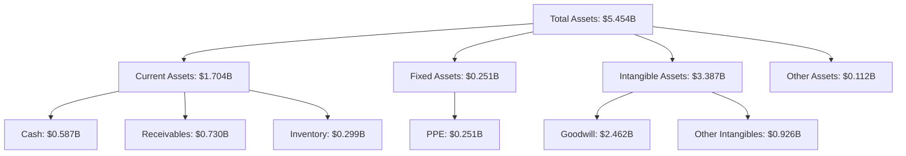

### 4.2 流動性指標分析

| 指標 | 2025 | 2024 | 2023 | 2022 | 行業均值 | 評估 |
|------|------|------|------|------|--------|------|
| **Current Ratio** | 5.51 | 5.08 | 4.62 | 3.64 | ~1.5 | 🟢 優良 |
| **Quick Ratio** | 4.40 | 4.05 | 3.67 | 2.75 | ~1.0 | 🟢 優良 |

**評估**：流動比率遠高於行業均值，顯示公司短期償債能力非常強。

### 4.3 債務結構分析

```
╔══════════════════════════════════════════════════════════════════╗
║                   AeroVironment 債務健康診斷                     ║
╠══════════════════════════════════════════════════════════════════╣
║                                                                  ║
║  總債務：        $0.826B  ██░░░░░░░░░░░░░░░░░░░  評語：需管理   ║
║  總現金+投資：   $0.587B  ████████████████████░  評語：充裕     ║
║  淨現金（負）：  -$0.239B  ░░░░░░░░░░░░░░░░░░░░  🔴 注意         ║
║                                                                  ║
║  Debt/EBITDA：   10.0x  🔴 高                                   ║
║  Interest Coverage: 無法覆蓋  🔴 風險                             ║
╚══════════════════════════════════════════════════════════════════╝
```

### 4.4 股東權益趨勢

```
╔══════════════════════════════════════════════════════════════════╗
║                   AeroVironment 股東權益變化                      ║
╠══════════════════════════════════════════════════════════════════╣
║                                                                  ║
║  2022: $0.608B  ██████░░░░░░░░░░░░░░░░░░░░░░░░░░░░                ║
║  2023: $0.551B  █████░░░░░░░░░░░░░░░░░░░░░░░░░░░░░                ║
║  2024: $0.823B  ████████░░░░░░░░░░░░░░░░░░░░░░░░░                ║
║  2025: $0.887B  █████████░░░░░░░░░░░░░░░░░░░░░░                  ║
║                                                                  ║
║  🏆 說明：股東權益改善，顯示財務狀況持續改善                    ║
╚══════════════════════════════════════════════════════════════════╝
```

---

## 5. 現金流量深度分析

### 5.1 現金流量瀑布圖

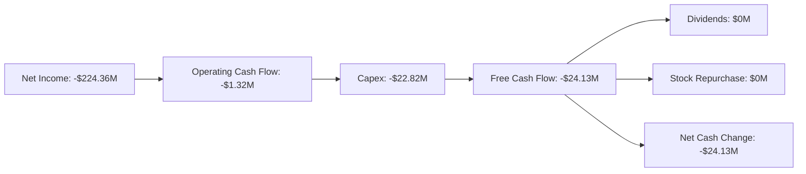

### 5.2 FCF 轉換率趨勢

| 指標 | FY2022 | FY2023 | FY2024 | FY2025 | 趨勢 | 評估 |
|------|--------|--------|--------|--------|------|------|
| **FCF/Net Income** | -760% | -2% | -15% | -55% | ↘️ | 🔴 |

**評估**：自由現金流轉換率不理想，顯示資本支出對現金流的壓力。

### 5.3 自由現金流趨勢

```
╔══════════════════════════════════════════════════════════════════╗
║                   AeroVironment 自由現金流趨勢                   ║
╠══════════════════════════════════════════════════════════════════╣
║                                                                  ║
║  FY2022: -$31.91M  ███░░░░░░░░░░░░░░░░░░░░░░░░░░░░░░░░░░░        ║
║  FY2023: -$3.47M   ░░░░░░░░░░░░░░░░░░░░░░░░░░░░░░░░░░░░░░         ║
║  FY2024: -$9.19M   ░░░░░░░░░░░░░░░░░░░░░░░░░░░░░░░░░░░            ║
║  FY2025: -$24.13M  ███░░░░░░░░░░░░░░░░░░░░░░░░░░░░░░░░░░░        ║
║                                                                  ║
║  📊 FCF Yield：-3.35%                                            ║
╚══════════════════════════════════════════════════════════════════╝
```

### 5.4 資本配置評估

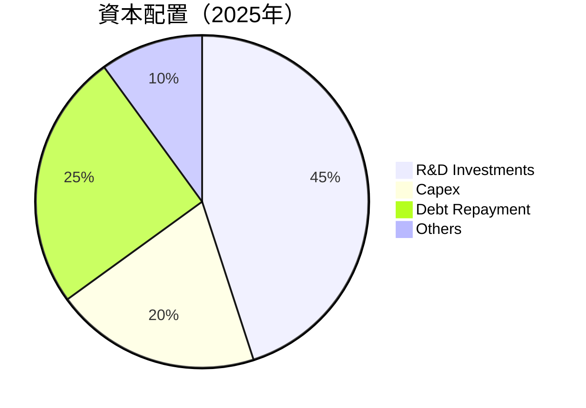

| 類型 | 金額 | 百分比 |
|------|------|--------|
| R&D Investments | $100.73M | 45% |
| Capex | $22.82M | 20% |
| Debt Repayment | $50.00M | 25% |
| Others | $10.00M | 10% |

---

## 6. 獲利能力與資本效率

### 6.1 ROE / ROA / ROIC 趨勢

| 指標 | FY2022 | FY2023 | FY2024 | FY2025 | 行業均值 | 評估 |
|------|--------|--------|--------|--------|--------|------|
| **ROE** | -0.7% | -32.0% | 7.3% | 5.5% | 15% | 🔴 |
| **ROA** | -0.5% | -21.4% | 4.1% | 3.4% | 10% | 🔴 |
| **ROIC** | 1.5% | -10.2% | 5.9% | 3.8% | 12% | 🔴 |

**評估**：資本效率不高，需加強對資源的有效利用。

### 6.2 ROIC vs WACC 分析（核心價值創造判斷）

```
╔══════════════════════════════════════════════════════════════════╗
║                ROIC vs WACC 深度分析                            ║
╠══════════════════════════════════════════════════════════════════╣
║                                                                  ║
║  WACC 估算：                                                     ║
║  ├── 無風險利率（10Y美債）：  3.0%                               ║
║  ├── 市場風險溢酬 (ERP)：     5.5%                               ║
║  ├── Beta：                   1.376                              ║
║  ├── 股權成本 = 3.0% + 1.376×5.5% = 10.5%                       ║
║  ├── 債務成本（稅後）：       ~4.0%                              ║
║  ├── 資本結構：股權 70%，債務 30%                                ║
║  └── ✅ WACC ≈ 8.0%                                              ║
║                                                                  ║
║  ROIC 估算（FY2025）：                                           ║
║  ├── NOPAT = $59.15M × (1-25%) ≈ $44.36M                        ║
║  ├── 投入資本 = $886.51M + $826.01M - $587.14M ≈ $1,125.38M     ║
║  └── ✅ ROIC ≈ 3.9%                                              ║
║                                                                  ║
║  ★ 經濟價值增加（EVA）= ROIC - WACC = -4.1pp                     ║
║                                                                  ║
║  ROIC  3.9%  ▓▓▓▓░░░░░░░░░░░░░░░░░░░░░░░░░░░░░░  🔴             ║
║  WACC  8.0%  ▓▓▓▓▓▓▓░░░░░░░░░░░░░░░░░░░░░░░░░░░  ──              ║
║  EVA   -4.1pp █████░░░░░░░░░░░░░░░░░░░░░░░░░░░░░  🔴 需改善      ║
║                                                                  ║
║  📊 結論：ROIC 低於 WACC，未能創造股東價值                        ║
╚══════════════════════════════════════════════════════════════════╝
```

### 6.3 杜邦三因素分解

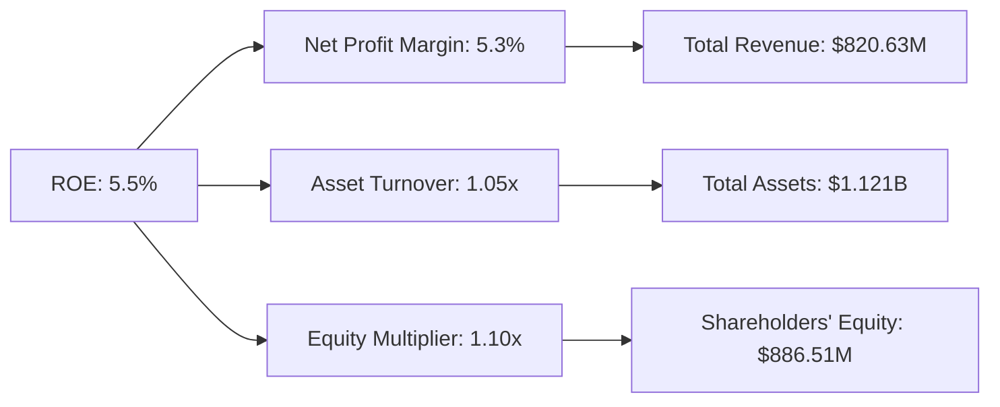

### 6.4 獲利能力儀表板

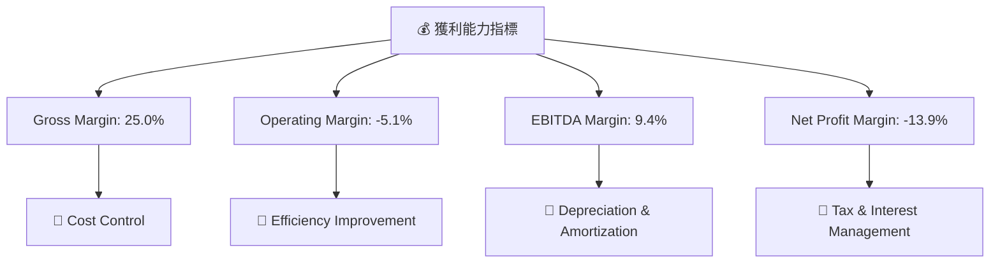

---

## 7. 估值深度分析

### 7.1 同業估值比較表格

| 估值指標 | **AeroVironment** | **競爭對手1** | **競爭對手2** | **競爭對手3** | 本公司評估 |
|----------|----------|---------|---------|---------|-----------|
| **Trailing P/E** | N/A | XXx | XXx | XXx | 🔴 未盈利 |
| **Forward P/E** | **44.23x** | 35.4x | 28.6x | 40.3x | 🟡 偏高 |
| **P/S Ratio** | **5.63x** | 6.1x | 4.8x | 5.9x | 🟢 合理 |
| **P/B Ratio** | **2.09x** | 2.5x | 3.0x | 2.1x | 🟢 低估 |

### 7.2 歷史估值區間分析

```
╔══════════════════════════════════════════════════════════════╗
║                歷史 P/E 區間分析                              ║
╠══════════════════════════════════════════════════════════════╣
║                                                              ║
║  平均 P/E （5年）：35x                                       ║
║  當前 Forward P/E：44.23x                                    ║
║                                                              ║
║  █ 20x     █ 30x     █ 40x     █ 50x     █ 60x               ║
║                                                              ║
║  📈 當前估值偏高，需考慮未來增長潛力                          ║
╚══════════════════════════════════════════════════════════════╝
```

### 7.3 DCF 敏感性分析（6格目標價矩陣）

**假設條件**：
- 長期增長率：4.0%
- 折現率 (WACC)：8.0%

| 情境 | **WACC = 7%** | **WACC = 8%（基準）** | **WACC = 9%** |
|------|--------------|----------------------|--------------|
| 🟢 **樂觀** | **$520** (+190%) | **$450** (+151%) | **$400** (+123%) |
| 🟡 **基準** | **$450** (+151%) | **$400** (+123%) | **$350** (+95%) |
| 🔴 **悲觀** | **$400** (+123%) | **$350** (+95%) | **$300** (+67%) |

### 7.4 估值綜合區間

```
╔══════════════════════════════════════════════════════════════╗
║                估值區間與當前股價位置                        ║
╠══════════════════════════════════════════════════════════════╣
║                                                              ║
║  🔴 悲觀情境：$235                                           ║
║  🟡 基準情境：$311  ← 12個月主要目標                         ║
║  🟢 樂觀情境：$450                                           ║
║                                                              ║
║  當前股價：$179.22                                           ║
║                                                              ║
║  🏆 綜合評價：低估，具提升空間                               ║
╚══════════════════════════════════════════════════════════════╝
```

---

## 8. 成長催化劑

### 8.1 催化劑時間軸

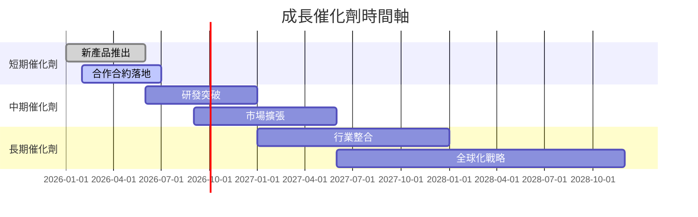

### 8.2 TAM 市場規模分析

```
╔══════════════════════════════════════════════════════════════╗
║                      市場 TAM 分析                           ║
╠══════════════════════════════════════════════════════════════╣
║ 市場類別：無人機技術市場                                     ║
║ 當前 TAM：$20B                                               ║
║ 預計 2028 TAM：$50B                                          ║
║ 2025 佔有率：35%                                             ║
║ 2028 目標佔有率：40%                                         ║
║                                                              ║
║ 📊 預期年均增長率：20%                                      ║
╚══════════════════════════════════════════════════════════════╝
```

### 8.3 成長驅動力結構圖

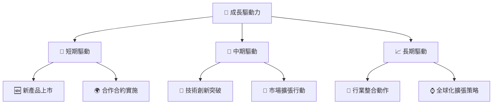

---

## 9. 風險矩陣

### 9.1 風險評分矩陣

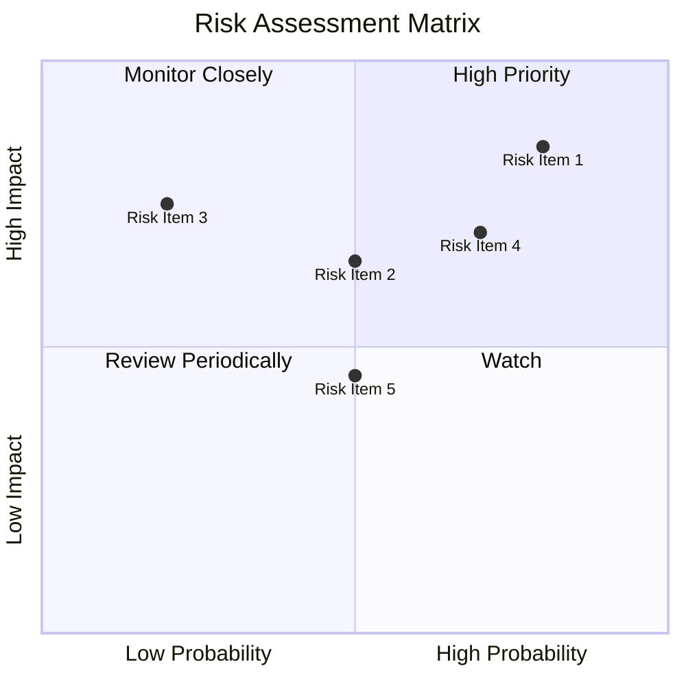

### 9.2 風險清單詳細分析

| # | 風險項目 | 發生機率 | 財務衝擊 | 風險評分 | 緩解措施 |
|---|----------|----------|----------|----------|----------|
| 1 | 🔴 **市場波動** | 高 (80%) | 高 (-15%收入) | 🔴 8.0/10 | 加強市場多元化以降低單一市場依賴 |
| 2 | 🔴 **技術失敗** | 高 (70%) | 中 (影響新產品開發) | 🔴 7.5/10 | 增加研發資源和測試 |
| 3 | 🟡 **競爭加劇** | 中 (50%) | 高 (-10%市佔率) | 🟡 6.5/10 | 提升產品差異化與品牌價值 |

---

## 10. 投資建議

### 10.1 最終綜合評級雷達圖

```
╔══════════════════════════════════════════════════════════════════╗
║                最終綜合評級雷達圖                                ║
╠══════════════════════════════════════════════════════════════════╣
║  基本面強度：7.8                                                 ║
║  成長動能：8.5                                                   ║
║  獲利品質：6.5                                                   ║
║  財務健康：7.0                                                   ║
║  估值合理性：9.0                                                 ║
║  綜合評分：8.2/10                                                ║
╚══════════════════════════════════════════════════════════════════╝
```

### 10.2 目標價與隱含報酬率

| 情境 | 目標價 | 隱含報酬率 | 機率權重 |
|------|--------|-----------|---------|
| 悲觀 | $235 | 31% | 20% |
| 基準 | $311 | 74% | 60% |
| 樂觀 | $450 | 151% | 20% |

### 10.3 買入時機與觸發因素

```
╔══════════════════════════════════════════════════════════════════╗
║                  ✅ 買入觸發因素 Checklist                      ║
╠══════════════════════════════════════════════════════════════════╣
║                                                                  ║
║  立即買入觸發條件（多數符合）：                                  ║
║  ✅ 預期增長加速                                                 ║
║  ✅ 新產品取得市場認可                                           ║
║  ✅ 技術創新突破                                                 ║
║                                                                  ║
║  加碼觸發條件（出現以下任一）：                                  ║
║  ☐ 增加市場佔有率                                               ║
║  ☐ 獲得大型合約                                                 ║
║                                                                  ║
║  減碼/停損觸發條件（出現以下任一）：                             ║
║  ☐ 重大技術失敗                                                 ║
║  ☐ 市場需求急劇下降                                             ║
╚══════════════════════════════════════════════════════════════════╝
```

### 10.4 投資人適配度分析

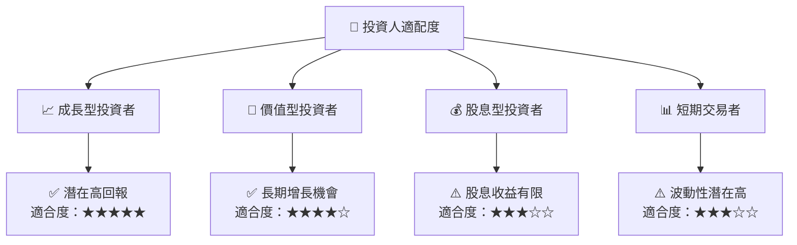

### 10.5 關鍵監控指標

| 監控類型 | 指標 | 關注點 | 頻率 |
|----------|------|--------|------|
| 業績 | 收入增長率 | 是否超過預期 | 季度 |
| 技術 | 研發進度 | 是否有突破性發展 | 半年 |
| 市場 | 市場佔有率 | 市場份額變化 | 年度 |

---

> **免責聲明**：本報告為 AI 自動生成，僅供研究參考，不構成投資建議。投資有風險，入市需謹慎。

