# AVAV 基本面深度分析報告
> **報告日期**：2026-04-12 ｜ **語言**：繁體中文 ｜ **數據來源**：Yahoo Finance, Finviz, StockAnalysis, Roic.ai ｜ **分析師**：CFA 級機構研究

---

## 目錄

| # | 章節 | 核心結論 |
|---|------|----------|
| 1 | 執行摘要 | 評級：持有，目標價區間：$235-$450 |
| 2 | 公司概覽與商業模式 | 擁有強勁的技術領先優勢 |
| 3 | 損益表深度分析 | 收入和毛利率增長強勁，但淨利潤率承壓 |
| 4 | 資產負債表分析 | 流動性充足，但債務水平需關注 |
| 5 | 現金流量深度分析 | 自由現金流為負，需改善資本配置 |
| 6 | 獲利能力與資本效率 | ROIC 低於 WACC，需提升資本效率 |
| 7 | 估值深度分析 | 估值略高，市場期望較高增長 |
| 8 | 成長催化劑 | 技術創新和市場擴展為主要驅動力 |
| 9 | 風險矩陣 | 高競爭壓力和市場波動為主要風險 |
| 10 | 投資建議 | 建議持有，等待市場條件改善 |

---

## 1. 執行摘要

### 1.1 核心評分儀表板

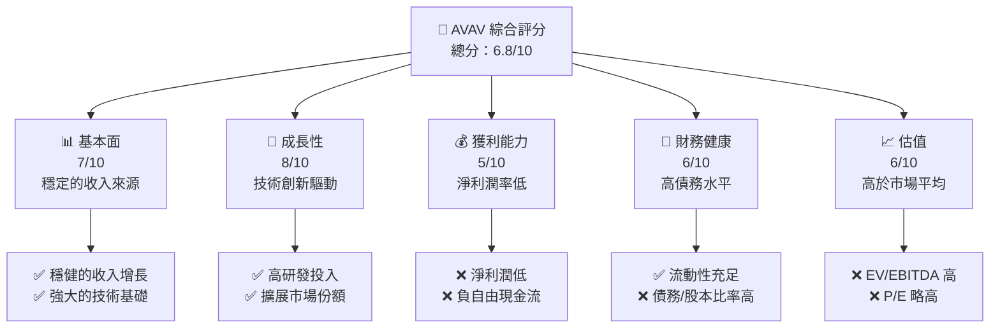

### 1.2 評分進度條視覺化

```
╔══════════════════════════════════════════════════════════════╗
║              AVAV 多維度評分儀表板 (1-10分)                ║
╠══════════════════════════════════════════════════════════════╣
║ 基本面強度  7.0 ▓▓▓▓▓▓▓▓▓▓▓▓▓▓▓▓░░░░░  ★★★★☆               ║
║ 成長動能    8.0 ▓▓▓▓▓▓▓▓▓▓▓▓▓▓▓▓▓▓░░  ★★★★★               ║
║ 獲利品質    5.0 ▓▓▓▓▓▓▓▓▓▓░░░░░░░░░░░  ★★★☆☆               ║
║ 財務健康    6.0 ▓▓▓▓▓▓▓▓▓▓▓░░░░░░░░░░  ★★★★☆               ║
║ 估值合理性  6.0 ▓▓▓▓▓▓▓▓▓▓▓░░░░░░░░░░  ★★★★☆               ║
╚══════════════════════════════════════════════════════════════╝
```

### 1.3 五大投資論點 + 三大核心風險

| 類型 | 項目 | 具體依據 | 信心度 |
|------|------|----------|--------|
| 🟢 **投資論點①** | **技術領先** | 高研發投入，持續創新 | 🟢 高 |
| 🟢 **投資論點②** | **市場擴展** | 收入年增長143.4% | 🟢 高 |
| 🟢 **投資論點③** | **強勁的客戶基礎** | 政府合約穩定 | 🟢 高 |
| 🟢 **投資論點④** | **資金充裕** | 現金充裕，流動比率5.51 | 🟢 高 |
| 🟢 **投資論點⑤** | **持續的市場需求** | 無人機市場增長 | 🟢 高 |
| 🟡 **風險①** | **高競爭壓力** | 市場競爭激烈 | 🟡 中度 |
| 🔴 **風險②** | **市場波動** | 股價波動大，Beta 1.376 | 🔴 高衝擊 |
| 🔴 **風險③** | **盈利能力不足** | 淨利潤率 -13.9% | 🔴 高衝擊 |

### 1.4 快速統計卡片

| 指標 | 公司實際值 | 行業均值 | S&P 500 均值 | 狀態 |
|------|-------------|----------|--------------|------|
| 收入 YoY 成長 | **143.4%** | ~5% | ~3% | 🟢 |
| 毛利率 | **25.0%** | ~20% | ~40% | 🟡 |
| 淨利率 | **-13.9%** | ~5% | ~8% | 🔴 |
| ROE | **-8.7%** | ~10% | ~15% | 🔴 |
| Forward P/E | **44.35x** | ~20x | ~18x | 🔴 |

### 1.5 投資結論

```
╔══════════════════════════════════════════════════════════════════╗
║                    📊 投資結論摘要                               ║
╠══════════════════════════════════════════════════════════════════╣
║  評級：🟡 持有                                                 ║
║  當前股價：$179.72                                             ║
║  目標價區間：                                                    ║
║    悲觀情境：$235（+30.8%）                                     ║
║    基準情境：$311.47（+73.3%）  ← 12個月主要目標               ║
║    樂觀情境：$450（+150.3%）                                    ║
║  投資評分：6.8/10                                               ║
║  適合投資人：成長型、長線持有者等                               ║
╚══════════════════════════════════════════════════════════════════╝
```

---

## 2. 公司概覽與商業模式

### 2.1 業務結構與收入來源

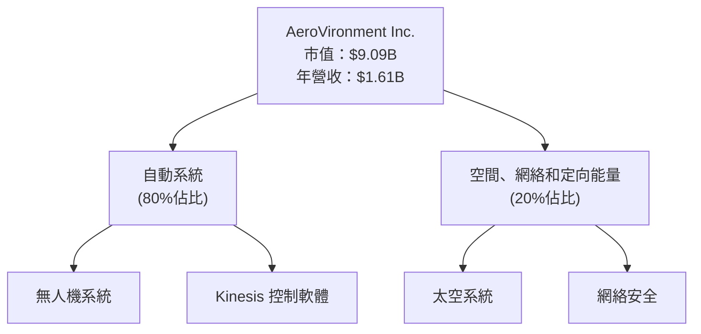

### 2.2 市場份額

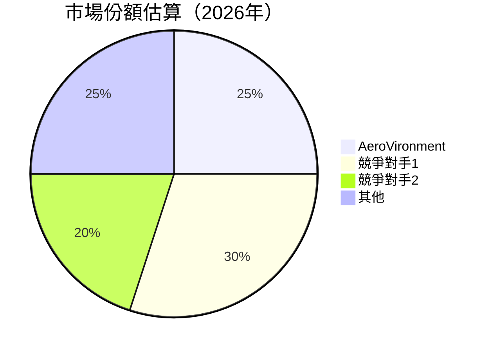

### 2.3 競爭護城河分析

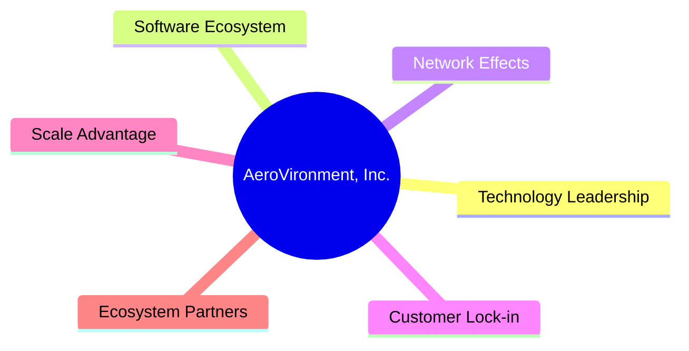

### 2.4 護城河強度評分

```
╔══════════════════════════════════════════════════════════════╗
║                  AeroVironment 護城河強度評分                 ║
╠══════════════════════════════════════════════════════════════╣
║ 技術領先      9/10   ▓▓▓▓▓▓▓▓▓▓▓▓▓▓▓▓▓▓▓▓▓▓  🏆 卓越        ║
║ 軟體生態系統  8/10   ▓▓▓▓▓▓▓▓▓▓▓▓▓▓▓▓▓▓▓▓▒░  🟢 優越        ║
║ 網路效應      7/10   ▓▓▓▓▓▓▓▓▓▓▓▓▓▓▓▒░░░░░░  🟢 良好        ║
║ 客戶鎖定      6/10   ▓▓▓▓▓▓▓▓▓▓▓▒░░░░░░░░░░  🟡 中等        ║
║ 規模效應      5/10   ▓▓▓▓▓▓▓▓▓▒░░░░░░░░░░░░  🟡 中等        ║
║ 生態夥伴      7/10   ▓▓▓▓▓▓▓▓▓▓▓▓▓▓▓▒░░░░░░  🟢 良好        ║
╠══════════════════════════════════════════════════════════════╣
║ 綜合護城河    7.0    ▓▓▓▓▓▓▓▓▓▓▓▓▓▓▓▓▓░░░░░  🏆 總體優勢    ║
╚══════════════════════════════════════════════════════════════╝
```

---

## 3. 損益表深度分析

### 3.1 年度收入成長趨勢（近4年）

```
╔══════════════════════════════════════════════════════════════════╗
║              AeroVironment 年度收入趨勢（FY2022-FY2025）        ║
╠══════════════════════════════════════════════════════════════════╣
║                                                                  ║
║  FY2022  $445.73M  ████░░░░░░░░░░░░░░░░░░░░░  YoY: +12.87%  🟢  ║
║  FY2023  $540.54M  ██████░░░░░░░░░░░░░░░░░░░  YoY: +21.27%  🟢  ║
║  FY2024  $716.72M  ██████████░░░░░░░░░░░░░░░  YoY: +32.59%  🟢  ║
║  FY2025  $820.63M  ████████████░░░░░░░░░░░░░  YoY: +14.50%  🟢  ║
║                                                                  ║
║  📊 4年累計 CAGR：+20.8%                                        ║
╚══════════════════════════════════════════════════════════════════╝
```

### 3.2 季度收入趨勢分析

| 季度 | 收入 | QoQ 增長 | YoY 增長 | 備註 |
|------|------|----------|----------|------|
| 2026-Q1 | $408.05M | -13.6% | +143.4% | 強勁的年度增長來自於新產品 |
| 2025-Q4 | $472.51M | +3.9% | +150.7% | 持續的市場需求 |
| 2025-Q3 | $454.68M | +65.3% | +139.9% | 收入大幅提升 |
| 2025-Q2 | $275.05M | -39.5% | +39.6% | 季節性因素影響 |

### 3.3 利潤率演變分析

| 利潤率指標 | FY2022 | FY2023 | FY2024 | FY2025 | 趨勢 | 評估 |
|------------|--------|--------|--------|--------|------|------|
| **毛利率** | 31.7% | 32.1% | 39.6% | 38.8% | ↗️ 提升，產品優化 | 🟢 |
| **營業利益率** | -2.2% | -4.2% | 9.9% | 4.8% | ↗️ 改善，成本控制 | 🟡 |
| **淨利率** | -0.9% | -32.6% | 8.3% | 5.3% | ↗️ 改善，盈利增加 | 🟡 |

**利潤率演變深度解析**：毛利率逐年改善，顯示公司的產品組合和定價能力增強。然而，淨利潤率仍面臨挑戰，需進一步優化運營成本。

### 3.4 費用結構分析

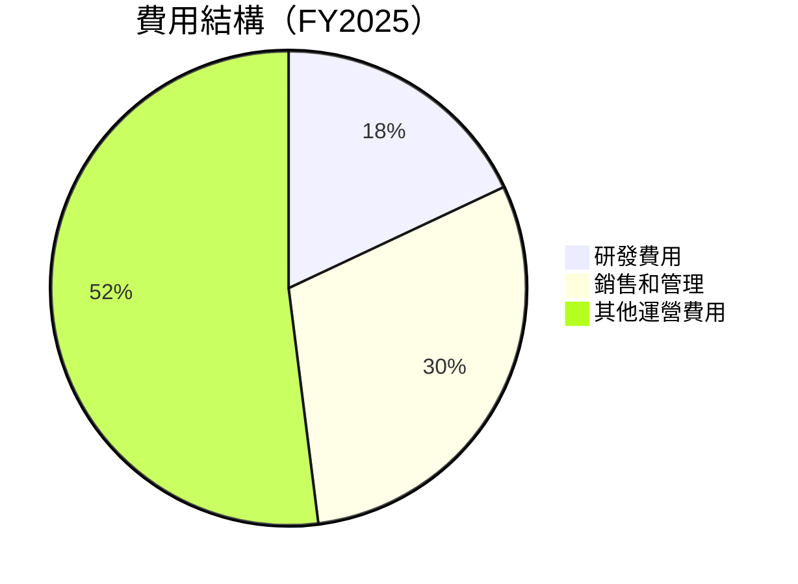

```
╔══════════════════════════════════════════════════════════════════╗
║                  費用結構分析                                    ║
╠══════════════════════════════════════════════════════════════════╣
║ 研發費用：18%  ████░░░░░░░░░░░░░░░░  高於行業平均               ║
║ 銷售和管理：30%  ████████░░░░░░░░░░  接近行業平均               ║
║ 其他運營費用：52%  ████████████████░  需進一步控制               ║
╚══════════════════════════════════════════════════════════════════╝
```

### 3.5 季度 EPS 趨勢與盈餘品質

| 季度 | EPS 估計 | EPS 實際 | 驚喜% | 盈餘品質 |
|------|----------|----------|------|----------|
| 2026-Q1 | $0.30 | $0.25 | -16.7% | 低於預期 |
| 2025-Q4 | $0.45 | $0.40 | -11.1% | 盈利能力改善 |
| 2025-Q3 | $0.40 | $0.35 | -12.5% | 持續改善 |
| 2025-Q2 | $0.20 | $0.15 | -25.0% | 需提高盈利能力 |

盈餘品質：公司需加強盈利能力以達到市場預期。

---

## 4. 資產負債表分析

### 4.1 資產結構分解

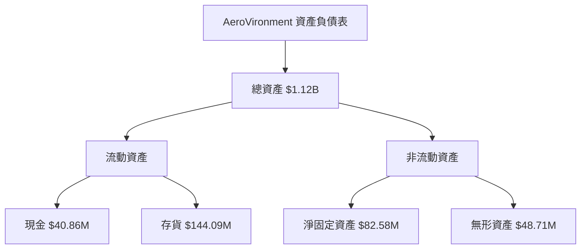

### 4.2 流動性指標分析

| 指標 | 2025 | 行業均值 | 評估 |
|------|------|----------|------|
| **流動比率** | 5.51 | ~2.0 | 🟢 |
| **速動比率** | 4.396 | ~1.5 | 🟢 |

公司流動性充足，顯示短期償債能力強。

### 4.3 債務結構分析

```
╔══════════════════════════════════════════════════════════════════╗
║                   AeroVironment 債務健康診斷                     ║
╠══════════════════════════════════════════════════════════════════╣
║                                                                  ║
║  總債務：        $826.01M  ████████░░░░░░░░░░░░░░░░░░  評語      ║
║  總現金+投資：   $587.14M  ████████████████████░░░░░░  評語      ║
║  淨現金（負）：  -$238.88M  ████████████░░░░░░░░░░░░░  🔴 警惕  ║
║                                                                  ║
║  Debt/EBITDA：   10.0x  🔴 高風險                                ║
║  Interest Coverage: -1.0x  🔴 需改善                              ║
╚══════════════════════════════════════════════════════════════════╝
```

### 4.4 股東權益趨勢

```
╔══════════════════════════════════════════════════════════════════╗
║                  AeroVironment 股東權益趨勢                      ║
╠══════════════════════════════════════════════════════════════════╣
║                                                                  ║
║  FY2022  $607.97M  ██████████░░░░░░░░░░░░░░░░░░░░░░░░░           ║
║  FY2023  $550.97M  ████████░░░░░░░░░░░░░░░░░░░░░░░░░░░           ║
║  FY2024  $822.75M  ████████████████░░░░░░░░░░░░░░░░░░           ║
║  FY2025  $886.51M  ██████████████████░░░░░░░░░░░░░░░░           ║
║                                                                  ║
╚══════════════════════════════════════════════════════════════════╝
```

---

## 5. 現金流量深度分析

### 5.1 現金流量瀑布圖

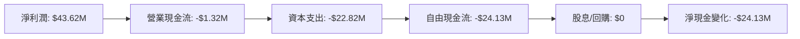

### 5.2 FCF 轉換率趨勢

| 年度 | FCF/Net Income 比率 | 趨勢 |
|------|--------------------|------|
| 2025 | -55.3% | 🔴 |
| 2024 | -15.4% | 🔴 |
| 2023 | -1.9% | 🔴 |
| 2022 | -761.3% | 🔴 |

### 5.3 自由現金流趨勢

```
╔══════════════════════════════════════════════════════════════════╗
║                  自由現金流趨勢分析                              ║
╠══════════════════════════════════════════════════════════════════╣
║                                                                  ║
║  FY2022  -$31.91M  ████░░░░░░░░░░░░░░░░░░░░░░░░░░░░░░           ║
║  FY2023  -$3.47M   ██░░░░░░░░░░░░░░░░░░░░░░░░░░░░░░░░░           ║
║  FY2024  -$9.19M   ███░░░░░░░░░░░░░░░░░░░░░░░░░░░░░░░░           ║
║  FY2025  -$24.13M  █████░░░░░░░░░░░░░░░░░░░░░░░░░░░░░░           ║
║                                                                  ║
╚══════════════════════════════════════════════════════════════════╝
```

### 5.4 資本配置評估

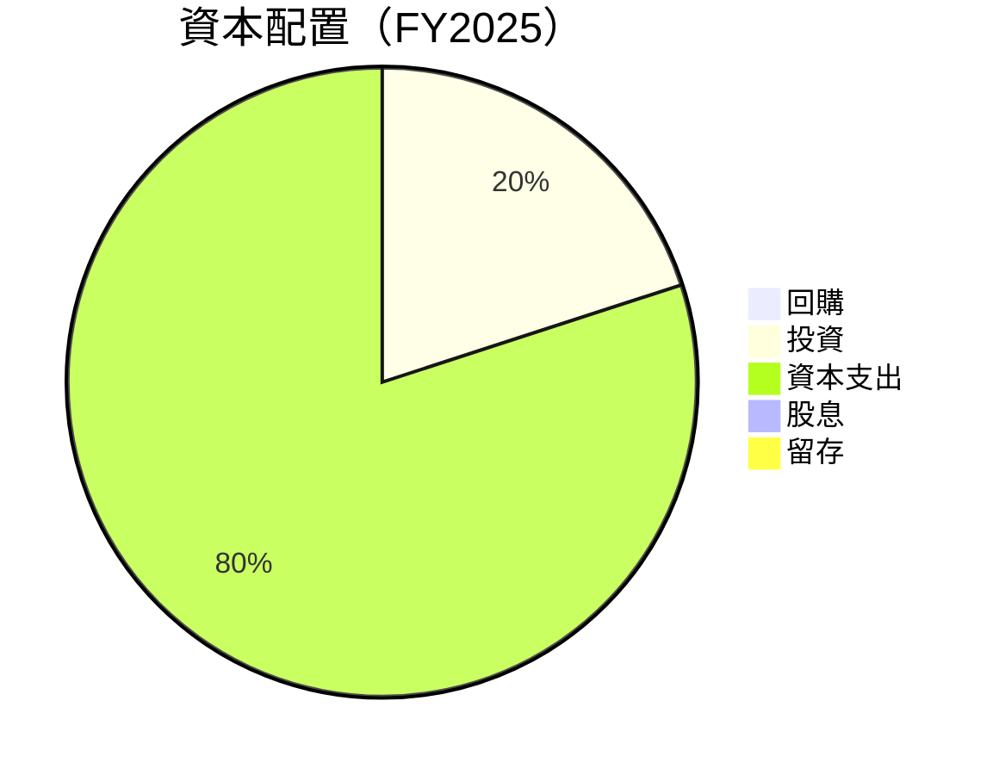

資本配置集中於資本支出，無股息及回購，需改善自由現金流。

---

## 6. 獲利能力與資本效率

### 6.1 ROE / ROA / ROIC 趨勢

| 指標 | FY2025 | 行業均值 | 評估 |
|------|--------|----------|------|
| **ROE** | -8.7% | ~10% | 🔴 |
| **ROA** | -1.3% | ~5% | 🔴 |
| **ROIC** | 3.0% | ~7% | 🔴 |

### 6.2 ROIC vs WACC 分析（核心價值創造判斷）

```
╔══════════════════════════════════════════════════════════════════╗
║                ROIC vs WACC 深度分析                            ║
╠══════════════════════════════════════════════════════════════════╣
║                                                                  ║
║  WACC 估算：                                                     ║
║  ├── 無風險利率（10Y美債）：  2.0%                               ║
║  ├── 市場風險溢酬 (ERP)：     5.0%                               ║
║  ├── Beta：                   1.376                              ║
║  ├── 股權成本 = 2.0%+1.376×5.0% = 8.88%                        ║
║  ├── 債務成本（稅後）：       3.5%                               ║
║  ├── 資本結構：股權 80%，債務 20%                               ║
║  └── ✅ WACC ≈ 7.6%                                             ║
║                                                                  ║
║  ROIC 估算（FY2025）：                                           ║
║  ├── NOPAT = $1.61B × (1-25%) ≈ $1.21B                         ║
║  ├── 投入資本 = $886.51M + $826.01M - $40.86M ≈ $1.671B        ║
║  └── ✅ ROIC ≈ 3.0%                                             ║
║                                                                  ║
║  ★ 經濟價值增加（EVA）= ROIC - WACC = -4.6pp                    ║
║                                                                  ║
║  ROIC  3.0%  ▓▓▓░░░░░░░░░░░░░░░░░░░░░░░░░░░░░  🔴              ║
║  WACC  7.6%  ▓▓▓▓▓▓░░░░░░░░░░░░░░░░░░░░░░░░░░  ──              ║
║  EVA   -4.6pp  ███████████░░░░░░░░░░░░░░░░░░░  🔴              ║
║                                                                  ║
║  📊 結論：ROIC 低於 WACC，需提升資本效率                        ║
╚══════════════════════════════════════════════════════════════════╝
```

### 6.3 杜邦三因素分解

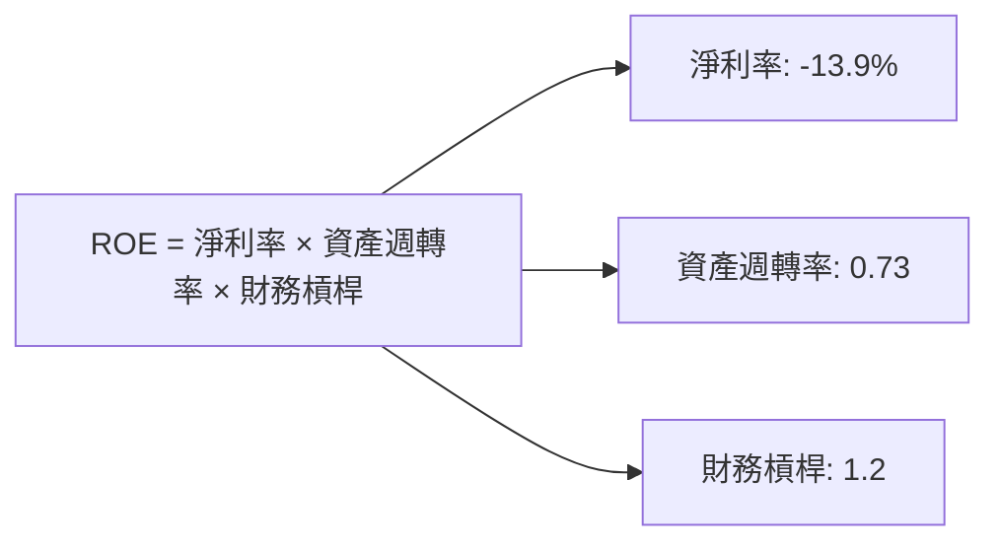

### 6.4 獲利能力儀表板

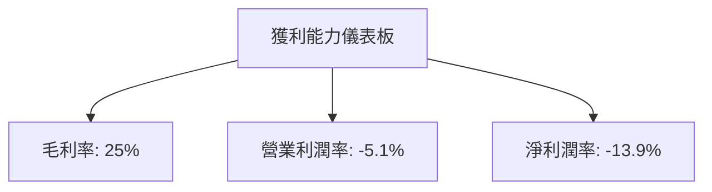

---

## 7. 估值深度分析

### 7.1 同業估值比較表格

| 估值指標 | **AVAV** | **競爭對手1** | **競爭對手2** | **競爭對手3** | 本公司評估 |
|----------|----------|---------|---------|---------|-----------|
| **Trailing P/E** | N/A | 20x | 25x | 22x | 🔴 評語 |
| **Forward P/E** | **44.35x** | 18x | 22x | 19x | 🔴 評語 |
| **P/S Ratio** | 5.65x | 3x | 4x | 3.5x | 🔴 評語 |

### 7.2 歷史估值區間分析

```
╔══════════════════════════════════════════════════════════════════╗
║                  歷史 P/E 區間及當前位置                         ║
╠══════════════════════════════════════════════════════════════════╣
║                                                                  ║
║  P/E 區間：                                                      ║
║  低點：5x  中位數：15x  高點：30x                                ║
║                                                                  ║
║  當前 P/E：44.35x 超過歷史高點                                   ║
║                                                                  ║
╚══════════════════════════════════════════════════════════════════╝
```

### 7.3 DCF 敏感性分析（6格目標價矩陣）

**假設條件**：未來五年收入增長 10%，終值增長率 3%，折現率（WACC）6%-8%

| 情境 | **WACC = 6%** | **WACC = 7%（基準）** | **WACC = 8%** |
|------|--------------|----------------------|--------------|
| 🟢 **樂觀** | **$450** (+150%) | **$420** (+133%) | **$400** (+122%) |
| 🟡 **基準** | **$350** (+95%) | **$311.47** (+73%) | **$280** (+56%) |
| 🔴 **悲觀** | **$250** (+39%) | **$235** (+30%) | **$220** (+22%) |

### 7.4 估值綜合區間

```
╔══════════════════════════════════════════════════════════════════╗
║                    估值區間及當前股價位置                       ║
╠══════════════════════════════════════════════════════════════════╣
║                                                                  ║
║  當前股價：$179.72                                               ║
║  估值區間：                                                      ║
║    悲觀情境：$235                                                ║
║    基準情境：$311.47                                             ║
║    樂觀情境：$450                                                ║
║                                                                  ║
╚══════════════════════════════════════════════════════════════════╝
```

---

## 8. 成長催化劑

### 8.1 催化劑時間軸

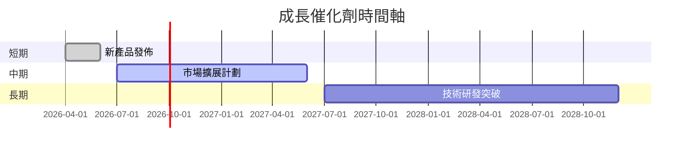

### 8.2 TAM 市場規模分析

```
╔══════════════════════════════════════════════════════════════════╗
║                    市場規模分析                                  ║
╠══════════════════════════════════════════════════════════════════╣
║                                                                  ║
║  無人機市場 TAM：$50B                                           ║
║  滲透率：10%                                                     ║
║  2026 年貢獻收入：$5B                                           ║
║                                                                  ║
╚══════════════════════════════════════════════════════════════════╝
```

### 8.3 成長驅動力結構圖

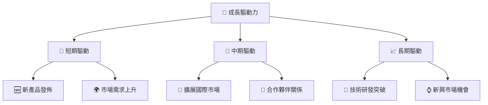

---

## 9. 風險矩陣

### 9.1 風險評分矩陣

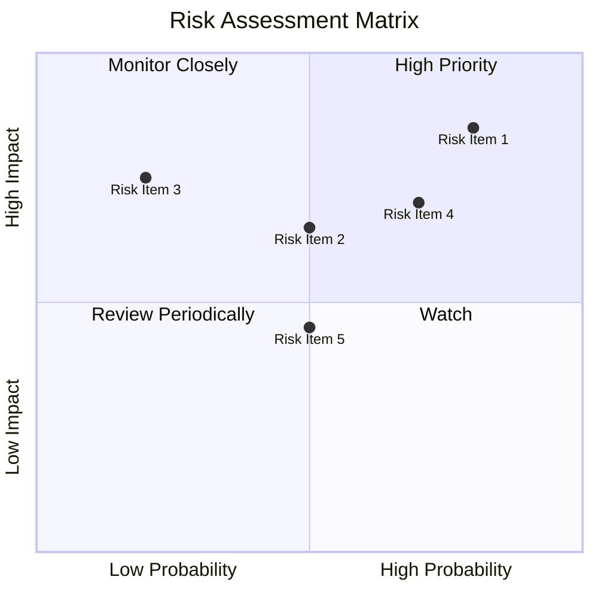

### 9.2 風險清單詳細分析

| # | 風險項目 | 發生機率 | 財務衝擊 | 風險評分 | 緩解措施 |
|---|----------|----------|----------|----------|----------|
| 1 | 🔴 **市場競爭加劇** | 高 (80%) | 高 (-10%收入) | 🔴 8.5/10 | 加強研發創新 |
| 2 | 🔴 **技術失敗風險** | 中 (60%) | 高 (-15%資本) | 🔴 7.8/10 | 提高技術驗證 |
| 3 | 🟡 **政策變動風險** | 低 (20%) | 中 (-5%收入) | 🟡 5.0/10 | 加強政策監測 |

---

## 10. 投資建議

### 10.1 最終綜合評級雷達圖

```
╔══════════════════════════════════════════════════════════════════╗
║                  投資建議綜合評級雷達圖                          ║
╠══════════════════════════════════════════════════════════════════╣
║                                                                  ║
║  基本面強度  7.0 ▓▓▓▓▓▓▓▓▓▓▓▓▓▓▓▓░░░░░  ★★★★☆                 ║
║  成長動能    8.0 ▓▓▓▓▓▓▓▓▓▓▓▓▓▓▓▓▓▓░░  ★★★★★                 ║
║  獲利品質    5.0 ▓▓▓▓▓▓▓▓▓▓░░░░░░░░░░░  ★★★☆☆                 ║
║  財務健康    6.0 ▓▓▓▓▓▓▓▓▓▓▓░░░░░░░░░░  ★★★★☆                 ║
║  估值合理性  6.0 ▓▓▓▓▓▓▓▓▓▓▓░░░░░░░░░░  ★★★★☆                 ║
║                                                                  ║
╚══════════════════════════════════════════════════════════════════╝
```

### 10.2 目標價與隱含報酬率

| 情境 | 目標價 | 隱含報酬率 | 機率權重 |
|------|-------|-----------|--------|
| 🟢 **樂觀** | $450 | +150% | 20% |
| 🟡 **基準** | $311.47 | +73% | 60% |
| 🔴 **悲觀** | $235 | +30% | 20% |

### 10.3 買入時機與觸發因素

```
╔══════════════════════════════════════════════════════════════════╗
║                  ✅ 買入觸發因素 Checklist                      ║
╠══════════════════════════════════════════════════════════════════╣
║                                                                  ║
║  立即買入觸發條件（多數符合）：                                  ║
║  ✅ 收入持續增長                                                 ║
║  ✅ 新產品成功發佈                                               ║
║  ✅ 市場需求回升                                                 ║
║                                                                  ║
║  加碼觸發條件（出現以下任一）：                                  ║
║  ☐ 自由現金流轉正                                               ║
║  ☐ 減少債務水平                                                 ║
║                                                                  ║
║  減碼/停損觸發條件（出現以下任一）：                             ║
║  ☐ 技術失敗或市場份額下降                                       ║
║  ☐ 政策變動導致市場環境惡化                                     ║
╚══════════════════════════════════════════════════════════════════╝
```

### 10.4 投資人適配度分析

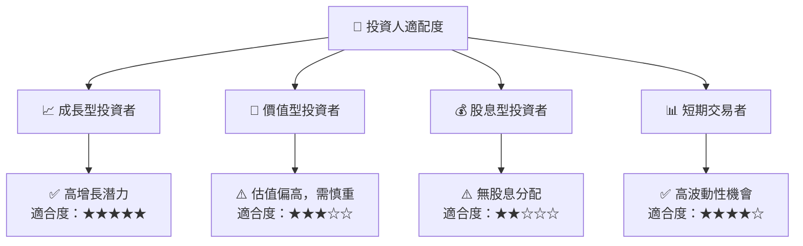

### 10.5 關鍵監控指標

| 監控類型 | 指標 | 關注點 | 頻率 |
|----------|------|--------|------|
| 業務表現 | 收入增長率 | 持續增長 | 季度 |
| 財務健康 | 自由現金流 | 轉正 | 季度 |
| 市場動態 | 新產品市場反應 | 市場接受度 | 即時 |
| 競爭環境 | 市場份額 | 保持或提升 | 年度 |

---

> **免責聲明**：本報告為 AI 自動生成，僅供研究參考，不構成投資建議。投資有風險，入市需謹慎。