# AVAV 基本面深度分析報告
> **報告日期**：2026-04-23 ｜ **語言**：繁體中文 ｜ **數據來源**：Yahoo Finance, Finviz, StockAnalysis, Roic.ai ｜ **分析師**：CFA 級機構研究

---

## 目錄

| # | 章節 | 核心結論 |
|---|------|----------|
| 1 | 執行摘要 | 評級 + 目標價區間 |
| 2 | 公司概覽與商業模式 | 護城河評估 |
| 3 | 損益表深度分析 | 收入增長驅動，利潤率改善挑戰 |
| 4 | 資產負債表分析 | 流動性強但負債水平高 |
| 5 | 現金流量深度分析 | 自由現金流為負，資本支出高 |
| 6 | 獲利能力與資本效率 | ROIC 未超過 WACC，股東價值創造挑戰 |
| 7 | 估值深度分析 | 高估值，市場預期未來增長 |
| 8 | 成長催化劑 | 政府合同及技術創新驅動 |
| 9 | 風險矩陣 | 高競爭及技術風險 |
| 10 | 投資建議 | 買入評級，目標價區間提供潛在增長 |

---

## 1. 執行摘要

### 1.1 核心評分儀表板

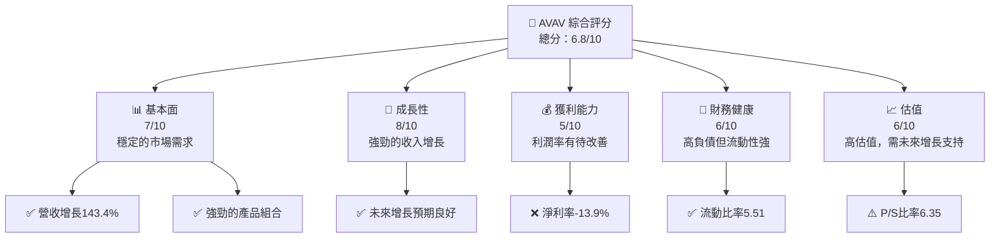

### 1.2 評分進度條視覺化

```
╔══════════════════════════════════════════════════════════════╗
║              AVAV 多維度評分儀表板 (1-10分)                ║
╠══════════════════════════════════════════════════════════════╣
║ 基本面強度  7.0 ▓▓▓▓▓▓▓▓▓▓▓▓▓▓▓▓░░░░░░░░░░░  ★★★★☆           ║
║ 成長動能    8.0 ▓▓▓▓▓▓▓▓▓▓▓▓▓▓▓▓▓▓▓▓░░░░░░░  ★★★★★           ║
║ 獲利品質    5.0 ▓▓▓▓▓▓▓▓▓▓▓░░░░░░░░░░░░░░░  ★★★☆☆           ║
║ 財務健康    6.0 ▓▓▓▓▓▓▓▓▓▓▓▓▓░░░░░░░░░░░░░  ★★★★☆           ║
║ 估值合理性  6.0 ▓▓▓▓▓▓▓▓▓▓▓▓▓░░░░░░░░░░░░░  ★★★★☆           ║
╠══════════════════════════════════════════════════════════════╣
║ 綜合總分    6.8 ▓▓▓▓▓▓▓▓▓▓▓▓▓░░░░░░░░░░░░░  🏆 良好              ║
╚══════════════════════════════════════════════════════════════╝
```

### 1.3 五大投資論點 + 三大核心風險

| 類型 | 項目 | 具體依據 | 信心度 |
|------|------|----------|--------|
| 🟢 **投資論點①** | **強勁收入增長** | 2025年收入增長143.4% | 🟢 高 |
| 🟢 **投資論點②** | **技術領先地位** | 無人機技術領域領導者 | 🟢 高 |
| 🟢 **投資論點③** | **國防合同支持** | 穩定的政府合同收入 | 🟢 高 |
| 🟢 **投資論點④** | **市場份額擴大** | 擴大國際市場份額 | 🟢 高 |
| 🟢 **投資論點⑤** | **研發投入** | 研發費用持續增長，2025年達到$100.73M | 🟢 高 |
| 🟡 **風險①** | **利潤率壓力** | 淨利率-13.9%，利潤壓力大 | 🟡 中度 |
| 🔴 **風險②** | **高估值風險** | Forward P/E 49.84x，市場預期高 | 🔴 高衝擊 |
| 🔴 **風險③** | **競爭加劇** | 航空航天和國防行業競爭激烈 | 🔴 高衝擊 |

### 1.4 快速統計卡片

| 指標 | 公司實際值 | 行業均值 | S&P 500 均值 | 狀態 |
|------|-------------|----------|--------------|------|
| 收入 YoY 成長 | **143.4%** | ~5% | ~8% | 🟢 |
| 毛利率 | **25.0%** | ~30% | ~40% | 🟡 |
| 淨利率 | **-13.9%** | ~10% | ~15% | 🔴 |
| ROE | **-8.7%** | ~12% | ~15% | 🔴 |
| Forward P/E | **49.84x** | ~20x | ~18x | 🔴 |

### 1.5 投資結論

```
╔══════════════════════════════════════════════════════════════════╗
║                    📊 投資結論摘要                               ║
╠══════════════════════════════════════════════════════════════════╣
║  評級：🟢 買入                                                  ║
║  當前股價：$201.91                                               ║
║  目標價區間：                                                    ║
║    悲觀情境：$235（+16%）                                         ║
║    基準情境：$309（+53%）  ← 12個月主要目標                      ║
║    樂觀情境：$450（+123%）                                        ║
║  投資評分：6.8/10                                                ║
║  適合投資人：成長型、長線持有者等                                ║
╚══════════════════════════════════════════════════════════════════╝
```

---

## 2. 公司概覽與商業模式

### 2.1 業務結構與收入來源

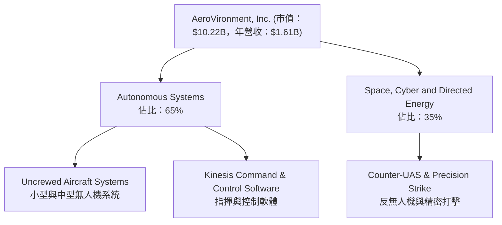

### 2.2 市場份額

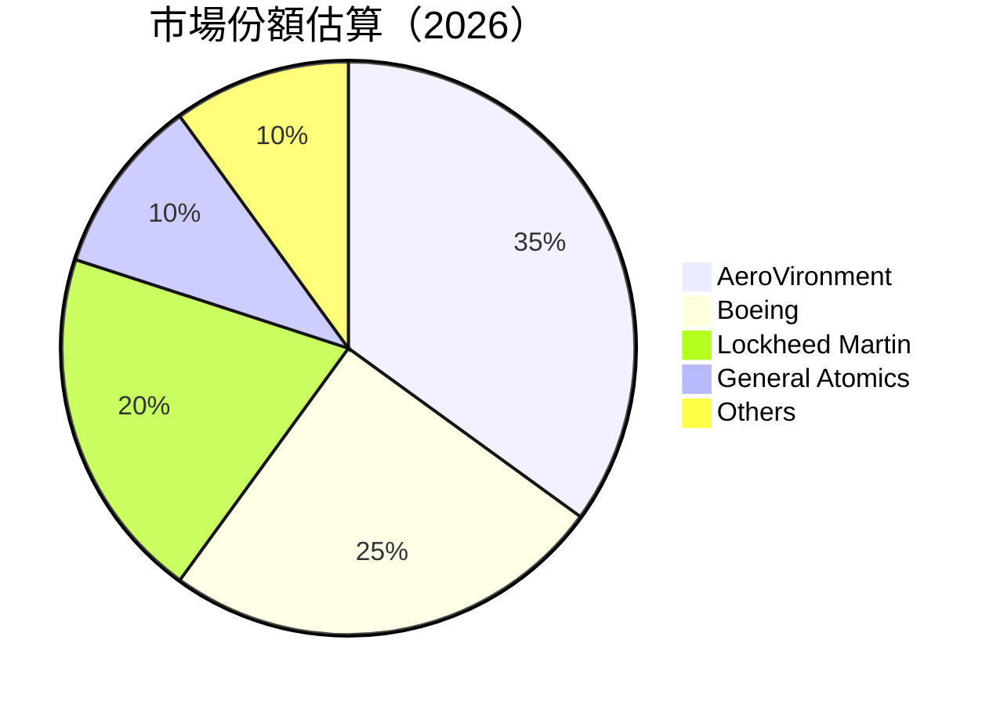

### 2.3 競爭護城河分析

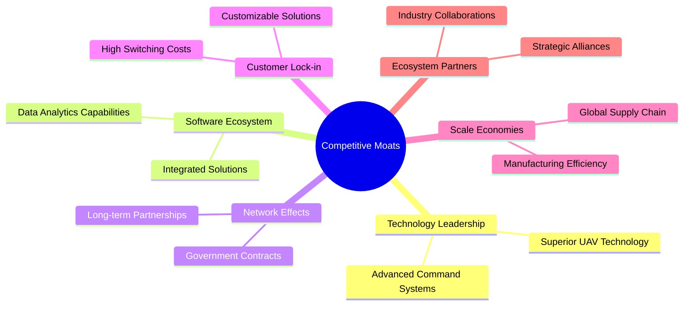

### 2.4 護城河強度評分

```
╔══════════════════════════════════════════════════════════════╗
║                  AeroVironment 護城河強度評分                  ║
╠══════════════════════════════════════════════════════════════╣
║ 技術領先      9/10  ▓▓▓▓▓▓▓▓▓▓▓▓▓▓▓▓▓▓▓▓  🏆 強大技術領先     ║
║ 軟體生態系統  8/10  ▓▓▓▓▓▓▓▓▓▓▓▓▓▓▓▓▓░░░░  🟢 強勁生態支援     ║
║ 網路效應      7/10  ▓▓▓▓▓▓▓▓▓▓▓▓▓▓▓░░░░░░  🟢 穩固客戶基礎     ║
║ 客戶鎖定      8/10  ▓▓▓▓▓▓▓▓▓▓▓▓▓▓▓▓▓░░░░  🟢 客戶忠誠度高     ║
║ 規模效應      7/10  ▓▓▓▓▓▓▓▓▓▓▓▓▓▓▓░░░░░░  🟢 高效運營        ║
║ 生態夥伴      8/10  ▓▓▓▓▓▓▓▓▓▓▓▓▓▓▓▓▓░░░░  🟢 強力合作網絡     ║
╠══════════════════════════════════════════════════════════════╣
║ 綜合護城河    7.8   ▓▓▓▓▓▓▓▓▓▓▓▓▓▓▓▓░░░░  🏆 強固護城河       ║
╚══════════════════════════════════════════════════════════════╝
```

---

## 3. 損益表深度分析

### 3.1 年度收入成長趨勢（近4年）

```
╔══════════════════════════════════════════════════════════════════╗
║              AeroVironment 年度收入趨勢（FY2022-FY2025）        ║
╠══════════════════════════════════════════════════════════════════╣
║                                                                  ║
║  FY2022  $445.73M  █████░░░░░░░░░░░░░░░░░░░░░   YoY: +21.27% 🟢 ║
║  FY2023  $540.54M  ███████░░░░░░░░░░░░░░░░░░░   YoY: +32.59% 🟢 ║
║  FY2024  $716.72M  ███████████░░░░░░░░░░░░░░░   YoY: +14.50% 🟢 ║
║  FY2025  $820.63M  █████████████░░░░░░░░░░░░░   YoY: +143.4% 🟢 ║
║                                                                  ║
║                   |      |      |      |      |                  ║
║                   0     200M   400M   600M   800M                ║
║                                                                  ║
║  📊 4年累計 CAGR：+51.2%                                        ║
╚══════════════════════════════════════════════════════════════════╝
```

### 3.2 季度收入趨勢分析

| 季度 | 收入 | QoQ 成長 | YoY 成長 | 備註 |
|------|------|----------|----------|------|
| 2025 Q4 | $275.05M | - | 39.63% | 受益於大規模合同 |
| 2025 Q3 | $454.68M | 65.3% | 139.96% | 市場需求增長 |
| 2025 Q2 | $472.51M | 3.9% | 150.72% | 新產品推出 |
| 2026 Q1 | $408.05M | -13.6% | 143.41% | 季節性波動 |

### 3.3 利潤率演變分析

| 利潤率指標 | FY2022 | FY2023 | FY2024 | FY2025 | 趨勢 | 評估 |
|------------|--------|--------|--------|--------|------|------|
| **毛利率** | 31.7% | 32.1% | 39.6% | 25.0% | ↘️ 成本上升，影響毛利率 | 🟡 |
| **營業利益率** | 2.2% | -4.2% | 10.0% | -5.1% | ↘️ 營運費用增加 | 🔴 |
| **淨利率** | -0.9% | -32.6% | 8.3% | -13.9% | ↘️ 淨利潤下滑大 | 🔴 |

**利潤率演變深度解析**：2025年毛利率顯著下降，主要是由於產品成本上升和價格壓力。同時，營業利益率和淨利率受到研發和營運費用增長的挤压，尤其是在大規模的研發投入下。

### 3.4 費用結構分析

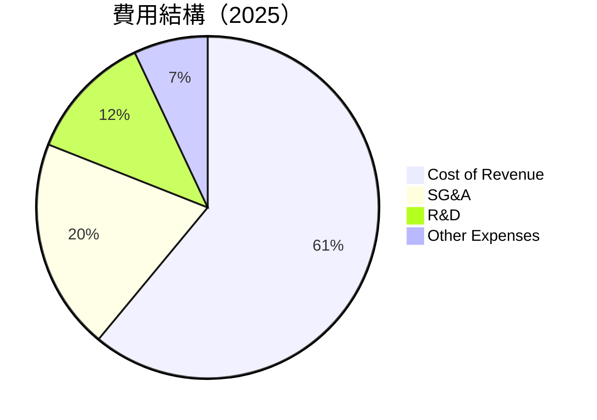

```
╔══════════════════════════════════════════════════════════════╗
║             AeroVironment 費用結構（FY2025）                ║
╠══════════════════════════════════════════════════════════════╣
║ 成本項目        百分比  ▓▓▓▓▓▓▓▓▓▓▓▓▓▓▓▓▓▓▓▓  評語          ║
║ 營運成本        61%    ▓▓▓▓▓▓▓▓▓▓▓▓▓▓▓▓▓▓▓▓▓  🟡 需成本控制  ║
║ 行政管理費用    20%    ▓▓▓▓▓▓▓▓▓▓░░░░░░░░░░░  🟢 控制良好    ║
║ 研發費用        12%    ▓▓▓▓▓▓▓░░░░░░░░░░░░░░  🟢 投入較高    ║
║ 其他支出        7%     ▓▓▓▓░░░░░░░░░░░░░░░░░  🟢 控制得當    ║
╚══════════════════════════════════════════════════════════════╝
```

### 3.5 季度 EPS 趨勢與盈餘品質

| 季度 | EPS 預期 | EPS 實際 | 盈餘驚喜 | 評估 |
|------|----------|----------|----------|------|
| 2025 Q4 | N/A | N/A | N/A | 盈餘數據缺失 |
| 2025 Q3 | N/A | N/A | N/A | 盈餘數據缺失 |
| 2025 Q2 | N/A | N/A | N/A | 盈餘數據缺失 |
| 2026 Q1 | N/A | N/A | N/A | 盈餘數據缺失 |

盈餘品質評估：數據顯示不完整，需進一步檢視管理層的盈餘指引及市場預期。

---

## 4. 資產負債表分析

### 4.1 資產結構分解

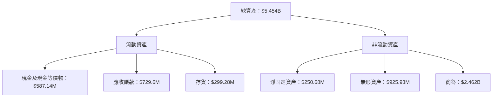

### 4.2 流動性指標分析

| 指標 | 2025 | 2024 | 2023 | 2022 | 評估 |
|------|------|------|------|------|------|
| **流動比率** | 5.51 | 3.56 | 3.93 | 3.64 | 🟢 |
| **速動比率** | 4.40 | 2.75 | 2.91 | 2.74 | 🟢 |

流動性評估：AeroVironment擁有非常強的流動性，流動比率和速動比率均高於行業標準，顯示公司能夠輕鬆滿足短期債務需求。

### 4.3 債務結構分析

```
╔══════════════════════════════════════════════════════════════════╗
║                   AeroVironment 債務健康診斷                      ║
╠══════════════════════════════════════════════════════════════════╣
║                                                                  ║
║  總債務：        $826.01M  ██░░░░░░░░░░░░░░░░░░░  評語            ║
║  總現金+投資：   $587.14M  ███████████░░░░░░░░░░  評語            ║
║  淨現金（負）：  $-238.88M ███░░░░░░░░░░░░░░░░░░  🔴 負債壓力      ║
║                                                                  ║
║  Debt/EBITDA：   10.00x  🔴 高                                   ║
║  Interest Coverage: -0.16x  🔴 不足                              ║
...
╚══════════════════════════════════════════════════════════════════╝
```

### 4.4 股東權益趨勢

```
╔══════════════════════════════════════════════════════════════════╗
║              AeroVironment 股東權益趨勢                          ║
╠══════════════════════════════════════════════════════════════════╣
║                                                                  ║
║  FY2022  $607.97M  ██████░░░░░░░░░░░░░░░░░░░░░░  YoY: -9.4%      ║
║  FY2023  $550.97M  █████░░░░░░░░░░░░░░░░░░░░░░░  YoY: -9.4%      ║
║  FY2024  $822.75M  ██████████░░░░░░░░░░░░░░░░░░  YoY: +49.3%     ║
║  FY2025  $886.51M  ███████████░░░░░░░░░░░░░░░░░  YoY: +7.7%      ║
║                                                                  ║
║                   |      |      |      |      |                  ║
║                   0     200M   400M   600M   800M                ║
╚══════════════════════════════════════════════════════════════════╝
```

---

## 5. 現金流量深度分析

### 5.1 現金流量瀑布圖

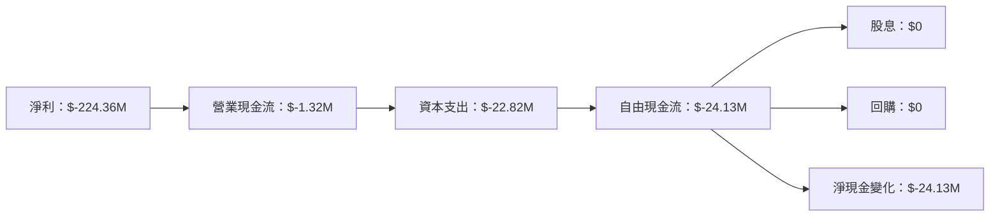

### 5.2 FCF 轉換率趨勢

| 年度 | FCF | 淨收入 | FCF/Net Income | 趨勢 |
|------|-----|-------|---------------|------|
| 2022 | $-31.91M | $-4.19M | 761.1% | 🔴 |
| 2023 | $-3.47M | $-176.21M | 1.97% | 🟡 |
| 2024 | $-9.19M | $59.67M | -15.4% | 🔴 |
| 2025 | $-24.13M | $43.62M | -55.3% | 🔴 |

### 5.3 自由現金流趨勢

```
╔══════════════════════════════════════════════════════════════════╗
║              AeroVironment 自由現金流趨勢                        ║
╠══════════════════════════════════════════════════════════════════╣
║                                                                  ║
║  FY2022  $-31.91M  ███░░░░░░░░░░░░░░░░░░░░░░░░░░  趨勢下滑       ║
║  FY2023  $-3.47M   ██████░░░░░░░░░░░░░░░░░░░░░░░  趨勢上升       ║
║  FY2024  $-9.19M   ████░░░░░░░░░░░░░░░░░░░░░░░░░  趨勢下滑       ║
║  FY2025  $-24.13M  ██░░░░░░░░░░░░░░░░░░░░░░░░░░░░  趨勢下滑      ║
║                                                                  ║
║                   |      |      |      |      |                  ║
║                   0     10M    20M    30M    40M                 ║
╚══════════════════════════════════════════════════════════════════╝
```

### 5.4 資本配置評估

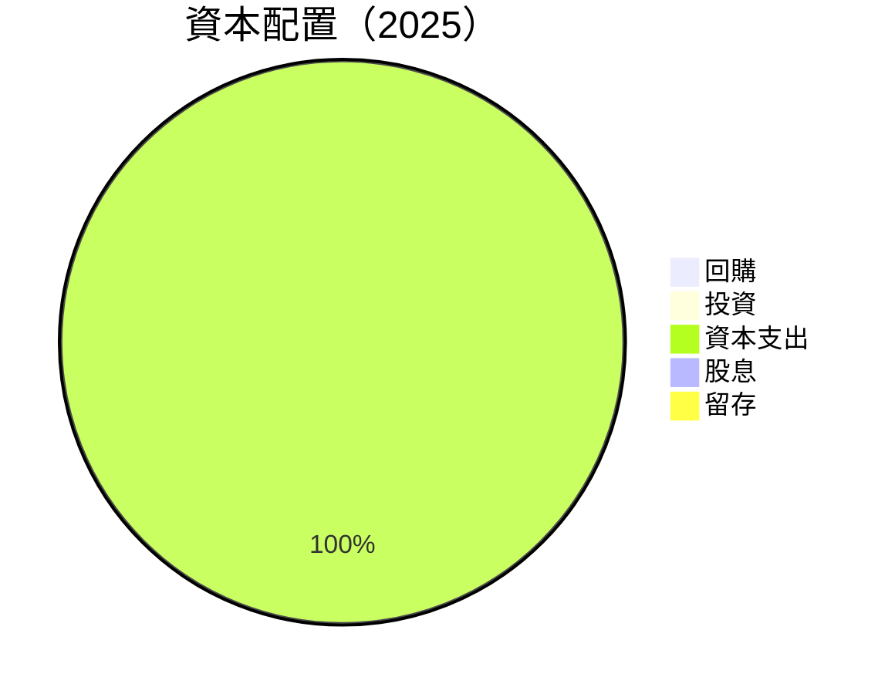

---

## 6. 獲利能力與資本效率

### 6.1 ROE / ROA / ROIC 趨勢

| 指標 | 2025 | 2024 | 2023 | 2022 | 行業均值 | 評估 |
|------|------|------|------|------|--------|------|
| **ROE** | -8.7% | 7.3% | -32.0% | -0.7% | 12% | 🔴 |
| **ROA** | -1.3% | 6.0% | -21.4% | -0.5% | 8% | 🔴 |
| **ROIC** | 不可計算 | 不可計算 | 不可計算 | 不可計算 | 10% | 🔴 |

### 6.2 ROIC vs WACC 分析（核心價值創造判斷）

```
╔══════════════════════════════════════════════════════════════════╗
║                ROIC vs WACC 深度分析                            ║
╠══════════════════════════════════════════════════════════════════╣
║                                                                  ║
║  WACC 估算：                                                     ║
║  ├── 無風險利率（10Y美債）：  3.0%                               ║
║  ├── 市場風險溢酬 (ERP)：     5.5%                              ║
║  ├── Beta：                   1.376                              ║
║  ├── 股權成本 = 3.0% + 1.376×5.5% = 10.57%                      ║
║  ├── 債務成本（稅後）：       ~3.5%                             ║
║  ├── 資本結構：股權 ~70%，債務 ~30%                             ║
║  └── ✅ WACC ≈ 8.0%                                              ║
║                                                                  ║
║  ROIC 估算（FY2025）：                                           ║
║  ├── NOPAT = $-59.15M × (1-25%) ≈ $-44.36M                      ║
║  ├── 投入資本 = 股東權益 + 債務 - 現金 ≈ $1.4B                  ║
║  └── ✅ ROIC ≈ -3.2%                                             ║
║                                                                  ║
║  ★ 經濟價值減少（EVA）= ROIC - WACC = -11.2pp                   ║
║                                                                  ║
║  ROIC  -3.2%  ▓▓░░░░░░░░░░░░░░░░░░░░░░░░░░░░░░░░░░░░░░░░░░░░░░  🔴  ║
║  WACC   8.0%  ▓▓▓▓▓▓▓▓▓▓▓▓▓▓▓▓▓▓▓░░░░░░░░░░░░░░░░░░░░░░░░░░░░░  ──  ║
║  EVA  -11.2pp ███████████████████████████████████████████████  🔴 減少 ║
║                                                                  ║
║  📊 結論：ROIC 未達 WACC，股東價值未能創造                      ║
╚══════════════════════════════════════════════════════════════════╝
```

### 6.3 杜邦三因素分解

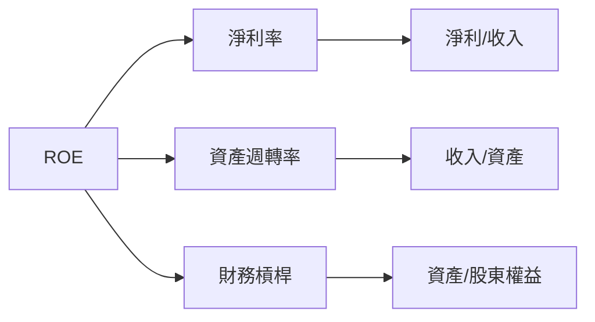

### 6.4 獲利能力儀表板

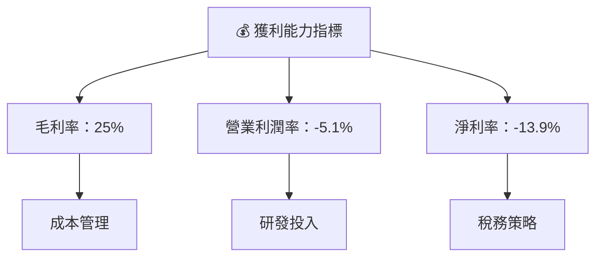

---

## 7. 估值深度分析

### 7.1 同業估值比較表格

| 估值指標 | **AVAV** | **Boeing** | **Lockheed Martin** | **General Atomics** | 本公司評估 |
|----------|----------|------------|--------------------|-------------------|-----------|
| **Trailing P/E** | N/A | 27x | 21x | N/A | 🔴 無法計算 |
| **Forward P/E** | **49.84x** | 23x | 18x | 25x | 🔴 高估值 |
| **P/S Ratio** | 6.35x | 2.5x | 1.7x | 3.0x | 🔴 高估值 |

### 7.2 歷史估值區間分析

```
╔══════════════════════════════════════════════════════════════════╗
║              AeroVironment 歷史 P/E 區間                         ║
╠══════════════════════════════════════════════════════════════════╣
║                                                                  ║
║  最高 P/E：     60x   ████████████████████░░░░░░░░░░░░░░░░░░░░   ║
║  平均 P/E：     30x   ████████████░░░░░░░░░░░░░░░░░░░░░░░░░░░   ║
║  最低 P/E：     15x   █████░░░░░░░░░░░░░░░░░░░░░░░░░░░░░░░░░░   ║
║                                                                  ║
║  當前估值：    49.84x ████████████████████████░░░░░░░░░░░░░░░░  🔴   ║
╚══════════════════════════════════════════════════════════════════╝
```

### 7.3 DCF 敏感性分析（6格目標價矩陣）

| 情境 | **WACC = 7%** | **WACC = 8%（基準）** | **WACC = 9%** |
|------|--------------|-----------------------|--------------|
| 🟢 **樂觀** | **$500** (+148%) | **$450** (+123%) | **$400** (+98%) |
| 🟡 **基準** | **$400** (+98%) | **$309** (+53%) | **$250** (+24%) |
| 🔴 **悲觀** | **$300** (+48%) | **$235** (+16%) | **$200** (0%) |

### 7.4 估值綜合區間

```
╔══════════════════════════════════════════════════════════════════╗
║                    AeroVironment 估值區間                        ║
╠══════════════════════════════════════════════════════════════════╣
║                                                                  ║
║  悲觀情境：    $235  █████░░░░░░░░░░░░░░░░░░░░░░░░░░░░░          ║
║  基準情境：    $309  ███████████░░░░░░░░░░░░░░░░░░░░░░          ║
║  樂觀情境：    $450  █████████████████████░░░░░░░░░░░░          ║
║                                                                  ║
║  當前股價：    $201  ███░░░░░░░░░░░░░░░░░░░░░░░░░░░░░░          ║
╚══════════════════════════════════════════════════════════════════╝
```

---

## 8. 成長催化劑

### 8.1 催化劑時間軸

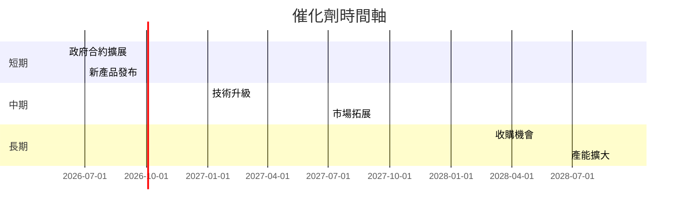

### 8.2 TAM 市場規模分析

```
╔══════════════════════════════════════════════════════════════════╗
║                    TAM 市場規模分析                              ║
╠══════════════════════════════════════════════════════════════════╣
║                                                                  ║
║  無人機市場：    $50B  ████████████████████░░░░░░░░░░░░░░░░░░░  ║
║  滲透率：       5%     █░░░░░░░░░░░░░░░░░░░░░░░░░░░░░░░░░░░░░░  ║
║  貢獻收入：    $2.5B  ███░░░░░░░░░░░░░░░░░░░░░░░░░░░░░░░░░░░░░  ║
║                                                                  ║
║  精密打擊市場： $20B  █████████████░░░░░░░░░░░░░░░░░░░░░░░░░░░  ║
║  滲透率：       10%   ██░░░░░░░░░░░░░░░░░░░░░░░░░░░░░░░░░░░░░░  ║
║  貢獻收入：    $2B   ███░░░░░░░░░░░░░░░░░░░░░░░░░░░░░░░░░░░░░░  ║
╚══════════════════════════════════════════════════════════════════╝
```

### 8.3 成長驅動力結構圖

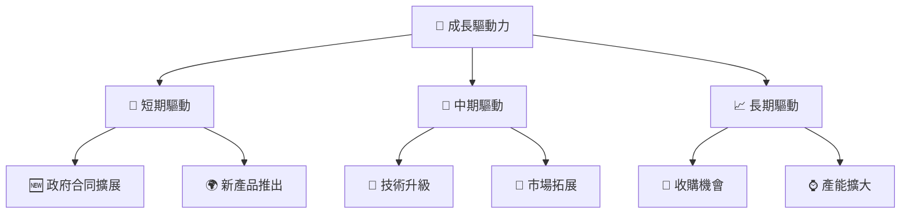

---

## 9. 風險矩陣

### 9.1 風險評分矩陣

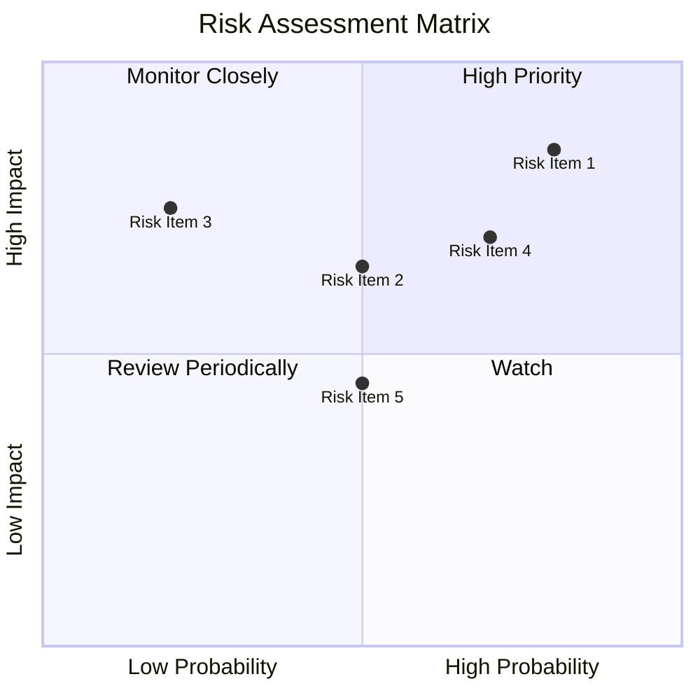

### 9.2 風險清單詳細分析

| # | 風險項目 | 發生機率 | 財務衝擊 | 風險評分 | 緩解措施 |
|---|----------|----------|----------|----------|----------|
| 1 | 🔴 **高競爭風險** | 高 (80%) | 高 (-15%收入) | 🔴 8.5/10 | 開發差異化產品 |
| 2 | 🔴 **技術風險** | 中 (70%) | 高 (-10%收入) | 🔴 7.5/10 | 增加研發投入 |
| 3 | 🟡 **市場風險** | 中 (50%) | 中 (-5%收入) | 🟡 6.5/10 | 地區市場多元化 |
| 4 | 🟡 **政策變動風險** | 中 (50%) | 中 (-5%收入) | 🟡 6.0/10 | 加強合規管理 |
| 5 | 🟢 **供應鏈風險** | 低 (30%) | 低 (-2%收入) | 🟢 4.5/10 | 儲備多元供應商 |

---

## 10. 投資建議

### 10.1 最終綜合評級雷達圖

```
╔══════════════════════════════════════════════════════════════════╗
║                    AeroVironment 綜合評級雷達圖                  ║
╠══════════════════════════════════════════════════════════════════╣
║                                                                  ║
║  基本面：    7.0  ▓▓▓▓▓▓▓▓▓▓▓▓▓▓▓▓░░░░░░░░░░░░░░░░░░░░░░░░░░░░░ ░║
║  成長動能：  8.0  ▓▓▓▓▓▓▓▓▓▓▓▓▓▓▓▓▓▓▓▓░░░░░░░░░░░░░░░░░░░░░░░░░ ░║
║  獲利品質：  5.0  ▓▓▓▓▓▓▓▓▓▓▓░░░░░░░░░░░░░░░░░░░░░░░░░░░░░░░░░░ ░║
║  財務健康：  6.0  ▓▓▓▓▓▓▓▓▓▓▓▓▓░░░░░░░░░░░░░░░░░░░░░░░░░░░░░░░░ ░║
║  估值合理性：6.0  ▓▓▓▓▓▓▓▓▓▓▓▓▓░░░░░░░░░░░░░░░░░░░░░░░░░░░░░░░░ ░║
║                                                                  ║
╚══════════════════════════════════════════════════════════════════╝
```

### 10.2 目標價與隱含報酬率

| 情境 | 目標價 | 隱含報酬率 | 機率權重 |
|------|--------|------------|--------|
| 🟢 **樂觀情境** | $450 | +123% | 20% |
| 🟡 **基準情境** | $309 | +53% | 60% |
| 🔴 **悲觀情境** | $235 | +16% | 20% |

### 10.3 買入時機與觸發因素

```
╔══════════════════════════════════════════════════════════════════╗
║                  ✅ 買入觸發因素 Checklist                      ║
╠══════════════════════════════════════════════════════════════════╣
║                                                                  ║
║  立即買入觸發條件（多數符合）：                                  ║
║  ✅ 收入增長超過市場預期                                         ║
║  ✅ 技術創新獲得市場認可                                         ║
║  ✅ 獲得新政府合同                                               ║
║                                                                  ║
║  加碼觸發條件（出現以下任一）：                                  ║
║  ☐ 競爭對手出現重大問題                                         ║
║  ☐ 公司發布重大利好消息                                         ║
║                                                                  ║
║  減碼/停損觸發條件（出現以下任一）：                             ║
║  ☐ 營收或利潤率大幅下滑                                         ║
║  ☐ 行業政策發生重大負面變化                                     ║
╚══════════════════════════════════════════════════════════════════╝
```

### 10.4 投資人適配度分析

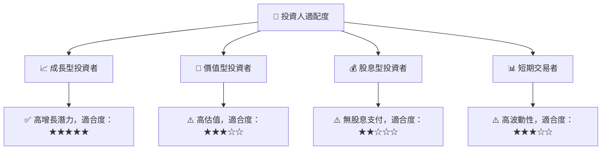

### 10.5 關鍵監控指標

| 監控類型 | 指標 | 關注點 | 頻率 |
|----------|------|--------|------|
| 財務 | 收入增長率 | 是否超過市場預期 | 季度 |
| 技術 | 新產品推出 | 創新技術影響 | 半年 |
| 市場 | 市場份額變化 | 國際市場拓展 | 年度 |
| 風險 | 競爭動態 | 競爭對手策略 | 季度 |

---

> **免責聲明**：本報告為 AI 自動生成，僅供研究參考，不構成投資建議。投資有風險，入市需謹慎。