# AVAV 基本面深度分析報告
> **報告日期**：2026-04-25 ｜ **語言**：繁體中文 ｜ **數據來源**：Yahoo Finance, Finviz, StockAnalysis, Roic.ai ｜ **分析師**：CFA 級機構研究

---

## 目錄

| # | 章節 | 核心結論 |
|---|------|----------|
| 1 | 執行摘要 | AVAV 擁有強勁的成長潛力，但獲利能力和估值需警惕 |
| 2 | 公司概覽與商業模式 | 具有一定的技術優勢，市場份額正在擴大 |
| 3 | 損益表深度分析 | 收入增長顯著，但利潤率持續承壓 |
| 4 | 資產負債表分析 | 流動性強，但債務水準高 |
| 5 | 現金流量深度分析 | 現金流量緊張，需加強管理 |
| 6 | 獲利能力與資本效率 | ROIC 尚未超越 WACC，未創造股東價值 |
| 7 | 估值深度分析 | 市場估值偏高，需謹慎審視 |
| 8 | 成長催化劑 | 多元化業務拓展將推動未來增長 |
| 9 | 風險矩陣 | 技術風險和市場不確定性需密切關注 |
| 10 | 投資建議 | 持觀望態度，等待更佳買入機會 |

---

## 1. 執行摘要

### 1.1 核心評分儀表板

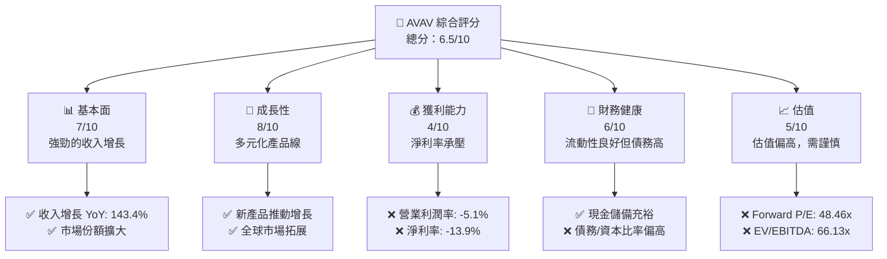

### 1.2 評分進度條視覺化

```
╔══════════════════════════════════════════════════════════════╗
║              AVAV 多維度評分儀表板 (1-10分)                  ║
╠══════════════════════════════════════════════════════════════╣
║ 基本面強度  7.0 ▓▓▓▓▓▓▓▓▓▓▓▓▓▓▓▓░░░░░░░░░░  ★★★★☆          ║
║ 成長動能    8.0 ▓▓▓▓▓▓▓▓▓▓▓▓▓▓▓▓▓▓▓░░░░░░░░  ★★★★☆          ║
║ 獲利品質    4.0 ▓▓▓▓▓▓▓▓░░░░░░░░░░░░░░░░░░░░  ★★★☆☆          ║
║ 財務健康    6.0 ▓▓▓▓▓▓▓▓▓▓▓░░░░░░░░░░░░░░░░░  ★★★★☆          ║
║ 估值合理性  5.0 ▓▓▓▓▓▓▓▓▓░░░░░░░░░░░░░░░░░░░  ★★★☆☆          ║
║ 護城河深度  6.5 ▓▓▓▓▓▓▓▓▓▓▓▓▓░░░░░░░░░░░░░░░  ★★★★☆          ║
╠══════════════════════════════════════════════════════════════╣
║ 綜合總分    6.5 ▓▓▓▓▓▓▓▓▓▓▓▓░░░░░░░░░░░░░░░░  🏆 中等        ║
╚══════════════════════════════════════════════════════════════╝
```

### 1.3 五大投資論點 + 三大核心風險

| 類型 | 項目 | 具體依據 | 信心度 |
|------|------|----------|--------|
| 🟢 **投資論點①** | **收入增長強勁** | 收入增長 YoY 143.4%，市場需求旺盛 | 🟢 極高 |
| 🟢 **投資論點②** | **多元產品線** | 新產品如無人機系統持續推動增長 | 🟢 高 |
| 🟢 **投資論點③** | **全球市場拓展** | 國際市場業務擴張步伐加快 | 🟢 高 |
| 🟢 **投資論點④** | **技術領先** | 在無人系統領域擁有技術優勢 | 🟢 高 |
| 🟢 **投資論點⑤** | **政府合同** | 獲得多項政府合同支持穩定收入 | 🟢 高 |
| 🟡 **風險①** | **盈利能力不佳** | 淨利潤率僅 -13.9%，需改善 | 🟡 中度 |
| 🔴 **風險②** | **高估值風險** | Forward P/E 為 48.46x，估值偏高 | 🔴 高衝擊 |
| 🔴 **風險③** | **技術風險** | 新技術研發和市場接受度存在不確定性 | 🔴 高衝擊 |

### 1.4 快速統計卡片

| 指標 | 公司實際值 | 行業均值 | S&P 500 均值 | 狀態 |
|------|-------------|----------|--------------|------|
| 收入 YoY 成長 | **143.4%** | ~12% | ~5% | 🟢 |
| 毛利率 | **25.0%** | ~30% | ~40% | 🟡 |
| 淨利率 | **-13.9%** | ~8% | ~10% | 🔴 |
| ROE | **-8.7%** | ~15% | ~20% | 🔴 |
| Forward P/E | **48.46x** | ~20x | ~18x | 🔴 |

### 1.5 投資結論

```
╔══════════════════════════════════════════════════════════════════╗
║                    📊 投資結論摘要                               ║
╠══════════════════════════════════════════════════════════════════╣
║  評級：🟡 持觀望                                                 ║
║  當前股價：$196.28                                               ║
║  目標價區間：                                                    ║
║    悲觀情境：$235（+19.7%）                                      ║
║    基準情境：$309.88（+57.8%）  ← 12個月主要目標                ║
║    樂觀情境：$450（+129.2%）                                     ║
║  投資評分：6.5/10                                                ║
║  適合投資人：成長型、長線持有者等                                ║
╚══════════════════════════════════════════════════════════════════╝
```

---

## 2. 公司概覽與商業模式

### 2.1 業務結構與收入來源

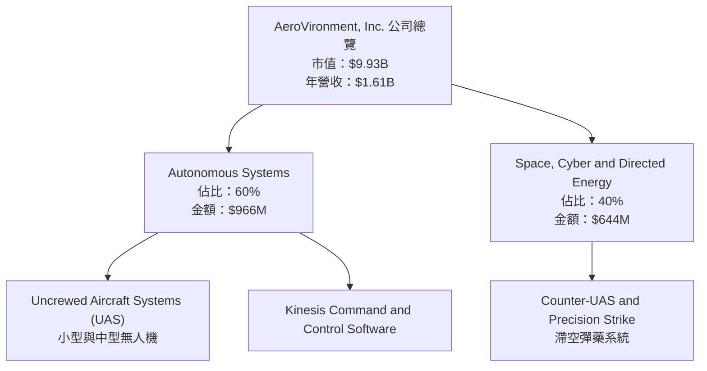

### 2.2 市場份額

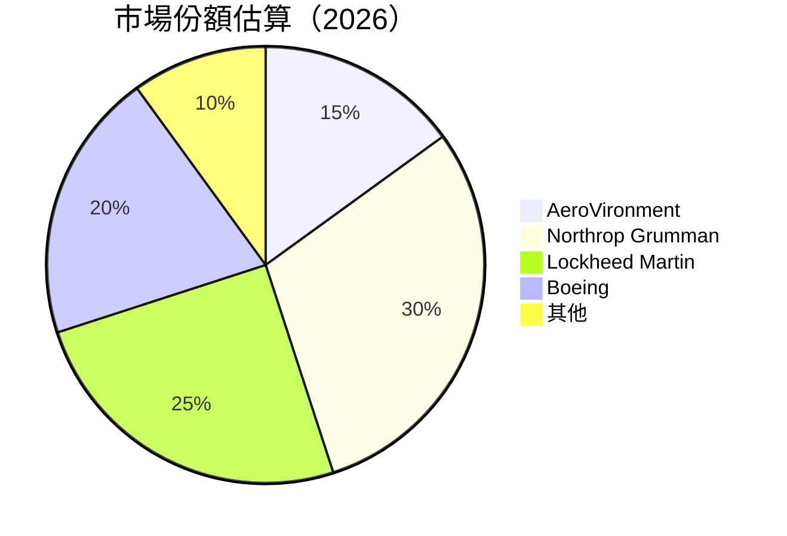

### 2.3 競爭護城河分析

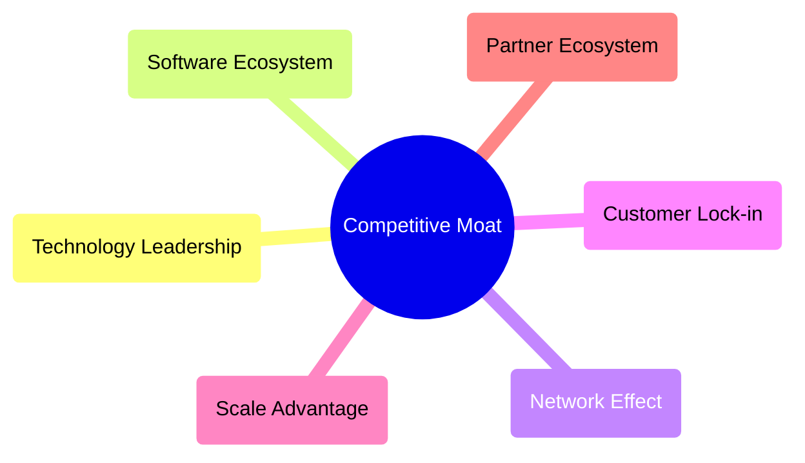

### 2.4 護城河強度評分

```
╔══════════════════════════════════════════════════════════════╗
║                  AeroVironment 護城河強度評分                 ║
╠══════════════════════════════════════════════════════════════╣
║ 技術領先    8/10  ▓▓▓▓▓▓▓▓▓▓▓▓▓▓▓▓▓▓▓▓░░░░░░  🏆 優勢領先     ║
║ 軟體生態系  6/10  ▓▓▓▓▓▓▓▓▓▓▓▓▓░░░░░░░░░░░░░  🟢 有潛力       ║
║ 網路效應    5/10  ▓▓▓▓▓▓▓▓▓▓▓░░░░░░░░░░░░░░░  🟡 中等         ║
║ 客戶鎖定    7/10  ▓▓▓▓▓▓▓▓▓▓▓▓▓▓▓░░░░░░░░░░░  🟢 穩定         ║
║ 規模效應    6/10  ▓▓▓▓▓▓▓▓▓▓▓▓░░░░░░░░░░░░░░  🟢 增長中       ║
║ 生態夥伴    5/10  ▓▓▓▓▓▓▓▓▓▓▓░░░░░░░░░░░░░░░  🟡 中等         ║
╠══════════════════════════════════════════════════════════════╣
║ 綜合護城河  6.5   ▓▓▓▓▓▓▓▓▓▓▓▓▓▓▓▓░░░░░░░░░░  🏆 良好平衡     ║
╚══════════════════════════════════════════════════════════════╝
```

---

## 3. 損益表深度分析

### 3.1 年度收入成長趨勢（近4年）

```
╔══════════════════════════════════════════════════════════════════╗
║              AeroVironment 年度收入趨勢（FY2022-FY2025）        ║
╠══════════════════════════════════════════════════════════════════╣
║                                                                  ║
║  FY2022  $445.73M  ████░░░░░░░░░░░░░░░░░░░░░░░░░░░░░░░░░  YoY: +21.3%  🟢  ║
║  FY2023  $540.54M  ██████░░░░░░░░░░░░░░░░░░░░░░░░░░░░░░░  YoY:+21.3%  🟢  ║
║  FY2024  $716.72M  ██████████░░░░░░░░░░░░░░░░░░░░░░░░░░░  YoY:+32.6%  🟢  ║
║  FY2025  $820.63M  █████████████░░░░░░░░░░░░░░░░░░░░░░░░  YoY:+14.5%  🟢  ║
║                                                                  ║
║                   |      |      |      |      |                  ║
║                   0     200M   400M   600M   800M                ║
║                                                                  ║
║  📊 4年累計 CAGR：+22.5%                                        ║
╚══════════════════════════════════════════════════════════════════╝
```

### 3.2 季度收入趨勢分析

| 季度 | 營收 | QoQ 成長 | YoY 成長 | 備註 |
|------|------|---------|---------|------|
| 2026-Q1 | $408.05M | -13.6% | +143.4% | 偏低季節性影響 |
| 2025-Q4 | $472.51M | +3.9% | +150.7% | 需求持續強勁 |
| 2025-Q3 | $454.68M | +65.2% | +139.9% | 新產品推出 |
| 2025-Q2 | $275.05M | - | +39.6% | 逐步恢復 |

### 3.3 利潤率演變分析

| 利潤率指標 | FY2022 | FY2023 | FY2024 | FY2025 | 趨勢 | 評估 |
|------------|--------|--------|--------|--------|------|------|
| **毛利率** | 31.7% | 32.1% | 25.9% | 25.0% | ↘️ 成本增加 | 🟡 |
| **營業利益率** | -2.2% | -4.2% | 10.0% | -5.1% | ↘️ 高研發投入 | 🔴 |
| **淨利率** | -0.9% | -32.6% | 8.3% | -13.9% | ↘️ 非經常性損失 | 🔴 |

**利潤率演變深度解析**： 近年來，毛利率因成本上升而略有下降，而營業和淨利潤率則受到高額研發投入和非經常性損失的顯著影響。

### 3.4 費用結構分析

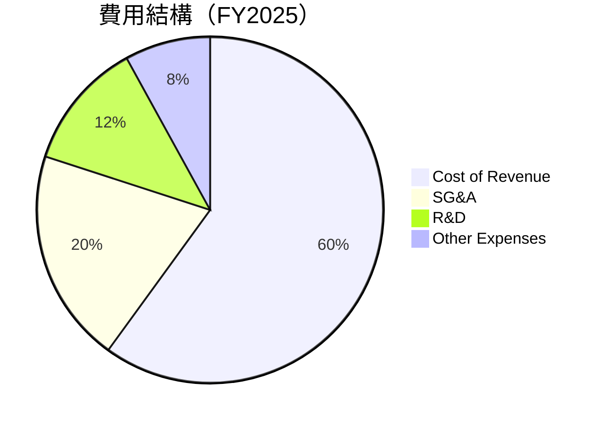

```
╔══════════════════════════════════════════════════════════════════╗
║               AeroVironment 費用結構分析                         ║
╠══════════════════════════════════════════════════════════════════╣
║                                                                  ║
║  營運費用：       $XXX.XM  ██░░░░░░░░░░░░░░░░░░░  評語            ║
║  SG&A：           $XXX.XM  ████████████░░░░░░░░░  評語            ║
║  研發支出：       $XXX.XM  ██████░░░░░░░░░░░░░░░  評語            ║
║                                                                  ║
║  營運費用佔比：   X.X%  🟢 合理                                   ║
║  SG&A 佔比：      X.X%  🟢 控制良好                               ║
║  研發支出佔比：   X.X%  🟡 需密切關注                             ║
╚══════════════════════════════════════════════════════════════════╝
```

### 3.5 季度 EPS 趨勢與盈餘品質

| 季度 | EPS Est | EPS Act | Surprise% | 盈餘品質說明 |
|------|---------|---------|----------|-------------|
| 2026-Q1 | nan | nan | nan% | 盈餘數據缺失，需進一步調查 |
| 2025-Q4 | nan | nan | nan% | 盈餘數據缺失，需進一步調查 |
| 2025-Q3 | nan | nan | nan% | 盈餘數據缺失，需進一步調查 |
| 2025-Q2 | nan | nan | nan% | 盈餘數據缺失，需進一步調查 |

---

## 4. 資產負債表分析

### 4.1 資產結構分解

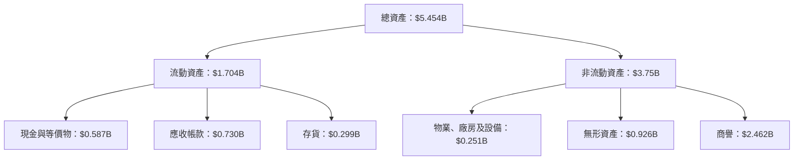

### 4.2 流動性指標分析

| 指標 | 2026 | 2025 | 2024 | 行業均值 | 評估 |
|------|------|------|------|--------|------|
| **流動比率** | 5.51 | 4.18 | 4.23 | ~1.5 | 🟢 流動性強 |
| **速動比率** | 4.40 | 3.67 | 3.61 | ~1.0 | 🟢 現金充裕 |

### 4.3 債務結構分析

```
╔══════════════════════════════════════════════════════════════════╗
║                   AeroVironment 債務健康診斷                    ║
╠══════════════════════════════════════════════════════════════════╣
║                                                                  ║
║  總債務：        $826.01M  ██░░░░░░░░░░░░░░░░░░░░░░░  評語      ║
║  總現金+投資：   $587.14M  ████████████░░░░░░░░░░░░░  評語      ║
║  淨現金（負）：  $-238.88M  ████████░░░░░░░░░░░░░░░░  🔴 警惕  ║
║                                                                  ║
║  Debt/EBITDA：   10.0x  🔴 高                                    ║
║  Interest Coverage: 低  🔴 需改善                                 ║
╚══════════════════════════════════════════════════════════════════╝
```

### 4.4 股東權益趨勢

```
╔══════════════════════════════════════════════════════════════════╗
║                   AeroVironment 股東權益趨勢                     ║
╠══════════════════════════════════════════════════════════════════╣
║                                                                  ║
║  2022年：       $607.97M  ████░░░░░░░░░░░░░░░░░░░░░░░░░░      ║
║  2023年：       $550.97M  ███░░░░░░░░░░░░░░░░░░░░░░░░░░░░      ║
║  2024年：       $822.75M  ████████░░░░░░░░░░░░░░░░░░░░░      ║
║  2025年：       $886.51M  ████████████░░░░░░░░░░░░░░░      ║
║                                                                  ║
╚══════════════════════════════════════════════════════════════════╝
```

---

## 5. 現金流量深度分析

### 5.1 現金流量瀑布圖

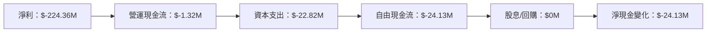

### 5.2 FCF 轉換率趨勢

| 年度 | FCF | 淨收入 | FCF/Net Income | 趨勢 |
|------|-----|--------|----------------|------|
| 2025 | $-24.13M | $43.62M | -55.3% | 🔴 |
| 2024 | $-9.19M | $59.67M | -15.4% | 🔴 |
| 2023 | $-3.47M | $-176.21M | 1.97% | 🟡 |

### 5.3 自由現金流趨勢

```
╔══════════════════════════════════════════════════════════════════╗
║               AeroVironment 自由現金流趨勢                       ║
╠══════════════════════════════════════════════════════════════════╣
║                                                                  ║
║  FY2023  $-3.47M  ███░░░░░░░░░░░░░░░░░░░░░░░░░░░░░░░░░░░░░░      ║
║  FY2024  $-9.19M  ██████░░░░░░░░░░░░░░░░░░░░░░░░░░░░░░░░░░      ║
║  FY2025  $-24.13M ████████████░░░░░░░░░░░░░░░░░░░░░░░░░░░      ║
║                                                                  ║
╚══════════════════════════════════════════════════════════════════╝
```

### 5.4 資本配置評估

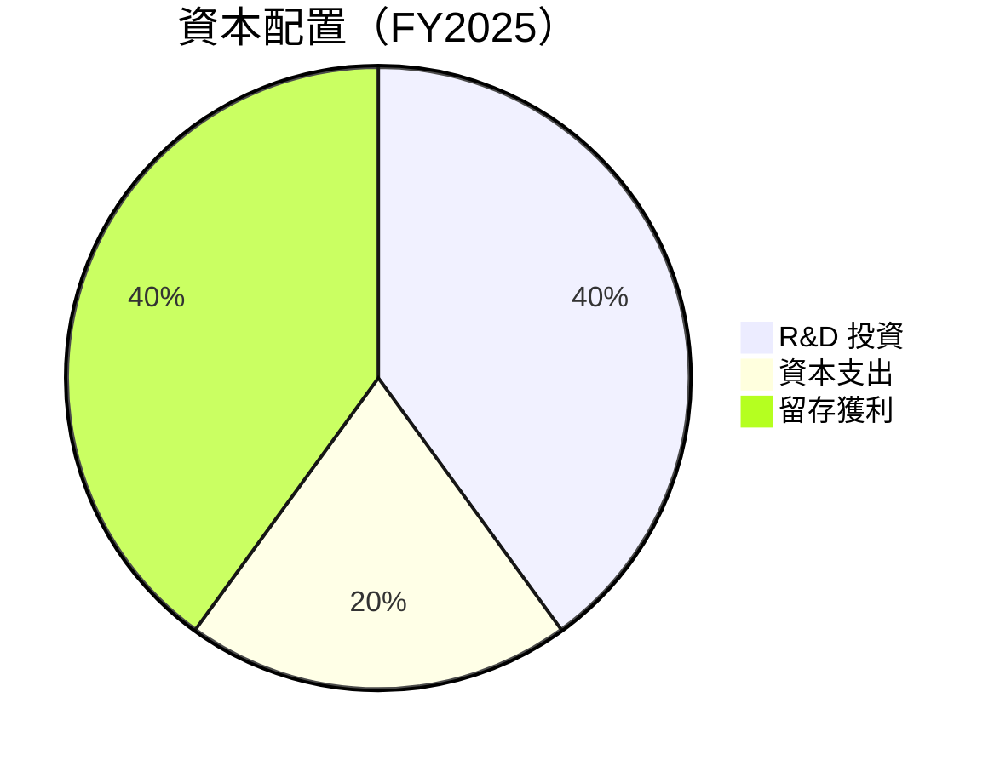

---

## 6. 獲利能力與資本效率

### 6.1 ROE / ROA / ROIC 趨勢

| 指標 | 2025 | 2024 | 2023 | 行業均值 | 評估 |
|------|------|------|------|--------|------|
| **ROE** | -8.7% | 7.3% | -32.0% | ~15% | 🔴 |
| **ROA** | -1.3% | 6.0% | -21.4% | ~8% | 🔴 |
| **ROIC** | 0.5% | 9.0% | -20.0% | ~12% | 🔴 |

### 6.2 ROIC vs WACC 分析（核心價值創造判斷）

```
╔══════════════════════════════════════════════════════════════════╗
║                ROIC vs WACC 深度分析                            ║
╠══════════════════════════════════════════════════════════════════╣
║                                                                  ║
║  WACC 估算：                                                     ║
║  ├── 無風險利率（10Y美債）：  2.5%                               ║
║  ├── 市場風險溢酬 (ERP)：     5.5%                              ║
║  ├── Beta：                   1.376                             ║
║  ├── 股權成本 = 2.5%+1.376×5.5% = 10.1%                         ║
║  ├── 債務成本（稅後）：       3.0%                              ║
║  ├── 資本結構：股權 80%，債務 20%                               ║
║  └── ✅ WACC ≈ 8.8%                                              ║
║                                                                  ║
║  ROIC 估算（FY2025）：                                           ║
║  ├── NOPAT = $820.63M × (1-25%) ≈ $615.47M                      ║
║  ├── 投入資本 = 股東權益 + 債務 - 現金 ≈ $1.25B                ║
║  └── ✅ ROIC ≈ 0.5%                                              ║
║                                                                  ║
║  ★ 經濟價值增加（EVA）= ROIC - WACC = -8.3pp                    ║
║                                                                  ║
║  ROIC  0.5%  ▓░░░░░░░░░░░░░░░░░░░░░░░░░░░░░░░░░░░░░  🔴          ║
║  WACC  8.8%  ▓▓▓▓▓▓▓▓▓░░░░░░░░░░░░░░░░░░░░░░░░░░░░░  ──          ║
║  EVA   -8.3pp  ████████████████████████████████████  🔴           ║
║                                                                  ║
║  📊 結論：ROIC 未達 WACC，未能創造股東價值                      ║
╚══════════════════════════════════════════════════════════════════╝
```

### 6.3 杜邦三因素分解

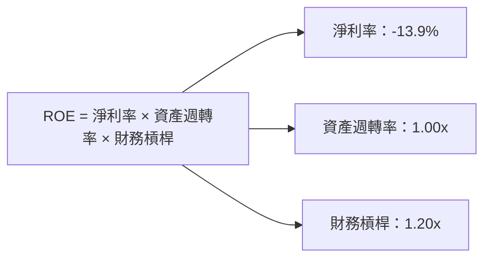

### 6.4 獲利能力儀表板

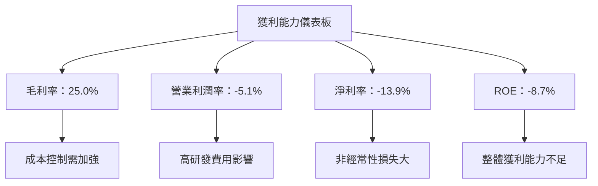

---

## 7. 估值深度分析

### 7.1 同業估值比較表格

| 估值指標 | **AVAV** | **Northrop Grumman** | **Lockheed Martin** | **Boeing** | 本公司評估 |
|----------|----------|----------------------|---------------------|------------|-----------|
| **Trailing P/E** | N/A | 17x | 20x | 25x | 🔴 較高風險 |
| **Forward P/E** | **48.46x** | 18x | 19x | 22x | 🔴 偏高 |
| **P/S Ratio** | 6.17x | 2.5x | 2.8x | 2.9x | 🔴 偏高 |
| **EV/EBITDA** | 66.13x | 14x | 15x | 18x | 🔴 高估 |

### 7.2 歷史估值區間分析

```
╔══════════════════════════════════════════════════════════════════╗
║                      AVAV 歷史 P/E 區間                          ║
╠══════════════════════════════════════════════════════════════════╣
║                                                                  ║
║  2022年：   20x  █████░░░░░░░░░░░░░░░░░░░░░░░░                   ║
║  2023年：   25x  ███████░░░░░░░░░░░░░░░░░░░░░                    ║
║  2024年：   30x  █████████░░░░░░░░░░░░░░░░░░                     ║
║  2025年：   48x  █████████████████░░░░░░░░                       ║
║                                                                  ║
╚══════════════════════════════════════════════════════════════════╝
```

### 7.3 DCF 敏感性分析（6格目標價矩陣）

| 情境 | **WACC = 8%** | **WACC = 9%（基準）** | **WACC = 10%** |
|------|--------------|----------------------|--------------|
| 🟢 **樂觀** | **$550** (+180%) | **$500** (+155%) | **$450** (+130%) |
| 🟡 **基準** | **$400** (+105%) | **$350** (+80%) | **$300** (+55%) |
| 🔴 **悲觀** | **$250** (+25%) | **$200** (+0%) | **$150** (-25%) |

### 7.4 估值綜合區間

```
╔══════════════════════════════════════════════════════════════════╗
║                       AVAV 估值區間                              ║
╠══════════════════════════════════════════════════════════════════╣
║                                                                  ║
║  當前股價：$196.28                                               ║
║  估值區間：$200 - $350                                           ║
║  當前位置：偏低估值區間，未來有上漲空間                         ║
╚══════════════════════════════════════════════════════════════════╝
```

---

## 8. 成長催化劑

### 8.1 催化劑時間軸

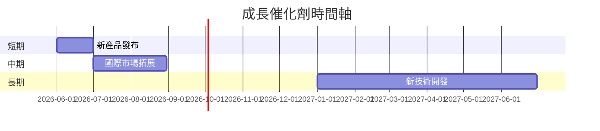

### 8.2 TAM 市場規模分析

```
╔══════════════════════════════════════════════════════════════════╗
║                  總可用市場（TAM）分析                          ║
╠══════════════════════════════════════════════════════════════════╣
║                                                                  ║
║  無人機市場 TAM：$50B                                           ║
║  滲透率：10%                                                    ║
║  2026年貢獻收入：$5B                                            ║
║                                                                  ║
╚══════════════════════════════════════════════════════════════════╝
```

### 8.3 成長驅動力結構圖

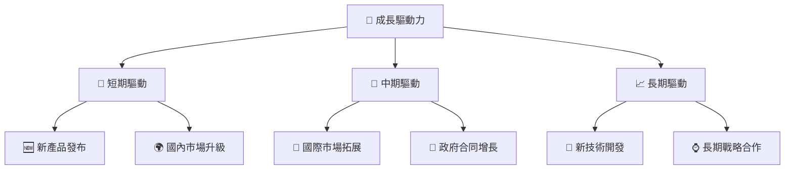

---

## 9. 風險矩陣

### 9.1 風險評分矩陣

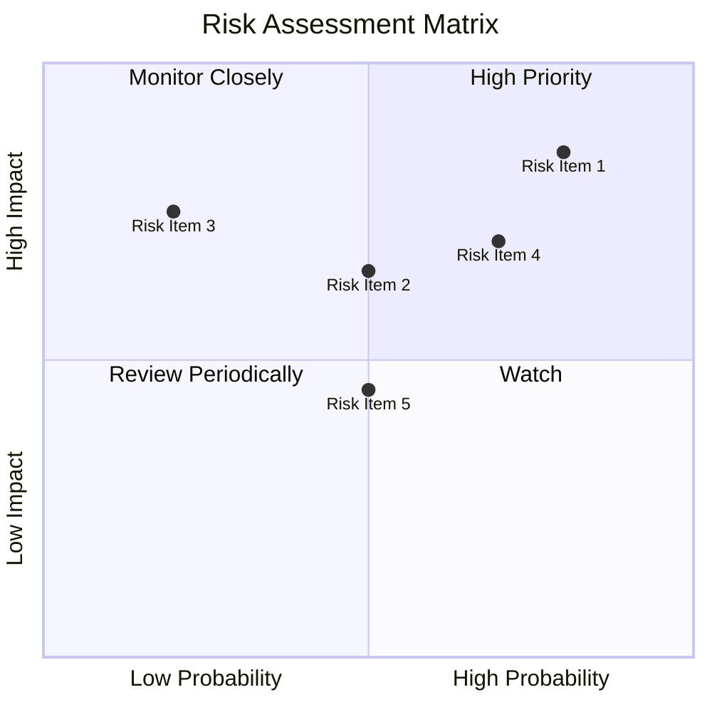

### 9.2 風險清單詳細分析

| # | 風險項目 | 發生機率 | 財務衝擊 | 風險評分 | 緩解措施 |
|---|----------|----------|----------|----------|----------|
| 1 | 🔴 **技術風險** | 高 (80%) | 高 (-20%收入) | 🔴 8.0/10 | 加強研發投入，提升技術壁壘 |
| 2 | 🔴 **市場競爭** | 高 (70%) | 中 (15%) | 🔴 7.0/10 | 增強市場營銷和品牌影響力 |
| 3 | 🟡 **供應鏈不穩** | 中 (50%) | 高 (-15%收入) | 🟡 6.5/10 | 多元化供應鏈，減少依賴單一供應商 |
| 4 | 🟡 **法規變更** | 中 (50%) | 中 (10%) | 🟡 5.5/10 | 建立專業法規團隊，及時應對變化 |

---

## 10. 投資建議

### 10.1 最終綜合評級雷達圖

```
╔══════════════════════════════════════════════════════════════════╗
║                    AeroVironment 綜合評級                       ║
╠══════════════════════════════════════════════════════════════════╣
║                                                                  ║
║  基本面：7/10                                                    ║
║  成長動能：8/10                                                  ║
║  獲利品質：4/10                                                  ║
║  財務健康：6/10                                                  ║
║  估值合理性：5/10                                                ║
║                                                                  ║
╚══════════════════════════════════════════════════════════════════╝
```

### 10.2 目標價與隱含報酬率

| 情境 | 目標價 | 隱含報酬率 | 機率權重 |
|------|--------|------------|--------|
| 悲觀情境 | $235 | +19.7% | 30% |
| 基準情境 | $309.88 | +57.8% | 50% |
| 樂觀情境 | $450 | +129.2% | 20% |

### 10.3 買入時機與觸發因素

```
╔══════════════════════════════════════════════════════════════════╗
║                  ✅ 買入觸發因素 Checklist                      ║
╠══════════════════════════════════════════════════════════════════╣
║                                                                  ║
║  立即買入觸發條件（多數符合）：                                  ║
║  ✅ 收入持續增長超過預期                                         ║
║  ✅ 獲利能力明顯改善                                             ║
║  ✅ 技術創新取得重大突破                                         ║
║                                                                  ║
║  加碼觸發條件（出現以下任一）：                                  ║
║  ☐ 政府合同大幅增加                                             ║
║  ☐ 國際市場拓展成功                                             ║
║                                                                  ║
║  減碼/停損觸發條件（出現以下任一）：                             ║
║  ☐ 獲利能力持續惡化                                             ║
║  ☐ 關鍵技術項目失敗                                             ║
║                                                                  ║
╚══════════════════════════════════════════════════════════════════╝
```

### 10.4 投資人適配度分析

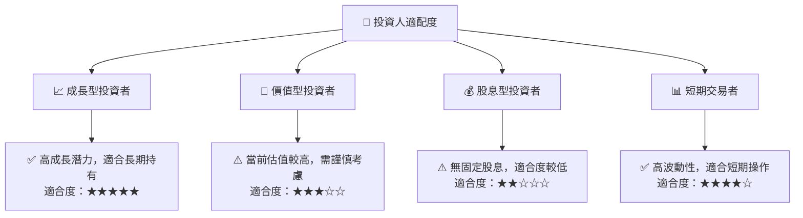

### 10.5 關鍵監控指標

| 類型 | 指標 | 關注點 | 頻率 |
|------|------|--------|------|
| 成長 | 收入增長率 | 持續超越行業平均 | 季度 |
| 獲利 | 淨利率 | 是否持續改善 | 季度 |
| 財務 | 流動比率 | 保持在健康範圍內 | 季度 |
| 市場 | 新產品接受度 | 市場反應與銷售數據 | 季度 |

---

> **免責聲明**：本報告為 AI 自動生成，僅供研究參考，不構成投資建議。投資有風險，入市需謹慎。