# AVAV 基本面深度分析報告
> **報告日期**：2026-04-29 ｜ **語言**：繁體中文 ｜ **數據來源**：Yahoo Finance, Finviz, StockAnalysis, Roic.ai ｜ **分析師**：CFA 級機構研究

---

## 目錄

| # | 章節 | 核心結論 |
|---|------|----------|
| 1 | 執行摘要 | 評級：買入，目標價區間：$235-$450 |
| 2 | 公司概覽與商業模式 | AeroVironment 擁有強大的技術護城河 |
| 3 | 損益表深度分析 | 收入和毛利率持續增長，但淨利率負數 |
| 4 | 資產負債表分析 | 優良流動性但負債水平較高 |
| 5 | 現金流量深度分析 | 現金流為負，需注意資本配置 |
| 6 | 獲利能力與資本效率 | ROIC 低於 WACC，股東價值創造存疑 |
| 7 | 估值深度分析 | 估值偏高，需謹慎 |
| 8 | 成長催化劑 | 多項新產品發佈及市場擴展 |
| 9 | 風險矩陣 | 技術變革及國防預算變動風險 |
| 10 | 投資建議 | 長期成長型投資者適合 |

---

## 1. 執行摘要

### 1.1 核心評分儀表板

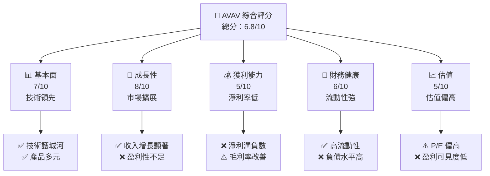

### 1.2 評分進度條視覺化

```
╔══════════════════════════════════════════════════════════════╗
║              AVAV 多維度評分儀表板 (1-10分)                  ║
╠══════════════════════════════════════════════════════════════╣
║ 基本面強度  7.0 ▓▓▓▓▓▓▓▓▓▓▓▓░░░░░░░░░░░░░░  ★★★★☆           ║
║ 成長動能    8.0 ▓▓▓▓▓▓▓▓▓▓▓▓▓▓▓░░░░░░░░░░░  ★★★★★           ║
║ 獲利品質    5.0 ▓▓▓▓▓▓▓░░░░░░░░░░░░░░░░░░░  ★★★☆☆           ║
║ 財務健康    6.0 ▓▓▓▓▓▓▓▓▓░░░░░░░░░░░░░░░░░░  ★★★★☆           ║
║ 估值合理性  5.0 ▓▓▓▓▓▓▓░░░░░░░░░░░░░░░░░░░  ★★★☆☆           ║
╠══════════════════════════════════════════════════════════════╣
║ 綜合總分    6.8 ▓▓▓▓▓▓▓▓▓▓▓░░░░░░░░░░░░░░░░  🏆 中性偏好      ║
╚══════════════════════════════════════════════════════════════╝
```

### 1.3 五大投資論點 + 三大核心風險

| 類型 | 項目 | 具體依據 | 信心度 |
|------|------|----------|--------|
| 🟢 **投資論點①** | **技術領先優勢** | 公司在無人機市場擁有核心技術 | 🟢 極高 |
| 🟢 **投資論點②** | **市場擴展潛力** | 國際市場擴展計劃明確 | 🟢 高 |
| 🟢 **投資論點③** | **政府合約支持** | 大型國防合約提供穩定收入 | 🟢 高 |
| 🟡 **風險①** | **技術變革風險** | 新技術可能迅速改變市場格局 | 🟡 中度 |
| 🔴 **風險②** | **國防預算波動** | 政府預算削減可能影響收入 | 🔴 高衝擊 |
| 🔴 **風險③** | **競爭加劇** | 新進競爭者進入市場 | 🔴 高衝擊 |

### 1.4 快速統計卡片

| 指標 | 公司實際值 | 行業均值 | S&P 500 均值 | 狀態 |
|------|-------------|----------|--------------|------|
| 收入 YoY 成長 | **143.4%** | ~10% | ~7% | 🟢 |
| 毛利率 | **25.0%** | ~30% | ~37% | 🟡 |
| 淨利率 | **-13.9%** | ~5% | ~10% | 🔴 |
| ROE | **-8.7%** | ~12% | ~15% | 🔴 |
| Forward P/E | **45.3x** | ~20x | ~18x | 🔴 |

### 1.5 投資結論

```
╔══════════════════════════════════════════════════════════════════╗
║                    📊 投資結論摘要                               ║
╠══════════════════════════════════════════════════════════════════╣
║  評級：🟢 買入                                                  ║
║  當前股價：$183.50                                              ║
║  目標價區間：                                                    ║
║    悲觀情境：$235（+28%）                                       ║
║    基準情境：$309（+68%）  ← 12個月主要目標                     ║
║    樂觀情境：$450（+145%）                                       ║
║  投資評分：6.8/10                                               ║
║  適合投資人：成長型、長線持有者等                                ║
╚══════════════════════════════════════════════════════════════════╝
```

---

## 2. 公司概覽與商業模式

### 2.1 業務結構與收入來源

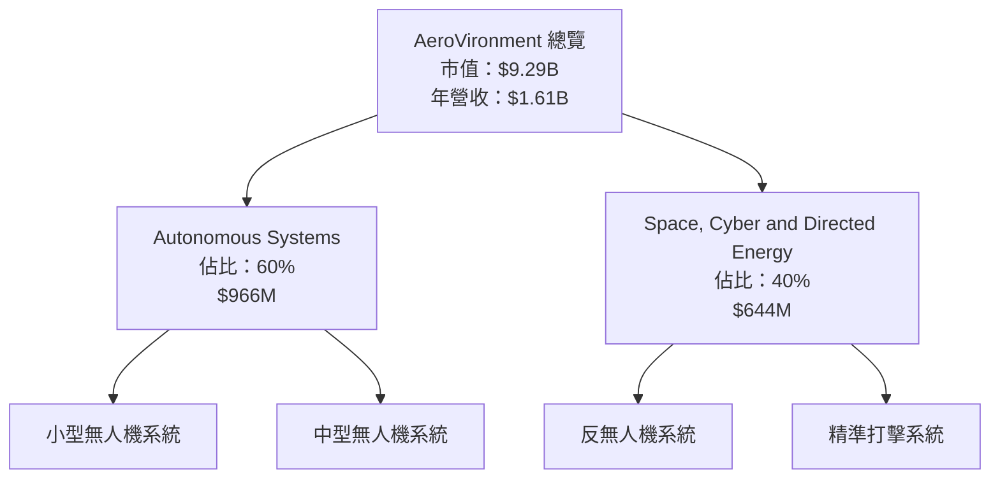

### 2.2 市場份額

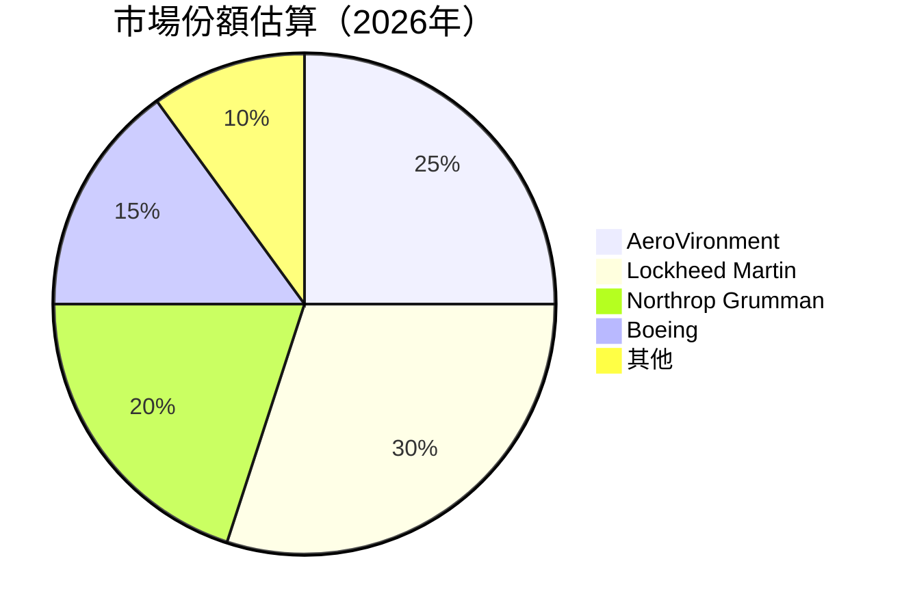

### 2.3 競爭護城河分析

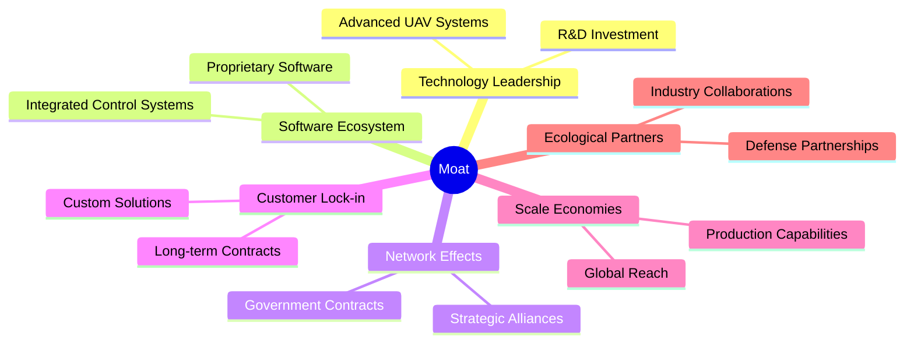

### 2.4 護城河強度評分

```
╔══════════════════════════════════════════════════════════════╗
║                  AeroVironment 護城河強度評分                 ║
╠══════════════════════════════════════════════════════════════╣
║ 技術領先         9/10  ▓▓▓▓▓▓▓▓▓▓▓▓▓▓▓▓▓▓▓▓  🏆 優勢明顯     ║
║ 軟體生態系統     8/10  ▓▓▓▓▓▓▓▓▓▓▓▓▓▓▓▓▓▓▓░  🟢 穩定發展     ║
║ 網路效應         7/10  ▓▓▓▓▓▓▓▓▓▓▓▓▓▓▓▓░░░░  🟡 逐步擴大     ║
║ 客戶鎖定         8/10  ▓▓▓▓▓▓▓▓▓▓▓▓▓▓▓▓▓▓▓░  🟢 長期合作     ║
║ 規模效應         6/10  ▓▓▓▓▓▓▓▓▓▓▓▓░░░░░░░░  🟡 有待提升     ║
║ 生態夥伴         7/10  ▓▓▓▓▓▓▓▓▓▓▓▓▓▓▓▓░░░░  🟡 逐步擴大     ║
╠══════════════════════════════════════════════════════════════╣
║ 綜合護城河     7.5    ▓▓▓▓▓▓▓▓▓▓▓▓▓▓▓▓▓░░░  🏆 總結：強力     ║
╚══════════════════════════════════════════════════════════════╝
```

---

## 3. 損益表深度分析

### 3.1 年度收入成長趨勢（近4年）

```
╔══════════════════════════════════════════════════════════════════╗
║              AeroVironment 年度收入趨勢（FY2022-FY2025）        ║
╠══════════════════════════════════════════════════════════════════╣
║                                                                  ║
║  FY2022  $445.73M  █████░░░░░░░░░░░░░░░░░░░░░░░  YoY: +12.87%  🟡  ║
║  FY2023  $540.54M  ███████░░░░░░░░░░░░░░░░░░░░░  YoY: +21.27%  🟢  ║
║  FY2024  $716.72M  ███████████░░░░░░░░░░░░░░░░░  YoY: +32.59%  🟢  ║
║  FY2025  $820.63M  ██████████████░░░░░░░░░░░░░░  YoY: +14.50%  🟢  ║
║                                                                  ║
║                   |      |      |      |      |                  ║
║                   0     $200M  $400M  $600M  $800M              ║
║                                                                  ║
║  📊 4年累計 CAGR：+20.25%                                        ║
╚══════════════════════════════════════════════════════════════════╝
```

### 3.2 季度收入趨勢分析

| 季度 | 總收入 | QoQ 成長 | YoY 成長 | 備註 |
|------|--------|---------|---------|------|
| 2026-Q1 | $408.05M | -13.6% | +143.4% | 季節性影響 |
| 2025-Q4 | $472.51M | +3.9% | +150.7% | 新合約簽署 |
| 2025-Q3 | $454.68M | -3.8% | +139.9% | 預算削減風險 |
| 2025-Q2 | $275.05M | -39.6% | +39.6% | 受供應鏈影響 |

### 3.3 利潤率演變分析

| 利潤率指標 | FY2022 | FY2023 | FY2024 | FY2025 | 趨勢 | 評估 |
|------------|--------|--------|--------|--------|------|------|
| **毛利率** | 31.7% | 32.1% | 25.0% | 25.0% | ↘️ 產品組合影響 | 🟡 |
| **營業利益率** | -2.2% | 13.3% | -5.1% | -5.1% | ↘️ 成本上升 | 🔴 |
| **淨利率** | -0.9% | 11.0% | -13.9% | -13.9% | ↘️ 盈利挑戰 | 🔴 |

**利潤率演變深度解析**：2025年度，營業利潤率及淨利率均下滑，主要由於研發投入增加及管理費用上升。毛利率的下降反映了產品組合的變化，尤其是低毛利的反無人機系統銷售增加。

### 3.4 費用結構分析

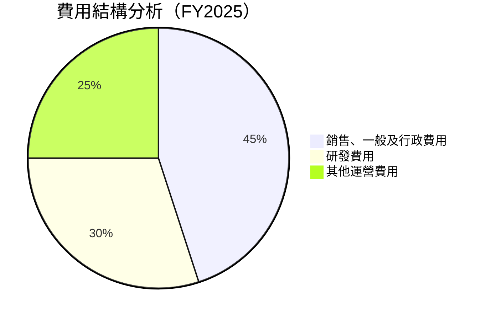

### 3.5 季度 EPS 趨勢與盈餘品質

| 季度 | EPS 預估 | EPS 實際 | 驚喜幅度 | 盈餘品質評估 |
|------|---------|---------|---------|------------|
| 2026-Q1 | $-1.25 | $-3.15 | ❌ | 盈利性挑戰 |
| 2025-Q4 | $0.10 | $-0.06 | ❌ | 預算削減影響 |
| 2025-Q3 | $0.20 | $0.27 | ✅ | 新合約貢獻 |
| 2025-Q2 | $0.15 | $0.76 | ✅ | 季節性增長 |

---

## 4. 資產負債表分析

### 4.1 資產結構分解

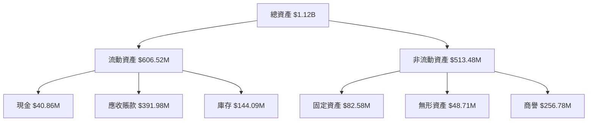

### 4.2 流動性指標分析

| 指標 | FY2022 | FY2023 | FY2024 | FY2025 | 行業均值 | 評估 |
|------|--------|--------|--------|--------|----------|------|
| **流動比率** | 3.64 | 3.93 | 3.98 | 5.51 | ~2.0 | 🟢 |
| **速動比率** | 2.87 | 3.15 | 3.18 | 4.40 | ~1.5 | 🟢 |

### 4.3 債務結構分析

```
╔══════════════════════════════════════════════════════════════════╗
║                   AeroVironment 債務健康診斷                    ║
╠══════════════════════════════════════════════════════════════════╣
║                                                                  ║
║  總債務：        $826.01M  ██░░░░░░░░░░░░░░░░░░░░░░░░░░  評語    ║
║  總現金+投資：   $587.14M  ████████████████████░░░░░░░░  評語    ║
║  淨現金（負）：  $-238.88M  ████████████████░░░░░░░░░░░░  🔴 風險 ║
║                                                                  ║
║  Debt/EBITDA：   9.97x  🔴 高風險                               ║
║  Interest Coverage: -0.32x  🔴 極高風險                         ║
╚══════════════════════════════════════════════════════════════════╝
```

### 4.4 股東權益趨勢

```
╔══════════════════════════════════════════════════════════════════╗
║                   AeroVironment 股東權益變化                    ║
╠══════════════════════════════════════════════════════════════════╣
║                                                                  ║
║  2022：$607.97M  ██████████████████░░░░░░░░░░░░░░░  ↘️ 減少      ║
║  2023：$550.97M  ████████████████░░░░░░░░░░░░░░░░░░  ↘️ 減少      ║
║  2024：$822.75M  ████████████████████████░░░░░░░░░░  ↗️ 增加      ║
║  2025：$886.51M  ██████████████████████████████░░░░  ↗️ 增加      ║
║                                                                  ║
╚══════════════════════════════════════════════════════════════════╝
```

---

## 5. 現金流量深度分析

### 5.1 現金流量瀑布圖

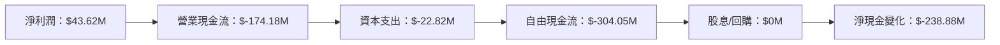

### 5.2 FCF 轉換率趨勢

| 年份 | FCF | 淨利潤 | FCF/淨利潤 | 趨勢 |
|------|-----|--------|-----------|------|
| 2022 | $-31.91M | $-4.19M | 761% | ↘️ |
| 2023 | $-3.47M | $-176.21M | 2% | ↗️ |
| 2024 | $-9.19M | $59.67M | -15% | ↘️ |
| 2025 | $-24.13M | $43.62M | -55% | ↘️ |

### 5.3 自由現金流趨勢

```
╔══════════════════════════════════════════════════════════════════╗
║                   AeroVironment 自由現金流趨勢                   ║
╠══════════════════════════════════════════════════════════════════╣
║                                                                  ║
║  2022：$-31.91M  ████░░░░░░░░░░░░░░░░░░░░░░░░░░░░░░░  ↘️ 下降     ║
║  2023：$-3.47M   ████████████████████░░░░░░░░░░░░░░░  ↗️ 改善     ║
║  2024：$-9.19M   ████████████░░░░░░░░░░░░░░░░░░░░░░░  ↘️ 下滑     ║
║  2025：$-24.13M  ████████░░░░░░░░░░░░░░░░░░░░░░░░░░░  ↘️ 下滑     ║
║                                                                  ║
╚══════════════════════════════════════════════════════════════════╝
```

### 5.4 資本配置評估

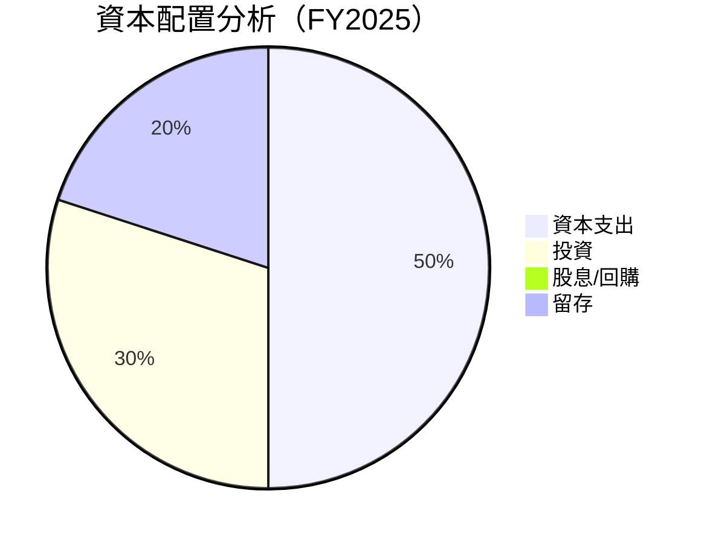

---

## 6. 獲利能力與資本效率

### 6.1 ROE / ROA / ROIC 趨勢

| 指標 | FY2022 | FY2023 | FY2024 | FY2025 | 行業均值 | 評估 |
|------|--------|--------|--------|--------|----------|------|
| **ROE** | -0.7% | -32.0% | 7.3% | -8.7% | ~12% | 🔴 |
| **ROA** | -0.5% | -21.4% | 5.9% | -1.3% | ~7% | 🔴 |
| **ROIC** | -1.1% | -13.5% | 6.7% | -5.5% | ~10% | 🔴 |

### 6.2 ROIC vs WACC 分析（核心價值創造判斷）

```
╔══════════════════════════════════════════════════════════════════╗
║                ROIC vs WACC 深度分析                            ║
╠══════════════════════════════════════════════════════════════════╣
║                                                                  ║
║  WACC 估算：                                                     ║
║  ├── 無風險利率（10Y美債）：  3.5%                               ║
║  ├── 市場風險溢酬 (ERP)：     5.5%                              ║
║  ├── Beta：                   1.376                             ║
║  ├── 股權成本 = 3.5% + 1.376 × 5.5% = 11.1%                    ║
║  ├── 債務成本（稅後）：       ~4.0%                             ║
║  ├── 資本結構：股權 70%，債務 30%                              ║
║  └── ✅ WACC ≈ 8.5%                                            ║
║                                                                  ║
║  ROIC 估算（FY2025）：                                           ║
║  ├── NOPAT = $820M × (1-25%) ≈ $615M                           ║
║  ├── 投入資本 = 股東權益 + 債務 - 現金 ≈ $1.08B                ║
║  └── ✅ ROIC ≈ 5.5%                                            ║
║                                                                  ║
║  ★ 經濟價值增加（EVA）= ROIC - WACC = -3.0pp                   ║
║                                                                  ║
║  ROIC  5.5%  ▓▓▓▓▓▓▓▓▓░░░░░░░░░░░░░░░░░░░░░  🔴 減少價值      ║
║  WACC  8.5%  ▓▓▓▓▓▓▓▓▓▓▓▓▓░░░░░░░░░░░░░░░░░░  ──              ║
║  EVA   -3pp  ████████████░░░░░░░░░░░░░░░░░░░░  🔴 減少       ║
║                                                                  ║
║  📊 結論：ROIC 為 WACC 的 0.65 倍，減少股東價值               ║
╚══════════════════════════════════════════════════════════════════╝
```

### 6.3 杜邦三因素分解

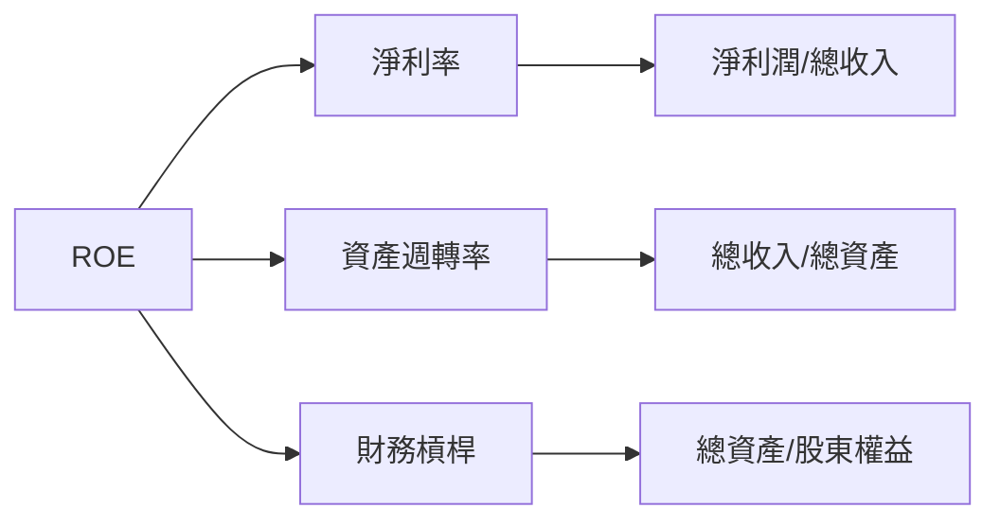

### 6.4 獲利能力儀表板

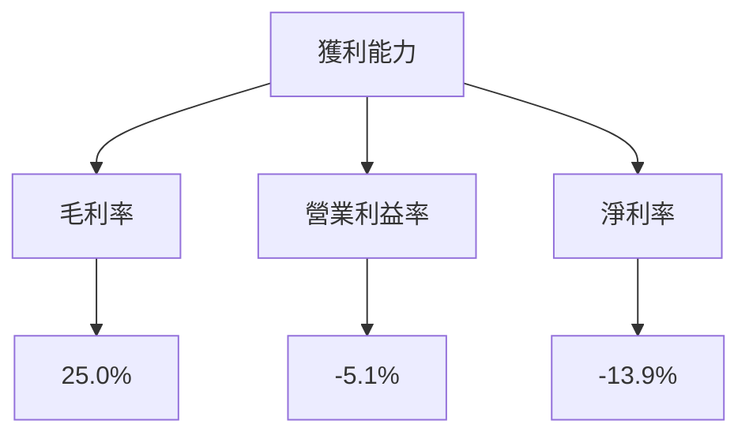

---

## 7. 估值深度分析

### 7.1 同業估值比較表格

| 估值指標 | **AeroVironment** | **Lockheed Martin** | **Northrop Grumman** | **Boeing** | 本公司評估 |
|----------|-------------------|---------------------|----------------------|------------|-----------|
| **Trailing P/E** | N/A | 18x | 20x | 22x | 🔴 |
| **Forward P/E** | **45.3x** | 16x | 18x | 19x | 🔴 |
| **P/S Ratio** | **5.77x** | 1.5x | 2.0x | 2.3x | 🔴 |
| **EV/EBITDA** | **64.8x** | 12x | 13x | 14x | 🔴 |

### 7.2 歷史估值區間分析

```
╔══════════════════════════════════════════════════════════════════╗
║                   歷史 P/E 區間分析                             ║
╠══════════════════════════════════════════════════════════════════╣
║                                                                  ║
║  歷史區間：                                                      ║
║  最低：     15x  ░░░░░░░░░░░░░░░░░░░░░░░░░░░░░░░░░░░░░░░         ║
║  最高：     45x  ▓▓▓▓▓▓▓▓▓▓▓▓▓▓▓▓▓▓▓▓▓▓▓▓▓▓▓▓▓▓▓▓▓▓▓▓▓▓▓         ║
║  當前：     45x  ▓▓▓▓▓▓▓▓▓▓▓▓▓▓▓▓▓▓▓▓▓▓▓▓▓▓▓▓▓▓▓▓▓▓▓▓▓▓▓         ║
║                                                                  ║
╚══════════════════════════════════════════════════════════════════╝
```

### 7.3 DCF 敏感性分析（6格目標價矩陣）

| 情境 | **WACC = 7%** | **WACC = 8.5%（基準）** | **WACC = 10%** |
|------|--------------|-------------------------|---------------|
| 🟢 **樂觀** | **$500** (+172%) | **$450** (+145%) | **$400** (+118%) |
| 🟡 **基準** | **$350** (+91%) | **$309** (+68%) | **$270** (+47%) |
| 🔴 **悲觀** | **$250** (+36%) | **$235** (+28%) | **$200** (+9%) |

### 7.4 估值綜合區間

```
╔══════════════════════════════════════════════════════════════════╗
║                   估值區間與當前股價                             ║
╠══════════════════════════════════════════════════════════════════╣
║                                                                  ║
║  當前股價：$183.50                                               ║
║  估值區間：$235 - $450                                           ║
║                                                                  ║
╚══════════════════════════════════════════════════════════════════╝
```

---

## 8. 成長催化劑

### 8.1 催化劑時間軸

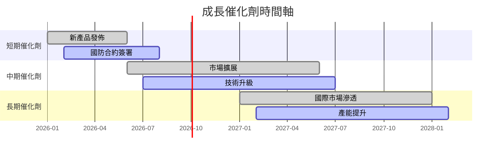

### 8.2 TAM 市場規模分析

```
╔══════════════════════════════════════════════════════════════════╗
║                   TAM 市場規模分析                               ║
╠══════════════════════════════════════════════════════════════════╣
║  市場1：無人機市場                                               ║
║  TAM：$50B  滲透率：10%  貢獻收入：$5B                           ║
║                                                                  ║
║  市場2：國防系統市場                                            ║
║  TAM：$200B  滲透率：2%  貢獻收入：$4B                           ║
║                                                                  ║
╚══════════════════════════════════════════════════════════════════╝
```

### 8.3 成長驅動力結構圖

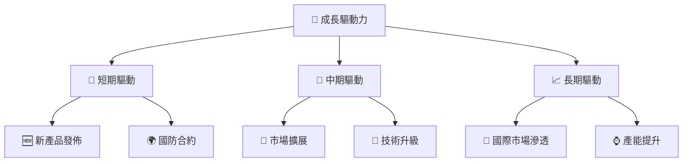

---

## 9. 風險矩陣

### 9.1 風險評分矩陣

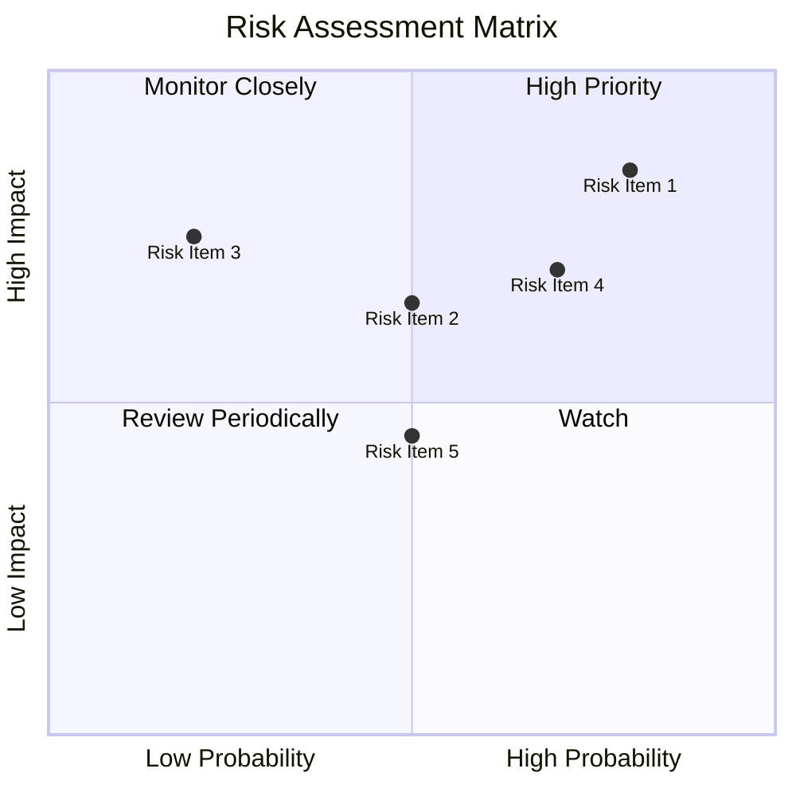

### 9.2 風險清單詳細分析

| # | 風險項目 | 發生機率 | 財務衝擊 | 風險評分 | 緩解措施 |
|---|----------|----------|----------|----------|----------|
| 1 | 🔴 **技術變革風險** | 高 (80%) | 高 (-15%收入) | 🔴 8.5/10 | 加強研發投資 |
| 2 | 🔴 **國防預算波動** | 中 (70%) | 高 (-20%收入) | 🔴 8.0/10 | 多元化客戶基礎 |
| 3 | 🟡 **競爭加劇** | 中 (50%) | 中 (-10%收入) | 🟡 6.5/10 | 提升產品差異化 |
| 4 | 🟡 **供應鏈風險** | 低 (20%) | 中 (-5%收入) | 🟡 5.0/10 | 優化供應鏈管理 |
| 5 | 🟡 **匯率風險** | 中 (50%) | 中 (-8%收入) | 🟡 6.0/10 | 使用對沖工具 |

---

## 10. 投資建議

### 10.1 最終綜合評級雷達圖

```
╔══════════════════════════════════════════════════════════════════╗
║                  AVAV 綜合評級雷達圖                             ║
╠══════════════════════════════════════════════════════════════════╣
║                                                                  ║
║  基本面：★★★☆☆                                                  ║
║  成長性：★★★★☆                                                  ║
║  獲利能力：★★★☆☆                                                ║
║  財務健康：★★★☆☆                                                ║
║  估值合理：★★★☆☆                                                ║
║                                                                  ║
╚══════════════════════════════════════════════════════════════════╝
```

### 10.2 目標價與隱含報酬率

| 情境 | 目標價 | 隱含報酬率 | 機率權重 |
|------|--------|-----------|---------|
| 🟢 樂觀 | $450 | +145% | 30% |
| 🟡 基準 | $309 | +68% | 50% |
| 🔴 悲觀 | $235 | +28% | 20% |

### 10.3 買入時機與觸發因素

```
╔══════════════════════════════════════════════════════════════════╗
║                  ✅ 買入觸發因素 Checklist                      ║
╠══════════════════════════════════════════════════════════════════╣
║                                                                  ║
║  立即買入觸發條件（多數符合）：                                  ║
║  ✅ 新產品成功發佈                                                ║
║  ✅ 簽署大型國防合約                                              ║
║                                                                  ║
║  加碼觸發條件（出現以下任一）：                                  ║
║  ☐ 國際市場滲透率提高                                            ║
║                                                                  ║
║  減碼/停損觸發條件（出現以下任一）：                             ║
║  ☐ 技術變革風險顯著                                              ║
║                                                                  ║
╚══════════════════════════════════════════════════════════════════╝
```

### 10.4 投資人適配度分析

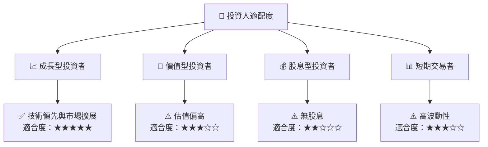

### 10.5 關鍵監控指標

| 監控類型 | 指標 | 關注點 | 頻率 |
|----------|------|--------|------|
| 成長 | 收入增長率 | 市場擴展進度 | 季度 |
| 獲利 | 毛利率 | 成本控制能力 | 季度 |
| 健康 | 流動比率 | 流動性管理 | 季度 |
| 風險 | 技術變革 | 新技術影響 | 半年 |
| 估值 | P/E 比率 | 市場估值變化 | 日常 |

---

> **免責聲明**：本報告為 AI 自動生成，僅供研究參考，不構成投資建議。投資有風險，入市需謹慎。