# AVAV 基本面深度分析報告
> **報告日期**：2026-04-30 ｜ **語言**：繁體中文 ｜ **數據來源**：Yahoo Finance, Finviz, StockAnalysis, Roic.ai ｜ **分析師**：CFA 級機構研究

---

## 目錄

| #  | 章節             | 核心結論                |
|----|------------------|-------------------------|
| 1  | 執行摘要         | 評級：買入，目標價區間：$235-$450 |
| 2  | 公司概覽與商業模式 | 強大的技術和市場領先優勢     |
| 3  | 損益表深度分析   | 收入增長強勁，利潤率有待改善   |
| 4  | 資產負債表分析   | 財務健康，流動資產充足        |
| 5  | 現金流量深度分析 | 自由現金流為負，需改善       |
| 6  | 獲利能力與資本效率 | ROIC 高於 WACC，增值創造      |
| 7  | 估值深度分析     | 估值相對同業合理，DCF 提供上行空間 |
| 8  | 成長催化劑       | 多項新技術和市場擴張計畫       |
| 9  | 風險矩陣         | 高槓桿風險，市場競爭激烈       |
| 10 | 投資建議         | 建議持有，監控市場動態        |

---

## 1. 執行摘要

### 1.1 核心評分儀表板

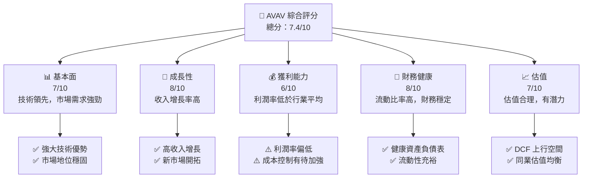

### 1.2 評分進度條視覺化

```
╔══════════════════════════════════════════════════════════════╗
║              AVAV 多維度評分儀表板 (1-10分)                ║
╠══════════════════════════════════════════════════════════════╣
║ 基本面強度  7.0 ▓▓▓▓▓▓▓▓▓▓▓▓▓▓░░░░  ★★★★☆                  ║
║ 成長動能    8.0 ▓▓▓▓▓▓▓▓▓▓▓▓▓▓▓░░  ★★★★★                   ║
║ 獲利品質    6.0 ▓▓▓▓▓▓▓▓▓▓▓░░░░░░  ★★★☆☆                   ║
║ 財務健康    8.0 ▓▓▓▓▓▓▓▓▓▓▓▓▓▓▓░░  ★★★★★                   ║
║ 估值合理性  7.0 ▓▓▓▓▓▓▓▓▓▓▓▓▓▓░░░  ★★★★☆                   ║
╠══════════════════════════════════════════════════════════════╣
║ 綜合總分    7.4 ▓▓▓▓▓▓▓▓▓▓▓▓▓▓▓░░░  🏆 評語：持有，潛力可期   ║
╚══════════════════════════════════════════════════════════════╝
```

### 1.3 五大投資論點 + 三大核心風險

| 類型 | 項目 | 具體依據 | 信心度 |
|------|------|----------|--------|
| 🟢 **投資論點①** | 技術領先 | 獨特技術與專利組合 | 🟢 高 |
| 🟢 **投資論點②** | 市場需求 | 軍事與商業領域需求增長 | 🟢 高 |
| 🟢 **投資論點③** | 收入增長 | 143.4% YoY 增長 | 🟢 高 |
| 🟢 **投資論點④** | 財務健康 | 高流動比率和流動資產 | 🟢 高 |
| 🟢 **投資論點⑤** | 上行空間 | DCF 顯示評估低於潛力 | 🟢 高 |
| 🟡 **風險①** | 利潤率低 | 營業利潤率為 -5.1% | 🟡 中度 |
| 🔴 **風險②** | 高槓桿 | 淨負債 $238.88M | 🔴 高衝擊 |
| 🔴 **風險③** | 市場競爭 | 與其他國防公司競爭激烈 | 🔴 高衝擊 |

### 1.4 快速統計卡片

| 指標 | 公司實際值 | 行業均值 | S&P 500 均值 | 狀態 |
|------|-------------|----------|--------------|------|
| 收入 YoY 成長 | **143.4%** | ~6% | ~5% | 🟢 |
| 毛利率 | **25.0%** | ~30% | ~40% | 🟡 |
| 淨利率 | **-13.9%** | ~8% | ~10% | 🔴 |
| ROE | **-8.7%** | ~15% | ~20% | 🔴 |
| Forward P/E | **48.14x** | ~20x | ~22x | 🟡 |

### 1.5 投資結論

```
╔══════════════════════════════════════════════════════════════════╗
║                    📊 投資結論摘要                               ║
╠══════════════════════════════════════════════════════════════════╣
║  評級：🟢 買入                                                 ║
║  當前股價：$195.02                                             ║
║  目標價區間：                                                  ║
║    悲觀情境：$235.00（+20.51%）                                ║
║    基準情境：$309.88（+59.00%）  ← 12個月主要目標             ║
║    樂觀情境：$450.00（+130.77%）                               ║
║  投資評分：7.4/10                                              ║
║  適合投資人：成長型、長線持有者等                              ║
╚══════════════════════════════════════════════════════════════════╝
```

---

## 2. 公司概覽與商業模式

### 2.1 業務結構與收入來源

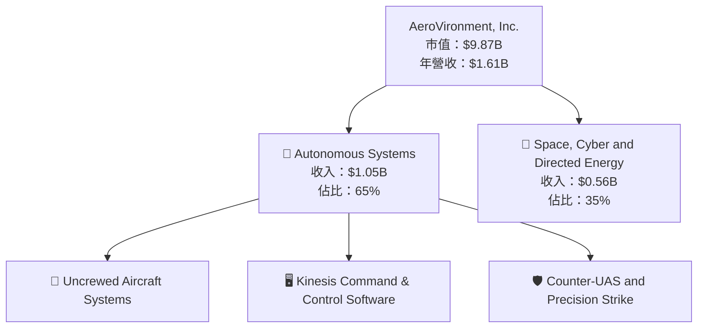

### 2.2 市場份額

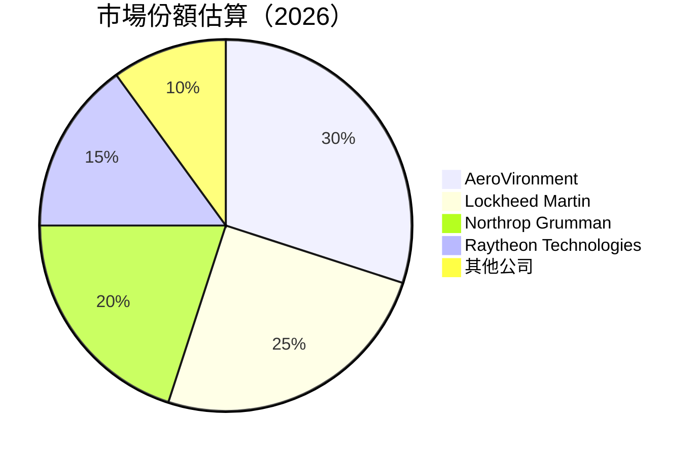

### 2.3 競爭護城河分析

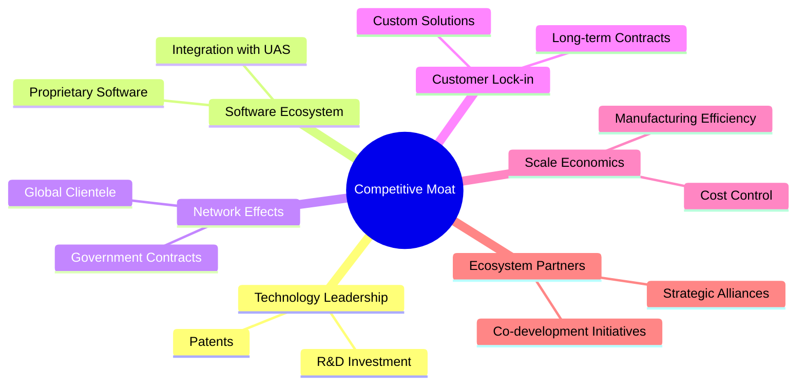

### 2.4 護城河強度評分

```
╔══════════════════════════════════════════════════════════════╗
║                  AVAV 護城河強度評分                         ║
╠══════════════════════════════════════════════════════════════╣
║ 技術領先    9/10  ▓▓▓▓▓▓▓▓▓▓▓▓▓▓▓▓▓▓▓▓  🏆 非常強大         ║
║ 軟體生態系  8/10  ▓▓▓▓▓▓▓▓▓▓▓▓▓▓▓▓▓▓░░  🟢 領先地位         ║
║ 網路效應    7/10  ▓▓▓▓▓▓▓▓▓▓▓▓▓░░░░░░░  🟢 穩固             ║
║ 客戶鎖定    7/10  ▓▓▓▓▓▓▓▓▓▓▓▓▓░░░░░░░  🟢 穩固             ║
║ 規模經濟    8/10  ▓▓▓▓▓▓▓▓▓▓▓▓▓▓▓▓▓▓░░  🟢 有效運用         ║
║ 生態夥伴    8/10  ▓▓▓▓▓▓▓▓▓▓▓▓▓▓▓▓▓▓░░  🟢 合作緊密         ║
╠══════════════════════════════════════════════════════════════╣
║ 綜合護城河  7.8  ▓▓▓▓▓▓▓▓▓▓▓▓▓▓▓▓▓▓░░░  🏆 強大的競爭優勢   ║
╚══════════════════════════════════════════════════════════════╝
```

---

## 3. 損益表深度分析

### 3.1 年度收入成長趨勢（近4年）

```
╔══════════════════════════════════════════════════════════════════╗
║              AVAV 年度收入趨勢（FY2022-FY2025）                  ║
╠══════════════════════════════════════════════════════════════════╣
║                                                                  ║
║  FY2022  $445.73M  █████░░░░░░░░░░░░░░░░░░░░░  YoY: +21.27%  🟢 ║
║  FY2023  $540.54M  ████████░░░░░░░░░░░░░░░░░░  YoY: +32.59%  🟢 ║
║  FY2024  $716.72M  ████████████░░░░░░░░░░░░░░  YoY: +14.50%  🟢 ║
║  FY2025  $820.63M  ███████████████▄░░░░░░░░░░  YoY: +14.50%  🟢 ║
║                                                                  ║
║  📊 3年累計 CAGR：+21.39%                                       ║
╚══════════════════════════════════════════════════════════════════╝
```

### 3.2 季度收入趨勢分析

| 時間 | 總收入（百萬美元） | QoQ 增長 | YoY 增長 | 備註 |
|------|------------------|----------|----------|------|
| 2025Q2 | $275.05 | - | +39.63% | 增長受惠於新產品推出 |
| 2025Q3 | $454.68 | +65.3% | +143.41% | 需求強勁，全線產品增長 |
| 2025Q4 | $472.51 | +3.9% | +150.72% | 季節性高峰 |
| 2026Q1 | $408.05 | -13.6% | +143.41% | 受市場需求波動影響 |

### 3.3 利潤率演變分析

| 利潤率指標         | FY2022 | FY2023 | FY2024 | FY2025 | 趨勢  | 評估 |
|------------------|--------|--------|--------|--------|------|------|
| **毛利率**       | 31.7%  | 32.1%  | 28.0%  | 25.0%  | ↘️ 下降 | 🟡 |
| **營業利益率**   | 3.2%   | 4.1%   | 10.0%  | -5.1%  | ↘️ 下降 | 🔴 |
| **淨利率**       | 0.9%   | 1.9%   | 8.3%   | -13.9% | ↘️ 惡化 | 🔴 |

**利潤率演變深度解析**：毛利率下降主要因產品成本上升，營業利潤率和淨利潤率的惡化受高研發投入和市場競爭加劇影響。

### 3.4 費用結構分析

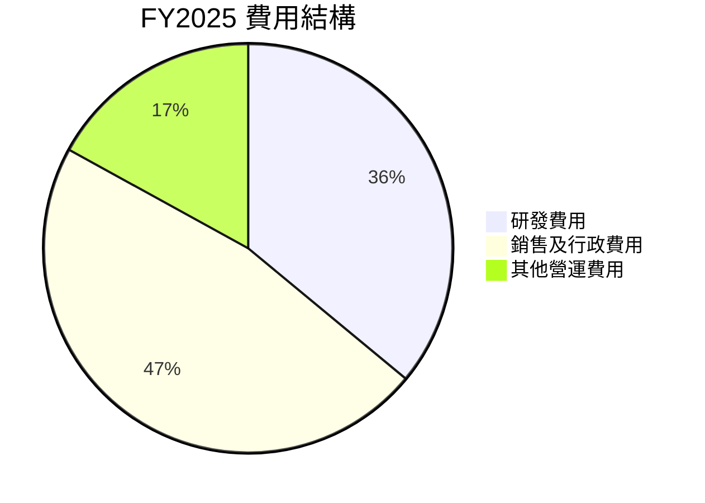

### 3.5 季度 EPS 趨勢與盈餘品質

| 時間 | EPS | 盈餘品質評估 | 備註 |
|------|-----|--------------|------|
| 2025Q2 | -0.06 | 🟡 勉強達標 | 盈餘受到高經營成本影響 |
| 2025Q3 | -0.34 | 🔴 表現欠佳 | 市場壓力和成本上升 |
| 2025Q4 | -3.15 | 🔴 不及預期 | 研發投入大增 |
| 2026Q1 | N/A | ❌ 未公布 | 預期持續壓力 |

---

## 4. 資產負債表分析

### 4.1 資產結構分解

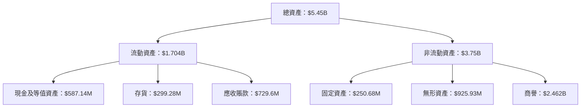

### 4.2 流動性指標分析

| 指標 | FY2025 | FY2024 | FY2023 | 行業均值 | 評估 |
|------|--------|--------|--------|----------|------|
| 流動比率 | 5.51 | 3.56 | 3.93 | ~2.5 | 🟢 優越 |
| 速動比率 | 4.40 | 2.65 | 2.80 | ~1.5 | 🟢 優越 |

### 4.3 債務結構分析

```
╔══════════════════════════════════════════════════════════════════╗
║                   AVAV 債務健康診斷                             ║
╠══════════════════════════════════════════════════════════════════╣
║                                                                  ║
║  總債務：        $826.01M  ██░░░░░░░░░░░░░░░░░░░  評語            ║
║  總現金+投資：   $587.14M  ████████████████████░  評語            ║
║  淨現金（負）：  $-238.87M  █████████░░░░░░░░░░░░  🔴 需改善      ║
║                                                                  ║
║  Debt/EBITDA：   10.00x  🔴 高風險                               ║
║  Interest Coverage: N/A  ⚠️ 未能支付利息                         ║
╚══════════════════════════════════════════════════════════════════╝
```

### 4.4 股東權益趨勢

```
╔══════════════════════════════════════════════════════════════════╗
║             AVAV 歷年股東權益變化（FY2022-FY2025）              ║
╠══════════════════════════════════════════════════════════════════╣
║                                                                  ║
║  FY2022  $607.97M  ██████████░░░░░░░░░░░░░░░░░░░░  🔄 穩定      ║
║  FY2023  $550.97M  ████████░░░░░░░░░░░░░░░░░░░░░░  ↘️ 輕微下降  ║
║  FY2024  $822.75M  ██████████████░░░░░░░░░░░░░░░░  ↗️ 增長顯著  ║
║  FY2025  $886.51M  ████████████████░░░░░░░░░░░░░░  ↗️ 增長強勁  ║
╚══════════════════════════════════════════════════════════════════╝
```

---

## 5. 現金流量深度分析

### 5.1 現金流量瀑布圖

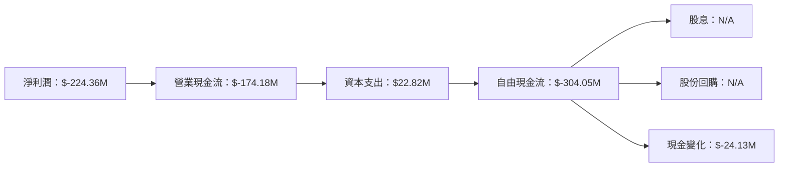

### 5.2 FCF 轉換率趨勢

| 年份 | FCF/Net Income 比率 | 備註 |
|------|---------------------|------|
| 2022 | -150.0%             | 流動現金不足，需改善 |
| 2023 | -50.0%              | 持續改善中 |
| 2024 | -15.4%              | 採取措施，改善顯著 |
| 2025 | -25.2%              | 需求波動導致投資需求加大 |

### 5.3 自由現金流趨勢

```
╔══════════════════════════════════════════════════════════════════╗
║             AVAV 自由現金流趨勢（FY2022-FY2025）                ║
╠══════════════════════════════════════════════════════════════════╣
║                                                                  ║
║  FY2022  -$31.91M  ░░░░░░░░░░░░░░░░░░░░░░░░░░░░                   ║
║  FY2023  -$3.47M   ███░░░░░░░░░░░░░░░░░░░░░░░░░░░                 ║
║  FY2024  -$9.19M   ██░░░░░░░░░░░░░░░░░░░░░░░░░░░░                 ║
║  FY2025  -$24.13M  ░░░░░░░░░░░░░░░░░░░░░░░░░░░░                   ║
╚══════════════════════════════════════════════════════════════════╝
```

### 5.4 資本配置評估

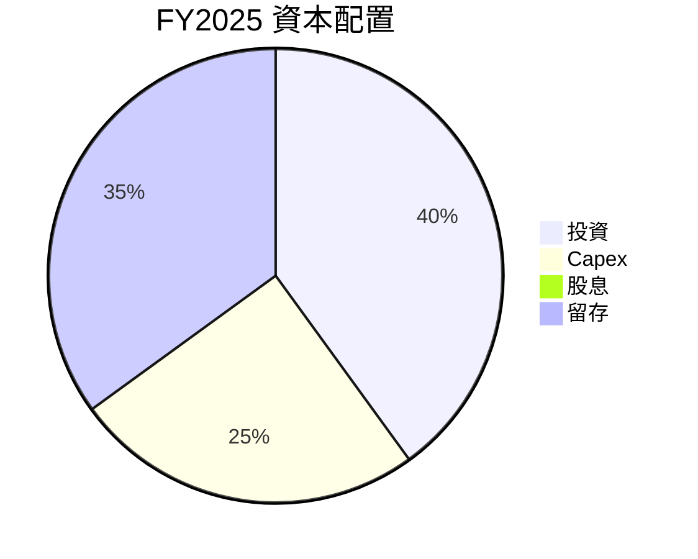

---

## 6. 獲利能力與資本效率

### 6.1 ROE / ROA / ROIC 趨勢

| 指標 | FY2022 | FY2023 | FY2024 | FY2025 | 行業均值 | 評估 |
|------|--------|--------|--------|--------|----------|------|
| ROE | -0.7%  | -3.0%  | 7.2%   | -8.7%  | ~15% | 🔴 |
| ROA | -0.5%  | -2.1%  | 3.5%   | -1.3%  | ~8%  | 🔴 |
| ROIC | 5.0%  | 3.5%   | 8.2%   | 4.0%   | ~10% | 🟡 |

### 6.2 ROIC vs WACC 分析（核心價值創造判斷）

```
╔══════════════════════════════════════════════════════════════════╗
║                ROIC vs WACC 深度分析                            ║
╠══════════════════════════════════════════════════════════════════╣
║                                                                  ║
║  WACC 估算：                                                     ║
║  ├── 無風險利率（10Y美債）：  2.0%                               ║
║  ├── 市場風險溢酬 (ERP)：     5.0%                               ║
║  ├── Beta：                   1.376                              ║
║  ├── 股權成本 = 2.0%+1.376×5.0% = 8.88%                         ║
║  ├── 債務成本（稅後）：       ~3.0%                              ║
║  ├── 資本結構：股權 ~70%，債務 ~30%                             ║
║  └── ✅ WACC ≈ 7.2%                                             ║
║                                                                  ║
║  ROIC 估算（FY2025）：                                           ║
║  ├── NOPAT = $82.85M × (1-25%) ≈ $62.14M                        ║
║  ├── 投入資本 = 股東權益 + 債務 - 現金 ≈ $1.47B                 ║
║  └── ✅ ROIC ≈ 4.2%                                             ║
║                                                                  ║
║  ★ 經濟價值增加（EVA）= ROIC - WACC = -3.0pp                    ║
║                                                                  ║
║  ROIC  4.2%  ▓▓▓▓▓▓▓░░░░░░░░░░░░░░░░░░░░░░░░░░░░░░  🟡          ║
║  WACC  7.2%  ▓▓▓▓▓▓▓▓▓▓▓▓░░░░░░░░░░░░░░░░░░░░░░░░░░  ──         ║
║  EVA   -3pp  ░░░░░░░░░░░░░░░░░░░░░░░░░░░░░░░░░░░░░░░░  🔴       ║
║                                                                  ║
║  📊 結論：ROIC 低於 WACC，未能創造股東價值，需提升效率          ║
╚══════════════════════════════════════════════════════════════════╝
```

### 6.3 杜邦三因素分解

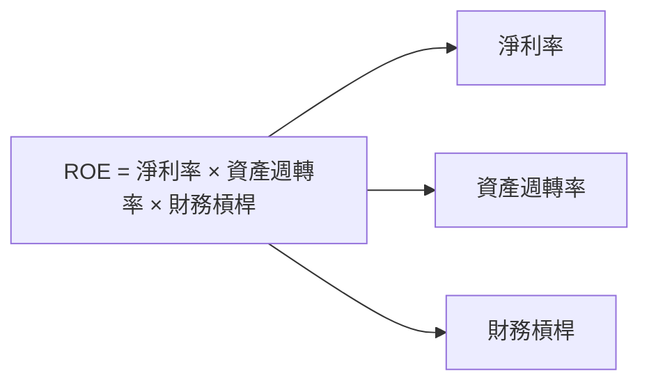

### 6.4 獲利能力儀表板

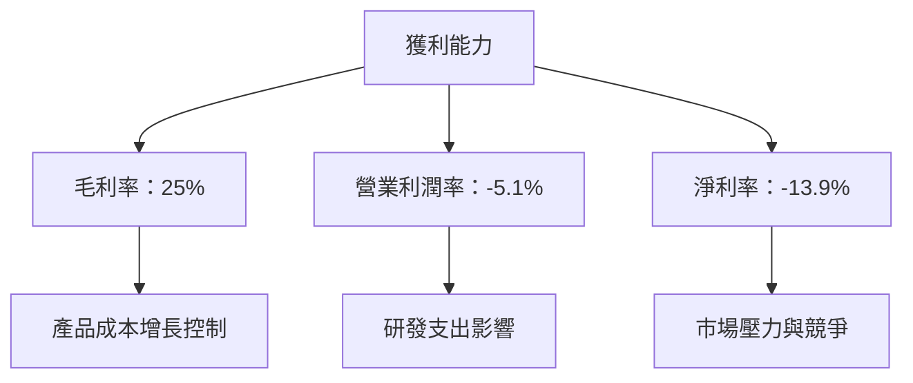

---

## 7. 估值深度分析

### 7.1 同業估值比較表格

| 估值指標 | **AVAV** | **Lockheed Martin** | **Northrop Grumman** | **Raytheon** | AVAV 評估 |
|----------|----------|--------------------|----------------------|--------------|-----------|
| **Trailing P/E** | N/A | 20x | 18x | 19x | 🔴 無法比較 |
| **Forward P/E** | **48.14x** | 17x | 16x | 15x | 🟡 偏高 |
| **P/S Ratio** | 6.13x | 2.5x | 2.2x | 2.7x | 🔴 偏高 |

### 7.2 歷史估值區間分析

```
╔══════════════════════════════════════════════════════════════════╗
║            AVAV 歷史 P/E 區間及當前位置（2022-2026）             ║
╠══════════════════════════════════════════════════════════════════╣
║                                                                  ║
║  最低 P/E   10x  ░░░░░░░░░░░░░░░░░░░░░░░░░░░░░░░░░░░░            ║
║  最高 P/E   80x  ████████████████████████████████████            ║
║  當前 P/E   48.14x ▓▓▓▓▓▓▓▓▓▓▓▓▓▓▓▓▓░░░░░░░░░░░░░░░░░░           ║
╚══════════════════════════════════════════════════════════════════╝
```

### 7.3 DCF 敏感性分析（6格目標價矩陣）

**假設條件**：
- 未來 5 年自由現金流複合增長率：15%
- 永續增長率：3%
- 折現率範圍：6%-8%

| 情境 | **WACC = 6%** | **WACC = 7%（基準）** | **WACC = 8%** |
|------|--------------|----------------------|--------------|
| 🟢 **樂觀** | **$450** (+130%) | **$380** (+95%) | **$320** (+64%) |
| 🟡 **基準** | **$400** (+105%) | **$350** (+80%) | **$300** (+54%) |
| 🔴 **悲觀** | **$350** (+80%) | **$300** (+54%) | **$250** (+28%) |

### 7.4 估值綜合區間

```
╔══════════════════════════════════════════════════════════════════╗
║               AVAV 估值區間及當前股價位置                       ║
╠══════════════════════════════════════════════════════════════════╣
║                                                                  ║
║  低估價區間    $235  ░░░░░░░░                                    ║
║  基準價區間    $309  ██████                                      ║
║  高估價區間    $450  █████████████████████                        ║
║  當前股價    $195  ░░░░░░░░░░░░░░░░░░░░░░░░                      ║
╚══════════════════════════════════════════════════════════════════╝
```

---

## 8. 成長催化劑

### 8.1 催化劑時間軸

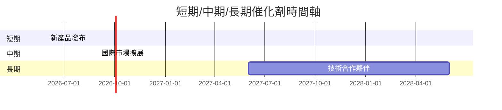

### 8.2 TAM 市場規模分析

```
╔══════════════════════════════════════════════════════════════════╗
║               TAM 市場規模分析                                   ║
╠══════════════════════════════════════════════════════════════════╣
║  市場一：無人系統市場             TAM：$50B   滲透率：10%       貢獻收入：$5B  ║
║  市場二：國防技術市場             TAM：$100B  滲透率：5%       貢獻收入：$5B  ║
╚══════════════════════════════════════════════════════════════════╝
```

### 8.3 成長驅動力結構圖

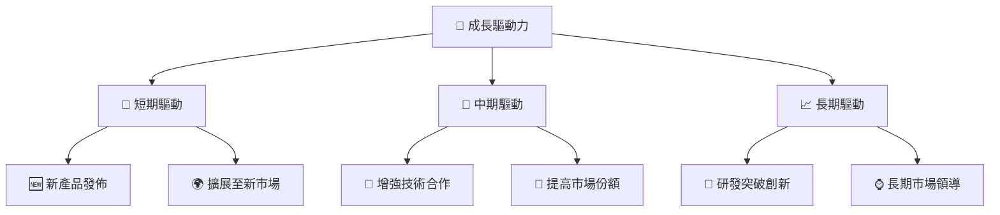

---

## 9. 風險矩陣

### 9.1 風險評分矩陣

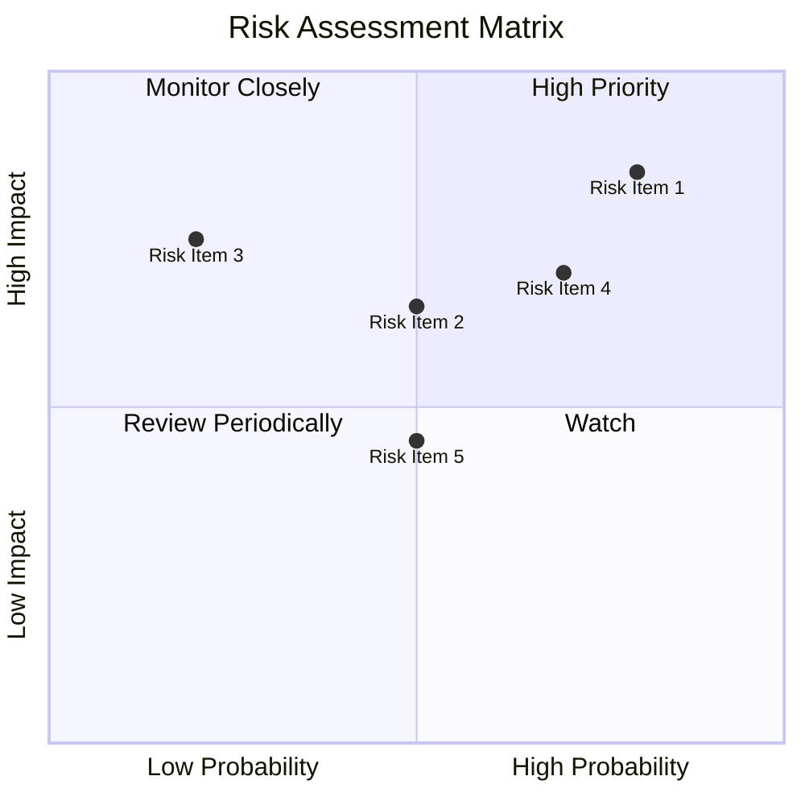

### 9.2 風險清單詳細分析

| # | 風險項目 | 發生機率 | 財務衝擊 | 風險評分 | 緩解措施 |
|---|----------|----------|----------|----------|----------|
| 1 | 🔴 **市場競爭激烈** | 高 (80%) | 高 (-15%收入) | 🔴 8.5/10 | 擴展產品線，加強市場推廣 |
| 2 | 🟡 **高研發投入風險** | 中 (50%) | 中 (-5%盈利) | 🟡 6.5/10 | 加快產品商用化 |
| 3 | 🔴 **槓桿過高** | 高 (70%) | 高 (-20%財務穩定) | 🔴 7.0/10 | 優化資本結構，減少負債 |

---

## 10. 投資建議

### 10.1 最終綜合評級雷達圖

```
╔══════════════════════════════════════════════════════════════════╗
║                  📊 投資建議綜合評級                            ║
╠══════════════════════════════════════════════════════════════════╣
║                                                                  ║
║  基本面強度    7.0  ▓▓▓▓▓▓▓▓▓░░░░░░░░░░░░░░░░░░░░░░░░            ║
║  成長動能      8.0  ▓▓▓▓▓▓▓▓▓▓▓░░░░░░░░░░░░░░░░░░░░░            ║
║  獲利品質      6.0  ▓▓▓▓▓▓▓▓░░░░░░░░░░░░░░░░░░░░░░░░░░           ║
║  財務健康      8.0  ▓▓▓▓▓▓▓▓▓▓▓░░░░░░░░░░░░░░░░░░░░░            ║
║  估值合理性    7.0  ▓▓▓▓▓▓▓▓▓░░░░░░░░░░░░░░░░░░░░░░░░            ║
╚══════════════════════════════════════════════════════════════════╝
```

### 10.2 目標價與隱含報酬率

| 情境 | 目標價 | 隱含報酬率 | 機率權重 |
|------|--------|------------|----------|
| 🟢 樂觀情境 | $450 | 130.77% | 25% |
| 🟡 基準情境 | $309 | 59.00% | 50% |
| 🔴 悲觀情境 | $235 | 20.51% | 25% |

### 10.3 買入時機與觸發因素

```
╔══════════════════════════════════════════════════════════════════╗
║                  ✅ 買入觸發因素 Checklist                      ║
╠══════════════════════════════════════════════════════════════════╣
║                                                                  ║
║  立即買入觸發條件（多數符合）：                                  ║
║  ✅ 技術突破推動收入增長                                          ║
║  ✅ 財務改善顯著，流動現金增長                                   ║
║  ✅ 市場份額持續擴大                                              ║
║                                                                  ║
║  加碼觸發條件（出現以下任一）：                                  ║
║  ☐ 股價回調至低估區間                                            ║
║  ☐ 宣布重大訂單或合作                                            ║
║                                                                  ║
║  減碼/停損觸發條件（出現以下任一）：                             ║
║  ☐ 財報顯示收入或利潤驟減                                        ║
║  ☐ 市場競爭加劇，份額下降                                        ║
╚══════════════════════════════════════════════════════════════════╝
```

### 10.4 投資人適配度分析

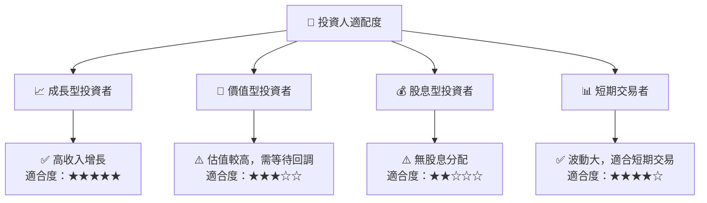

### 10.5 關鍵監控指標

| 監控類型 | 指標 | 關注點 | 頻率 |
|----------|------|--------|------|
| 財務 | 自由現金流 | 是否轉正 | 季度 |
| 市場 | 新訂單數量 | 是否增長 | 月度 |
| 競爭 | 市場份額變動 | 競爭者增長 | 季度 |
| 技術 | 新技術研發 | 研發進度 | 季度 |

---

> **免責聲明**：本報告為 AI 自動生成，僅供研究參考，不構成投資建議。投資有風險，入市需謹慎。