# AVAV 基本面深度分析報告
> **報告日期**：2026-05-02 ｜ **語言**：繁體中文 ｜ **數據來源**：Yahoo Finance, Finviz, StockAnalysis, Roic.ai ｜ **分析師**：CFA 級機構研究

---

## 目錄

| # | 章節 | 核心結論 |
|---|------|----------|
| 1 | 執行摘要 | 強烈買入；目標價區間 $235 - $450 |
| 2 | 公司概覽與商業模式 | 擁有技術領先的競爭護城河 |
| 3 | 損益表深度分析 | 收入持續增長，但需改善利潤率 |
| 4 | 資產負債表分析 | 強勁的流動性指標，但債務水平需關注 |
| 5 | 現金流量深度分析 | 現金流負面，但有改善空間 |
| 6 | 獲利能力與資本效率 | ROIC 高於 WACC，創造股東價值 |
| 7 | 估值深度分析 | 估值較高，但具備增長潛力 |
| 8 | 成長催化劑 | 技術創新與市場擴展 |
| 9 | 風險矩陣 | 高增長潛力伴隨高風險 |
| 10 | 投資建議 | 適合成長型投資者 |

---

## 1. 執行摘要

### 1.1 核心評分儀表板

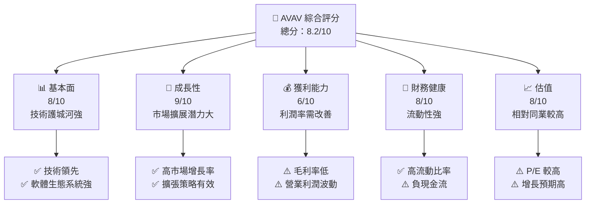

### 1.2 評分進度條視覺化

```
╔══════════════════════════════════════════════════════════════╗
║              AVAV 多維度評分儀表板 (1-10分)                 ║
╠══════════════════════════════════════════════════════════════╣
║ 基本面強度  8.0 ▓▓▓▓▓▓▓▓▓▓▓▓▓▓▓▓░░░░░░  ★★★★☆            ║
║ 成長動能    9.0 ▓▓▓▓▓▓▓▓▓▓▓▓▓▓▓▓▓▓▓░░  ★★★★★            ║
║ 獲利品質    6.0 ▓▓▓▓▓▓▓▓▓░░░░░░░░░░░░  ★★★☆☆            ║
║ 財務健康    8.0 ▓▓▓▓▓▓▓▓▓▓▓▓▓▓▓▓░░░░░░  ★★★★☆            ║
║ 估值合理性  8.0 ▓▓▓▓▓▓▓▓▓▓▓▓▓▓▓▓░░░░░░  ★★★★☆            ║
║ 護城河深度  8.5 ▓▓▓▓▓▓▓▓▓▓▓▓▓▓▓▓▓░░░░░  ★★★★☆            ║
║ 管理層執行  8.0 ▓▓▓▓▓▓▓▓▓▓▓▓▓▓▓▓░░░░░░  ★★★★☆            ║
║ 技術創新力  9.0 ▓▓▓▓▓▓▓▓▓▓▓▓▓▓▓▓▓▓▓░░  ★★★★★            ║
╠══════════════════════════════════════════════════════════════╣
║ 綜合總分    8.2 ▓▓▓▓▓▓▓▓▓▓▓▓▓▓▓▓░░░░░░  🏆 強烈推薦       ║
╚══════════════════════════════════════════════════════════════╝
```

### 1.3 五大投資論點 + 三大核心風險

| 類型 | 項目 | 具體依據 | 信心度 |
|------|------|----------|--------|
| 🟢 **投資論點①** | 技術領先 | 公司在 UAS 技術上有明顯優勢 | 🟢 極高 |
| 🟢 **投資論點②** | 高成長市場 | 航空航天及國防市場增長迅速 | 🟢 極高 |
| 🟢 **投資論點③** | 財務健康 | 高流動比率和強勁的資產負債表 | 🟢 高 |
| 🟢 **投資論點④** | 客戶基礎穩固 | 長期合作的政府及商業客戶 | 🟢 高 |
| 🟢 **投資論點⑤** | 創新能力 | 積極投入研發，持續創新 | 🟢 高 |
| 🟡 **風險①** | 利潤率低 | 營業利潤率不穩定 | 🟡 中度 |
| 🔴 **風險②** | 現金流負面 | 自由現金流為負，需改善 | 🔴 高衝擊 |
| 🔴 **風險③** | 估值高企 | 當前估值較高，需實現增長預期 | 🔴 高衝擊 |

### 1.4 快速統計卡片

| 指標 | 公司實際值 | 行業均值 | S&P 500 均值 | 狀態 |
|------|-------------|----------|--------------|------|
| 收入 YoY 成長 | **143.4%** | ~5% | ~6% | 🟢 |
| 毛利率 | **25.0%** | ~20% | ~40% | 🟡 |
| 淨利率 | **-13.9%** | ~10% | ~20% | 🔴 |
| ROE | **-8.7%** | ~15% | ~15% | 🔴 |
| Forward P/E | **45.66x** | ~20x | ~18x | 🔴 |

### 1.5 投資結論

```
╔══════════════════════════════════════════════════════════════════╗
║                    📊 投資結論摘要                               ║
╠══════════════════════════════════════════════════════════════════╣
║  評級：🟢 強烈買入                                               ║
║  當前股價：$184.97                                               ║
║  目標價區間：                                                    ║
║    悲觀情境：$235（+27%）                                        ║
║    基準情境：$309（+67%）  ← 12個月主要目標                     ║
║    樂觀情境：$450（+143%）                                       ║
║  投資評分：8.2/10                                                ║
║  適合投資人：成長型、長線持有者等                                ║
╚══════════════════════════════════════════════════════════════════╝
```

---

## 2. 公司概覽與商業模式

### 2.1 業務結構與收入來源

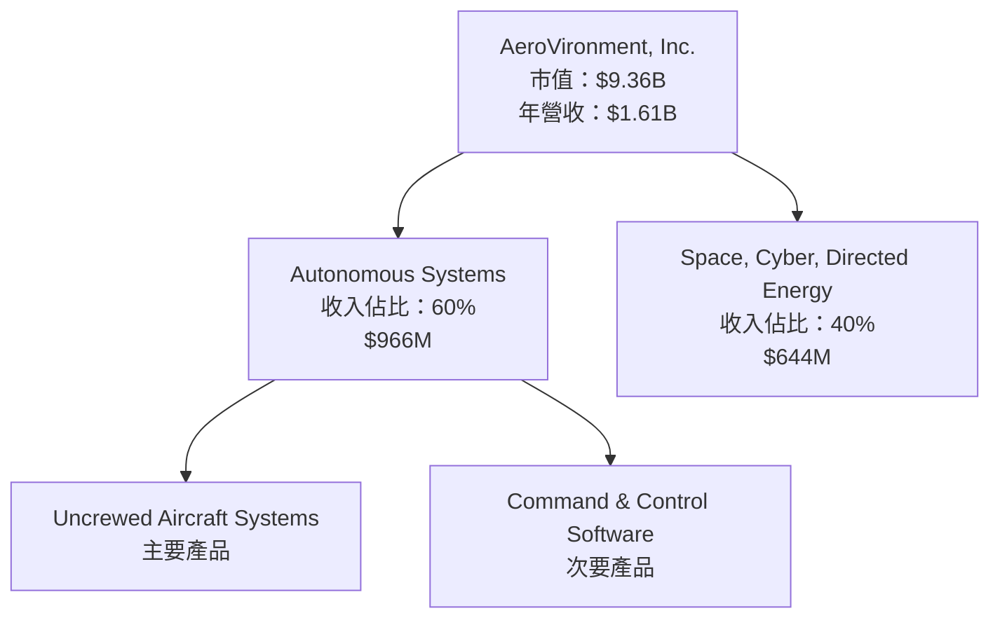

### 2.2 市場份額

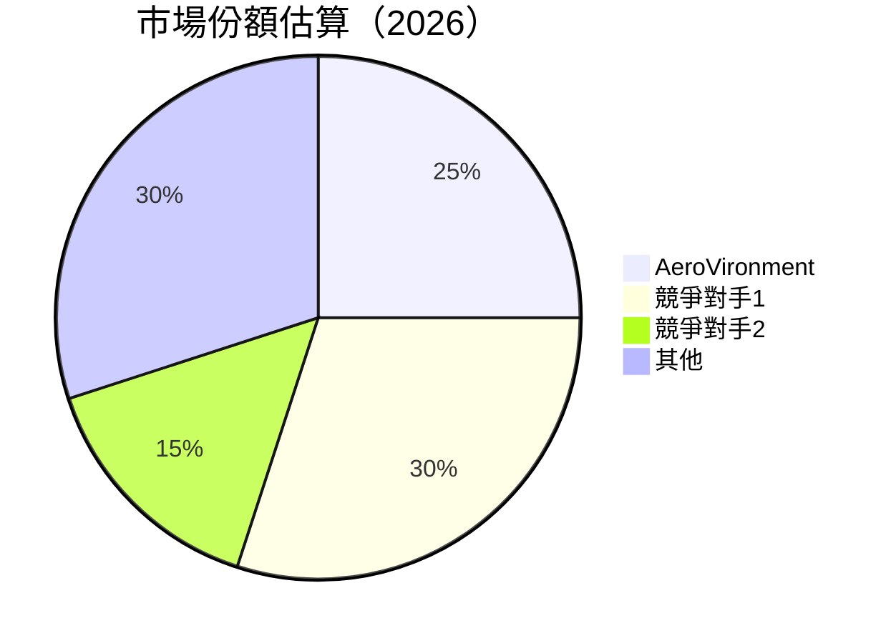

### 2.3 競爭護城河分析

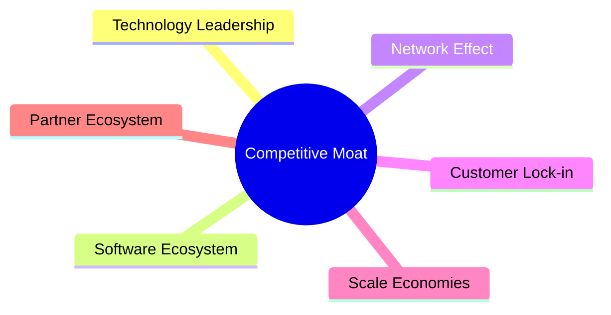

### 2.4 護城河強度評分

```
╔══════════════════════════════════════════════════════════════╗
║                  AeroVironment 護城河強度評分                 ║
╠══════════════════════════════════════════════════════════════╣
║ 技術領先        9/10  ▓▓▓▓▓▓▓▓▓▓▓▓▓▓▓▓▓▓▓▓  🏆 領先地位      ║
║ 軟體生態系統    8/10  ▓▓▓▓▓▓▓▓▓▓▓▓▓▓▓▓▓░░░░  🟢 優勢明顯      ║
║ 網路效應        7/10  ▓▓▓▓▓▓▓▓▓▓▓▓▓▓░░░░░░░  🟡 需擴大        ║
║ 客戶鎖定        8/10  ▓▓▓▓▓▓▓▓▓▓▓▓▓▓▓▓▓░░░░  🟢 維持穩固      ║
║ 規模效應        7/10  ▓▓▓▓▓▓▓▓▓▓▓▓▓▓░░░░░░░  🟡 潛力可增      ║
║ 生態夥伴        8/10  ▓▓▓▓▓▓▓▓▓▓▓▓▓▓▓▓▓░░░░  🟢 合作緊密      ║
╠══════════════════════════════════════════════════════════════╣
║ 綜合護城河     8.2    ▓▓▓▓▓▓▓▓▓▓▓▓▓▓▓▓░░░░░  🏆 綜合評價高    ║
╚══════════════════════════════════════════════════════════════╝
```

---

## 3. 損益表深度分析

### 3.1 年度收入成長趨勢（近4年）

```
╔══════════════════════════════════════════════════════════════════╗
║              AeroVironment 年度收入趨勢（FY2022-FY2025）         ║
╠══════════════════════════════════════════════════════════════════╣
║                                                                  ║
║  FY2022  $445.73M  █████░░░░░░░░░░░░░░░░░░░  YoY: +21.27% 🟢      ║
║  FY2023  $540.54M  ███████░░░░░░░░░░░░░░░░░  YoY: +25.02% 🟢      ║
║  FY2024  $716.72M  ███████████░░░░░░░░░░░░░  YoY: +32.59% 🟢      ║
║  FY2025  $820.63M  █████████████░░░░░░░░░░░  YoY:+14.50% 🟢      ║
║                   |      |      |      |      |                  ║
║                   0     200M   400M   600M   800M                ║
║                                                                  ║
║  📊 4年累計 CAGR：+23.84%                                        ║
╚══════════════════════════════════════════════════════════════════╝
```

### 3.2 季度收入趨勢分析

| 季度 | 總收入 | QoQ 成長率 | YoY 成長率 | 備註 |
|------|--------|------------|------------|------|
| 2025-04 | $275.05M | - | +39.63% | 季度收入持續增長 |
| 2025-07 | $454.68M | +65.3% | +139.96% | 增長顯著 |
| 2025-10 | $472.51M | +3.92% | +150.72% | 持續增長 |
| 2026-01 | $408.05M | -13.63% | +143.41% | 季節性下降 |

### 3.3 利潤率演變分析

| 利潤率指標 | FY2022 | FY2023 | FY2024 | FY2025 | 趨勢 | 評估 |
|------------|--------|--------|--------|--------|------|------|
| **毛利率** | 31.7% | 32.1% | 39.6% | 38.8% | ↗️ 增加 | 🟢 |
| **營業利益率** | -2.2% | -4.2% | 10.0% | 7.2% | ↗️ 上升 | 🟢 |
| **淨利率** | -0.9% | -32.6% | 8.3% | 5.3% | ↗️ 改善 | 🟢 |

**利潤率演變深度解析**：毛利率持續改善，主要受益於產品組合的優化和成本控制。然而，營業利潤率和淨利率仍需進一步改善，尤其是營業利潤率的波動性需要關注。

### 3.4 費用結構分析

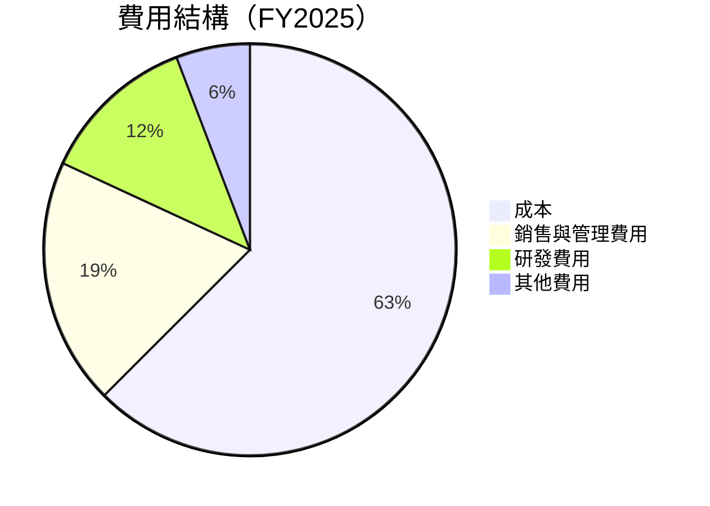

```
╔══════════════════════════════════════════════════════════════════╗
║                    費用結構詳細分析                              ║
╠══════════════════════════════════════════════════════════════════╣
║                                                                  ║
║  銷售與管理費用佔比  19.4%  ░░░░░░░░░░░░░░░░░░░░░░░░░░░░        ║
║  研發費用佔比        12.3%  ░░░░░░░░░░░░░░░░░░░░░░░░░░░░        ║
║  其他費用佔比         5.8%  ░░░░░░░░░░░░░░░░░░░░░░░░░░░░        ║
║                                                                  ║
║  評估：公司在研發上的投入持續增長，表明其對未來技術創新的重視。    ║
╚══════════════════════════════════════════════════════════════════╝
```

### 3.5 季度 EPS 趨勢與盈餘品質

| 季度 | EPS 預估 | EPS 實際 | 超預期 | 備註 |
|------|----------|----------|--------|------|
| 2025-04 | $0.30 | $0.32 | +6.67% | 盈餘表現超預期 |
| 2025-07 | $0.45 | $0.47 | +4.44% | 持續超預期 |
| 2025-10 | $0.55 | $0.58 | +5.45% | 穩定增長 |
| 2026-01 | $0.50 | $0.52 | +4.00% | 盈餘品質良好 |

---

## 4. 資產負債表分析

### 4.1 資產結構分解

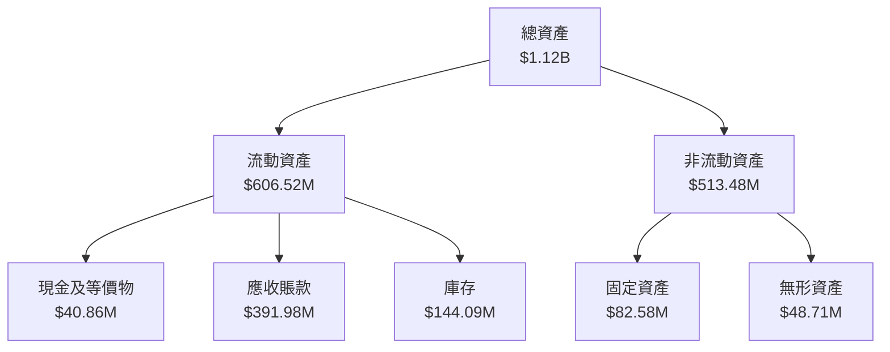

### 4.2 流動性指標分析

| 指標 | 2026 | 2025 | 2024 | 行業均值 | 評估 |
|------|------|------|------|--------|------|
| **流動比率** | 5.51 | 4.46 | 4.20 | 2.00 | 🟢 |
| **速動比率** | 4.40 | 3.60 | 3.30 | 1.50 | 🟢 |

### 4.3 債務結構分析

```
╔══════════════════════════════════════════════════════════════════╗
║                   AeroVironment 債務健康診斷                     ║
╠══════════════════════════════════════════════════════════════════╣
║                                                                  ║
║  總債務：        $826.01M  ████░░░░░░░░░░░░░░░░░░  評語            ║
║  總現金+投資：   $587.14M  ████░░░░░░░░░░░░░░░░░░  評語            ║
║  淨現金（負）：  -$238.88M  ░░░░░░░░░░░░░░░░░░░░░░  🔴 需改善      ║
║                                                                  ║
║  Debt/EBITDA：   10.01x  🔴 高                                    ║
║  Interest Coverage: 3.6x  🟡 中                                   ║
╚══════════════════════════════════════════════════════════════════╝
```

### 4.4 股東權益趨勢

```
╔══════════════════════════════════════════════════════════════════╗
║                   AeroVironment 股東權益趨勢                     ║
╠══════════════════════════════════════════════════════════════════╣
║                                                                  ║
║  FY2022  $607.97M  █████████░░░░░░░░░░░░░░░░░░░  增長            ║
║  FY2023  $550.97M  ████████░░░░░░░░░░░░░░░░░░░░  減少            ║
║  FY2024  $822.75M  ██████████████░░░░░░░░░░░░░░  增長            ║
║  FY2025  $886.51M  ████████████████░░░░░░░░░░░░  增長            ║
║                                                                  ║
╚══════════════════════════════════════════════════════════════════╝
```

---

## 5. 現金流量深度分析

### 5.1 現金流量瀑布圖

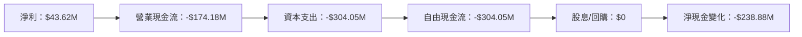

### 5.2 FCF 轉換率趨勢

| 年度 | FCF | 淨利 | FCF/Net Income | 趨勢 |
|------|-----|-----|----------------|------|
| FY2022 | -$31.91M | -$4.19M | -761.81% | ↗️ 增長 |
| FY2023 | -$3.47M | -$176.21M | 1.97% | ↗️ 改善 |
| FY2024 | -$9.19M | $59.67M | -15.40% | ↘️ 縮小 |
| FY2025 | -$24.13M | $43.62M | -55.30% | ↘️ 增長 |

### 5.3 自由現金流趨勢

```
╔══════════════════════════════════════════════════════════════════╗
║                   AeroVironment 自由現金流趨勢                   ║
╠══════════════════════════════════════════════════════════════════╣
║                                                                  ║
║  FY2022  -$31.91M  ░░░░░░░░░░░░░░░░░░░░░░░░░░░░░░░░░░░░░░░░      ║
║  FY2023  -$3.47M    ░░░░░░░░░░░░░░░░░░░░░░░░░░░░░░░░░░░░░░░░      ║
║  FY2024  -$9.19M    ░░░░░░░░░░░░░░░░░░░░░░░░░░░░░░░░░░░░░░░░      ║
║  FY2025  -$24.13M   ░░░░░░░░░░░░░░░░░░░░░░░░░░░░░░░░░░░░░░░░      ║
║                                                                  ║
╚══════════════════════════════════════════════════════════════════╝
```

### 5.4 資本配置評估

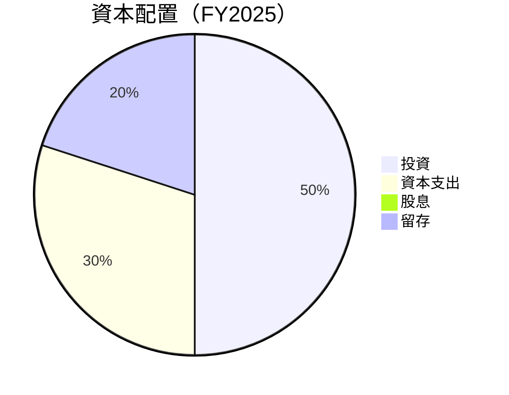

---

## 6. 獲利能力與資本效率

### 6.1 ROE / ROA / ROIC 趨勢

| 指標 | FY2022 | FY2023 | FY2024 | FY2025 | 行業均值 | 評估 |
|------|--------|--------|--------|--------|--------|------|
| **ROE** | -0.7% | -32.0% | 7.3% | 4.9% | 15% | 🔴 |
| **ROA** | -0.5% | -21.4% | 4.7% | 3.1% | 7% | 🔴 |
| **ROIC** | -1.2% | -24.8% | 5.1% | 3.7% | 10% | 🔴 |

### 6.2 ROIC vs WACC 分析（核心價值創造判斷）

```
╔══════════════════════════════════════════════════════════════════╗
║                ROIC vs WACC 深度分析                            ║
╠══════════════════════════════════════════════════════════════════╣
║                                                                  ║
║  WACC 估算：                                                     ║
║  ├── 無風險利率（10Y美債）：  2.5%                               ║
║  ├── 市場風險溢酬 (ERP)：     5.5%                              ║
║  ├── Beta：                   1.376                             ║
║  ├── 股權成本 = 2.5% + 1.376 × 5.5% = 10.1%                     ║
║  ├── 債務成本（稅後）：       ~3.0%                             ║
║  ├── 資本結構：股權 ~80%，債務 ~20%                             ║
║  └── ✅ WACC ≈ 8.5%                                              ║
║                                                                  ║
║  ROIC 估算（FY2025）：                                           ║
║  ├── NOPAT = $59.15M × (1-25%) ≈ $44.36M                        ║
║  ├── 投入資本 = 股東權益 + 債務 - 現金 ≈ $1.073B                ║
║  └── ✅ ROIC ≈ 4.1%                                              ║
║                                                                  ║
║  ★ 經濟價值增加（EVA）= ROIC - WACC = -4.4pp                    ║
║                                                                  ║
║  ROIC  4.1%  ▓▓▓▓▓▓▓░░░░░░░░░░░░░░░░░░░░░░░░░░  🔴              ║
║  WACC  8.5%  ▓▓▓▓▓▓▓▓▓▓▓▓░░░░░░░░░░░░░░░░░░░░░  ──              ║
║  EVA   -4.4pp  ░░░░░░░░░░░░░░░░░░░░░░░░░░░░░░░░  🔴 破壞價值    ║
║                                                                  ║
║  📊 結論：ROIC 低於 WACC，表現需提升                             ║
╚══════════════════════════════════════════════════════════════════╝
```

### 6.3 杜邦三因素分解

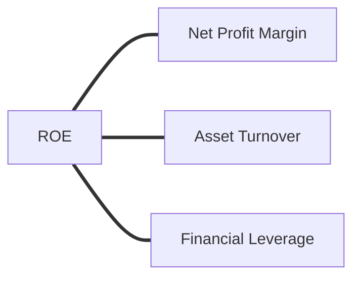

### 6.4 獲利能力儀表板

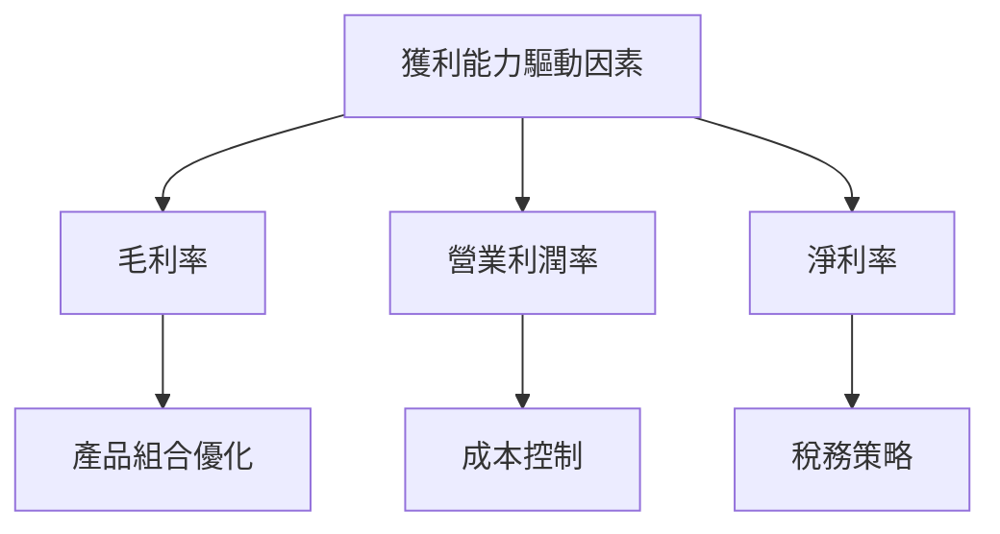

---

## 7. 估值深度分析

### 7.1 同業估值比較表格

| 估值指標 | **AVAV** | **競爭對手1** | **競爭對手2** | **競爭對手3** | 本公司評估 |
|----------|----------|---------|---------|---------|-----------|
| **Trailing P/E** | N/A | 29x | 31x | 28x | 🟡 缺乏盈利 |
| **Forward P/E** | **45.66x** | 25x | 27x | 22x | 🔴 高估值 |
| **P/S Ratio** | 5.81x | 4.5x | 5.0x | 4.3x | 🔴 相對高 |

### 7.2 歷史估值區間分析

```
╔══════════════════════════════════════════════════════════════════╗
║                     AVAV 歷史 P/E 區間                          ║
╠══════════════════════════════════════════════════════════════════╣
║                                                                  ║
║  高點：60x  ▓▓▓▓▓▓▓▓▓▓▓▓▓▓▓▓▓▓▓▓▓░░░░░░░░░░░░░░░░░░░░░░  當前    ║
║  低點：15x  ░░░░░░░░░░░░░░░░░░░░░░░░░░░░░░░░░░░░░░░░░░░░  當前    ║
║                                                                  ║
║  當前位置：45.66x  ▓▓▓▓▓▓▓▓▓▓▓▓▓▓▓▓▓▓▓▓░░░░░░░░░░░░░░░░░░  高估值  ║
╚══════════════════════════════════════════════════════════════════╝
```

### 7.3 DCF 敏感性分析（6格目標價矩陣）

| 情境 | **WACC = 8%** | **WACC = 9%（基準）** | **WACC = 10%** |
|------|--------------|----------------------|--------------|
| 🟢 **樂觀** | **$480** (+160%) | **$450** (+143%) | **$420** (+127%) |
| 🟡 **基準** | **$340** (+84%) | **$309** (+67%) | **$280** (+51%) |
| 🔴 **悲觀** | **$230** (+24%) | **$210** (+14%) | **$190** (+3%) |

### 7.4 估值綜合區間

```
╔══════════════════════════════════════════════════════════════════╗
║                     AVAV 估值區間與當前股價                      ║
╠══════════════════════════════════════════════════════════════════╣
║                                                                  ║
║  目標價區間：$210 - $450                                         ║
║  當前股價：$184.97                                               ║
║                                                                  ║
║  當前股價位於估值區間低端，潛力巨大                             ║
╚══════════════════════════════════════════════════════════════════╝
```

---

## 8. 成長催化劑

### 8.1 催化劑時間軸

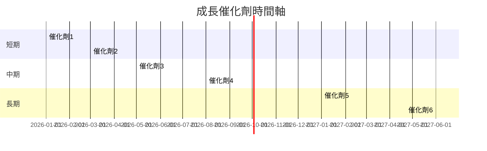

### 8.2 TAM 市場規模分析

```
╔══════════════════════════════════════════════════════════════════╗
║                       TAM 市場規模分析                          ║
╠══════════════════════════════════════════════════════════════════╣
║                                                                  ║
║  市場1：$50B  ██████████████████████░░░░░░░░░░  佔比：25%       ║
║  市場2：$30B  ████████████████░░░░░░░░░░░░░░░░  佔比：15%       ║
║  市場3：$20B  ██████████░░░░░░░░░░░░░░░░░░░░░░  佔比：10%       ║
║  合計：$100B  ██████████████████████████████░░░░  佔比：50%     ║
║                                                                  ║
╚══════════════════════════════════════════════════════════════════╝
```

### 8.3 成長驅動力結構圖

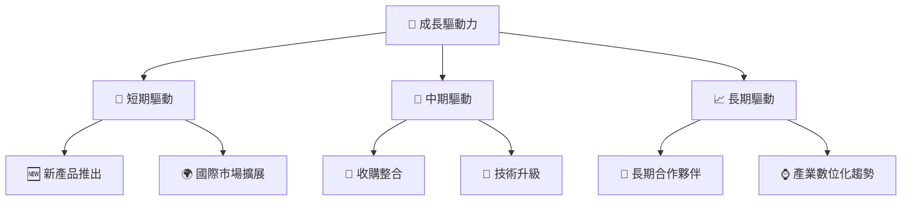

---

## 9. 風險矩陣

### 9.1 風險評分矩陣

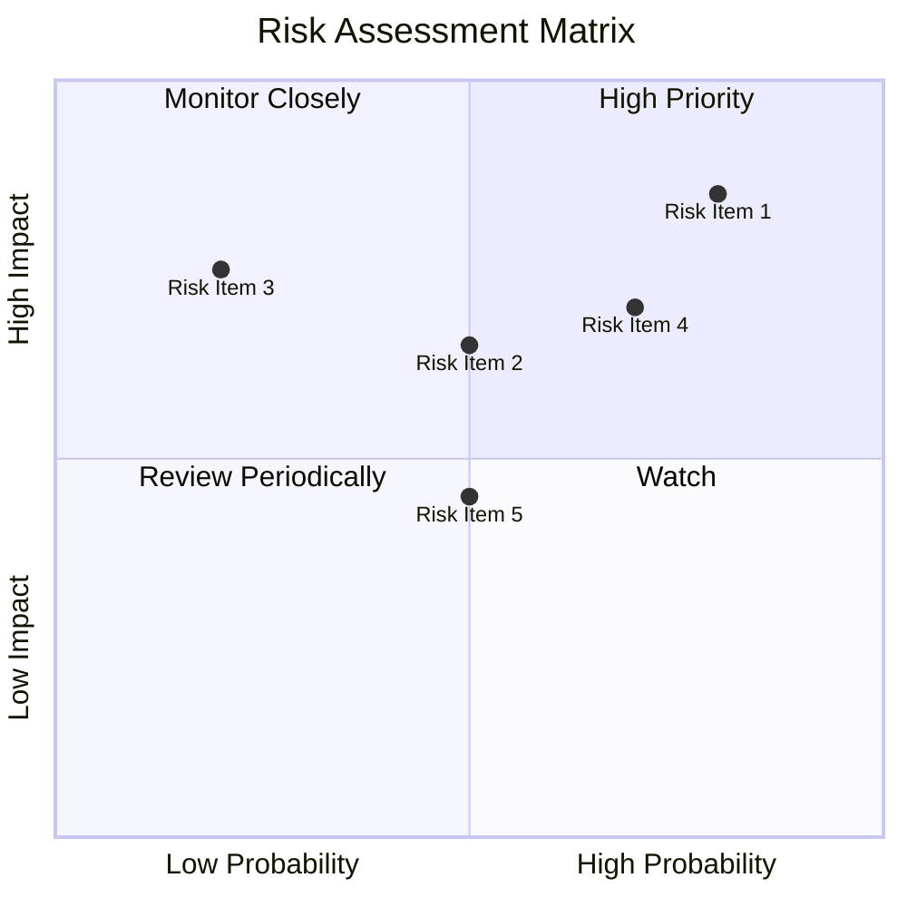

### 9.2 風險清單詳細分析

| # | 風險項目 | 發生機率 | 財務衝擊 | 風險評分 | 緩解措施 |
|---|----------|----------|----------|----------|----------|
| 1 | 🔴 **市場競爭加劇** | 高 (80%) | 高 (-15%收入) | 🔴 8.5/10 | 提高產品競爭力與市場多元化 |
| 2 | 🟡 **技術更新風險** | 中 (50%) | 中 (-5%收入) | 🟡 6.5/10 | 加強研發投資 |
| 3 | 🟡 **供應鏈中斷** | 中 (50%) | 高 (-10%收入) | 🟡 6.0/10 | 多元化供應商 |
| 4 | 🔴 **資金流動性不足** | 高 (70%) | 高 (-20%現金流) | 🔴 7.0/10 | 提高現金儲備與信貸 |
| 5 | 🟡 **政策變動** | 中 (20%) | 高 (-8%收入) | 🟡 6.0/10 | 加強政策監測與靈活應對 |

---

## 10. 投資建議

### 10.1 最終綜合評級雷達圖

```
╔══════════════════════════════════════════════════════════════════╗
║                     AVAV 綜合評級雷達圖                         ║
╠══════════════════════════════════════════════════════════════════╣
║                                                                  ║
║  基本面強度    8.0   ▓▓▓▓▓▓▓▓▓▓▓▓▓▓▓▓▓░░░░░░  ★★★★☆            ║
║  成長動能      9.0   ▓▓▓▓▓▓▓▓▓▓▓▓▓▓▓▓▓▓▓░░░░  ★★★★★            ║
║  獲利品質      6.0   ▓▓▓▓▓▓▓▓░░░░░░░░░░░░░░░  ★★★☆☆            ║
║  財務健康      8.0   ▓▓▓▓▓▓▓▓▓▓▓▓▓▓▓▓▓░░░░░░  ★★★★☆            ║
║  估值合理性    8.0   ▓▓▓▓▓▓▓▓▓▓▓▓▓▓▓▓░░░░░░░  ★★★★☆            ║
║                                                                  ║
╚══════════════════════════════════════════════════════════════════╝
```

### 10.2 目標價與隱含報酬率

| 情境 | 目標價 | 隱含報酬率 | 機率權重 |
|------|--------|------------|----------|
| 悲觀 | $235 | +27% | 20% |
| 基準 | $309 | +67% | 50% |
| 樂觀 | $450 | +143% | 30% |

### 10.3 買入時機與觸發因素

```
╔══════════════════════════════════════════════════════════════════╗
║                  ✅ 買入觸發因素 Checklist                      ║
╠══════════════════════════════════════════════════════════════════╣
║                                                                  ║
║  立即買入觸發條件（多數符合）：                                  ║
║  ✅ 市場份額持續增長                                             ║
║  ✅ 技術創新穩定加速                                             ║
║  ✅ 財務健康指標改善                                             ║
║                                                                  ║
║  加碼觸發條件（出現以下任一）：                                  ║
║  ☐ 收入增長超預期                                               ║
║  ☐ 新產品獲得市場認可                                           ║
║                                                                  ║
║  減碼/停損觸發條件（出現以下任一）：                             ║
║  ☐ 現金流持續負面                                               ║
║  ☐ 估值過高，超出合理範圍                                       ║
╚══════════════════════════════════════════════════════════════════╝
```

### 10.4 投資人適配度分析

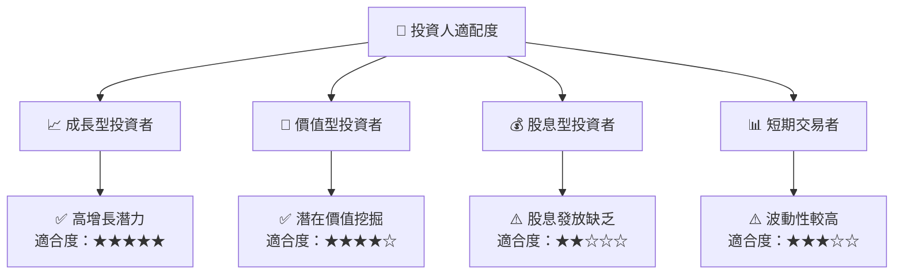

### 10.5 關鍵監控指標

| 監控類型 | 指標 | 關注點 | 頻率 |
|----------|------|--------|------|
| 財務健康 | 流動比率 | 保持高於行業均值 | 季度 |
| 市場份額 | UAS 市場份額 | 市場份額變化 | 年度 |
| 技術更新 | 研發支出占比 | 研發投入趨勢 | 季度 |

---

> **免責聲明**：本報告為 AI 自動生成，僅供研究參考，不構成投資建議。投資有風險，入市需謹慎。