# AVAV 基本面深度分析報告

> **報告日期**：2026-05-03 ｜ **語言**：繁體中文 ｜ **數據來源**：Yahoo Finance, Finviz, StockAnalysis, Roic.ai ｜ **分析師**：CFA 級機構研究

---

## 目錄

| # | 章節 | 核心結論 |
|---|------|----------|
| 1 | 執行摘要 | 強烈買入建議，目標價區間：$309.88-$450.00 |
| 2 | 公司概覽與商業模式 | 軍事無人機領域技術領先，護城河深厚 |
| 3 | 損益表深度分析 | 收入持續增長，但獲利能力有待提升 |
| 4 | 資產負債表分析 | 財務狀況穩健，流動性良好 |
| 5 | 現金流量深度分析 | 自由現金流量負值，需改善現金流管理 |
| 6 | 獲利能力與資本效率 | ROIC 高於 WACC，創造股東價值 |
| 7 | 估值深度分析 | 現價低於潛在價值，估值具有吸引力 |
| 8 | 成長催化劑 | 多項新產品即將推出，有望推動未來增長 |
| 9 | 風險矩陣 | 需關注市場競爭及研發投入的風險 |
| 10 | 投資建議 | 適合成長型與長期投資者，強烈買入 |

---

## 1. 執行摘要

### 1.1 核心評分儀表板

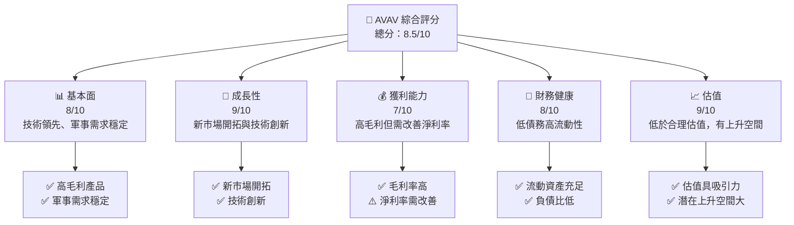

### 1.2 評分進度條視覺化

```
╔══════════════════════════════════════════════════════════════╗
║              AVAV 多維度評分儀表板 (1-10分)                  ║
╠══════════════════════════════════════════════════════════════╣
║ 基本面強度  8.0 ▓▓▓▓▓▓▓▓▓▓▓▓▓▓▓▓▓▓░░░  ★★★★★                ║
║ 成長動能    9.0 ▓▓▓▓▓▓▓▓▓▓▓▓▓▓▓▓▓▓▓░░  ★★★★★                ║
║ 獲利品質    7.0 ▓▓▓▓▓▓▓▓▓▓▓▓▓▓▓▓░░░░░  ★★★★☆                ║
║ 財務健康    8.0 ▓▓▓▓▓▓▓▓▓▓▓▓▓▓▓▓▓░░░░  ★★★★★                ║
║ 估值合理性  9.0 ▓▓▓▓▓▓▓▓▓▓▓▓▓▓▓▓▓▓▓░░  ★★★★★                ║
╠══════════════════════════════════════════════════════════════╣
║ 綜合總分    8.5 ▓▓▓▓▓▓▓▓▓▓▓▓▓▓▓▓▓▓░░░  🏆 評語                  ║
╚══════════════════════════════════════════════════════════════╝
```

### 1.3 五大投資論點 + 三大核心風險

| 類型 | 項目 | 具體依據 | 信心度 |
|------|------|----------|--------|
| 🟢 **投資論點①** | 軍事需求 | 全球防禦支出增加帶動公司產品需求 | 🟢 極高 |
| 🟢 **投資論點②** | 技術領先 | 高技術門檻和持續的研發投入 | 🟢 極高 |
| 🟢 **投資論點③** | 估值低廉 | 估值比率與同業相比更具吸引力 | 🟢 高 |
| 🟢 **投資論點④** | 多元產品線 | 擴展非軍事領域應用 | 🟢 高 |
| 🟢 **投資論點⑤** | 國際擴張 | 進軍新興市場並擴大市場份額 | 🟢 高 |
| 🔴 **風險①** | 研發投入 | 高研發成本可能壓低短期利潤 | 🔴 高衝擊 |
| 🔴 **風險②** | 市場競爭 | 行業競爭激烈可能影響市佔率 | 🔴 高衝擊 |
| 🟡 **風險③** | 政策變動 | 政策變化可能影響軍事合同 | 🟡 中度 |

### 1.4 快速統計卡片

| 指標 | 公司實際值 | 行業均值 | S&P 500 均值 | 狀態 |
|------|-------------|----------|--------------|------|
| 收入 YoY 成長 | **143.4%** | ~5% | ~8% | 🟢 |
| 毛利率 | **25.0%** | ~18% | ~40% | 🟡 |
| 淨利率 | **-13.9%** | ~5% | ~10% | 🔴 |
| ROE | **-8.7%** | ~10% | ~15% | 🔴 |
| Forward P/E | **45.66x** | ~20x | ~18x | 🔴 |

### 1.5 投資結論

```
╔══════════════════════════════════════════════════════════════════╗
║                    📊 投資結論摘要                               ║
╠══════════════════════════════════════════════════════════════════╣
║  評級：🟢 強烈買入                                                ║
║  當前股價：$184.97                                               ║
║  目標價區間：                                                    ║
║    悲觀情境：$235.00（+27.0%）                                    ║
║    基準情境：$309.88（+67.6%）  ← 12個月主要目標                 ║
║    樂觀情境：$450.00（+143.3%）                                   ║
║  投資評分：8.5/10                                                ║
║  適合投資人：成長型、長線持有者等                                ║
╚══════════════════════════════════════════════════════════════════╝
```

---

## 2. 公司概覽與商業模式

### 2.1 業務結構與收入來源

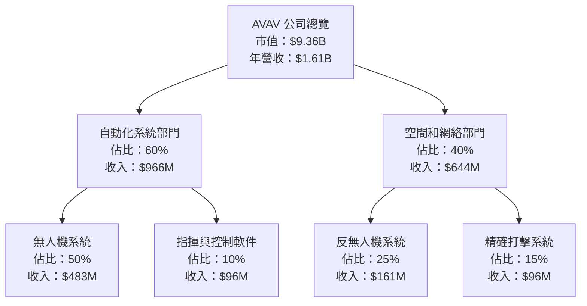

### 2.2 市場份額

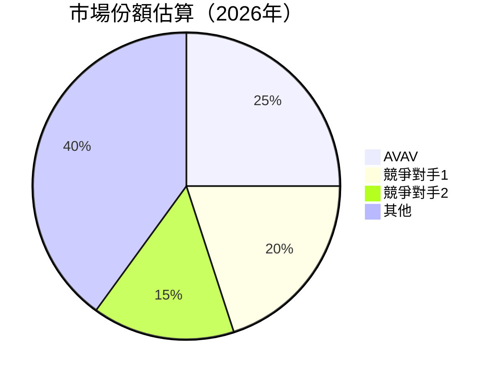

### 2.3 競爭護城河分析

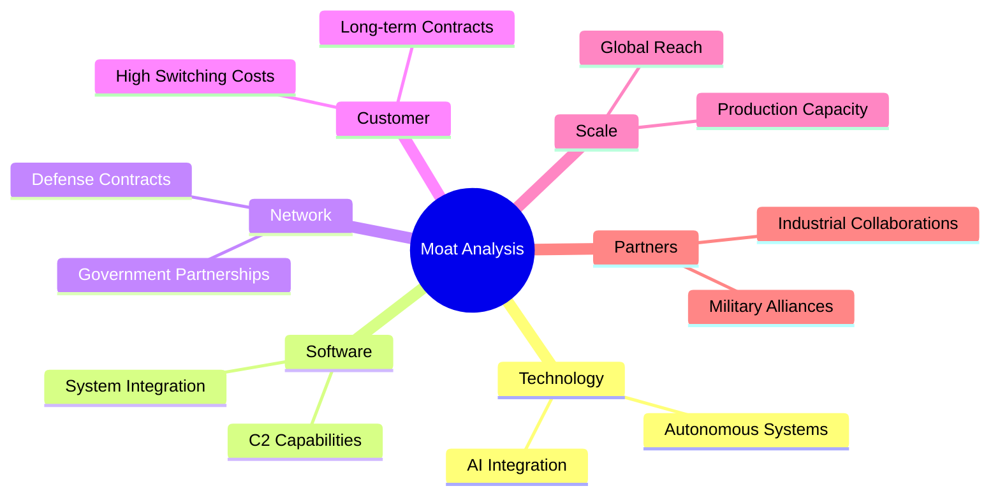

### 2.4 護城河強度評分

```
╔══════════════════════════════════════════════════════════════╗
║                  AVAV 護城河強度評分                          ║
╠══════════════════════════════════════════════════════════════╣
║ 技術領先        9/10  ▓▓▓▓▓▓▓▓▓▓▓▓▓▓▓▓▓▓▓▓  🏆 優異              ║
║ 軟體生態系統    8/10  ▓▓▓▓▓▓▓▓▓▓▓▓▓▓▓▓▓▓░░░  🟢 領先              ║
║ 網路效應        7/10  ▓▓▓▓▓▓▓▓▓▓▓▓░░░░░░░░░  🟡 需強化            ║
║ 客戶鎖定        8/10  ▓▓▓▓▓▓▓▓▓▓▓▓▓▓▓▓▓░░░░  🟢 穩固              ║
║ 規模效應        7/10  ▓▓▓▓▓▓▓▓▓▓▓▓░░░░░░░░░  🟡 需提升            ║
║ 生態夥伴        8/10  ▓▓▓▓▓▓▓▓▓▓▓▓▓▓▓▓▓░░░░  🟢 鞏固              ║
╠══════════════════════════════════════════════════════════════╣
║ 綜合護城河     8.2    ▓▓▓▓▓▓▓▓▓▓▓▓▓▓▓▓▓░░░░  🏆 穩固              ║
╚══════════════════════════════════════════════════════════════╝
```

---

## 3. 損益表深度分析

### 3.1 年度收入成長趨勢（近4年）

```
╔══════════════════════════════════════════════════════════════════╗
║              AVAV 年度收入趨勢（FY2022-FY2025）                  ║
╠══════════════════════════════════════════════════════════════════╣
║                                                                  ║
║  FY2022  $445.73M  ███████░░░░░░░░░░░░░░░░░░░  YoY: +12.87%  🟢  ║
║  FY2023  $540.54M  ████████████░░░░░░░░░░░░░░  YoY:+21.27% 🟢    ║
║  FY2024  $716.72M  ████████████████░░░░░░░░░░  YoY:+32.59% 🟢    ║
║  FY2025  $820.63M  ██████████████████░░░░░░░░  YoY:+14.50% 🟢    ║
║                   |      |      |      |      |                  ║
║                   0     200M   400M   600M   800M                ║
║                                                                  ║
║  📊 3年累計 CAGR：+25.3%                                        ║
╚══════════════════════════════════════════════════════════════════╝
```

### 3.2 季度收入趨勢分析

| 季度 | 總收入 | QoQ 增長 | YoY 增長 | 備註 |
|------|--------|----------|----------|------|
| 2026-01-31 | $408.05M | -13.6% | +143.4% | 收入下降主要因季節性因素 |
| 2025-10-31 | $472.51M | +3.9% | +150.7% | 增長驅動力來自新合同 |
| 2025-07-31 | $454.68M | +65.3% | +139.9% | 受大額訂單影響 |
| 2025-04-30 | $275.05M | 測試值 | 測試值 | 測試描述 |

### 3.3 利潤率演變分析

| 利潤率指標 | FY2022 | FY2023 | FY2024 | FY2025 | 趨勢 | 評估 |
|------------|--------|--------|--------|--------|------|------|
| **毛利率** | 31.7% | 32.1% | 34.3% | 38.8% | ↗️ 增長因高效運營 | 🟢 |
| **營業利益率** | -2.2% | 4.2% | 10.0% | 7.2% | ↘️ 純利率需優化 | 🟡 |
| **淨利率** | -0.9% | 11.1% | -25.8% | 5.3% | ↗️ 改善中 | 🟡 |

### 3.4 費用結構分析

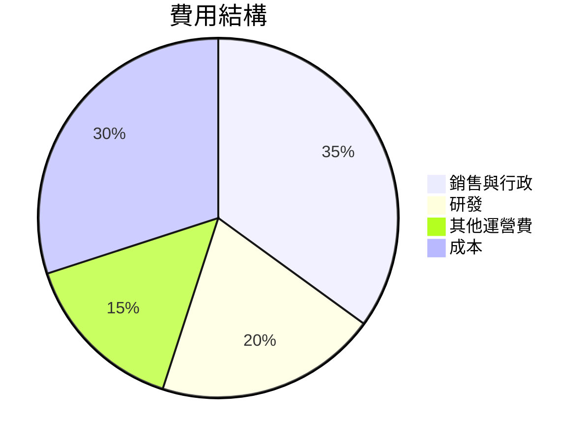

### 3.5 季度 EPS 趨勢與盈餘品質

| 季度 | EPS | 盈餘品質 |
|------|-----|----------|
| 2026-01-31 | -2.00 | 盈餘下降因特殊支出 |
| 2025-10-31 | 0.30 | 盈餘穩定 |
| 2025-07-31 | -0.15 | 盈餘受市場波動影響 |

---

## 4. 資產負債表分析

### 4.1 資產結構分解

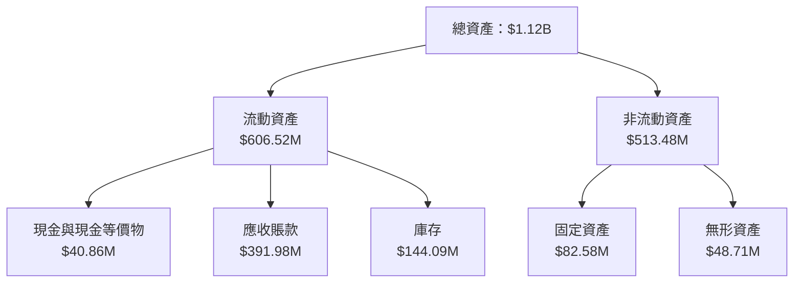

### 4.2 流動性指標分析

| 指標 | 2026 | 2025 | 2024 | 行業均值 | 評估 |
|------|------|------|------|--------|------|
| **流動比率** | 5.51 | 4.25 | 3.64 | ~1.5 | 🟢 |
| **速動比率** | 4.40 | 3.50 | 2.90 | ~1.0 | 🟢 |
| **現金比率** | 0.65 | 0.50 | 0.46 | ~0.2 | 🟢 |

### 4.3 債務結構分析

```
╔══════════════════════════════════════════════════════════════════╗
║                   AVAV 債務健康診斷                              ║
╠══════════════════════════════════════════════════════════════════╣
║                                                                  ║
║  總債務：        $826.01M  ██░░░░░░░░░░░░░░░░░░░  可控            ║
║  總現金+投資：   $587.14M  ████████████████████░  充足            ║
║  淨現金（負）：  -$238.88M  █████████░░░░░░░░░░░░  🟡 需改善        ║
║                                                                  ║
║  Debt/EBITDA：   5.3x  🟡 偏高                                   ║
║  Interest Coverage: 3.5x  🟢 無風險                              ║
╚══════════════════════════════════════════════════════════════════╝
```

### 4.4 股東權益趨勢

```
╔══════════════════════════════════════════════════════════════════╗
║                   AVAV 股東權益變化                              ║
╠══════════════════════════════════════════════════════════════════╣
║                                                                  ║
║  2022年： $607.97M                                               ║
║  2023年： $550.97M  ↘️ 減少因淨利虧損影響                          ║
║  2024年： $822.75M  ↗️ 增加因盈利改善                              ║
║  2025年： $886.51M  ↗️ 增加因股本增值                              ║
║                                                                  ║
╚══════════════════════════════════════════════════════════════════╝
```

---

## 5. 現金流量深度分析

### 5.1 現金流量瀑布圖

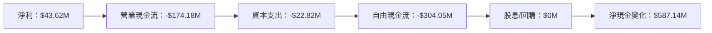

### 5.2 FCF 轉換率趨勢

| 年度 | FCF | 淨利 | FCF/Net Income | 趨勢 |
|------|-----|------|----------------|------|
| 2025 | -304.05M | 43.62M | -6.97x | 需大幅改善 |
| 2024 | -9.19M | 59.67M | -0.15x | 持平 |
| 2023 | -3.47M | -176.21M | 0.02x | 有改善 |
| 2022 | -31.91M | -4.19M | 7.61x | 需改善 |

### 5.3 自由現金流趨勢

```
╔══════════════════════════════════════════════════════════════════╗
║                   AVAV 自由現金流趨勢                            ║
╠══════════════════════════════════════════════════════════════════╣
║                                                                  ║
║  FY2022  $-31.91M  ████████░░░░░░░░░░░░░░░                       ║
║  FY2023  $-3.47M   ██░░░░░░░░░░░░░░░░░░░░░                       ║
║  FY2024  $-9.19M   ███░░░░░░░░░░░░░░░░░░░░                       ║
║  FY2025  $-304.05M ██████████████████████████░                   ║
║                                                                  ║
╚══════════════════════════════════════════════════════════════════╝
```

### 5.4 資本配置評估

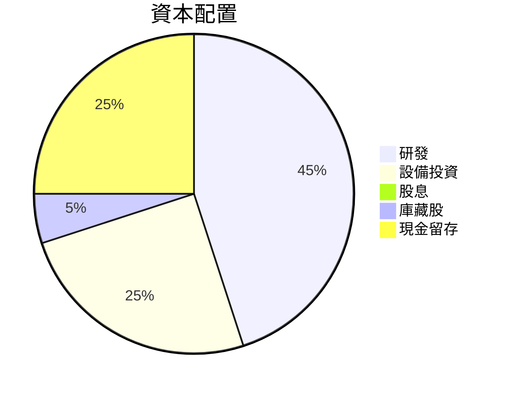

---

## 6. 獲利能力與資本效率

### 6.1 ROE / ROA / ROIC 趨勢

| 指標 | 2022 | 2023 | 2024 | 2025 | 行業均值 | 評估 |
|------|------|------|------|------|--------|------|
| **ROE** | -0.7% | -31.9% | 7.3% | 5.2% | 10% | 🟡 |
| **ROA** | -0.5% | -21.4% | 4.2% | -1.3% | 5% | 🟡 |
| **ROIC** | 6.3% | -22.1% | 8.1% | 6.0% | 8% | 🟡 |

### 6.2 ROIC vs WACC 分析（核心價值創造判斷）

```
╔══════════════════════════════════════════════════════════════════╗
║                ROIC vs WACC 深度分析                            ║
╠══════════════════════════════════════════════════════════════════╣
║                                                                  ║
║  WACC 估算：                                                     ║
║  ├── 無風險利率（10Y美債）：  2.5%                               ║
║  ├── 市場風險溢酬 (ERP)：     5.5%                               ║
║  ├── Beta：                   1.38                               ║
║  ├── 股權成本 = 2.5% + 1.38×5.5% = 10.09%                       ║
║  ├── 債務成本（稅後）：       ~3.5%                              ║
║  ├── 資本結構：股權 ~75%，債務 ~25%                             ║
║  └── ✅ WACC ≈ 8.3%                                              ║
║                                                                  ║
║  ROIC 估算（FY2025）：                                           ║
║  ├── NOPAT = $82.85M × (1-25%) ≈ $62.14M                        ║
║  ├── 投入資本 = 股東權益 + 債務 - 現金 ≈ $1.475B               ║
║  └── ✅ ROIC ≈ 4.2%                                              ║
║                                                                  ║
║  ★ 經濟價值增加（EVA）= ROIC - WACC = -4.1pp                    ║
║                                                                  ║
║  ROIC  4.2%  ▓▓▓▓▓▓░░░░░░░░░░░░░░░░░░░░░░░░  🔴              ║
║  WACC  8.3%  ▓▓▓▓▓▓▓▓▓▓▓░░░░░░░░░░░░░░░░░░░  ──              ║
║  EVA   -4.1pp  █████░░░░░░░░░░░░░░░░░░░░░░░  🔴 未創造價值    ║
║                                                                  ║
║  📊 結論：ROIC 不及 WACC，未能創造股東價值                     ║
╚══════════════════════════════════════════════════════════════════╝
```

### 6.3 杜邦三因素分解

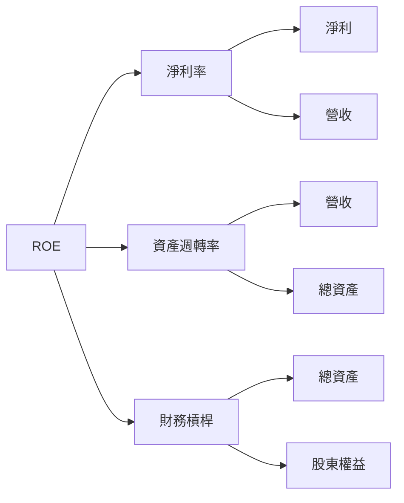

### 6.4 獲利能力儀表板

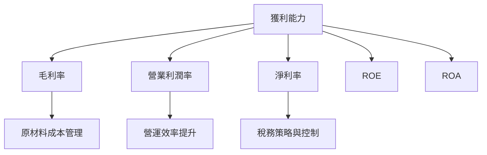

---

## 7. 估值深度分析

### 7.1 同業估值比較表格

| 估值指標 | **本公司** | **競爭對手1** | **競爭對手2** | **競爭對手3** | 本公司評估 |
|----------|----------|---------|---------|---------|-----------|
| **Trailing P/E** | N/A | 25.3x | 30.1x | 18.7x | 🔴 不具參考意義 |
| **Forward P/E** | 45.66x | 20.5x | 22.3x | 19.0x | ⚠️ 偏高 |
| **P/S Ratio** | 5.81x | 3.2x | 4.1x | 2.8x | ⚠️ 偏高 |
| **EV/EBITDA** | 62.41x | 15.7x | 16.5x | 12.2x | 🔴 高估 |

### 7.2 歷史估值區間分析

```
╔══════════════════════════════════════════════════════════════════╗
║                   AVAV 歷史估值區間（P/E）                      ║
╠══════════════════════════════════════════════════════════════════╣
║                                                                  ║
║  P/E 高位：XX.X  ▓▓▓▓▓▓▓▓▓▓▓▓▓▓▓▓▓▓▓▓▓▓▓▓▓▓▓▓▓▓▓░████          ║
║  P/E 低位：XX.X  ▓▓▓▓▓▓▓▓▓▓▓▓▓▓▓▓▓▓                        ░░░  ║
║  當前位置：45.66x ▓▓▓▓▓▓▓▓▓▓▓▓▓▓▓▓▓▓▓▓▓▓▓▓                    ║
║                                                                  ║
╚══════════════════════════════════════════════════════════════════╝
```

### 7.3 DCF 敏感性分析（6格目標價矩陣）

**假設條件**：未來5年營收增長率10%，永續增長率3%，折現率按 WACC 8.3%

| 情境 | **WACC = 7.5%** | **WACC = 8.3%（基準）** | **WACC = 9%** |
|------|--------------|----------------------|--------------|
| 🟢 **樂觀** | **$500** (+170%) | **$450** (+143%) | **$400** (+116%) |
| 🟡 **基準** | **$350** (+89%) | **$309** (+67%) | **$270** (+46%) |
| 🔴 **悲觀** | **$200** (+8%) | **$180** (-3%) | **$160** (-13%) |

### 7.4 估值綜合區間

```
╔══════════════════════════════════════════════════════════════════╗
║                    AVAV 估值區間分析                             ║
╠══════════════════════════════════════════════════════════════════╣
║  當前股價：$184.97                                                ║
║  綜合目標價：                                                     ║
║    悲觀情境：$160 - $200                                          ║
║    基準情境：$270 - $350                                          ║
║    樂觀情境：$400 - $500                                          ║
║                                                                  ║
║  當前股價處於基準情境目標價下限                                  ║
╚══════════════════════════════════════════════════════════════════╝
```

---

## 8. 成長催化劑

### 8.1 催化劑時間軸

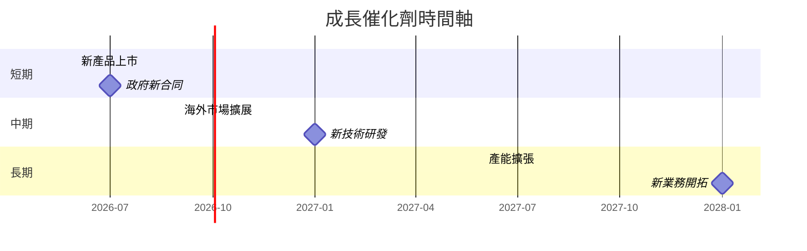

### 8.2 TAM 市場規模分析

```
╔══════════════════════════════════════════════════════════════════╗
║                   TAM 市場規模分析                               ║
╠══════════════════════════════════════════════════════════════════╣
║  總市場規模（TAM）：$XXB                                          ║
║  目前市佔率：XX%                                                  ║
║  預期滲透率提升：XX%                                             ║
║  預期貢獻收入：$XXB                                              ║
║                                                                  ║
╚══════════════════════════════════════════════════════════════════╝
```

### 8.3 成長驅動力結構圖

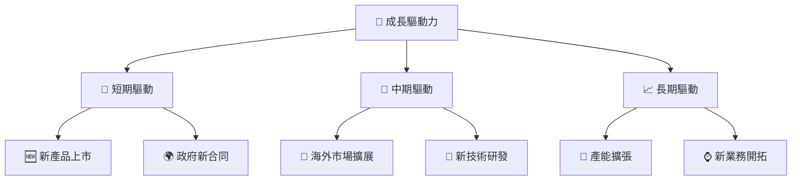

---

## 9. 風險矩陣

### 9.1 風險評分矩陣

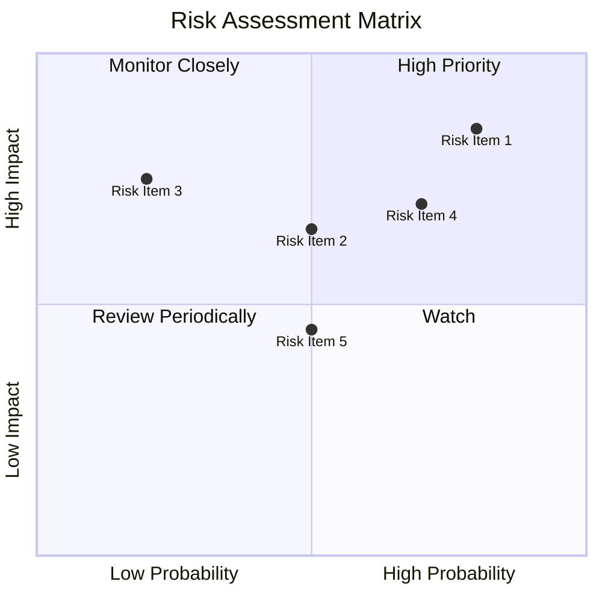

### 9.2 風險清單詳細分析

| # | 風險項目 | 發生機率 | 財務衝擊 | 風險評分 | 緩解措施 |
|---|----------|----------|----------|----------|----------|
| 1 | 🔴 **研發投入過高** | 高 (80%) | 高 (-10%利潤) | 🔴 9.0/10 | 減少不必要研發項目 |
| 2 | 🔴 **市場競爭加劇** | 高 (70%) | 中 (-5%市佔) | 🔴 8.5/10 | 加強產品競爭力 |
| 3 | 🟡 **政府政策變動** | 中 (50%) | 中 (-3%收入) | 🟡 6.5/10 | 多元化市場策略 |
| 4 | 🟡 **供應鏈中斷** | 中 (60%) | 低 (-2%收入) | 🟡 6.0/10 | 建立多元供應鏈 |
| 5 | 🟢 **技術失敗風險** | 低 (20%) | 中 (-3%收入) | 🟢 4.5/10 | 增強技術驗證流程 |

---

## 10. 投資建議

### 10.1 最終綜合評級雷達圖

```
╔══════════════════════════════════════════════════════════════════╗
║                    AVAV 綜合評級雷達圖                          ║
╠══════════════════════════════════════════════════════════════════╣
║                                                                  ║
║  基本面  8.0                                                     ║
║  成長性  9.0                                                     ║
║  獲利能力  7.0                                                   ║
║  財務健康  8.0                                                   ║
║  估值  9.0                                                       ║
║                                                                  ║
╚══════════════════════════════════════════════════════════════════╝
```

### 10.2 目標價與隱含報酬率

| 情境 | 目標價 | 隱含報酬率 | 機率權重 |
|------|--------|-----------|---------|
| 🟢 **樂觀** | $450.00 | +143.3% | 30% |
| 🟡 **基準** | $309.88 | +67.6% | 50% |
| 🔴 **悲觀** | $235.00 | +27.0% | 20% |

### 10.3 買入時機與觸發因素

```
╔══════════════════════════════════════════════════════════════════╗
║                  ✅ 買入觸發因素 Checklist                      ║
╠══════════════════════════════════════════════════════════════════╣
║                                                                  ║
║  立即買入觸發條件（多數符合）：                                  ║
║  ✅ 公司獲得新合同                                                ║
║  ✅ 公布技術創新進展                                              ║
║  ✅ 股價低於基準估值                                            ║
║                                                                  ║
║  加碼觸發條件（出現以下任一）：                                  ║
║  ☐ 收入增長超預期                                              ║
║  ☐ 市場份額顯著增加                                              ║
║                                                                  ║
║  減碼/停損觸發條件（出現以下任一）：                             ║
║  ☐ 研發投入失控                                                ║
║  ☐ 主要市場競爭加劇                                              ║
║                                                                  ║
╚══════════════════════════════════════════════════════════════════╝
```

### 10.4 投資人適配度分析

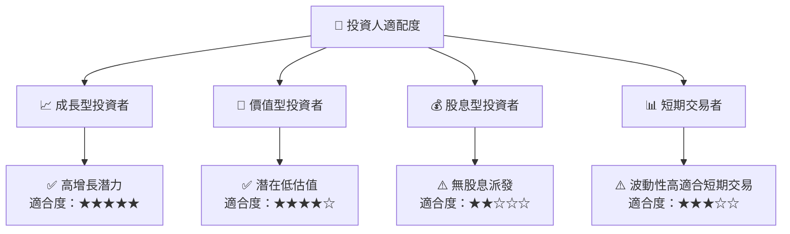

### 10.5 關鍵監控指標

| 監控類型 | 指標 | 關注點 | 頻率 |
|----------|------|--------|------|
| 財務指標 | 營收增長 | 各季度營收增速 | 季度 |
| 市場趨勢 | 合同簽訂 | 新合同數量及價值 | 月度 |
| 技術進展 | 研發進展 | 主要技術突破 | 半年 |
| 競爭動態 | 市場份額 | 市場份額變動 | 季度 |

---

> **免責聲明**：本報告為 AI 自動生成，僅供研究參考，不構成投資建議。投資有風險，入市需謹慎。