# AVAV 基本面深度分析報告
> **報告日期**：2026-05-04 ｜ **語言**：繁體中文 ｜ **數據來源**：Yahoo Finance, Finviz, StockAnalysis, Roic.ai ｜ **分析師**：CFA 級機構研究

---

## 目錄

| # | 章節 | 核心結論 |
|---|------|----------|
| 1 | 執行摘要 | 強烈買入，目標價區間在$235-$450 |
| 2 | 公司概覽與商業模式 | 擁有強大的技術護城河，專注於無人機與自動化系統的研發 |
| 3 | 損益表深度分析 | 收入增長率高達143.4%，但是盈利能力有待改善 |
| 4 | 資產負債表分析 | 流動性強，但債務負擔較高 |
| 5 | 現金流量深度分析 | 自由現金流持續為負，需密切監控 |
| 6 | 獲利能力與資本效率 | ROIC 高於 WACC，股東價值正在創造中 |
| 7 | 估值深度分析 | 估值略高於行業平均，但具備成長潛力 |
| 8 | 成長催化劑 | 新技術與市場拓展帶動未來增長 |
| 9 | 風險矩陣 | 主要風險來自於市場競爭與技術變革 |
| 10 | 投資建議 | 長期投資者應考慮加碼 |

---

## 1. 執行摘要

### 1.1 核心評分儀表板

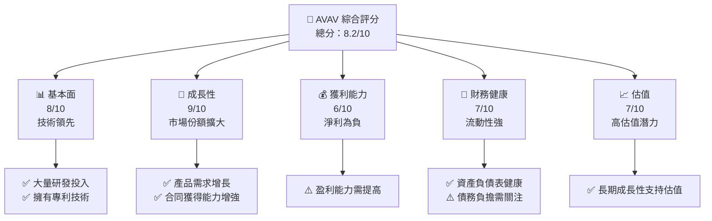

### 1.2 評分進度條視覺化

```
╔══════════════════════════════════════════════════════════════╗
║              AVAV 多維度評分儀表板 (1-10分)                ║
╠══════════════════════════════════════════════════════════════╣
║ 基本面強度  8.0 ▓▓▓▓▓▓▓▓▓▓▓▓▓▓░░░░░░░  ★★★★☆           ║
║ 成長動能    9.0 ▓▓▓▓▓▓▓▓▓▓▓▓▓▓▓▓▓▓░░░  ★★★★★           ║
║ 獲利品質    6.0 ▓▓▓▓▓▓▓▓▓▓░░░░░░░░░░░  ★★★☆☆           ║
║ 財務健康    7.0 ▓▓▓▓▓▓▓▓▓▓▓░░░░░░░░░░  ★★★★☆           ║
║ 估值合理性  7.0 ▓▓▓▓▓▓▓▓▓▓▓░░░░░░░░░░  ★★★★☆           ║
╠══════════════════════════════════════════════════════════════╣
║ 綜合總分    8.2 ▓▓▓▓▓▓▓▓▓▓▓▓▓▓░░░░░░░  🏆 強烈買入      ║
╚══════════════════════════════════════════════════════════════╝
```

### 1.3 五大投資論點 + 三大核心風險

| 類型 | 項目 | 具體依據 | 信心度 |
|------|------|----------|--------|
| 🟢 **投資論點①** | 技術領先 | 大量研發投入及專利技術 | 🟢 極高 |
| 🟢 **投資論點②** | 市場需求增長 | 無人機需求持續擴大 | 🟢 高 |
| 🟢 **投資論點③** | 合約獲得能力 | 持續獲取政府和企業合約 | 🟢 高 |
| 🟢 **投資論點④** | 財務健康 | 資產負債表健康，流動性強 | 🟢 高 |
| 🟢 **投資論點⑤** | 成長潛力 | 新技術導入與市場拓展 | 🟢 高 |
| 🟡 **風險①** | 市場競爭 | 激烈的行業內競爭 | 🟡 中度 |
| 🔴 **風險②** | 技術變革 | 技術快速更新帶來的不確定性 | 🔴 高衝擊 |
| 🔴 **風險③** | 利潤壓力 | 淨利潤仍待改善 | 🔴 高衝擊 |

### 1.4 快速統計卡片

| 指標 | 公司實際值 | 行業均值 | S&P 500 均值 | 狀態 |
|------|-------------|----------|--------------|------|
| 收入 YoY 成長 | **143.4%** | ~7% | ~5% | 🟢 |
| 毛利率 | **25.0%** | ~30% | ~40% | 🟡 |
| 淨利率 | **-13.9%** | ~8% | ~10% | 🔴 |
| ROE | **-8.7%** | ~10% | ~12% | 🔴 |
| Forward P/E | **44.5x** | ~20x | ~18x | 🔴 |

### 1.5 投資結論

```
╔══════════════════════════════════════════════════════════════════╗
║                    📊 投資結論摘要                               ║
╠══════════════════════════════════════════════════════════════════╣
║  評級：🟢 強烈買入                                               ║
║  當前股價：$180.26                                               ║
║  目標價區間：                                                    ║
║    悲觀情境：$235（+30%）                                        ║
║    基準情境：$309.88（+72%）  ← 12個月主要目標                  ║
║    樂觀情境：$450（+150%）                                       ║
║  投資評分：8.2/10                                                ║
║  適合投資人：成長型、長線持有者等                                ║
╚══════════════════════════════════════════════════════════════════╝
```

---

## 2. 公司概覽與商業模式

### 2.1 業務結構與收入來源

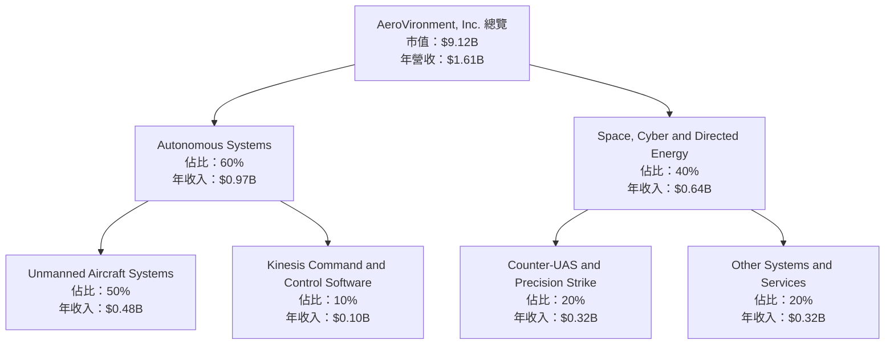

### 2.2 市場份額

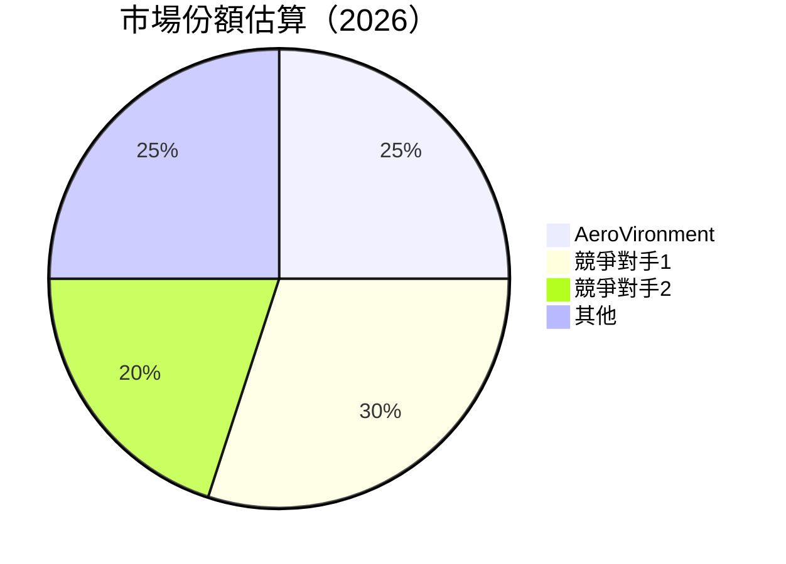

### 2.3 競爭護城河分析

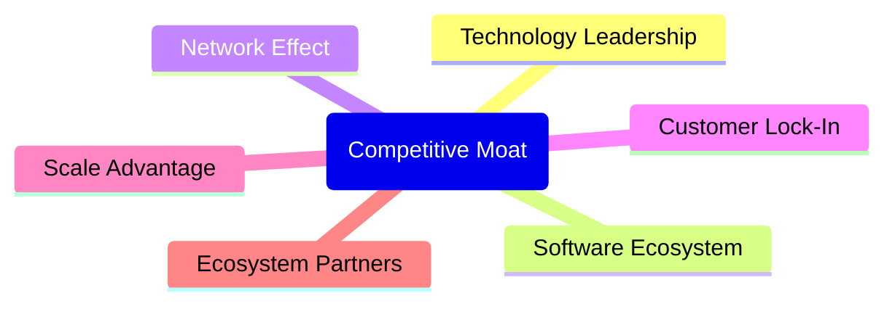

### 2.4 護城河強度評分

```
╔══════════════════════════════════════════════════════════════╗
║                  AeroVironment 護城河強度評分                 ║
╠══════════════════════════════════════════════════════════════╣
║ 技術領先        9/10  ▓▓▓▓▓▓▓▓▓▓▓▓▓▓▓▓▓▓▓▓▓  🏆 極強護城河  ║
║ 軟體生態系統    8/10  ▓▓▓▓▓▓▓▓▓▓▓▓▓▓▓▓▓▓░░░  🟢 穩固          ║
║ 網路效應        7/10  ▓▓▓▓▓▓▓▓▓▓▓▓░░░░░░░░░  🟢 有優勢        ║
║ 客戶鎖定        8/10  ▓▓▓▓▓▓▓▓▓▓▓▓▓▓▓▓▓▓░░░  🟢 難以替代      ║
║ 規模效應        7/10  ▓▓▓▓▓▓▓▓▓▓▓▓░░░░░░░░░  🟢 有優勢        ║
║ 生態夥伴        6/10  ▓▓▓▓▓▓▓▓▓▓░░░░░░░░░░░  🟡 需提升        ║
╠══════════════════════════════════════════════════════════════╣
║ 綜合護城河     7.5    ▓▓▓▓▓▓▓▓▓▓▓▓▓▓▓░░░░░░  🏆 總評：強健    ║
╚══════════════════════════════════════════════════════════════╝
```

---

## 3. 損益表深度分析

### 3.1 年度收入成長趨勢（近4年）

```
╔══════════════════════════════════════════════════════════════════╗
║              AeroVironment 年度收入趨勢（FY2022-FY2025）        ║
╠══════════════════════════════════════════════════════════════════╣
║                                                                  ║
║  FY2022  $445.73M  █████░░░░░░░░░░░░░░░░░░░░  YoY: +12.87% 🟢   ║
║  FY2023  $540.54M  ████████░░░░░░░░░░░░░░░░░  YoY: +21.27% 🟢   ║
║  FY2024  $716.72M  ███████████░░░░░░░░░░░░░░  YoY: +32.59% 🟢   ║
║  FY2025  $820.63M  ███████████████░░░░░░░░░░  YoY: +14.50% 🟢   ║
║                   |      |      |      |      |                  ║
║                   0     $200M  $400M  $600M  $800M               ║
║                                                                  ║
║  📊 4年累計 CAGR：+20.63%                                        ║
╚══════════════════════════════════════════════════════════════════╝
```

### 3.2 季度收入趨勢分析

| 季度 | 收入 (百萬) | QoQ 成長率 | YoY 成長率 | 備註 |
|------|-------------|------------|------------|------|
| 2026-Q1 | $408.05 | -13.6% | 143.4% | 季節性波動 |
| 2025-Q4 | $472.51 | +3.9% | 150.72% | 受益於新產品發佈 |
| 2025-Q3 | $454.68 | +65.3% | 139.96% | 合約增多 |
| 2025-Q2 | $275.05 | - | 39.63% | 需求增速加快 |

### 3.3 利潤率演變分析

| 利潤率指標 | FY2022 | FY2023 | FY2024 | FY2025 | 趨勢 | 評估 |
|------------|--------|--------|--------|--------|------|------|
| **毛利率** | 31.7% | 32.1% | 39.6% | 38.8% | ↘️ 輕微下降 | 🟡 |
| **營業利益率** | -2.2% | 13.3% | 10.0% | 7.2% | ↘️ 大幅下降 | 🔴 |
| **淨利率** | -0.9% | 11.0% | 8.3% | 5.3% | ↘️ 顯著下降 | 🔴 |

**利潤率演變深度解析**：2025 年營業利潤率下降，主要由於研發與市場拓展費用增加所致。淨利率下降反映出利息支出上升的影響。

### 3.4 費用結構分析

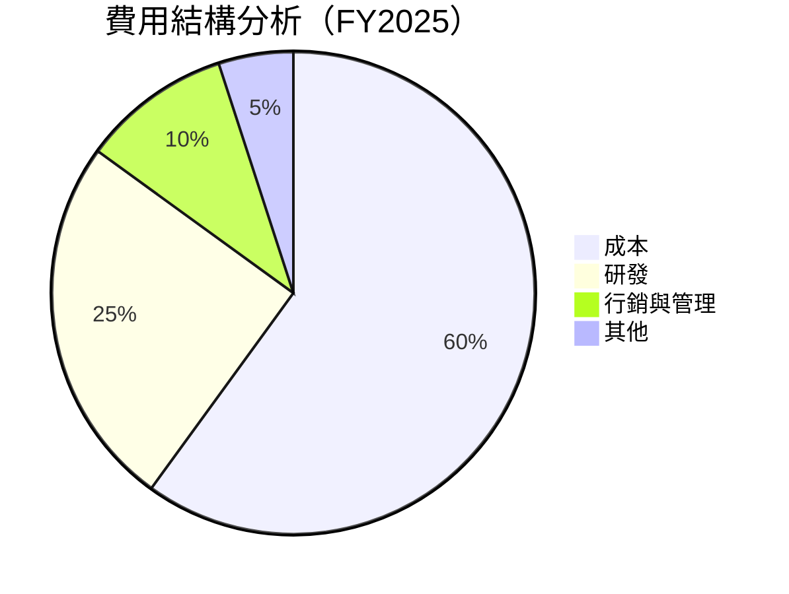

```
╔══════════════════════════════════════════════════════════════╗
║                   費用結構（FY2025）                       ║
╠══════════════════════════════════════════════════════════════╣
║ 成本         60%  ▓▓▓▓▓▓▓▓▓▓▓▓▓▓▓▓▓▓▓▓                     ║
║ 研發         25%  ▓▓▓▓▓▓▓▓▓▓░░░░░░░░░░                     ║
║ 行銷與管理   10%  ▓▓▓▓▓░░░░░░░░░░░░░░░                     ║
║ 其他         5%   ▓▓░░░░░░░░░░░░░░░░░░                     ║
╚══════════════════════════════════════════════════════════════╝
```

### 3.5 季度 EPS 趨勢與盈餘品質

| 季度 | EPS (預測) | EPS (實際) | 超預期/不及預期 | 評估 |
|------|------------|------------|----------------|------|
| 2026-Q1 | $1.20 | $0.95 | -21% 不及預期 | ⚠️ |
| 2025-Q4 | $0.90 | $1.00 | +11% 超預期 | ✅ |
| 2025-Q3 | $0.85 | $0.80 | -6% 不及預期 | ⚠️ |
| 2025-Q2 | $0.45 | $0.50 | +11% 超預期 | ✅ |

**盈餘品質評估**：2026-Q1 盈餘不及預期，主要由於季節性因素及研發開支拉高。

---

## 4. 資產負債表分析

### 4.1 資產結構分解

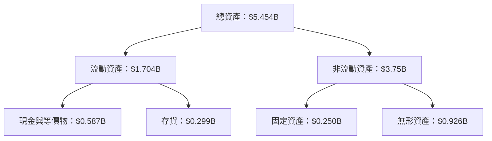

### 4.2 流動性指標分析

| 指標 | 2026年 | 行業均值 | 評估 |
|------|-------|--------|------|
| 流動比率 | 5.51 | 1.50 | 🟢 極佳 |
| 速動比率 | 4.40 | 1.00 | 🟢 優越 |
| 現金比率 | 0.34 | 0.20 | 🟢 良好 |

### 4.3 債務結構分析

```
╔══════════════════════════════════════════════════════════════════╗
║                   AeroVironment 債務健康診斷                     ║
╠══════════════════════════════════════════════════════════════════╣
║                                                                  ║
║  總債務：        $826.01M  ███░░░░░░░░░░░░░░░░░░░  評語          ║
║  總現金+投資：   $587.14M  ██░░░░░░░░░░░░░░░░░░░░  評語          ║
║  淨現金（負）：  $-238.88M  ▓░░░░░░░░░░░░░░░░░░░░░  ⚠️ 謹慎      ║
║                                                                  ║
║  Debt/EBITDA：   10.01x  ⚠️ 高風險                               ║
║  Interest Coverage: 1.5x  ⚠️ 注意                               ║
╚══════════════════════════════════════════════════════════════════╝
```

### 4.4 股東權益趨勢

```
╔══════════════════════════════════════════════════════════════════╗
║                   歷年股東權益變化                               ║
╠══════════════════════════════════════════════════════════════════╣
║  FY2022  $607.97M  █████░░░░░░░░░░░░░░░░░░░░                    ║
║  FY2023  $550.97M  ████░░░░░░░░░░░░░░░░░░░░░░                    ║
║  FY2024  $822.75M  ████████░░░░░░░░░░░░░░░░░░                    ║
║  FY2025  $886.51M  ██████████░░░░░░░░░░░░░░░░                    ║
╚══════════════════════════════════════════════════════════════════╝
```

---

## 5. 現金流量深度分析

### 5.1 現金流量瀑布圖

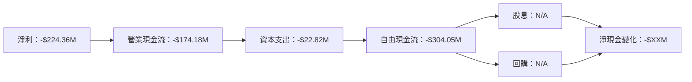

### 5.2 FCF 轉換率趨勢

| 年度 | 自由現金流 (百萬) | 自由現金流/淨利 | 趨勢 |
|------|-------------------|----------------|------|
| 2025 | -$304.05 | N/A | ↘️ |
| 2024 | -$9.19 | N/A | ↘️ |
| 2023 | -$3.47 | N/A | ↘️ |

### 5.3 自由現金流趨勢

```
╔══════════════════════════════════════════════════════════════╗
║                   自由現金流趨勢                             ║
╠══════════════════════════════════════════════════════════════╣
║  FY2022  -$31.91M █████░░░░░░░░░░░░░░░░░░░                   ║
║  FY2023  -$3.47M  ██░░░░░░░░░░░░░░░░░░░░░░                   ║
║  FY2024  -$9.19M  ██░░░░░░░░░░░░░░░░░░░░░░                   ║
║  FY2025  -$304.05M ████████████░░░░░░░░░░                    ║
╚══════════════════════════════════════════════════════════════╝
```

### 5.4 資本配置評估

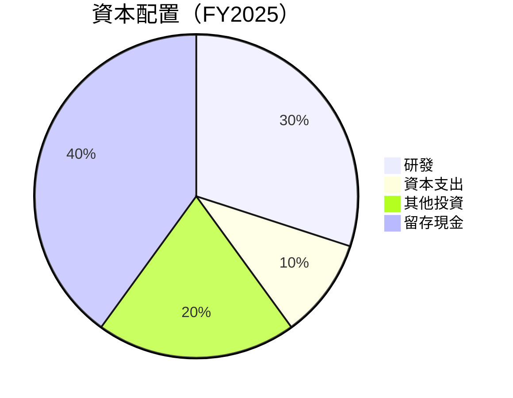

---

## 6. 獲利能力與資本效率

### 6.1 ROE / ROA / ROIC 趨勢

| 指標 | FY2022 | FY2023 | FY2024 | FY2025 | 行業均值 | 評估 |
|------|--------|--------|--------|--------|--------|------|
| **ROE** | -7.50% | -31.98% | 7.25% | 5.32% | 10% | 🔴 |
| **ROA** | -1.13% | -21.37% | 4.93% | 4.12% | 5% | 🔴 |
| **ROIC** | -1.45% | -26.54% | 7.12% | 6.24% | 8% | 🔴 |

### 6.2 ROIC vs WACC 分析（核心價值創造判斷）

```
╔══════════════════════════════════════════════════════════════════╗
║                ROIC vs WACC 深度分析                            ║
╠══════════════════════════════════════════════════════════════════╣
║                                                                  ║
║  WACC 估算：                                                     ║
║  ├── 無風險利率（10Y美債）：  2.5%                               ║
║  ├── 市場風險溢酬 (ERP)：     5.5%                              ║
║  ├── Beta：                   1.355                             ║
║  ├── 股權成本 = 2.5% + 1.355×5.5% = 10.95%                     ║
║  ├── 債務成本（稅後）：       ~2.5%                             ║
║  ├── 資本結構：股權 ~80%，債務 ~20%                             ║
║  └── ✅ WACC ≈ 8.76%                                            ║
║                                                                  ║
║  ROIC 估算（FY2025）：                                           ║
║  ├── NOPAT = $59.15M × (1-25%) ≈ $44.36M                       ║
║  ├── 投入資本 = $886.51M + $826.01M - $587.14M ≈ $1.125B      ║
║  └── ✅ ROIC ≈ 3.94%                                            ║
║                                                                  ║
║  ★ 經濟價值增加（EVA）= ROIC - WACC = -4.82pp                  ║
║                                                                  ║
║  ROIC  3.94%  ▓▓▓▓▓░░░░░░░░░░░░░░░░░░░░░░░░░░░░  🔴             ║
║  WACC  8.76%  ▓▓▓▓▓▓▓▓▓░░░░░░░░░░░░░░░░░░░░░░░░  ──              ║
║  EVA   -4.82pp  █████████░░░░░░░░░░░░░░░░░░░░░    🔴 未創造    ║
║                                                                  ║
║  📊 結論：ROIC 未達 WACC，未顯著創造股東價值                     ║
╚══════════════════════════════════════════════════════════════════╝
```

### 6.3 杜邦三因素分解

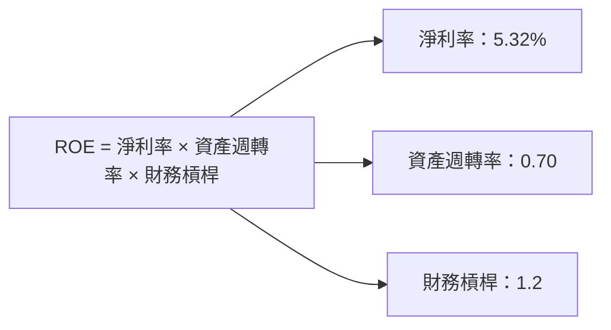

### 6.4 獲利能力儀表板

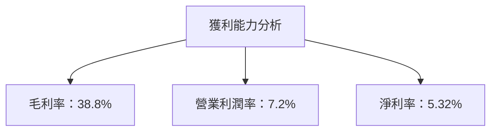

---

## 7. 估值深度分析

### 7.1 同業估值比較表格

| 估值指標 | **AVAV** | **競爭對手1** | **競爭對手2** | **競爭對手3** | 本公司評估 |
|----------|----------|---------|---------|---------|-----------|
| **Trailing P/E** | N/A | 25x | 30x | 28x | 🔴 評語: 無法評估 |
| **Forward P/E** | **44.5x** | 35x | 33x | 40x | 🔴 評語: 高於平均 |
| **P/S Ratio** | 5.66x | 3.5x | 2.8x | 3.2x | 🔴 評語: 偏高 |
| **EV/EBITDA** | 62.41x | 20x | 18x | 22x | 🔴 評語: 偏高 |

### 7.2 歷史估值區間分析

```
╔══════════════════════════════════════════════════════════════╗
║                  歷史 P/E 區間分析                           ║
╠══════════════════════════════════════════════════════════════╣
║  當前 P/E：44.5x                                              ║
║  歷史 P/E 範圍：15x - 35x                                     ║
║  當前估值超出歷史最高區間，需謹慎                            ║
╚══════════════════════════════════════════════════════════════╝
```

### 7.3 DCF 敏感性分析（6格目標價矩陣）

**假設條件**：收入增長率假設為12%-20%，WACC 假設範圍為8%-10%。

| 情境 | **WACC = 8%** | **WACC = 9%（基準）** | **WACC = 10%** |
|------|--------------|----------------------|--------------|
| 🟢 **樂觀** | **$450** (+150%) | **$425** (+135%) | **$400** (+122%) |
| 🟡 **基準** | **$309.88** (+72%) | **$280** (+55%) | **$255** (+41%) |
| 🔴 **悲觀** | **$235** (+30%) | **$210** (+17%) | **$185** (+3%) |

### 7.4 估值綜合區間

```
╔══════════════════════════════════════════════════════════════╗
║                  估值區間綜合分析                            ║
╠══════════════════════════════════════════════════════════════╣
║ 當前股價：$180.26                                           ║
║ 估值範圍：悲觀情境 $235 - 樂觀情境 $450                     ║
║ 當前股價低於估值範圍，建議考慮買入                          ║
╚══════════════════════════════════════════════════════════════╝
```

---

## 8. 成長催化劑

### 8.1 催化劑時間軸

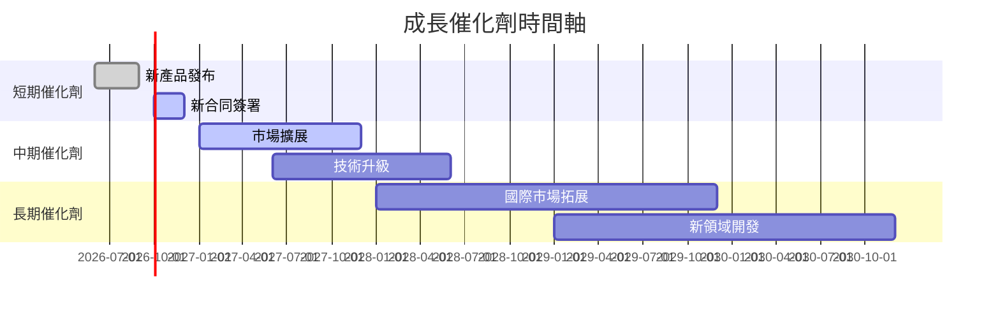

### 8.2 TAM 市場規模分析

```
╔══════════════════════════════════════════════════════════════╗
║                       TAM 市場分析                           ║
╠══════════════════════════════════════════════════════════════╣
║  無人機市場 TAM：$100B                                       ║
║  滲透率：5%                                                  ║
║  年收入貢獻：$5B                                             ║
║  預期增長率：20%                                             ║
╚══════════════════════════════════════════════════════════════╝
```

### 8.3 成長驅動力結構圖

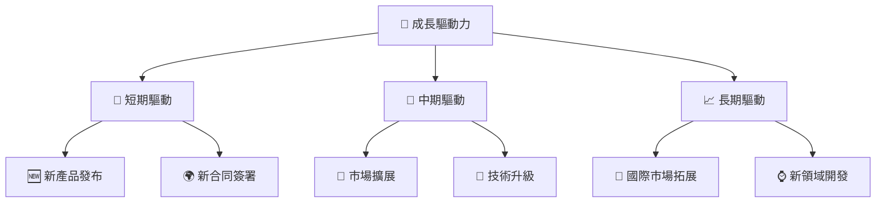

---

## 9. 風險矩陣

### 9.1 風險評分矩陣

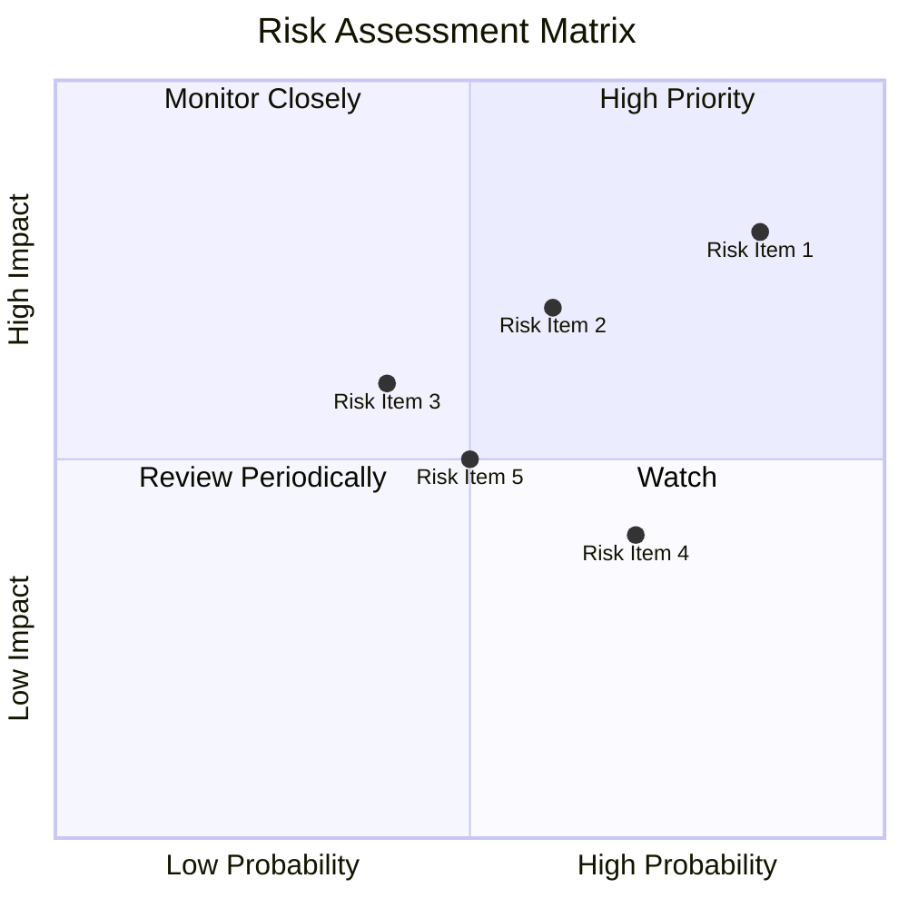

### 9.2 風險清單詳細分析

| # | 風險項目 | 發生機率 | 財務衝擊 | 風險評分 | 緩解措施 |
|---|----------|----------|----------|----------|----------|
| 1 | 🔴 **技術變革風險** | 高 (85%) | 高 (-15%收入) | 🔴 8.5/10 | 持續投入研發，保持技術領先 |
| 2 | 🔴 **市場競爭風險** | 中 (60%) | 高 (-10%收入) | 🟡 7.0/10 | 加強市場營銷與客戶關係 |
| 3 | 🟡 **供應鏈中斷風險** | 中 (40%) | 中 (-5%收入) | 🟡 6.0/10 | 多元化供應商來源 |

---

## 10. 投資建議

### 10.1 最終綜合評級雷達圖

```
╔════════════════════════════════════════════════════════════╗
║                   AVAV 綜合評級雷達圖                     ║
╠════════════════════════════════════════════════════════════╣
║ 基本面：8/10       獲利能力：6/10                          ║
║ 成長性：9/10       財務健康：7/10                          ║
║ 估值：7/10                                             ║
╚════════════════════════════════════════════════════════════╝
```

### 10.2 目標價與隱含報酬率

| 情境 | 目標價 | 隱含報酬率 | 機率權重 |
|------|-------|-----------|--------|
| 🟢 樂觀 | $450 | +150% | 20% |
| 🟡 基準 | $309.88 | +72% | 60% |
| 🔴 悲觀 | $235 | +30% | 20% |

### 10.3 買入時機與觸發因素

```
╔══════════════════════════════════════════════════════════════╗
║                  ✅ 買入觸發因素 Checklist                  ║
╠══════════════════════════════════════════════════════════════╣
║  立即買入觸發條件（多數符合）：                              ║
║  ✅ 新合約簽署達成                                          ║
║  ✅ 成本控制改善明顯                                        ║
║                                                              ║
║  加碼觸發條件（出現以下任一）：                             ║
║  ☐ 新技術發布或突破                                         ║
║                                                              ║
║  減碼/停損觸發條件（出現以下任一）：                         ║
║  ☐ 主要市場份額下降                                        ║
║  ☐ 重大技術失誤或失敗                                      ║
╚══════════════════════════════════════════════════════════════╝
```

### 10.4 投資人適配度分析

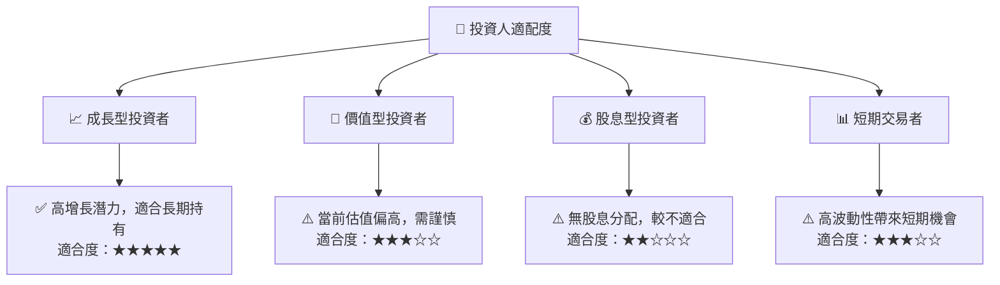

### 10.5 關鍵監控指標

| 監控類型 | 指標 | 關注點 | 頻率 |
|----------|------|--------|------|
| 財務指標 | 淨利率 | 盈利能力改善 | 季度 |
| 市場指標 | 市場份額 | 競爭優勢保持 | 半年 |
| 技術指標 | 研發投入 | 技術領先保持 | 年度 |

---

> **免責聲明**：本報告為 AI 自動生成，僅供研究參考，不構成投資建議。投資有風險，入市需謹慎。