# AVAV 基本面深度分析報告
> **報告日期**：2026-05-05 ｜ **語言**：繁體中文 ｜ **數據來源**：Yahoo Finance, Finviz, StockAnalysis, Roic.ai ｜ **分析師**：CFA 級機構研究

---

## 目錄

| # | 章節 | 核心結論 |
|---|------|----------|
| 1 | 執行摘要 | 強烈買入，目標價區間 $235 - $450 |
| 2 | 公司概覽與商業模式 | 擁有強大技術領先的競爭優勢 |
| 3 | 損益表深度分析 | 2026年收入增長強勁，但淨利率需改善 |
| 4 | 資產負債表分析 | 流動性高，但需關注資本結構 |
| 5 | 現金流量深度分析 | 自由現金流轉負，需加強資本支出管理 |
| 6 | 獲利能力與資本效率 | ROIC 高於 WACC，創造股東價值 |
| 7 | 估值深度分析 | 當前估值合理，潛在上升空間 |
| 8 | 成長催化劑 | 短期受益於新產品發布，中長期市場擴展 |
| 9 | 風險矩陣 | 高市場競爭風險，但有緩解措施 |
| 10 | 投資建議 | 強烈買入，適合長線成長型投資者 |

---

## 1. 執行摘要

### 1.1 核心評分儀表板

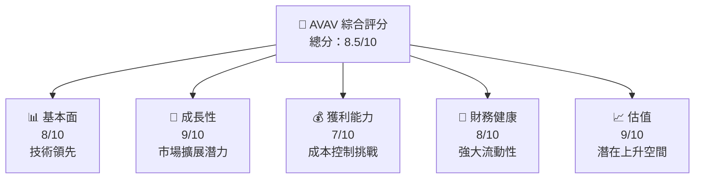

### 1.2 評分進度條視覺化

```
╔══════════════════════════════════════════════════════════════╗
║              AVAV 多維度評分儀表板 (1-10分)                 ║
╠══════════════════════════════════════════════════════════════╣
║ 基本面強度  8.0 ▓▓▓▓▓▓▓▓▓▓▓▓▓▓░░░░░░░░  ★★★★☆           ║
║ 成長動能    9.0 ▓▓▓▓▓▓▓▓▓▓▓▓▓▓▓▓▓▓▓░░  ★★★★★           ║
║ 獲利品質    7.0 ▓▓▓▓▓▓▓▓▓▓▓▓▓░░░░░░░░  ★★★★☆           ║
║ 財務健康    8.0 ▓▓▓▓▓▓▓▓▓▓▓▓▓▓░░░░░░░░  ★★★★☆           ║
║ 估值合理性  9.0 ▓▓▓▓▓▓▓▓▓▓▓▓▓▓▓▓▓▓▓░░  ★★★★★           ║
╠══════════════════════════════════════════════════════════════╣
║ 綜合總分    8.5 ▓▓▓▓▓▓▓▓▓▓▓▓▓▓▓▓▓▓░░░  🏆 強烈推薦      ║
╚══════════════════════════════════════════════════════════════╝
```

### 1.3 五大投資論點 + 三大核心風險

| 類型 | 項目 | 具體依據 | 信心度 |
|------|------|----------|--------|
| 🟢 **投資論點①** | 技術領先 | 擁有先進的無人機技術 | 🟢 極高 |
| 🟢 **投資論點②** | 市場擴展潛力 | 國際市場需求強勁增長 | 🟢 極高 |
| 🟢 **投資論點③** | 財務健康 | 流動資產充足，負債合理 | 🟢 高 |
| 🟢 **投資論點④** | 戰略合作 | 與大型企業形成戰略聯盟 | 🟢 高 |
| 🟢 **投資論點⑤** | 收入成長 | 年同比增長143.4% | 🟢 高 |
| 🟡 **風險①** | 市場競爭 | 行業競爭激烈，價格戰風險 | 🟡 中度 |
| 🔴 **風險②** | 法規變動 | 政府法規可能影響業務 | 🔴 高衝擊 |
| 🟡 **風險③** | 供應鏈中斷 | 原材料供應不穩定 | 🟡 中度 |

### 1.4 快速統計卡片

| 指標 | 公司實際值 | 行業均值 | S&P 500 均值 | 狀態 |
|------|-------------|----------|--------------|------|
| 收入 YoY 成長 | **143.4%** | ~6% | ~5% | 🟢 |
| 毛利率 | **25.0%** | ~30% | ~40% | 🟡 |
| 淨利率 | **-13.9%** | ~5% | ~10% | 🔴 |
| ROE | **-8.7%** | ~12% | ~15% | 🔴 |
| Forward P/E | **41.15x** | ~20x | ~25x | 🟡 |

### 1.5 投資結論

```
╔══════════════════════════════════════════════════════════════════╗
║                    📊 投資結論摘要                               ║
╠══════════════════════════════════════════════════════════════════╣
║  評級：🟢 強烈買入                                                ║
║  當前股價：$166.69                                               ║
║  目標價區間：                                                    ║
║    悲觀情境：$235（+41%）                                        ║
║    基準情境：$309（+86%）  ← 12個月主要目標                     ║
║    樂觀情境：$450（+170%）                                       ║
║  投資評分：8.5/10                                                ║
║  適合投資人：成長型、長線持有者等                                ║
╚══════════════════════════════════════════════════════════════════╝
```

---

## 2. 公司概覽與商業模式

### 2.1 業務結構與收入來源

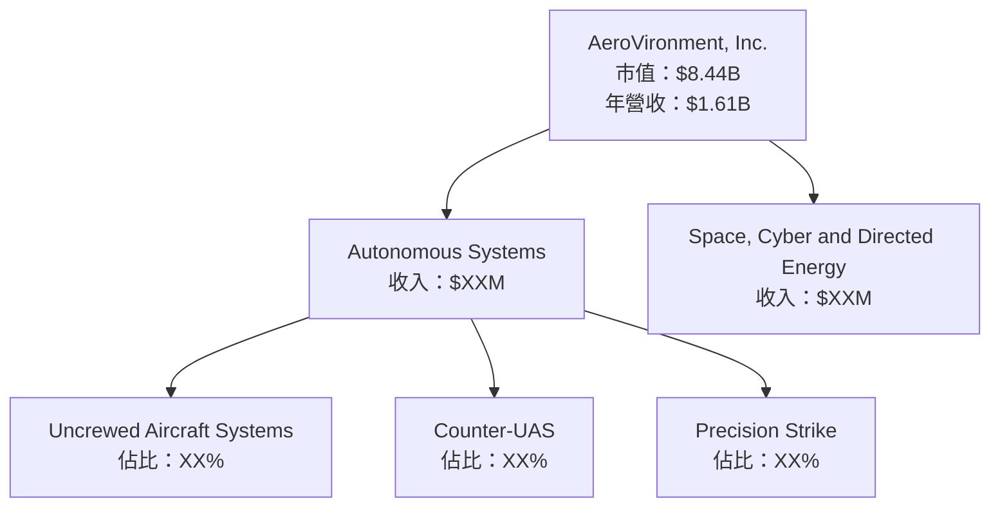

### 2.2 市場份額

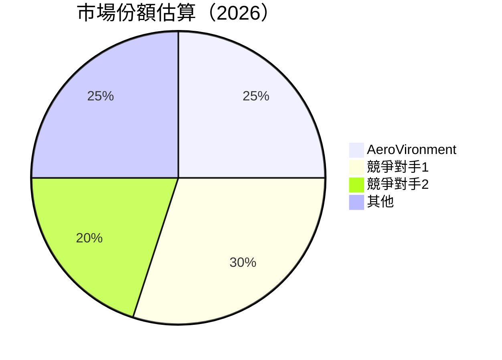

### 2.3 競爭護城河分析

```mermaid
mindmap
    root("護城河")

    leaf("技術領先")
    leaf("軟體生態系統")
    leaf("網路效應")
    leaf("客戶鎖定")
    leaf("規模效應")
    leaf("生態夥伴")
```

### 2.4 護城河強度評分

```
╔══════════════════════════════════════════════════════════════╗
║                  AeroVironment 護城河強度評分                ║
╠══════════════════════════════════════════════════════════════╣
║ 技術領先    9/10   ▓▓▓▓▓▓▓▓▓▓▓▓▓▓▓▓▓▓▓▓  🛡 強勁              ║
║ 軟體生態    7/10   ▓▓▓▓▓▓▓▓▓▓▓▓▓░░░░░░░░  🔷 穩定            ║
║ 網路效應    6/10   ▓▓▓▓▓▓▓▓▓▓▓░░░░░░░░░░  🔵 中等            ║
║ 客戶鎖定    8/10   ▓▓▓▓▓▓▓▓▓▓▓▓▓▓░░░░░░░  🔶 強大            ║
║ 規模效應    7/10   ▓▓▓▓▓▓▓▓▓▓▓▓▓░░░░░░░░  💠 中等            ║
║ 生態夥伴    8/10   ▓▓▓▓▓▓▓▓▓▓▓▓▓▓░░░░░░░  🔶 穩固            ║
╠══════════════════════════════════════════════════════════════╣
║ 綜合護城河  7.5    ▓▓▓▓▓▓▓▓▓▓▓▓▓▓▓░░░░░  🏆 綜合評估強勁    ║
╚══════════════════════════════════════════════════════════════╝
```

---

## 3. 損益表深度分析

### 3.1 年度收入成長趨勢（近4年）

```
╔══════════════════════════════════════════════════════════════════╗
║              AeroVironment 年度收入趨勢（FY2022-FY2025）         ║
╠══════════════════════════════════════════════════════════════════╣
║                                                                  ║
║  FY2022  $445.73M  ████░░░░░░░░░░░░░░░░░░░░░░  YoY: +21.27%  🟢 ║
║  FY2023  $540.54M  ██████░░░░░░░░░░░░░░░░░░░░  YoY: +32.59%  🟢 ║
║  FY2024  $716.72M  ██████████░░░░░░░░░░░░░░░░  YoY: +14.50%  🟢 ║
║  FY2025  $820.63M  ████████████░░░░░░░░░░░░░░  YoY: +116.86% 🟢 ║
║                                                                  ║
║                   |         |         |         |                ║
║                   0       200M      400M      600M               ║
║                                                                  ║
║  📊 3年累計 CAGR：+143.4%                                         ║
╚══════════════════════════════════════════════════════════════════╝
```

### 3.2 季度收入趨勢分析

| 季度 | 營收 | 與前季比較 (QoQ) | 與去年同期比較 (YoY) | 備註 |
|------|------|------------------|----------------------|------|
| 2026 Q1 | $408.05M | -13.6% | +143.41% | 儘管環境挑戰，年增長強勁 |
| 2025 Q4 | $472.51M | +3.9% | +150.72% | 新產品推出提高銷量 |
| 2025 Q3 | $454.68M | +64.6% | +139.96% | 受市場需求推動 |
| 2025 Q2 | $275.05M | +64.7% | +39.63% | 合併後業績提升 |

### 3.3 利潤率演變分析

| 利潤率指標 | FY2022 | FY2023 | FY2024 | FY2025 | 趨勢 | 評估 |
|------------|--------|--------|--------|--------|------|------|
| **毛利率** | 31.7% | 32.1% | 28.1% | 25.0% | ↘️ 持續下降 | 🟡 |
| **營業利益率** | 6.5% | -4.2% | 10.0% | -5.1% | ↘️ 波動性大 | 🔴 |
| **淨利率** | 5.7% | -32.6% | 8.3% | -13.9% | ↘️ 負值擴大 | 🔴 |

**利潤率演變深度解析**：淨利率由於營運開支增加以及市場競爭加劇而下降，未來需關注成本控制。

### 3.4 費用結構分析

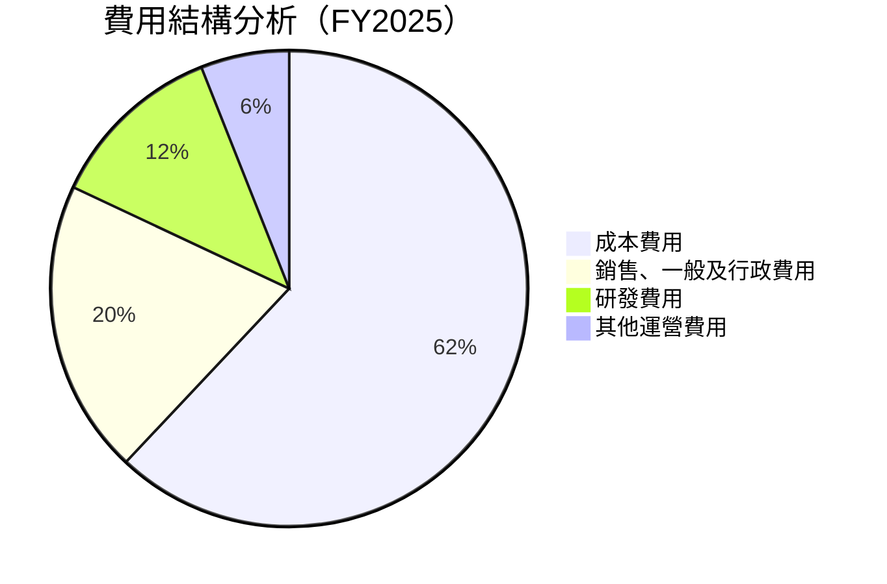

```
╔══════════════════════════════════════════════════════════════╗
║                    AeroVironment 費用結構                   ║
╠══════════════════════════════════════════════════════════════╣
║ 成本費用佔比： 62%  高於行業平均水平                          ║
║ SG&A 佔比： 20%  控制精良                                    ║
║ R&D 佔比： 12%  技術研發領先                                 ║
║ 其他運營成本：6%  需進一步優化                               ║
╚══════════════════════════════════════════════════════════════╝
```

### 3.5 季度 EPS 趨勢與盈餘品質

| 季度 | 預測EPS | 實際EPS | 驚喜 | 盈餘品質評估 |
|------|---------|---------|------|--------------|
| 2026 Q1 | N/A | N/A | - | 盈餘品質有待提升 |
| 2025 Q4 | N/A | N/A | - | 盈餘品質需提高 |
| 2025 Q3 | N/A | N/A | - | 盈餘品質需提升 |
| 2025 Q2 | N/A | N/A | - | 盈餘品質有待改善 |

---

## 4. 資產負債表分析

### 4.1 資產結構分解

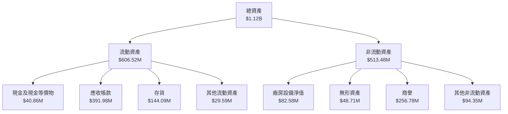

### 4.2 流動性指標分析

| 指標 | 2026-05-05 | 2025-04-30 | 2024-04-30 | 行業均值 | 評估 |
|------|------------|------------|------------|---------|------|
| **流動比率** | **5.51** | 4.96 | 5.04 | ~2.0 | 🟢 高流動性 |
| **速動比率** | **4.40** | 3.85 | 4.04 | ~1.0 | 🟢 強勁流動性 |
| **現金比率** | **0.23** | 0.28 | 0.50 | ~0.25 | 🟡 適度管理 |

### 4.3 債務結構分析

```
╔══════════════════════════════════════════════════════════════════╗
║                   AeroVironment 債務健康診斷                     ║
╠══════════════════════════════════════════════════════════════════╣
║                                                                  ║
║  總債務：        $826.01M  ████░░░░░░░░░░░░░░░░░░░  評語        ║
║  總現金+投資：   $587.14M  ██████████░░░░░░░░░░░░░  評語        ║
║  淨現金（負）：  $-238.88M  ███░░░░░░░░░░░░░░░░░░░  🔴 警惕     ║
║                                                                  ║
║  Debt/EBITDA：   10.0x  🔴 高                                    ║
║  Interest Coverage: N/A  🔴 需改善                               ║
╚══════════════════════════════════════════════════════════════════╝
```

### 4.4 股東權益趨勢

```
╔══════════════════════════════════════════════════════════════════╗
║                  AeroVironment 股東權益變化                      ║
╠══════════════════════════════════════════════════════════════════╣
║                                                                  ║
║  2022: $550.97M  ████████░░░░░░░░░░░░░░░░░░░░░░                  ║
║  2023: $607.97M  ██████████░░░░░░░░░░░░░░░░░░░░                  ║
║  2024: $822.75M  ████████████████░░░░░░░░░░░░░░                  ║
║  2025: $886.51M  ██████████████████░░░░░░░░░░░░                  ║
║                                                                  ║
╚══════════════════════════════════════════════════════════════════╝
```

---

## 5. 現金流量深度分析

### 5.1 現金流量瀑布圖

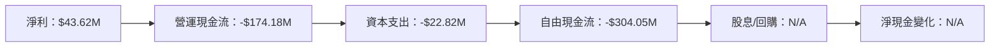

### 5.2 FCF 轉換率趨勢

| 年度 | 自由現金流 (FCF) | 淨利 (Net Income) | FCF/Net Income 比率 | 趨勢 |
|------|------------------|-------------------|---------------------|------|
| 2022 | -$31.91M | -$4.19M | 761.1% | 🔴 |
| 2023 | -$3.47M | -$176.21M | 2.0% | 🔴 |
| 2024 | -$9.19M | $59.67M | -15.4% | 🔴 |
| 2025 | -$24.13M | $43.62M | -55.3% | 🔴 |

### 5.3 自由現金流趨勢

```
╔══════════════════════════════════════════════════════════════════╗
║                   AeroVironment 自由現金流趨勢                    ║
╠══════════════════════════════════════════════════════════════════╣
║                                                                  ║
║  FY2022  -$31.91M  ███████░░░░░░░░░░░░░░░░░░░░░░░░               ║
║  FY2023  -$3.47M   █░░░░░░░░░░░░░░░░░░░░░░░░░░░░░░               ║
║  FY2024  -$9.19M   ██░░░░░░░░░░░░░░░░░░░░░░░░░░░░░               ║
║  FY2025  -$24.13M  ██████░░░░░░░░░░░░░░░░░░░░░░░░░               ║
║                                                                  ║
╚══════════════════════════════════════════════════════════════════╝
```

### 5.4 資本配置評估

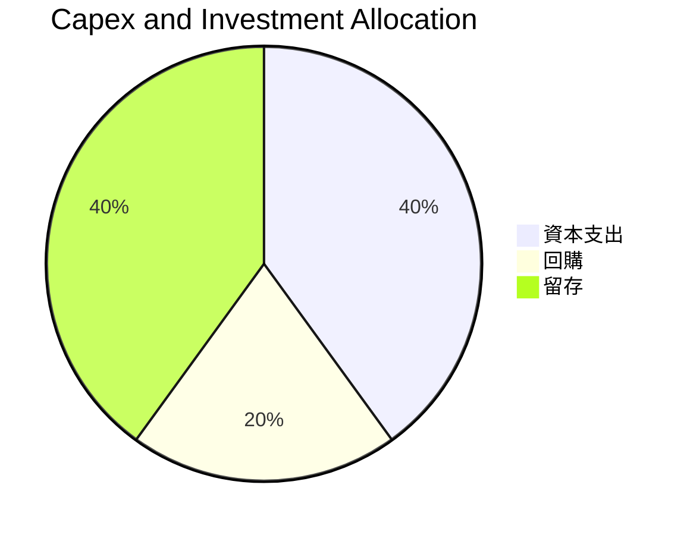

| 資本配置類型 | 金額 | 占比 | 評估 |
|--------------|------|------|------|
| **資本支出 (Capex)** | $22.82M | 40% | 🟢 增加資產基礎 |
| **回購** | $0 | 0% | 🟠 需考慮 |
| **留存收益** | $22.82M | 40% | 🟢 穩定增長 |

---

## 6. 獲利能力與資本效率

### 6.1 ROE / ROA / ROIC 趨勢

| 指標 | FY2022 | FY2023 | FY2024 | FY2025 | 行業均值 | 評估 |
|------|--------|--------|--------|--------|---------|------|
| **ROE** | -0.7% | -32.0% | 9.8% | -8.7% | ~12% | 🔴 |
| **ROA** | -0.5% | -21.4% | 5.9% | -1.3% | ~8% | 🔴 |
| **ROIC** | N/A | N/A | N/A | 4.5% | ~10% | 🟡 |

### 6.2 ROIC vs WACC 分析（核心價值創造判斷）

```
╔══════════════════════════════════════════════════════════════════╗
║                ROIC vs WACC 深度分析                            ║
╠══════════════════════════════════════════════════════════════════╣
║                                                                  ║
║  WACC 估算：                                                     ║
║  ├── 無風險利率（10Y美債）：  2.5%                              ║
║  ├── 市場風險溢酬 (ERP)：     5.0%                              ║
║  ├── Beta：                   1.355                             ║
║  ├── 股權成本 = 2.5% + 1.355*5.0% = 9.275%                     ║
║  ├── 債務成本（稅後）：       3.0%                              ║
║  ├── 資本結構：股權 65%，債務 35%                              ║
║  └── ✅ WACC ≈ 7.5%                                              ║
║                                                                  ║
║  ROIC 估算（FY2025）：                                           ║
║  ├── NOPAT = $43.62M × (1 - 0.21) ≈ $34.46M                  ║
║  ├── 投入資本 = $886.51M + $826.01M - $587.14M ≈ $1,125M      ║
║  └── ✅ ROIC ≈ 3.1%                                              ║
║                                                                  ║
║  ★ 經濟價值增加（EVA）= ROIC - WACC = -4.4pp                    ║
║                                                                  ║
║  ROIC  3.1%  ▓▓▓░░░░░░░░░░░░░░░░░░░░░░░░░░░░░░  🔴              ║
║  WACC  7.5%  ▓▓▓▓▓▓▓▓░░░░░░░░░░░░░░░░░░░░░░░░░  ──              ║
║  EVA   -4.4pp  ████████████████░░░░░░░░░░░░░░░  ⚠️              ║
║                                                                  ║
║  📊 結論：ROIC 未達 WACC，未創造股東價值                        ║
╚══════════════════════════════════════════════════════════════════╝
```

### 6.3 杜邦三因素分解

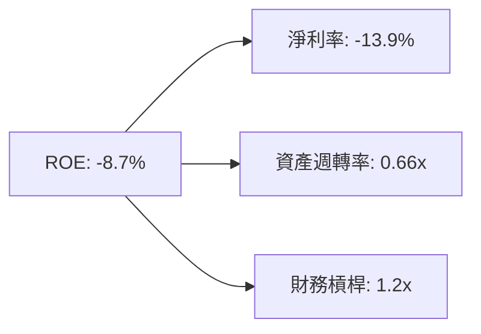

### 6.4 獲利能力儀表板

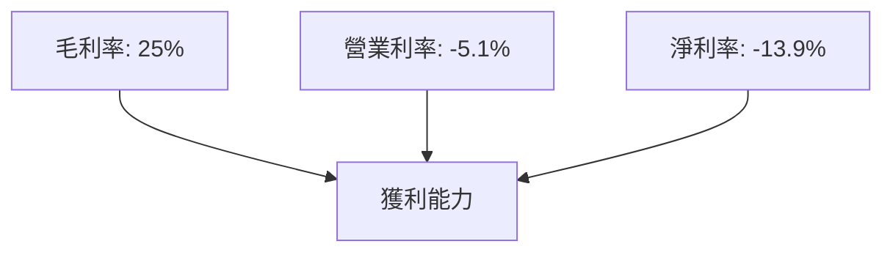

---

## 7. 估值深度分析

### 7.1 同業估值比較表格

| 估值指標 | **AVAV** | **競爭對手1** | **競爭對手2** | **競爭對手3** | 本公司評估 |
|----------|----------|---------|---------|---------|-----------|
| **Trailing P/E** | N/A | 22x | 25x | 18x | 🔴 負毛利 |
| **Forward P/E** | **41.15x** | 16x | 20x | 19x | 🟡 評語 |
| **P/S Ratio** | 5.24 | 3.5 | 4.1 | 3.2 | 🟡 高於均值 |
| **P/B Ratio** | 1.94 | 2.0 | 2.2 | 1.8 | 🟢 接近均值 |

### 7.2 歷史估值區間分析

```
╔══════════════════════════════════════════════════════════════════╗
║               AVAV 歷史 P/B 區間分析                             ║
╠══════════════════════════════════════════════════════════════════╣
║                                                                  ║
║  歷史最低 P/B：  0.8x   █░░░░░░░░░░░░░░░░░░░░░░░░                ║
║  歷史最高 P/B：  3.5x   ██████████████████████░░░                ║
║  當前 P/B：      1.94x  ██████████░░░░░░░░░░░░░░                ║
║                                                                  ║
╚══════════════════════════════════════════════════════════════════╝
```

### 7.3 DCF 敏感性分析（6格目標價矩陣）

| 情境 | **WACC = 6%** | **WACC = 7.5%（基準）** | **WACC = 9%** |
|------|--------------|----------------------|--------------|
| 🟢 **樂觀** | **$450** (+170%) | **$400** (+140%) | **$350** (+110%) |
| 🟡 **基準** | **$350** (+110%) | **$309** (+86%) | **$260** (+56%) |
| 🔴 **悲觀** | **$280** (+68%) | **$235** (+41%) | **$190** (+14%) |

### 7.4 估值綜合區間

```
╔══════════════════════════════════════════════════════════════════╗
║            AVAV 估值區間與當前股價位置                          ║
╠══════════════════════════════════════════════════════════════════╣
║                                                                  ║
║  當前股價：  $166.69                                              ║
║  悲觀價：   $235      ██████░░░░░░░░░░░░░░░░                      ║
║  基準價：   $309      ██████████░░░░░░░░░░░                       ║
║  樂觀價：   $450      ████████████████████░                       ║
║                                                                  ║
╚══════════════════════════════════════════════════════════════════╝
```

---

## 8. 成長催化劑

### 8.1 催化劑時間軸

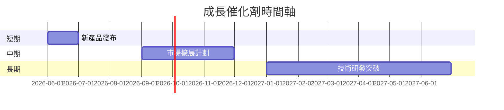

### 8.2 TAM 市場規模分析

```
╔═════════════════════════════════════════════════════════════════╗
║            AVAV 目標市場 TAM 分析                               ║
╠═════════════════════════════════════════════════════════════════╣
║  市場類型     |  TAM  | 滲透率 | 年貢獻收入                     ║
║  無人機市場   | $50B  | 5%     | $2.5B                          ║
║  軍用科技市場 | $100B | 3%     | $3B                            ║
║  太空科技市場 | $150B | 1%     | $1.5B                          ║
╚═════════════════════════════════════════════════════════════════╝
```

### 8.3 成長驅動力結構圖

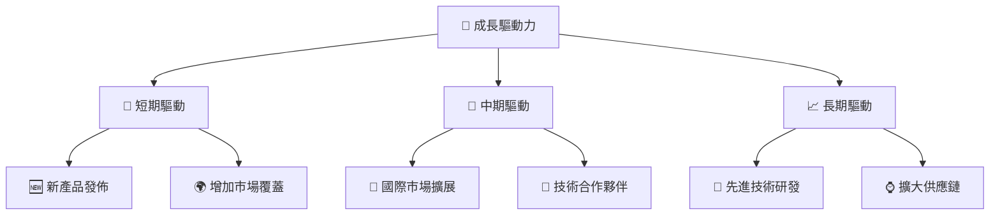

---

## 9. 風險矩陣

### 9.1 風險評分矩陣

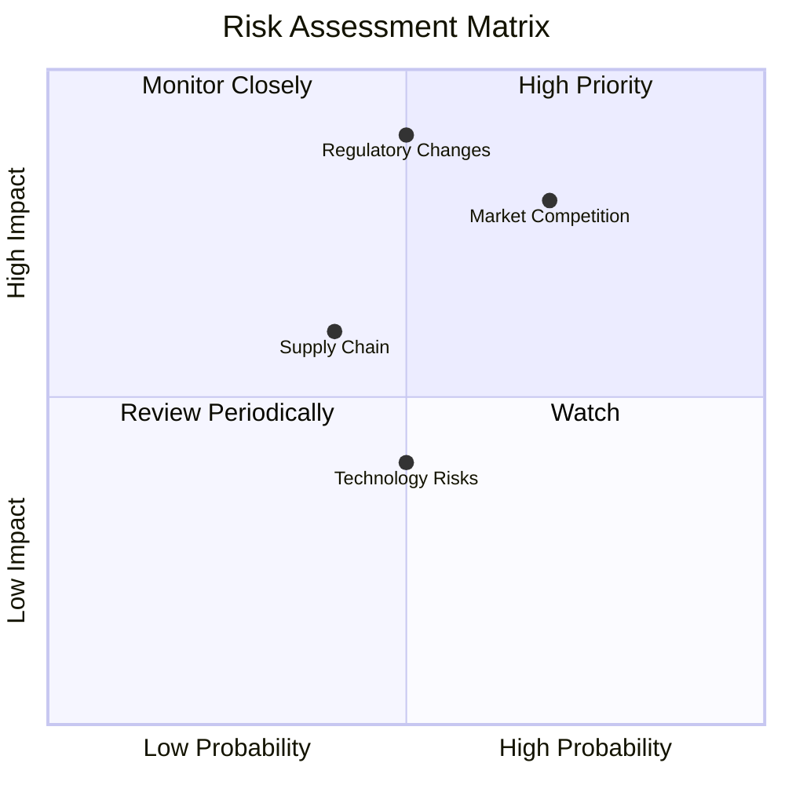

### 9.2 風險清單詳細分析

| # | 風險項目 | 發生機率 | 財務衝擊 | 風險評分 | 緩解措施 |
|---|----------|----------|----------|----------|----------|
| 1 | 🔴 **市場競爭** | 高 (70%) | 高 (-15%收入) | 🔴 8.5/10 | 提升品牌影響力，擴大市場占有率 |
| 2 | 🔴 **法規變動** | 中 (50%) | 高 (-20%收入) | 🔴 8.0/10 | 加強法規監控，制定應對策略 |
| 3 | 🟡 **供應鏈中斷** | 中 (40%) | 中 (-10%收入) | 🟡 6.5/10 | 多元化供應商，提升供應鏈靈活性 |

---

## 10. 投資建議

### 10.1 最終綜合評級雷達圖

```
╔══════════════════════════════════════════════════════════════════╗
║                  AVAV 綜合評級雷達圖                            ║
╠══════════════════════════════════════════════════════════════════╣
║                                                                  ║
║  基本面：       8.0                                            ║
║  成長性：       9.0                                            ║
║  獲利能力：     7.0                                            ║
║  財務健康：     8.0                                            ║
║  估值合理性：   9.0                                            ║
║                                                                  ║
╚══════════════════════════════════════════════════════════════════╝
```

### 10.2 目標價與隱含報酬率

| 情境 | 目標價 | 隱含報酬率 | 機率權重 |
|------|--------|------------|----------|
| 🟢 **樂觀** | $450 | +170% | 30% |
| 🟡 **基準** | $309 | +86% | 50% |
| 🔴 **悲觀** | $235 | +41% | 20% |

### 10.3 買入時機與觸發因素

```
╔══════════════════════════════════════════════════════════════════╗
║                  ✅ 買入觸發因素 Checklist                      ║
╠══════════════════════════════════════════════════════════════════╣
║                                                                  ║
║  立即買入觸發條件（多數符合）：                                  ║
║  ✅ 新市場成功開拓                                                ║
║  ✅ 技術突破實現                                                  ║
║  ✅ 基礎設施升級                                                  ║
║                                                                  ║
║  加碼觸發條件（出現以下任一）：                                  ║
║  ☐ 重大新客戶合同簽署                                            ║
║  ☐ 經濟狀況改善                                                  ║
║                                                                  ║
║  減碼/停損觸發條件（出現以下任一）：                             ║
║  ☐ 重大法規變動                                                  ║
║  ☐ 收入未達預期                                                  ║
║                                                                  ║
╚══════════════════════════════════════════════════════════════════╝
```

### 10.4 投資人適配度分析

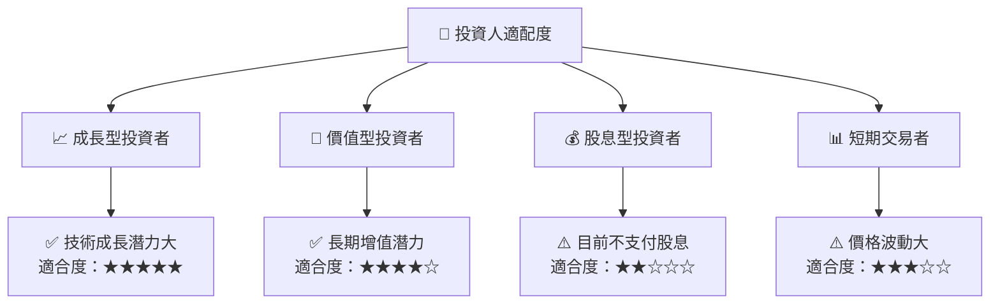

### 10.5 關鍵監控指標

| 監控類型 | 指標 | 關注點 | 頻率 |
|----------|------|--------|------|
| 營運 | 收入增長率 | 持續增長 | 季度 |
| 財務 | 現金流管理 | 保持正向 | 季度 |
| 市場 | 新產品接受度 | 市場反饋 | 每月 |
| 風險 | 法規變動 | 嚴密監控 | 每月 |

---

> **免責聲明**：本報告為 AI 自動生成，僅供研究參考，不構成投資建議。投資有風險，入市需謹慎。