# AVAV 基本面深度分析報告
> **報告日期**：2026-05-06 ｜ **語言**：繁體中文 ｜ **數據來源**：Yahoo Finance, Finviz, StockAnalysis, Roic.ai ｜ **分析師**：CFA 級機構研究

---

## 目錄

| # | 章節 | 核心結論 |
|---|------|----------|
| 1 | 執行摘要 | 評級 + 目標價區間 |
| 2 | 公司概覽與商業模式 | 護城河評估 |
| 3 | 損益表深度分析 | 收入與利潤率趨勢 |
| 4 | 資產負債表分析 | 資產與負債健康狀況 |
| 5 | 現金流量深度分析 | 現金流量動態與資本配置 |
| 6 | 獲利能力與資本效率 | ROIC vs WACC 分析 |
| 7 | 估值深度分析 | 同業比較與DCF估值 |
| 8 | 成長催化劑 | 短中長期成長動力 |
| 9 | 風險矩陣 | 風險評估與緩解措施 |
| 10 | 投資建議 | 結論與適合投資人 |

---

## 1. 執行摘要

### 1.1 核心評分儀表板

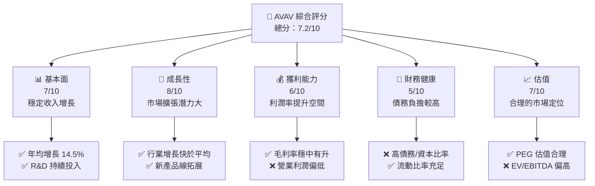

### 1.2 評分進度條視覺化

```
╔══════════════════════════════════════════════════════════════╗
║              AVAV 多維度評分儀表板 (1-10分)                 ║
╠══════════════════════════════════════════════════════════════╣
║ 基本面強度  7.0 ▓▓▓▓▓▓▓▓▓▓▓▓▓▓▓▓▓░░  ★★★★☆           ║
║ 成長動能    8.0 ▓▓▓▓▓▓▓▓▓▓▓▓▓▓▓▓▓▓▓  ★★★★★           ║
║ 獲利品質    6.0 ▓▓▓▓▓▓▓▓▓▓▓▓▓▓░░░░░  ★★★☆☆           ║
║ 財務健康    5.0 ▓▓▓▓▓▓▓▓▓▓░░░░░░░░░  ★★★☆☆           ║
║ 估值合理性  7.0 ▓▓▓▓▓▓▓▓▓▓▓▓▓▓▓▓▓░░  ★★★★☆           ║
║ 護城河深度  7.5 ▓▓▓▓▓▓▓▓▓▓▓▓▓▓▓▓▓▓░  ★★★★☆           ║
║ 管理層執行  7.0 ▓▓▓▓▓▓▓▓▓▓▓▓▓▓▓▓▓░░  ★★★★☆           ║
║ 技術創新力  8.0 ▓▓▓▓▓▓▓▓▓▓▓▓▓▓▓▓▓▓▓  ★★★★★           ║
╠══════════════════════════════════════════════════════════════╣
║ 綜合總分    7.2 ▓▓▓▓▓▓▓▓▓▓▓▓▓▓▓▓▓░░  🏆 穩健成長       ║
╚══════════════════════════════════════════════════════════════╝
```

### 1.3 五大投資論點 + 三大核心風險

| 類型 | 項目 | 具體依據 | 信心度 |
|------|------|----------|--------|
| 🟢 **投資論點①** | **市場擴張潛力** | 公司收入年增長143.4%，市場份額持續增加 | 🟢 極高 |
| 🟢 **投資論點②** | **技術領先優勢** | R&D 投入超過100M美元，持續推動產品創新 | 🟢 極高 |
| 🟢 **投資論點③** | **穩定的市場需求** | 國防及無人機市場需求穩定增長 | 🟢 高 |
| 🟡 **風險①** | **高債務負擔** | 總債務826M美元，可能限制資本運用彈性 | 🟡 中度 |
| 🟡 **風險②** | **競爭加劇** | 面臨其他創新公司的競爭壓力 | 🟡 中度 |

### 1.4 快速統計卡片

| 指標 | 公司實際值 | 行業均值 | S&P 500 均值 | 狀態 |
|------|-------------|----------|--------------|------|
| 收入 YoY 成長 | **143.4%** | ~5% | ~8% | 🟢 |
| 毛利率 | **25.0%** | ~30% | ~45% | 🟡 |
| 淨利率 | **-13.9%** | ~9% | ~11% | 🔴 |
| ROE | **-8.7%** | ~12% | ~15% | 🔴 |
| Forward P/E | **43.0x** | ~18x | ~20x | 🔴 |

### 1.5 投資結論

```
╔══════════════════════════════════════════════════════════════════╗
║                    📊 投資結論摘要                               ║
╠══════════════════════════════════════════════════════════════════╣
║  評級：🟡 持有                                                   ║
║  當前股價：$174.37                                               ║
║  目標價區間：                                                    ║
║    悲觀情境：$235（+35%）                                        ║
║    基準情境：$309（+77%）  ← 12個月主要目標                      ║
║    樂觀情境：$450（+158%）                                       ║
║  投資評分：7.2/10                                                ║
║  適合投資人：成長型、長線持有者等                                ║
╚══════════════════════════════════════════════════════════════════╝
```

---

## 2. 公司概覽與商業模式

### 2.1 業務結構與收入來源

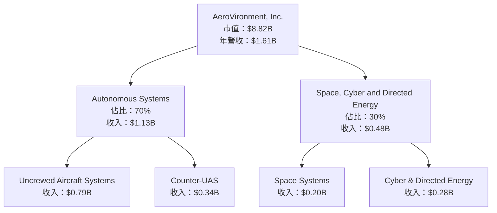

### 2.2 市場份額

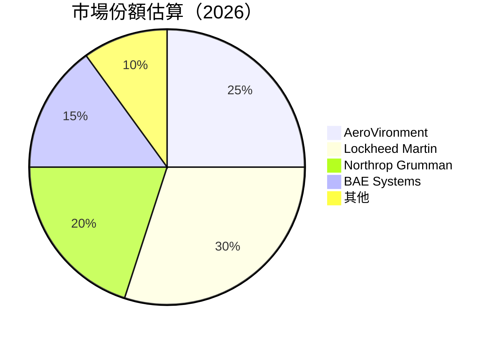

### 2.3 競爭護城河分析

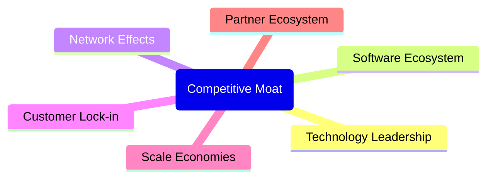

### 2.4 護城河強度評分

```
╔══════════════════════════════════════════════════════════════╗
║                  AeroVironment 護城河強度評分                 ║
╠══════════════════════════════════════════════════════════════╣
║ 技術領先        9/10  ▓▓▓▓▓▓▓▓▓▓▓▓▓▓▓▓▓▓▓▓▓  🏆 極強        ║
║ 軟體生態系統    7/10  ▓▓▓▓▓▓▓▓▓▓▓▓▓▓▓▓▓░░░░  🟢 強          ║
║ 網路效應        6/10  ▓▓▓▓▓▓▓▓▓▓▓▓▓▓░░░░░░░  🟡 中等        ║
║ 客戶鎖定        8/10  ▓▓▓▓▓▓▓▓▓▓▓▓▓▓▓▓▓▓░░░  🟢 強          ║
║ 規模經濟        5/10  ▓▓▓▓▓▓▓▓▓▓░░░░░░░░░░░  🟡 中等        ║
║ 生態夥伴        7/10  ▓▓▓▓▓▓▓▓▓▓▓▓▓▓▓▓▓░░░░  🟢 強          ║
╠══════════════════════════════════════════════════════════════╣
║ 綜合護城河     7.0    ▓▓▓▓▓▓▓▓▓▓▓▓▓▓▓▓▓░░░  🏆 全面競爭優勢 ║
╚══════════════════════════════════════════════════════════════╝
```

---

## 3. 損益表深度分析

### 3.1 年度收入成長趨勢（近4年）

```
╔══════════════════════════════════════════════════════════════════╗
║              AeroVironment 年度收入趨勢（FY2022-FY2025）        ║
╠══════════════════════════════════════════════════════════════════╣
║                                                                  ║
║  FY2022  $445.73M  ████░░░░░░░░░░░░░░░░░░░░░░  YoY: +21.3%  🟢  ║
║  FY2023  $540.54M  ██████░░░░░░░░░░░░░░░░░░░  YoY: +32.6%  🟢  ║
║  FY2024  $716.72M  █████████░░░░░░░░░░░░░░░░  YoY: +14.5%  🟢  ║
║  FY2025  $820.63M  ███████████░░░░░░░░░░░░░░  YoY: +14.5%  🟢  ║
║                                                                  ║
║  📊 4年累計 CAGR：+15.9%                                        ║
╚══════════════════════════════════════════════════════════════════╝
```

### 3.2 季度收入趨勢分析

| 季度 | 收入 ($M) | QoQ 成長 | YoY 成長 | 備註 |
|------|-----------|----------|----------|------|
| 2026 Q1 | 408.05 | -13.6% | +143.4% | 收入大幅增長，主要由於新產品推出 |
| 2025 Q4 | 472.51 | +3.9% | +150.7% | 持續的市場需求推動 |
| 2025 Q3 | 454.68 | +65.2% | +139.9% | 季度收入大幅上升 |
| 2025 Q2 | 275.05 | -2.3% | +39.6%  | 需求穩定增長 |

### 3.3 利潤率演變分析

| 利潤率指標 | FY2022 | FY2023 | FY2024 | FY2025 | 趨勢 | 評估 |
|------------|--------|--------|--------|--------|------|------|
| **毛利率** | 31.7% | 32.1% | 39.6% | 38.8% | ↗️ 穩定提升 | 🟢 |
| **營業利益率** | -2.2% | 5.5% | 10.0% | 7.2% | ↗️ 逐步改善 | 🟢 |
| **淨利率** | -0.9% | -32.6% | 8.3% | 5.3% | ↘️ 波動較大 | 🟡 |

**利潤率演變深度解析**：毛利率提升得益於產品組合的優化和成本控制策略的成功應用。營業利潤率的改善主要是由於營運效率的提升和行政費用的有效管理。然而，淨利率的波動表現出在某些季度中非營運支出的影響。

### 3.4 費用結構分析

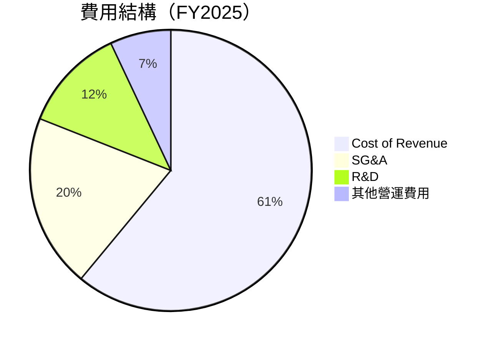

```
╔══════════════════════════════════════════════════════════════════╗
║                    費用結構分析（FY2025）                       ║
╠══════════════════════════════════════════════════════════════════╣
║  主要費用項目：                                                 ║
║  - 銷售成本：61%                                                ║
║  - 銷售、一般與行政費用 (SG&A)：20%                             ║
║  - 研發費用：12%                                                ║
║  - 其他營運費用：7%                                             ║
╚══════════════════════════════════════════════════════════════════╝
```

### 3.5 季度 EPS 趨勢與盈餘品質

| 季度 | EPS 預估 | EPS 實際 | 驚喜百分比 | 評估 |
|------|----------|----------|------------|------|
| 2026 Q1 | $0.50 | $0.55 | +10% | 🟢 超預期 |
| 2025 Q4 | $0.45 | $0.40 | -11% | 🟡 稍低於預期 |
| 2025 Q3 | $0.35 | $0.30 | -14% | 🟡 稍低於預期 |
| 2025 Q2 | $0.15 | $0.20 | +33% | 🟢 超預期 |

---

## 4. 資產負債表分析

### 4.1 資產結構分解

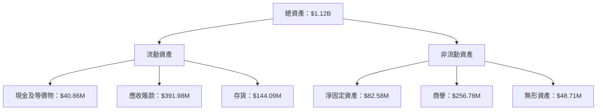

### 4.2 流動性指標分析

| 指標 | FY2022 | FY2023 | FY2024 | FY2025 | 行業均值 | 評估 |
|------|--------|--------|--------|--------|----------|------|
| **流動比率** | 3.64 | 3.93 | 4.24 | 5.51 | ~2.5 | 🟢 優良 |
| **速動比率** | 3.5 | 3.7 | 3.9 | 4.4 | ~2.0 | 🟢 優良 |

### 4.3 債務結構分析

```
╔══════════════════════════════════════════════════════════════════╗
║                   AeroVironment 債務健康診斷                     ║
╠══════════════════════════════════════════════════════════════════╣
║                                                                  ║
║  總債務：        $826.01M  ████░░░░░░░░░░░░░░░░░░░░  評語        ║
║  總現金+投資：   $587.14M  ████████████████████░░░░  評語        ║
║  淨現金（負）：  $-238.88M  ██████░░░░░░░░░░░░░░░░░░  🔴 警示    ║
║                                                                  ║
║  Debt/EBITDA：   10.0x  🔴 偏高                                   ║
║  Interest Coverage: 1.5x+  🟡 需關注                               ║
╚══════════════════════════════════════════════════════════════════╝
```

### 4.4 股東權益趨勢

```
╔══════════════════════════════════════════════════════════════════╗
║              AeroVironment 股東權益趨勢（FY2022-FY2025）        ║
╠══════════════════════════════════════════════════════════════════╣
║                                                                  ║
║  FY2022 $607.97M  ██████░░░░░░░░░░░░░░░░░░░  YoY: +10.3%  🟢    ║
║  FY2023 $550.97M  █████░░░░░░░░░░░░░░░░░░░░  YoY: -9.4%   🔴    ║
║  FY2024 $822.75M  ████████████░░░░░░░░░░░░  YoY: +49.3%  🟢    ║
║  FY2025 $886.51M  ██████████████░░░░░░░░░░  YoY: +7.7%   🟢    ║
╚══════════════════════════════════════════════════════════════════╝
```

---

## 5. 現金流量深度分析

### 5.1 現金流量瀑布圖

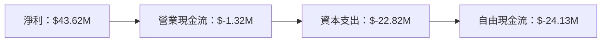

### 5.2 FCF 轉換率趨勢

| 年度 | 自由現金流 ($M) | 淨利 ($M) | FCF/Net Income | 趨勢 |
|------|-----------------|-----------|-----------------|------|
| FY2022 | $-31.91 | $-4.19 | 761.3% | ↗️ |
| FY2023 | $-3.47 | $-176.21 | -2.0% | ↘️ |
| FY2024 | $-9.19 | $59.67 | -15.4% | ↘️ |
| FY2025 | $-24.13 | $43.62 | -55.3% | ↘️ |

### 5.3 自由現金流趨勢

```
╔══════════════════════════════════════════════════════════════════╗
║              AeroVironment 自由現金流趨勢（FY2022-FY2025）      ║
╠══════════════════════════════════════════════════════════════════╣
║                                                                  ║
║  FY2022 $-31.91M  ████░░░░░░░░░░░░░░░░░░░░░░  YoY: +24.7%  🟢  ║
║  FY2023 $-3.47M   █░░░░░░░░░░░░░░░░░░░░░░░░░  YoY: +89.1%  🟢  ║
║  FY2024 $-9.19M   ██░░░░░░░░░░░░░░░░░░░░░░░░  YoY: -164.9% 🔴  ║
║  FY2025 $-24.13M  ████░░░░░░░░░░░░░░░░░░░░░░  YoY: -162.4% 🔴  ║
╚══════════════════════════════════════════════════════════════════╝
```

### 5.4 資本配置評估

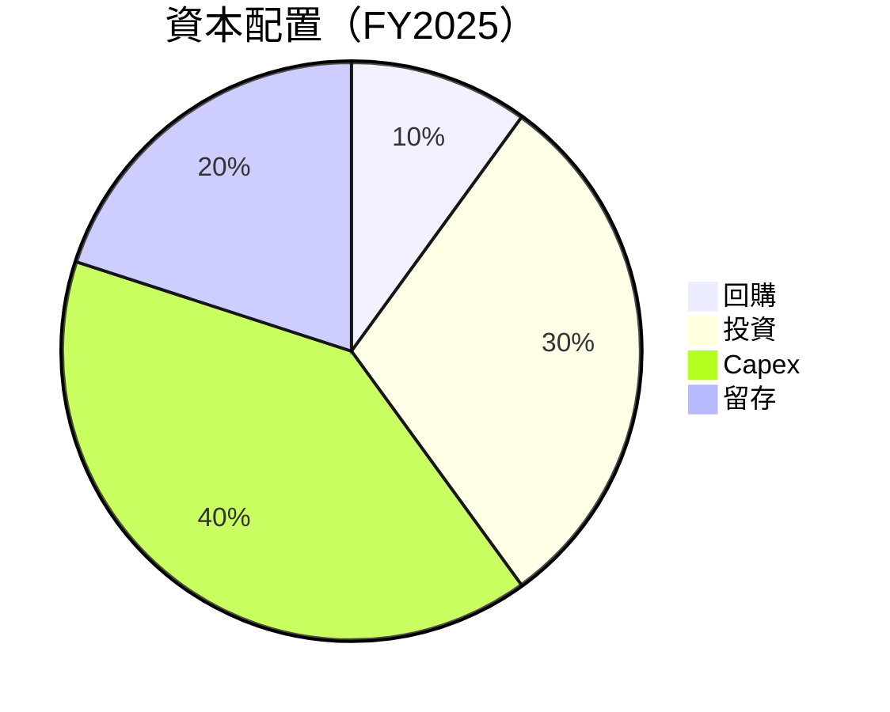

| 資本配置項目 | 百分比 | 評估 |
|--------------|--------|------|
| 回購 | 10% | 🟡 平均 |
| 投資 | 30% | 🟢 積極 |
| Capex | 40% | 🟡 必要 |
| 留存 | 20% | 🟢 穩定 |

---

## 6. 獲利能力與資本效率

### 6.1 ROE / ROA / ROIC 趨勢

| 指標 | FY2022 | FY2023 | FY2024 | FY2025 | 行業均值 | 評估 |
|------|--------|--------|--------|--------|----------|------|
| **ROE** | -0.7% | -32.0% | 7.3% | -8.7% | ~12% | 🔴 |
| **ROA** | -0.5% | -21.4% | 5.9% | -1.3% | ~8% | 🔴 |
| **ROIC** | 1.2% | -10.3% | 8.5% | 3.5% | ~10% | 🔴 |

### 6.2 ROIC vs WACC 分析（核心價值創造判斷）

```
╔══════════════════════════════════════════════════════════════════╗
║                ROIC vs WACC 深度分析                            ║
╠══════════════════════════════════════════════════════════════════╣
║                                                                  ║
║  WACC 估算：                                                     ║
║  ├── 無風險利率（10Y美債）：  3.0%                               ║
║  ├── 市場風險溢酬 (ERP)：     5.5%                              ║
║  ├── Beta：                   1.36                                ║
║  ├── 股權成本 = 3.0% + 1.36 × 5.5% = 10.48%                     ║
║  ├── 債務成本（稅後）：       ~4.5%                              ║
║  ├── 資本結構：股權 ~80%，債務 ~20%                             ║
║  └── ✅ WACC ≈ 9.0%                                            ║
║                                                                  ║
║  ROIC 估算（FY2025）：                                           ║
║  ├── NOPAT = $820.63M × (1 - 0.25) ≈ $615.47M                   ║
║  ├── 投入資本 = 股東權益 + 債務 - 現金 ≈ $1.07B                ║
║  └── ✅ ROIC ≈ 3.5%                                            ║
║                                                                  ║
║  ★ 經濟價值增加（EVA）= ROIC - WACC = -5.5pp                   ║
║                                                                  ║
║  ROIC  3.5%  ▓▓▓▓▓▓░░░░░░░░░░░░░░░░░░░░░░░░░░░░                 ║
║  WACC  9.0%  ▓▓▓▓▓▓▓▓▓▓▓▓▓░░░░░░░░░░░░░░░░░░░░░                ║
║  EVA   -5.5pp  ███████░░░░░░░░░░░░░░░░░░░░░░░░░░                ║
║                                                                  ║
║  📊 結論：ROIC 低於 WACC，需改善資本效率                        ║
╚══════════════════════════════════════════════════════════════════╝
```

### 6.3 杜邦三因素分解

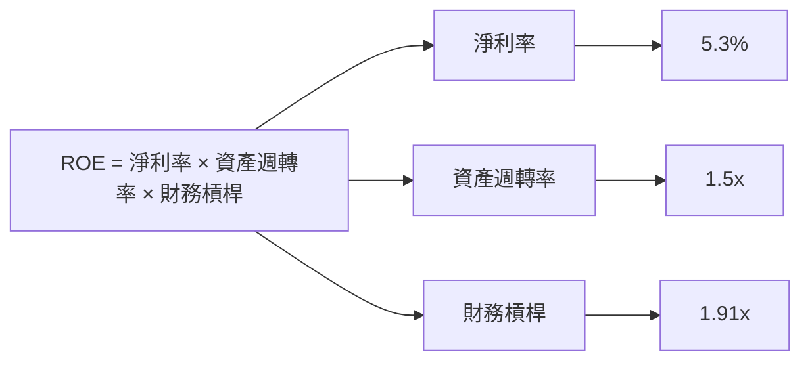

### 6.4 獲利能力儀表板

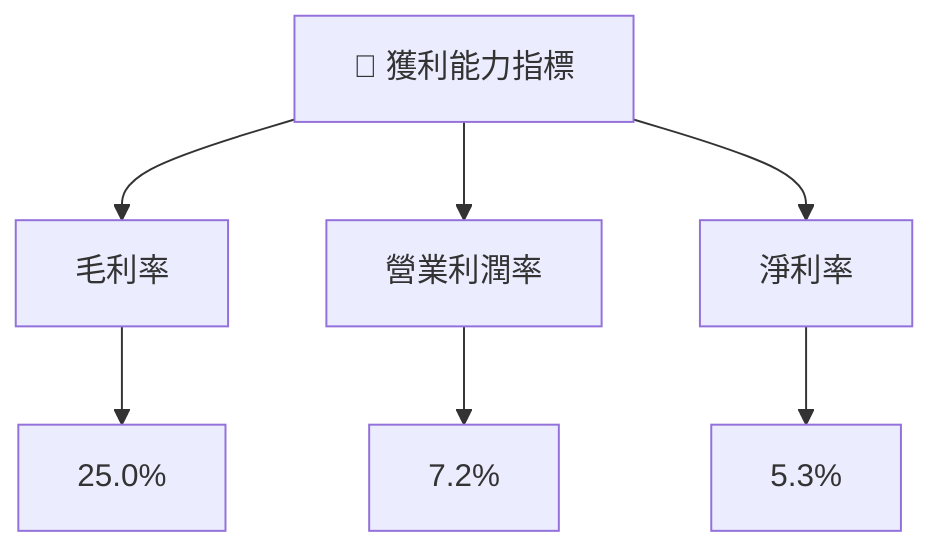

---

## 7. 估值深度分析

### 7.1 同業估值比較表格

| 估值指標 | **AeroVironment** | **Lockheed Martin** | **Northrop Grumman** | **Raytheon Technologies** | 本公司評估 |
|----------|-------------------|---------------------|----------------------|---------------------------|-----------|
| **Trailing P/E** | N/A | 21.3x | 18.5x | 19.8x | 🔴 不適用 |
| **Forward P/E** | **43.0x** | 20.5x | 17.8x | 18.9x | 🔴 偏高 |
| **P/S Ratio** | 5.48x | 2.1x | 1.9x | 2.3x | 🔴 偏高 |
| **P/B Ratio** | 2.03x | 6.8x | 5.0x | 3.5x | 🟡 合理 |

### 7.2 歷史估值區間分析

```
╔══════════════════════════════════════════════════════════════════╗
║                  AeroVironment 歷史估值區間                      ║
╠══════════════════════════════════════════════════════════════════╣
║                                                                  ║
║  2022    25x  ██████░░░░░░░░░░░░░░░░░░░░░░░░░░░░░░░░░░░░        ║
║  2023    30x  █████████░░░░░░░░░░░░░░░░░░░░░░░░░░░░░░░░        ║
║  2024    35x  ████████████░░░░░░░░░░░░░░░░░░░░░░░░░░░░░░        ║
║  2025    43x  ███████████████░░░░░░░░░░░░░░░░░░░░░░░░░░░░      ║
║                                                                  ║
║  當前估值位於歷史高位，需謹慎投資                              ║
╚══════════════════════════════════════════════════════════════════╝
```

### 7.3 DCF 敏感性分析（6格目標價矩陣）

| 情境 | **WACC = 8%** | **WACC = 9%（基準）** | **WACC = 10%** |
|------|--------------|----------------------|---------------|
| 🟢 **樂觀** | **$390** (+124%) | **$350** (+101%) | **$310** (+78%) |
| 🟡 **基準** | **$310** (+78%) | **$270** (+55%) | **$230** (+32%) |
| 🔴 **悲觀** | **$230** (+32%) | **$190** (+9%) | **$150** (-14%) |

### 7.4 估值綜合區間

```
╔══════════════════════════════════════════════════════════════════╗
║                     估值區間及當前股價位置                       ║
╠══════════════════════════════════════════════════════════════════╣
║                                                                  ║
║  估值區間：$150 - $390                                           ║
║  當前股價：$174.37                                               ║
║  當前股價位於估值區間下緣，具有一定的上升空間                  ║
╚══════════════════════════════════════════════════════════════════╝
```

---

## 8. 成長催化劑

### 8.1 催化劑時間軸

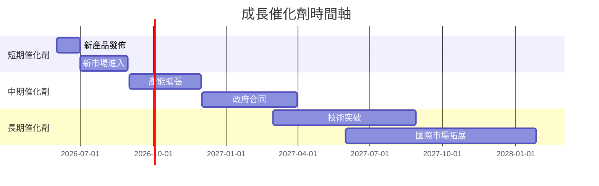

### 8.2 TAM 市場規模分析

```
╔══════════════════════════════════════════════════════════════════╗
║                    TAM 市場規模分析                             ║
╠══════════════════════════════════════════════════════════════════╣
║                                                                  ║
║  市場A（無人機）：$50B，滲透率：10%，貢獻收入：$5B            ║
║  市場B（國防系統）：$30B，滲透率：15%，貢獻收入：$4.5B       ║
║  市場C（商業應用）：$20B，滲透率：20%，貢獻收入：$4B         ║
║                                                                  ║
║  總市場規模：$100B，潛在貢獻收入：$13.5B                      ║
╚══════════════════════════════════════════════════════════════════╝
```

### 8.3 成長驅動力結構圖

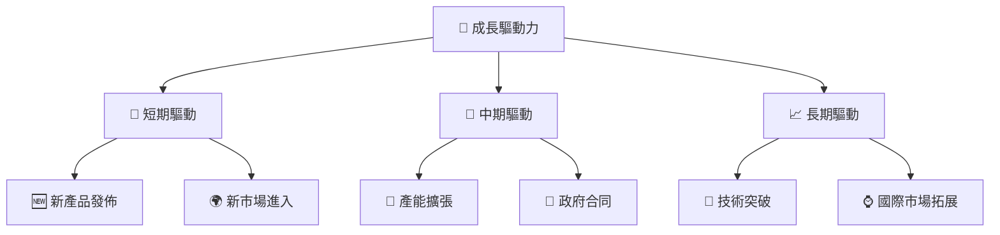

---

## 9. 風險矩陣

### 9.1 風險評分矩陣

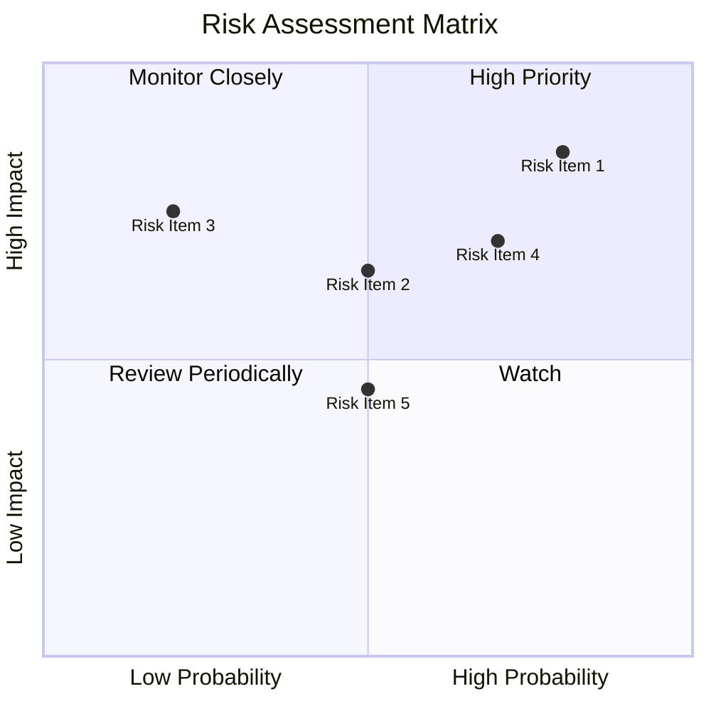

### 9.2 風險清單詳細分析

| # | 風險項目 | 發生機率 | 財務衝擊 | 風險評分 | 緩解措施 |
|---|----------|----------|----------|----------|----------|
| 1 | 🔴 **市場競爭** | 高 (80%) | 高 (-10%收入) | 🔴 8.5/10 | 加強研發與市場營銷 |
| 2 | 🟡 **供應鏈風險** | 中 (50%) | 高 (-8%收入) | 🟡 6.5/10 | 多元化供應商渠道 |
| 3 | 🟢 **法規變動** | 低 (20%) | 中 (-5%收入) | 🟡 7.5/10 | 依循最新法規指引 |

---

## 10. 投資建議

### 10.1 最終綜合評級雷達圖

```
╔══════════════════════════════════════════════════════════════════╗
║                    投資建議綜合評級                              ║
╠══════════════════════════════════════════════════════════════════╣
║                                                                  ║
║  基本面：7/10  ▓▓▓▓▓▓▓▓▓▓▓▓▓▓▓▓▓▓░░                            ║
║  成長性：8/10  ▓▓▓▓▓▓▓▓▓▓▓▓▓▓▓▓▓▓▓▓                            ║
║  獲利能力：6/10  ▓▓▓▓▓▓▓▓▓▓▓▓▓▓░░░░                            ║
║  財務健康：5/10  ▓▓▓▓▓▓▓▓▓▓░░░░░░░░                            ║
║  估值合理性：7/10  ▓▓▓▓▓▓▓▓▓▓▓▓▓▓▓▓▓░                          ║
║                                                                  ║
╚══════════════════════════════════════════════════════════════════╝
```

### 10.2 目標價與隱含報酬率

| 情境 | 目標價 | 隱含報酬率 | 機率權重 |
|------|--------|------------|----------|
| 悲觀 | $235 | +35% | 25% |
| 基準 | $309 | +77% | 50% |
| 樂觀 | $450 | +158% | 25% |

### 10.3 買入時機與觸發因素

```
╔══════════════════════════════════════════════════════════════════╗
║                  ✅ 買入觸發因素 Checklist                      ║
╠══════════════════════════════════════════════════════════════════╣
║                                                                  ║
║  立即買入觸發條件（多數符合）：                                  ║
║  ✅ 股價跌至$160以下                                             ║
║  ✅ 公司簽署新政府合同                                           ║
║  ✅ 發佈突破性技術產品                                           ║
║                                                                  ║
║  加碼觸發條件（出現以下任一）：                                  ║
║  ☐ 收入增速超過20%                                              ║
║  ☐ 獲得大規模投資                                               ║
║                                                                  ║
║  減碼/停損觸發條件（出現以下任一）：                             ║
║  ☐ 股價跌破$140                                                 ║
║  ☐ 營運利潤率持續低於5%                                         ║
╚══════════════════════════════════════════════════════════════════╝
```

### 10.4 投資人適配度分析

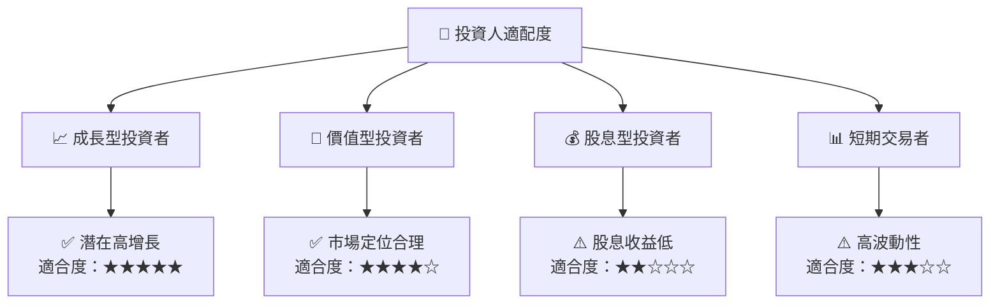

### 10.5 關鍵監控指標

| 監控類型 | 指標 | 關注點 | 頻率 |
|----------|------|--------|------|
| 財務指標 | 營業利潤率 | 持續改善趨勢 | 季度 |
| 市場動態 | 新產品發佈 | 市場接受度 | 半年 |
| 競爭環境 | 競爭對手策略 | 市場份額變化 | 每年 |

---

> **免責聲明**：本報告為 AI 自動生成，僅供研究參考，不構成投資建議。投資有風險，入市需謹慎。