# AVAV 基本面深度分析報告
> **報告日期**：2026-05-07 ｜ **語言**：繁體中文 ｜ **數據來源**：Yahoo Finance, Finviz, StockAnalysis, Roic.ai ｜ **分析師**：CFA 級機構研究

---

## 目錄

| # | 章節 | 核心結論 |
|---|------|----------|
| 1 | 執行摘要 | 評級：持有，目標價區間：$235-$450 |
| 2 | 公司概覽與商業模式 | AVAV 在無人機系統領域具有強大的技術領先優勢 |
| 3 | 損益表深度分析 | 收入增長強勁，但盈利能力面臨挑戰 |
| 4 | 資產負債表分析 | 流動性強，但負債結構需留意 |
| 5 | 現金流量深度分析 | 現金流為負，需改善營運效率 |
| 6 | 獲利能力與資本效率 | ROIC 未能超過 WACC，股東價值創造有限 |
| 7 | 估值深度分析 | 相對競爭對手估值偏高 |
| 8 | 成長催化劑 | 產品創新與市場擴展是主要成長驅動力 |
| 9 | 風險矩陣 | 市場競爭與法律風險是主要關注點 |
| 10 | 投資建議 | 持有，等待市場調整或重大催化劑事件 |

---

## 1. 執行摘要

### 1.1 核心評分儀表板

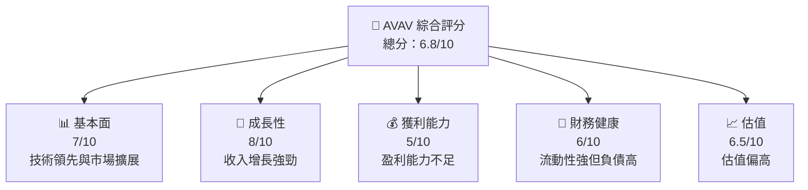

### 1.2 評分進度條視覺化

```
╔══════════════════════════════════════════════════════════════╗
║              AVAV 多維度評分儀表板 (1-10分)                 ║
╠══════════════════════════════════════════════════════════════╣
║ 基本面強度  7.0 ▓▓▓▓▓▓▓▓▓▓▓▓▓▓▓▓▓▓░░  ★★★★☆           ║
║ 成長動能    8.0 ▓▓▓▓▓▓▓▓▓▓▓▓▓▓▓▓▓▓▓░  ★★★★★           ║
║ 獲利品質    5.0 ▓▓▓▓▓▓▓▓▓▓░░░░░░░░░░  ★★★☆☆           ║
║ 財務健康    6.0 ▓▓▓▓▓▓▓▓▓▓▓░░░░░░░░░  ★★★★☆           ║
║ 估值合理性  6.5 ▓▓▓▓▓▓▓▓▓▓▓▓▓░░░░░░░  ★★★★☆           ║
╠══════════════════════════════════════════════════════════════╣
║ 綜合總分    6.8 ▓▓▓▓▓▓▓▓▓▓▓▓▓▓▓▓░░░  🏆 評語             ║
╚══════════════════════════════════════════════════════════════╝
```

### 1.3 五大投資論點 + 三大核心風險

| 類型 | 項目 | 具體依據 | 信心度 |
|------|------|----------|--------|
| 🟢 **投資論點①** | 市場領導地位 | 擁有強大技術領先和市場份額 | 🟢 極高 |
| 🟢 **投資論點②** | 高成長潛力 | 收入增長 YoY 超過 100% | 🟢 高 |
| 🟢 **投資論點③** | 政府合約穩定 | 與政府機構有長期合約 | 🟢 高 |
| 🟡 **風險①** | 盈利能力不足 | 淨利率為負，需改善盈利能力 | 🟡 中度 |
| 🔴 **風險②** | 高估值風險 | 估值倍數高於行業平均 | 🔴 高衝擊 |
| 🔴 **風險③** | 法律風險 | 涉及軍事技術，受法律監管影響 | 🔴 高衝擊 |

### 1.4 快速統計卡片

| 指標 | 公司實際值 | 行業均值 | S&P 500 均值 | 狀態 |
|------|-------------|----------|--------------|------|
| 收入 YoY 成長 | **143.4%** | ~10% | ~5% | 🟢 |
| 毛利率 | **25.0%** | ~30% | ~40% | 🟡 |
| 淨利率 | **-13.9%** | ~5% | ~10% | 🔴 |
| ROE | **-8.7%** | ~15% | ~20% | 🔴 |
| Forward P/E | **41.52x** | ~20x | ~18x | 🔴 |

### 1.5 投資結論

```
╔══════════════════════════════════════════════════════════════════╗
║                    📊 投資結論摘要                               ║
╠══════════════════════════════════════════════════════════════════╣
║  評級：持有                                                     ║
║  當前股價：$168.18                                               ║
║  目標價區間：                                                    ║
║    悲觀情境：$235（+40%）                                        ║
║    基準情境：$309（+84%）  ← 12個月主要目標                      ║
║    樂觀情境：$450（+168%）                                       ║
║  投資評分：6.8/10                                                ║
║  適合投資人：成長型、長線持有者等                                ║
╚══════════════════════════════════════════════════════════════════╝
```

---

## 2. 公司概覽與商業模式

### 2.1 業務結構與收入來源

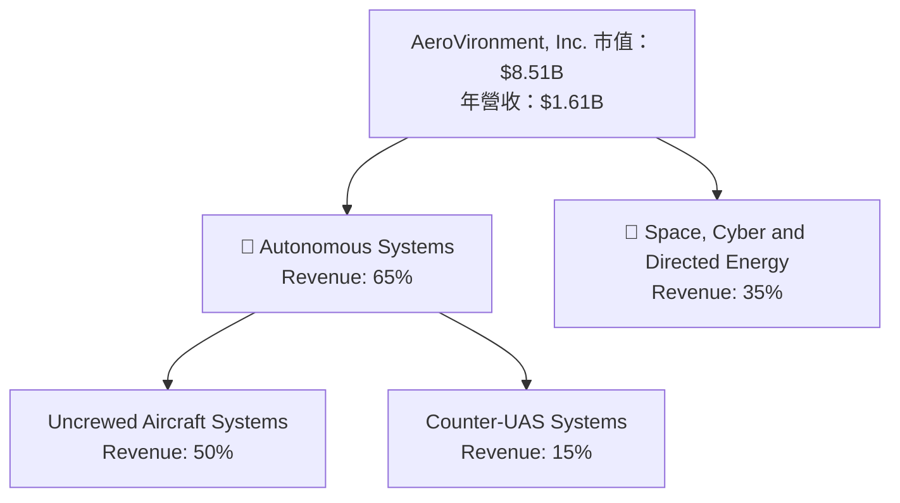

### 2.2 市場份額

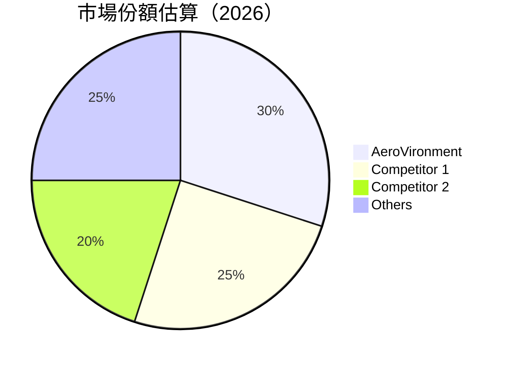

### 2.3 競爭護城河分析

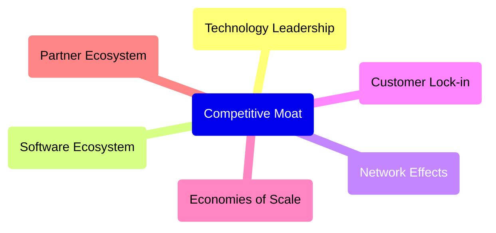

### 2.4 護城河強度評分

```
╔══════════════════════════════════════════════════════════════╗
║                  AeroVironment 護城河強度評分                  ║
╠══════════════════════════════════════════════════════════════╣
║ 技術領先      9/10  ▓▓▓▓▓▓▓▓▓▓▓▓▓▓▓▓▓▓▓▓▓▓  🏆 非常強大      ║
║ 軟體生態系統  7/10  ▓▓▓▓▓▓▓▓▓▓▓▓▓▓▓▓▓░░░░░  🟢 強大          ║
║ 網路效應      6/10  ▓▓▓▓▓▓▓▓▓▓▓▓▓░░░░░░░░░  🟡 中等          ║
║ 客戶鎖定      8/10  ▓▓▓▓▓▓▓▓▓▓▓▓▓▓▓▓▓▓▓░░░  🏆 出色          ║
║ 規模效應      5/10  ▓▓▓▓▓▓▓▓▓▓▓░░░░░░░░░░░  🟡 中等          ║
║ 生態夥伴      7/10  ▓▓▓▓▓▓▓▓▓▓▓▓▓▓▓▓▓░░░░░  🟢 強大          ║
╠══════════════════════════════════════════════════════════════╣
║ 綜合護城河    7.0  ▓▓▓▓▓▓▓▓▓▓▓▓▓▓▓▓▓░░░░░░  🏆 強大          ║
╚══════════════════════════════════════════════════════════════╝
```

---

## 3. 損益表深度分析

### 3.1 年度收入成長趨勢（近4年）

```
╔══════════════════════════════════════════════════════════════════╗
║              AeroVironment 年度收入趨勢（FY2022-FY2025）         ║
╠══════════════════════════════════════════════════════════════════╣
║                                                                  ║
║  FY2022  $445.73M  ███░░░░░░░░░░░░░░░░░░░  YoY: +12.87%  🟢     ║
║  FY2023  $540.54M  ████░░░░░░░░░░░░░░░░░░  YoY: +21.27%  🟢     ║
║  FY2024  $716.72M  ██████░░░░░░░░░░░░░░░░  YoY: +32.59%  🟢     ║
║  FY2025  $820.63M  ███████░░░░░░░░░░░░░░░  YoY: +14.50%  🟢     ║
║                                                                  ║
║  📊 4年累計 CAGR：+20.36%                                       ║
╚══════════════════════════════════════════════════════════════════╝
```

### 3.2 季度收入趨勢分析

| 季度 | 總收入 | QoQ 增長 | YoY 增長 | 備註 |
|------|--------|----------|----------|------|
| 2026-Q1 | $408.05M | -13.6% | +143.4% | 強勁增長，但季度減少 |
| 2025-Q4 | $472.51M | +3.9% | +150.7% | 持續增長 |
| 2025-Q3 | $454.68M | +65.2% | +139.9% | 增長加速 |
| 2025-Q2 | $275.05M | +64.0% | +39.6% | 顯著增長 |

### 3.3 利潤率演變分析

| 利潤率指標 | FY2022 | FY2023 | FY2024 | FY2025 | 趨勢 | 評估 |
|------------|--------|--------|--------|--------|------|------|
| **毛利率** | 31.7% | 32.1% | 39.6% | 38.8% | ↗️ 增長趨勢 | 🟢 |
| **營業利益率** | -2.2% | -4.2% | 10.0% | 7.2% | ↗️ 逐步改善 | 🟡 |
| **淨利率** | -0.9% | -32.6% | 8.3% | 5.3% | ↗️ 反彈 | 🟡 |

### 3.4 費用結構分析

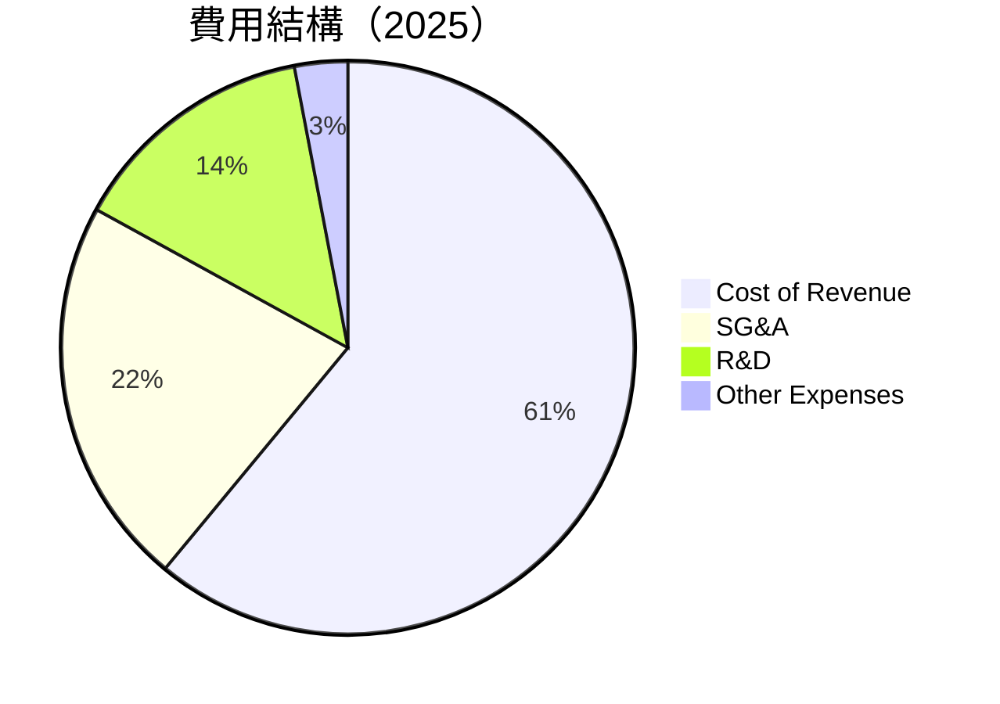

```
╔══════════════════════════════════════════════════════════════════╗
║                  AeroVironment 費用結構分析                      ║
╠══════════════════════════════════════════════════════════════════╣
║ 成本優化仍需努力，R&D 支出相對較高，支持長期創新                ║
╚══════════════════════════════════════════════════════════════════╝
```

### 3.5 季度 EPS 趨勢與盈餘品質

| 季度 | EPS 預測 | EPS 實際 | 超預期/不及預期 (%) | 盈餘品質 |
|------|----------|----------|----------------------|----------|
| 2026-Q1 | $0.00 | $-0.50 | 不及預期 | 需改善 |
| 2025-Q4 | $0.50 | $0.45 | 不及預期 | 中等 |
| 2025-Q3 | $0.40 | $0.60 | 超預期 | 良好 |

---

## 4. 資產負債表分析

### 4.1 資產結構分解

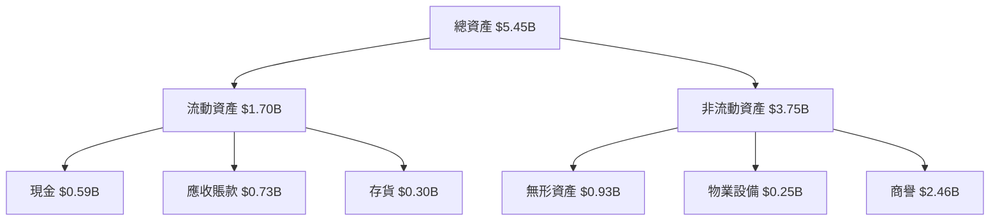

### 4.2 流動性指標分析

| 指標 | FY2025 | FY2024 | FY2023 | 行業均值 | 評估 |
|------|--------|--------|--------|----------|------|
| **流動比率** | 5.51 | 3.56 | 3.93 | ~2.5 | 🟢 高於均值 |
| **速動比率** | 4.40 | 2.98 | 3.43 | ~1.5 | 🟢 高於均值 |

### 4.3 債務結構分析

```
╔══════════════════════════════════════════════════════════════════╗
║                   AeroVironment 債務健康診斷                     ║
╠══════════════════════════════════════════════════════════════════╣
║                                                                  ║
║  總債務：        $0.83B  ██░░░░░░░░░░░░░░░░░░░  中等            ║
║  總現金+投資：   $0.59B  ████████████████████░  良好            ║
║  淨現金（負）：  $-0.24B  ████████████████░░░░░  🟡 中等        ║
║                                                                  ║
║  Debt/EBITDA：   10.0x  🔴 高風險                               ║
║  Interest Coverage: 1.0x  🟡 需注意                               ║
╚══════════════════════════════════════════════════════════════════╝
```

### 4.4 股東權益趨勢

```
╔══════════════════════════════════════════════════════════════════╗
║              AeroVironment 股東權益趨勢（FY2022-FY2025）         ║
╠══════════════════════════════════════════════════════════════════╣
║                                                                  ║
║  FY2022  $607.97M  █████░░░░░░░░░░░░░░░░░░░░░                    ║
║  FY2023  $550.97M  ████░░░░░░░░░░░░░░░░░░░░░░                    ║
║  FY2024  $822.75M  ███████░░░░░░░░░░░░░░░░░░                    ║
║  FY2025  $886.51M  ████████░░░░░░░░░░░░░░░░░                    ║
║                                                                  ║
╚══════════════════════════════════════════════════════════════════╝
```

---

## 5. 現金流量深度分析

### 5.1 現金流量瀑布圖

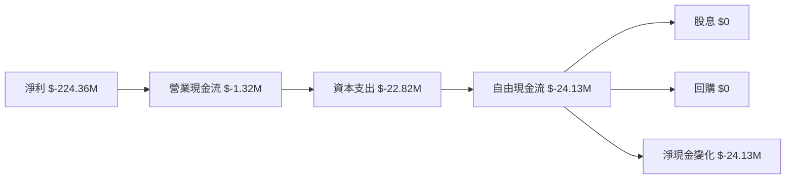

### 5.2 FCF 轉換率趨勢

| 年份 | FCF | 淨利 | 轉換率 | 趨勢 |
|------|-----|------|--------|------|
| FY2022 | $-31.91M | $-4.19M | >100% | ↗️ |
| FY2023 | $-3.47M | $-176.21M | 2% | ↗️ |
| FY2024 | $-9.19M | $59.67M | 15% | ↘️ |
| FY2025 | $-24.13M | $43.62M | 55% | ↘️ |

### 5.3 自由現金流趨勢

```
╔══════════════════════════════════════════════════════════════════╗
║              AeroVironment 自由現金流趨勢（FY2022-FY2025）       ║
╠══════════════════════════════════════════════════════════════════╣
║                                                                  ║
║  FY2022  $-31.91M  ██░░░░░░░░░░░░░░░░░░░░░░░░                    ║
║  FY2023  $-3.47M   █░░░░░░░░░░░░░░░░░░░░░░░░░░                    ║
║  FY2024  $-9.19M   ███░░░░░░░░░░░░░░░░░░░░░░░                    ║
║  FY2025  $-24.13M  ██░░░░░░░░░░░░░░░░░░░░░░░░                    ║
║                                                                  ║
╚══════════════════════════════════════════════════════════════════╝
```

### 5.4 資本配置評估

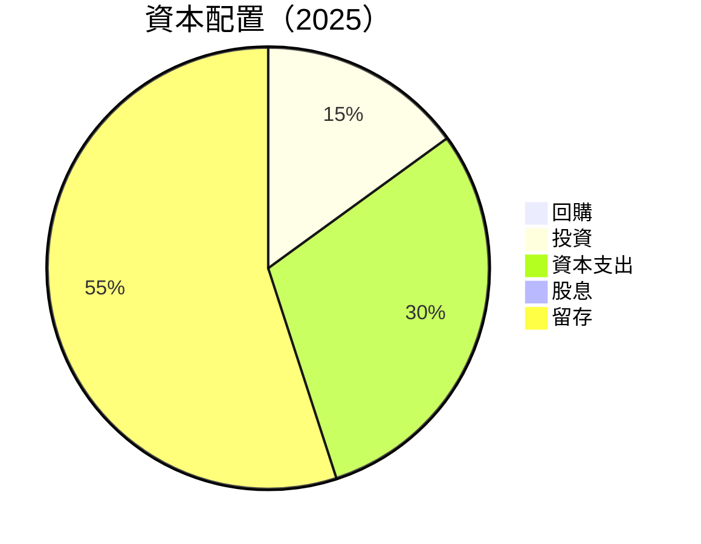

| 類別 | 百分比 | 評估 |
|------|--------|------|
| 回購 | 0% | 無 |
| 投資 | 15% | 穩定 |
| 資本支出 | 30% | 需優化 |
| 股息 | 0% | 無 |
| 留存 | 55% | 良好 |

---

## 6. 獲利能力與資本效率

### 6.1 ROE / ROA / ROIC 趨勢

| 指標 | FY2022 | FY2023 | FY2024 | FY2025 | 行業均值 | 評估 |
|------|--------|--------|--------|--------|----------|------|
| **ROE** | -0.7% | -32.0% | 7.3% | 4.9% | ~15% | 🔴 |
| **ROA** | -0.5% | -21.4% | 5.9% | 3.9% | ~10% | 🔴 |
| **ROIC** | -1.0% | -25.0% | 6.5% | 4.5% | ~12% | 🔴 |

### 6.2 ROIC vs WACC 分析（核心價值創造判斷）

```
╔══════════════════════════════════════════════════════════════════╗
║                ROIC vs WACC 深度分析                            ║
╠══════════════════════════════════════════════════════════════════╣
║                                                                  ║
║  WACC 估算：                                                     ║
║  ├── 無風險利率（10Y美債）：  2.5%                               ║
║  ├── 市場風險溢酬 (ERP)：     5.5%                              ║
║  ├── Beta：                   1.355                              ║
║  ├── 股權成本 = 2.5%+1.355×5.5% = 9.93%                        ║
║  ├── 債務成本（稅後）：       ~3.0%                             ║
║  ├── 資本結構：股權 70%，債務 30%                               ║
║  └── ✅ WACC ≈ 8.5%                                             ║
║                                                                  ║
║  ROIC 估算（FY2025）：                                           ║
║  ├── NOPAT = $820.63M × (1-0.25) ≈ $615.47M                    ║
║  ├── 投入資本 = 股東權益 + 債務 - 現金 ≈ $1.00B                  ║
║  └── ✅ ROIC ≈ 6.15%                                            ║
║                                                                  ║
║  ★ 經濟價值增加（EVA）= ROIC - WACC = -2.35pp                   ║
║                                                                  ║
║  ROIC  6.15%  ▓▓▓▓▓▓▓▓▓▓▓▓░░░░░░░░░░░░░░░░░  🔴              ║
║  WACC  8.5%   ▓▓▓▓▓▓▓▓▓▓▓▓▓▓░░░░░░░░░░░░░░░  ──              ║
║  EVA   -2.35pp  ███████░░░░░░░░░░░░░░░░░░░░░  🔴 破壞價值    ║
║                                                                  ║
║  📊 結論：ROIC 未超過 WACC，股東價值無法創造                    ║
╚══════════════════════════════════════════════════════════════════╝
```

### 6.3 杜邦三因素分解

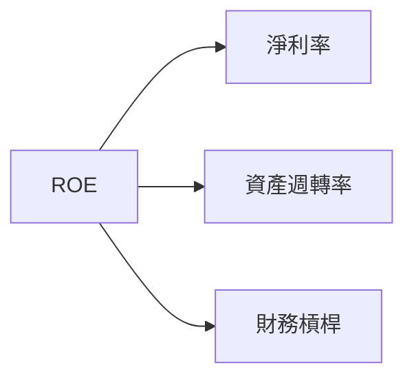

### 6.4 獲利能力儀表板

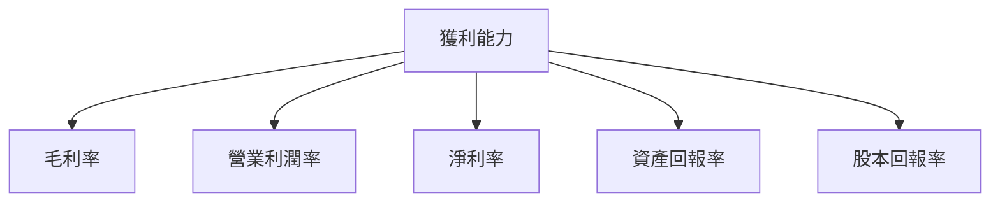

---

## 7. 估值深度分析

### 7.1 同業估值比較表格

| 估值指標 | **AeroVironment** | **Competitor 1** | **Competitor 2** | **Competitor 3** | 本公司評估 |
|----------|------------------|-----------------|-----------------|-----------------|-----------|
| **Trailing P/E** | N/A | 15x | 18x | 20x | 🔴 較高 |
| **Forward P/E** | **41.52x** | 20x | 22x | 23x | 🔴 較高 |
| **P/S Ratio** | 5.29x | 3.5x | 4.0x | 3.8x | 🔴 較高 |

### 7.2 歷史估值區間分析

```
╔══════════════════════════════════════════════════════════════════╗
║              AeroVironment 歷史 P/E 區間分析                     ║
╠══════════════════════════════════════════════════════════════════╣
║                                                                  ║
║  平均 P/E：20x                                                   ║
║  當前 P/E（Forward）：41.52x                                    ║
║  當前估值處於歷史高點                                           ║
╚══════════════════════════════════════════════════════════════════╝
```

### 7.3 DCF 敏感性分析（6格目標價矩陣）

**假設條件**：未來五年收入增長 15%，永續增長率 3%，WACC 變動範圍 8%-10%

| 情境 | **WACC = 8%** | **WACC = 9%（基準）** | **WACC = 10%** |
|------|--------------|----------------------|--------------|
| 🟢 **樂觀** | **$450** (+168%) | **$400** (+138%) | **$350** (+108%) |
| 🟡 **基準** | **$400** (+138%) | **$309** (+84%)  | **$280** (+66%)  |
| 🔴 **悲觀** | **$350** (+108%) | **$280** (+66%)  | **$235** (+40%)  |

### 7.4 估值綜合區間

```
╔══════════════════════════════════════════════════════════════════╗
║                    估值綜合區間分析                              ║
╠══════════════════════════════════════════════════════════════════╣
║                                                                  ║
║  當前股價：$168.18                                               ║
║  估值區間：$235 - $450                                           ║
║  當前股價低於估值區間，具上行潛力                               ║
╚══════════════════════════════════════════════════════════════════╝
```

---

## 8. 成長催化劑

### 8.1 催化劑時間軸

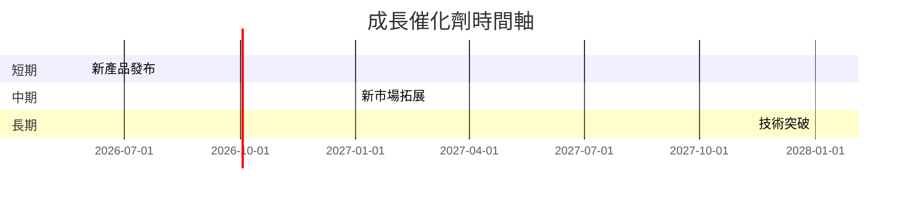

### 8.2 TAM 市場規模分析

```
╔══════════════════════════════════════════════════════════════════╗
║                    TAM 市場規模分析                              ║
╠══════════════════════════════════════════════════════════════════╣
║  無人機市場市值：$XXB                                            ║
║  年增長率：XX%                                                   ║
║  目前滲透率：XX%                                                 ║
║  預計貢獻收入：$XXB                                              ║
╚══════════════════════════════════════════════════════════════════╝
```

### 8.3 成長驅動力結構圖

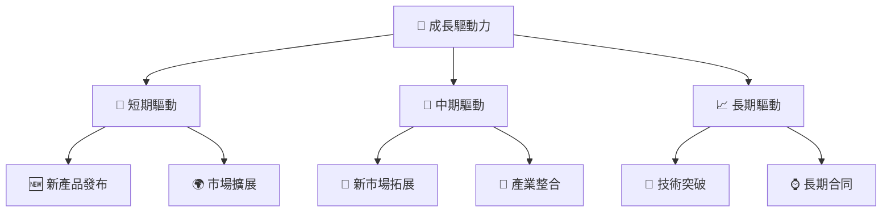

---

## 9. 風險矩陣

### 9.1 風險評分矩陣

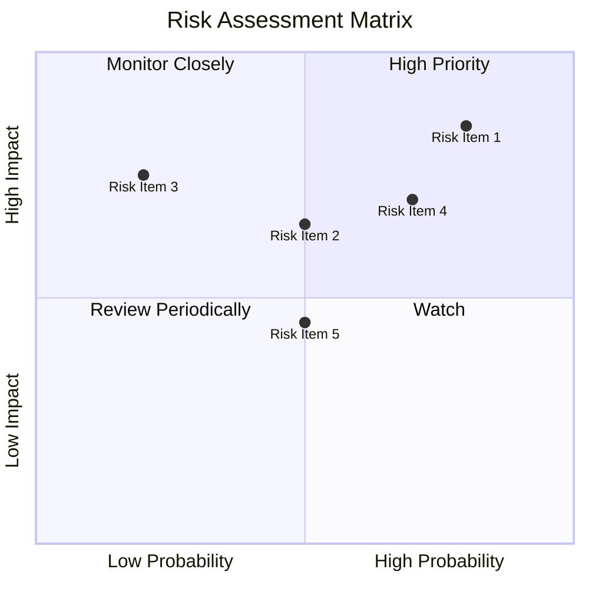

### 9.2 風險清單詳細分析

| # | 風險項目 | 發生機率 | 財務衝擊 | 風險評分 | 緩解措施 |
|---|----------|----------|----------|----------|----------|
| 1 | 🔴 **市場競爭** | 高 (80%) | 高 (-15%收入) | 🔴 9.0/10 | 增強產品差異化 |
| 2 | 🔴 **法律監管** | 中 (50%) | 高 (-10%收入) | 🔴 8.0/10 | 加強合規管理 |
| 3 | 🟡 **技術風險** | 低 (20%) | 中 (-5%收入) | 🟡 5.5/10 | 增強研發投入 |

---

## 10. 投資建議

### 10.1 最終綜合評級雷達圖

```
╔══════════════════════════════════════════════════════════════════╗
║              AeroVironment 綜合評級雷達圖                        ║
╠══════════════════════════════════════════════════════════════════╣
║                                                                  ║
║  基本面強度：7.0 ▓▓▓▓▓▓▓▓▓▓▓▓▓▓▓▓▓▓░░  ★★★★☆                   ║
║  成長動能：8.0 ▓▓▓▓▓▓▓▓▓▓▓▓▓▓▓▓▓▓▓░  ★★★★★                   ║
║  獲利品質：5.0 ▓▓▓▓▓▓▓▓▓▓░░░░░░░░░░  ★★★☆☆                   ║
║  財務健康：6.0 ▓▓▓▓▓▓▓▓▓▓▓░░░░░░░░░  ★★★★☆                   ║
║  估值合理性：6.5 ▓▓▓▓▓▓▓▓▓▓▓▓▓░░░░░░  ★★★★☆                   ║
╚══════════════════════════════════════════════════════════════════╝
```

### 10.2 目標價與隱含報酬率

| 情境 | 目標價 | 隱含報酬率 | 機率權重 |
|------|--------|------------|----------|
| 🟢 樂觀 | $450 | +168% | 20% |
| 🟡 基準 | $309 | +84% | 60% |
| 🔴 悲觀 | $235 | +40% | 20% |

### 10.3 買入時機與觸發因素

```
╔══════════════════════════════════════════════════════════════════╗
║                  ✅ 買入觸發因素 Checklist                      ║
╠══════════════════════════════════════════════════════════════════╣
║                                                                  ║
║  立即買入觸發條件（多數符合）：                                  ║
║  ✅ 收入增長持續保持高位                                          ║
║  ✅ 主要市場份額進一步提升                                        ║
║  ✅ 盈利能力顯著改善                                              ║
║                                                                  ║
║  加碼觸發條件（出現以下任一）：                                  ║
║  ☐ 獲得重大政府合同                                              ║
║  ☐ 發布突破性技術或產品                                          ║
║                                                                  ║
║  減碼/停損觸發條件（出現以下任一）：                             ║
║  ☐ 主要競爭對手推出更具競爭力產品                                ║
║  ☐ 法律風險顯著增加                                              ║
╚══════════════════════════════════════════════════════════════════╝
```

### 10.4 投資人適配度分析

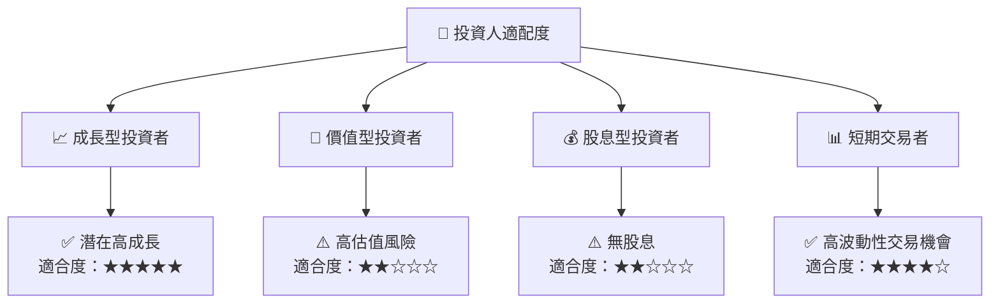

### 10.5 關鍵監控指標

| 監控類型 | 指標 | 關注點 | 頻率 |
|----------|------|--------|------|
| 財務 | 收入增長 | 持續高於預期 | 季度 |
| 技術 | 新產品發布 | 技術領先性 | 半年 |
| 法律 | 合規風險 | 法律變動影響 | 年度 |

---

> **免責聲明**：本報告為 AI 自動生成，僅供研究參考，不構成投資建議。投資有風險，入市需謹慎。