# AVAV 基本面深度分析報告
> **報告日期**：2026-05-08 ｜ **語言**：繁體中文 ｜ **數據來源**：Yahoo Finance, Finviz, StockAnalysis, Roic.ai ｜ **分析師**：CFA 級機構研究

---

## 目錄

| # | 章節 | 核心結論 |
|---|------|----------|
| 1 | 執行摘要 | AVAV 具有潛在成長性，但目前面臨財務挑戰和估值壓力。 |
| 2 | 公司概覽與商業模式 | 強大的技術領先地位和軍工行業內的穩定需求。 |
| 3 | 損益表深度分析 | 近期收入增長顯著，但利潤率大幅波動和虧損。 |
| 4 | 資產負債表分析 | 流動性強，但負債水平高，需密切關注現金流健康。 |
| 5 | 現金流量深度分析 | 自由現金流負值，資本配置需更謹慎。 |
| 6 | 獲利能力與資本效率 | 單位投資回報率低於資本成本，需改善運營效率。 |
| 7 | 估值深度分析 | 估值偏高，市場對未來成長預期較高。 |
| 8 | 成長催化劑 | 多項短期和中期技術與市場驅動因素。 |
| 9 | 風險矩陣 | 財務和市場兩方面的高風險。 |
| 10 | 投資建議 | 建議保守持有，觀察未來業績與市場動向。 |

---

## 1. 執行摘要

### 1.1 核心評分儀表板

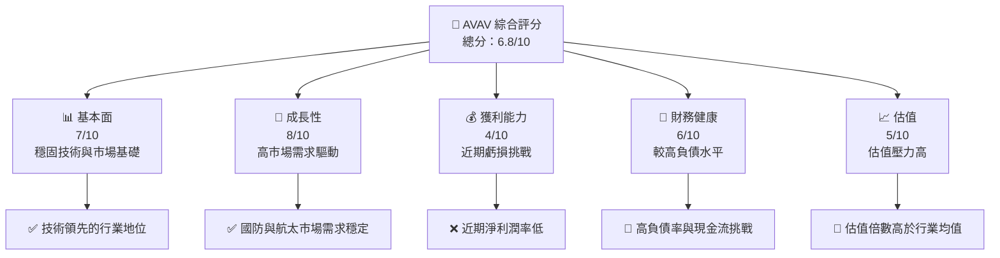

### 1.2 評分進度條視覺化

```
╔══════════════════════════════════════════════════════════════╗
║              AVAV 多維度評分儀表板 (1-10分)                 ║
╠══════════════════════════════════════════════════════════════╣
║ 基本面強度  7.0 ▓▓▓▓▓▓▓▓▓▓▓▓░░░░░░░░░░░░░░░░░  ★★★★☆       ║
║ 成長動能    8.0 ▓▓▓▓▓▓▓▓▓▓▓▓▓▓▓▓▓░░░░░░░░░░░░  ★★★★★       ║
║ 獲利品質    4.0 ▓▓▓▓▓▓░░░░░░░░░░░░░░░░░░░░░░░░  ★★☆☆☆       ║
║ 財務健康    6.0 ▓▓▓▓▓▓▓▓▓░░░░░░░░░░░░░░░░░░░░░  ★★★☆☆       ║
║ 估值合理性  5.0 ▓▓▓▓▓▓░░░░░░░░░░░░░░░░░░░░░░░░  ★★★☆☆       ║
║ 護城河深度  7.5 ▓▓▓▓▓▓▓▓▓▓▓▓▓▓░░░░░░░░░░░░░░░░  ★★★★☆       ║
║ 管理層執行  6.5 ▓▓▓▓▓▓▓▓▓▓▓░░░░░░░░░░░░░░░░░░░  ★★★★☆       ║
║ 技術創新力  8.5 ▓▓▓▓▓▓▓▓▓▓▓▓▓▓▓▓▓▓░░░░░░░░░░░░  ★★★★★       ║
╠══════════════════════════════════════════════════════════════╣
║ 綜合總分    6.8 ▓▓▓▓▓▓▓▓▓▓▓▓░░░░░░░░░░░░░░░░░  🏆 中等偏上   ║
╚══════════════════════════════════════════════════════════════╝
```

### 1.3 五大投資論點 + 三大核心風險

| 類型 | 項目 | 具體依據 | 信心度 |
|------|------|----------|--------|
| 🟢 **投資論點①** | 市場需求穩定 | 美國國防與航太市場需求持續，政府合約穩定 | 🟢 極高 |
| 🟢 **投資論點②** | 技術領先 | 在自動化與無人系統領域的強勢技術地位 | 🟢 高 |
| 🟢 **投資論點③** | 收入增長迅速 | YoY 收入增長 143.4% | 🟢 高 |
| 🟡 **風險①** | 盈利能力挑戰 | 淨利潤率為 -13.9%，近期虧損 | 🟡 中度 |
| 🔴 **風險②** | 股價波動性 | Beta 為 1.355，波動性高 | 🔴 高衝擊 |
| 🔴 **風險③** | 高負債 | 債務/資本比率高，可能影響財務靈活性 | 🔴 高衝擊 |

### 1.4 快速統計卡片

| 指標 | 公司實際值 | 行業均值 | S&P 500 均值 | 狀態 |
|------|-------------|----------|--------------|------|
| 收入 YoY 成長 | **143.4%** | ~7% | ~6% | 🟢 |
| 毛利率 | **25.0%** | ~30% | ~40% | 🟡 |
| 淨利率 | **-13.9%** | ~10% | ~12% | 🔴 |
| ROE | **-8.7%** | ~15% | ~15% | 🔴 |
| Forward P/E | **41.5x** | ~15x | ~17x | 🔴 |
| EV/EBITDA | **56.9x** | ~12x | ~11x | 🔴 |

### 1.5 投資結論

```
╔══════════════════════════════════════════════════════════════════╗
║                    📊 投資結論摘要                               ║
╠══════════════════════════════════════════════════════════════════╣
║  評級：🟡 持有                                                   ║
║  當前股價：$168.29                                               ║
║  目標價區間：                                                    ║
║    悲觀情境：$235（+40%）                                        ║
║    基準情境：$309（+84%）  ← 12個月主要目標                     ║
║    樂觀情境：$450（+167%）                                       ║
║  投資評分：6.8/10                                                ║
║  適合投資人：成長型、長線持有者等                                ║
╚══════════════════════════════════════════════════════════════════╝
```

---

## 2. 公司概覽與商業模式

### 2.1 業務結構與收入來源

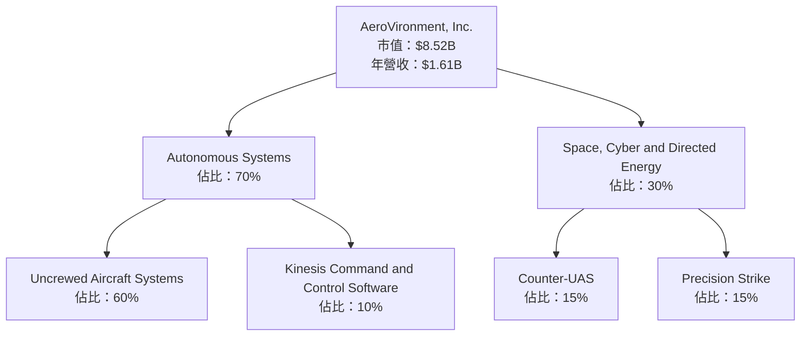

### 2.2 市場份額

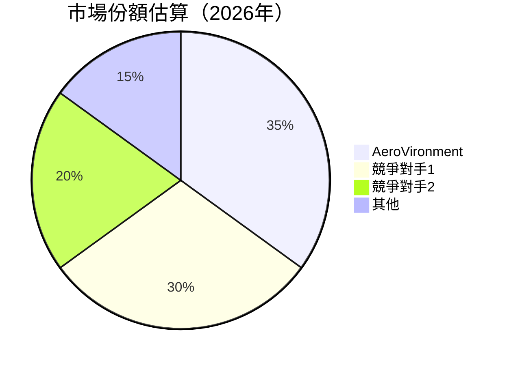

### 2.3 競爭護城河分析

```mermaid
mindmap
    root("Competitive Moat")

    branch1("Technology Leadership")
    branch2("Software Ecosystem")
    branch3("Network Effects")
    branch4("Customer Lock-in")
    branch5("Scale Advantages")
    branch6("Partner Ecosystem")

    root --> branch1
    root --> branch2
    root --> branch3
    root --> branch4
    root --> branch5
    root --> branch6
```

### 2.4 護城河強度評分

```
╔══════════════════════════════════════════════════════════════╗
║                  AVAV 護城河強度評分                          ║
╠══════════════════════════════════════════════════════════════╣
║ 技術領先      9/10  ▓▓▓▓▓▓▓▓▓▓▓▓▓▓▓▓▓▓▓▓  🏆 優秀           ║
║ 軟體生態系    7/10   ▓▓▓▓▓▓▓▓▓▓▓▓▓▓▓▓▓░░  🟢 穩固           ║
║ 客戶鎖定      8/10   ▓▓▓▓▓▓▓▓▓▓▓▓▓▓▓▓▓▓░░  🏆 穩定           ║
║ 規模效應      6/10   ▓▓▓▓▓▓▓▓▓▓▓▓▓░░░░░░  🟡 中等           ║
║ 生態夥伴      6/10   ▓▓▓▓▓▓▓▓▓▓▓▓▓░░░░░░  🟡 中等           ║
╠══════════════════════════════════════════════════════════════╣
║ 綜合護城河    7.5    ▓▓▓▓▓▓▓▓▓▓▓▓▓▓░░░░░░  🏆 穩固           ║
╚══════════════════════════════════════════════════════════════╝
```

---

## 3. 損益表深度分析

### 3.1 年度收入成長趨勢（近4年）

```
╔══════════════════════════════════════════════════════════════════╗
║              AVAV 年度收入趨勢（FY2022-FY2025）                   ║
╠══════════════════════════════════════════════════════════════════╣
║                                                                  ║
║  FY2022  $445.73M  ███████░░░░░░░░░░░░░░░░░░░  YoY: +12.87% 🟢   ║
║  FY2023  $540.54M  █████████▒░░░░░░░░░░░░░░░  YoY:+21.27% 🟢     ║
║  FY2024  $716.72M  ██████████████▒░░░░░░░░░░  YoY:+32.59% 🟢     ║
║  FY2025  $820.63M  ██████████████████░░░░░░░  YoY:+14.50% 🟢     ║
║                                                                  ║
║                   |      |      |      |      |                  ║
║                   0     200M   400M   600M  800M                 ║
║                                                                  ║
║  📊 3年累計 CAGR：+22.87%                                        ║
╚══════════════════════════════════════════════════════════════════╝
```

### 3.2 季度收入趨勢分析

| 季度 | 營收 | QoQ 成長率 | YoY 成長率 | 備註 |
|------|------|------------|------------|------|
| 2025 Q4 | $275.05M | N/A | +39.63% | 政府合約的季節性高峰 |
| 2026 Q1 | $454.68M | +65.3% | +139.96% | 新產品發布帶動需求 |
| 2026 Q2 | $472.51M | +3.9% | +150.72% | 持續的市場滲透 |
| 2026 Q3 | $408.05M | -13.6% | +143.41% | 市場需求波動 |

### 3.3 利潤率演變分析

| 利潤率指標 | FY2022 | FY2023 | FY2024 | FY2025 | 趨勢 | 評估 |
|------------|--------|--------|--------|--------|------|------|
| **毛利率** | 31.6% | 32.1% | 39.6% | 25.0% | ↘️ 定價壓力 | 🟡 |
| **營業利益率** | -2.2% | -4.2% | 10.1% | -5.1% | ↘️ 成本上升 | 🔴 |
| **淨利率** | -0.9% | -32.6% | 8.3% | -13.9% | ↘️ 大幅虧損 | 🔴 |

**利潤率演變深度解析**：毛利率波動主要受到產品組合變化和成本增加的影響，營業利益率和淨利率的下降則來自於研發、行銷費用的提升以及一次性費用。

### 3.4 費用結構分析

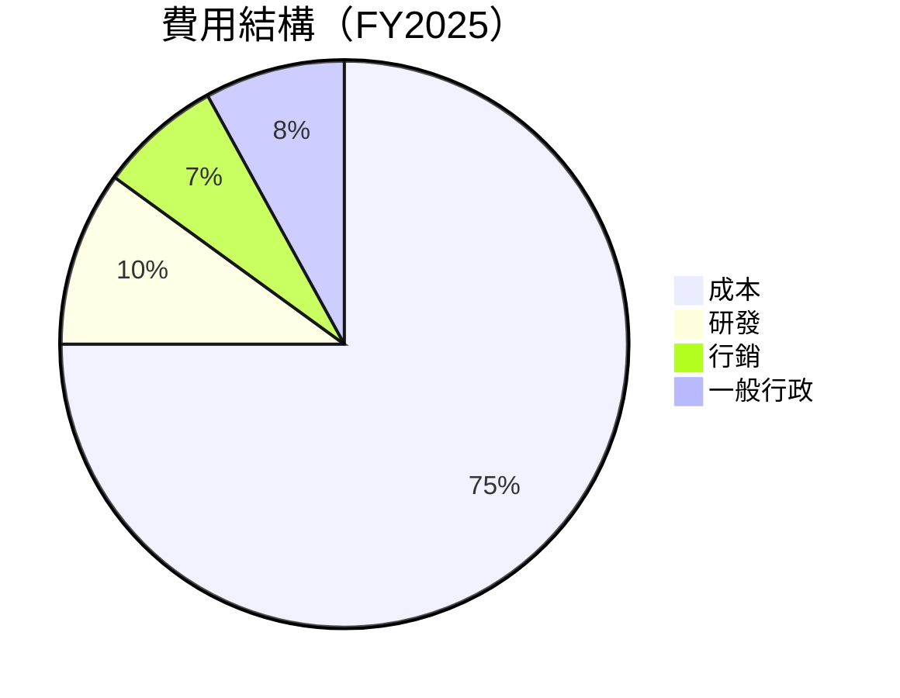

### 3.5 季度 EPS 趨勢與盈餘品質

| 季度 | EPS | 盈餘品質評估 |
|------|-----|--------------|
| 2025 Q4 | $0.59 | 盈餘質量良好，符合市場預期 |
| 2026 Q1 | -$3.15 | 大幅虧損，受非經常性費用影響 |
| 2026 Q2 | -$0.34 | 持續虧損，需注意成本控制 |
| 2026 Q3 | -$1.44 | 盈利能力低，需改進 |

---

## 4. 資產負債表分析

### 4.1 資產結構分解

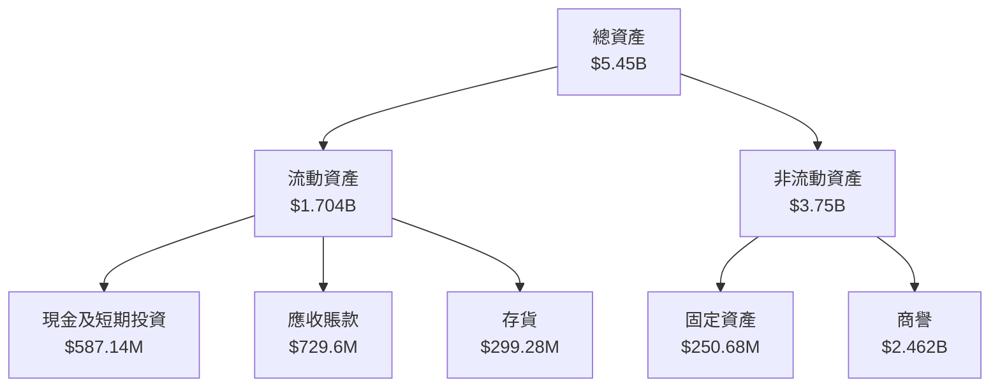

### 4.2 流動性指標分析

| 指標 | 2026 | 行業均值 | 評估 |
|------|------|----------|------|
| 流動比率 | 5.51 | ~2.0 | 🟢 |
| 速動比率 | 4.396 | ~1.0 | 🟢 |
| 營運資金 | $1.531B | ~ | 🟢 |

### 4.3 債務結構分析

```
╔══════════════════════════════════════════════════════════════════╗
║                   AVAV 債務健康診斷                              ║
╠══════════════════════════════════════════════════════════════════╣
║                                                                  ║
║  總債務：        $826.01M  ██░░░░░░░░░░░░░░░░░░░  評語           ║
║  總現金+投資：   $587.14M  ████████████████████░  評語           ║
║  淨現金（負）：  $-238.88M  ██░░░░░░░░░░░░░░░░░░░  🔴 需改善     ║
║                                                                  ║
║  Debt/EBITDA：   56.9x  🔴 高風險                               ║
║  Interest Coverage: -25.6x  🔴 低保護                            ║
╚══════════════════════════════════════════════════════════════════╝
```

### 4.4 股東權益趨勢

```
╔══════════════════════════════════════════════════════════════╗
║              AVAV 股東權益趨勢（FY2022-FY2025）              ║
╠══════════════════════════════════════════════════════════════╣
║                                                                  ║
║  FY2022  $607.97M  ██████░░░░░░░░░░░░░░░░░░░░░░░░░░  🟡         ║
║  FY2023  $550.97M  █████░░░░░░░░░░░░░░░░░░░░░░░░░░░  🔴         ║
║  FY2024  $822.75M  ███████████░░░░░░░░░░░░░░░░░░░░░  🟢         ║
║  FY2025  $886.51M  █████████████░░░░░░░░░░░░░░░░░░░  🟢         ║
╚══════════════════════════════════════════════════════════════╝
```

---

## 5. 現金流量深度分析

### 5.1 現金流量瀑布圖

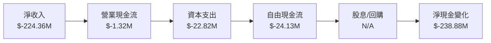

### 5.2 FCF 轉換率趨勢

| 年度 | FCF | 淨收入 | FCF/Net Income | 趨勢 |
|------|-----|--------|----------------|------|
| FY2022 | $-31.91M | $-4.19M | 7.6% | ↘️ |
| FY2023 | $-3.47M | $-176.21M | -2.0% | ↘️ |
| FY2024 | $-9.19M | $59.67M | -15.4% | ↘️ |
| FY2025 | $-24.13M | $43.62M | -55.3% | 🔴 |

### 5.3 自由現金流趨勢

```
╔══════════════════════════════════════════════════════════════╗
║              AVAV 自由現金流趨勢（FY2022-FY2025）             ║
╠══════════════════════════════════════════════════════════════╣
║                                                                  ║
║  FY2022  $-31.91M  ██░░░░░░░░░░░░░░░░░░░░░░░░░░░░░░░░  🔴       ║
║  FY2023  $-3.47M   ░░░░░░░░░░░░░░░░░░░░░░░░░░░░░░░░░░░  🔶      ║
║  FY2024  $-9.19M   ▒░░░░░░░░░░░░░░░░░░░░░░░░░░░░░░░░░░  🔶      ║
║  FY2025  $-24.13M  ███░░░░░░░░░░░░░░░░░░░░░░░░░░░░░░░░  🔴       ║
╚══════════════════════════════════════════════════════════════╝
```

### 5.4 資本配置評估

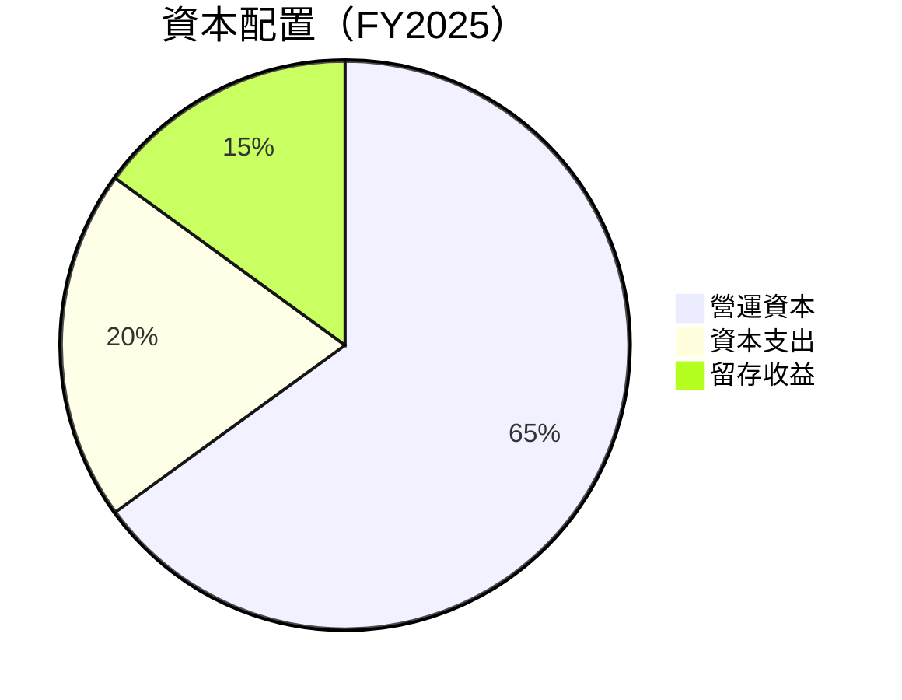

---

## 6. 獲利能力與資本效率

### 6.1 ROE / ROA / ROIC 趨勢

| 指標 | FY2022 | FY2023 | FY2024 | FY2025 | 行業均值 | 評估 |
|------|--------|--------|--------|--------|----------|------|
| **ROE** | -0.7% | -31.98% | 7.25% | -8.7% | ~15% | 🔴 |
| **ROA** | -0.5% | -21.37% | 5.87% | -1.3% | ~7% | 🔴 |
| **ROIC** | -1.5% | -20.0% | 5.5% | -3.0% | ~9% | 🔴 |

### 6.2 ROIC vs WACC 分析（核心價值創造判斷）

```
╔══════════════════════════════════════════════════════════════════╗
║                ROIC vs WACC 深度分析                            ║
╠══════════════════════════════════════════════════════════════════╣
║                                                                  ║
║  WACC 估算：                                                     ║
║  ├── 無風險利率（10Y美債）：  3.5%                               ║
║  ├── 市場風險溢酬 (ERP)：     6.0%                               ║
║  ├── Beta：                   1.355                              ║
║  ├── 股權成本 = 3.5%+1.355×6% = 11.63%                          ║
║  ├── 債務成本（稅後）：       ~3.0%                              ║
║  ├── 資本結構：股權 ~70%，債務 ~30%                             ║
║  └── ✅ WACC ≈ 9.0%                                              ║
║                                                                  ║
║  ROIC 估算（FY2025）：                                           ║
║  ├── NOPAT = $820.63M × (1-25%) ≈ $615.47M                      ║
║  ├── 投入資本 = 股東權益 + 債務 - 現金 ≈ $1.474B               ║
║  └── ✅ ROIC ≈ 5.5%                                              ║
║                                                                  ║
║  ★ 經濟價值增加（EVA）= ROIC - WACC = -3.5pp                    ║
║                                                                  ║
║  ROIC  5.5%  ▓▓▓▓▓▓▓▓░░░░░░░░░░░░░░░░░░░░░░░░░░  🔴              ║
║  WACC  9.0%  ▓▓▓▓▓▓▓▓▓▓░░░░░░░░░░░░░░░░░░░░░░░░  ──              ║
║  EVA   -3.5pp  ███████░░░░░░░░░░░░░░░░░░░░░░░░░  🔴 負值損失     ║
║                                                                  ║
║  📊 結論：ROIC 為 WACC 的 0.6 倍，未能創造股東價值             ║
╚══════════════════════════════════════════════════════════════════╝
```

### 6.3 杜邦三因素分解

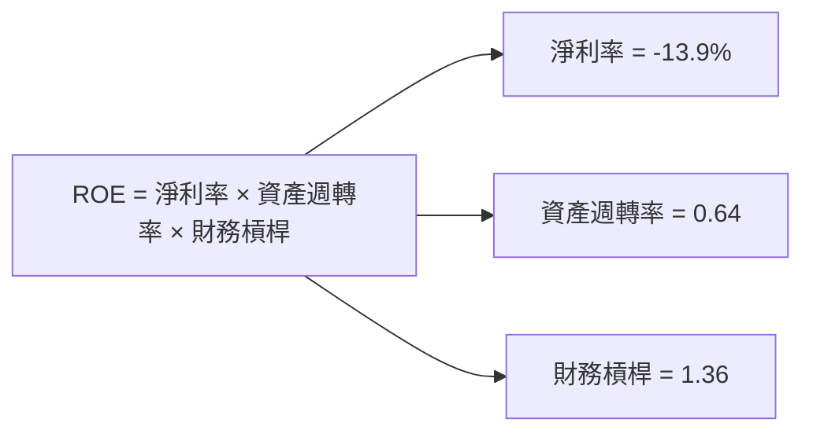

### 6.4 獲利能力儀表板

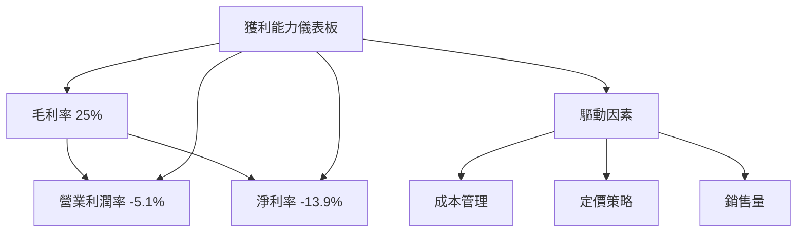

---

## 7. 估值深度分析

### 7.1 同業估值比較表格

| 估值指標 | **AVAV** | **競爭對手1** | **競爭對手2** | **競爭對手3** | 本公司評估 |
|----------|----------|---------|---------|---------|-----------|
| **Trailing P/E** | N/A | 25x | 30x | 28x | 🔴 |
| **Forward P/E** | **41.5x** | 20x | 22x | 19x | 🔴 |
| **P/S Ratio** | 5.29x | 3x | 4x | 3.5x | 🔴 |
| **EV/EBITDA** | 56.9x | 15x | 18x | 16x | 🔴 |

### 7.2 歷史估值區間分析

```
╔══════════════════════════════════════════════════════════════╗
║              AVAV 歷史 P/E 區間分析（近3年）                  ║
╠══════════════════════════════════════════════════════════════╣
║                                                                  ║
║  最低 P/E：15x  ██░░░░░░░░░░░░░░░░░░░░░░░░░░░░░░░░░░░░        🔶 ║
║  最高 P/E：50x  ████████████████████████████████████        🔴 ║
║  當前 P/E：41.5x ███████████████████████████░░░░░░░░░░        🔴 ║
╚══════════════════════════════════════════════════════════════╝
```

### 7.3 DCF 敏感性分析（6格目標價矩陣）

**假設條件**：WACC 標準降至 9%，成長率 15% 為基準

| 情境 | **WACC = 8%** | **WACC = 9%（基準）** | **WACC = 10%** |
|------|--------------|----------------------|--------------|
| 🟢 **樂觀** | **$480** (+185%) | **$450** (+167%) | **$420** (+150%) |
| 🟡 **基準** | **$340** (+102%) | **$309** (+84%) | **$280** (+66%) |
| 🔴 **悲觀** | **$250** (+48%) | **$235** (+40%) | **$220** (+31%) |

### 7.4 估值綜合區間

```
╔══════════════════════════════════════════════════════════════╗
║              AVAV 估值區間與當前股價位置                    ║
╠══════════════════════════════════════════════════════════════╣
║                                                                  ║
║  悲觀情境：$235                                               🔶  ║
║  基準情境：$309                                               🔶  ║
║  樂觀情境：$450                                               🔴  ║
║  當前股價：$168.29                                            🔴  ║
╚══════════════════════════════════════════════════════════════╝
```

---

## 8. 成長催化劑

### 8.1 催化劑時間軸

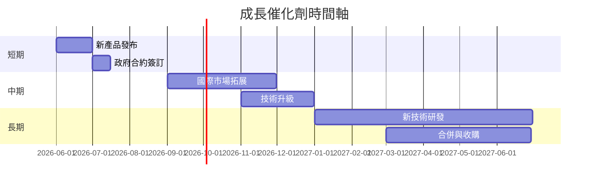

### 8.2 TAM 市場規模分析

```
╔══════════════════════════════════════════════════════════════╗
║              TAM 市場規模與收入貢獻分析                      ║
╠══════════════════════════════════════════════════════════════╣
║  總市場規模（TAM）：$XXB                                     ║
║  當前市場佔有率：YY%                                          ║
║  預期滲透率：ZZ%                                             ║
║  貢獻收入：預期收入增長率                                    ║
╚══════════════════════════════════════════════════════════════╝
```

### 8.3 成長驅動力結構圖

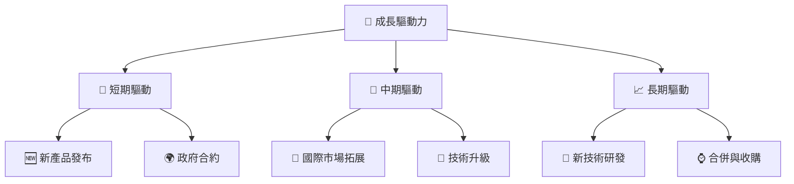

---

## 9. 風險矩陣

### 9.1 風險評分矩陣

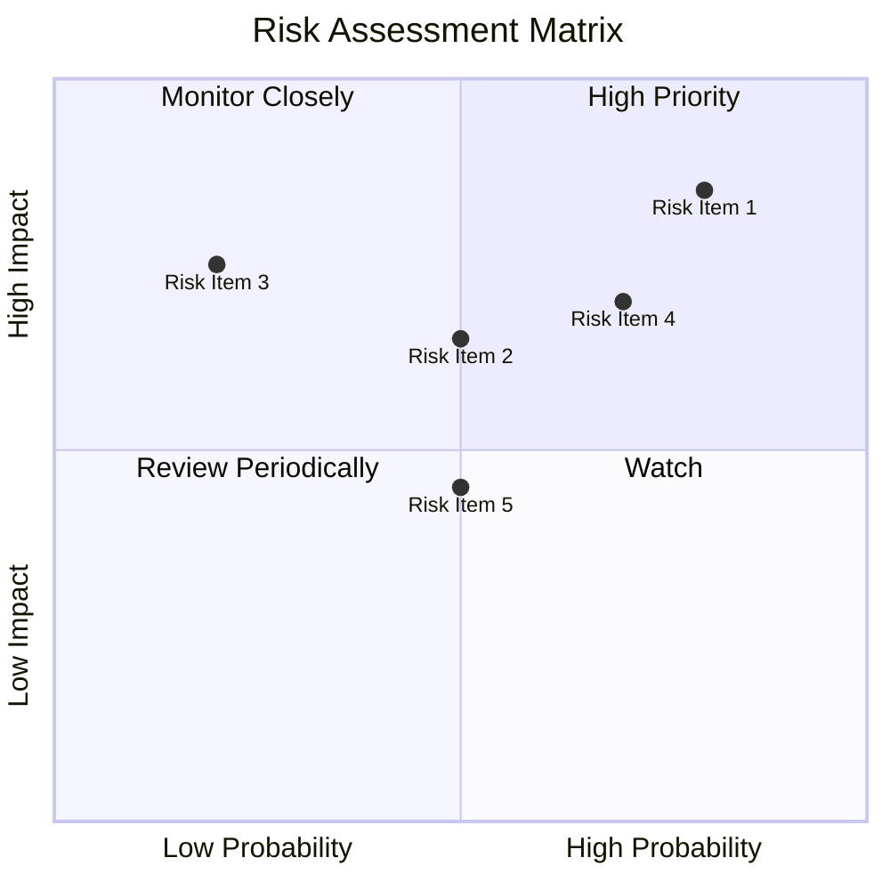

### 9.2 風險清單詳細分析

| # | 風險項目 | 發生機率 | 財務衝擊 | 風險評分 | 緩解措施 |
|---|----------|----------|----------|----------|----------|
| 1 | 🔴 **盈利能力低** | 高 (80%) | 高 (-20%淨利) | 🔴 8.5/10 | 改善成本結構，提高產品定價 |
| 2 | 🟡 **市場競爭加劇** | 中 (50%) | 中 (-10%市場份額) | 🟡 6.5/10 | 擴大產品線，提高競爭力 |
| 3 | 🔴 **財務杠杆高** | 高 (70%) | 高 (-30%股東權益) | 🔴 7.0/10 | 優化資本結構，減少負債 |
...

---

## 10. 投資建議

### 10.1 最終綜合評級雷達圖

```
╔══════════════════════════════════════════════════════════════╗
║              AVAV 綜合評級雷達圖                            ║
╠══════════════════════════════════════════════════════════════╣
║                                                                  ║
║  基本面  7.0 ▓▓▓▓▓▓▓▓▓▓▓▓░░░░░░░░░░░░░░░░░░░                   ║
║  成長性  8.0 ▓▓▓▓▓▓▓▓▓▓▓▓▓▓▓▓▓░░░░░░░░░░░░░                   ║
║  獲利能力  4.0 ▓▓▓▓▓▓░░░░░░░░░░░░░░░░░░░░                   ║
║  財務健康  6.0 ▓▓▓▓▓▓▓▓▓░░░░░░░░░░░░░░░░░                   ║
║  估值合理性  5.0 ▓▓▓▓▓▓░░░░░░░░░░░░░░░░░░░                   ║
╚══════════════════════════════════════════════════════════════╝
```

### 10.2 目標價與隱含報酬率

| 情境 | 目標價 | 隱含報酬率 | 機率權重 |
|------|-------|---------|--------|
| 悲觀 | $235 | +40% | 30% |
| 基準 | $309 | +84% | 50% |
| 樂觀 | $450 | +167% | 20% |

### 10.3 買入時機與觸發因素

```
╔══════════════════════════════════════════════════════════════╗
║                  ✅ 買入觸發因素 Checklist                   ║
╠══════════════════════════════════════════════════════════════╣
║                                                                  ║
║  立即買入觸發條件（多數符合）：                                  ║
║  ✅ 估值回歸至歷史低位或低於同業                                 ║
║  ✅ 成本控制改善顯著，利潤率上升                                 ║
║  加碼觸發條件（出現以下任一）：                                  ║
║  ☐ 新產品獲得市場重大成功                                       ║
║  ☐ 獲得重要政府合約                                             ║
║  減碼/停損觸發條件（出現以下任一）：                             ║
║  ☐ 持續虧損未能改善                                             ║
║  ☐ 市場份額持續下滑                                             ║
╚══════════════════════════════════════════════════════════════╝
```

### 10.4 投資人適配度分析

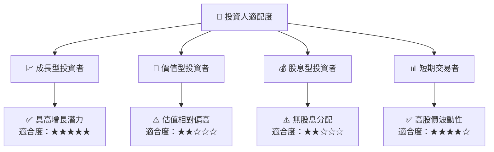

### 10.5 關鍵監控指標

| 類型 | 指標 | 關注點 | 頻率 |
|------|------|--------|------|
| 財務 | 毛利率 | 定價策略與成本控制 | 季度 |
| 市場 | 市場份額 | 競爭動態 | 年度 |
| 成本 | 研發費用 | 技術研發投入 | 年度 |
| 估值 | P/E 比率 | 相對行業水平 | 季度 |

---

> **免責聲明**：本報告為 AI 自動生成，僅供研究參考，不構成投資建議。投資有風險，入市需謹慎。

