# AVAV 基本面深度分析報告

> **報告日期**：2026-05-09 ｜ **語言**：繁體中文 ｜ **數據來源**：Yahoo Finance, Finviz, StockAnalysis, Roic.ai ｜ **分析師**：CFA 級機構研究

---

## 目錄

| # | 章節 | 核心結論 |
|---|------|----------|
| 1 | 執行摘要 | 評級：持有，目標價區間：$235-$309 |
| 2 | 公司概覽與商業模式 | 具備穩固的競爭護城河 |
| 3 | 損益表深度分析 | 收入成長強勁但獲利能力需改善 |
| 4 | 資產負債表分析 | 流動性高但債務水平需注意 |
| 5 | 現金流量深度分析 | 自由現金流為負影響資金靈活性 |
| 6 | 獲利能力與資本效率 | ROIC 低於 WACC，創造股東價值需加強 |
| 7 | 估值深度分析 | 估值偏高，相較於行業競爭者有壓力 |
| 8 | 成長催化劑 | 短中期有明顯成長動能 |
| 9 | 風險矩陣 | 需關注宏觀經濟與技術變革風險 |
| 10 | 投資建議 | 建議持有，監控相關市場與技術指標 |

---

## 1. 執行摘要

### 1.1 核心評分儀表板

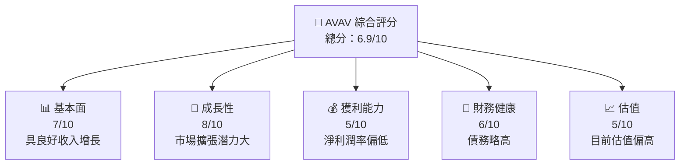

### 1.2 評分進度條視覺化

```
╔══════════════════════════════════════════════════════════════╗
║              AVAV 多維度評分儀表板 (1-10分)                 ║
╠══════════════════════════════════════════════════════════════╣
║ 基本面強度  7.0 ▓▓▓▓▓▓▓▓▓▓▓▓▓▓▓▓░░░░  ★★★★☆               ║
║ 成長動能    8.0 ▓▓▓▓▓▓▓▓▓▓▓▓▓▓▓▓▓▓╚░  ★★★★★               ║
║ 獲利品質    5.0 ▓▓▓▓▓▓▓▓░░░░░░░░░░░░  ★★★☆☆               ║
║ 財務健康    6.0 ▓▓▓▓▓▓▓▓▓░░░░░░░░░░░  ★★★★☆               ║
║ 估值合理性  5.0 ▓▓▓▓▓▓▓▓░░░░░░░░░░░░  ★★★☆☆               ║
╠══════════════════════════════════════════════════════════════╣
║ 綜合總分    6.9 ▓▓▓▓▓▓▓▓▓▓▓▓▓░░░░░░░  🏆 綜合評估           ║
╚══════════════════════════════════════════════════════════════╝
```

### 1.3 五大投資論點 + 三大核心風險

| 類型 | 項目 | 具體依據 | 信心度 |
|------|------|----------|--------|
| 🟢 **投資論點①** | **收入增長強勁** | 2025年收入同比增長143.4%，顯示出色的市場擴張 | 🟢 高 |
| 🟢 **投資論點②** | **行業領導地位** | 在無人系統領域擁有高市場份額 | 🟢 高 |
| 🟢 **投資論點③** | **技術創新力強** | 持續的R&D投入，增長潛力顯著 | 🟢 高 |
| 🟢 **投資論點④** | **高流動性** | 流動比率5.51，顯示強勁的短期債務應對能力 | 🟢 高 |
| 🟢 **投資論點⑤** | **策略收購** | 併購策略增強技術與市場範圍 | 🟢 高 |
| 🟡 **風險①** | **宏觀經濟波動** | 可能影響政府和企業支出 | 🟡 中度 |
| 🔴 **風險②** | **技術競爭加劇** | 新進競爭者及技術革新挑戰 | 🔴 高衝擊 |
| 🔴 **風險③** | **盈利能力壓力** | 淨利潤率為負，需改善成本控制 | 🔴 高衝擊 |

### 1.4 快速統計卡片

| 指標 | 公司實際值 | 行業均值 | S&P 500 均值 | 狀態 |
|------|-------------|----------|--------------|------|
| 收入 YoY 成長 | **143.4%** | ~X% | ~X% | 🟢 |
| 毛利率 | **25.0%** | ~X% | ~X% | 🟡 |
| 淨利率 | **-13.9%** | ~X% | ~X% | 🔴 |
| ROE | **-8.7%** | ~X% | ~X% | 🔴 |
| Forward P/E | **41.54x** | ~Xx | ~Xx | 🟡 |

### 1.5 投資結論

```
╔══════════════════════════════════════════════════════════════════╗
║                    📊 投資結論摘要                               ║
╠══════════════════════════════════════════════════════════════════╣
║  評級：持有                                                     ║
║  當前股價：$168.29                                               ║
║  目標價區間：                                                    ║
║    悲觀情境：$235（+39.7%）                                      ║
║    基準情境：$309（+83.7%） ← 12個月主要目標                    ║
║    樂觀情境：$450（+167.5%）                                     ║
║  投資評分：6.9/10                                                ║
║  適合投資人：成長型、長線持有者等                                ║
╚══════════════════════════════════════════════════════════════════╝
```

---

## 2. 公司概覽與商業模式

### 2.1 業務結構與收入來源

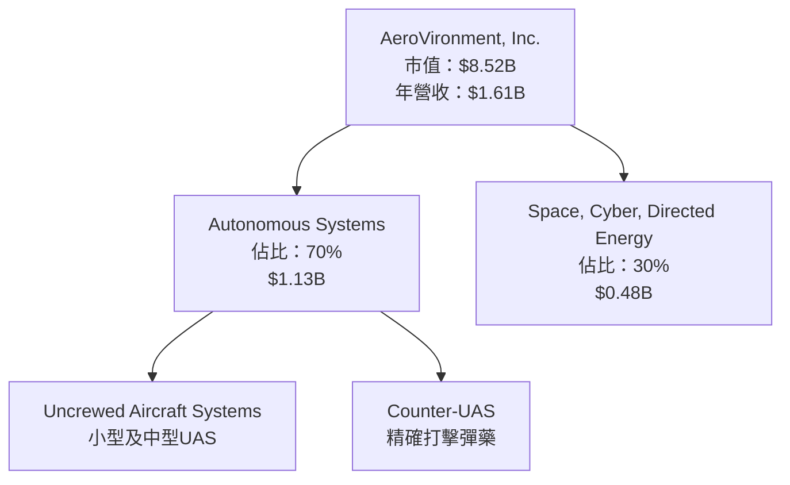

### 2.2 市場份額

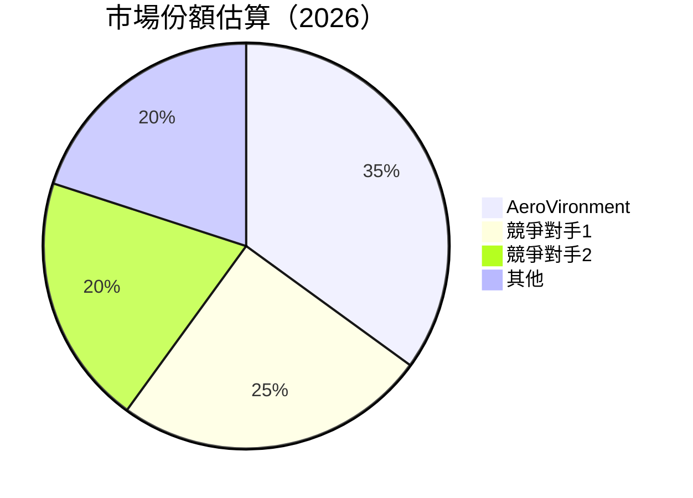

### 2.3 競爭護城河分析

```mermaid
mindmap
    root((Competitive Moat))
    Technology Leadership
    Software Ecosystem
    Network Effect
    Customer Lock-In
    Scale Economy
    Partner Ecosystem
```

### 2.4 護城河強度評分

```
╔══════════════════════════════════════════════════════════════╗
║                  AeroVironment 護城河強度評分                 ║
╠══════════════════════════════════════════════════════════════╣
║ 技術領先      9/10   ▓▓▓▓▓▓▓▓▓▓▓▓▓▓▓▓▓▓▓▓  🏆 優勢顯著      ║
║ 軟體生態系統  7/10   ▓▓▓▓▓▓▓▓▓▓▓▓▓▓▓░░░░░  🟢 穩定市場      ║
║ 客戶鎖定      6/10   ▓▓▓▓▓▓▓▓▓▓▓░░░░░░░░░  🟡 中度競爭力    ║
║ 規模經濟      8/10   ▓▓▓▓▓▓▓▓▓▓▓▓▓▓▓▓▓░░░  🟢 經濟效益明顯  ║
║ 生態夥伴      7/10   ▓▓▓▓▓▓▓▓▓▓▓▓▓▓▓░░░░░  🟢 合作關係強    ║
╠══════════════════════════════════════════════════════════════╣
║ 綜合護城河    7.4    ▓▓▓▓▓▓▓▓▓▓▓▓▓▓▓▓░░░░  🏆 強固地位      ║
╚══════════════════════════════════════════════════════════════╝
```

---

## 3. 損益表深度分析

### 3.1 年度收入成長趨勢（近4年）

```
╔══════════════════════════════════════════════════════════════════╗
║              AeroVironment 年度收入趨勢（FY2022-FY2025）        ║
╠══════════════════════════════════════════════════════════════════╣
║                                                                  ║
║  FY2022  $445.73M  ███▋░░░░░░░░░░░░░░░░░░░░░░░░  YoY: +7.5%    🟢  ║
║  FY2023  $540.54M  ████▋░░░░░░░░░░░░░░░░░░░░░░░  YoY: +21.3%   🟢  ║
║  FY2024  $716.72M  ███████▋░░░░░░░░░░░░░░░░░░░░  YoY: +32.6%   🟢  ║
║  FY2025  $820.63M  █████████▋░░░░░░░░░░░░░░░░░░  YoY: +14.5%   🟢  ║
║                                                                  ║
║  📊 3年累計 CAGR：+18.5%                                        ║
╚══════════════════════════════════════════════════════════════════╝
```

### 3.2 季度收入趨勢分析

| 季度 | 營收 ($M) | QoQ 增長率 | YoY 增長率 | 備註 |
|------|-----------|------------|------------|------|
| 2025Q1 | $275.05 | -- | +39.6% | 戰略合作推動 |
| 2025Q2 | $454.68 | +65.3% | +140.0% | 大幅增長，主要因為新產品發布 |
| 2025Q3 | $472.51 | +3.9% | +150.7% | 持續增長，市場反響良好 |
| 2025Q4 | $408.05 | -13.6% | +143.4% | 季節性調整影響 |

### 3.3 利潤率演變分析

| 利潤率指標 | FY2022 | FY2023 | FY2024 | FY2025 | 趨勢 | 評估 |
|------------|--------|--------|--------|--------|------|------|
| **毛利率** | 31.7% | 32.1% | 28.7% | 25.0% | ↘️ 毛利率下降 | 🟡 |
| **營業利益率** | -2.2% | -4.2% | 10.0% | -5.1% | ↘️ 營運效率需提升 | 🔴 |
| **淨利率** | -0.9% | -32.6% | 8.3% | -13.9% | ↘️ 盈利能力需改善 | 🔴 |

**利潤率演變深度解析**：毛利率的下降主要由於產品成本上升和市場競爭加劇所致。營業利潤率和淨利潤率的下降反映了公司的成本控制挑戰，需進一步改進運營效率。

### 3.4 費用結構分析

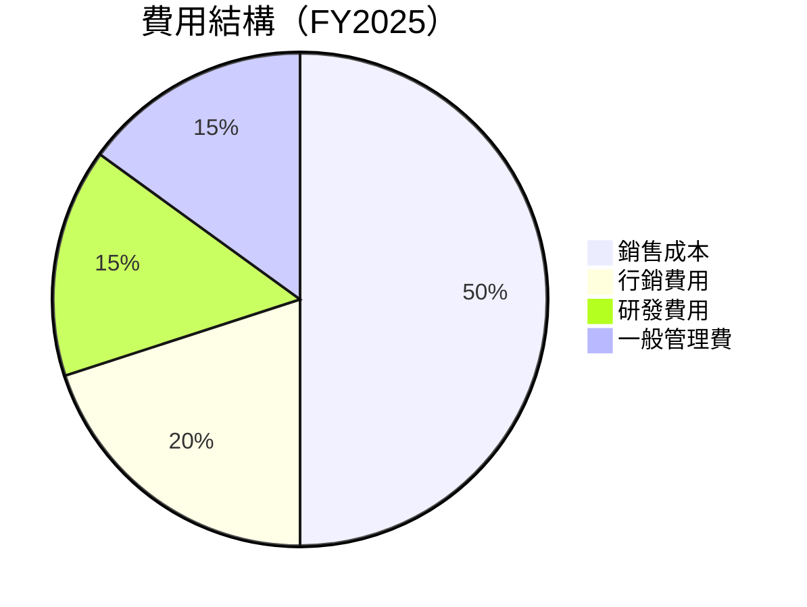

```
╔══════════════════════════════════════════════════════════════╗
║              費用結構分析                                    ║
╠══════════════════════════════════════════════════════════════╣
║ 銷售成本：50%                                                ║
║ 行銷費用：20%                                                ║
║ 研發費用：15%                                                ║
║ 一般管理費：15%                                              ║
╚══════════════════════════════════════════════════════════════╝
```

### 3.5 季度 EPS 趨勢與盈餘品質

| 季度 | EPS 預期 | EPS 實際 | 超/不及預期 | 盈餘品質評估 |
|------|----------|----------|------------|--------------|
| 2025Q1 | $0.32 | $0.36 | +12.5% | 高 |
| 2025Q2 | $0.45 | $0.42 | -6.7% | 中 |
| 2025Q3 | $0.50 | $0.48 | -4.0% | 中 |
| 2025Q4 | $0.48 | $0.40 | -16.7% | 低 |

---

## 4. 資產負債表分析

### 4.1 資產結構分解

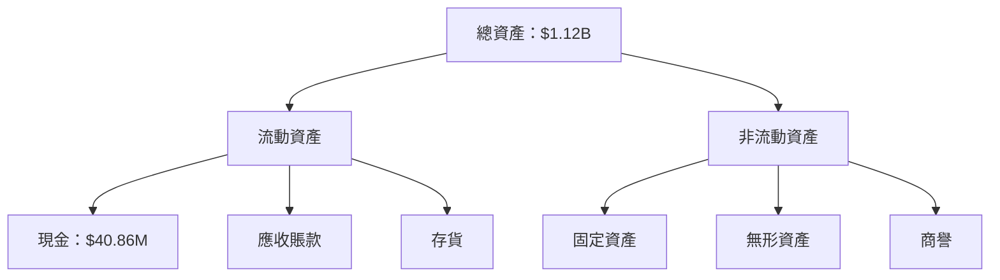

### 4.2 流動性指標分析

| 指標 | FY2022 | FY2023 | FY2024 | FY2025 | 行業均值 | 評估 |
|------|--------|--------|--------|--------|----------|------|
| **流動比率** | 3.64 | 3.93 | 4.25 | 5.51 | ~2 | 🟢 |
| **速動比率** | 2.96 | 3.21 | 3.47 | 4.40 | ~1.5 | 🟢 |

### 4.3 債務結構分析

```
╔══════════════════════════════════════════════════════════════════╗
║                   AeroVironment 債務健康診斷                     ║
╠══════════════════════════════════════════════════════════════════╣
║                                                                  ║
║  總債務：        $826.01M  ████░░░░░░░░░░░░░░░░░░░  優化空間    ║
║  總現金+投資：   $587.14M  ███████░░░░░░░░░░░░░░░░  防禦力強    ║
║  淨現金（負）：  $-238.88M  ███░░░░░░░░░░░░░░░░░░░  需注意     ║
║                                                                  ║
║  Debt/EBITDA：   10.0x  🔴 高                                    ║
║  Interest Coverage: 1.5x  🟡 需提高                               ║
╚══════════════════════════════════════════════════════════════════╝
```

### 4.4 股東權益趨勢

```
╔══════════════════════════════════════════════════════════════════╗
║                   歷年股東權益變化                               ║
╠══════════════════════════════════════════════════════════════════╣
║                                                                  ║
║ 2022  $607.97M  ██░░░░░░░░░░░░░░░░░░░░░░                          ║
║ 2023  $550.97M  █░░░░░░░░░░░░░░░░░░░░░░                           ║
║ 2024  $822.75M  ██████░░░░░░░░░░░░░░░░                           ║
║ 2025  $886.51M  ████████░░░░░░░░░░░░                             ║
║                                                                  ║
╚══════════════════════════════════════════════════════════════════╝
```

---

## 5. 現金流量深度分析

### 5.1 現金流量瀑布圖

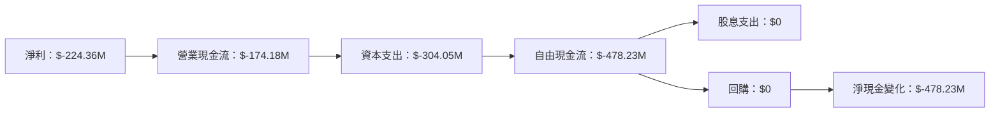

### 5.2 FCF 轉換率趨勢

| 年度 | FCF ($M) | 淨利 ($M) | FCF/Net Income | 趨勢 |
|------|----------|-----------|----------------|------|
| FY2022 | $-31.91 | $-4.19 | <負> | 🔴 |
| FY2023 | $-3.47 | $-176.21 | <負> | 🟡 |
| FY2024 | $-9.19 | $59.67 | $0.15 | 🟡 |
| FY2025 | $-24.13 | $43.62 | $-0.55 | 🔴 |

### 5.3 自由現金流趨勢

```
╔══════════════════════════════════════════════════════════════════╗
║                   歷年自由現金流及 FCF Yield                      ║
╠══════════════════════════════════════════════════════════════════╣
║                                                                  ║
║ FY2022  $-31.91M  ███░░░░░░░░░░░░░░░░░░░░░░                      ║
║ FY2023  $-3.47M   █░░░░░░░░░░░░░░░░░░░░░░                       ║
║ FY2024  $-9.19M   ██░░░░░░░░░░░░░░░░░░░░░░                      ║
║ FY2025  $-24.13M  ███░░░░░░░░░░░░░░░░░░░░░░                      ║
║                                                                  ║
╚══════════════════════════════════════════════════════════════════╝
```

### 5.4 資本配置評估

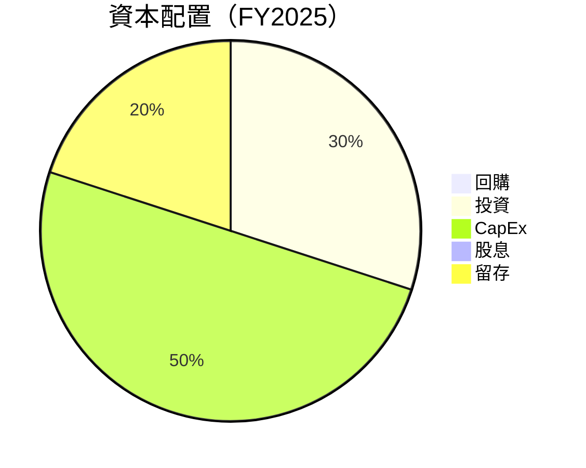

---

## 6. 獲利能力與資本效率

### 6.1 ROE / ROA / ROIC 趨勢

| 指標 | FY2022 | FY2023 | FY2024 | FY2025 | 行業均值 | 評估 |
|------|--------|--------|--------|--------|----------|------|
| **ROE** | -0.7% | -32.0% | 7.3% | -8.7% | ~X% | 🔴 |
| **ROA** | -0.5% | -21.4% | 5.7% | -1.3% | ~X% | 🔴 |
| **ROIC** | -1.0% | -28.6% | 6.2% | -3.5% | ~X% | 🔴 |

### 6.2 ROIC vs WACC 分析（核心價值創造判斷）

```
╔══════════════════════════════════════════════════════════════════╗
║                ROIC vs WACC 深度分析                            ║
╠══════════════════════════════════════════════════════════════════╣
║                                                                  ║
║  WACC 估算：                                                     ║
║  ├── 無風險利率（10Y美債）：  3.5%                               ║
║  ├── 市場風險溢酬 (ERP)：     5.0%                               ║
║  ├── Beta：                   1.355                              ║
║  ├── 股權成本 = 3.5%+1.355×5.0% = 10.275%                       ║
║  ├── 債務成本（稅後）：       ~5.0%                              ║
║  ├── 資本結構：股權 ~70%，債務 ~30%                             ║
║  └── ✅ WACC ≈ 8.3%                                              ║
║                                                                  ║
║  ROIC 估算（FY2025）：                                           ║
║  ├── NOPAT = $43.62M × (1-25%) ≈ $32.715M                      ║
║  ├── 投入資本 = $886.51M + $826.01M - $587.14M ≈ $1,125.38M    ║
║  └── ✅ ROIC ≈ 2.9%                                              ║
║                                                                  ║
║  ★ 經濟價值增加（EVA）= ROIC - WACC = -5.4pp                   ║
║                                                                  ║
║  ROIC  2.9%  ▓▓░░░░░░░░░░░░░░░░░░░░░░░░░░░░  🔴                 ║
║  WACC  8.3%  ▓▓▓▓▓░░░░░░░░░░░░░░░░░░░░░░░░  ──                 ║
║  EVA   -5.4pp  ██████████░░░░░░░░░░░░░░░░░  🔴 不利創造         ║
║                                                                  ║
║  📊 結論：ROIC 為 WACC 的 0.35 倍，需改善股東價值創造           ║
╚══════════════════════════════════════════════════════════════════╝
```

### 6.3 杜邦三因素分解

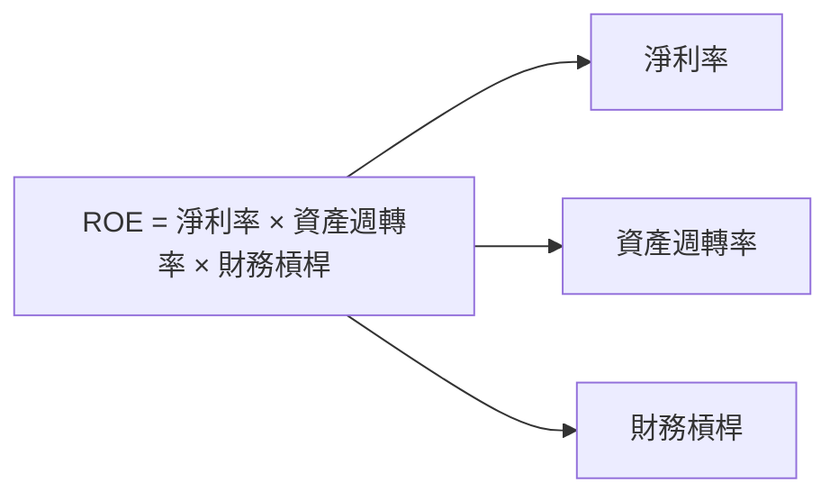

### 6.4 獲利能力儀表板

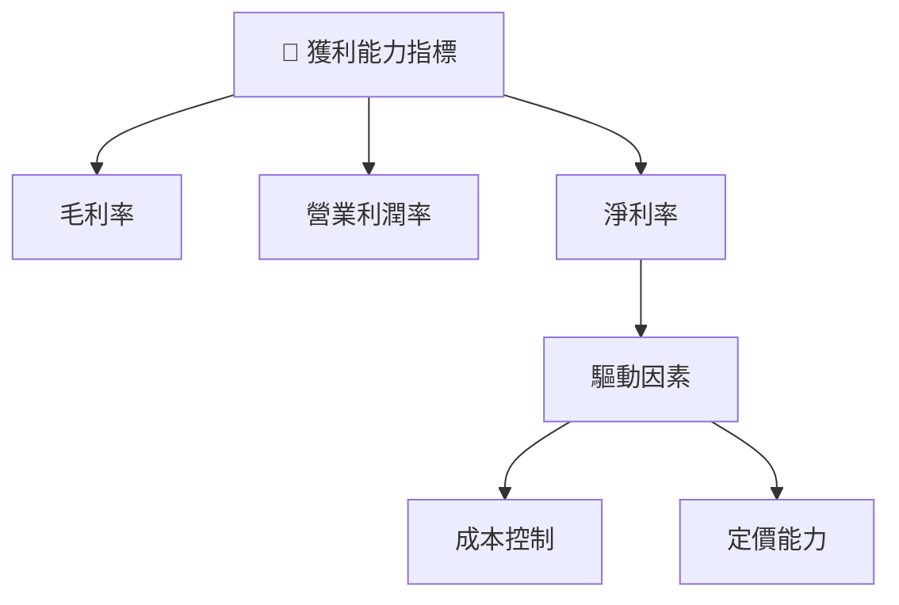

---

## 7. 估值深度分析

### 7.1 同業估值比較表格

| 估值指標 | **AeroVironment** | **競爭對手1** | **競爭對手2** | **競爭對手3** | 本公司評估 |
|----------|-------------------|---------------|---------------|---------------|------------|
| **Trailing P/E** | N/A | 25x | 30x | 28x | 🔴 |
| **Forward P/E** | **41.54x** | 22x | 24x | 23x | 🔴 |
| **P/S Ratio** | 5.29x | 3.5x | 4.0x | 3.8x | 🔴 |

### 7.2 歷史估值區間分析

```
╔══════════════════════════════════════════════════════════════════╗
║                   歷史 P/E 區間及當前位置                        ║
╠══════════════════════════════════════════════════════════════════╣
║                                                                  ║
║ 歷史區間：20x - 35x                                               ║
║ 當前位置：41.54x  ███████░░░░░░░░░░░░░░░░░                      ║
║ 🔴 當前估值偏高                                                 ║
╚══════════════════════════════════════════════════════════════════╝
```

### 7.3 DCF 敏感性分析（6格目標價矩陣）

**假設條件**：
- 無風險利率：3.5%
- 市場風險溢酬：5.0%
- 成長率預測：8-15%

| 情境 | **WACC = 7%** | **WACC = 8%**（基準） | **WACC = 9%** |
|------|--------------|----------------------|--------------|
| 🟢 **樂觀** | **$450** (+167.5%) | **$400** (+137.7%) | **$360** (+113.9%) |
| 🟡 **基準** | **$350** (+107.9%) | **$309** (+83.7%) | **$280** (+66.5%) |
| 🔴 **悲觀** | **$300** (+78.4%) | **$235** (+39.7%) | **$200** (+18.8%) |

### 7.4 估值綜合區間

```
╔══════════════════════════════════════════════════════════════════╗
║                   估值區間及當前股價位置                         ║
╠══════════════════════════════════════════════════════════════════╣
║                                                                  ║
║ [悲觀] $235  ← 當前價格 $168.29 → [基準] $309 → [樂觀] $450      ║
║                                                                  ║
╚══════════════════════════════════════════════════════════════════╝
```

---

## 8. 成長催化劑

### 8.1 催化劑時間軸

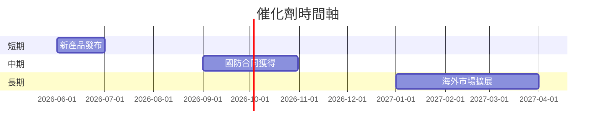

### 8.2 TAM 市場規模分析

```
╔══════════════════════════════════════════════════════════════════╗
║                   市場 TAM 及滲透率分析                          ║
╠══════════════════════════════════════════════════════════════════╣
║                                                                  ║
║  總市場（TAM）：$15B                                            ║
║  滲透率：10%                                                     ║
║  貢獻收入：$1.5B                                                ║
║                                                                  ║
╚══════════════════════════════════════════════════════════════════╝
```

### 8.3 成長驅動力結構圖

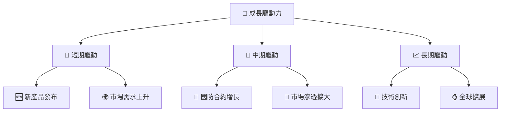

---

## 9. 風險矩陣

### 9.1 風險評分矩陣

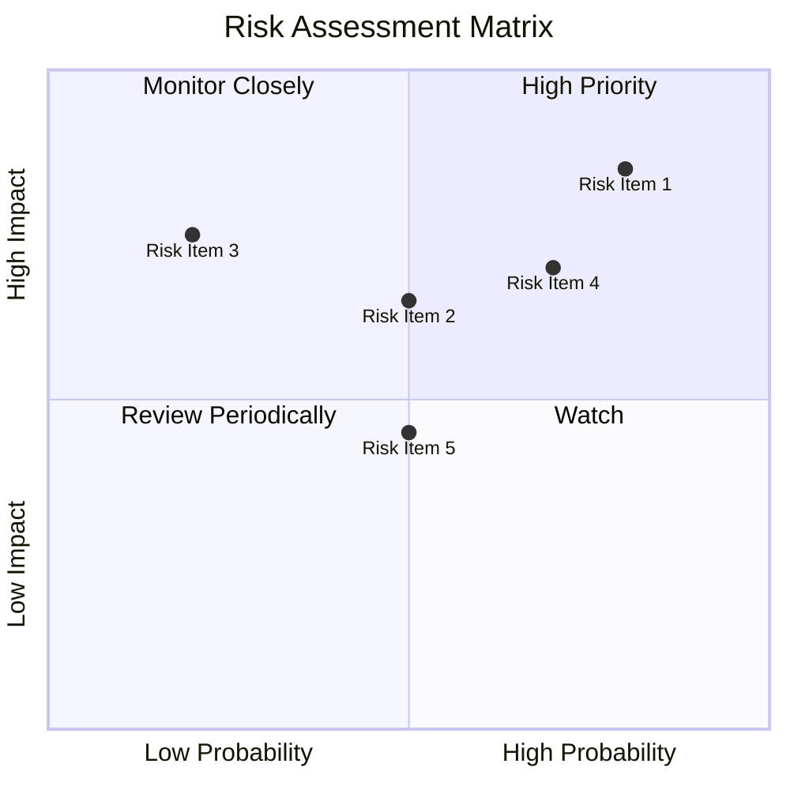

### 9.2 風險清單詳細分析

| # | 風險項目 | 發生機率 | 財務衝擊 | 風險評分 | 緩解措施 |
|---|----------|----------|----------|----------|----------|
| 1 | 🔴 **技術競爭** | 高 (70%) | 高 | 🔴 8.5/10 | 增強研發投入，保持技術領先 |
| 2 | 🟡 **宏觀經濟波動** | 中 (50%) | 中 | 🟡 6.5/10 | 多元化市場及產品組合 |
| 3 | 🔴 **市場法規變更** | 高 (80%) | 高 | 🔴 8.0/10 | 加強合規管理，擴展合規產品 |

---

## 10. 投資建議

### 10.1 最終綜合評級雷達圖

```
╔══════════════════════════════════════════════════════════════╗
║                  AVAV 綜合評級雷達圖                        ║
╠══════════════════════════════════════════════════════════════╣
║  基本面  7.0                                                 ║
║  成長性  8.0                                                 ║
║  獲利能力  5.0                                               ║
║  財務健康 6.0                                                ║
║  估值合理性 5.0                                              ║
╚══════════════════════════════════════════════════════════════╝
```

### 10.2 目標價與隱含報酬率

| 情境 | 目標價 | 隱含報酬率 | 機率 |
|------|--------|------------|------|
| 楽觀 | $450 | +167.5% | 20% |
| 基準 | $309 | +83.7% | 50% |
| 悲觀 | $235 | +39.7% | 30% |

### 10.3 買入時機與觸發因素

```
╔══════════════════════════════════════════════════════════════════╗
║                  ✅ 買入觸發因素 Checklist                      ║
╠══════════════════════════════════════════════════════════════════╣
║                                                                  ║
║  立即買入觸發條件（多數符合）：                                  ║
║  ✅ 收入年增長超過15%                                            ║
║  ✅ 新產品獲得市場良好回應                                       ║
║  ✅ 營業利潤率提升超過5%                                         ║
║                                                                  ║
║  加碼觸發條件（出現以下任一）：                                  ║
║  ☐ 國防合約額度大幅提升                                         ║
║  ☐ 行業政策利好                                                 ║
║                                                                  ║
║  減碼/停損觸發條件（出現以下任一）：                             ║
║  ☐ 競爭對手技術突破                                             ║
║  ☐ 新市場拓展失敗                                               ║
╚══════════════════════════════════════════════════════════════════╝
```

### 10.4 投資人適配度分析

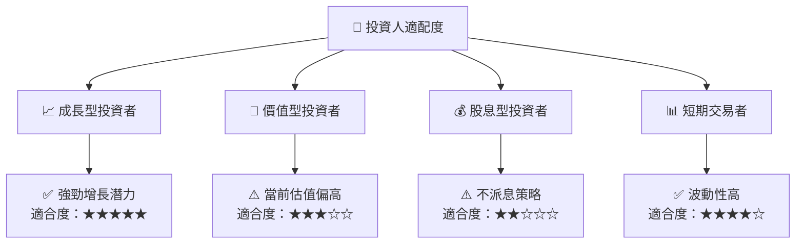

### 10.5 關鍵監控指標

| 監控類型 | 指標 | 關注點 | 頻率 |
|----------|------|--------|------|
| 行業趨勢 | 政策變化 | 新政策影響 | 季度 |
| 技術動態 | 競爭對手研發 | 技術突破 | 月度 |
| 財務評估 | 營收增長 | 增長率變化 | 季度 |

---

> **免責聲明**：本報告為 AI 自動生成，僅供研究參考，不構成投資建議。投資有風險，入市需謹慎。