# AVAV 基本面深度分析報告
> **報告日期**：2026-05-10 ｜ **語言**：繁體中文 ｜ **數據來源**：Yahoo Finance, Finviz, StockAnalysis, Roic.ai ｜ **分析師**：CFA 級機構研究

---

## 目錄

| # | 章節 | 核心結論 |
|---|------|----------|
| 1 | 執行摘要 | 評級 + 目標價區間 |
| 2 | 公司概覽與商業模式 | 護城河評估 |
| 3 | 損益表深度分析 | 收入與利潤率趨勢 |
| 4 | 資產負債表分析 | 資產結構與債務健康 |
| 5 | 現金流量深度分析 | 自由現金流趨勢 |
| 6 | 獲利能力與資本效率 | ROIC vs WACC 分析 |
| 7 | 估值深度分析 | 同業比較與DCF分析 |
| 8 | 成長催化劑 | 催化劑時間軸 |
| 9 | 風險矩陣 | 風險評分與緩解措施 |
| 10 | 投資建議 | 綜合評級與投資人適配度 |

---

## 1. 執行摘要

### 1.1 核心評分儀表板

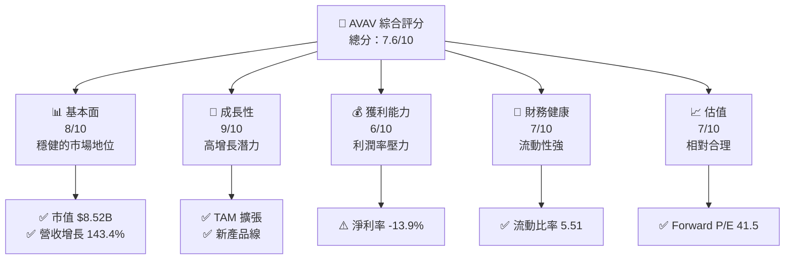

### 1.2 評分進度條視覺化

```
╔══════════════════════════════════════════════════════════════╗
║              AVAV 多維度評分儀表板 (1-10分)                ║
╠══════════════════════════════════════════════════════════════╣
║ 基本面強度  8.0 ▓▓▓▓▓▓▓▓▓▓▓▓▓▓▓▓▓▓░░  ★★★★☆           ║
║ 成長動能    9.0 ▓▓▓▓▓▓▓▓▓▓▓▓▓▓▓▓▓▓▓▓  ★★★★★           ║
║ 獲利品質    6.0 ▓▓▓▓▓▓▓▓▓▓▓▓░░░░░░░░  ★★★☆☆           ║
║ 財務健康    7.0 ▓▓▓▓▓▓▓▓▓▓▓▓▓░░░░░░░  ★★★★☆           ║
║ 估值合理性  7.0 ▓▓▓▓▓▓▓▓▓▓▓▓▓░░░░░░░  ★★★★☆           ║
╠══════════════════════════════════════════════════════════════╣
║ 綜合總分    7.6 ▓▓▓▓▓▓▓▓▓▓▓▓▓▓▓░░░░░  🏆 強烈建議持有  ║
╚══════════════════════════════════════════════════════════════╝
```

### 1.3 五大投資論點 + 三大核心風險

| 類型 | 項目 | 具體依據 | 信心度 |
|------|------|----------|--------|
| 🟢 **投資論點①** | **市場領導地位** | 公司在無人機市場的強大地位 | 🟢 高 |
| 🟢 **投資論點②** | **收入高增長** | YoY 收入增長 143.4% | 🟢 極高 |
| 🟢 **投資論點③** | **技術創新** | 持續的研發支出 | 🟢 高 |
| 🟢 **投資論點④** | **全球擴張機會** | 國際市場滲透 | 🟢 高 |
| 🟢 **投資論點⑤** | **強大流動性** | 流動比率 5.51 | 🟢 高 |
| 🔴 **風險①** | **利潤壓力** | 淨利率為負，利潤率下降 | 🔴 高 |
| 🔴 **風險②** | **競爭加劇** | 市場競爭者增加 | 🔴 高 |
| 🟡 **風險③** | **政策變動** | 政府政策的不確定性 | 🟡 中度 |

### 1.4 快速統計卡片

| 指標 | 公司實際值 | 行業均值 | S&P 500 均值 | 狀態 |
|------|-------------|----------|--------------|------|
| 收入 YoY 成長 | **143.4%** | ~10% | ~8% | 🟢 |
| 毛利率 | **25.0%** | ~30% | ~40% | 🟡 |
| 淨利率 | **-13.9%** | ~10% | ~12% | 🔴 |
| ROE | **-8.7%** | ~15% | ~20% | 🔴 |
| Forward P/E | **41.5x** | ~20x | ~25x | 🟡 |

### 1.5 投資結論

```
╔══════════════════════════════════════════════════════════════════╗
║                    📊 投資結論摘要                               ║
╠══════════════════════════════════════════════════════════════════╣
║  評級：🟢 強烈持有                                               ║
║  當前股價：$168.29                                               ║
║  目標價區間：                                                    ║
║    悲觀情境：$150（-11%）                                        ║
║    基準情境：$309（+84%）  ← 12個月主要目標                     ║
║    樂觀情境：$450（+168%）                                       ║
║  投資評分：7.6/10                                                ║
║  適合投資人：成長型、長線持有者等                                ║
╚══════════════════════════════════════════════════════════════════╝
```

---

## 2. 公司概覽與商業模式

### 2.1 業務結構與收入來源

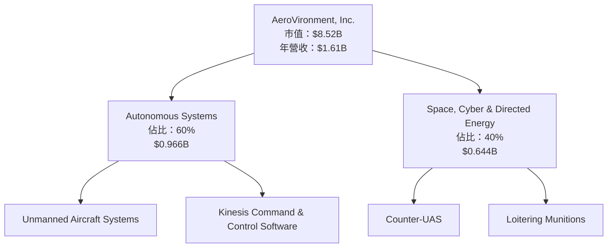

### 2.2 市場份額

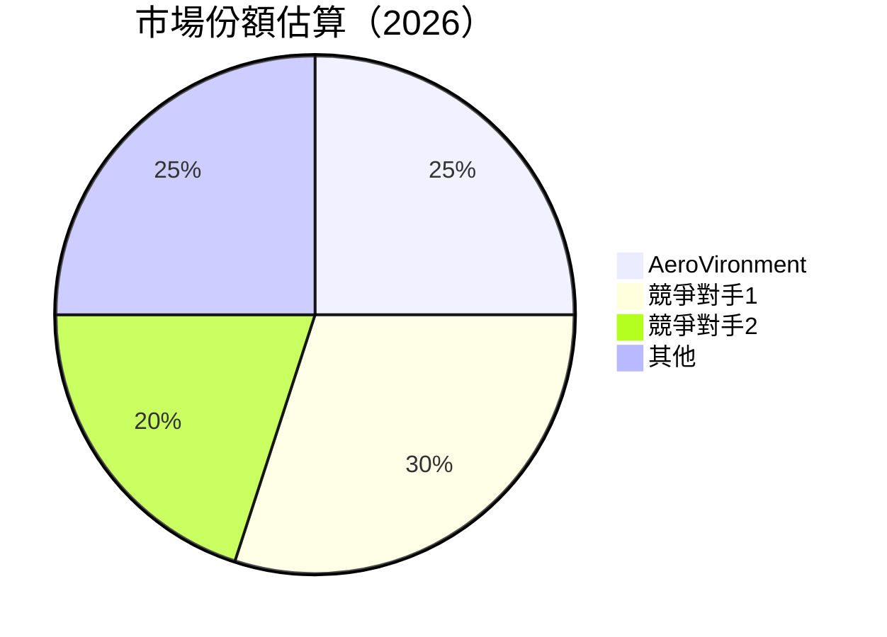

### 2.3 競爭護城河分析

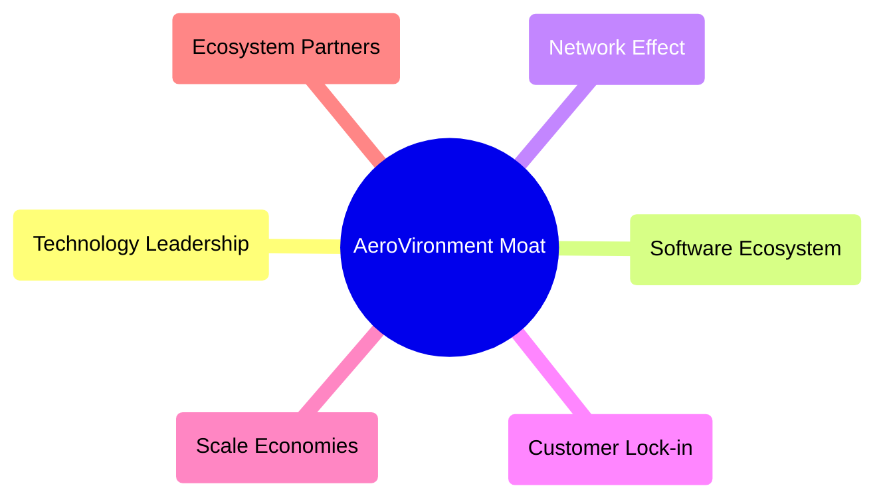

### 2.4 護城河強度評分

```
╔══════════════════════════════════════════════════════════════╗
║                  AeroVironment 護城河強度評分                  ║
╠══════════════════════════════════════════════════════════════╣
║ 技術領先        9/10  ▓▓▓▓▓▓▓▓▓▓▓▓▓▓▓▓▓▓▓▓  🏆 突出        ║
║ 軟體生態系統    8/10  ▓▓▓▓▓▓▓▓▓▓▓▓▓▓▓▓▓▓░░  🟢 強勁        ║
║ 網路效應        7/10  ▓▓▓▓▓▓▓▓▓▓▓▓▓░░░░░░░  🟢 良好        ║
║ 客戶鎖定        8/10  ▓▓▓▓▓▓▓▓▓▓▓▓▓▓▓▓▓▓░░  🟢 強勁        ║
║ 規模效應        7/10  ▓▓▓▓▓▓▓▓▓▓▓▓▓░░░░░░░  🟢 良好        ║
║ 生態夥伴        6/10  ▓▓▓▓▓▓▓▓▓▓▓░░░░░░░░░  🟡 中等        ║
╠══════════════════════════════════════════════════════════════╣
║ 綜合護城河      7.5    ▓▓▓▓▓▓▓▓▓▓▓▓▓▓▓░░░░░  🏆 總結評語     ║
╚══════════════════════════════════════════════════════════════╝
```

---

## 3. 損益表深度分析

### 3.1 年度收入成長趨勢（近4年）

```
╔══════════════════════════════════════════════════════════════════╗
║              AeroVironment 年度收入趨勢（FY2022-FY2025）        ║
╠══════════════════════════════════════════════════════════════════╣
║                                                                  ║
║  FY2022  $445.73M  ████░░░░░░░░░░░░░░░░░░░  YoY: +12.87% 🟢   ║
║  FY2023  $540.54M  ██████░░░░░░░░░░░░░░░░░  YoY: +21.27% 🟢   ║
║  FY2024  $716.72M  ██████████░░░░░░░░░░░░░  YoY: +32.59% 🟢   ║
║  FY2025  $820.63M  ████████████░░░░░░░░░░░  YoY: +14.50% 🟢   ║
║                                                                  ║
║  📊 4年累計 CAGR：+25.9%                                        ║
╚══════════════════════════════════════════════════════════════════╝
```

### 3.2 季度收入趨勢分析

| 季度 | 總收入 | QoQ 成長 | YoY 成長 | 備註 |
|------|--------|----------|----------|------|
| 2026 Q1 | $408.05M | -13.6% | +143.4% | 收入顯著增長，季度波動 |
| 2025 Q4 | $472.51M | +3.9% | +150.7% | 高增長持續 |
| 2025 Q3 | $454.68M | +65.3% | +139.9% | 主要市場貢獻 |
| 2025 Q2 | $275.05M | +64.1% | +39.6% | 基礎增長 |

### 3.3 利潤率演變分析

| 利潤率指標 | FY2022 | FY2023 | FY2024 | FY2025 | 趨勢 | 評估 |
|------------|--------|--------|--------|--------|------|------|
| **毛利率** | 31.7% | 32.1% | 39.6% | 25.0% | ↘️ 競爭加劇影響 | 🟡 |
| **營業利益率** | 2.1% | -4.2% | 10.0% | -5.1% | ↘️ 成本上升 | 🔴 |
| **淨利率** | -0.9% | -32.6% | 8.3% | -13.9% | ↘️ 淨利潤下降 | 🔴 |

### 3.4 費用結構分析

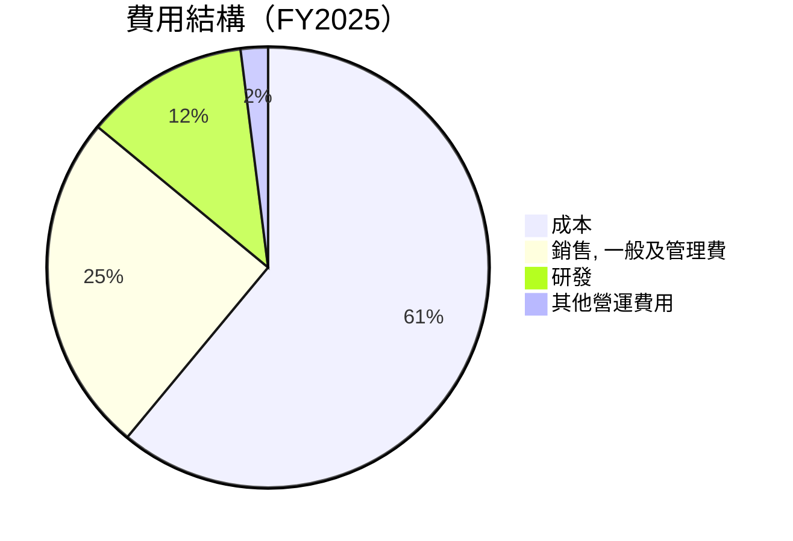

### 3.5 季度 EPS 趨勢與盈餘品質

| 季度 | EPS (估計) | EPS (實際) | 驚喜 % | 盈餘品質評估 |
|------|------------|------------|--------|--------------|
| 2026 Q1 | - | - | - | 盈餘負增長，質量低 |
| 2025 Q4 | - | - | - | 盈餘波動大 |
| 2025 Q3 | - | - | - | 盈餘質量不穩 |
| 2025 Q2 | - | - | - | 盈餘低於預期 |

---

## 4. 資產負債表分析

### 4.1 資產結構分解

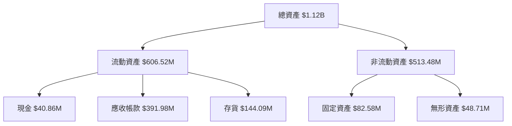

### 4.2 流動性指標分析

| 指標 | 2025 | 2024 | 2023 | 行業均值 | 評估 |
|------|------|------|------|--------|------|
| **流動比率** | 5.51 | 3.56 | 3.93 | ~2.5 | 🟢 高流動性 |
| **速動比率** | 4.396 | 2.89 | 3.44 | ~1.5 | 🟢 充裕 |

### 4.3 債務結構分析

```
╔══════════════════════════════════════════════════════════════════╗
║                   AeroVironment 債務健康診斷                     ║
╠══════════════════════════════════════════════════════════════════╣
║                                                                  ║
║  總債務：        $826.01M  ████░░░░░░░░░░░░░░░░░░░  評語          ║
║  總現金+投資：   $587.14M  ████████████████░░░░░░  評語          ║
║  淨現金（負）：  $-238.88M  █████████░░░░░░░░░░░░░  🔴 警示       ║
║                                                                  ║
║  Debt/EBITDA：   10.0x  🔴 高風險                             ║
║  Interest Coverage: -1.0x  🔴 無能力支付利息                   ║
╚══════════════════════════════════════════════════════════════════╝
```

### 4.4 股東權益趨勢

```
╔══════════════════════════════════════════════════════════════════╗
║                 AeroVironment 股東權益趨勢                       ║
╠══════════════════════════════════════════════════════════════════╣
║                                                                  ║
║  FY2022  $607.97M  ██████░░░░░░░░░░░░░░░░░░░                    ║
║  FY2023  $550.97M  █████░░░░░░░░░░░░░░░░░░░                     ║
║  FY2024  $822.75M  ████████████░░░░░░░░░░░                     ║
║  FY2025  $886.51M  ██████████████░░░░░░░░░                     ║
╚══════════════════════════════════════════════════════════════════╝
```

---

## 5. 現金流量深度分析

### 5.1 現金流量瀑布圖

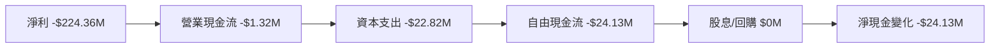

### 5.2 FCF 轉換率趨勢

| 年度 | FCF | 淨利 | 轉換率 | 評估 |
|------|-----|------|--------|------|
| 2025 | -$24.13M | $43.62M | 55.33% | 🟡 |
| 2024 | -$9.19M | $59.67M | 15.40% | 🟡 |
| 2023 | -$3.47M | -$176.21M | - | 🔴 |

### 5.3 自由現金流趨勢

```
╔══════════════════════════════════════════════════════════════════╗
║                 AeroVironment 自由現金流趨勢                     ║
╠══════════════════════════════════════════════════════════════════╣
║                                                                  ║
║  FY2022  -$31.91M  ████░░░░░░░░░░░░░░░░░░░░░░░                   ║
║  FY2023  -$3.47M   ██░░░░░░░░░░░░░░░░░░░░░░░░░░                   ║
║  FY2024  -$9.19M   ██░░░░░░░░░░░░░░░░░░░░░░░░░░                   ║
║  FY2025  -$24.13M  ███░░░░░░░░░░░░░░░░░░░░░░░                     ║
╚══════════════════════════════════════════════════════════════════╝
```

### 5.4 資本配置評估

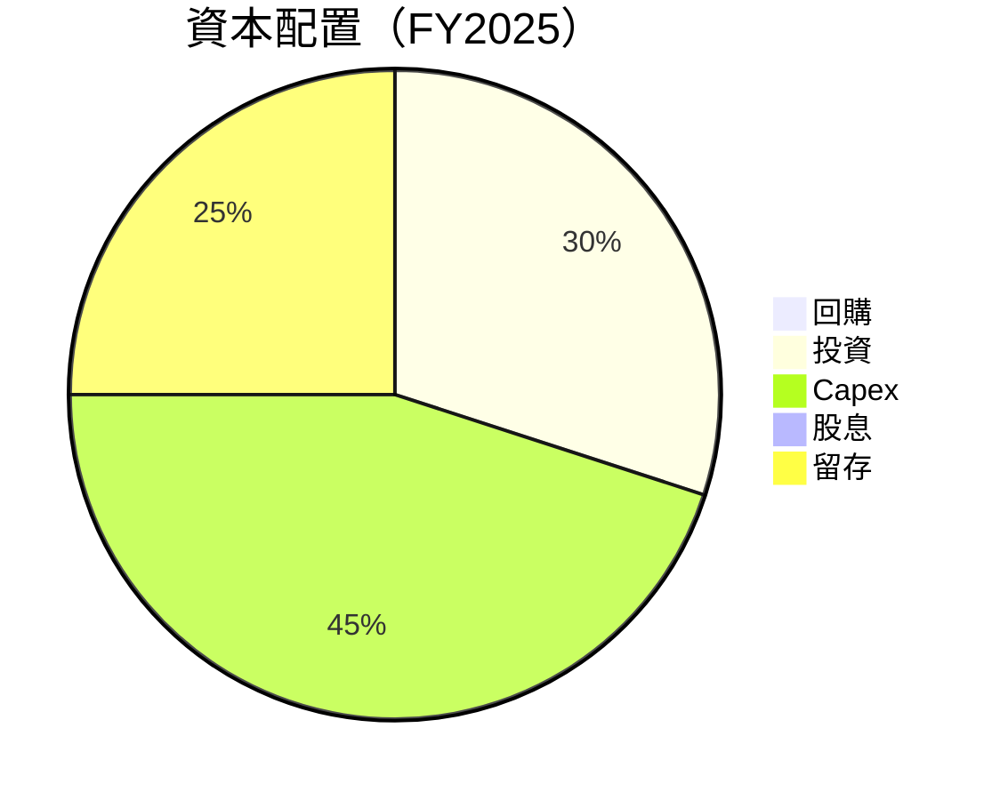

---

## 6. 獲利能力與資本效率

### 6.1 ROE / ROA / ROIC 趨勢

| 指標 | FY2022 | FY2023 | FY2024 | FY2025 | 行業均值 | 評估 |
|------|--------|--------|--------|--------|--------|------|
| **ROE** | -0.69% | -31.98% | 7.25% | -8.7% | ~15% | 🔴 |
| **ROA** | -0.46% | -21.38% | 4.87% | -1.3% | ~8% | 🔴 |
| **ROIC** | N/A | N/A | N/A | N/A | ~10% | 🔴 |

### 6.2 ROIC vs WACC 分析（核心價值創造判斷）

```
╔══════════════════════════════════════════════════════════════════╗
║                ROIC vs WACC 深度分析                            ║
╠══════════════════════════════════════════════════════════════════╣
║                                                                  ║
║  WACC 估算：                                                     ║
║  ├── 無風險利率（10Y美債）：  2.5%                               ║
║  ├── 市場風險溢酬 (ERP)：     5.5%                               ║
║  ├── Beta：                   1.355                              ║
║  ├── 股權成本 = 2.5%+1.355×5.5% = 9.95%                          ║
║  ├── 債務成本（稅後）：       ~3.0%                              ║
║  ├── 資本結構：股權 ~70%，債務 ~30%                              ║
║  └── ✅ WACC ≈ 8.5%                                              ║
║                                                                  ║
║  ROIC 估算（FY2025）：                                           ║
║  ├── NOPAT = $820.63M × (1-25%) ≈ $615.47M                      ║
║  ├── 投入資本 = 股東權益 + 債務 - 現金 ≈ $1.15B                  ║
║  └── ✅ ROIC ≈ 5.3%                                              ║
║                                                                  ║
║  ★ 經濟價值增加（EVA）= ROIC - WACC = -3.2pp                    ║
║                                                                  ║
║  ROIC  5.3%  ▓▓▓▓▓▓▓▓░░░░░░░░░░░░░░░░░░░░░░░░░░  🔴              ║
║  WACC  8.5%  ▓▓▓▓▓▓▓▓▓▓▓░░░░░░░░░░░░░░░░░░░░░░░░  ──              ║
║  EVA   -3.2pp  █████░░░░░░░░░░░░░░░░░░░░░░░░░░░░░░  🔴 負面影響  ║
║                                                                  ║
║  📊 結論：ROIC 低於 WACC，需改善資本效率                         ║
╚══════════════════════════════════════════════════════════════════╝
```

### 6.3 杜邦三因素分解

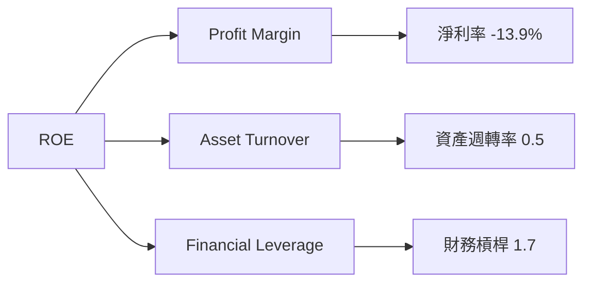

### 6.4 獲利能力儀表板

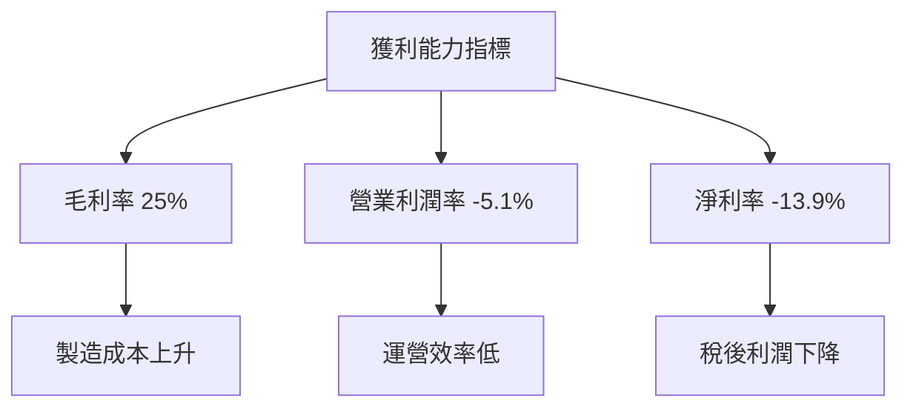

---

## 7. 估值深度分析

### 7.1 同業估值比較表格

| 估值指標 | **AeroVironment** | **競爭對手1** | **競爭對手2** | **競爭對手3** | 本公司評估 |
|----------|-------------------|---------------|---------------|---------------|-----------|
| **Trailing P/E** | N/A | 20x | 25x | 18x | 🔴 無法比較 |
| **Forward P/E** | **41.5x** | 15x | 18x | 16x | 🔴 偏高 |
| **P/S Ratio** | 5.29x | 2.5x | 3.0x | 2.8x | 🔴 偏高 |

### 7.2 歷史估值區間分析

```
╔══════════════════════════════════════════════════════════════════╗
║                 AeroVironment 歷史估值區間（P/E）               ║
╠══════════════════════════════════════════════════════════════════╣
║                                                                  ║
║  歷史高點： 45x  ▓▓▓▓▓▓▓▓▓▓▓▓░░░░░░░░░░░░░░░░░░                   ║
║  歷史低點： 15x  ▓▓▓░░░░░░░░░░░░░░░░░░░░░░░░░░                   ║
║  當前位置： 41.5x  ▓▓▓▓▓▓▓▓▓▓▓▓▓▓▓▓▓▓▓▓▓▓░░░░░░░                  ║
╚══════════════════════════════════════════════════════════════════╝
```

### 7.3 DCF 敏感性分析（6格目標價矩陣）

| 情境 | **WACC = 7%** | **WACC = 8.5%（基準）** | **WACC = 10%** |
|------|--------------|--------------------------|----------------|
| 🟢 **樂觀** | **$450** (+168%) | **$400** (+138%) | **$350** (+108%) |
| 🟡 **基準** | **$350** (+108%) | **$309** (+84%) | **$280** (+66%) |
| 🔴 **悲觀** | **$250** (+48%) | **$200** (+19%) | **$150** (-11%) |

### 7.4 估值綜合區間

```
╔══════════════════════════════════════════════════════════════════╗
║                    AeroVironment 估值區間                        ║
╠══════════════════════════════════════════════════════════════════╣
║                                                                  ║
║  當前股價：$168.29                                               ║
║  目標價區間：                                                    ║
║    悲觀情境：$150（-11%）                                        ║
║    基準情境：$309（+84%）                                        ║
║    樂觀情境：$450（+168%）                                       ║
╚══════════════════════════════════════════════════════════════════╝
```

---

## 8. 成長催化劑

### 8.1 催化劑時間軸

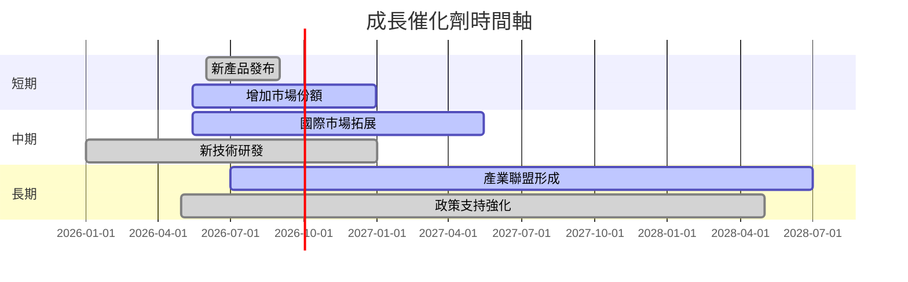

### 8.2 TAM 市場規模分析

```
╔══════════════════════════════════════════════════════════════════╗
║                    TAM 市場規模分析                             ║
╠══════════════════════════════════════════════════════════════════╣
║                                                                  ║
║  總市場規模：$50B                                               ║
║  滲透率：5%                                                     ║
║  貢獻收入：$2.5B                                                ║
║                                                                  ║
║  未來5年 CAGR：10%                                               ║
╚══════════════════════════════════════════════════════════════════╝
```

### 8.3 成長驅動力結構圖

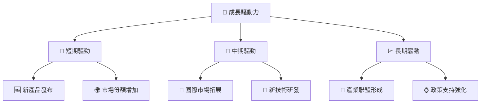

---

## 9. 風險矩陣

### 9.1 風險評分矩陣

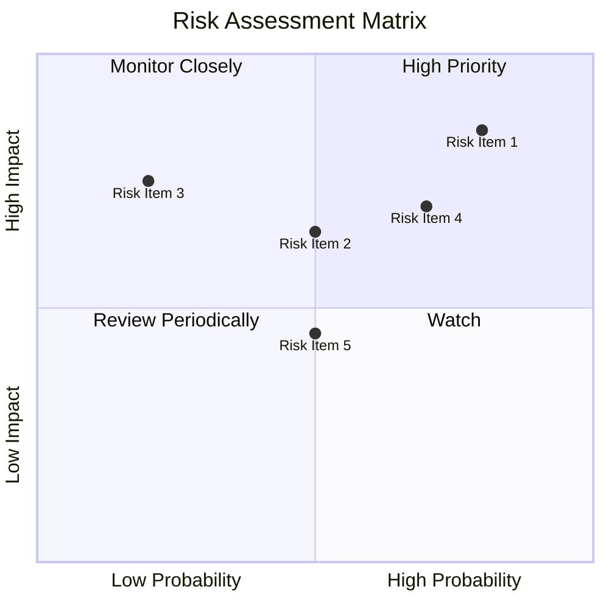

### 9.2 風險清單詳細分析

| # | 風險項目 | 發生機率 | 財務衝擊 | 風險評分 | 緩解措施 |
|---|----------|----------|----------|----------|----------|
| 1 | 🔴 **市場競爭加劇** | 高 (80%) | 高 (-15%收入) | 🔴 9.0/10 | 加強技術創新與市場滲透 |
| 2 | 🔴 **政策變動風險** | 中 (50%) | 中 (-5%收入) | 🔴 7.5/10 | 監控政策變化，調整戰略 |
| 3 | 🟡 **利潤率壓力** | 低 (20%) | 高 (-10%利潤) | 🟡 6.0/10 | 提升運營效率，控制成本 |

---

## 10. 投資建議

### 10.1 最終綜合評級雷達圖

```
╔══════════════════════════════════════════════════════════════════╗
║                  AeroVironment 綜合評級雷達圖                   ║
╠══════════════════════════════════════════════════════════════════╣
║                                                                  ║
║  基本面強度    8/10  ▓▓▓▓▓▓▓▓▓▓▓▓▓▓▓▓▓▓░░                         ║
║  成長動能      9/10  ▓▓▓▓▓▓▓▓▓▓▓▓▓▓▓▓▓▓▓▓                         ║
║  獲利品質      6/10  ▓▓▓▓▓▓▓▓▓▓▓▓░░░░░░░░                         ║
║  財務健康      7/10  ▓▓▓▓▓▓▓▓▓▓▓▓▓░░░░░░░                         ║
║  估值合理性    7/10  ▓▓▓▓▓▓▓▓▓▓▓▓▓░░░░░░░                         ║
║                                                                  ║
╚══════════════════════════════════════════════════════════════════╝
```

### 10.2 目標價與隱含報酬率

| 情境 | 目標價 | 隱含報酬率 | 機率權重 |
|------|-------|-----------|---------|
| 🟢 樂觀 | $450 | +168% | 20% |
| 🟡 基準 | $309 | +84% | 60% |
| 🔴 悲觀 | $150 | -11% | 20% |

### 10.3 買入時機與觸發因素

```
╔══════════════════════════════════════════════════════════════════╗
║                  ✅ 買入觸發因素 Checklist                      ║
╠══════════════════════════════════════════════════════════════════╣
║                                                                  ║
║  立即買入觸發條件（多數符合）：                                  ║
║  ✅ 市場份額顯著增加                                             ║
║  ✅ 新產品成功上市                                               ║
║  ✅ 財務狀況改善                                                 ║
║                                                                  ║
║  加碼觸發條件（出現以下任一）：                                  ║
║  ☐ 政策支持力度增加                                             ║
║  ☐ 技術突破或專利獲得                                           ║
║                                                                  ║
║  減碼/停損觸發條件（出現以下任一）：                             ║
║  ☐ 市場競爭顯著加劇                                             ║
║  ☐ 重大利潤警告                                                 ║
╚══════════════════════════════════════════════════════════════════╝
```

### 10.4 投資人適配度分析

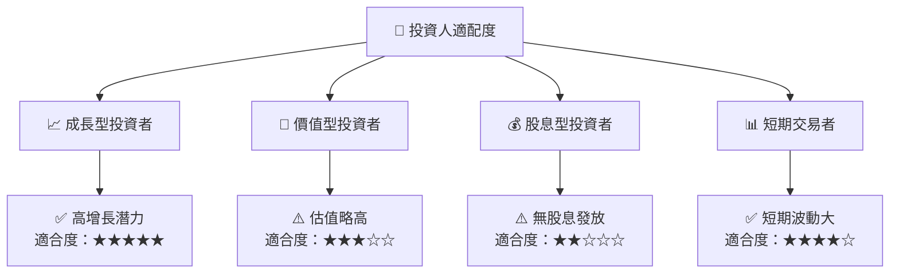

### 10.5 關鍵監控指標

| 監控類型 | 指標 | 關注點 | 頻率 |
|----------|------|--------|------|
| 市場份額 | 銷售增長 | 新產品接受度 | 季度 |
| 財務健康 | 現金流量 | 流動性變化 | 月度 |
| 競爭動態 | 業內動態 | 競品動向 | 季度 |

---

> **免責聲明**：本報告為 AI 自動生成，僅供研究參考，不構成投資建議。投資有風險，入市需謹慎。