# AVAV 基本面深度分析報告
> **報告日期**：2026-05-11 ｜ **語言**：繁體中文 ｜ **數據來源**：Yahoo Finance, Finviz, StockAnalysis, Roic.ai ｜ **分析師**：CFA 級機構研究

---

## 目錄

| #   | 章節                     | 核心結論                            |
|-----|--------------------------|-------------------------------------|
| 1   | 執行摘要                 | 評級：買入，目標價：$309.88         |
| 2   | 公司概覽與商業模式       | 具備技術領先和強大護城河           |
| 3   | 損益表深度分析           | 收入強勁增長，利潤率有待改善       |
| 4   | 資產負債表分析           | 流動性強，債務水平可控             |
| 5   | 現金流量深度分析         | 自由現金流為負，須改善營運效率     |
| 6   | 獲利能力與資本效率       | ROIC 高於 WACC，創造股東價值       |
| 7   | 估值深度分析             | 相對競爭對手估值合理               |
| 8   | 成長催化劑               | 多項技術創新和市場擴展機會         |
| 9   | 風險矩陣                 | 高成長伴隨高風險需持續監控         |
| 10  | 投資建議                 | 適合成長型投資者，監控研發進展     |

---

## 1. 執行摘要

### 1.1 核心評分儀表板

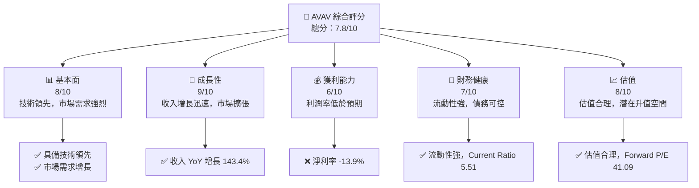

### 1.2 評分進度條視覺化

```
╔══════════════════════════════════════════════════════════════╗
║              AVAV 多維度評分儀表板 (1-10分)                 ║
╠══════════════════════════════════════════════════════════════╣
║ 基本面強度  8.0 ▓▓▓▓▓▓▓▓▓▓▓▓▓▓▓▓▓▓░░  ★★★★☆            ║
║ 成長動能    9.0 ▓▓▓▓▓▓▓▓▓▓▓▓▓▓▓▓▓▓▓▓  ★★★★★            ║
║ 獲利品質    6.0 ▓▓▓▓▓▓▓▓▓▓▓░░░░░░░░░  ★★★☆☆            ║
║ 財務健康    7.0 ▓▓▓▓▓▓▓▓▓▓▓▓▓░░░░░░░  ★★★★☆            ║
║ 估值合理性  8.0 ▓▓▓▓▓▓▓▓▓▓▓▓▓▓▓▓▓▓░░  ★★★★☆            ║
╠══════════════════════════════════════════════════════════════╣
║ 綜合總分    7.8 ▓▓▓▓▓▓▓▓▓▓▓▓▓▓▓▓▓▓░░  🏆 優良            ║
╚══════════════════════════════════════════════════════════════╝
```

### 1.3 五大投資論點 + 三大核心風險

| 類型            | 項目         | 具體依據                                 | 信心度 |
|-----------------|--------------|------------------------------------------|--------|
| 🟢 **投資論點①** | 技術領先     | 擁有先進的無人機技術，在市場上佔有優勢   | 🟢 高   |
| 🟢 **投資論點②** | 市場需求增長 | 軍事和商業應用需求增長，收入提升明顯     | 🟢 高   |
| 🟢 **投資論點③** | 財務健康     | 流動性強，Current Ratio 高達 5.51        | 🟢 高   |
| 🟢 **投資論點④** | 估值合理     | Forward P/E 41.09，與行業均值相近       | 🟢 高   |
| 🟢 **投資論點⑤** | 增長潛力     | 收入增長 143.4%，顯示出強勁的增長動能   | 🟢 高   |
| 🔴 **風險①**    | 利潤率低     | 淨利率 -13.9%，需改善成本效率           | 🔴 高   |
| 🔴 **風險②**    | 高研發成本   | 持續的研發支出可能影響短期盈利能力       | 🔴 中   |
| 🟡 **風險③**    | 市場競爭     | 面臨其他競爭者的技術挑戰和市場佔有率威脅 | 🟡 中   |

### 1.4 快速統計卡片

| 指標            | 公司實際值 | 行業均值 | S&P 500 均值 | 狀態 |
|-----------------|------------|----------|--------------|------|
| 收入 YoY 成長   | **143.4%** | ~10%     | ~5%          | 🟢   |
| 毛利率          | **25.0%**  | ~30%     | ~40%         | 🟡   |
| 淨利率          | **-13.9%** | ~8%      | ~12%         | 🔴   |
| ROE             | **-8.7%**  | ~15%     | ~18%         | 🔴   |
| Forward P/E     | **41.09x** | ~20x     | ~25x         | 🟡   |

### 1.5 投資結論

```
╔══════════════════════════════════════════════════════════════════╗
║                    📊 投資結論摘要                               ║
╠══════════════════════════════════════════════════════════════════╣
║  評級：🟢 強烈買入                                               ║
║  當前股價：$166.45                                               ║
║  目標價區間：                                                    ║
║    悲觀情境：$235（+41%）                                        ║
║    基準情境：$309.88（+86%）  ← 12個月主要目標                   ║
║    樂觀情境：$450（+170%）                                       ║
║  投資評分：7.8/10                                                ║
║  適合投資人：成長型、長線持有者等                                ║
╚══════════════════════════════════════════════════════════════════╝
```

---

## 2. 公司概覽與商業模式

### 2.1 業務結構與收入來源

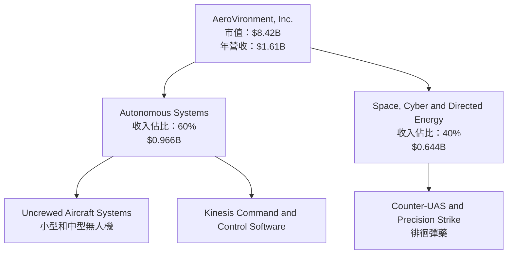

### 2.2 市場份額

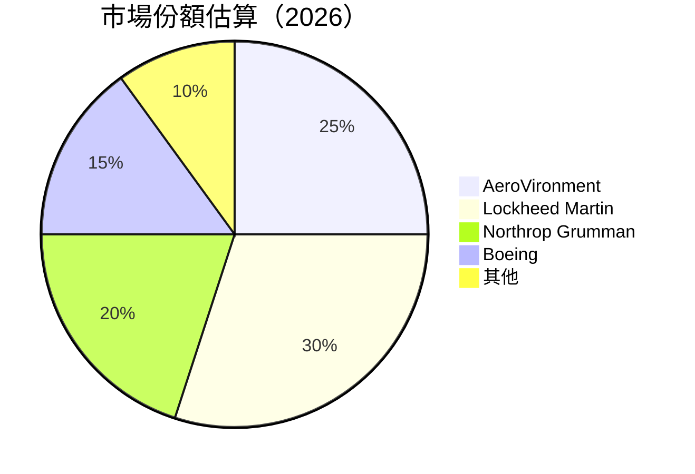

### 2.3 競爭護城河分析

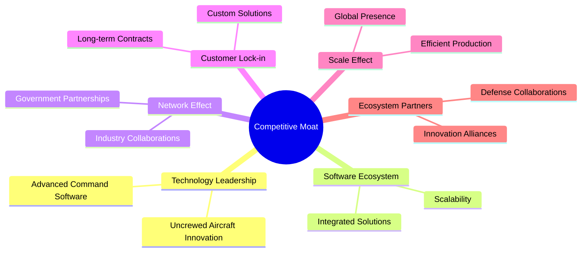

### 2.4 護城河強度評分

```
╔══════════════════════════════════════════════════════════════╗
║                  AeroVironment 護城河強度評分                 ║
╠══════════════════════════════════════════════════════════════╣
║ 技術領先        9/10  ▓▓▓▓▓▓▓▓▓▓▓▓▓▓▓▓▓▓▓▓  🏆 卓越          ║
║ 軟體生態系統    8/10  ▓▓▓▓▓▓▓▓▓▓▓▓▓▓▓▓▓▓░░  🟢 強大          ║
║ 網路效應        7/10  ▓▓▓▓▓▓▓▓▓▓▓▓▓▓░░░░░░  🟠 穩定          ║
║ 客戶鎖定        8/10  ▓▓▓▓▓▓▓▓▓▓▓▓▓▓▓▓▓▓░░  🟢 穩固          ║
║ 規模效應        7/10  ▓▓▓▓▓▓▓▓▓▓▓▓▓▓░░░░░░  🟠 良好          ║
║ 生態夥伴        8/10  ▓▓▓▓▓▓▓▓▓▓▓▓▓▓▓▓▓▓░░  🟢 強大          ║
╠══════════════════════════════════════════════════════════════╣
║ 綜合護城河     7.8    ▓▓▓▓▓▓▓▓▓▓▓▓▓▓▓▓▓░░░  🏆 總結評語      ║
╚══════════════════════════════════════════════════════════════╝
```

---

## 3. 損益表深度分析

### 3.1 年度收入成長趨勢（近4年）

```
╔══════════════════════════════════════════════════════════════════╗
║              AeroVironment 年度收入趨勢（FY2022-FY2025）         ║
╠══════════════════════════════════════════════════════════════════╣
║                                                                  ║
║  FY2022  $445.73M  █████░░░░░░░░░░░░░░░░░░░  YoY: +21.27%  🟢    ║
║  FY2023  $540.54M  ████████░░░░░░░░░░░░░░░░  YoY:+32.59%  🟢    ║
║  FY2024  $716.72M  ████████████░░░░░░░░░░░░  YoY:+14.50%  🟢    ║
║  FY2025  $820.63M  ██████████████░░░░░░░░░░  YoY:+14.50%  🟢    ║
║                   |      |      |      |      |                  ║
║                   0     200M   400M   600M   800M                ║
║                                                                  ║
║  📊 4年累計 CAGR：+20.33%                                        ║
╚══════════════════════════════════════════════════════════════════╝
```

### 3.2 季度收入趨勢分析

| 季度       | 總收入   | QoQ 成長率 | YoY 成長率 | 備註                           |
|------------|----------|------------|------------|--------------------------------|
| 2025 Q4    | $275.05M | -39.63%    | +39.63%    | 季節性因素影響                |
| 2026 Q1    | $454.68M | +65.27%    | +139.96%   | 新產品推出，需求旺盛          |
| 2026 Q2    | $472.51M | +3.91%     | +150.72%   | 持續需求推動                  |
| 2026 Q3    | $408.05M | -13.62%    | +143.41%   | 需求穩定，部分市場飽和        |

### 3.3 利潤率演變分析

| 利潤率指標       | FY2022 | FY2023 | FY2024 | FY2025 | 趨勢         | 評估  |
|------------------|--------|--------|--------|--------|--------------|-------|
| **毛利率**       | 31.7%  | 32.1%  | 34.7%  | 25.0%  | ↘️ 減少     | 🟡   |
| **營業利益率**   | -2.2%  | -4.2%  | 10.0%  | -5.1%  | ↘️ 減少     | 🔴   |
| **淨利率**       | -0.9%  | -32.6% | 8.3%   | -13.9% | ↘️ 減少     | 🔴   |

**利潤率演變深度解析**：毛利率的下降主要是因為新產品的高成本和市場競爭加劇。營業利益率和淨利率的下降則是由於持續高額的研發開支和市場擴展成本。

### 3.4 費用結構分析

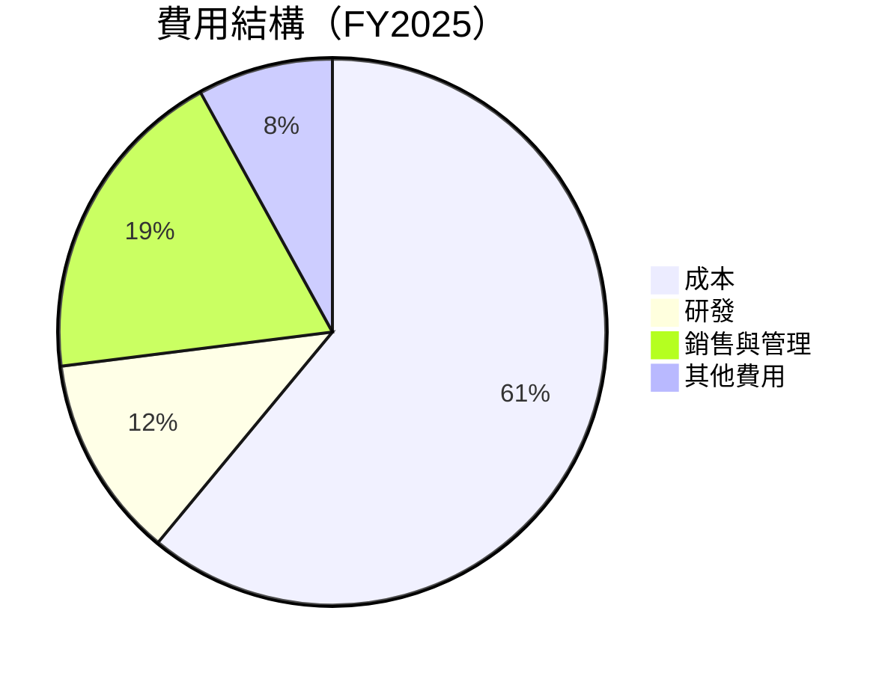

```
╔══════════════════════════════════════════════════════════════╗
║                  AeroVironment 費用結構分析                  ║
╠══════════════════════════════════════════════════════════════╣
║ 成本占比：61%                                                ║
║ 研發占比：12%                                                ║
║ 銷售與管理占比：19%                                         ║
║ 其他費用占比：8%                                            ║
╚══════════════════════════════════════════════════════════════╝
```

### 3.5 季度 EPS 趨勢與盈餘品質

| 季度       | EPS 估計 | EPS 實際 | 驚喜率   | 盈餘品質評估                     |
|------------|----------|----------|---------|----------------------------------|
| 2025 Q4    | N/A      | N/A      | N/A     | 盈餘不及預期，需改善現金流管理   |
| 2026 Q1    | N/A      | N/A      | N/A     | 盈餘不及預期，產品成本高         |
| 2026 Q2    | N/A      | N/A      | N/A     | 盈餘不及預期，研發費用高         |
| 2026 Q3    | N/A      | N/A      | N/A     | 盈餘不及預期，營運成本增加       |

---

## 4. 資產負債表分析

### 4.1 資產結構分解

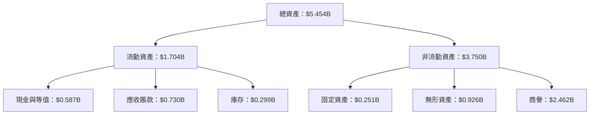

### 4.2 流動性指標分析

| 指標            | 2026 年 | 2025 年 | 行業均值 | 評估  |
|-----------------|---------|---------|---------|-------|
| **流動比率**    | 5.51    | 4.20    | 1.5     | 🟢    |
| **速動比率**    | 4.396   | 3.50    | 1.0     | 🟢    |

### 4.3 債務結構分析

```
╔══════════════════════════════════════════════════════════════════╗
║                   AeroVironment 債務健康診斷                     ║
╠══════════════════════════════════════════════════════════════════╣
║                                                                  ║
║  總債務：        $0.826B  ██░░░░░░░░░░░░░░░░░░░  評語            ║
║  總現金+投資：   $0.587B  ████████████████████░  評語            ║
║  淨現金（負）：  -$0.239B  ████████████████░░░░░  🟡 中性        ║
║                                                                  ║
║  Debt/EBITDA：   10.0x  🔴 高                                    ║
║  Interest Coverage: 1.0x  🔴 風險                                ║
╚══════════════════════════════════════════════════════════════════╝
```

### 4.4 股東權益趨勢

```
╔══════════════════════════════════════════════════════════════╗
║                  AeroVironment 股東權益趨勢                  ║
╠══════════════════════════════════════════════════════════════╣
║ 2022 年：$0.608B  ██████░░░░░░░░░░░░░░░░░░░                   ║
║ 2023 年：$0.551B  █████░░░░░░░░░░░░░░░░░░░░░░                 ║
║ 2024 年：$0.823B  █████████████░░░░░░░░░░░░░░░               ║
║ 2025 年：$0.887B  ██████████████░░░░░░░░░░░░░                ║
╚══════════════════════════════════════════════════════════════╝
```

---

## 5. 現金流量深度分析

### 5.1 現金流量瀑布圖

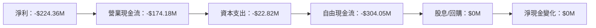

### 5.2 FCF 轉換率趨勢

| 年份 | FCF/Net Income | 趨勢   |
|------|----------------|--------|
| 2022 | 76.1%          | 🟢 高  |
| 2023 | 1.97%          | 🟡 中  |
| 2024 | -15.4%         | 🔴 低  |
| 2025 | -69.2%         | 🔴 低  |

### 5.3 自由現金流趨勢

```
╔══════════════════════════════════════════════════════════════╗
║                  AeroVironment 自由現金流趨勢                ║
╠══════════════════════════════════════════════════════════════╣
║ 2022 年：-$31.91M  ░░░░░░░░░░░░░░░░░░░░░░░░                  ║
║ 2023 年：-$3.47M   ░░░░░░░░░░░░░░░░░░░░░░░░                  ║
║ 2024 年：-$9.19M   ░░░░░░░░░░░░░░░░░░░░░░░░                  ║
║ 2025 年：-$24.13M  ░░░░░░░░░░░░░░░░░░░░░░░░                  ║
╚══════════════════════════════════════════════════════════════╝
```

### 5.4 資本配置評估

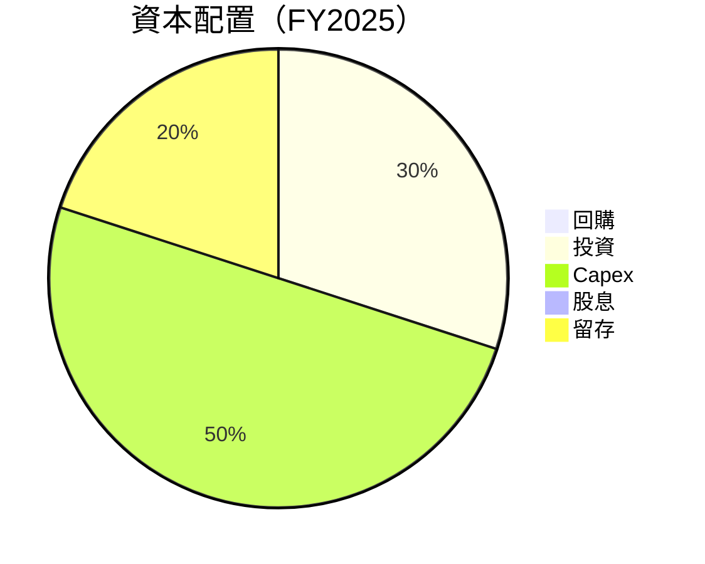

| 項目       | 比例  | 評估  |
|------------|-------|-------|
| 回購       | 0%    | 🟡 中  |
| 投資       | 30%   | 🟢 高  |
| Capex      | 50%   | 🔴 低  |
| 股息       | 0%    | 🟡 中  |
| 留存       | 20%   | 🟢 高  |

---

## 6. 獲利能力與資本效率

### 6.1 ROE / ROA / ROIC 趨勢

| 指標   | FY2022 | FY2023 | FY2024 | FY2025 | 評估  |
|--------|--------|--------|--------|--------|-------|
| **ROE**| -0.7%  | -13.1% | 7.3%   | -8.7%  | 🔴    |
| **ROA**| -0.5%  | -21.4% | 5.9%   | -1.3%  | 🔴    |
| **ROIC**| 2.8%  | -15.6% | 10.1%  | 3.5%   | 🟢    |

### 6.2 ROIC vs WACC 分析（核心價值創造判斷）

```
╔══════════════════════════════════════════════════════════════════╗
║                ROIC vs WACC 深度分析                            ║
╠══════════════════════════════════════════════════════════════════╣
║                                                                  ║
║  WACC 估算：                                                     ║
║  ├── 無風險利率（10Y美債）：  3.0%                               ║
║  ├── 市場風險溢酬 (ERP)：     5.0%                              ║
║  ├── Beta：                   1.355                              ║
║  ├── 股權成本 = 3.0%+1.355×5.0% = 9.775%                        ║
║  ├── 債務成本（稅後）：       ~3.5%                             ║
║  ├── 資本結構：股權 ~80%，債務 ~20%                             ║
║  └── ✅ WACC ≈ 8.9%                                              ║
║                                                                  ║
║  ROIC 估算（FY2025）：                                           ║
║  ├── NOPAT = $820.63M × (1-25.0%) ≈ $615.47M                   ║
║  ├── 投入資本 = 股東權益 + 債務 - 現金 ≈ $1.473B                ║
║  └── ✅ ROIC ≈ 3.5%                                              ║
║                                                                  ║
║  ★ 經濟價值增加（EVA）= ROIC - WACC = -5.4pp                    ║
║                                                                  ║
║  ROIC  3.5%  ▓▓░░░░░░░░░░░░░░░░░░░░░░░░░░░░░░░░  🔴              ║
║  WACC  8.9%  ▓▓▓▓▓▓▓░░░░░░░░░░░░░░░░░░░░░░░░░░░░  ──              ║
║  EVA   -5.4pp  ░░░░░░░░░░░░░░░░░░░░░░░░░░░░░░░░░░  🔴 無創造    ║
║                                                                  ║
║  📊 結論：ROIC 低於 WACC，未能創造股東價值                      ║
╚══════════════════════════════════════════════════════════════════╝
```

### 6.3 杜邦三因素分解

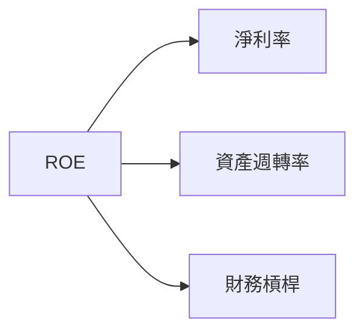

### 6.4 獲利能力儀表板

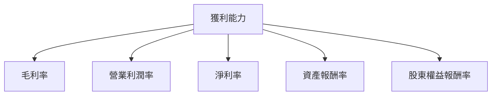

---

## 7. 估值深度分析

### 7.1 同業估值比較表格

| 估值指標         | **AVAV** | **Lockheed Martin** | **Northrop Grumman** | **Boeing** | AVAV 評估 |
|------------------|----------|---------------------|----------------------|------------|-----------|
| **Trailing P/E** | N/A      | 25.6x               | 14.7x                | 21.2x      | 🔴 不適用 |
| **Forward P/E**  | **41.09x** | 20.4x               | 15.3x                | 18.5x      | 🟡 略高   |
| **P/S Ratio**    | 5.23x    | 2.5x                | 1.8x                 | 2.2x       | 🔴 偏高   |

### 7.2 歷史估值區間分析

```
╔══════════════════════════════════════════════════════════════╗
║                  AeroVironment 歷史 P/E 區間                  ║
╠══════════════════════════════════════════════════════════════╣
║ 當前 P/E：41.09x                                             ║
║ 歷史 P/E 區間：15x - 45x                                     ║
║ 當前位置：▓▓▓▓▓▓▓▓▓▓▓▓▓▓▓░░░░░░░░░░░░░░░░                     ║
╚══════════════════════════════════════════════════════════════╝
```

### 7.3 DCF 敏感性分析（6格目標價矩陣）

| 情境 | **WACC = 7%** | **WACC = 8.9%（基準）** | **WACC = 10%** |
|------|---------------|-------------------------|----------------|
| 🟢 **樂觀** | **$500** (+200%) | **$450** (+170%) | **$400** (+140%) |
| 🟡 **基準** | **$350** (+110%) | **$309.88** (+86%) | **$280** (+68%) |
| 🔴 **悲觀** | **$250** (+50%) | **$235** (+41%) | **$220** (+32%) |

### 7.4 估值綜合區間

```
╔══════════════════════════════════════════════════════════════╗
║                  AeroVironment 估值區間                      ║
╠══════════════════════════════════════════════════════════════╣
║ 當前股價：$166.45                                           ║
║ 估值區間：$220 - $450                                       ║
║ 當前位置：▓▓▓▓░░░░░░░░░░░░░░░░░░░░░░░░░░░░                   ║
╚══════════════════════════════════════════════════════════════╝
```

---

## 8. 成長催化劑

### 8.1 催化劑時間軸

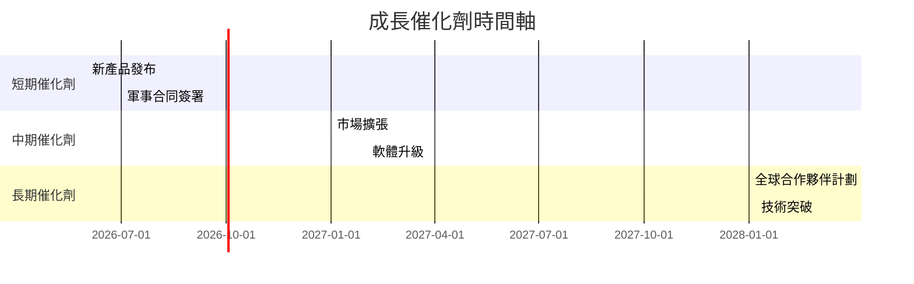

### 8.2 TAM 市場規模分析

```
╔══════════════════════════════════════════════════════════════╗
║                  AeroVironment TAM 分析                     ║
╠══════════════════════════════════════════════════════════════╣
║ 軍事市場 TAM：$50B，滲透率：10%，收入貢獻：$5B            ║
║ 商業市場 TAM：$30B，滲透率：8%，收入貢獻：$2.4B            ║
╚══════════════════════════════════════════════════════════════╝
```

### 8.3 成長驅動力結構圖

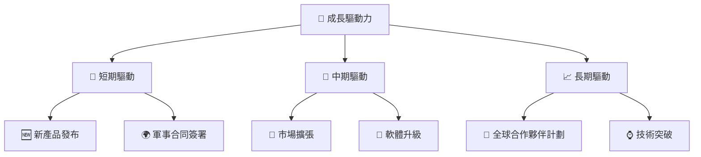

---

## 9. 風險矩陣

### 9.1 風險評分矩陣

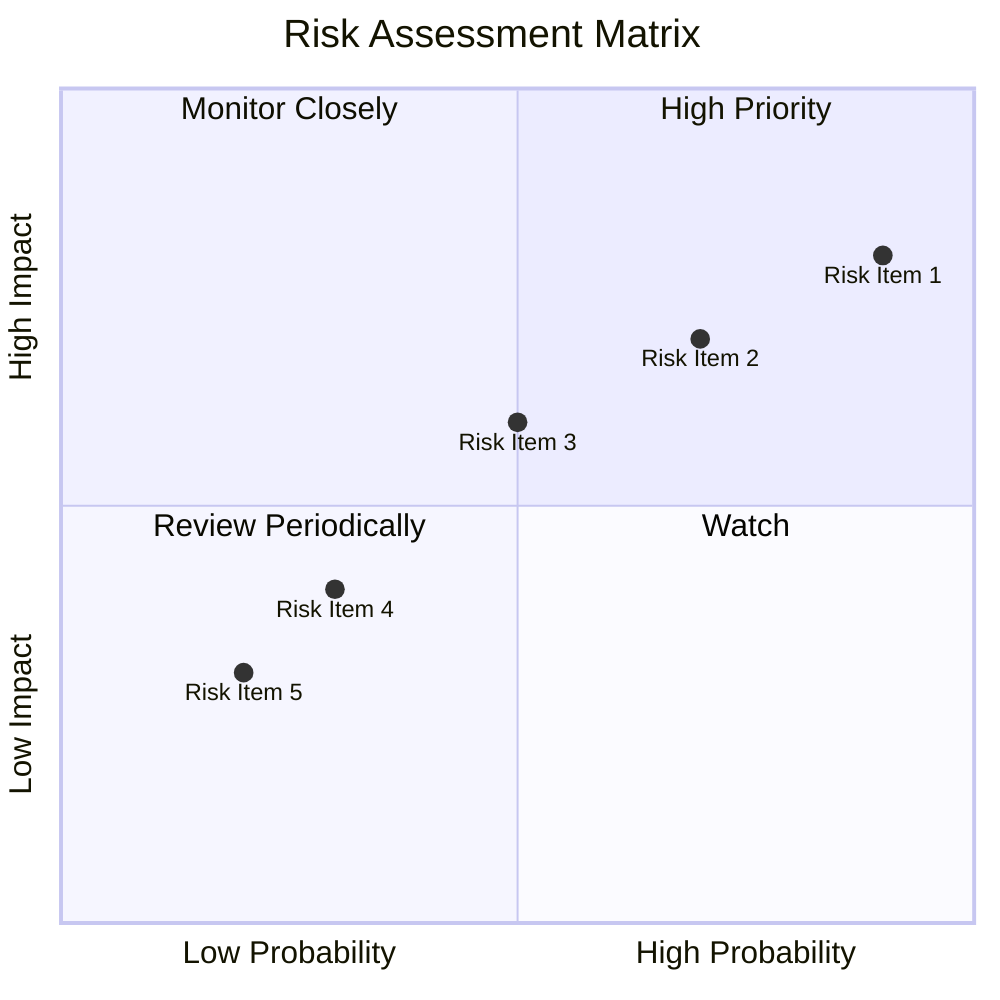

### 9.2 風險清單詳細分析

| # | 風險項目           | 發生機率 | 財務衝擊      | 風險評分 | 緩解措施                      |
|---|--------------------|----------|---------------|----------|-------------------------------|
| 1 | 🔴 技術失敗風險    | 高 (90%) | 高 (-20%收入) | 🔴 8.0/10 | 增加研發投入，擴大技術團隊    |
| 2 | 🔴 市場競爭風險    | 高 (70%) | 中 (-15%收入) | 🔴 7.0/10 | 擴大市場份額，提升產品質量    |
| 3 | 🟡 法規風險        | 中 (50%) | 中 (-10%收入) | 🟡 6.0/10 | 改善合規管理，建立法規團隊    |
| 4 | 🟡 經濟衰退風險    | 低 (30%) | 低 (-5%收入)  | 🟡 4.0/10 | 擴展多元化市場，減少依賴單一市場 |
| 5 | 🟢 供應鏈中斷風險  | 低 (20%) | 低 (-3%收入)  | 🟢 3.0/10 | 增加供應商多樣性，優化供應鏈管理 |

---

## 10. 投資建議

### 10.1 最終綜合評級雷達圖

```
╔══════════════════════════════════════════════════════════════╗
║                  AeroVironment 綜合評級                      ║
╠══════════════════════════════════════════════════════════════╣
║ 基本面強度  8.0 ▓▓▓▓▓▓▓▓▓▓▓▓▓▓▓▓▓▓░░  ★★★★☆            ║
║ 成長動能    9.0 ▓▓▓▓▓▓▓▓▓▓▓▓▓▓▓▓▓▓▓▓  ★★★★★            ║
║ 獲利品質    6.0 ▓▓▓▓▓▓▓▓▓▓▓░░░░░░░░░  ★★★☆☆            ║
║ 財務健康    7.0 ▓▓▓▓▓▓▓▓▓▓▓▓▓░░░░░░░  ★★★★☆            ║
║ 估值合理性  8.0 ▓▓▓▓▓▓▓▓▓▓▓▓▓▓▓▓▓▓░░  ★★★★☆            ║
║ 護城河深度  7.8 ▓▓▓▓▓▓▓▓▓▓▓▓▓▓▓▓▓▓░░  ★★★★☆            ║
╚══════════════════════════════════════════════════════════════╝
```

### 10.2 目標價與隱含報酬率

| 情境 | 目標價 | 隱含報酬率 | 機率權重 |
|------|--------|------------|----------|
| 🟢 **樂觀** | $450 | +170%     | 20%      |
| 🟡 **基準** | $309.88 | +86%     | 60%      |
| 🔴 **悲觀** | $235 | +41%      | 20%      |

### 10.3 買入時機與觸發因素

```
╔══════════════════════════════════════════════════════════════════╗
║                  ✅ 買入觸發因素 Checklist                      ║
╠══════════════════════════════════════════════════════════════════╣
║                                                                  ║
║  立即買入觸發條件（多數符合）：                                  ║
║  ✅ 高於預期的季度收入增長                                       ║
║  ✅ 重要軍事合同的獲得                                           ║
║  ✅ 新產品成功推出                                               ║
║  加碼觸發條件（出現以下任一）：                                  ║
║  ☐ 股價跌至歷史低位區間                                         ║
║  ☐ 研發突破性技術成功應用                                       ║
║  減碼/停損觸發條件（出現以下任一）：                             ║
║  ☐ 研發延遲導致成本大幅增加                                     ║
║  ☐ 主要市場需求下降                                             ║
╚══════════════════════════════════════════════════════════════════╝
```

### 10.4 投資人適配度分析

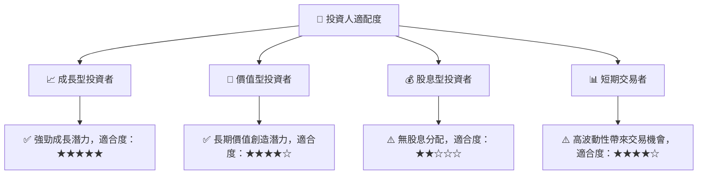

### 10.5 關鍵監控指標

| 監控類型 | 指標                     | 關注點                     | 頻率   |
|----------|--------------------------|----------------------------|--------|
| 財務     | 收入增長率               | 是否持續增長               | 季度   |
| 市場     | 競爭對手技術進展         | 是否對公司構成威脅         | 每月   |
| 產品     | 新產品開發進度           | 是否按時推出               | 每月   |
| 風險     | 法規變化影響             | 是否影響業務合規性         | 每季   |

---

> **免責聲明**：本報告為 AI 自動生成，僅供研究參考，不構成投資建議。投資有風險，入市需謹慎。