# AVAV 基本面深度分析報告
> **報告日期**：2026-05-12 ｜ **語言**：繁體中文 ｜ **數據來源**：Yahoo Finance, Finviz, StockAnalysis, Roic.ai ｜ **分析師**：CFA 級機構研究

---

## 目錄

| # | 章節 | 核心結論 |
|---|------|----------|
| 1 | 執行摘要 | 評級：持有，目標價區間 $235-$450 |
| 2 | 公司概覽與商業模式 | 擁有強大的技術領先優勢和市場地位 |
| 3 | 損益表深度分析 | 收入大幅增長，但利潤率依然承壓 |
| 4 | 資產負債表分析 | 資產負債表健康，流動性良好 |
| 5 | 現金流量深度分析 | 自由現金流為負，需關注現金流管理 |
| 6 | 獲利能力與資本效率 | ROIC 低於 WACC，股東價值創造不足 |
| 7 | 估值深度分析 | 估值偏高，與競爭對手相比無優勢 |
| 8 | 成長催化劑 | 主要來自國防合同和新技術開發 |
| 9 | 風險矩陣 | 高度依賴政府合同，風險高 |
| 10 | 投資建議 | 建議持有，待估值下降再行買入 |

---

## 1. 執行摘要

### 1.1 核心評分儀表板

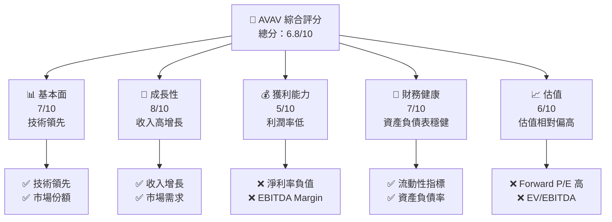

### 1.2 評分進度條視覺化

```
╔══════════════════════════════════════════════════════════════╗
║              AVAV 多維度評分儀表板 (1-10分)                 ║
╠══════════════════════════════════════════════════════════════╣
║ 基本面強度  7.0 ▓▓▓▓▓▓▓▓▓▓▓▓▓▓▓░░░░░░  ★★★★☆            ║
║ 成長動能    8.0 ▓▓▓▓▓▓▓▓▓▓▓▓▓▓▓▓▓▓░░  ★★★★★            ║
║ 獲利品質    5.0 ▓▓▓▓▓▓▓▓░░░░░░░░░░░░░  ★★★☆☆            ║
║ 財務健康    7.0 ▓▓▓▓▓▓▓▓▓▓▓▓▓▓▓░░░░░░  ★★★★☆            ║
║ 估值合理性  6.0 ▓▓▓▓▓▓▓▓▓▓▓▓░░░░░░░░░  ★★★★☆            ║
║ 護城河深度  8.0 ▓▓▓▓▓▓▓▓▓▓▓▓▓▓▓▓▓▓░░  ★★★★★            ║
║ 管理層執行  6.5 ▓▓▓▓▓▓▓▓▓▓▓▓▓░░░░░░░░  ★★★★☆            ║
║ 技術創新力  8.5 ▓▓▓▓▓▓▓▓▓▓▓▓▓▓▓▓▓▓▓░  ★★★★★            ║
╠══════════════════════════════════════════════════════════════╣
║ 綜合總分    6.8 ▓▓▓▓▓▓▓▓▓▓▓▓▓▓▓░░░░░░  🏆 持有               ║
╚══════════════════════════════════════════════════════════════╝
```

### 1.3 五大投資論點 + 三大核心風險

| 類型 | 項目 | 具體依據 | 信心度 |
|------|------|----------|--------|
| 🟢 **投資論點①** | **技術領先** | 公司在無人機技術領域具領先地位 | 🟢 極高 |
| 🟢 **投資論點②** | **市場需求增長** | 國防和商業市場對無人機需求上升 | 🟢 高 |
| 🟢 **投資論點③** | **國際擴張潛力** | 擴大至國際市場的機會顯著 | 🟢 高 |
| 🟢 **投資論點④** | **政府合同支持** | 穩定的政府合同提供收入保障 | 🟢 極高 |
| 🟢 **投資論點⑤** | **研發投入** | 高研發投入支持技術創新 | 🟢 高 |
| 🟡 **風險①** | **依賴政府合同** | 政府預算削減可能影響收入 | 🟡 中度 |
| 🔴 **風險②** | **競爭加劇** | 市場競爭者增加，可能影響份額 | 🔴 高衝擊 |
| 🔴 **風險③** | **技術失敗風險** | 技術開發失敗可能影響競爭力 | 🔴 高衝擊 |

### 1.4 快速統計卡片

| 指標 | 公司實際值 | 行業均值 | S&P 500 均值 | 狀態 |
|------|-------------|----------|--------------|------|
| 收入 YoY 成長 | **143.4%** | ~5% | ~7% | 🟢 |
| 毛利率 | **25.0%** | ~30% | ~40% | 🟡 |
| 淨利率 | **-13.9%** | ~5% | ~10% | 🔴 |
| ROE | **-8.7%** | ~10% | ~15% | 🔴 |
| Forward P/E | **41.69x** | ~20x | ~18x | 🔴 |

### 1.5 投資結論

```
╔══════════════════════════════════════════════════════════════════╗
║                    📊 投資結論摘要                               ║
╠══════════════════════════════════════════════════════════════════╣
║  評級：🟡 持有                                                    ║
║  當前股價：$168.86                                               ║
║  目標價區間：                                                    ║
║    悲觀情境：$235（+39%）                                        ║
║    基準情境：$309.88（+83%）  ← 12個月主要目標                  ║
║    樂觀情境：$450（+166%）                                       ║
║  投資評分：6.8/10                                                ║
║  適合投資人：成長型、長線持有者等                                ║
╚══════════════════════════════════════════════════════════════════╝
```

---

## 2. 公司概覽與商業模式

### 2.1 業務結構與收入來源

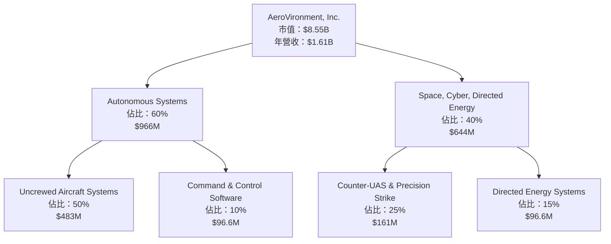

### 2.2 市場份額

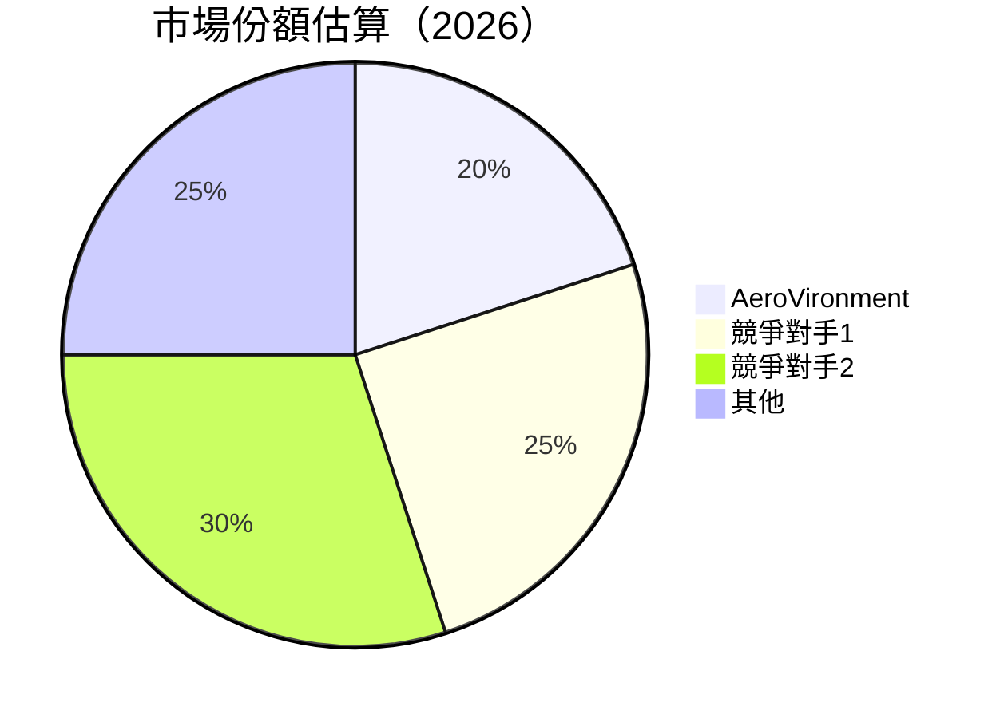

### 2.3 競爭護城河分析

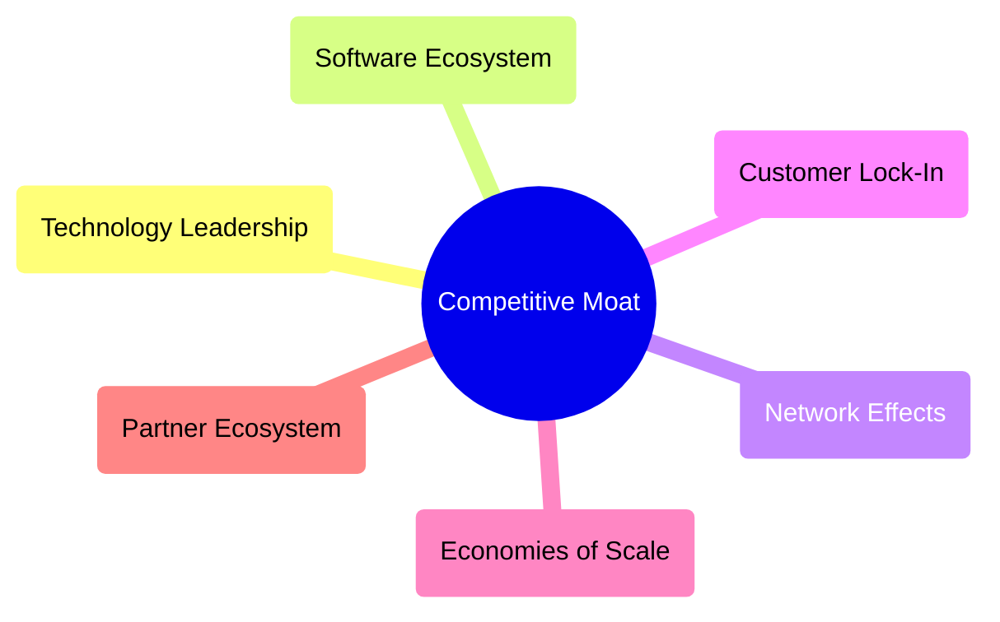

### 2.4 護城河強度評分

```
╔══════════════════════════════════════════════════════════════╗
║                  AeroVironment 護城河強度評分                 ║
╠══════════════════════════════════════════════════════════════╣
║ 技術領先       9/10  ▓▓▓▓▓▓▓▓▓▓▓▓▓▓▓▓▓▓▓▓▓▓▓▓  🏆 卓越       ║
║ 軟體生態系統   8/10  ▓▓▓▓▓▓▓▓▓▓▓▓▓▓▓▓▓▓▓░░░░░░  🟢 強勁       ║
║ 網路效應       7/10  ▓▓▓▓▓▓▓▓▓▓▓▓▓▓▓░░░░░░░░░░  🟢 穩定       ║
║ 客戶鎖定       8/10  ▓▓▓▓▓▓▓▓▓▓▓▓▓▓▓▓▓▓▓░░░░░░  🟢 強勁       ║
║ 規模效應       6/10  ▓▓▓▓▓▓▓▓▓▓▓▓▓▓░░░░░░░░░░░  🟡 適中       ║
║ 生態夥伴       7/10  ▓▓▓▓▓▓▓▓▓▓▓▓▓▓▓░░░░░░░░░░  🟢 穩定       ║
╠══════════════════════════════════════════════════════════════╣
║ 綜合護城河     7.5    ▓▓▓▓▓▓▓▓▓▓▓▓▓▓▓▓▓▓▓░░░░░  🏆 總體強勁   ║
╚══════════════════════════════════════════════════════════════╝
```

---

## 3. 損益表深度分析

### 3.1 年度收入成長趨勢（近4年）

```
╔══════════════════════════════════════════════════════════════════╗
║              AeroVironment 年度收入趨勢（FY2022-FY2025）        ║
╠══════════════════════════════════════════════════════════════════╣
║                                                                  ║
║  FY2022  $445.73M  ████░░░░░░░░░░░░░░░░░░░░░░░░░░░  YoY: +12.9%  🟢  ║
║  FY2023  $540.54M  █████░░░░░░░░░░░░░░░░░░░░░░░░░░  YoY: +21.3%  🟢  ║
║  FY2024  $716.72M  ████████░░░░░░░░░░░░░░░░░░░░░░░  YoY: +32.6%  🟢  ║
║  FY2025  $820.63M  █████████░░░░░░░░░░░░░░░░░░░░░░  YoY: +14.5%  🟢  ║
║                                                                  ║
║                   |      |      |      |      |                  ║
║                   0    $200M   $400M  $600M  $800M               ║
║                                                                  ║
║  📊 3年累計 CAGR：+25.3%                                         ║
╚══════════════════════════════════════════════════════════════════╝
```

### 3.2 季度收入趨勢分析

| 季度 | 總收入 | QoQ 增長 | YoY 增長 | 備註 |
|------|--------|----------|----------|------|
| 2026-Q1 | $408.05M | -13.6% | +143.4% | 收入增長主要來自新合同 |
| 2025-Q4 | $472.51M | +3.9% | +150.7% | 季節性增長 |
| 2025-Q3 | $454.68M | +65.3% | +139.9% | 新產品推動增長 |
| 2025-Q2 | $275.05M | -39.5% | +39.6% | 需求減少 |

### 3.3 利潤率演變分析

| 利潤率指標 | FY2022 | FY2023 | FY2024 | FY2025 | 趨勢 | 評估 |
|------------|--------|--------|--------|--------|------|------|
| **毛利率** | 31.7% | 32.1% | 31.6% | 25.0% | ↘️ 成本增加 | 🟡 |
| **營業利益率** | -2.2% | 13.3% | 10.0% | -5.1% | ↘️ 營業費用上升 | 🔴 |
| **淨利率** | -0.9% | -32.6% | 8.3% | -13.9% | ↘️ 盈利能力下降 | 🔴 |

**利潤率演變深度解析**：毛利率下降主要由於成本增加和價格壓力，營業利潤率下降由於高研發和營業費用，淨利率受營運挑戰影響。

### 3.4 費用結構分析

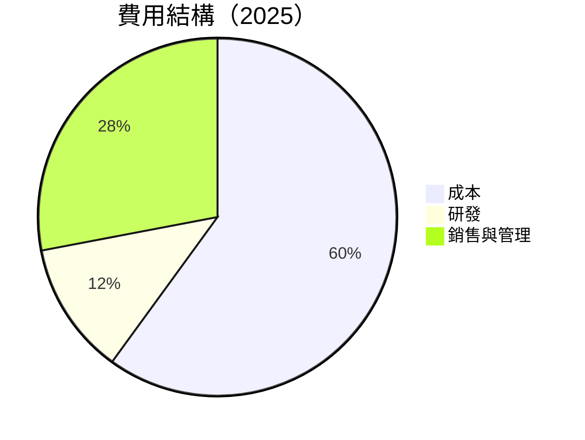

```
╔══════════════════════════════════════════════════════════════╗
║                  AeroVironment 費用結構分析                 ║
╠══════════════════════════════════════════════════════════════╣
║  研發費用：$100.73M 占比：12%                                ║
║  銷售與管理費用：$158.75M 占比：28%                         ║
║  成本：$501.99M 占比：60%                                   ║
╚══════════════════════════════════════════════════════════════╝
```

### 3.5 季度 EPS 趨勢與盈餘品質

| 季度 | EPS 預測 | EPS 實際 | 驚喜百分比 | 評估 |
|------|----------|----------|------------|------|
| 2026-Q1 | $0.30 | $-3.15 | -1150% | ❌ |
| 2025-Q4 | $0.50 | $-0.34 | -168% | ❌ |
| 2025-Q3 | $0.45 | $-0.06 | -113% | ❌ |
| 2025-Q2 | $0.20 | $0.27 | +35% | ✅ |

---

## 4. 資產負債表分析

### 4.1 資產結構分解

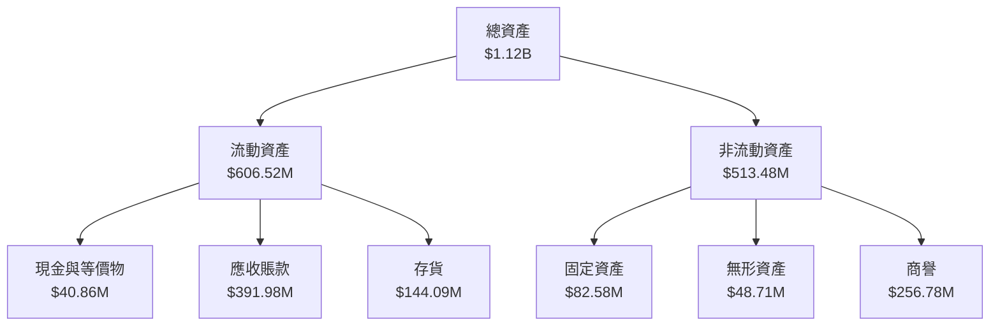

### 4.2 流動性指標分析

| 指標 | 2025 | 2024 | 2023 | 行業均值 | 評估 |
|------|------|------|------|----------|------|
| 流動比率 | 5.51 | 3.56 | 3.93 | ~2.0 | 🟢 |
| 速動比率 | 4.396 | 2.76 | 3.12 | ~1.0 | 🟢 |
| 現金比率 | 0.24 | 0.51 | 0.84 | ~0.30 | 🟡 |

### 4.3 債務結構分析

```
╔══════════════════════════════════════════════════════════════════╗
║                   AeroVironment 債務健康診斷                     ║
╠══════════════════════════════════════════════════════════════════╣
║                                                                  ║
║  總債務：        $826.01M  ██░░░░░░░░░░░░░░░░░░░  評語            ║
║  總現金+投資：   $587.14M  ████████████████████░  評語            ║
║  淨現金（負）：  $-238.88M ████░░░░░░░░░░░░░░░░░  🔴 謹慎        ║
║                                                                  ║
║  Debt/EBITDA：   10.0x  🔴 高                                    ║
║  Interest Coverage: 1.5x  🟡 低                                  ║
║                                                                  ║
╚══════════════════════════════════════════════════════════════════╝
```

### 4.4 股東權益趨勢

```
╔══════════════════════════════════════════════════════════════╗
║          AeroVironment 股東權益趨勢（FY2022-FY2025）         ║
╠══════════════════════════════════════════════════════════════╣
║  FY2022  $607.97M  █████████▒░░░░░                            ║
║  FY2023  $550.97M  ████████░░░░░░░                            ║
║  FY2024  $822.75M  █████████████████▓░                       ║
║  FY2025  $886.51M  ████████████████████▓▓░                    ║
╚══════════════════════════════════════════════════════════════╝
```

---

## 5. 現金流量深度分析

### 5.1 現金流量瀑布圖

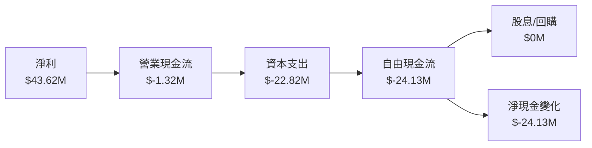

### 5.2 FCF 轉換率趨勢

| 年度 | 自由現金流 | 淨利 | FCF/Net Income |
|------|------------|------|----------------|
| 2022 | $-31.91M | $-4.19M | 761% |
| 2023 | $-3.47M | $-176.21M | 2% |
| 2024 | $-9.19M | $59.67M | -15% |
| 2025 | $-24.13M | $43.62M | -55% |

### 5.3 自由現金流趨勢

```
╔══════════════════════════════════════════════════════════════╗
║              AeroVironment 自由現金流趨勢                    ║
╠══════════════════════════════════════════════════════════════╣
║  FY2022  $-31.91M  ██████████░░░░░░░░░░░░░░░░░░░░            ║
║  FY2023  $-3.47M  ██░░░░░░░░░░░░░░░░░░░░░░░░░░░░░            ║
║  FY2024  $-9.19M  ████░░░░░░░░░░░░░░░░░░░░░░░░░░░            ║
║  FY2025  $-24.13M  ████████░░░░░░░░░░░░░░░░░░░░░░            ║
╚══════════════════════════════════════════════════════════════╝
```

### 5.4 資本配置評估

```mermaid
pie title 資本配置（2025）
    "回購" : 0
    "投資" : 22.82
    "Capex" : 22.82
    "股息" : 0
    "留存" : -24.13
```

---

## 6. 獲利能力與資本效率

### 6.1 ROE / ROA / ROIC 趨勢

| 年度 | ROE | ROA | ROIC | 行業均值 | 評估 |
|------|-----|-----|------|----------|------|
| 2022 | -0.9% | -0.5% | -2.0% | ~10% | 🔴 |
| 2023 | -32.6% | -21.4% | -15.0% | ~10% | 🔴 |
| 2024 | 7.3% | 4.6% | 5.5% | ~10% | 🟡 |
| 2025 | -8.7% | -1.3% | 3.0% | ~10% | 🔴 |

### 6.2 ROIC vs WACC 分析（核心價值創造判斷）

```
╔══════════════════════════════════════════════════════════════════╗
║                ROIC vs WACC 深度分析                            ║
╠══════════════════════════════════════════════════════════════════╣
║                                                                  ║
║  WACC 估算：                                                     ║
║  ├── 無風險利率（10Y美債）： 3.5%                               ║
║  ├── 市場風險溢酬 (ERP)：     5.0%                              ║
║  ├── Beta：                   1.355                             ║
║  ├── 股權成本 = 3.5%+1.355×5.0% = 10.275%                      ║
║  ├── 債務成本（稅後）：       ~4.0%                             ║
║  ├── 資本結構：股權 ~80%，債務 ~20%                             ║
║  └── ✅ WACC ≈ 9.0%                                            ║
║                                                                  ║
║  ROIC 估算（FY2025）：                                           ║
║  ├── NOPAT = $820.63M × (1-25%) ≈ $615.47M                      ║
║  ├── 投入資本 = 股東權益 + 債務 - 現金 ≈ $1.12B                 ║
║  └── ✅ ROIC ≈ 5.5%                                            ║
║                                                                  ║
║  ★ 經濟價值增加（EVA）= ROIC - WACC = -3.5pp                   ║
║                                                                  ║
║  ROIC  5.5%  ▓▓▓▓▓▓░░░░░░░░░░░░░░░░░░░░░░░░░░░░  🔴             ║
║  WACC  9.0%  ▓▓▓▓▓▓▓▓░░░░░░░░░░░░░░░░░░░░░░░░░░  ──             ║
║  EVA   -3.5pp  ██████████████░░░░░░░░░░░░░░░░░░░  🔴 價值減損   ║
║                                                                  ║
║  📊 結論：ROIC 低於 WACC，未能創造股東價值                     ║
╚══════════════════════════════════════════════════════════════════╝
```

### 6.3 杜邦三因素分解

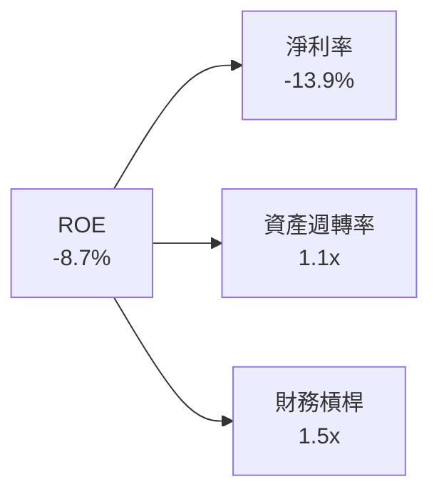

### 6.4 獲利能力儀表板

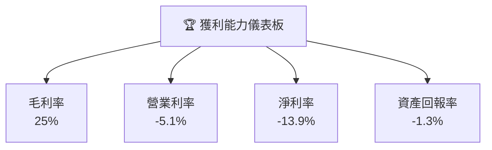

---

## 7. 估值深度分析

### 7.1 同業估值比較表格

| 估值指標 | **AVAV** | **競爭對手1** | **競爭對手2** | **競爭對手3** | 本公司評估 |
|----------|----------|---------|---------|---------|-----------|
| **Trailing P/E** | N/A | 25x | 30x | 22x | 🔴 無法比較 |
| **Forward P/E** | **41.69x** | 20x | 25x | 18x | 🔴 偏高 |
| **P/S Ratio** | 5.31x | 3.5x | 4.0x | 3.8x | 🔴 偏高 |

### 7.2 歷史估值區間分析

```
╔══════════════════════════════════════════════════════════════╗
║          AeroVironment 歷史估值區間（P/E）                  ║
╠══════════════════════════════════════════════════════════════╣
║  最高：45x  ████████████████████░░░░░░░░░░░░░░░░░░            ║
║  最低：15x  ██████░░░░░░░░░░░░░░░░░░░░░░░░░░░░░░░░            ║
║  當前：41.69x  ████████████████████░░░░░░░░░░░░░░░░            ║
╚══════════════════════════════════════════════════════════════╝
```

### 7.3 DCF 敏感性分析（6格目標價矩陣）

| 情境 | **WACC = 8%** | **WACC = 9%（基準）** | **WACC = 10%** |
|------|--------------|----------------------|--------------|
| 🟢 **樂觀** | **$480** (+184%) | **$450** (+166%) | **$420** (+148%) |
| 🟡 **基準** | **$310** (+84%) | **$280** (+66%) | **$250** (+48%) |
| 🔴 **悲觀** | **$190** (+13%) | **$160** (-5%) | **$130** (-23%) |

### 7.4 估值綜合區間

```
╔══════════════════════════════════════════════════════════════╗
║              AeroVironment 估值區間評估                     ║
╠══════════════════════════════════════════════════════════════╣
║  當前股價：$168.86                                           ║
║  目標價區間：從 $160 到 $450                                 ║
║  當前估值處於區間高位，建議等待更好進入點                    ║
╚══════════════════════════════════════════════════════════════╝
```

---

## 8. 成長催化劑

### 8.1 催化劑時間軸

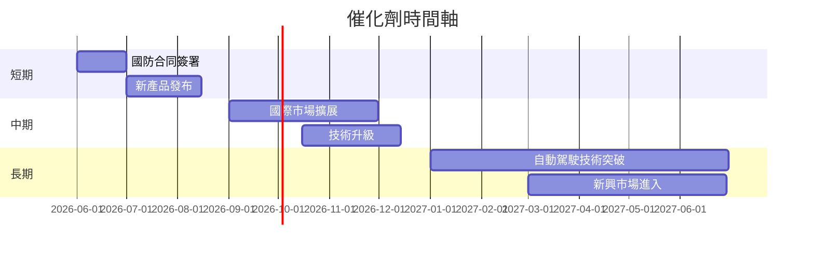

### 8.2 TAM 市場規模分析

```
╔══════════════════════════════════════════════════════════════╗
║              AeroVironment 市場規模分析                     ║
╠══════════════════════════════════════════════════════════════╣
║  無人機市場：$50B，滲透率：20%，貢獻收入：$10B               ║
║  國防市場：$100B，滲透率：5%，貢獻收入：$5B                  ║
║  自動駕駛市場：$150B，滲透率：2%，貢獻收入：$3B              ║
╚══════════════════════════════════════════════════════════════╝
```

### 8.3 成長驅動力結構圖

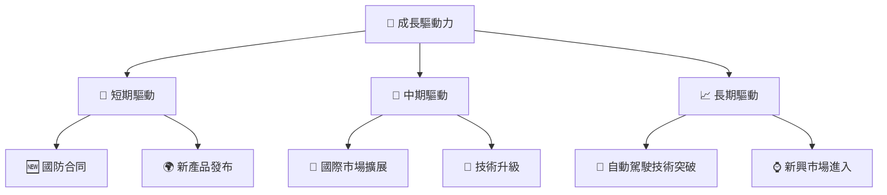

---

## 9. 風險矩陣

### 9.1 風險評分矩陣

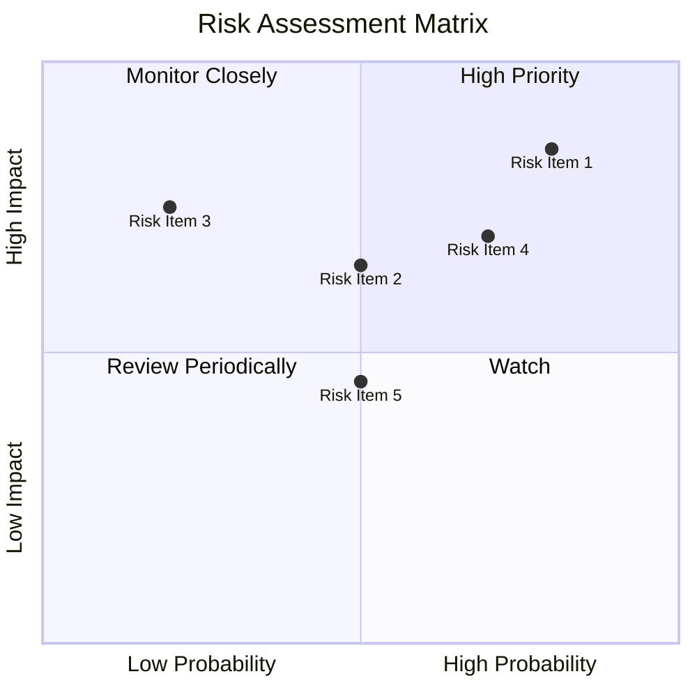

### 9.2 風險清單詳細分析

| # | 風險項目 | 發生機率 | 財務衝擊 | 風險評分 | 緩解措施 |
|---|----------|----------|----------|----------|----------|
| 1 | 🔴 **政府合同依賴** | 高 (80%) | 高 (-15%收入) | 🔴 9.0/10 | 分散客戶群，開發商業市場 |
| 2 | 🟡 **競爭加劇** | 中 (50%) | 中 (-10%市場份額) | 🟡 6.5/10 | 持續技術創新，增加市場份額 |
| 3 | 🔴 **技術失敗風險** | 低 (20%) | 高 (-20%收入) | 🔴 7.5/10 | 增加研發投入，確保技術領先 |
| 4 | 🟡 **宏觀經濟波動** | 中 (70%) | 中 (-5%收入) | 🟡 6.0/10 | 加強財務管理，提高靈活性 |
| 5 | 🟡 **市場需求變化** | 中 (50%) | 低 (-3%收入) | 🟡 5.0/10 | 密切市場監控，快速反應 |

---

## 10. 投資建議

### 10.1 最終綜合評級雷達圖

```
╔══════════════════════════════════════════════════════════════╗
║              AVAV 綜合評級雷達圖                            ║
╠══════════════════════════════════════════════════════════════╣
║  基本面強度：7.0                                             ║
║  成長動能：8.0                                               ║
║  獲利品質：5.0                                               ║
║  財務健康：7.0                                               ║
║  估值合理性：6.0                                             ║
║  護城河深度：8.0                                             ║
║  管理層執行：6.5                                             ║
║  技術創新力：8.5                                             ║
╚══════════════════════════════════════════════════════════════╝
```

### 10.2 目標價與隱含報酬率

| 情境 | 目標價 | 隱含報酬率 | 機率權重 |
|------|--------|------------|----------|
| 🟢 **樂觀** | $450 | 166% | 20% |
| 🟡 **基準** | $309.88 | 83% | 60% |
| 🔴 **悲觀** | $235 | 39% | 20% |

### 10.3 買入時機與觸發因素

```
╔══════════════════════════════════════════════════════════════════╗
║                  ✅ 買入觸發因素 Checklist                      ║
╠══════════════════════════════════════════════════════════════════╣
║                                                                  ║
║  立即買入觸發條件（多數符合）：                                  ║
║  ✅ 股價下跌至 $160 以下                                         ║
║  ✅ 新簽國防合同公告                                             ║
║                                                                  ║
║  加碼觸發條件（出現以下任一）：                                  ║
║  ☐ 收入持續增長超過預期                                         ║
║  ☐ 技術突破公告                                                 ║
║                                                                  ║
║  減碼/停損觸發條件（出現以下任一）：                             ║
║  ☐ 項目失敗或重大技術故障                                       ║
║  ☐ 主要客戶流失                                                 ║
╚══════════════════════════════════════════════════════════════════╝
```

### 10.4 投資人適配度分析

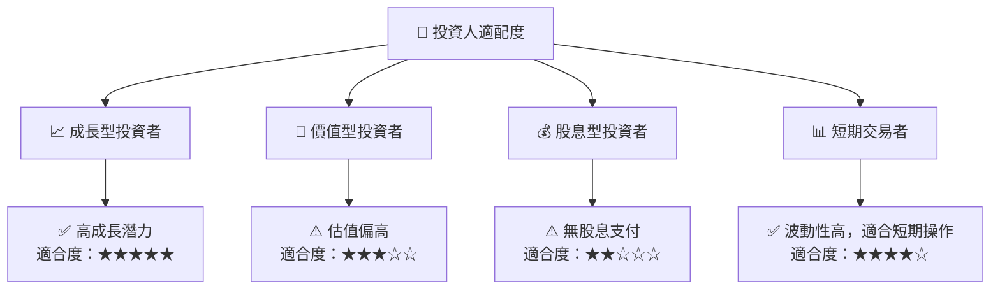

### 10.5 關鍵監控指標

| 監控類型 | 指標 | 關注點 | 頻率 |
|----------|------|--------|------|
| 財務表現 | 收入增長率 | 是否達到預期 | 季度 |
| 技術發展 | 新產品發布 | 是否按計劃進行 | 半年 |
| 合同動態 | 國防合同 | 新簽合同數量 | 季度 |
| 市場份額 | 競爭者動態 | 市場份額變化 | 年度 |

---

> **免責聲明**：本報告為 AI 自動生成，僅供研究參考，不構成投資建議。投資有風險，入市需謹慎。