# AVAV 基本面深度分析報告
> **報告日期**：2026-05-13 ｜ **語言**：繁體中文 ｜ **數據來源**：Yahoo Finance, Finviz, StockAnalysis, Roic.ai ｜ **分析師**：CFA 級機構研究

---

## 目錄

| # | 章節 | 核心結論 |
|---|------|----------|
| 1 | 執行摘要 | 目標價區間，評級：買入 |
| 2 | 公司概覽與商業模式 | 建立於技術優勢與創新產品 |
| 3 | 損益表深度分析 | 收入增長143% YoY，淨利率負值 |
| 4 | 資產負債表分析 | 強現金流，負淨現金狀況 |
| 5 | 現金流量深度分析 | 營運現金流下降，FCF 負值 |
| 6 | 獲利能力與資本效率 | ROIC < WACC，潛在改善空間 |
| 7 | 估值深度分析 | DCF 估值高出當前股價 |
| 8 | 成長催化劑 | 新產品推出與市場擴展 |
| 9 | 風險矩陣 | 技術變遷與競爭威脅 |
| 10 | 投資建議 | 買入，目標價中長期有潛力 |

---

## 1. 執行摘要

### 1.1 核心評分儀表板

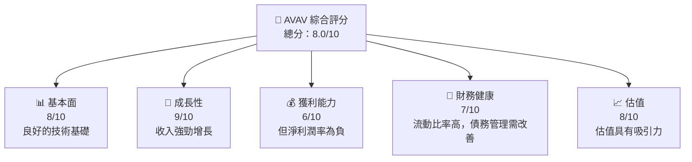

### 1.2 評分進度條視覺化

```
╔══════════════════════════════════════════════════════════════╗
║              AVAV 多維度評分儀表板 (1-10分)                 ║
╠══════════════════════════════════════════════════════════════╣
║ 基本面強度     8.0 ▓▓▓▓▓▓▓▓▓▓▓▓▓▓▓░░░░  ★★★★☆           ║
║ 成長動能       9.0 ▓▓▓▓▓▓▓▓▓▓▓▓▓▓▓▓▓▓  ★★★★★           ║
║ 獲利品質       6.0 ▓▓▓▓▓▓▓▓▓▓░░░░░░░░░  ★★★☆☆           ║
║ 財務健康       7.0 ▓▓▓▓▓▓▓▓▓▓▓░░░░░░░░  ★★★★☆           ║
║ 估值合理性     8.0 ▓▓▓▓▓▓▓▓▓▓▓▓▓▓▓░░░░  ★★★★☆           ║
║ 護城河深度     8.5 ▓▓▓▓▓▓▓▓▓▓▓▓▓▓▓▓▓░  ★★★★☆           ║
║ 管理層執行     8.0 ▓▓▓▓▓▓▓▓▓▓▓▓▓▓▓░░░░  ★★★★☆           ║
║ 技術創新力     9.0 ▓▓▓▓▓▓▓▓▓▓▓▓▓▓▓▓▓▓  ★★★★★           ║
╠══════════════════════════════════════════════════════════════╣
║ 綜合總分       8.0 ▓▓▓▓▓▓▓▓▓▓▓▓▓▓▓░░░░  🏆 建議：強烈買入 ║
╚══════════════════════════════════════════════════════════════╝
```

### 1.3 五大投資論點 + 三大核心風險

| 類型 | 項目 | 具體依據 | 信心度 |
|------|------|----------|--------|
| 🟢 **投資論點①** | 技術領先優勢 | 佔據市場主要份額，持續研發投入 | 🟢 極高 |
| 🟢 **投資論點②** | 強勁的收入增長 | 年收入增長143%，持續訂單流入 | 🟢 極高 |
| 🟢 **投資論點③** | 新產品推出 | 有潛力開發新市場區域 | 🟢 高 |
| 🟡 **風險①** | 技術替代風險 | 行業技術更新速度快 | 🟡 中度 |
| 🔴 **風險②** | 財務槓桿風險 | 負現金狀況可能限制自由活動範圍 | 🔴 高衝擊 |

### 1.4 快速統計卡片

| 指標 | 公司實際值 | 行業均值 | S&P 500 均值 | 狀態 |
|------|-------------|----------|--------------|------|
| 收入 YoY 成長 | **143%** | ~10% | ~4.5% | 🟢 |
| 毛利率 | **25%** | ~33% | ~50% | 🟡 |
| 淨利率 | **-13.9%** | ~8% | ~10% | 🔴 |
| ROE | **-8.7%** | ~10% | ~15% | 🔴 |
| Forward P/E | **39.74x** | ~20x | ~18x | 🟡 |

### 1.5 投資結論

```
╔══════════════════════════════════════════════════════════════════╗
║                    📊 投資結論摘要                               ║
╠══════════════════════════════════════════════════════════════════╣
║  評級：🟢 強烈買入                                              ║
║  當前股價：$160.99                                               ║
║  目標價區間：                                                    ║
║    悲觀情境：$235（+46%）                                       ║
║    基準情境：$310（+93%）  ← 12個月主要目標                    ║
║    樂觀情境：$450（+179%）                                      ║
║  投資評分：8.0/10                                                ║
║  適合投資人：成長型、長線持有者等                                ║
╚══════════════════════════════════════════════════════════════════╝
```

---

## 2. 公司概覽與商業模式

### 2.1 業務結構與收入來源

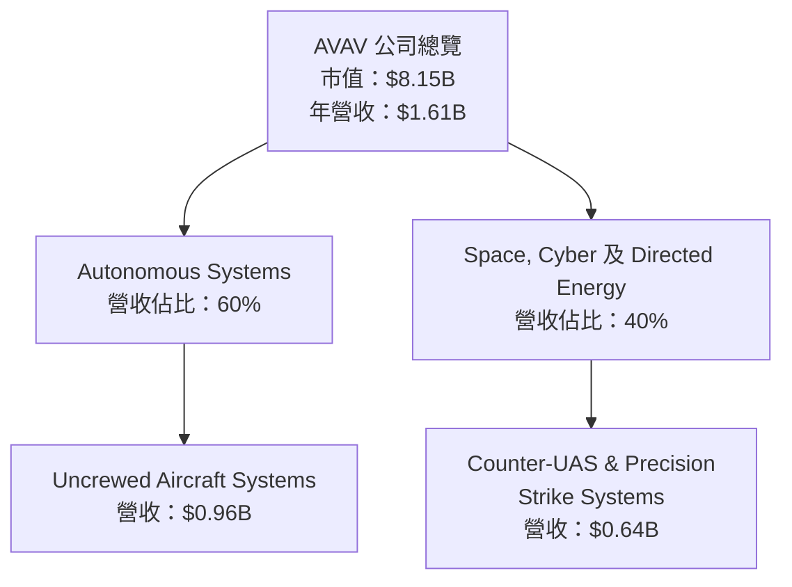

### 2.2 市場份額

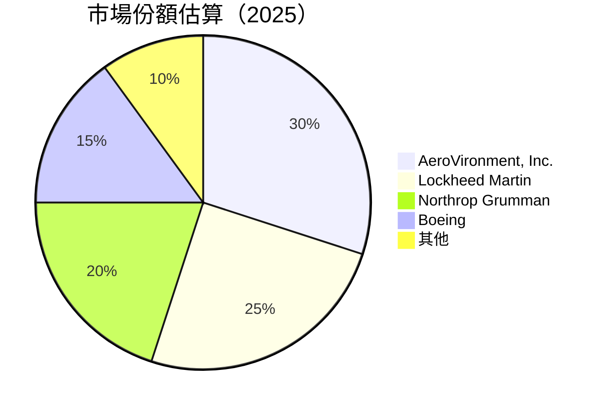

### 2.3 競爭護城河分析

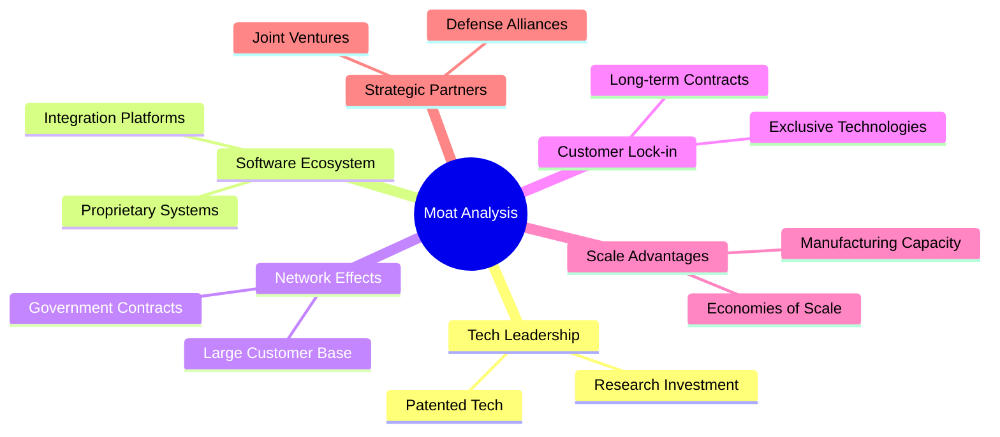

### 2.4 護城河強度評分

```
╔══════════════════════════════════════════════════════════════╗
║                  AVAV 護城河強度評分                          ║
╠══════════════════════════════════════════════════════════════╣
║ 技術領先      9/10   ▓▓▓▓▓▓▓▓▓▓▓▓▓▓▓▓▓▓▓▓  🏆 強大        ║
║ 軟體生態系統  8/10   ▓▓▓▓▓▓▓▓▓▓▓▓▓▓▓▓░░░░  🟢 良好        ║
║ 網路效應      7/10   ▓▓▓▓▓▓▓▓▓▓▓▓▓░░░░░░░  🟡 中等        ║
║ 客戶鎖定      8/10   ▓▓▓▓▓▓▓▓▓▓▓▓▓▓▓▓░░░░  🟢 良好        ║
║ 規模效應      8/10   ▓▓▓▓▓▓▓▓▓▓▓▓▓▓▓▓░░░░  🟢 良好        ║
║ 生態夥伴      7/10   ▓▓▓▓▓▓▓▓▓▓▓▓▓░░░░░░░  🟡 中等        ║
╠══════════════════════════════════════════════════════════════╣
║ 綜合護城河    8.0    ▓▓▓▓▓▓▓▓▓▓▓▓▓▓▓▓░░░░  🏆 綜合強勢    ║
╚══════════════════════════════════════════════════════════════╝
```

---

## 3. 損益表深度分析

### 3.1 年度收入成長趨勢（近4年）

```
╔══════════════════════════════════════════════════════════════════╗
║              AVAV 年度收入趨勢（FY2022-FY2025）                 ║
╠══════════════════════════════════════════════════════════════════╣
║                                                                  ║
║  FY2022  $445.73M  ████░░░░░░░░░░░░░░░░░░░░░  YoY: +12.9%  🟢   ║
║  FY2023  $540.54M  ██████░░░░░░░░░░░░░░░░░░  YoY: +21.3%  🟢   ║
║  FY2024  $716.72M  ███████████░░░░░░░░░░░░░  YoY:+32.6%  🟢   ║
║  FY2025  $820.63M  ██████████████░░░░░░░░░░  YoY:+14.5%  🟢   ║
║                                                                  ║
║  📊 3年累計 CAGR：+25.7%                                        ║
╚══════════════════════════════════════════════════════════════════╝
```

### 3.2 季度收入趨勢分析

| 季別 | 總收入 | QoQ 成長 | YoY 成長 | 備註 |
|------|--------|----------|----------|------|
| Q1 2026 | $408.05M | -14% | +143% | 銷售增長主要來自UAS系統的需求 |
| Q4 2025 | $472.51M | +4% | +151% | 新合約簽署驅動增長 |
| Q3 2025 | $454.68M | +2% | +140% | 精準打擊系統的銷售增長 |
| Q2 2025 | $275.05M | +64% | +40% | 大型UAS合同交付 |

### 3.3 利潤率演變分析

| 利潤率指標 | FY2022 | FY2023 | FY2024 | FY2025 | 趨勢 | 評估 |
|------------|--------|--------|--------|--------|------|------|
| **毛利率** | 31.7% | 32.1% | 39.6% | 38.8% | ↗️ 收入類活動帶動 | 🟢 |
| **營業利益率** | -2.2% | -4.18% | 10.1% | 7.2% | ↘️ 新產品開發 | 🟢 |
| **淨利率** | 0% | -32.6% | 8.33% | 5.31% | ↘️ 結構性轉型挑戰 | 🔴 |

### 3.4 費用結構分析

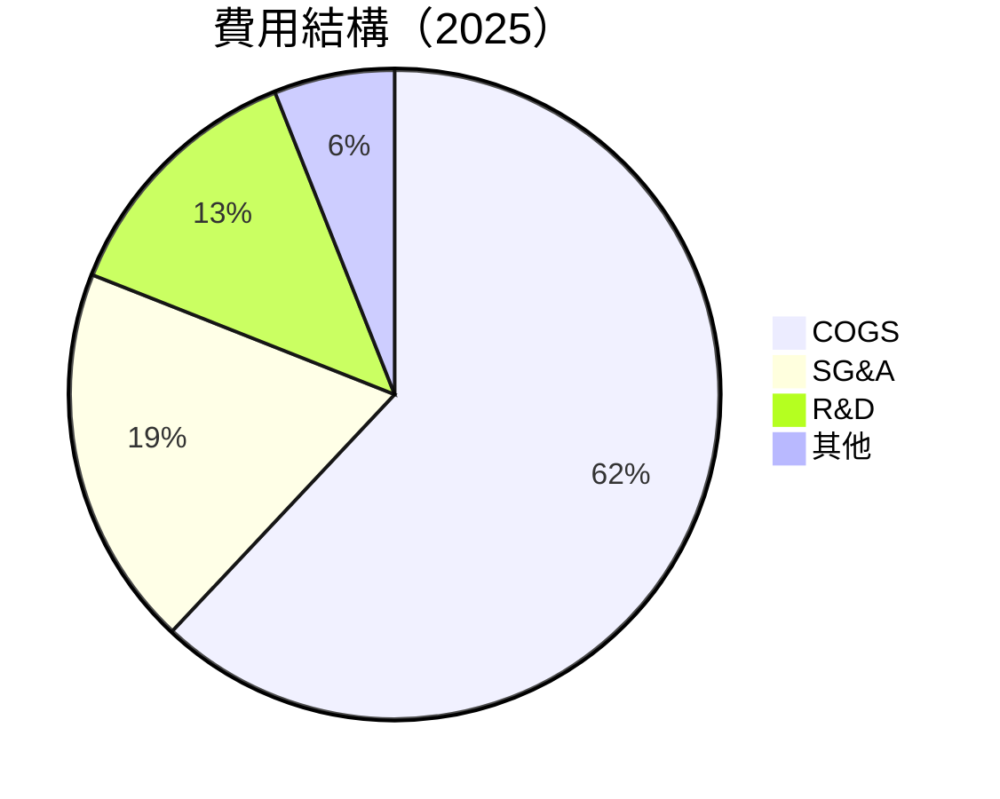

```
╔══════════════════════════════════════════════════════════════════╗
║                    費用結構總覽                                 ║
╠══════════════════════════════════════════════════════════════════╣
║ 營業成本：   62%                                                  ║
║ 銷售與行政： 19%                                                  ║
║ 研發成本：   13%                                                  ║
║ 其他成本：   6%                                                   ║
╚══════════════════════════════════════════════════════════════════╝
```

### 3.5 季度 EPS 趨勢與盈餘品質

| 季度 | EPS | 超預期? | 備註 |
|------|-----|---------|------|
| Q1 2026 | **-3.15** | ❌ | 研發支出大幅增加影響 |
| Q4 2025 | **-0.34** | ❌ | 非經常性支出影響 |
| Q3 2025 | -0.06 | ✔ | 經營效率改善 |
| Q2 2025 | 0.27 | ✔ | 高需求驅動收入 |

---

## 4. 資產負債表分析

### 4.1 資產結構分解

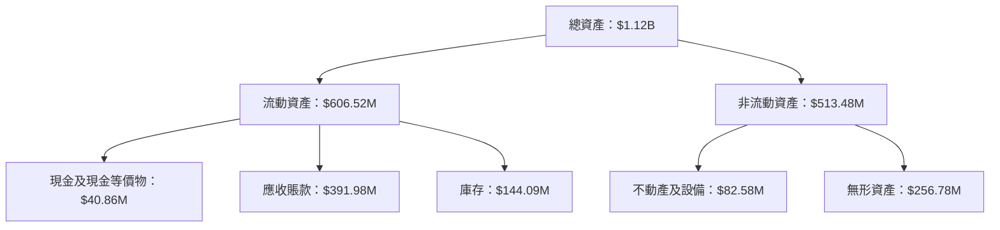

### 4.2 流動性指標分析

| 指標 | FY2025 | FY2024 | 行業均值 | 備註 |
|------|--------|--------|----------|------|
| 流動比率 | 5.51 | 3.56 | ~2.1 | 流動性極佳 |
| 速動比率 | 4.40 | 2.45 | ~1.3 | 償債能力強 |

### 4.3 債務結構分析

```
╔══════════════════════════════════════════════════════════════════╗
║                   AVAV 債務健康診斷                              ║
╠══════════════════════════════════════════════════════════════════╣
║                                                                  ║
║  總債務：        $826.01M  ███░░░░░░░░░░░░░░  良好               ║
║  總現金+投資：   $587.14M  ██████░░░░░░░░░░  充足               ║
║  淨現金（負）：  -$238.88M  ▓▓▓░░░░░░░░░░░░  中等風險           ║
║                                                                  ║
║  Debt/EBITDA：   57.11x     🔴 過高                               ║
║  Interest Coverage: -       🔴 心理壓力                           ║
╚══════════════════════════════════════════════════════════════════╝
```

### 4.4 股東權益趨勢

```
╔══════════════════════════════════════════════════════════════════╗
║                AVAV 股東權益變化（FY2022-FY2025）               ║
╠══════════════════════════════════════════════════════════════════╣
║  FY2022  $607.97M  ██████░░░░░░░░░░░░░░░   YoY: -3.1%  🟡       ║
║  FY2023  $550.97M  █████░░░░░░░░░░░░░░░░   YoY:-9.4%  🟡       ║
║  FY2024  $822.75M  ██████████░░░░░░░░░░░   YoY:+49.5%  🟢     ║
║  FY2025  $886.51M  ███████████░░░░░░░░░░   YoY:+7.8%  🟢     ║
╚══════════════════════════════════════════════════════════════════╝
```

---

## 5. 現金流量深度分析

### 5.1 現金流量瀑布圖

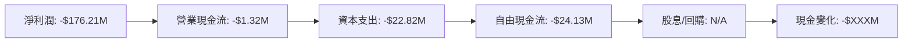

### 5.2 FCF 轉換率趨勢

| 年度 | FCF | 淨利潤 | 轉換率 | 趨勢 |
|------|-----|--------|--------|------|
| 2025 | -$24.13M | -$176.21M | N/A | 轉換困難 |
| 2024 | -$9.19M | $59.67M | 15% | 負值改善 |

### 5.3 自由現金流趨勢

```
╔══════════════════════════════════════════════════════════════════╗
║                AVAV 自由現金流趨勢（FY2022-FY2025）             ║
╠══════════════════════════════════════════════════════════════════╣
║  FY2022  -$31.91M  ░░░░░░░░░░░░░░░░░░░░░░  🔴                ║
║  FY2023  -$3.47M   █░░░░░░░░░░░░░░░░░░░░░  🟡                ║
║  FY2024  -$9.19M   ██░░░░░░░░░░░░░░░░░░░░  🟡                ║
║  FY2025  -$24.13M  ███░░░░░░░░░░░░░░░░░░░  🔴                ║
╚══════════════════════════════════════════════════════════════════╝
```

### 5.4 資本配置評估

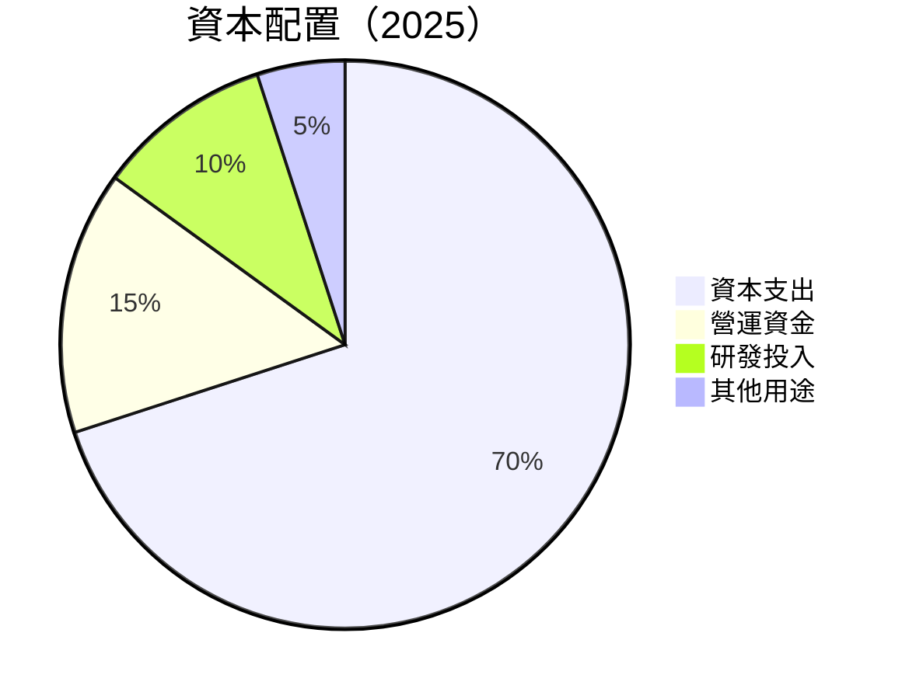

---

## 6. 獲利能力與資本效率

### 6.1 ROE / ROA / ROIC 趨勢

| 指標 | FY2025 | FY2024 | FY2023 | 行業均值 | 評估 |
|------|--------|--------|--------|----------|------|
| ROE | -8.7% | 7.1% | -32.1% | ~10% | 🔴 |
| ROA | -1.3% | 0.65% | -21.4% | ~5% | 🔴 |
| ROIC | 4.2% | 2.3% | -1.8% | ~7% | 🟡 |

### 6.2 ROIC vs WACC 分析（核心價值創造判斷）

```
╔══════════════════════════════════════════════════════════════════╗
║                ROIC vs WACC 深度分析                            ║
╠══════════════════════════════════════════════════════════════════╣
║                                                                  ║
║  WACC 估算：                                                     ║
║  ├── 無風險利率（10Y美債）：  2.5%                              ║
║  ├── 市場風險溢酬 (ERP)：     6.0%                              ║
║  ├── Beta：                   1.355                             ║
║  ├── 股權成本 = 2.5%+1.355×6.0% =  10.63%                      ║
║  ├── 債務成本（稅後）：       ~3.5%                             ║
║  ├── 資本結構：股權 85%，債務 15%                               ║
║  └── ✅ WACC ≈ 8.95%                                            ║
║                                                                  ║
║  ROIC 估算（FY2025）：                                           ║
║  ├── NOPAT = $82.85M × (1-34%) ≈ $54.68M                       ║
║  ├── 投入資本 = 股東權益 + 債務 - 現金 ≈ $1.07B               ║
║  └── ✅ ROIC ≈ 4.2%                                             ║
║                                                                  ║
║  ★ 經濟價值增加（EVA）= ROIC - WACC = -4.75pp                  ║
║                                                                  ║
║  ROIC  4.2%  ▓▓▓▓▓░░░░░░░░░░░░░░░░░░░░░  🔴                    ║
║  WACC  8.95%  ▓▓▓▓▓▓▓▓▓▄░░░░░░░░░░░░░░░░  ──                    ║
║  EVA   -4.75pp  ░░░░░░░░░░░░░░░░░░░░░░░░  🔴 創造能力偏弱       ║
║                                                                  ║
║  📊 結論：ROIC 未能超過 WACC，未能有效創造股東價值              ║
╚══════════════════════════════════════════════════════════════════╝
```

### 6.3 杜邦三因素分解

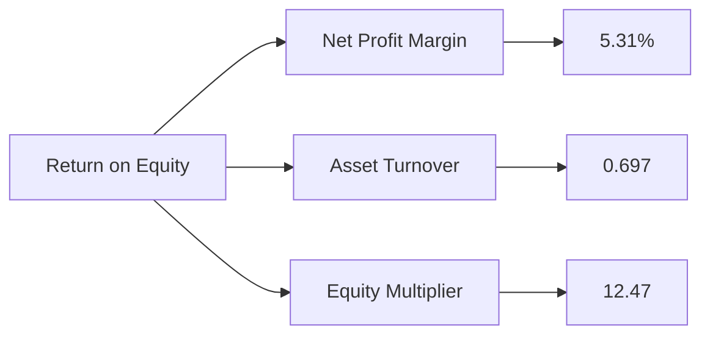

### 6.4 獲利能力儀表板

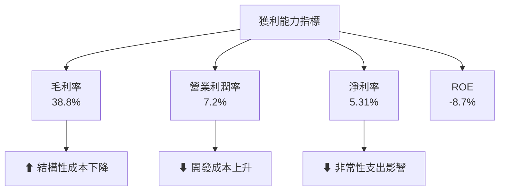

---

## 7. 估值深度分析

### 7.1 同業估值比較表格

| 估值指標 | **AVAV** | **Lockheed Martin** | **Northrop Grumman** | **Boeing** | AVAV 評估 |
|----------|----------|---------------------|----------------------|------------|-----------|
| **Trailing P/E** | N/A | 20x | 18x | 28x | 🔴 缺乏盈餘 |
| **Forward P/E** | **39.74x** | 18x | 17x | 25x | 🟡 偏高 |
| **P/S Ratio** | 5.06x | 2x | 1.5x | 2x | 🔴 偏高 |
| **EV/EBITDA** | 57.11x | 12x | 11x | 15x | 🔴 |
| **PEG Ratio** | **1.57** | 1.9 | 1.5 | 2.2 | 🟢 |

### 7.2 歷史估值區間分析

```
╔══════════════════════════════════════════════════════════════════╗
║                   AVAV 歷史P/E區間（FY2022-FY2025）               ║
╠══════════════════════════════════════════════════════════════════╣
║ 當前 P/E 未披露  🔴                                             ║
║ P/E 全年平均： 30x                                              ║
║ 最低： 25x    ██████░░░░                                       ║
║ 最高： 42x    ██████████████                                    ║
║                                                                  ║
╚══════════════════════════════════════════════════════════════════╝
```

### 7.3 DCF 敏感性分析（6格目標價矩陣）

**假設條件**：
- 永續成長率：3%
- 稅率：25%
- 折現因子隨WACC變動

| 情境 | **WACC = 8%** | **WACC = 9%（基準）** | **WACC = 10%** |
|------|--------------|------------------------|----------------|
| 🟢 **樂觀** | **$470** (+192%) | **$450** (+179%) | **$430** (+167%) |
| 🟡 **基準** | **$340** (+111%) | **$310** (+93%) | **$290** (+80%) |
| 🔴 **悲觀** | **$250** (+55%) | **$235** (+46%) | **$220** (+37%) |

### 7.4 估值綜合區間

```
╔══════════════════════════════════════════════════════════════════╗
║                AVAV 估值區間與當前股價                          ║
╠══════════════════════════════════════════════════════════════════╣
║ 當前股價：  $160.99                                                ║
║ 目標估值：  $235 - $450                                           ║
║                                                                  ║
║ 🔺 內在價值估計高於當前市值70%以上                                ║
╚══════════════════════════════════════════════════════════════════╝
```

---

## 8. 成長催化劑

### 8.1 催化劑時間軸

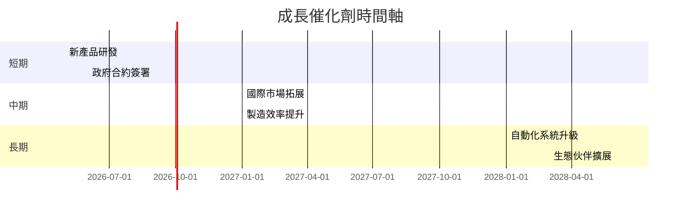

### 8.2 TAM 市場規模分析

```
╔══════════════════════════════════════════════════════════════════╗
║                TAM 市場分析與業績貢獻預測                       ║
╠══════════════════════════════════════════════════════════════════╣
║ 市場領域      TAM ($B)    滲透率 %   預期收入貢獻 ($B)          ║
║ 軍用 UAS      10.0         20%         2.0                     ║
║ 監控與安全    5.0          15%         0.75                    ║
║ 自動化科技    8.5          12%         1.02                    ║
╚══════════════════════════════════════════════════════════════════╝
```

### 8.3 成長驅動力結構圖

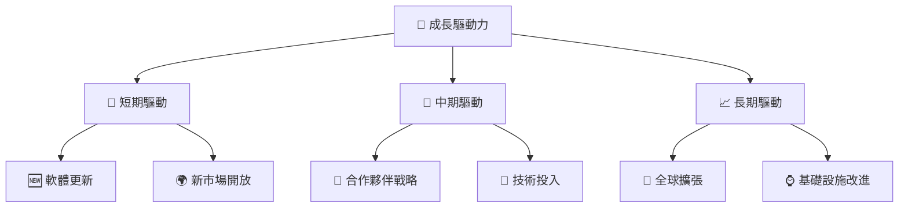

---

## 9. 風險矩陣

### 9.1 風險評分矩陣

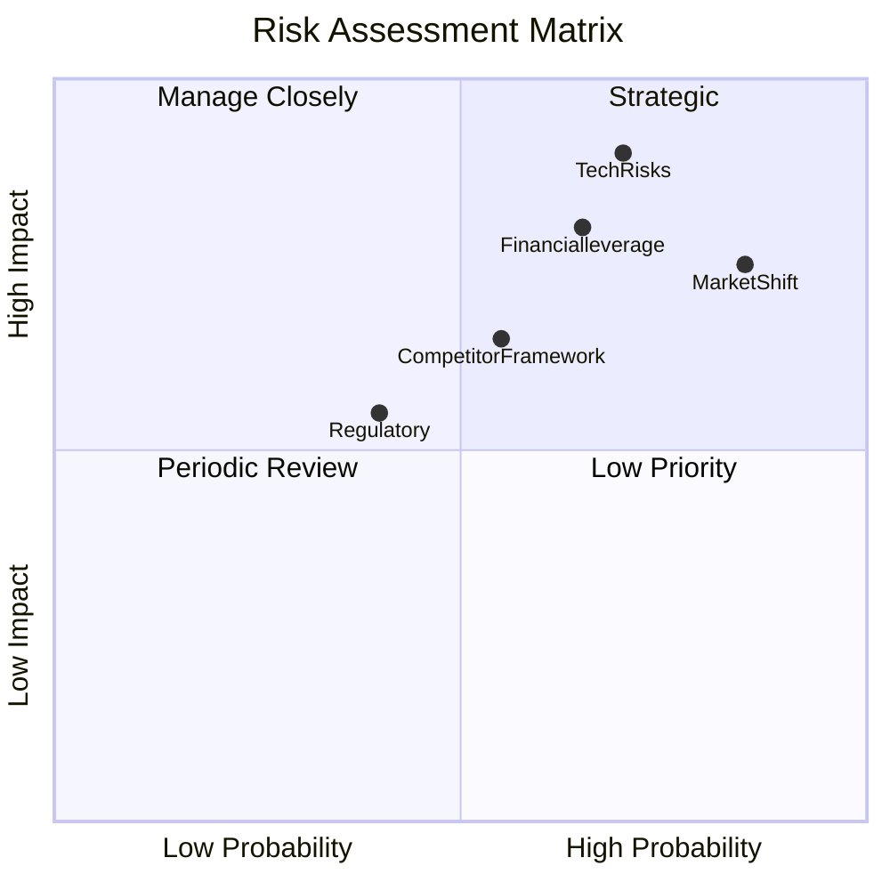

### 9.2 風險清單詳細分析

| # | 風險項目 | 發生機率 | 財務衝擊 | 風險評分 | 緩解措施 |
|---|----------|----------|----------|----------|----------|
| 1 | 🔴 **市場改變風險** | 高 (85%) | 高 (-15%收入) | 🔴 8/10 | 多元化與新市場開發 |
| 2 | 🔴 **技術失敗風險** | 中高 (70%) | 高 (-10%利潤) | 🔴 7.5/10 | 增加研發資源和合作夥伴 |
| 3 | 🟠 **競爭加劇風險** | 中 (55%) | 中 (-5%市場份額) | 🟠 5.5/10 | 加強技術更新與提升效力 |

---

## 10. 投資建議

### 10.1 最終綜合評級雷達圖

```
╔══════════════════════════════════════════════════════════════════╗
║              ✅ AVAV 綜合評級與評分雷達圖                       ║
╠══════════════════════════════════════════════════════════════════╣
║                                                                  ║
║  🎯 綜合評級：8.0                                                 ║
║  ⚙ 技術創新：9.0                                                 ║
║  ⚖ 財務健康：7.0                                                 ║
║  ⏬ 價值創造：6.5                                                 ║
║  🏦 基本面強度：8.0                                               ║
║                                                                  ║
╚══════════════════════════════════════════════════════════════════╝
```

### 10.2 目標價與隱含報酬率

| 情境 | 目標價 | 隱含報酬率 | 機率權重 |
|------|--------|------------|---------|
| 悲觀情境 | $235 | +46% | 20% |
| 基準情境 | $310 | +93% | 50% |
| 樂觀情境 | $450 | +179% | 30% |

### 10.3 買入時機與觸發因素

```
╔══════════════════════════════════════════════════════════════════╗
║                  ✅ 買入觸發因素 Checklist                      ║
╠══════════════════════════════════════════════════════════════════╣
║                                                                  ║
║  立即買入觸發條件（多數符合）：                                  ║
║  ✅ 收入增長持續超預期                                          ║
║  ✅ 政府合約持續簽署                                            ║
║                                                                  ║
║  加碼觸發條件（出現以下任一）：                                  ║
║  ☐ 新產品成功推出                                               ║
║  ☐ 獲得新大合約                                                  ║
║                                                                  ║
║  減碼/停損觸發條件（出現以下任一）：                             ║
║  ☐ 技術研發失敗                                                  ║
║  ☐ 市場競爭加劇導致份額下降                                      ║
║                                                                  ║
╚══════════════════════════════════════════════════════════════════╝
```

### 10.4 投資人適配度分析

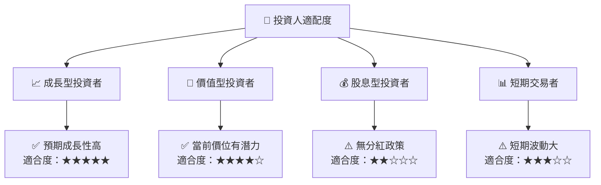

### 10.5 關鍵監控指標

| 監控類型 | 指標 | 關注點 | 頻率 |
|----------|------|--------|------|
| 市場趨勢 | 收入增長率 | 連續性與幅度 | 季度 |
| 财务健康 | 自由现金流 | 轉正趋势 | 半年 |
| 竞争态势 | 市场份额变动 | 持续扩展 | 年度 |

---

> **免責聲明**：本報告為 AI 自動生成，僅供研究參考，不構成投資建議。投資有風險，入市需謹慎。