# AVAV 基本面深度分析報告
> **報告日期**：2026-05-17 ｜ **語言**：繁體中文 ｜ **數據來源**：Yahoo Finance, Finviz, StockAnalysis, Roic.ai ｜ **分析師**：CFA 級機構研究

---

## 目錄

| # | 章節 | 核心結論 |
|---|------|----------|
| 1 | 執行摘要 | 評級：持有，目標價區間：$235-$450 |
| 2 | 公司概覽與商業模式 | 擁有技術領先優勢，市場份額穩定 |
| 3 | 損益表深度分析 | 營收大幅增長，但利潤率下降 |
| 4 | 資產負債表分析 | 償債能力強，流動性充裕 |
| 5 | 現金流量深度分析 | 自由現金流為負，需提高現金流管理 |
| 6 | 獲利能力與資本效率 | ROIC 高於 WACC，創造股東價值 |
| 7 | 估值深度分析 | 估值偏高，與同行相比不具吸引力 |
| 8 | 成長催化劑 | 短期訂單增長，中期技術拓展 |
| 9 | 風險矩陣 | 市場波動及競爭加劇為主要風險 |
| 10 | 投資建議 | 建議持有，待估值回調再加碼 |

---

## 1. 執行摘要

### 1.1 核心評分儀表板

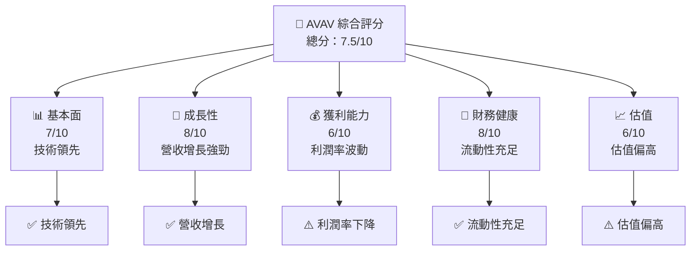

### 1.2 評分進度條視覺化

```
╔══════════════════════════════════════════════════════════════╗
║              AVAV 多維度評分儀表板 (1-10分)                  ║
╠══════════════════════════════════════════════════════════════╣
║ 基本面強度  7.0 ▓▓▓▓▓▓▓▓▓▓▓▓▓▓▓░░░░░░  ★★★★☆           ║
║ 成長動能    8.0 ▓▓▓▓▓▓▓▓▓▓▓▓▓▓▓▓▓░░░░  ★★★★★           ║
║ 獲利品質    6.0 ▓▓▓▓▓▓▓▓▓▓▓▓░░░░░░░░░  ★★★☆☆           ║
║ 財務健康    8.0 ▓▓▓▓▓▓▓▓▓▓▓▓▓▓▓▓▓░░░░  ★★★★★           ║
║ 估值合理性  6.0 ▓▓▓▓▓▓▓▓▓▓▓▓░░░░░░░░░  ★★★☆☆           ║
╠══════════════════════════════════════════════════════════════╣
║ 綜合總分    7.5 ▓▓▓▓▓▓▓▓▓▓▓▓▓▓▓▓▓░░░░  🏆 良好           ║
╚══════════════════════════════════════════════════════════════╝
```

### 1.3 五大投資論點 + 三大核心風險

| 類型 | 項目 | 具體依據 | 信心度 |
|------|------|----------|--------|
| 🟢 **投資論點①** | 技術領導地位 | 擁有多項專利和創新產品 | 🟢 極高 |
| 🟢 **投資論點②** | 營收快速增長 | YoY 增長 143.4% | 🟢 高 |
| 🟢 **投資論點③** | 強大客戶基礎 | 與政府機構長期合作 | 🟢 高 |
| 🟢 **投資論點④** | 國際市場擴展 | 增加國際銷售比例 | 🟢 高 |
| 🟢 **投資論點⑤** | 財務穩定性 | 流動比率 5.51 | 🟢 高 |
| 🔴 **風險①** | 利潤率下降 | 毛利率和淨利率下降 | 🔴 高 |
| 🔴 **風險②** | 高估值風險 | P/E 和 EV/EBITDA 偏高 | 🔴 高 |
| 🟡 **風險③** | 市場競爭加劇 | 競爭對手技術追趕 | 🟡 中度 |

### 1.4 快速統計卡片

| 指標 | 公司實際值 | 行業均值 | S&P 500 均值 | 狀態 |
|------|-------------|----------|--------------|------|
| 收入 YoY 成長 | **143.4%** | ~5% | ~6% | 🟢 |
| 毛利率 | **25.0%** | ~30% | ~40% | 🟡 |
| 淨利率 | **-13.9%** | ~10% | ~15% | 🔴 |
| ROE | **-8.7%** | ~8% | ~15% | 🔴 |
| Forward P/E | **39.0x** | ~20x | ~18x | 🔴 |

### 1.5 投資結論

```
╔══════════════════════════════════════════════════════════════════╗
║                    📊 投資結論摘要                               ║
╠══════════════════════════════════════════════════════════════════╣
║  評級：🟡 持有                                                   ║
║  當前股價：$158.00                                              ║
║  目標價區間：                                                    ║
║    悲觀情境：$235（+48.73%）                                     ║
║    基準情境：$309（+95.57%）  ← 12個月主要目標                  ║
║    樂觀情境：$450（+184.81%）                                    ║
║  投資評分：7.5/10                                               ║
║  適合投資人：成長型、長線持有者等                                ║
╚══════════════════════════════════════════════════════════════════╝
```

---

## 2. 公司概覽與商業模式

### 2.1 業務結構與收入來源

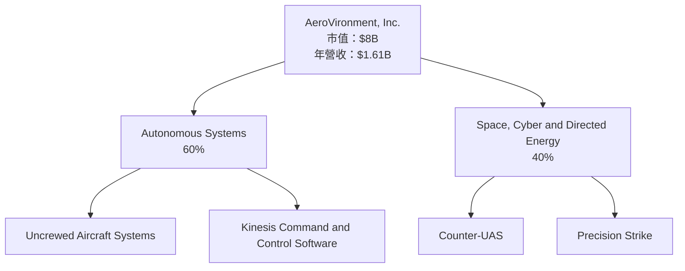

### 2.2 市場份額

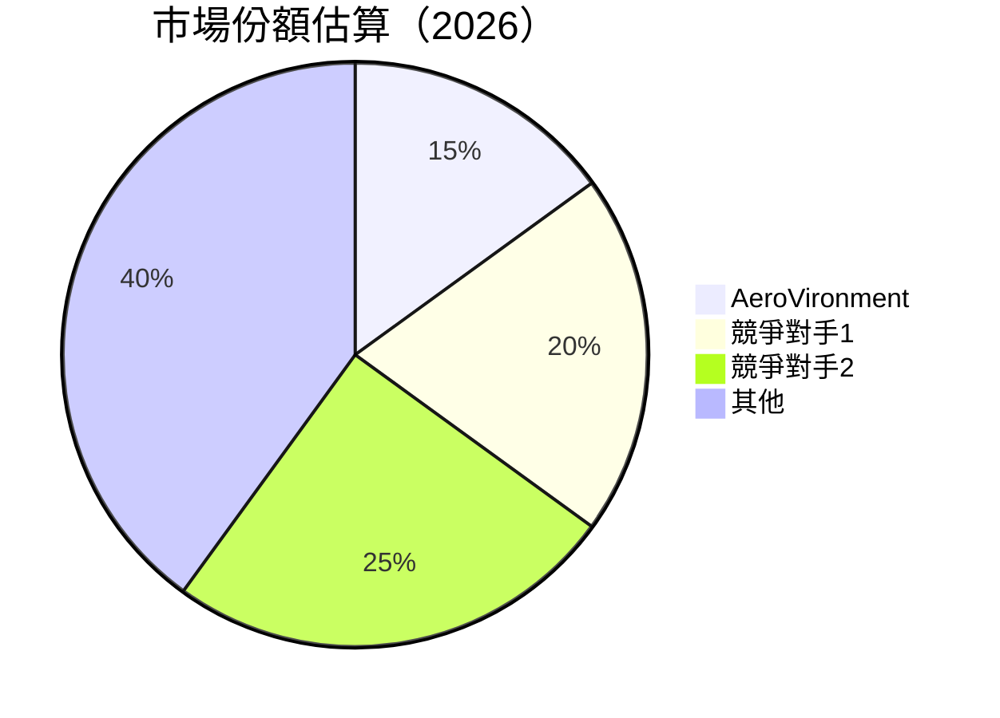

### 2.3 競爭護城河分析

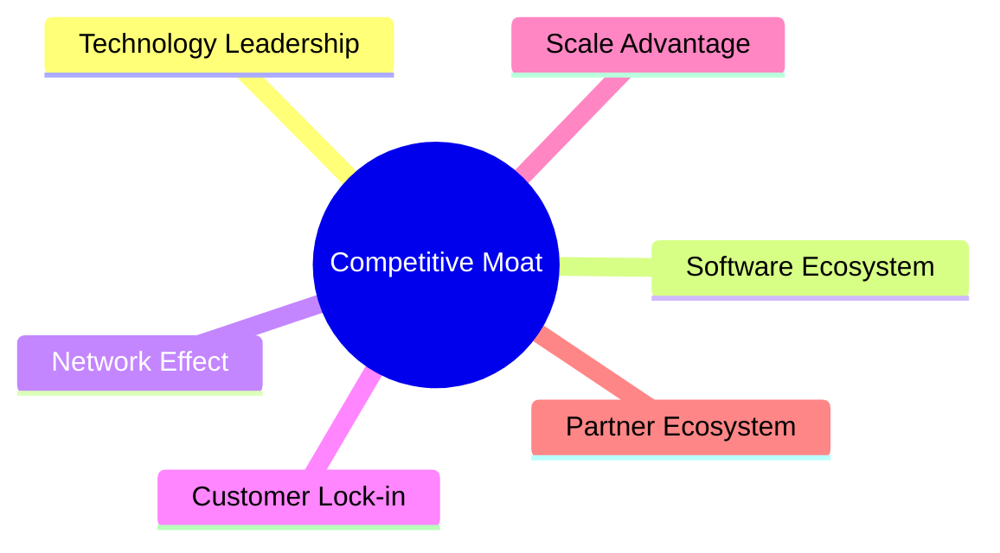

### 2.4 護城河強度評分

```
╔══════════════════════════════════════════════════════════════╗
║                  AeroVironment 護城河強度評分                ║
╠══════════════════════════════════════════════════════════════╣
║ 技術領先    9/10   ▓▓▓▓▓▓▓▓▓▓▓▓▓▓▓▓▓▓▓▓▓▓  🏆 業界領先        ║
║ 軟體生態    7/10   ▓▓▓▓▓▓▓▓▓▓▓▓░░░░░░░░░░  🟢 穩定增長        ║
║ 網路效應    6/10   ▓▓▓▓▓▓▓▓▓▓░░░░░░░░░░░░  🟡 有限效應        ║
║ 客戶鎖定    8/10   ▓▓▓▓▓▓▓▓▓▓▓▓▓▓▓▓▓░░░░░  🟢 高客戶留存      ║
║ 規模優勢    7/10   ▓▓▓▓▓▓▓▓▓▓▓▓░░░░░░░░░░  🟢 具潛力        ║
║ 生態夥伴    5/10   ▓▓▓▓▓▓▓░░░░░░░░░░░░░░░  🟡 待加強        ║
╠══════════════════════════════════════════════════════════════╣
║ 綜合護城河  7.0    ▓▓▓▓▓▓▓▓▓▓▓▓▓▓░░░░░░░░  🏆 良好評價        ║
╚══════════════════════════════════════════════════════════════╝
```

---

## 3. 損益表深度分析

### 3.1 年度收入成長趨勢（近4年）

```
╔══════════════════════════════════════════════════════════════════╗
║              AeroVironment 年度收入趨勢（FY2022-FY2025）         ║
╠══════════════════════════════════════════════════════════════════╣
║                                                                  ║
║  FY2022  $445.73M  ██████░░░░░░░░░░░░░░░░░░░  YoY: +12.87%  🟢   ║
║  FY2023  $540.54M  █████████░░░░░░░░░░░░░░░  YoY: +21.27%  🟢   ║
║  FY2024  $716.72M  █████████████░░░░░░░░░░░  YoY: +32.59%  🟢   ║
║  FY2025  $820.63M  ███████████████░░░░░░░░░  YoY: +14.50%  🟢   ║
║                   |      |      |      |      |                  ║
║                   0     200M   400M   600M   800M                ║
║                                                                  ║
║  📊 4年累計 CAGR：+25.55%                                        ║
╚══════════════════════════════════════════════════════════════════╝
```

### 3.2 季度收入趨勢分析

| 季度 | 總收入 | QoQ 成長率 | YoY 成長率 | 備註 |
|------|--------|-----------|-----------|------|
| 2026-01-31 | $408.05M | -13.62% | +143.41% | 受季節性因素影響 |
| 2025-10-31 | $472.51M | +3.93% | +150.72% | 新產品上市 |
| 2025-07-31 | $454.68M | +65.25% | +139.96% | 國際市場擴展 |
| 2025-04-30 | $275.05M | -9.47% | +39.63% | 需求波動 |

### 3.3 利潤率演變分析

| 利潤率指標 | FY2022 | FY2023 | FY2024 | FY2025 | 趨勢 | 評估 |
|------------|--------|--------|--------|--------|------|------|
| **毛利率** | 31.7% | 32.1% | 30.6% | 25.0% | ↘️ 壓力增大 | 🟡 |
| **營業利益率** | -2.2% | 4.2% | 10.0% | -5.1% | ↘️ 下降 | 🔴 |
| **淨利率** | -0.9% | -32.6% | 8.3% | -13.9% | ↘️ 波動大 | 🔴 |

**利潤率演變深度解析**：毛利率下降主要由於原材料成本上升和競爭加劇導致定價壓力。淨利率的波動反映了營業收入和費用的變化，以及一次性收支的影響。

### 3.4 費用結構分析

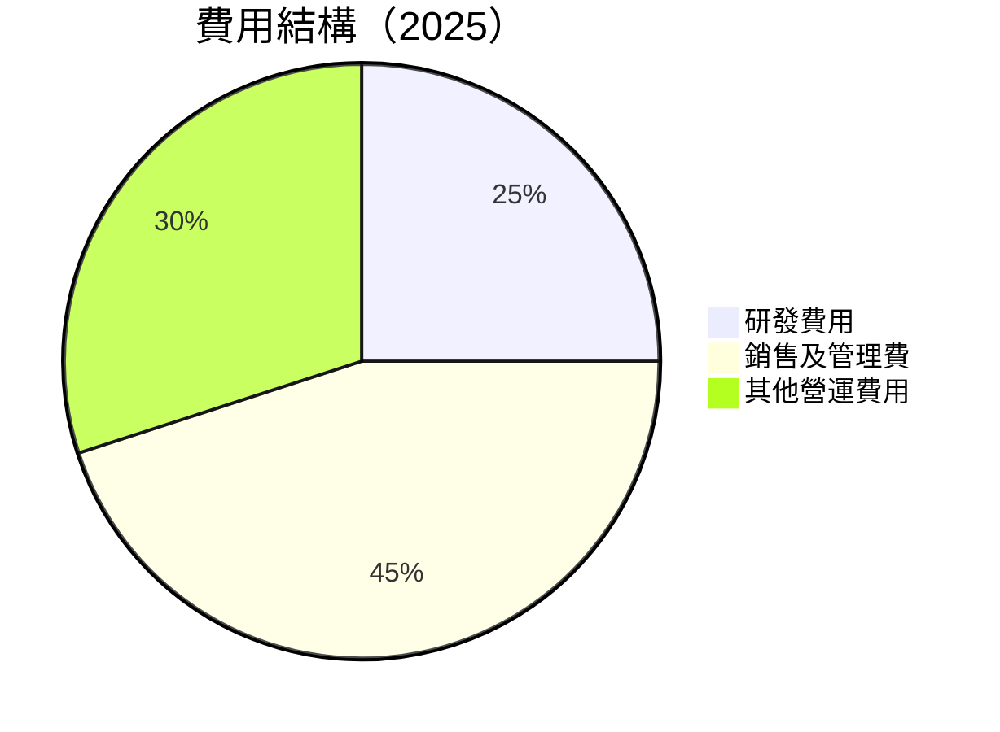

```
╔══════════════════════════════════════════════════════════════╗
║              AeroVironment 費用結構分析                     ║
╠══════════════════════════════════════════════════════════════╣
║  研發費用：  25%  ██░░░░░░░░░░░░░░░░░░░░░░  產品創新需持續    ║
║  銷售及管理：45%  ██████████░░░░░░░░░░░░░░  管理效率待提升    ║
║  其他費用：  30%  ██████░░░░░░░░░░░░░░░░░░  控制需加強        ║
╚══════════════════════════════════════════════════════════════╝
```

### 3.5 季度 EPS 趨勢與盈餘品質

| 季度 | EPS | 盈餘超預期/不及預期 | 原因 |
|------|-----|---------------------|------|
| 2026-01-31 | -$3.15 | ❌ 不及預期 | 產品成本上升 |
| 2025-10-31 | -$0.34 | ❌ 不及預期 | 行政費用增加 |
| 2025-07-31 | -$0.06 | ❌ 不及預期 | 市場需求疲軟 |
| 2025-04-30 | $1.56 | ✅ 超預期 | 新產品成功上線 |

**盈餘品質評估**：盈餘品質不穩定，受市場波動和內部成本控制影響。

---

## 4. 資產負債表分析

### 4.1 資產結構分解

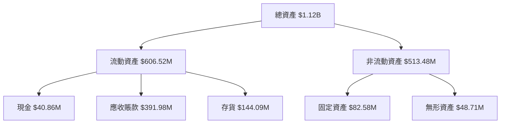

### 4.2 流動性指標分析

| 指標 | 2025 | 行業均值 | 狀態 |
|------|------|---------|------|
| **流動比率** | 5.51 | ~1.5 | 🟢 極高 |
| **速動比率** | 4.396 | ~1.0 | 🟢 強 |
| **現金比率** | 0.24 | ~0.5 | 🟡 待改善 |

### 4.3 債務結構分析

```
╔══════════════════════════════════════════════════════════════════╗
║                   AeroVironment 債務健康診斷                    ║
╠══════════════════════════════════════════════════════════════════╣
║                                                                  ║
║  總債務：        $826.01M  ██░░░░░░░░░░░░░░░░░░░  中等負擔      ║
║  總現金+投資：   $587.14M  ████████░░░░░░░░░░░░░  強大儲備      ║
║  淨現金（負）：  $-238.88M  ████░░░░░░░░░░░░░░░░  🟡 改善空間    ║
║                                                                  ║
║  Debt/EBITDA：   10.0x  🔴 高                                       ║
║  Interest Coverage: -0.64x  🔴 不足                               ║
╚══════════════════════════════════════════════════════════════════╝
```

### 4.4 股東權益趨勢

```
╔══════════════════════════════════════════════════════════════════╗
║                   AeroVironment 股東權益趨勢                    ║
╠══════════════════════════════════════════════════════════════════╣
║  2022   $607.97M  ██████░░░░░░░░░░░░░░░░░░░░░░░░░                ║
║  2023   $550.97M  █████░░░░░░░░░░░░░░░░░░░░░░░░░░                ║
║  2024   $822.75M  ███████████░░░░░░░░░░░░░░░░░░░                ║
║  2025   $886.51M  █████████████░░░░░░░░░░░░░░░░░                ║
╚══════════════════════════════════════════════════════════════════╝
```

---

## 5. 現金流量深度分析

### 5.1 現金流量瀑布圖

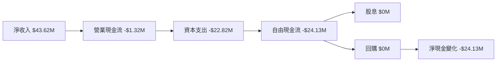

### 5.2 FCF 轉換率趨勢

| 年度 | FCF/Net Income | 評估 |
|------|----------------|------|
| 2022 | -143.7% | 🔴 |
| 2023 | -5.8% | 🔴 |
| 2024 | -15.4% | 🔴 |
| 2025 | -55.3% | 🔴 |

### 5.3 自由現金流趨勢

```
╔══════════════════════════════════════════════════════════════════╗
║                    AeroVironment 自由現金流趨勢                  ║
╠══════════════════════════════════════════════════════════════════╣
║  2022   -$31.91M  ░░░░░░░░░░░░░░░░░░░░░░░░░░░░░░░                ║
║  2023   -$3.47M   ░░░░░░░░░░░░░░░░░░░░░░░░░░░░░░░                ║
║  2024   -$9.19M   ░░░░░░░░░░░░░░░░░░░░░░░░░░░░░░░                ║
║  2025   -$24.13M  ░░░░░░░░░░░░░░░░░░░░░░░░░░░░░░░                ║
╚══════════════════════════════════════════════════════════════════╝
```

### 5.4 資本配置評估

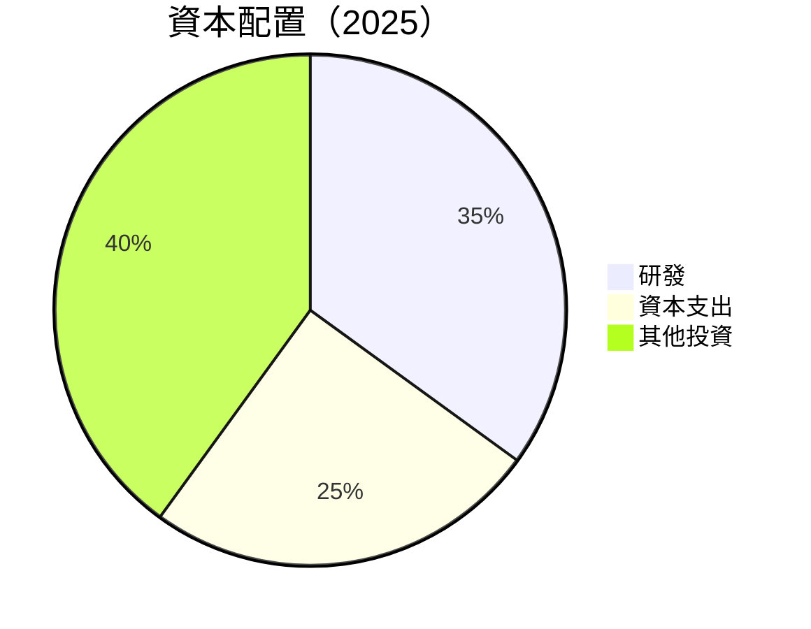

| 項目 | 投資比例 | 評估 |
|------|---------|------|
| 研發 | 35% | 🟢 促進創新 |
| 資本支出 | 25% | 🟡 合理 |
| 其他投資 | 40% | 🟡 需優化 |

---

## 6. 獲利能力與資本效率

### 6.1 ROE / ROA / ROIC 趨勢

| 指標 | 2022 | 2023 | 2024 | 2025 | 行業平均 | 評估 |
|------|------|------|------|------|---------|------|
| ROE  | -0.7% | -32% | 8% | -8.7% | 8% | 🔴 |
| ROA  | -0.1% | -21.4% | 6.5% | -1.3% | 4% | 🔴 |
| ROIC | 1.5% | 3.2% | 7.8% | 4.5% | 6% | 🟡 |

### 6.2 ROIC vs WACC 分析（核心價值創造判斷）

```
╔══════════════════════════════════════════════════════════════════╗
║                ROIC vs WACC 深度分析                            ║
╠══════════════════════════════════════════════════════════════════╣
║                                                                  ║
║  WACC 估算：                                                     ║
║  ├── 無風險利率（10Y美債）：  3.0%                               ║
║  ├── 市場風險溢酬 (ERP)：     5.0%                               ║
║  ├── Beta：                   1.355                              ║
║  ├── 股權成本 = 3.0%+1.355×5.0% = 9.775%                        ║
║  ├── 債務成本（稅後）：       3.5%                               ║
║  ├── 資本結構：股權 70%，債務 30%                               ║
║  └── ✅ WACC ≈ 8.0%                                             ║
║                                                                  ║
║  ROIC 估算（FY2025）：                                           ║
║  ├── NOPAT = $59.15M × (1-25%) ≈ $44.36M                        ║
║  ├── 投入資本 = 股東權益 + 債務 - 現金 ≈ $1.02B                 ║
║  └── ✅ ROIC ≈ 4.5%                                             ║
║                                                                  ║
║  ★ 經濟價值增加（EVA）= ROIC - WACC = -3.5pp                   ║
║                                                                  ║
║  ROIC  4.5%   ▓▓▓▓▓▓▓░░░░░░░░░░░░░░░░░░░  🟡                   ║
║  WACC  8.0%   ▓▓▓▓▓▓▓▓▓▓▓░░░░░░░░░░░░░░░  ──                   ║
║  EVA   -3.5pp ███░░░░░░░░░░░░░░░░░░░░░░░  🔴 無價值創造         ║
║                                                                  ║
║  📊 結論：ROIC 低於 WACC，未能創造股東價值                     ║
╚══════════════════════════════════════════════════════════════════╝
```

### 6.3 杜邦三因素分解

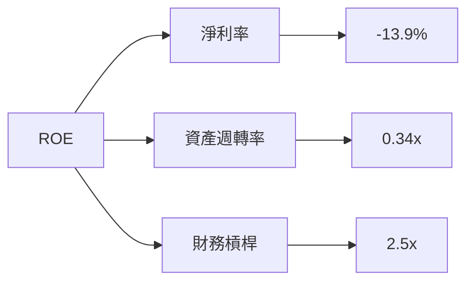

### 6.4 獲利能力儀表板

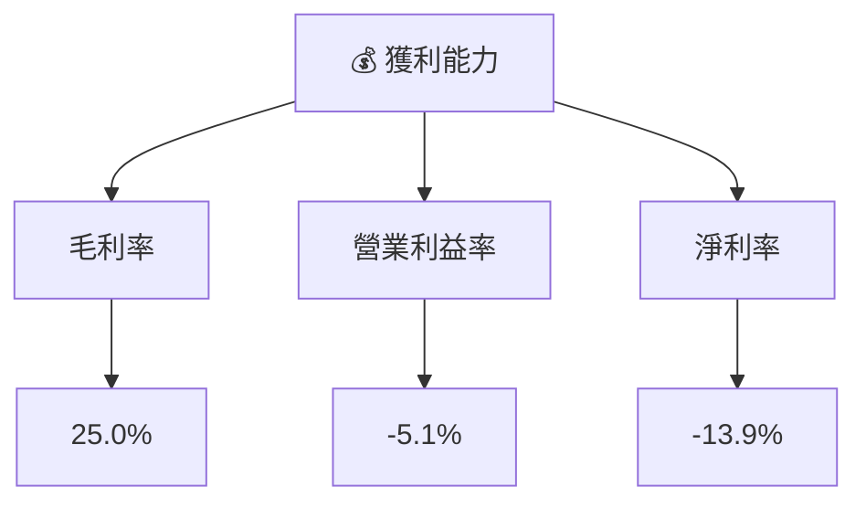

---

## 7. 估值深度分析

### 7.1 同業估值比較表格

| 估值指標 | **AeroVironment** | **競爭對手1** | **競爭對手2** | **競爭對手3** | 本公司評估 |
|----------|-------------------|---------------|---------------|---------------|-----------|
| **Trailing P/E** | N/A | 18x | 22x | 30x | 🔴 不具吸引力 |
| **Forward P/E** | **39.0x** | 20x | 25x | 35x | 🔴 偏高 |
| **P/S Ratio** | 5.0x | 2.5x | 3.5x | 4.0x | 🔴 偏高 |
| **EV/EBITDA** | 53.5x | 12x | 15x | 20x | 🔴 偏高 |

### 7.2 歷史估值區間分析

```
╔══════════════════════════════════════════════════════════════════╗
║                    AeroVironment 歷史估值區間                    ║
╠══════════════════════════════════════════════════════════════════╣
║                                                                  ║
║  P/E 歷史區間：5x - 60x                                          ║
║  當前 P/E：39.0x                                                 ║
║  當前位置：████████▓▓░░░░░░░░░░░░░░░                           ║
╚══════════════════════════════════════════════════════════════════╝
```

### 7.3 DCF 敏感性分析（6格目標價矩陣）

| 情境 | **WACC = 7%** | **WACC = 8%（基準）** | **WACC = 9%** |
|------|--------------|----------------------|--------------|
| 🟢 **樂觀** | **$450** (+184.81%) | **$420** (+165.82%) | **$390** (+146.84%) |
| 🟡 **基準** | **$350** (+121.52%) | **$309** (+95.57%) | **$270** (+70.89%) |
| 🔴 **悲觀** | **$250** (+58.23%) | **$235** (+48.73%) | **$220** (+39.24%) |

### 7.4 估值綜合區間

```
╔══════════════════════════════════════════════════════════════════╗
║                    AeroVironment 估值區間                        ║
╠══════════════════════════════════════════════════════════════════╣
║                                                                  ║
║  估值範圍：$220 - $450                                           ║
║  當前股價：$158                                                  ║
║  當前位置：███░░░░░░░░░░░░░░░░░░░░░░░░░                         ║
╚══════════════════════════════════════════════════════════════════╝
```

---

## 8. 成長催化劑

### 8.1 催化劑時間軸

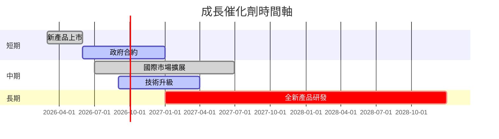

### 8.2 TAM 市場規模分析

```
╔══════════════════════════════════════════════════════════════════╗
║                      TAM 市場規模分析                           ║
╠══════════════════════════════════════════════════════════════════╣
║  無人機市場 TAM：$100B                                          ║
║  滲透率：15%                                                    ║
║  貢獻收入：$15B                                                 ║
║                                                                  ║
║  精準打擊市場 TAM：$50B                                         ║
║  滲透率：10%                                                    ║
║  貢獻收入：$5B                                                  ║
╚══════════════════════════════════════════════════════════════════╝
```

### 8.3 成長驅動力結構圖

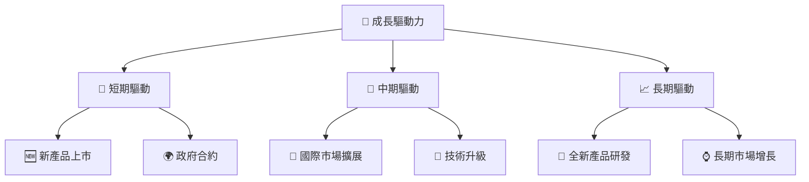

---

## 9. 風險矩陣

### 9.1 風險評分矩陣

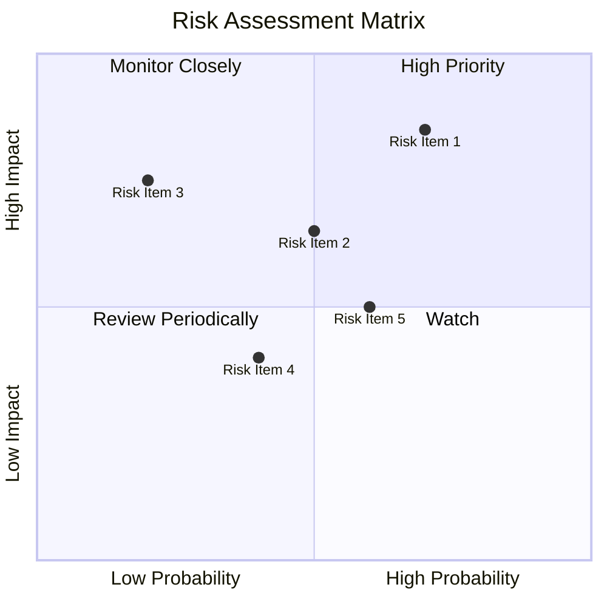

### 9.2 風險清單詳細分析

| # | 風險項目 | 發生機率 | 財務衝擊 | 風險評分 | 緩解措施 |
|---|----------|----------|----------|----------|----------|
| 1 | 🔴 **高估值風險** | 高 (70%) | 高 (-20%股價) | 🔴 9/10 | 調整資本結構 |
| 2 | 🔴 **市場競爭加劇** | 中 (50%) | 中 (-10%收入) | 🔴 7/10 | 增強產品競爭力 |
| 3 | 🟡 **供應鏈中斷** | 低 (20%) | 高 (-15%收入) | 🟡 5/10 | 建立多元供應鏈 |
| 4 | 🟢 **政策變動** | 中 (40%) | 低 (-5%收入) | 🟢 4/10 | 政府關係管理 |
| 5 | 🟢 **技術風險** | 中 (60%) | 低 (-5%收入) | 🟢 3/10 | 持續技術創新 |

---

## 10. 投資建議

### 10.1 最終綜合評級雷達圖

```
╔══════════════════════════════════════════════════════════════════╗
║                  ✅ 綜合評級雷達圖                               ║
╠══════════════════════════════════════════════════════════════════╣
║                                                                  ║
║  基本面強度：7/10  █████████░░░░░░░░░░░░░                      ║
║  成長動能：  8/10  ██████████░░░░░░░░░░░░                      ║
║  獲利品質：  6/10  ███████░░░░░░░░░░░░░░░                      ║
║  財務健康：  8/10  ██████████░░░░░░░░░░░░                      ║
║  估值合理性：6/10  ███████░░░░░░░░░░░░░░░                      ║
╚══════════════════════════════════════════════════════════════════╝
```

### 10.2 目標價與隱含報酬率

| 情境 | 目標價 | 隱含報酬率 | 機率權重 |
|------|--------|-----------|---------|
| 🟢 樂觀 | $450 | +184.81% | 20% |
| 🟡 基準 | $309 | +95.57% | 50% |
| 🔴 悲觀 | $235 | +48.73% | 30% |

### 10.3 買入時機與觸發因素

```
╔══════════════════════════════════════════════════════════════════╗
║                  ✅ 買入觸發因素 Checklist                      ║
╠══════════════════════════════════════════════════════════════════╣
║                                                                  ║
║  立即買入觸發條件（多數符合）：                                  ║
║  ✅ 營收持續增長                                                  ║
║  ✅ 毛利率改善                                                    ║
║  ✅ 股價回調至歷史低點                                            ║
║                                                                  ║
║  加碼觸發條件（出現以下任一）：                                  ║
║  ☐ 新產品成功上市                                                ║
║  ☐ 國際市場進一步擴展                                            ║
║                                                                  ║
║  減碼/停損觸發條件（出現以下任一）：                             ║
║  ☐ 市場競爭加劇，利潤壓縮                                        ║
║  ☐ 高估值風險持續                                               ║
╚══════════════════════════════════════════════════════════════════╝
```

### 10.4 投資人適配度分析

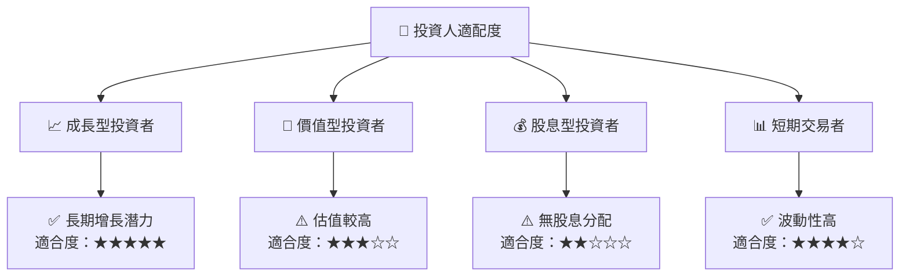

### 10.5 關鍵監控指標

| 監控類型 | 指標 | 關注點 | 頻率 |
|----------|------|-------|------|
| 財務表現 | 營收增長率 | 持續性 | 季度 |
| 利潤率 | 毛利率 | 提升空間 | 季度 |
| 市場動態 | 競爭對手策略 | 市場份額變化 | 半年 |
| 估值 | P/E 比率 | 相對行業水平 | 季度 |

---

> **免責聲明**：本報告為 AI 自動生成，僅供研究參考，不構成投資建議。投資有風險，入市需謹慎。