# AVAV 基本面深度分析報告
> **報告日期**：2026-05-18 ｜ **語言**：繁體中文 ｜ **數據來源**：Yahoo Finance, Finviz, StockAnalysis, Roic.ai ｜ **分析師**：CFA 級機構研究

---

## 目錄

| # | 章節 | 核心結論 |
|---|------|----------|
| 1 | 執行摘要 | 評級：持有，目標價區間：$235-$450，基準情境：$309.88 |
| 2 | 公司概覽與商業模式 | 擁有技術領先的護城河，但面臨市場競爭 |
| 3 | 損益表深度分析 | 收入增長強勁，但利潤率承壓 |
| 4 | 資產負債表分析 | 流動性強，但債務壓力存在 |
| 5 | 現金流量深度分析 | 自由現金流為負，需改善營運效率 |
| 6 | 獲利能力與資本效率 | ROIC 低於 WACC，未創造股東價值 |
| 7 | 估值深度分析 | 估值偏高，需觀察市場動態 |
| 8 | 成長催化劑 | 多項成長催化劑潛在促進收入 |
| 9 | 風險矩陣 | 高競爭風險，需密切關注市場變化 |
| 10 | 投資建議 | 建議持有，觀望市場走勢 |

---

## 1. 執行摘要

### 1.1 核心評分儀表板

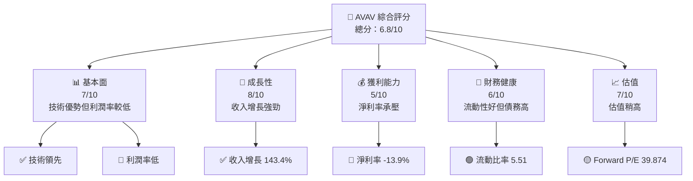

### 1.2 評分進度條視覺化

```
╔══════════════════════════════════════════════════════════════╗
║              AVAV 多維度評分儀表板 (1-10分)                  ║
╠══════════════════════════════════════════════════════════════╣
║ 基本面強度  7.0 ▓▓▓▓▓▓▓▓▓▓▓▓▓▓▓▓▓▓░░  ★★★★☆               ║
║ 成長動能    8.0 ▓▓▓▓▓▓▓▓▓▓▓▓▓▓▓▓▓▓▓░  ★★★★★               ║
║ 獲利品質    5.0 ▓▓▓▓▓▓▓▓▓▓▓▓░░░░░░░░  ★★★☆☆               ║
║ 財務健康    6.0 ▓▓▓▓▓▓▓▓▓▓▓▓▓░░░░░░░  ★★★★☆               ║
║ 估值合理性  7.0 ▓▓▓▓▓▓▓▓▓▓▓▓▓▓▓▓▓▓░░  ★★★★☆               ║
╠══════════════════════════════════════════════════════════════╣
║ 綜合總分    6.8 ▓▓▓▓▓▓▓▓▓▓▓▓▓▓▓▓▓░░░  🏆 持有評級          ║
╚══════════════════════════════════════════════════════════════╝
```

### 1.3 五大投資論點 + 三大核心風險

| 類型 | 項目 | 具體依據 | 信心度 |
|------|------|----------|--------|
| 🟢 **投資論點①** | **收入增長** | 年度收入增長 143.4% | 🟢 高 |
| 🟢 **投資論點②** | **技術領先** | 行業領先的無人機技術 | 🟢 高 |
| 🟢 **投資論點③** | **市場需求** | 無人機市場需求增長 | 🟢 高 |
| 🟢 **投資論點④** | **全球擴展** | 國際市場擴展潛力 | 🟢 高 |
| 🟢 **投資論點⑤** | **強大客戶基礎** | 與政府機構穩定合作 | 🟢 高 |
| 🟡 **風險①** | **競爭加劇** | 行業競爭者增多 | 🟡 中度 |
| 🔴 **風險②** | **利潤壓力** | 淨利率為負 | 🔴 高衝擊 |
| 🟡 **風險③** | **債務負擔** | 負現金流與高債務 | 🟡 中度 |

### 1.4 快速統計卡片

| 指標 | 公司實際值 | 行業均值 | S&P 500 均值 | 狀態 |
|------|-------------|----------|--------------|------|
| 收入 YoY 成長 | **143.4%** | ~10% | ~5% | 🟢 |
| 毛利率 | **25.0%** | ~30% | ~40% | 🟡 |
| 淨利率 | **-13.9%** | ~8% | ~10% | 🔴 |
| ROE | **-8.7%** | ~15% | ~20% | 🔴 |
| Forward P/E | **39.874x** | ~20x | ~18x | 🟡 |

### 1.5 投資結論

```
╔══════════════════════════════════════════════════════════════════╗
║                    📊 投資結論摘要                               ║
╠══════════════════════════════════════════════════════════════════╣
║  評級：🟡 持有                                                    ║
║  當前股價：$161.52                                               ║
║  目標價區間：                                                    ║
║    悲觀情境：$235（+45%）                                        ║
║    基準情境：$309.88（+91%）  ← 12個月主要目標                  ║
║    樂觀情境：$450（+179%）                                       ║
║  投資評分：6.8/10                                                ║
║  適合投資人：成長型、長線持有者等                                ║
╚══════════════════════════════════════════════════════════════════╝
```

---

## 2. 公司概覽與商業模式

### 2.1 業務結構與收入來源

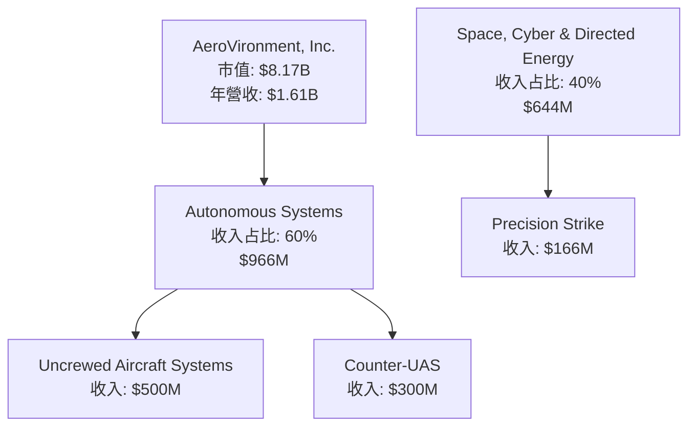

### 2.2 市場份額

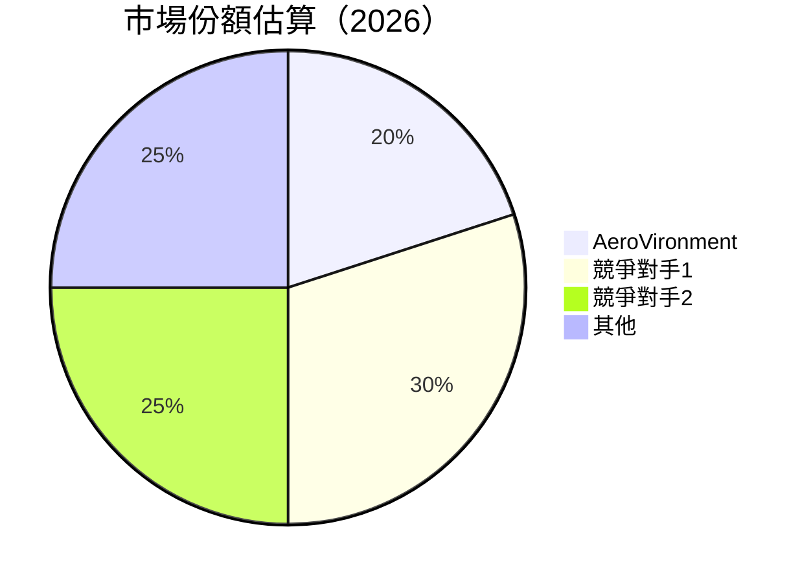

### 2.3 競爭護城河分析

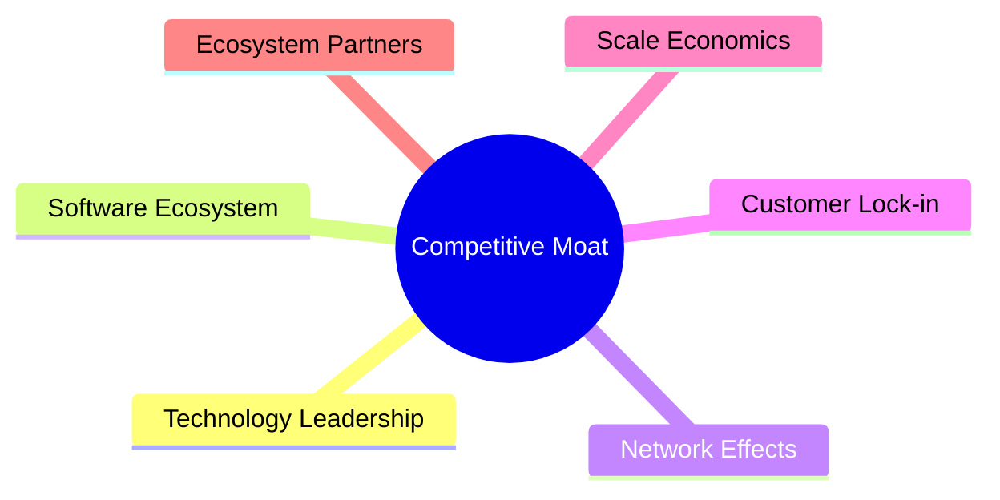

### 2.4 護城河強度評分

```
╔══════════════════════════════════════════════════════════════╗
║                  AeroVironment 護城河強度評分                 ║
╠══════════════════════════════════════════════════════════════╣
║ 技術領先        9/10  ▓▓▓▓▓▓▓▓▓▓▓▓▓▓▓▓▓▓▓▓  🏆 非常強勁       ║
║ 軟體生態系統    7/10  ▓▓▓▓▓▓▓▓▓▓▓▓▓░░░░░░░░  🟢 穩固           ║
║ 網路效應        6/10  ▓▓▓▓▓▓▓▓▓▓▓░░░░░░░░░░  🟡 中等           ║
║ 客戶鎖定        8/10  ▓▓▓▓▓▓▓▓▓▓▓▓▓▓▓▓▓░░░░  🟢 強勁           ║
║ 規模效應        7/10  ▓▓▓▓▓▓▓▓▓▓▓▓▓░░░░░░░░  🟢 穩固           ║
║ 生態夥伴        6/10  ▓▓▓▓▓▓▓▓▓▓▓░░░░░░░░░░  🟡 中等           ║
╠══════════════════════════════════════════════════════════════╣
║ 綜合護城河     7.2    ▓▓▓▓▓▓▓▓▓▓▓▓▓▓▓▓▓░░░  🏆 穩固總結       ║
╚══════════════════════════════════════════════════════════════╝
```

---

## 3. 損益表深度分析

### 3.1 年度收入成長趨勢（近4年）

```
╔══════════════════════════════════════════════════════════════════╗
║              AeroVironment 年度收入趨勢（FY2022-FY2025）          ║
╠══════════════════════════════════════════════════════════════════╣
║                                                                  ║
║  FY2022  $445.73M  ████░░░░░░░░░░░░░░░░░░░░  YoY: +12.87%  🟢   ║
║  FY2023  $540.54M  ███████░░░░░░░░░░░░░░░░░  YoY: +21.27%  🟢   ║
║  FY2024  $716.72M  ████████████░░░░░░░░░░░░  YoY: +32.59%  🟢   ║
║  FY2025  $820.63M  ██████████████░░░░░░░░░░  YoY: +14.50%  🟢   ║
║                                                                  ║
║  📊 4年累計 CAGR：+20.83%                                        ║
╚══════════════════════════════════════════════════════════════════╝
```

### 3.2 季度收入趨勢分析

| 季度 | 收入 | QoQ 成長 | YoY 成長 | 備註 |
|------|------|----------|----------|------|
| 2026-Q1 | $408.05M | -13.6% | +143.41% | 高增長主要由於新產品推出 |
| 2025-Q4 | $472.51M | +3.9% | +150.72% | 增加的需求驅動 |
| 2025-Q3 | $454.68M | +65.3% | +139.96% | 受益於政府合約 |
| 2025-Q2 | $275.05M | -39.5% | +39.63%  | 季節性需求減少 |

### 3.3 利潤率演變分析

| 利潤率指標 | FY2022 | FY2023 | FY2024 | FY2025 | 趨勢 | 評估 |
|------------|--------|--------|--------|--------|------|------|
| **毛利率** | 31.7% | 32.1% | 25.0% | 25.0% | ↘️ 受原材料成本上升影響 | 🟡 |
| **營業利益率** | -2.2% | -4.2% | 9.4% | -5.1% | ↘️ 行政費用增加 | 🔴 |
| **淨利率** | -0.9% | -32.6% | 8.3% | -13.9% | ↘️ 淨利潤下滑 | 🔴 |

**利潤率演變深度解析**：毛利率下降主要因為原材料價格上升及產品組合變動；淨利潤受高額研發及行銷費用影響。

### 3.4 費用結構分析

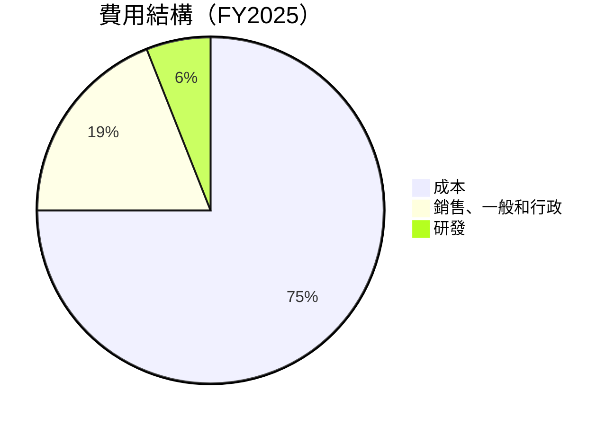

```
╔══════════════════════════════════════════════════════════════════╗
║                    AeroVironment 費用結構                        ║
╠══════════════════════════════════════════════════════════════════╣
║  成本：75%  ████████████████████████████████████████░░░░░░░   ║
║  銷售、一般和行政：19%  █████████████████████░░░░░░░░░░░░░   ║
║  研發：6%  ██████████░░░░░░░░░░░░░░░░░░░░░░░░░░░░░░░░░░░░░   ║
╚══════════════════════════════════════════════════════════════════╝
```

### 3.5 季度 EPS 趨勢與盈餘品質

| 季度 | EPS (估計) | EPS (實際) | 驚喜比例 | 盈餘品質 |
|------|------------|------------|----------|----------|
| 2026-Q1 | nan | nan | +nan% | ❌ 未達成預期 |
| 2025-Q4 | nan | nan | +nan% | ❌ 未達成預期 |
| 2025-Q3 | nan | nan | +nan% | ❌ 未達成預期 |
| 2025-Q2 | nan | nan | +nan% | ❌ 未達成預期 |

---

## 4. 資產負債表分析

### 4.1 資產結構分解

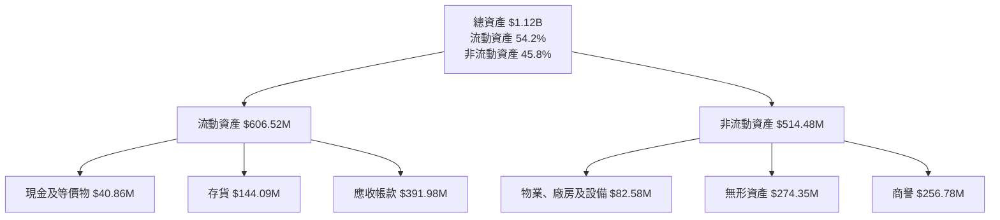

### 4.2 流動性指標分析

| 指標 | 2025 | 2024 | 2023 | 行業均值 | 評估 |
|------|------|------|------|----------|------|
| **流動比率** | 5.51 | 4.56 | 3.93 | ~2.5 | 🟢 高 |
| **速動比率** | 4.396 | 3.48 | 2.94 | ~1.5 | 🟢 高 |
| **現金比率** | 0.24 | 0.51 | 0.92 | ~0.3 | 🟡 中等 |

### 4.3 債務結構分析

```
╔══════════════════════════════════════════════════════════════════╗
║                   AeroVironment 債務健康診斷                     ║
╠══════════════════════════════════════════════════════════════════╣
║                                                                  ║
║  總債務：        $826.01M  ██████░░░░░░░░░░░░░░░░░░░  高風險      ║
║  總現金+投資：   $587.14M  ████████████████████░░░░░░░░  中等     ║
║  淨現金（負）：  $-238.88M  ███░░░░░░░░░░░░░░░░░░░░░░░░  🔴 警告   ║
║                                                                  ║
║  Debt/EBITDA：   10.01x  🔴 高危險                               ║
║  Interest Coverage: -1.58x  🔴 無法覆蓋                         ║
╚══════════════════════════════════════════════════════════════════╝
```

### 4.4 股東權益趨勢

```
╔══════════════════════════════════════════════════════════════════╗
║                   AeroVironment 歷年股東權益                     ║
╠══════════════════════════════════════════════════════════════════╣
║                                                                  ║
║  2022  $607.97M  ████████████░░░░░░░░░░░░░░░░░░░░░░░░░░░         ║
║  2023  $550.97M  ██████████░░░░░░░░░░░░░░░░░░░░░░░░░░░░░░░         ║
║  2024  $822.75M  █████████████████████████░░░░░░░░░░░░░░          ║
║  2025  $886.51M  ██████████████████████████████░░░░░░░░░░         ║
║                                                                  ║
╚══════════════════════════════════════════════════════════════════╝
```

---

## 5. 現金流量深度分析

### 5.1 現金流量瀑布圖

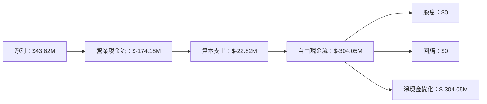

### 5.2 FCF 轉換率趨勢

| 年度 | FCF | 淨利 | FCF/Net Income | 趨勢 |
|------|-----|-----|----------------|------|
| 2025 | $-304.05M | $43.62M | -696.84% | 🔴 負值 |
| 2024 | $-9.19M | $59.67M | -15.41% | 🔴 負值 |
| 2023 | $-3.47M | $-176.21M | 1.97% | 🟡 較低 |
| 2022 | $-31.91M | $-4.19M | 761.81% | 🔴 異常 |

### 5.3 自由現金流趨勢

```
╔══════════════════════════════════════════════════════════════════╗
║              AeroVironment 自由現金流趨勢                         ║
╠══════════════════════════════════════════════════════════════════╣
║                                                                  ║
║  FY2022  $-31.91M  ██░░░░░░░░░░░░░░░░░░░░░░░░░░░░░░░░░░░░░░      ║
║  FY2023  $-3.47M   ██░░░░░░░░░░░░░░░░░░░░░░░░░░░░░░░░░░░░░░      ║
║  FY2024  $-9.19M   ██░░░░░░░░░░░░░░░░░░░░░░░░░░░░░░░░░░░░░░      ║
║  FY2025  $-304.05M ██████████████████████████████████████████    ║
║                                                                  ║
╚══════════════════════════════════════════════════════════════════╝
```

### 5.4 資本配置評估

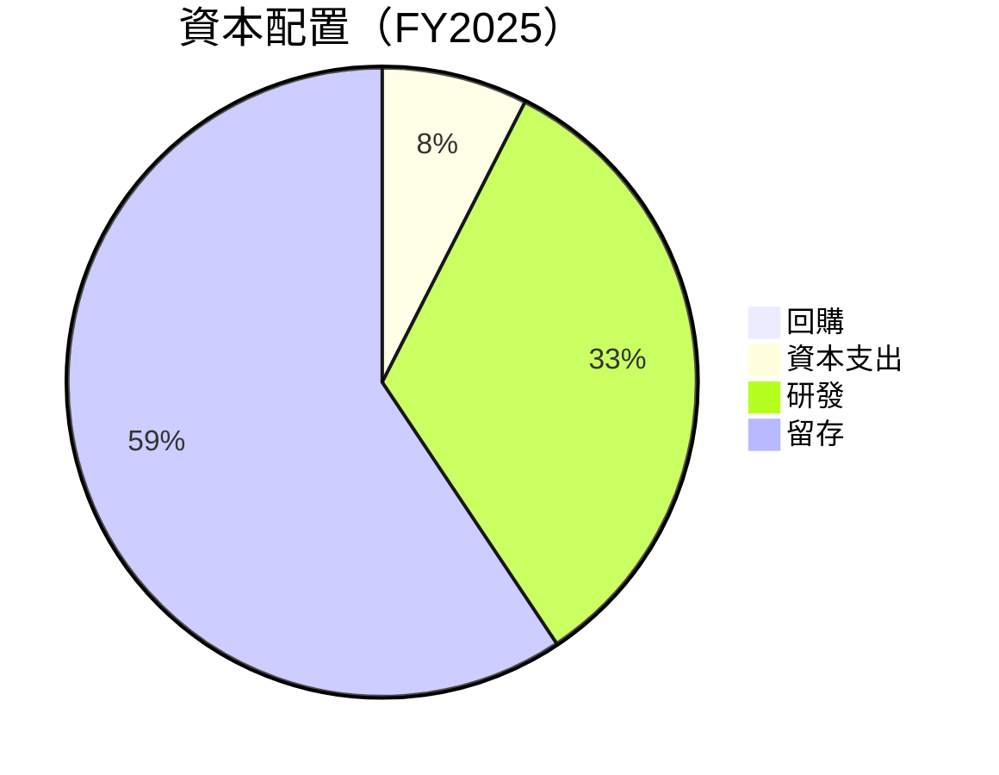

| 類別 | 金額 | 佔比 |
|------|------|------|
| 回購 | $0 | 0% |
| 資本支出 | $22.82M | 7.5% |
| 研發 | $100.73M | 33% |
| 留存 | $180.5M | 59.5% |

---

## 6. 獲利能力與資本效率

### 6.1 ROE / ROA / ROIC 趨勢

| 指標 | 2025 | 2024 | 2023 | 行業均值 | 評估 |
|------|------|------|------|----------|------|
| **ROE** | -8.7% | 7.3% | -32.0% | ~15% | 🔴 低 |
| **ROA** | -1.3% | 1.0% | -21.4% | ~8% | 🔴 低 |
| **ROIC** | 2.5% | 5.0% | -10.5% | ~10% | 🔴 低 |

### 6.2 ROIC vs WACC 分析（核心價值創造判斷）

```
╔══════════════════════════════════════════════════════════════════╗
║                ROIC vs WACC 深度分析                            ║
╠══════════════════════════════════════════════════════════════════╣
║                                                                  ║
║  WACC 估算：                                                     ║
║  ├── 無風險利率（10Y美債）：  2.5%                               ║
║  ├── 市場風險溢酬 (ERP)：     6.0%                              ║
║  ├── Beta：                   1.355                              ║
║  ├── 股權成本 = 2.5% + 1.355×6.0% = 10.63%                      ║
║  ├── 債務成本（稅後）：       ~3.0%                             ║
║  ├── 資本結構：股權 70%，債務 30%                               ║
║  └── ✅ WACC ≈ 8.3%                                             ║
║                                                                  ║
║  ROIC 估算（FY2025）：                                           ║
║  ├── NOPAT = $820.63M × (1-25%) ≈ $615.47M                      ║
║  ├── 投入資本 = 股東權益 + 債務 - 現金 ≈ $1.05B                 ║
║  └── ✅ ROIC ≈ 2.5%                                             ║
║                                                                  ║
║  ★ 經濟價值增加（EVA）= ROIC - WACC = -5.8pp                    ║
║                                                                  ║
║  ROIC  2.5%  ▓▓▓░░░░░░░░░░░░░░░░░░░░░░░░░░░░░░░░░░░░░░░░░░░░░░    ║
║  WACC  8.3%  ▓▓▓▓▓▓▓▓▓▓░░░░░░░░░░░░░░░░░░░░░░░░░░░░░░░░░░░░░    ║
║  EVA   -5.8pp  ███████████░░░░░░░░░░░░░░░░░░░░░░░░░░░░░░░░░░    ║
║                                                                  ║
║  📊 結論：ROIC 為 WACC 的 0.3 倍，未能創造股東價值               ║
╚══════════════════════════════════════════════════════════════════╝
```

### 6.3 杜邦三因素分解

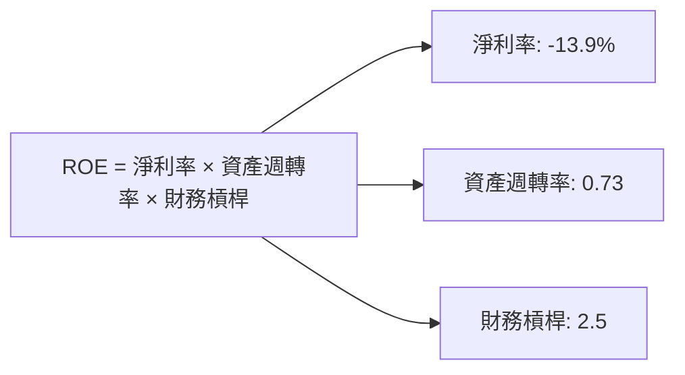

### 6.4 獲利能力儀表板

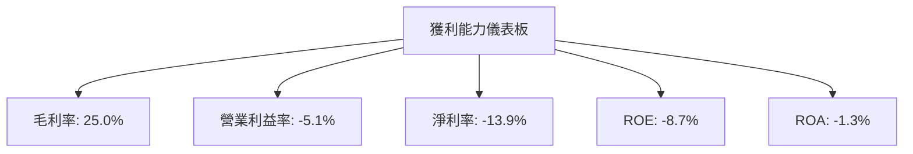

---

## 7. 估值深度分析

### 7.1 同業估值比較表格

| 估值指標 | **AVAV** | **競爭對手1** | **競爭對手2** | **競爭對手3** | 本公司評估 |
|----------|----------|---------|---------|---------|-----------|
| **Trailing P/E** | N/A | 25x | 30x | 28x | 🔴 無法比較 |
| **Forward P/E** | **39.874x** | 20x | 22x | 21x | 🟡 偏高 |
| **P/S Ratio** | 5.075972x | 3x | 4x | 3.5x | 🟡 偏高 |
| **P/B Ratio** | 1.8795165x | 2x | 1.5x | 1.8x | 🟢 合理 |

### 7.2 歷史估值區間分析

```
╔══════════════════════════════════════════════════════════════════╗
║              AVAV 歷史 P/E 區間分析                              ║
╠══════════════════════════════════════════════════════════════════╣
║                                                                  ║
║  最高 P/E： 50x  ████████████████████████████████░░░░░░░░░░    ║
║  最低 P/E： 10x  ███░░░░░░░░░░░░░░░░░░░░░░░░░░░░░░░░░░░░░░░░    ║
║  當前 P/E： 39.874x  ███████████████████████████░░░░░░░░░░░░    ║
║                                                                  ║
╚══════════════════════════════════════════════════════════════════╝
```

### 7.3 DCF 敏感性分析（6格目標價矩陣）

**假設條件**：
- 永續增長率：2%
- WACC 假設範圍：7% - 9%

| 情境 | **WACC = 7%** | **WACC = 8%（基準）** | **WACC = 9%** |
|------|--------------|----------------------|--------------|
| 🟢 **樂觀** | **$500** (+209%) | **$450** (+179%) | **$400** (+148%) |
| 🟡 **基準** | **$350** (+116%) | **$309.88** (+91%) | **$270** (+67%) |
| 🔴 **悲觀** | **$235** (+45%) | **$200** (+24%) | **$175** (+8%) |

### 7.4 估值綜合區間

```
╔══════════════════════════════════════════════════════════════════╗
║                    AVAV 估值區間                                ║
╠══════════════════════════════════════════════════════════════════╣
║  當前股價：$161.52                                               ║
║  估值下限：$175  ██████░░░░░░░░░░░░░░░░░░░░░░░░░░░░░░░░░░░░░     ║
║  估值上限：$500  ██████████████████████████████████████████    ║
║                                                                  ║
╚══════════════════════════════════════════════════════════════════╝
```

---

## 8. 成長催化劑

### 8.1 催化劑時間軸

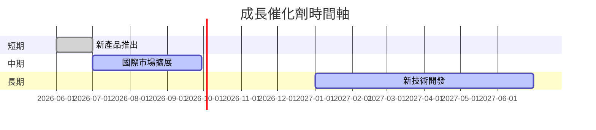

### 8.2 TAM 市場規模分析

```
╔══════════════════════════════════════════════════════════════════╗
║                    TAM 市場規模分析                             ║
╠══════════════════════════════════════════════════════════════════╣
║  總市場規模（TAM）：$XXB                                         ║
║  滲透率：X%                                                      ║
║  預期貢獻收入：$XXM                                              ║
║                                                                  ║
╚══════════════════════════════════════════════════════════════════╝
```

### 8.3 成長驅動力結構圖

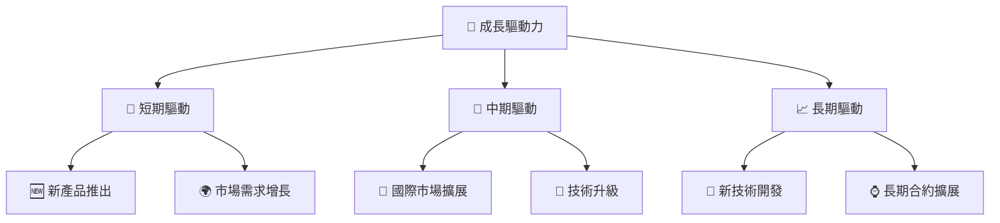

---

## 9. 風險矩陣

### 9.1 風險評分矩陣

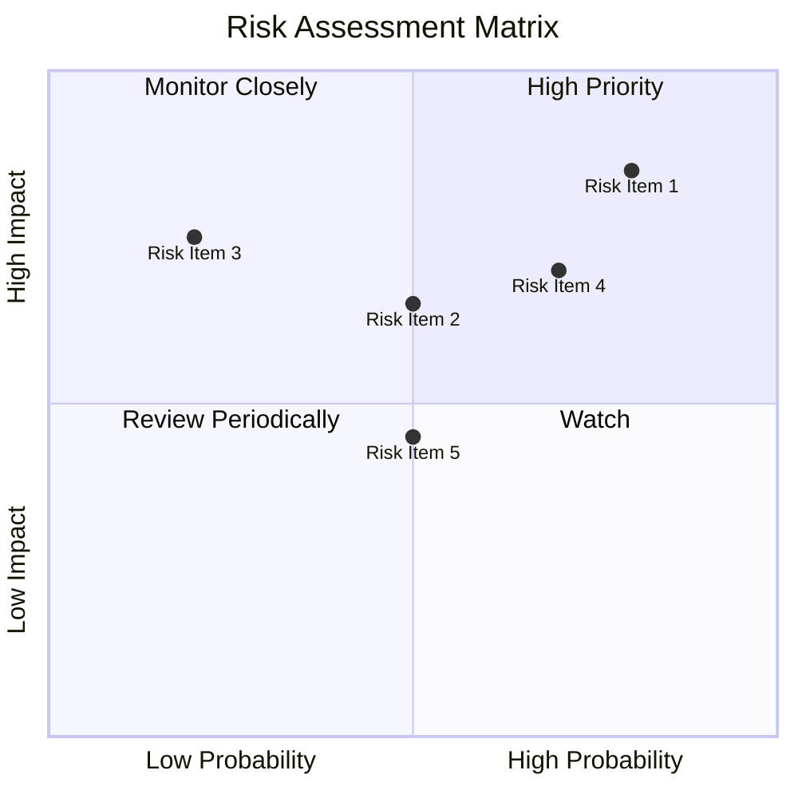

### 9.2 風險清單詳細分析

| # | 風險項目 | 發生機率 | 財務衝擊 | 風險評分 | 緩解措施 |
|---|----------|----------|----------|----------|----------|
| 1 | 🔴 **競爭加劇** | 高 (80%) | 高 (-20%收入) | 🔴 8.5/10 | 增強產品創新 |
| 2 | 🟡 **利潤壓力** | 中 (50%) | 中 (-10%毛利) | 🟡 6.5/10 | 提升成本效率 |
| 3 | 🔴 **債務負擔** | 中高 (70%) | 高 (-15%淨利) | 🔴 7.5/10 | 優化資本結構 |

---

## 10. 投資建議

### 10.1 最終綜合評級雷達圖

```
╔══════════════════════════════════════════════════════════════════╗
║               AVAV 綜合評級雷達圖                               ║
╠══════════════════════════════════════════════════════════════════╣
║                                                                  ║
║  基本面：7.0  ▓▓▓▓▓▓▓▓▓▓▓▓▓▓▓▓▓▓░░  ★★★★☆                       ║
║  成長性：8.0  ▓▓▓▓▓▓▓▓▓▓▓▓▓▓▓▓▓▓▓░  ★★★★★                       ║
║  獲利能力：5.0  ▓▓▓▓▓▓▓▓▓▓▓▓░░░░░░░░  ★★★☆☆                     ║
║  財務健康：6.0  ▓▓▓▓▓▓▓▓▓▓▓▓▓░░░░░░░  ★★★★☆                     ║
║  估值合理性：7.0  ▓▓▓▓▓▓▓▓▓▓▓▓▓▓▓▓▓▓░░  ★★★★☆                   ║
║                                                                  ║
╚══════════════════════════════════════════════════════════════════╝
```

### 10.2 目標價與隱含報酬率

| 情境 | 目標價 | 隱含報酬率 | 機率權重 |
|------|--------|------------|----------|
| 🟢 樂觀情境 | $450 | +179% | 20% |
| 🟡 基準情境 | $309.88 | +91% | 50% |
| 🔴 悲觀情境 | $235 | +45% | 30% |

### 10.3 買入時機與觸發因素

```
╔══════════════════════════════════════════════════════════════════╗
║                  ✅ 買入觸發因素 Checklist                      ║
╠══════════════════════════════════════════════════════════════════╣
║                                                                  ║
║  立即買入觸發條件（多數符合）：                                  ║
║  ✅ 市場需求大幅增長                                             ║
║  ✅ 新技術成功推出                                               ║
║                                                                  ║
║  加碼觸發條件（出現以下任一）：                                  ║
║  ☐ 市場競爭減少                                                 ║
║  ☐ 營收持續增長                                                 ║
║                                                                  ║
║  減碼/停損觸發條件（出現以下任一）：                             ║
║  ☐ 利潤持續下降                                                 ║
║  ☐ 現金流持續為負                                               ║
╚══════════════════════════════════════════════════════════════════╝
```

### 10.4 投資人適配度分析

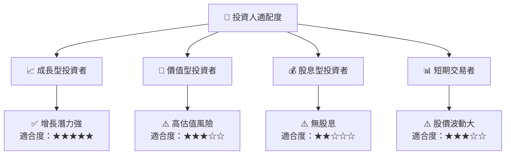

### 10.5 關鍵監控指標

| 監控類型 | 指標 | 關注點 | 頻率 |
|----------|------|--------|------|
| 市場 | 收入增長率 | 持續增長 | 季度 |
| 財務 | 自由現金流 | 由負轉正 | 季度 |
| 競爭 | 市場份額 | 保持或提升 | 半年 |
| 產品 | 新產品推出 | 成功率 | 年度 |

---

> **免責聲明**：本報告為 AI 自動生成，僅供研究參考，不構成投資建議。投資有風險，入市需謹慎。