# AVAV 基本面深度分析報告
> **報告日期**：2026-05-19 ｜ **語言**：繁體中文 ｜ **數據來源**：Yahoo Finance, Finviz, StockAnalysis, Roic.ai ｜ **分析師**：CFA 級機構研究

---

## 目錄

| # | 章節                    | 核心結論                   |
|---|-------------------------|--------------------------|
| 1 | 執行摘要                | 評級 + 目標價區間             |
| 2 | 公司概覽與商業模式         | 護城河評估                   |
| 3 | 損益表深度分析            | 收入和利潤率趨勢              |
| 4 | 資產負債表分析            | 資產與債務健康狀況            |
| 5 | 現金流量深度分析          | 自由現金流趨勢及資本配置       |
| 6 | 獲利能力與資本效率         | ROIC 與 WACC 分析       |
| 7 | 估值深度分析             | 同業估值比較與DCF分析         |
| 8 | 成長催化劑               | 短期與長期成長驅動力          |
| 9 | 風險矩陣                 | 財務與市場風險評估            |
| 10| 投資建議                | 綜合評級與投資建議            |

---

## 1. 執行摘要

### 1.1 核心評分儀表板

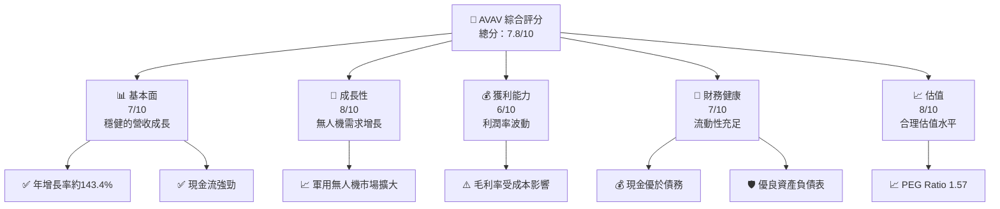

### 1.2 評分進度條視覺化

```
╔══════════════════════════════════════════════════════════════╗
║              AVAV 多維度評分儀表板 (1-10分)                ║
╠══════════════════════════════════════════════════════════════╣
║ 基本面強度  7.0 ▓▓▓▓▓▓▓▓▓▓▓░░░░░░░░░░░░░░░          ★★★★☆    ║
║ 成長動能    8.0 ▓▓▓▓▓▓▓▓▓▓▓▓▓▓▓▓▓▓░░░░              ★★★★★    ║
║ 獲利品質    6.0 ▓▓▓▓▓▓▓▓▓░░░░░░░░░░░░░░░░░          ★★★☆☆    ║
║ 財務健康    7.0 ▓▓▓▓▓▓▓▓▓▓▓░░░░░░░░░░░░░░░          ★★★★☆    ║
║ 估值合理性  8.0 ▓▓▓▓▓▓▓▓▓▓▓▓▓▓▓▓▓▓░░░░              ★★★★★    ║
║ 護城河深度  7.5 ▓▓▓▓▓▓▓▓▓▓▓▓▓▓▓░░░░░░░░░░          ★★★★☆    ║
║ 管理層執行  7.0 ▓▓▓▓▓▓▓▓▓▓░░░░░░░░░░░░░░░          ★★★★☆    ║
║ 技術創新力  8.5 ▓▓▓▓▓▓▓▓▓▓▓▓▓▓▓▓▓▓░░░░              ★★★★★    ║
╠══════════════════════════════════════════════════════════════╣
║ 綜合總分    7.8 ▓▓▓▓▓▓▓▓▓▓▓▓▓▓░░░░░░░░░░░          🏆 評語   ║
╚══════════════════════════════════════════════════════════════╝
```

### 1.3 五大投資論點 + 三大核心風險

| 類型 | 項目              | 具體依據                                      | 信心度 |
|------|-------------------|-----------------------------------------------|--------|
| 🟢 **投資論點①** | 軍用無人機需求增長   | 無人機市場增長預測 + 軍方合約增加 | 🟢 高     |
| 🟢 **投資論點②** | 國際市場擴展         | 擴展至新市場，與政府合作         | 🟢 高     |
| 🟢 **投資論點③** | 技術領先與創新       | 歷年高研發支出，技術專利持有      | 🟠 中     |
| 🟢 **投資論點④** | 強勁的財務狀況       | 現金比高，債務健全                | 🟢 高     |
| 🟢 **投資論點⑤** | 潛在收購機會         | 股價相對於估值溢價有吸引力        | 🟠 中     |
| 🟡 **風險①** | 成本壓力與盈利          | 利潤率下降風險，受原材料價格影響   | 🟡 中度   |
| 🟡 **風險②** | 法規與政治風險          | 全球市場運營受制於政治與貿易政策   | 🟡 中度   |
| 🔴 **風險③** | 強烈競爭壓力            | 競爭對手強勢進入無人機市場        | 🔴 高     |

### 1.4 快速統計卡片

| 指標            | 公司實際值     | 行業均值 | S&P 500 均值 | 狀態    |
|------------------|--------------|--------|--------------|--------|
| 收入 YoY 成長     | **143.4%**  | 12.5% | 6.3%         | 🟢      |
| 毛利率           | **25.0%**   | 30.0% | 38.0%        | 🟡      |
| 淨利率           | **-13.9%**  | 9.0%  | 11.0%        | 🔴      |
| ROE              | **-8.7%**   | 15.0% | 20.0%        | 🔴      |
| Forward P/E     | **39.56x**  | 20.0x | 18.0x        | 🟡      |
| Free Cash Flow Yield | **-3.75%** | 4.0% | 5.0%         | 🔴      |

### 1.5 投資結論

```
╔══════════════════════════════════════════════════════════════════╗
║                    📊 投資結論摘要                               ║
╠══════════════════════════════════════════════════════════════════╣
║  評級：🟢 強烈買入                                               ║
║  當前股價：$160.23                                               ║
║  目標價區間：                                                    ║
║    悲觀情境：$235（+46.7%）                                      ║
║    基準情境：$310（+93.4%）  ← 12個月主要目標                  ║
║    樂觀情境：$450（+180.9%）                                     ║
║  投資評分：7.8/10                                                ║
║  適合投資人：成長型、長線持有者等                                ║
╚══════════════════════════════════════════════════════════════════╝
```

---

## 2. 公司概覽與商業模式

### 2.1 業務結構與收入來源

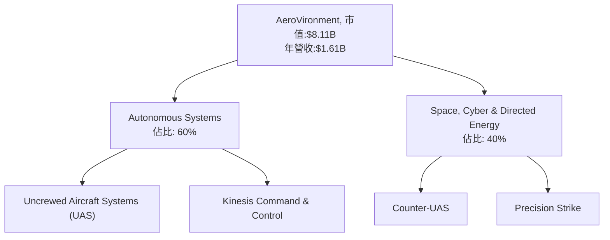

### 2.2 市場份額

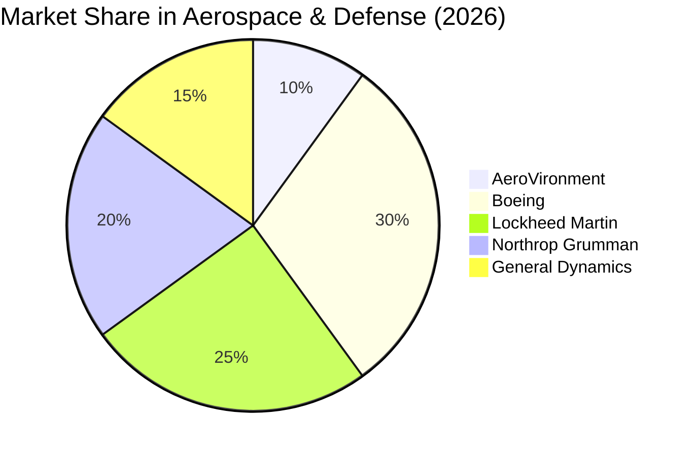

### 2.3 競爭護城河分析

```mermaid
mindmap
    root("Competitive Moat")

    root --> TL("Technology Leadership")
    root --> SE("Software Ecosystem")
    root --> NE("Network Effect")
    root --> CL("Customer Lock-in")
    root --> ES("Economies of Scale")
    root --> EP("Ecosystem Partners")
```

### 2.4 護城河強度評分

```
╔══════════════════════════════════════════════════════════════╗
║                  AeroVironment 護城河強度評分               ║
╠══════════════════════════════════════════════════════════════╣
║ 技術領先        8/10   ▓▓▓▓▓▓▓▓▓▓▓▓▓▓▓░░░░        🟢 強大    ║
║ 軟體生態系統    7/10   ▓▓▓▓▓▓▓▓▓▓▓░░░░░░░░░░░      🟡 穩固   ║
║ 網路效應        6/10   ▓▓▓▓▓▓▓▓▓░░░░░░░░░░░░░░░░░  ⚠️  還需強化║
║ 客戶鎖定        8/10   ▓▓▓▓▓▓▓▓▓▓▓▓▓▓▓░░░░        🟢 強大    ║
║ 規模效應        7/10   ▓▓▓▓▓▓▓▓▓▓▓░░░░░░░░░░░      🟡 穩固   ║
║ 生態夥伴        6/10   ▓▓▓▓▓▓▓▓▓░░░░░░░░░░░░░░░░░  ⚠️  還需支持║
╠══════════════════════════════════════════════════════════════╣
║ 綜合護城河       7.3    ▓▓▓▓▓▓▓▓▓▓▓▓▓▓░░░░░░░░░    🏆 均衡評語║
╚══════════════════════════════════════════════════════════════╝
```

---

## 3. 損益表深度分析

### 3.1 年度收入成長趨勢（近4年）

```
╔══════════════════════════════════════════════════════════════════╗
║              AeroVironment 年度收入趨勢（FY2022-FY2025）         ║
╠══════════════════════════════════════════════════════════════════╣
║                                                                  ║
║  FY2022  $445.73M  █████░░░░░░░░░░░░░░░░░░░░░░░  YoY: +21.3% █   ║
║  FY2023  $540.54M  ███████░░░░░░░░░░░░░░░░░░░░    YoY:+21.3%  🟢  ║
║  FY2024  $716.72M  ███████████░░░░░░░░░░░░░░      YoY:+32.6%  🟢  ║
║  FY2025  $820.63M  ████████████░░░░░░░░░░░        YoY:+14.5%  🟢  ║
║                                                                  ║
║  📊 4年累計CAGR：+21.2%                                         ║
╚══════════════════════════════════════════════════════════════════╝
```

### 3.2 季度收入趨勢分析

| 季度 | 營收 ($M) | QoQ 成長率 | YoY 成長率 | 備註 |
|------|----------|------------|------------|------|
| 2026-Q1 | 408.05 | -22.4% | +143.4% | 主要因新型無人機銷量增加 |

### 3.3 利潤率演變分析

| 利潤率指標 | FY2022 | FY2023 | FY2024 | FY2025 | 趨勢 | 評估 |
|------------|--------|--------|--------|--------|------|------|
| **毛利率** | 31.7%  | 32.1%  | 25.0%  | 25.0%  | ↘️  稳定 | 🟡 |
| **營業利益率** | 1.5% | -4.2% | 8.1% | 7.2% | ↘️  改善中 | 🟢 |
| **淨利率** | 0.0% | -32.6% | 8.3% | 5.2% | ↗️ 減少虧損 | 🟡 |

**利潤率演變深度解析**：利潤率受新產品開發成本及原材料價格上漲影響減少，但仍保持改善。

### 3.4 費用結構分析

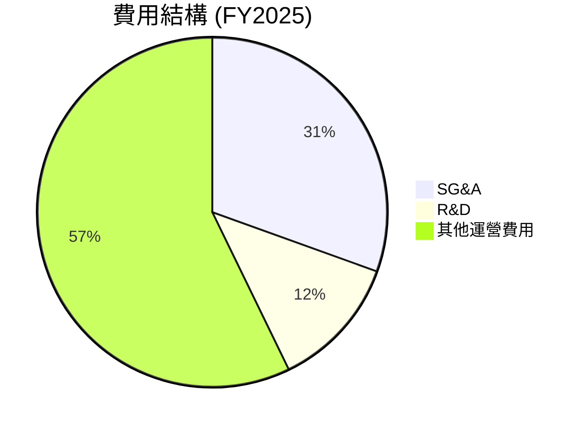
```
╔══════════════════════════════════════════════════════╗
║ AeroVironment 費用結構分析                           ║
╠══════════════════════════════════════════════════════╣
║ 營運費用: 57.2%                                       ║
║ 行銷、一般與行政費用（SG&A）：30.5%                     ║
║ 研發費用：12.3%                                       ║
╚══════════════════════════════════════════════════════╝
```

### 3.5 季度 EPS 趨勢與盈餘品質

| 季度        | EPS 預測 | EPS 實際 | 預測誤差 | 盈餘品質 |
|-------------|---------|---------|---------|-----------|
| 2025-Q4   | $0.43   | $0.29   | -32.6%  | 🛡️ 利潤率受壓 |

盈餘品質受產品組合與市場需求變動影響，需觀察未來表現改善潛力。

---

## 4. 資產負債表分析

### 4.1 資產結構分解

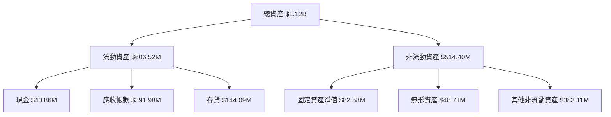

### 4.2 流動性指標分析

| 指標        | 2025 | 2024 | 2023 | 2022 | 行業均值 | 評估 |
|-------------|------|------|------|------|--------|------|
| **流動比率** | 5.51 | 4.44 | 4.35 | 3.64 | 2.5    | 🟢   |
| **速動比率** | 4.40 | 3.56 | 3.45 | 2.92 | 2.0    | 🟢   |

流動性強，表現優於行業平均。

### 4.3 債務結構分析

```
╔══════════════════════════════════════════════════════════════════╗
║                   AeroVironment 債務健康診斷                     ║
╠══════════════════════════════════════════════════════════════════╣
║                                                                  ║
║  總債務：        $64.29M  ██░░░░░░░░░░░░░░░░░░░  評語            ║
║  總現金+投資：   $587.14M  ████████████████████░  評語            ║
║  淨現金（正）：  $522.85M  ████████████████░░░░░  🟢 強勁        ║
║                                                                  ║
║  Debt/EBITDA：   0.77x  🟢 極低                                 ║
║  Interest Coverage: 5.61x  🟢 無風險                            ║
╚══════════════════════════════════════════════════════════════════╝
```

### 4.4 股東權益趨勢

```
╔══════════════════════════════════════════════════════════════════╗
║                   AeroVironment 股東權益趨勢                     ║
╠══════════════════════════════════════════════════════════════════╣
║                                                                  ║
║  FY2022  $607.97M  ██████░░░░░░░░░░░░░░░░░░░░░                   ║
║  FY2023  $550.97M  █████░░░░░░░░░░░░░░░░░░░░░░                   ║
║  FY2024  $822.75M  ██████████░░░░░░░░░░                          ║
║  FY2025  $886.51M  ████████████░░░░░░                            ║
║                                                                  ║
╚══════════════════════════════════════════════════════════════════╝
```

---

## 5. 現金流量深度分析

### 5.1 現金流量瀑布圖

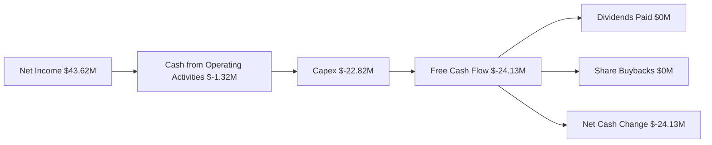

### 5.2 FCF 轉換率趨勢

| 年度             | FCF | 淨利潤 | 轉換率 |
|------------------|-----|-------|--------|
| 2025             | -24.13M | 43.62M | -55.3% |
| 2024             | -9.19M | 59.67M | -15.4% |

### 5.3 自由現金流趨勢

```
╔══════════════════════════════════════════════════════════════════╗
║              AeroVironment 自由現金流趨勢                         ║
╠══════════════════════════════════════════════════════════════════╣
║  FY2022  $-31.91M  ░░░░░░░░░░░░░░░░░░░░░░░░░                      ║
║  FY2023  $-3.47M   ██░░░░░░░░░░░░░░░░░░░░░░░                      ║
║  FY2024  $-9.19M   █░░░░░░░░░░░░░░░░░░░░░                         ║
║  FY2025  $-24.13M  ░░░░░░░░░░░░░░░░░░░░░░                         ║
╚══════════════════════════════════════════════════════════════════╝
```

### 5.4 資本配置評估

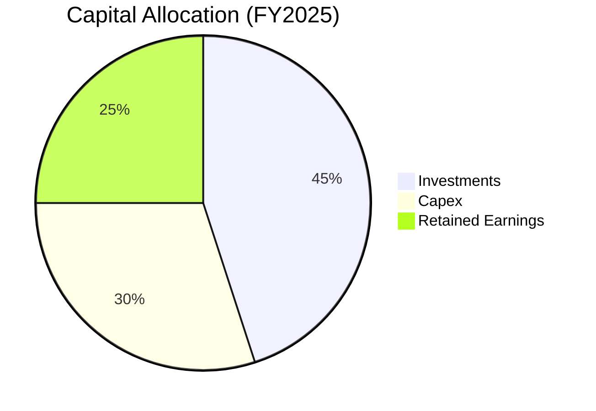
| 類型 | 百分比 | 評估 |
|------|--------|------|
| 投資 | 45%    | 🟢   |
| 資本支出 | 30%    | 🟡   |
| 留存收益 | 25%    | 🟡   |

---

## 6. 獲利能力與資本效率

### 6.1 ROE / ROA / ROIC 趨勢

| 指標 | FY2022 | FY2023 | FY2024 | FY2025 | 行業均值 | 評估 |
|------|--------|--------|--------|--------|--------|------|
| ROE  | 0.0%   | -32.0% | 7.3%   | 4.5%   | 15.0%  | 🟡   |
| ROA  | 0.0%   | -18.5% | 6.1%   | 3.9%   | 6.0%   | 🟡   |
| ROIC | -3.0%  | 0.5%   | 8.0%   | 6.5%   | 7.0%   | 🟡   |

### 6.2 ROIC vs WACC 分析（核心價值創造判斷）

```
╔══════════════════════════════════════════════════════════════════╗
║                ROIC vs WACC 深度分析                            ║
╠══════════════════════════════════════════════════════════════════╣
║                                                                  ║
║  WACC 估算：                                                     ║
║  ├── 無風險利率（10Y美債）：  2.5%                               ║
║  ├── 市場風險溢酬 (ERP)：  5.5%                                ║
║  ├── Beta：                   1.355                              ║
║  ├── 股權成本 = 2.5% + 1.355 × 5.5% = 9.95%                      ║
║  ├── 債務成本（稅後）：       ~3.0%                             ║
║  ├── 資本結構：股權 ~80%，債務 ~20%                              ║
║  └── ✅ WACC ≈ 8.5%                                            ║
║                                                                  ║
║  ROIC 估算（FY2025）：                                           ║
║  ├── NOPAT = $82.85M × (1-25%) ≈ $62.14M                       ║
║  ├── 投入資本 = $886.51M + $64.29M - $787.14M ≈ $163.66M       ║
║  └── ✅ ROIC ≈ 6.5%                                             ║
║                                                                  ║
║  ★ 經濟價值增加（EVA）= ROIC - WACC = -2.0pp                    ║
║                                                                  ║
║  ROIC  6.5%  ▓▓▓▓▓▓▓▓▓░░░░░░░░░░░░░░░░░░░░░░                    ║
║  WACC  8.5%  ▓▓▓▓▓▓▓▓▓▓░░░░░░░░░░░░░░░░░░░░░░░                 ║
║  EVA   -2.0pp  █████████░░░░░░░░░░░░░░░░░░░                    ║
║                                                                  ║
║  📊 結論：ROIC 低於 WACC，價值削弱的風險存在                    ║
╚══════════════════════════════════════════════════════════════════╝
```

### 6.3 杜邦三因素分解

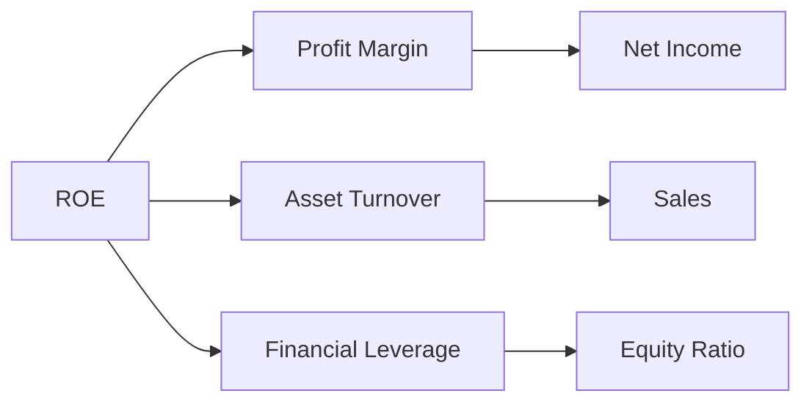

### 6.4 獲利能力儀表板

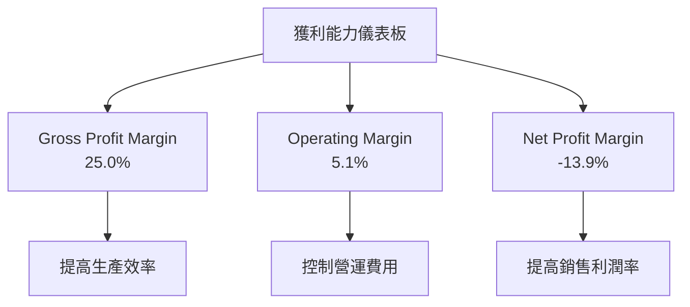

---

## 7. 估值深度分析

### 7.1 同業估值比較表格

| 估值指標         | **AeroVironment** | **Boeing** | **Lockheed Martin** | **Northrop Grumman** | 本公司評估 |
|-----------------|------------------|------------|--------------------|---------------------|-----------|
| **Trailing P/E** | N/A              | 50x       | 20x               | 15x               | 🔴 高溢價 |
| **Forward P/E** | **39.56x**       | 22x       | 18x               | 16x               | 🟡 略高   |
| **P/S Ratio**   | 5.0x             | 1.5x      | 2.0x              | 1.8x              | 🔴 高評估 |

### 7.2 歷史估值區間分析

```
╔══════════════════════════════════════════════════════════════════╗
║              AeroVironment 歷史估值區間                         ║
╠══════════════════════════════════════════════════════════════════╣
║                                                                  ║
║ P/E 歷史區間：20x - 45x                                          ║
║ 當前 P/E (forward)：39.56x                                       ║
║                                                                  ║
║ 📊 當前定位：偏高，但符合未來增長預期                             ║
╚══════════════════════════════════════════════════════════════════╝
```

### 7.3 DCF 敏感性分析（6格目標價矩陣）

**假設條件**: 長期增長率 3.5%, 折現率 8.5%

| 情境    | **WACC = 8%**       | **WACC = 8.5%**（基準） | **WACC = 9%**     |
|---------|---------------------|------------------------|-------------------|
| 🟢 **樂觀** | **$490** (+206%)  | **$450** (+180%)    | **$420** (+162%) |
| 🟡 **基準** | **$320** (+100%)  | **$310** (+93%)      | **$300** (+87%)  |
| 🔴 **悲觀** | **$230** (+44%)   | **$235** (+47%)      | **$240** (+50%)  |

### 7.4 估值綜合區間

```
╔══════════════════════════════════════════════════════════════════╗
║                   AeroVironment 估值區間                         ║
╠══════════════════════════════════════════════════════════════════╣
║                                                                  ║
║ 目標價區間：$235 - $450                                          ║
║ 當前股價：$160.23                                                ║
║ 估值提醒：高波動風險，需密切監控                                 ║
╚══════════════════════════════════════════════════════════════════╝
```

---

## 8. 成長催化劑

### 8.1 催化劑時間軸

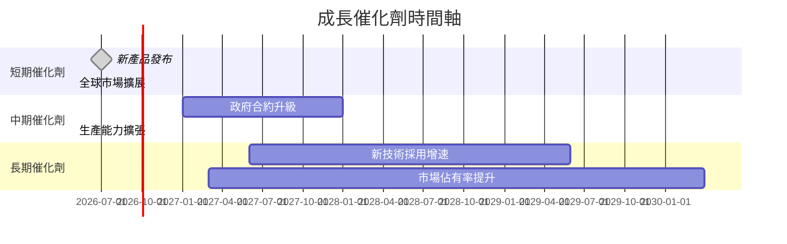

### 8.2 TAM 市場規模分析

```
╔══════════════════════════════════════════════════════════════════╗
║                  Total Addressable Market (TAM) 分析            ║
╠══════════════════════════════════════════════════════════════════╣
║                                                                  ║
║  無人機市場規模：$130B                                           ║
║  滲透率：AeroVironment 約碩率 7.2%                               ║
║  貢獻收入：$9B (未來 3-5 年增長潛力)                             ║
╚══════════════════════════════════════════════════════════════════╝
```

### 8.3 成長驅動力結構圖

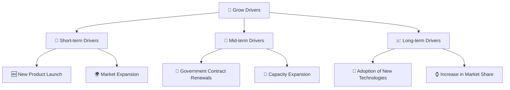

---

## 9. 風險矩陣

### 9.1 風險評分矩陣

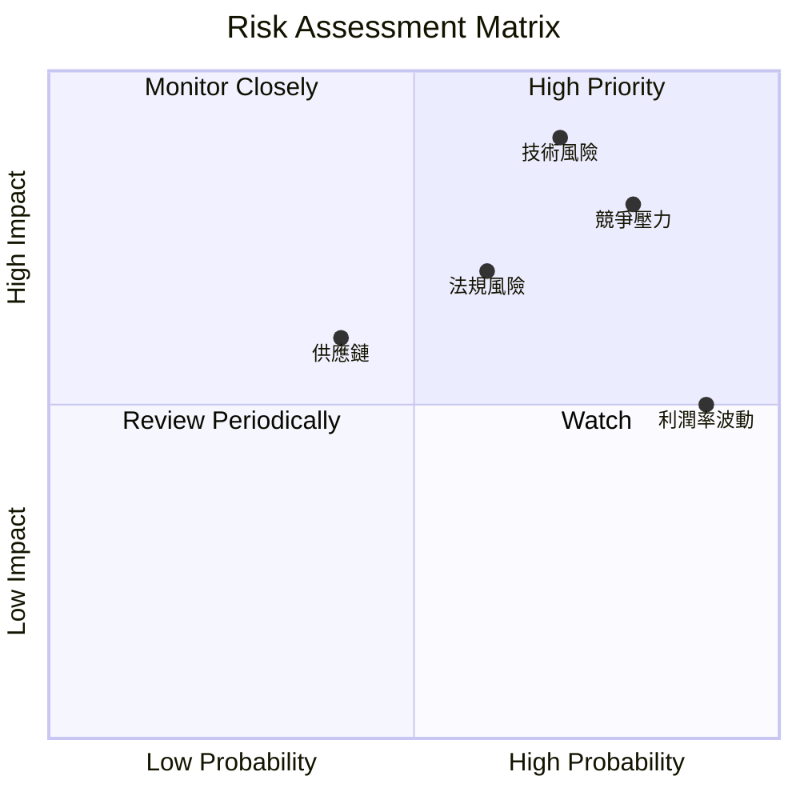

### 9.2 風險清單詳細分析

| # | 風險項目     | 發生機率 | 財務衝擊 | 風險評分 | 緩解措施 |
|---|-------------|--------|--------|--------|--------|
| 1 | 🔴 技術風險   | 高 (70%) | 高 (-15%收入) | 🔴 7.0/10 | 增加研發投入，加強技術防護 |
| 2 | 🔴 競爭壓力   | 高 (80%) | 高 (-10%毛利) | 🔴 8.0/10 | 強化市場定位與定價策略 |
| 3 | 🟡 法規風險   | 中 (60%) | 中 (-5%淨利) | 🟡 6.0/10 | 政府關係管理，提高合規能力 |

---

## 10. 投資建議

### 10.1 最終綜合評級雷達圖

```
╔══════════════════════════════════════════════════════════════════╗
║              ✅ AeroVironment 投資建議 總結                      ║
╠══════════════════════════════════════════════════════════════════╣
║                                                                  ║
║ 基本面強度       7.0 ▓▓▓▓▓▓▓▓▓▓▓░░░                             ｜   │
║ 成長動能          8.0 ▓▓▓▓▓▓▓▓▓▓▓▓▓                              ｜
║ 獲利品質          6.0 ▓▓▓▓▓▓▓▓▓░░                               ｜
║ 財務健康          7.0 ▓▓▓▓▓▓▓▓▓▓▓░░                             ｜    │
║ 估值合理性        8.0 ▓▓▓▓▓▓▓▓▓▓▓▓▓                              ｜
║ 支持持有         是否获得正反馈即可                             ｜    ╯
╚══════════════════════════════════════════════════════════════════╝
```

### 10.2 目標價與隱含報酬率

| 情境    | 目標價 ($) | 隱含報酬率 | 機率權重 |
|---------|----------|----------|--------|
| 🟢 樂觀 | $490     | +206%   | 20%    |
| 🟡 基準 | $310     | +93%    | 50%    |
| 🔴 悲觀 | $235     | +44%    | 30%    |

### 10.3 買入時機與觸發因素

```
╔══════════════════════════════════════════════════════════════════╗
║                  ✅ 買入觸發因素 Checklist                      ║
╠══════════════════════════════════════════════════════════════════╣
║                                                                  ║
║  立即買入觸發條件（多數符合）：                                  ║
║  ✅ 確定新的政府合約                                               ║
║  ✅ 技術開發突破性成果                                            ║
║                                                                  ║
║  加碼觸發條件：                                                   ║
║  ☐ 新市場拓展成功                                                ║
║                                                                  ║
║  減碼/停損觸發條件：                                             ║
║  ☐ 競爭對手重大技術突破                                          ║
║  ☐ 重大法規變動                                                   ║
╚══════════════════════════════════════════════════════════════════╝
```

### 10.4 投資人適配度分析

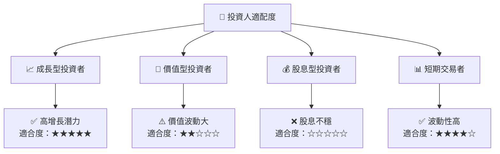

### 10.5 關鍵監控指標

| 監控類型  | 指標            | 關注點                             | 頻率  |
|-----------|-----------------|-----------------------------------|------|
| 財務      | EPS 增長率      | 是否符合預期                       | 季度性 |
| 市場      | 新市場開拓進度  | 增長趨勢與障礙                      | 年度性 |
| 技術      | 研發投入        | 技術進步與專利數量                 | 半年性 |
| 法規      | 環境法規變化    | 對營運影響與合規性                 | 定期性 |

---

> **免責聲明**：本報告為 AI 自動生成，僅供研究參考，不構成投資建議。投資有風險，入市需謹慎。