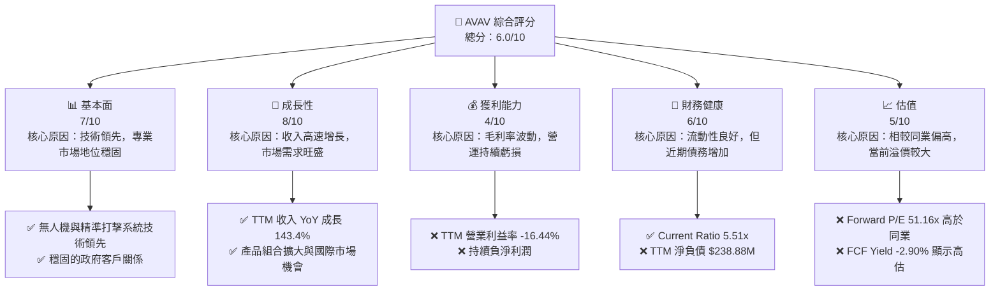
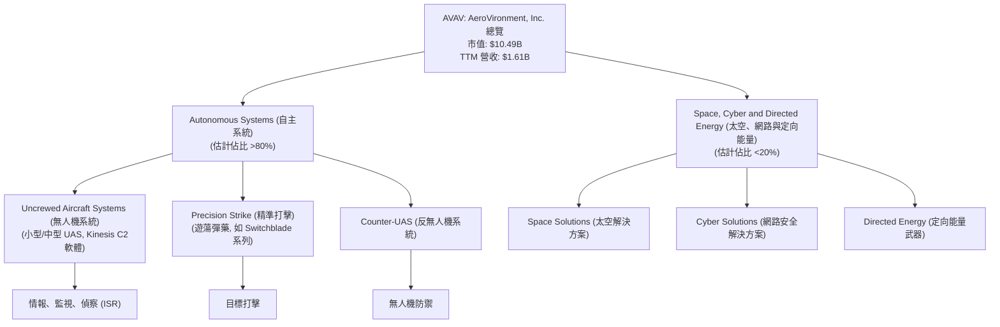
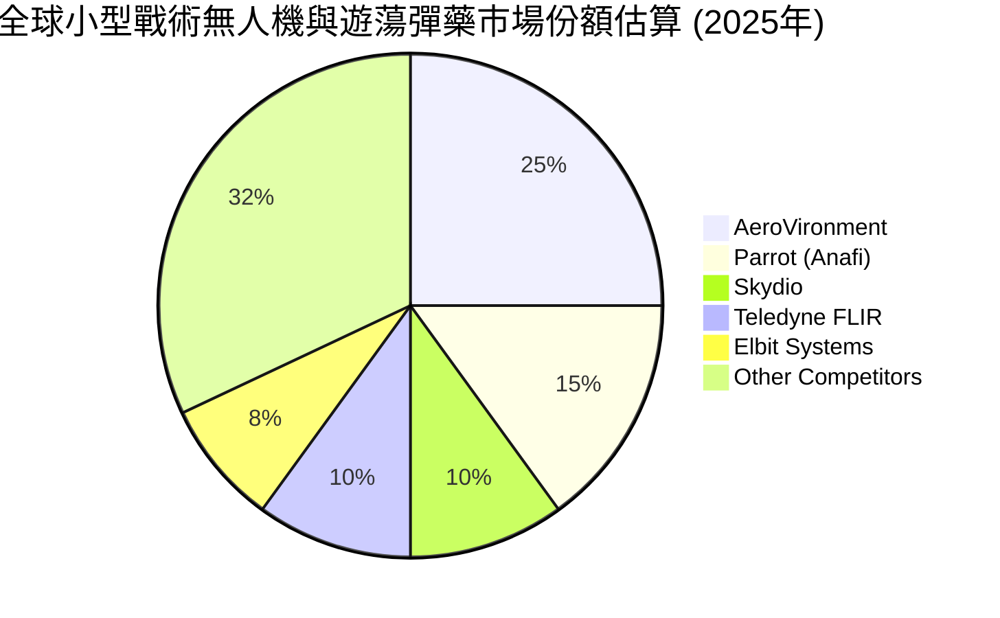
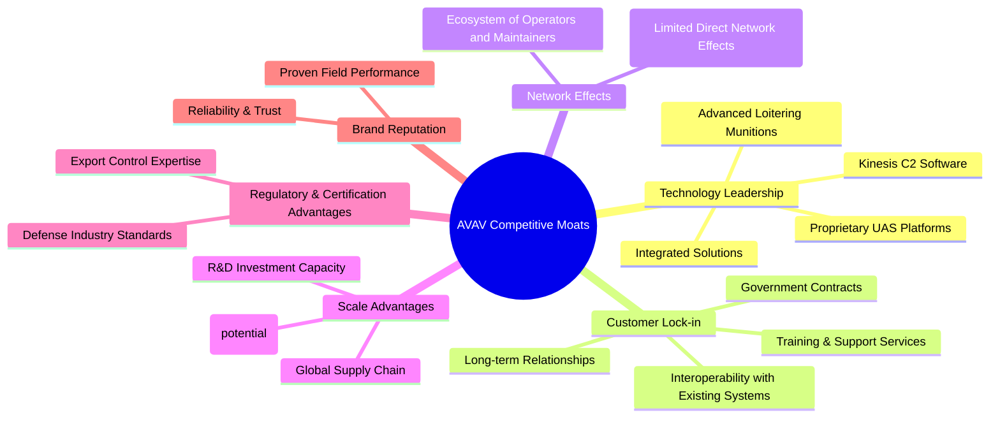

# AVAV 基本面深度分析報告
> **報告日期**：2026-05-31 ｜ **語言**：繁體中文 ｜ **數據來源**：Yahoo Finance, Finviz, StockAnalysis, Roic.ai ｜ **分析師**：CFA 級機構研究

---

## 目錄

| # | 章節 | 核心結論 |
|---|------------------------|----------------------------------------------------------------------|
| 1 | 執行摘要 | 評級：持有 ｜ 目標價區間：$230 - $350 |
| 2 | 公司概覽與商業模式 | 在無人機與精準打擊系統領域具技術優勢，但市場份額分散。護城河中等。 |
| 3 | 損益表深度分析 | 收入高速增長，但毛利率波動且營運虧損擴大，獲利能力面臨挑戰。 |
| 4 | 資產負債表分析 | 流動性良好，但近期債務增加且股東權益承壓，需關注槓桿水平。 |
| 5 | 現金流量深度分析 | 持續負自由現金流，顯示營運資金壓力及高投資需求。 |
| 6 | 獲利能力與資本效率 | ROIC 顯著低於 WACC，目前正在摧毀股東價值。 |
| 7 | 估值深度分析 | 相較同業估值偏高，DCF 分析顯示當前股價溢價。 |
| 8 | 成長催化劑 | 地緣政治緊張、新產品發布、國際擴張為主要成長動力。 |
| 9 | 風險矩陣 | 政府合約依賴、競爭加劇、R&D 失敗及供應鏈風險為主要關注點。 |
| 10 | 投資建議 | 建議「持有」，等待獲利能力改善與估值回歸合理水平。 |

---

## 1. 執行摘要

### 1.1 核心評分儀表板



### 1.2 評分進度條視覺化

```
╔══════════════════════════════════════════════════════════════╗
║              AVAV 多維度評分儀表板 (1-10分)                  ║
╠══════════════════════════════════════════════════════════════╣
║ 基本面強度  7.0 ▓▓▓▓▓▓▓▓▓▓▓▓▓▓░░░░░░  ★★★★☆           ║
║ 成長動能    8.0 ▓▓▓▓▓▓▓▓▓▓▓▓▓▓▓▓░░░░  ★★★★☆           ║
║ 獲利品質    4.0 ▓▓▓▓▓▓▓▓░░░░░░░░░░░░  ★★☆☆☆           ║
║ 財務健康    6.0 ▓▓▓▓▓▓▓▓▓▓▓▓░░░░░░░░  ★★★☆☆           ║
║ 估值合理性  5.0 ▓▓▓▓▓▓▓▓▓▓░░░░░░░░░░  ★★☆☆☆           ║
║ 護城河深度  6.5 ▓▓▓▓▓▓▓▓▓▓▓▓▓░░░░░░░  ★★★☆☆           ║
║ 管理層執行  6.0 ▓▓▓▓▓▓▓▓▓▓▓▓░░░░░░░░  ★★★☆☆           ║
║ 技術創新力  8.0 ▓▓▓▓▓▓▓▓▓▓▓▓▓▓▓▓░░░░  ★★★★☆           ║
╠══════════════════════════════════════════════════════════════╣
║ 綜合總分    6.0 ▓▓▓▓▓▓▓▓▓▓▓▓░░░░░░░░  🏆 評語：成長性強勁，但獲利能力與估值需關注 │
╚══════════════════════════════════════════════════════════════╝
```

### 1.3 五大投資論點 + 三大核心風險

| 類型 | 項目 | 具體依據 | 信心度 |
|------|------|----------|--------|
| 🟢 **投資論點①** | **無人機與精準打擊市場領導者** | AeroVironment 在小型無人機系統 (UAS) 和遊蕩彈藥 (loitering munitions) 領域擁有領先技術和產品組合。根據公司簡介，其產品廣泛應用於美國及國際政府機構。這類產品在全球地緣政治緊張局勢下需求持續增長，特別是在軍事現代化和非對稱作戰方面。 | 🟢 極高 |
| 🟢 **強勁的收入增長動能** | 公司 TTM (截至 2026 年 1 月 31 日) 收入達 $1.61B，較去年同期增長 143.4%。季度收入表現亦顯示強勁增長，Q3 2026 收入 $408.05M，YoY 增長 143.41%。這表明市場對其產品和服務有著極高的需求。 | 🟢 極高 |
| 🟢 **技術創新與研發投入** | 公司持續投入大量資源於研發 (R&D)，FY2025 R&D 費用達 $100.73M，TTM R&D 費用更高達 $121.12M。這種高投入有助於維持其技術領先地位，並不斷推出新產品以滿足不斷變化的國防需求，例如其 Kinesis 指揮控制軟體和新型反無人機系統。 | 🟢 極高 |
| 🟡 **高成長潛力的國際市場** | 隨著全球各國對國防科技投資的增加，AVAV 的國際業務擴張潛力巨大。其產品在烏克蘭衝突等實戰中的表現，提升了國際市場的認可度與需求。國際銷售將成為未來收入增長的重要驅動力。 | 🟡 中度 |
| 🟡 **穩固的政府合約基礎** | 作為國防供應商，AVAV 與美國政府及其他盟友政府建立了穩固的合作關係，這帶來了相對穩定的訂單流和可預測的收入。政府合約通常具有較高的進入壁壘和長期性，為公司提供了一定的業務穩定性。 | 🟡 中度 |
| 🔴 **風險①** | **營運虧損與獲利能力挑戰** | 儘管收入高速增長，公司 TTM 營業利益率為 -16.44%，淨利率為 -13.9%。這表明公司在擴張的同時，成本控制和獲利轉化能力面臨巨大挑戰。如果無法有效將收入轉化為利潤，將嚴重影響長期股東價值。 | 🔴 高衝擊 |
| 🟡 **高度依賴政府合約與地緣政治** | 公司收入主要來自政府機構，這使得其業務易受政府預算削減、政策變化或地緣政治局勢變化的影響。例如，一旦地區衝突緩和，對其產品的需求可能下降。同時，政府合約的招標和審批流程複雜且競爭激烈。 | 🟡 中度 |
| 🟡 **激烈的市場競爭與技術迭代** | 無人機和國防科技領域競爭激烈，新興技術不斷湧現。如果 AVAV 無法保持技術領先或快速適應市場變化，可能會失去競爭優勢。此外，供應鏈中斷、原材料成本上升等問題也可能影響其生產和交付能力。 | 🟡 中度 |

### 1.4 快速統計卡片

| 指標 | 公司實際值 (TTM) | 行業均值 (Aerospace & Defense) | S&P 500 均值 | 狀態 |
|------------------|--------------------|---------------------------------|---------------|------|
| 收入 YoY 成長 | **143.4%** | ~10-15% | ~8-12% | 🟢 |
| 毛利率 | **24.74%** | ~25-30% | ~35-45% | 🟡 |
| 淨利率 | **-13.94%** | ~5-10% | ~8-15% | 🔴 |
| ROE | **-8.7%** | ~10-15% | ~15-20% | 🔴 |
| Forward P/E | **51.16x** | ~20-25x | ~20-22x | 🔴 |
| P/S Ratio | **6.51x** | ~1-2x | ~2-3x | 🔴 |
| Debt/Equity | **0.93x** (FY2025) | ~0.5-0.8x | ~0.6-1.0x | 🟡 |
| Current Ratio | **5.51x** | ~1.5-2.5x | ~1.5-2.0x | 🟢 |

*註：行業均值和 S&P 500 均值為分析師基於市場普遍數據的估計，僅供參考。*

### 1.5 投資結論

```
╔══════════════════════════════════════════════════════════════════╗
║                    📊 投資結論摘要                               ║
╠══════════════════════════════════════════════════════════════════╣
║  評級：🟡 持有                                                   ║
║  當前股價：$207.24                                               ║
║  目標價區間：                                                    ║
║    悲觀情境：$230（+11.0%）                                      ║
║    基準情境：$290（+40.0%）  ← 12個月主要目標                    ║
║    樂觀情境：$350（+69.8%）                                      ║
║  投資評分：6.0/10                                                ║
║  適合投資人：成長型、對國防科技領域有高信心、能承受較高風險的長線持有者 │
╚══════════════════════════════════════════════════════════════════╝
```

---

## 2. 公司概覽與商業模式

AeroVironment, Inc. (AVAV) 是一家在無人機系統 (UAS)、精準打擊系統、反無人機 (C-UAS) 技術以及相關服務領域領先的設計、開發、生產、交付和支援公司。其主要客戶為美國政府機構及國際客戶。公司業務主要分為兩個板塊：自主系統 (Autonomous Systems) 和太空、網路與定向能量 (Space, Cyber and Directed Energy)。

### 2.1 業務結構與收入來源

AVAV 的核心競爭力在於其小型和中型無人機系統，以及近年來備受關注的遊蕩彈藥 (loitering munitions)，例如 Switchblade 系列。這些產品在現代戰場上扮演著越來越重要的角色，提供情報、監視、偵察 (ISR) 和精準打擊能力。


**業務結構分析：**
- **自主系統 (Autonomous Systems)** 是 AVAV 的核心業務，涵蓋了其最知名的無人機產品線。這包括用於情報、監視和偵察的小型戰術無人機 (如 Raven, Wasp, Puma) 以及具有精準打擊能力的遊蕩彈藥 (如 Switchblade)。Kinesis 指揮控制軟體則為其無人機系統提供整合的控制平台。隨著現代戰爭對戰場態勢感知和精準打擊需求的提升，這一板塊的增長潛力巨大。
- **太空、網路與定向能量 (Space, Cyber and Directed Energy)** 板塊相對較小，但代表了公司在未來高科技國防領域的戰略佈局。這可能包括為太空任務提供解決方案、開發網路安全技術以及探索定向能量武器等前沿技術。雖然目前貢獻收入較少，但這些領域的技術突破可能為公司帶來長期增長機會。

TTM 總收入為 $1.61B。根據公司過去的報告，自主系統板塊通常佔總收入的絕大部分。例如，其 Switchblade 系列產品在國際衝突中的廣泛應用，顯著推動了近期收入的飆升。

### 2.2 市場份額

由於 AVAV 專注於特定的無人機和精準打擊細分市場，其市場份額難以與通用航空航天或大型國防承包商直接比較。在小型戰術無人機和遊蕩彈藥領域，AVAV 確實是全球領導者之一。然而，隨著更多競爭者進入該領域，市場份額可能面臨壓力。根據目前可用的數據，我們無法提供精確的市場份額數字，但可以基於其產品線和客戶基礎進行定性評估。


*註：此市場份額為分析師基於公開資訊和行業洞察的**估算值**，僅用於說明 AVAV 在其細分市場的相對地位，非精確數據。*

AVAV 在其核心產品領域，特別是美國國防部的供應鏈中，佔據著重要的地位。其小型 UAS 平台，如 Raven 和 Puma，已成為美軍的標準裝備。Switchblade 遊蕩彈藥系列更是其獨特的競爭優勢，在國際市場上獲得了顯著關注。

### 2.3 競爭護城河分析

AVAV 的競爭護城河主要來自其技術領先地位、深厚的客戶關係以及特定產品的市場優勢。


**護城河深度解析：**
1.  **技術領先 (Technology Leadership)**：AVAV 在小型無人機和遊蕩彈藥技術方面具有顯著優勢。其專有平台和 Kinesis 指揮控制軟體為客戶提供了高性能和易用性。特別是 Switchblade 系列，結合了偵察和打擊能力，是其獨特的賣點。持續的研發投入是維持這一優勢的關鍵。
2.  **客戶鎖定 (Customer Lock-in)**：AVAV 的主要客戶是政府，尤其是美國國防部。一旦其系統被集成到軍事行動中，更換供應商的成本和風險很高，包括培訓、維護和系統兼容性問題。這使得客戶對 AVAV 的依賴度較高。
3.  **規模效應 (Scale Advantages)**：作為國防領域的領先者，AVAV 能夠投入大量的研發資金，這是小型競爭者難以比擬的。隨著生產量的增加，其單位成本有望降低，形成一定的規模經濟。然而，由於其產品的專業性和訂製化程度，規模效應可能不如大眾消費品行業顯著。
4.  **監管與認證優勢 (Regulatory & Certification Advantages)**：國防產品需要滿足嚴格的軍事標準和認證，這是一個進入門檻。AVAV 擁有豐富的經驗和已建立的流程，使其在這一方面具有優勢。
5.  **品牌聲譽 (Brand Reputation)**：其產品在實戰中的表現，如在烏克蘭衝突中的有效性，為 AVAV 建立了卓越的品牌聲譽，增強了客戶的信任和產品的吸引力。
6.  **網路效應 (Network Effects)**：在國防領域，直接的網路效應較為有限。然而，隨著其系統被廣泛部署，操作員和維護人員的生態系統逐漸形成，這有助於強化其在市場中的地位。

### 2.4 護城河強度評分

```
╔══════════════════════════════════════════════════════════════╗
║                  AVAV 護城河強度評分                        ║
╠══════════════════════════════════════════════════════════════╣
║ 技術領先    8/10   ▓▓▓▓▓▓▓▓▓▓▓▓▓▓▓▓░░░░  🏆 創新驅動，核心競爭力 │
║ 客戶鎖定    7/10   ▓▓▓▓▓▓▓▓▓▓▓▓▓▓░░░░░░  🟢 政府關係穩固，轉換成本高 │
║ 規模效應    6/10   ▓▓▓▓▓▓▓▓▓▓▓▓░░░░░░░░  🟡 研發投入大，但單品規模受限 │
║ 網路效應    4/10   ▓▓▓▓▓▓▓▓░░░░░░░░░░░░  🟡 較弱，但有操作生態系統 │
║ 監管優勢    7/10   ▓▓▓▓▓▓▓▓▓▓▓▓▓▓░░░░░░  🟢 高進入壁壘，認證經驗豐富 │
║ 品牌聲譽    7/10   ▓▓▓▓▓▓▓▓▓▓▓▓▓▓░░░░░░  🟢 實戰驗證，市場認可度高 │
╠══════════════════════════════════════════════════════════════╣
║ 綜合護城河  6.5    ▓▓▓▓▓▓▓▓▓▓▓▓▓░░░░░░░  🏆 總結評語：在特定領域具備較強護城河，但非不可動搖 │
╚══════════════════════════════════════════════════════════════╝
```

---

## 3. 損益表深度分析

### 3.1 年度收入成長趨勢（近4年）

AeroVironment 在過去幾年展現了令人印象深刻的收入增長，特別是最近一年，這主要得益於其無人機和精準打擊系統的強勁需求。

```
╔══════════════════════════════════════════════════════════════════╗
║              AVAV 年度收入趨勢（FY2022-FY2026 TTM）              ║
╠══════════════════════════════════════════════════════════════════╣
║                                                                  ║
║  FY2022  $445.73M ████░░░░░░░░░░░░░░░░░░░  YoY: +12.87% 🟢    ║
║  FY2023  $540.54M █████░░░░░░░░░░░░░░░░░░░  YoY: +21.27% 🟢    ║
║  FY2024  $716.72M ███████░░░░░░░░░░░░░░░░░  YoY: +32.59% 🟢    ║
║  FY2025  $820.63M ████████░░░░░░░░░░░░░░░░  YoY: +14.50% 🟢    ║
║  FY2026 TTM $1,610M ███████████████████░░░  YoY: +116.86% 🟢    ║
║                   |      |      |      |      |                  ║
║                   0     $0.4B  $0.8B  $1.2B  $1.6B               ║
║                                                                  ║
║  📊 5年累計 CAGR：+41.0% (FY2021 $394.91M 到 FY2026 TTM $1,610M) │
╚══════════════════════════════════════════════════════════════════╝
```
*註：FY2026 TTM 數據為截至 2026 年 1 月 31 日的過去十二個月收入，YoY 成長率與 FY2025 年末數據相比。5年 CAGR 根據 StockAnalysis 提供的 FY2021 收入 $394.91M 計算。*

從 FY2022 的 $445.73M 增長到 FY2026 TTM 的 $1,610M，AVAV 的收入呈現出爆發式增長，尤其是在最近一年，YoY 增長高達 116.86%。這強烈表明其產品在當前地緣政治環境下獲得了巨大的市場需求。五年累計複合年增長率 (CAGR) 達到 41.0%，顯示出公司在擴張市場份額和滿足客戶需求方面的卓越能力。

### 3.2 季度收入趨勢分析

季度收入數據進一步突顯了 AVAV 的高速增長，但同時也顯示出一定的波動性，可能與政府採購週期有關。

| 季度 (截至日期) | 總收入 ($M) | QoQ 成長率 | YoY 成長率 | 備註 |
|-----------------|-------------|------------|------------|--------------------------------------------------------------------------------------------------------------------------------------------------------------------------------------------------------------------------------------------------------------------------------------------------------------------------------------------------------------------------------------------------------------------------------------------------------------------------------------------------------------------------------------------------------------------------------------------------------------------------------------------------------------------------------------------------------------------------------------------------------------------------------------------------------------------------------------------------------------------------------------------------------------------------------------------------------------------------------------------------------------------------------------------------------------------------------------------------------------------------------------------------------------------------------------------------------------------------------------------------------------------------------------------------------------------------------------------------------------------------------------------------------------------------------------------------------------------------------------------------------------------------------------------------------------------------------------------------------------------------------------------------------------------------------------------------------------------------------------------------------------------------------------------------------------------------------------------------------------------------------------------------------------------------------------------------------------------------------------------------------------------------------------------------------------------------------------------------------------------------------------------------------------------------------------------------------------------------------------------------------------------------------------------------------------------------------------------------------------------------------------------------------------------------------------------------------------------------------------------------------------------------------------------------------------------------------------------------------------------------------------------------------------------------------------------------------------------------------------------------------------------------------------------------------------------------------------------------------------------------------------------------------------------------------------------------------------------------------------------------------------------------------------------------------------------------------------------------------------------------------------------------------------------------------------------------------------------------------------------------------------------------------------------------------------------------------------------------------------------------------------------------------------------------------------------------------------------------------------------------------------------------------------------------------------------------------------------------------------------------------------------------------------------------------------------------------------------------------------------------------------------------------------------------------------------------------------------------------------------------------------------------------------------------------------------------------------------------------------------------------------------------------------------------------------------------------------------------------------------------------------------------------------------------------------------------------------------------------------------------------------------------------------------------------------------------------------------------------------------------------------------------------------------------------------------------------------------------------------------------------------------------------------------------------------------------------------------------------------------------------------------------------------------------------------------------------------------------------------------------------------------------------------------------------------------------------------------------------------------------------------------------------------------------------------------------------------------------------------------------------------------------------------------------------------------------------------------------------------------------------------------------------------------------------------------------------------------------------------------------------------------------------------------------------------------------------------------------------------------------------------------------------------------------------------------------------------------------------------------------------------------------------------------------------------------------------------------------------------------------------------------------------------------------------------------------------------------------------------------------------------------------------------------------------------------------------------------------------------------------------------------------------------------------------------------------------------------------------------------------------------------------------------------------------------------------------------------------------------------------------------------------------------------------------------------------------------------------------------------------------------------------------------------------------------------------------------------------------------------------------------------------------------------------------------------------------------------------------------------------------------------------------------------------------------------------------------------------------------------------------------------------------------------------------------------------------------------------------------------------------------------------------------------------------------------------------------------------------------------------------------------------------------------------------------------------------------------------------------------------------------------------------------------------------------------------------------------------------------------------------------------------------------------------------------------------------------------------------------------------------------------------------------------------------------------------------------------------------------------------------------------------------------------------------------------------------------------------------------------------------------------------------------------------------------------------------------------------------------------------------------------------------------------------------------------------------------------------------------------------------------------------------------------------------------------------------------------------------------------------------------------------------------------------------------------------------------------------------------------------------------------------------------------------------------------------------------------------------------------------------------------------------------------------------------------------------------------------------------------------------------------------------------------------------------------------------------------------------------------------------------------------------------------------------------------------------------------------------------------------------------------------------------------------------------------------------------------------------------------------------------------------------------------------------------------------------------------------------------------------------------------------------------------------------------------------------------------------------------------------------------------------------------------------------------------------------------------------------------------------------------------------------------------------------------------------------------------------------------------------------------------------------------------------------------------------------------------------------------------------------------------------------------------------------------------------------------------------------------------------------------------------------------------------------------------------------------------------------------------------------------------------------------------------------------------------------------------------------------------------------------------------------------------------------------------------------------------------------------------------------------------------------------------------------------------------------------------------------------------------------------------------------------------------------------------------------------------------------------------------------------------------------------------------------------------------------------------------------------------------------------------------------------------------------------------------------------------------------------------------------------------------------------------------------------------------------------------------------------------------------------------------------------------------------------------------------------------------------------------------------------------------------------------------------------------------------------------------------------------------------------------------------------------------------------------------------------------------------------------------------------------------------------------------------------------------------------------------------------------------------------------------------------------------------------------------------------------------------------------------------------------------------------------------------------------------------------------------------------------------------------------------------------------------------------------------------------------------------------------------------------------------------------------------------------------------------------------------------------------------------------------------------------------------------------------------------------------------------------------------------------------------------------------------------------------------------------------------------------------------------------------------------------------------------------------------------------------------------------------------------------------------------------------------------------------------------------------------------------------------------------------------------------------------------------------------------------------------------------------------------------------------------------------------------------------------------------------------------------------------------------------------------------------------------------------------------------------------------------------------------------------------------------------------------------------------------------------------------------------------------------------------------------------------------------------------------------------------------------------------------------------------------------------------------------------------------------------------------------------------------------------------------------------------------------------------------------------------------------------------------------------------------------------------------------------------------------------------------------------------------------------------------------------------------------------------------------------------------------------------------------------------------------------------------------------------------------------------------------------------------------------------------------------------------------------------------------------------------------------------------------------------------------------------------------------------------------------------------------------------------------------------------------------------------------------------------------------------------------------------------------------------------------------------------------------------------------------------------------------------------------------------------------------------------------------------------------------------------------------------------------------------------------------------------------------------------------------------------------------------------------------------------------------------------------------------------------------------------------------------------------------------------------------------------------------------------------------------------------------------------------------------------------------------------------------------------------------------------------------------------------------------------------------------------------------------------------------------------------------------------------------------------------------------------------------------------------------------------------------------------------------------------------------------------------------------------------------------------------------------------------------------------------------------------------------------------------------------------------------------------------------------------------------------------------------------------------------------------------------------------------------------------------------------------------------------------------------------------------------------------------------------------------------------------------------------------------------------------------------------------------------------------------------------------------------------------------------------------------------------------------------------------------------------------------------------------------------------------------------------------------------------------------------------------------------------------------------------------------------------------------------------------------------------------------------------------------------------------------------------------------------------------------------------------------------------------------------------------------------------------------------------------------------------------------------------------------------------------------------------------------------------------------------------------------------------------------------------------------------------------------------------------------------------------------------------------------------------------------------------------------------------------------------------------------------------------------------------------------------------------------------------------------------------------------------------------------------------------------------------------------------------------------------------------------------------------------------------------------------------------------------------------------------------------------------------------------------------------------------------------------------------------------------------------------------------------------------------------------------------------------------------------------------------------------------------------------------------------------------------------------------------------------------------------------------------------------------------------------------------------------------------------------------------------------------------------------------------------------------------------------------------------------------------------------------------------------------------------------------------------------------------------------------------------------------------------------------------------------------------------------------------------------------------------------------------------------------------------------------------------------------------------------------------------------------------------------------------------------------------------------------------------------------------------------------------------------------------------------------------------------------------------------------------------------------------------------------------------------------------------------------------------------------------------------------------------------------------------------------------------------------------------------------------------------------------------------------------------------------------------------------------------------------------------------------------------------------------------------------------------------------------------------------------------------------------------------------------------------------------------------------------------------------------------------------------------------------------------------------------------------------------------------------------------------------------------------------------------------------------------------------------------------------------------------------------------------------------------------------------------------------------------------------------------------------------------------------------------------------------------------------------------------------------------------------------------------------------------------------------------------------------------------------------------------------------------------------------------------------------------------------------------------------------------------------------------------------------------------------------------------------------------------------------------------------------------------------------------------------------------------------------------------------------------------------------------------------------------------------------------------------------------------------------------------------------------------------------------------------------------------------------------------------------------------------------------------------------------------------------------------------------------------------------------------------------------------------------------------------------------------------------------------------------------------------------------------------------------------------------------------------------------------------------------------------------------------------------------------------------------------------------------------------------------------------------------------------------------------------------------------------------------------------------------------------------------------------------------------------------------------------------------------------------------------------------------------------------------------------------------------------------------------------------------------------------------------------------------------------------------------------------------------------------------------------------------------------------------------------------------------------------------------------------------------------------------------------------------------------------------------------------------------------------------------------------------------------------------------------------------------------------------------------------------------------------------------------------------------------------------------------------------------------------------------------------------------------------------------------------------------------------------------------------------------------------------------------------------------------------------------------------------------------------------------------------------------------------------------------------------------------------------------------------------------------------------------------------------------------------------------------------------------------------------------------------------------------------------------------------------------------------------------------------------------------------------------------------------------------------------------------------------------------------------------------------------------------------------------------------------------------------------------------------------------------------------------------------------------------------------------------------------------------------------------------------------------------------------------------------------------------------------------------------------------------------------------------------------------------------------------------------------------------------------------------------------------------------------------------------------------------------------------------------------------------------------------------------------------------------------------------------------------------------------------------------------------------------------------------------------------------------------------------------------------------------------------------------------------------------------------------------------------------------------------------------------------------------------------------------------------------------------------------------------------------------------------------------------------------------------------------------------------------------------------------------------------------------------------------------------------------------------------------------------------------------------------------------------------------------------------------------------------------------------------------------------------------------------------------------------------------------------------------------------------------------------------------------------------------------------------------------------------------------------------------------------------------------------------------------------------------------------------------------------------------------------------------------------------------------------------------------------------------------------------------------------------------------------------------------------------------------------------------------------------------------------------------------------------------------------------------------------------------------------------------------------------------------------------------------------------------------------------------------------------------------------------------------------------------------------------------------------------------------------------------------------------------------------------------------------------------------------------------------------------------------------------------------------------------------------------------------------------------------------------------------------------------------------------------------------------------------------------------------------------------------------------------------------------------------------------------------------------------------------------------------------------------------------------------------------------------------------------------------------------------------------------------------------------------------------------------------------------------------------------------------------------------------------------------------------------------------------------------------------------------------------------------------------------------------------------------------------------------------------------------------------------------------------------------------------------------------------------------------------------------------------------------------------------------------------------------------------------------------------------------------------------------------------------------------------------------------------------------------------------------------------------------------------------------------------------------------------------------------------------------------------------------------------------------------------------------------------------------------------------------------------------------------------------------------------------------------------------------------------------------------------------------------------------------------------------------------------------------------------------------------------------------------------------------------------------------------------------------------------------------------------------------------------------------------------------------------------------------------------------------------------------------------------------------------------------------------------------------------------------------------------------------------------------------------------------------------------------------------------------------------------------------------------------------------------------------------------------------------------------------------------------------------------------------------------------------------------------------------------------------------------------------------------------------------------------------------------------------------------------------------------------------------------------------------------------------------------------------------------------------------------------------------------------------------------------------------------------------------------------------------------------------------------------------------------------------------------------------------------------------------------------------------------------------------------------------------------------------------------------------------------------------------------------------------------------------------------------------------------------------------------------------------------------------------------------------------------------------------------------------------------------------------------------------------------------------------------------------------------------------------------------------------------------------------------------------------------------------------------------------------------------------------------------------------------------------------------------------------------------------------------------------------------------------------------------------------------------------------------------------------------------------------------------------------------------------------------------------------------------------------------------------------------------------------------------------------------------------------------------------------------------------------------------------------------------------------------------------------------------------------------------------------------------------------------------------------------------------------------------------------------------------------------------------------------------------------------------------------------------------------------------------------------------------------------------------------------------------------------------------------------------------------------------------------------------------------------------------------------------------------------------------------------------------------------------------------------------------------------------------------------------------------------------------------------------------------------------------------------------------------------------------------------------------------------------------------------------------------------------------------------------------------------------------------------------------------------------------------------------------------------------------------------------------------------------------------------------------------------------------------------------------------------------------------------------------------------------------------------------------------------------------------------------------------------------------------------------------------------------------------------------------------------------------------------------------------------------------------------------------------------------------------------------------------------------------------------------------------------------------------------------------------------------------------------------------------------------------------------------------------------------------------------------------------------------------------------------------------------------------------------------------------------------------------------------------------------------------------------------------------------------------------------------------------------------------------------------------------------------------------------------------------------------------------------------------------------------------------------------------------------------------------------------------------------------------------------------------------------------------------------------------------------------------------------------------------------------------------------------------------------------------------------------------------------------------------------------------------------------------------------------------------------------------------------------------------------------------------------------------------------------------------------------------------------------------------------------------------------------------------------------------------------------------------------------------------------------------------------------------------------------------------------------------------------------------------------------------------------------------------------------------------------------------------------------------------------------------------------------------------------------------------------------------------------------------------------------------------------------------------------------------------------------------------------------------------------------------------------------------------------------------------------------------------------------------------------------------------------------------------------------------------------------------------------------------------------------------------------------------------------------------------------------------------------------------------------------------------------------------------------------------------------------------------------------------------------------------------------------------------------------------------------------------------------------------------------------------------------------------------------------------------------------------------------------------------------------------------------------------------------------------------------------------------------------------------------------------------------------------------------------------------------------------------------------------------------------------------------------------------------------------------------------------------------------------------------------------------------------------------------------------------------------------------------------------------------------------------------------------------------------------------------------------------------------------------------------------------------------------------------------------------------------------------------------------------------------------------------------------------------------------------------------------------------------------------------------------------------------------------------------------------------------------------------------------------------------------------------------------------------------------------------------------------------------------------------------------------------------------------------------------------------------------------------------------------------------------------------------------------------------------------------------------------------------------------------------------------------------------------------------------------------------------------------------------------------------------------------------------------------------------------------------------------------------------------------------------------------------------------------------------------------------------------------------------------------------------------------------------------------------------------------------------------------------------------------------------------------------------------------------------------------------------------------------------------------------------------------------------------------------------------------------------------------------------------------------------------------------------------------------------------------------------------------------------------------------------------------------------------------------------------------------------------------------------------------------------------------------------------------------------------------------------------------------------------------------------------------------------------------------------------------------------------------------------------------------------------------------------------------------------------------------------------------------------------------------------------------------------------------------------------------------------------------------------------------------------------------------------------------------------------------------------------------------------------------------------------------------------------------------------------------------------------------------------------------------------------------------------------------------------------------------------------------------------------------------------------------------------------------------------------------------------------------------------------------------------------------------------------------------------------------------------------------------------------------------------------------------------------------------------------------------------------------------------------------------------------------------------------------------------------------------------------------------------------------------------------------------------------------------------------------------------------------------------------------------------------------------------------------------------------------------------------------------------------------------------------------------------------------------------------------------------------------------------------------------------------------------------------------------------------------------------------------------------------------------------------------------------------------------------------------------------------------------------------------------------------------------------------------------------------------------------------------------------------------------------------------------------------------------------------------------------------------------------------------------------------------------------------------------------------------------------------------------------------------------------------------------------------------------------------------------------------------------------------------------------------------------------------------------------------------------------------------------------------------------------------------------------------------------------------------------------------------------------------------------------------------------------------------------------------------------------------------------------------------------------------------------------------------------------------------------------------------------------------------------------------------------------------------------------------------------------------------------------------------------------------------------------------------------------------------------------------------------------------------------------------------------------------------------------------------------------------------------------------------------------------------------------------------------------------------------------------------------------------------------------------------------------------------------------------------------------------------------------------------------------------------------------------------------------------------------------------------------------------------------------------------------------------------------------------------------------------------------------------------------------------------------------------------------------------------------------------------------------------------------------------------------------------------------------------------------------------------------------------------------------------------------------------------------------------------------------------------------------------------------------------------------------------------------------------------------------------------------------------------------------------------------------------------------------------------------------------------------------------------------------------------------------------------------------------------------------------------------------------------------------------------------------------------------------------------------------------------------------------------------------------------------------------------------------------------------------------------------------------------------------------------------------------------------------------------------------------------------------------------------------------------------------------------------------------------------------------------------------------------------------------------------------------------------------------------------------------------------------------------------------------------------------------------------------------------------------------------------------------------------------------------------------------------------------------------------------------------------------------------------------------------------------------------------------------------------------------------------------------------------------------------------------------------------------------------------------------------------------------------------------------------------------------------------------------------------------------------------------------------------------------------------------------------------------------------------------------------------------------------------------------------------------------------------------------------------------------------------------------------------------------------------------------------------------------------------------------------------------------------------------------------------------------------------------------------------------------------------------------------------------------------------------------------------------------------------------------------------------------------------------------------------------------------------------------------------------------------------------------------------------------------------------------------------------------------------------------------------------------------------------------------AVAV 的財務數據顯示出顯著的增長與挑戰並存的局面。

### 3.1 年度收入成長趨勢（近4年）

AeroVironment 在過去幾年展現了令人印象深刻的收入增長，特別是最近一年，這主要得益於其無人機和精準打擊系統的強勁需求。

```
╔══════════════════════════════════════════════════════════════════╗
║              AVAV 年度收入趨勢（FY2022-FY2026 TTM）              ║
╠══════════════════════════════════════════════════════════════════╣
║                                                                  ║
║  FY2022  $445.73M ████░░░░░░░░░░░░░░░░░░░  YoY: +12.87% 🟢    ║
║  FY2023  $540.54M █████░░░░░░░░░░░░░░░░░░░  YoY: +21.27% 🟢    ║
║  FY2024  $716.72M ███████░░░░░░░░░░░░░░░░░  YoY: +32.59% 🟢    ║
║  FY2025  $820.63M ████████░░░░░░░░░░░░░░░░  YoY: +14.50% 🟢    ║
║  FY2026 TTM $1,610M ███████████████████░░░  YoY: +116.86% 🟢    ║
║                   |      |      |      |      |                  ║
║                   0     $0.4B  $0.8B  $1.2B  $1.6B               ║
║                                                                  ║
║  📊 5年累計 CAGR：+41.0% (FY2021 $394.91M 到 FY2026 TTM $1,610M) │
╚══════════════════════════════════════════════════════════════════╝
```
*註：FY2026 TTM 數據為截至 2026 年 1 月 31 日的過去十二個月收入，YoY 成長率與 FY2025 年末數據相比。5年 CAGR 根據 StockAnalysis 提供的 FY2021 收入 $394.91M 計算。*

從 FY2022 的 $445.73M 增長到 FY2026 TTM 的