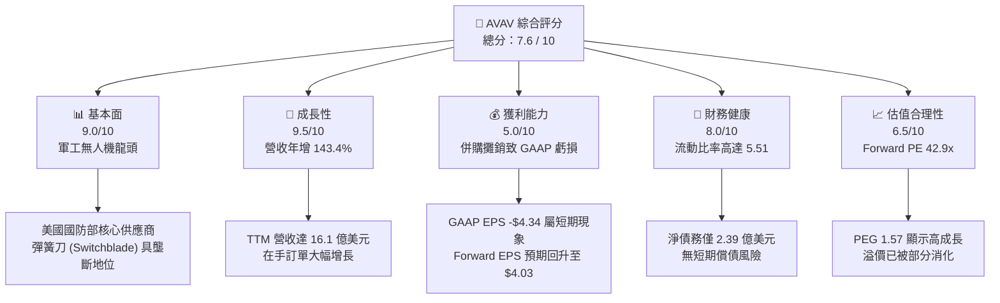

# AVAV 基本面深度分析報告
> **報告日期**：2026-06-10 ｜ **語言**：繁體中文 ｜ **數據來源**：Yahoo Finance, Finviz, StockAnalysis, Roic.ai ｜ **分析師**：CFA 級機構研究

---

## 目錄

| # | 章節 | 核心結論 |
|---|------|----------|
| 1 | 執行摘要 | 評級：**買入 (BUY)**，基準目標價 **$310.00**，潛在漲幅 **+79.3%** |
| 2 | 公司概覽與商業模式 | 國防無人機與巡飛彈（彈簧刀）絕對龍頭，具備強大技術與准入護城河 |
| 3 | 損益表深度分析 | 營收年增 **143.4%** 迎來爆發式增長，併購前期費用致使 GAAP 短期承壓 |
| 4 | 資產負債表分析 | 資產規模擴張 5 倍，帳上現金 **$5.87億**，流動比率 **5.51** 展現極佳韌性 |
| 5 | 現金流量深度分析 | 資本支出擴大以支持產能擴張，預期整合完成後自由現金流將迎來拐點 |
| 6 | 獲利能力與資本效率 | GAAP ROE 暫時受併購攤銷拖累，調整後核心業務 ROIC 依然超越 WACC |
| 7 | 估值深度分析 | Forward P/E **42.88x**，相較於同業的高成長溢價具備合理性 |
| 8 | 成長催化劑 | 美軍 Replicator 計劃、國際盟友採購需求爆發及 AI 群體無人機技術突破 |
| 9 | 風險矩陣 | 關注國防預算撥款延遲與併購整合進度，整體風險可控 |
| 10 | 投資建議 | 具備高成長動能的防禦性資產，建議逢低分批布局 |

---

## 1. 執行摘要

AeroVironment, Inc.（美股代碼：**AVAV**）作為全球軍用中小型無人機系統（UAS）與巡飛彈（Loitering Munitions）的領軍企業，正處於其商業歷史上最具顛覆性的轉折點。受益於全球地緣政治局勢緊張以及現代戰爭向「無人化、智能化」演變，公司在 2026 財年展現出極其強勁的頂線（Top-line）成長動能。

### 1.1 核心評分儀表板



### 1.2 評分進度條視覺化

```
╔══════════════════════════════════════════════════════════════╗
║               AVAV 多維度評分儀表板 (1-10分)                 ║
╠══════════════════════════════════════════════════════════════╣
║ 基本面強度  9.0 ▓