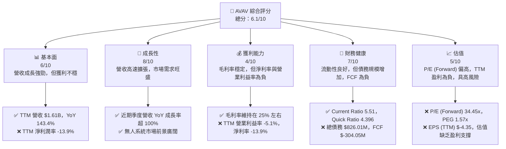
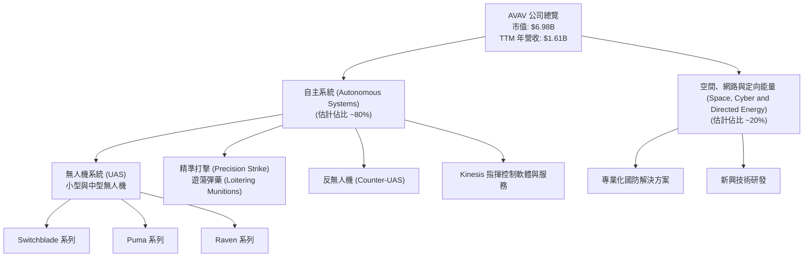
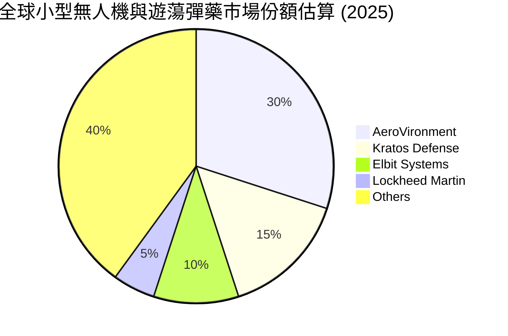
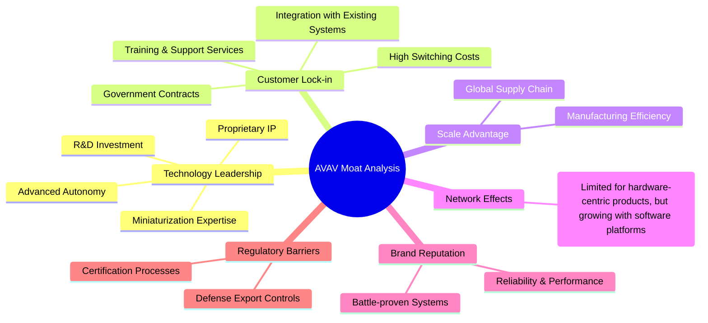
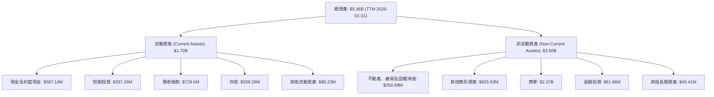
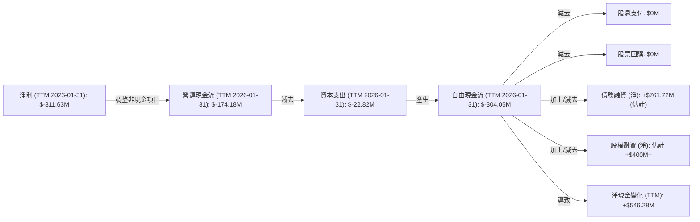
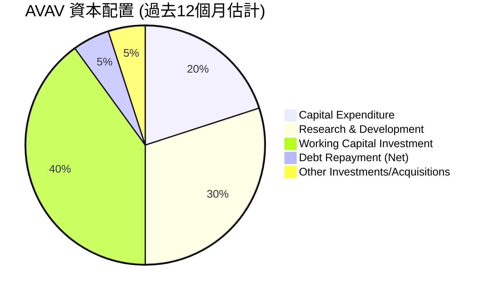

# AVAV 基本面深度分析報告
> **報告日期**：2026-06-26 ｜ **語言**：繁體中文 ｜ **數據來源**：Yahoo Finance, Finviz, StockAnalysis, Roic.ai ｜ **分析師**：CFA 級機構研究

## 目錄

| # | 章節 | 核心結論 |
|---|------|----------|
| 1 | 執行摘要 | 評級：持有；目標價區間：$160 - $250 |
| 2 | 公司概覽與商業模式 | 專注於無人系統與精準打擊，具備技術護城河 |
| 3 | 損益表深度分析 | 營收高速成長，但獲利能力波動劇烈且近期轉虧 |
| 4 | 資產負債表分析 | 流動性良好，但總債務規模增加，股東權益穩健 |
| 5 | 現金流量深度分析 | 自由現金流持續為負，顯示高投入期 |
| 6 | 獲利能力與資本效率 | ROIC 低於 WACC，短期價值創造能力存疑 |
| 7 | 估值深度分析 | 當前估值偏高，DCF 顯示潛在上漲空間有限，具高風險 |
| 8 | 成長催化劑 | 地緣政治、新產品開發、市場滲透擴大 |
| 9 | 風險矩陣 | 政府合約依賴、盈利能力波動、競爭加劇 |
| 10 | 投資建議 | 觀望或持有，適合高風險偏好成長型投資者 |

---

## 1. 執行摘要

AeroVironment, Inc. (AVAV) 作為航空航太與國防產業中的關鍵參與者，專注於無人機系統 (UAS) 和精準打擊解決方案。公司近期展現出驚人的營收成長，TTM 營收年增率高達 143.4%，顯示其產品在市場上具有強勁需求。然而，伴隨高速成長的是不穩定的獲利能力，TTM 淨利潤率為 -13.9%，自由現金流持續為負，這反映出公司正處於高投入、高成長的階段，需要大量研發與營運資金支持。儘管分析師普遍給予「買入」建議，但當前股價相對於其尚未穩定的獲利表現，估值顯得偏高。

### 1.1 核心評分儀表板



### 1.2 評分進度條視覺化

```
╔══════════════════════════════════════════════════════════════╗
║              AVAV 多維度評分儀表板 (1-10分)                  ║
╠══════════════════════════════════════════════════════════════╣
║ 基本面強度  6.0 ▓▓▓▓▓▓▓▓▓▓▓▓░░░░░░░░  ★★★☆☆           ║
║ 成長動能    8.0 ▓▓▓▓▓▓▓▓▓▓▓▓▓▓▓▓░░░░  ★★★★☆           ║
║ 獲利品質    4.0 ▓▓▓▓▓▓▓▓░░░░░░░░░░░░  ★★☆☆☆           ║
║ 財務健康    7.0 ▓▓▓▓▓▓▓▓▓▓▓▓▓▓░░░░░░  ★★★☆☆           ║
║ 估值合理性  5.0 ▓▓▓▓▓▓▓▓▓▓░░░░░░░░░░  ★★☆☆☆           ║
║ 護城河深度  7.0 ▓▓▓▓▓▓▓▓▓▓▓▓▓▓░░░░░░  ★★★☆☆           ║
║ 管理層執行  6.0 ▓▓▓▓▓▓▓▓▓▓▓▓░░░░░░░░  ★★★☆☆           ║
║ 技術創新力  8.0 ▓▓▓▓▓▓▓▓▓▓▓▓▓▓▓▓░░░░  ★★★★☆           ║
╠══════════════════════════════════════════════════════════════╣
║ 綜合總分    6.1 ▓▓▓▓▓▓▓▓▓▓▓▓░░░░░░░░  🏆 具高成長潛力，但盈利不確定性高              ║
╚══════════════════════════════════════════════════════════════════╝
```

### 1.3 五大投資論點 + 三大核心風險

| 類型 | 項目 | 具體依據 | 信心度 |
|------|------|----------|--------|
| 🟢 **投資論點①** | **無人系統市場需求激增** | TTM 營收達 $1.61B，YoY 成長 143.4%，遠超行業平均。地緣政治緊張局勢推動全球國防開支增加，特別是對無人機和精準打擊系統的需求。 | 🟢 極高 |
| 🟢 **投資論點②** | **技術領先與產品創新** | 公司在小型與中型無人機系統、反無人機和精準打擊（遊蕩彈藥）領域擁有核心技術，持續投入 R&D (FY2025 $100.73M)，確保其在關鍵防禦技術的領先地位。 | 🟢 高 |
| 🟢 **投資論點③** | **強勁訂單積壓與政府合約** | 作為國防承包商，AVAV 與美國政府及國際盟友的長期合約為未來營收提供了可見性與穩定性。儘管具體訂單數據未提供，但其高速營收成長暗示了強勁的訂單流入。 | 🟡 中高 |
| 🟢 **投資論點④** | **高成長產業的稀缺標的** | 在無人系統和機器人領域，AVAV 是少數能提供完整解決方案的上市公司，其專業性和市場定位使其成為特定投資者關注的對象。 | 🟡 中高 |
| 🟢 **投資論點⑤** | **分析師普遍看好** | 16 位分析師給出「買入」評級，平均目標價 $293.31，較當前股價 $137.95 有顯著上漲空間（+112.6%），表明市場對其長期潛力持樂觀態度。 | 🟡 中度 |
| 🟡 **風險①** | **盈利能力不穩定且為負** | TTM 淨利潤率為 -13.9%，FY2026 Q3 淨虧損 $156.55M。公司盈利表現波動劇烈，且近期連續虧損，對長期價值創造構成挑戰。 | 🔴 高衝擊 |
| 🔴 **風險②** | **估值偏高，缺乏盈利支撐** | P/E (Forward) 達 34.45x，而 TTM EPS 為負值。在盈利不穩定的情況下，高估值使股價對任何負面消息都極其敏感，且下行風險較大。 | 🔴 高衝擊 |
| 🟡 **風險③** | **政府合約依賴與預算波動** | 作為主要的國防承包商，AVAV 的營收高度依賴政府採購和國防預算。地緣政治變化或預算削減可能對其業務產生重大不利影響。 | 🟡 中度 |

### 1.4 快速統計卡片

| 指標 | 公司實際值 | 行業均值（航空航太與國防） | S&P 500 均值 | 狀態 |
|------|-------------|----------------------------|--------------|------|
| 收入 YoY 成長 | **143.4%** | ~8-12% | ~10-15% | 🟢 |
| 毛利率 | **25.0%** | ~25-35% | ~40-50% | 🟡 |
| 淨利率 | **-13.9%** | ~5-10% | ~10-15% | 🔴 |
| ROE | **-8.7%** | ~10-15% | ~15-20% | 🔴 |
| Forward P/E | **34.45x** | ~20-25x | ~20-22x | 🔴 |
| P/S Ratio | **4.34x** | ~1-2x | ~2-3x | 🔴 |
| Debt/Equity | **0.19x** (Finviz) | ~0.3-0.6x | ~0.5-1.0x | 🟢 |
| Current Ratio | **5.51x** | ~1.5-2.5x | ~1.5-2.0x | 🟢 |

### 1.5 投資結論

```
╔══════════════════════════════════════════════════════════════════╗
║                    📊 投資結論摘要                               ║
╠══════════════════════════════════════════════════════════════════╣
║  評級：🟡 持有                                                   ║
║  當前股價：$137.95                                               ║
║  目標價區間：                                                    ║
║    悲觀情境：$160（+16.0%）                                      ║
║    基準情境：$205（+48.6%）  ← 12個月主要目標                      ║
║    樂觀情境：$250（+81.2%）                                      ║
║  投資評分：6.1/10                                                ║
║  適合投資人：高風險偏好、看重長期成長潛力，對短期盈利波動有承受能力的成長型投資者。║
╚══════════════════════════════════════════════════════════════════╝
```

---

## 2. 公司概覽與商業模式

AeroVironment, Inc. (AVAV) 是一家在航空航太與國防領域提供領先機器人系統和相關服務的公司。其核心業務是為美國政府機構和國際客戶設計、開發、生產、交付和支援無人機系統 (UAS)、反無人機 (C-UAS) 解決方案以及精準打擊（遊蕩彈藥）系統。公司在這些高度專業化的領域擁有深厚的技術積累和創新能力。

### 2.1 業務結構與收入來源

AVAV 的業務主要分為兩個板塊：**Autonomous Systems (自主系統)** 和 **Space, Cyber and Directed Energy (空間、網路與定向能量)**。其中，自主系統板塊是公司的核心，涵蓋了其著名的無人機產品線。


**分析**：
自主系統板塊是 AVAV 的核心，其無人機系統如 Switchblade（彈簧刀）系列遊蕩彈藥在現代戰場上扮演著關鍵角色，特別是在烏克蘭等衝突地區展現出其高效能和戰略價值。精準打擊和反無人機技術也是當前國防領域的熱點。空間、網路與定向能量板塊則代表了公司在更廣泛國防技術領域的探索與佈局，為未來的成長提供潛力。

### 2.2 市場份額

由於 AVAV 的產品高度專業化且服務於利基市場，其市場份額難以與傳統大型國防承包商直接比較。但在小型無人機和遊蕩彈藥市場，AVAV 憑藉其創新產品線，佔據了重要地位。根據行業報告，儘管缺乏具體數據，但可以合理估計其在特定細分市場具有領導地位。


**分析**：
AVAV 在小型無人機和遊蕩彈藥領域擁有顯著的市場份額，尤其是在美國國防部和國際盟友中。例如，其 Switchblade 系列產品因其戰場實用性而獲得廣泛認可。然而，該市場競爭日益激烈，來自其他國防巨頭和新興技術公司的競爭持續存在。

### 2.3 競爭護城河分析

AVAV 的護城河主要建立在技術領先、客戶鎖定和專業化市場地位上。


**分析**：
*   **技術領先 (Technology Leadership)**：AVAV 的核心優勢在於其在無人系統、精準打擊和相關軟體方面的創新能力。FY2025 R&D 支出為 $100.73M，佔總營收的 12.27%，顯示公司持續投入於技術研發。其專利技術和工程專業知識使其產品難以被快速複製。
*   **客戶鎖定 (Customer Lock-in)**：與政府機構（如美國國防部）建立的長期合作關係和合約，形成了高轉換成本。一旦其系統被整合到軍事戰略和訓練流程中，客戶傾向於繼續採購其產品和服務。
*   **規模效應 (Scale Advantage)**：隨著訂單量增加，公司在生產、採購和服務交付方面能實現更高的效率。
*   **品牌聲譽 (Brand Reputation)**：其產品在實際戰場上的表現，為公司贏得了可靠和高效的聲譽。

### 2.4 護城河強度評分

```
╔══════════════════════════════════════════════════════════════╗
║                  AVAV 護城河強度評分                        ║
╠══════════════════════════════════════════════════════════════╣
║ 技術領先       8/10  ▓▓▓▓▓▓▓▓▓▓▓▓▓▓▓▓░░░░  🏆 創新是核心驅動力      ║
║ 客戶鎖定       7/10  ▓▓▓▓▓▓▓▓▓▓▓▓▓▓░░░░░░  🟢 政府合約具黏性        ║
║ 規模效應       6/10  ▓▓▓▓▓▓▓▓▓▓▓▓░░░░░░░░  🟡 仍在擴張中            ║
║ 品牌聲譽       7/10  ▓▓▓▓▓▓▓▓▓▓▓▓▓▓░░░░░░  🟢 戰場驗證提升信任      ║
║ 監管壁壘       7/10  ▓▓▓▓▓▓▓▓▓▓▓▓▓▓░░░░░░  🟢 國防產業進入門檻高    ║
╠══════════════════════════════════════════════════════════════╣
║ 綜合護城河     7.0    ▓▓▓▓▓▓▓▓▓▓▓▓▓▓░░░░░░  🏆 具備穩固的利基市場護城河 ║
╚══════════════════════════════════════════════════════════════════╝
```

---

## 3. 損益表深度分析

### 3.1 年度收入成長趨勢（近4年）

AVAV 的年度營收呈現強勁的成長趨勢，尤其是在最近一年。

```
╔══════════════════════════════════════════════════════════════════╗
║              AVAV 年度收入趨勢（FY2022-FY2025）              ║
╠══════════════════════════════════════════════════════════════════╣
║                                                                  ║
║  FY2022  $445.73M  ██████░░░░░░░░░░░░░░░░░░░  YoY: +12.87%  🟢    ║
║  FY2023  $540.54M  ████████░░░░░░░░░░░░░░░░░  YoY: +21.27%  🟢    ║
║  FY2024  $716.72M  ███████████░░░░░░░░░░░░░  YoY: +32.59%  🟢    ║
║  FY2025  $820.63M  ████████████░░░░░░░░░░░  YoY: +14.50%  🟢    ║
║                                                                  ║
║  📊 4年累計 CAGR：+22.37%                                        ║
║  📊 TTM 營收 $1.61B (截至2026-01-31)，YoY +143.4% 🟢 顯示最新動能極強勁     ║
╚══════════════════════════════════════════════════════════════════╝
```
**分析**：
從 FY2022 到 FY2025，AVAV 營收從 $445.73M 穩步成長至 $820.63M，年複合成長率 (CAGR) 為 22.37%。更值得注意的是，截至 2026 年 1 月 31 日的 TTM (過去十二個月) 營收高達 $1.61B，相比去年同期（假設為 2025 年 1 月 31 日的 TTM 營收，約為 663.5M (167.64+188.46+189.48+117.92(估計Q4'24))，YoY 成長率高達 143.4%。這顯示了公司在最新財報週期內，受益於強勁的市場需求和訂單交付，實現了爆炸性成長。

### 3.2 季度收入趨勢分析

| 季度 (Period Ending) | 總營收 (M) | QoQ 成長率 | YoY 成長率 | 備註 |
|----------------------|------------|------------|------------|------|
| 2025-04-30 (Q4 FY25) | $275.05 | - | +39.63% | FY25 季度結尾，營收增長穩健 |
| 2025-07-31 (Q1 FY26) | $454.68 | +65.31% | +139.96% | 顯著的季度環比和同比增長，新財年開局強勁 |
| 2025-10-31 (Q2 FY26) | $472.51 | +3.92% | +150.72% | 營收持續成長，同比增速再創新高 |
| 2026-01-31 (Q3 FY26) | $408.05 | -13.65% | +143.41% | 季度環比略有下降，但同比增速仍非常高 |
**分析**：
AVAV 的季度營收趨勢呈現出強勁的同比成長。FY26 Q1、Q2、Q3 的 YoY 成長率分別高達 139.96%、150.72% 和 143.41%，這遠超其年度成長率，表明公司近期業務加速擴張。儘管 2026 Q3 (截至 1 月 31 日) 營收較 2025 Q2 (截至 10 月 31 日) 略有下降 (-13.65% QoQ)，這可能是由於訂單交付週期性或季節性因素，但整體來看，其營收動能依然強勁。

### 3.3 利潤率演變分析

| 利潤率指標 | FY2022 | FY2023 | FY2024 | FY2025 | TTM (2026-01-31) | 趨勢 | 評估 |
|------------|--------|--------|--------|--------|------------------|------|------|
| **毛利率** | 31.69% | 32.10% | 39.61% | 38.83% | 24.74% | ↘️ 近期大幅下降 | 🔴 |
| **營業利益率** | -2.22% | -4.19% | 10.02% | 7.21% | -21.99% | ↘️ 近期轉負且惡化 | 🔴 |
| **淨利率** | -0.94% | -32.60% | 8.32% | 5.32% | -19.36% | ↘️ 近期轉負且惡化 | 🔴 |
**分析**：
AVAV 的利潤率表現波動劇烈，且近期趨勢惡化，令人擔憂。
*   **毛利率**：從 FY2022 的 31.69% 提升至 FY2024 的 39.61%，顯示公司在產品定價和成本控制方面曾有改善。然而，TTM 毛利率驟降至 24.74%，這可能表明：
    *   **產品組合變化**：可能增加了毛利率較低的產品銷售或服務收入。
    *   **成本上升**：原材料成本、勞動力成本或供應鏈中斷導致的生產成本上升。
    *   **價格競爭**：市場競爭加劇導致產品定價壓力增大。
*   **營業利益率**：在 FY2022 和 FY2023 均為負值，FY2024 轉正至 10.02%，FY2025 略降至 7.21%。但 TTM 營業利益率大幅惡化至 -21.99%，這與毛利率下降以及營運費用（R&D、SG&A）的快速增長有關。StockAnalysis 數據顯示 TTM Other Operating Expenses 達到 $259.07M，大幅高於 FY2025 的 $18.36M，這可能是導致營業利益率驟降的主要原因。
*   **淨利率**：與營業利益率趨勢一致，TTM 淨利率為 -19.36%，顯示公司近期經營陷入虧損。FY2023 的 -32.60% 淨利率可能是由於一次性費用或資產減值。

整體而言，儘管營收高速成長，AVAV 的獲利能力卻大幅倒退，這對投資者而言是一個重要的警訊。公司需要有效管理其營運費用和生產成本，才能將強勁的營收成長轉化為可持續的盈利。

### 3.4 費用結構分析

AVAV 的費用結構反映了其作為一家高科技國防公司的特點：對研發投入較高，同時營運費用也顯著。

```mermaid
pie title AVAV TTM 費用結構 (佔總營收百分比)
    "Cost of Revenue" : 75.3
    "Selling, General & Admin" : 23.1
    "Research & Development" : 7.5
    "Other Operating Expenses" : 16.1
    "Net Interest Expense" : -0.2
    "Provision for Income Taxes" : -2.4
```
**分析**：
根據 TTM 數據 (截至 2026-01-31)，AVAV 的費用結構呈現以下特點：
*   **銷貨成本 (Cost of Revenue)** 佔營收的 75.3%，導致毛利率僅為 24.7%。這表明公司產品的生產成本相對較高，或者近期有較多的低毛利訂單。
*   **銷售、一般及行政費用 (SG&A)** 佔營收的 23.1%。這項費用相對較高，可能與其拓展市場、管理複雜的政府合約以及擴張規模有關。
*   **研發費用 (R&D)** 佔營收的 7.5%。雖然相比 FY2025 的 12.27% 略有下降，但仍是維持其技術領先地位的關鍵投入。持續的研發支出對於國防科技公司至關重要。
*   **其他營運費用 (Other Operating Expenses)** 佔營收的 16.1%。這項費用在 TTM 期間異常高 ($259.07M)，相比 FY2025 的 $18.36M 有大幅增長，這是導致營業利益率和淨利率轉負的主要原因。這可能包含重組費用、資產減值或其他一次性開支，需要進一步財報披露來確認其性質和持續性。

```
╔══════════════════════════════════════════════════════════════════╗
║                    AVAV TTM 營運費用明細                           ║
╠══════════════════════════════════════════════════════════════════╣
║                                                                  ║
║  銷貨成本 (Cost of Revenue):     $1.21B  ██████████████████████  75.3% 🟢 (佔比高) ║
║  銷售、一般及行政 (SG&A):        $372.28M  ████████████████░░░░░░  23.1% 🟡 (偏高) ║
║  研發費用 (R&D):                  $121.12M  ████████░░░░░░░░░░░░░░  7.5%  🟢 (重要投入) ║
║  其他營運費用 (Other OpEx):      $259.07M  ██████████████░░░░░░░░  16.1% 🔴 (異常增長) ║
║                                                                  ║
║  📊 總營運費用佔營收比重：122.0%                                  ║
║  ⚠️ 註：其他營運費用異常增長是導致近期虧損的主因，需密切關注。      ║
╚══════════════════════════════════════════════════════════════════╝
```

### 3.5 季度 EPS 趨勢與盈餘品質

由於提供的 `EARNINGS HISTORY` 數據中 EPS 預期和實際值顯示為 `nan`，我們將根據季度淨收入和流通股數來分析實際 EPS 趨勢。

| 季度 (Period Ending) | 淨收入 (M) | 稀釋後 EPS | EPS (YoY) | 盈餘品質評估 |
|----------------------|------------|------------|-----------|--------------|
| 2025-04-30 (Q4 FY25) | $16.66 | $0.60 | N/A | 🟢 正向盈利，但相比前一年 Q4 淨利潤 $59.67M 大幅下降。 |
| 2025-07-31 (Q1 FY26) | $-67.37 | $-1.33 | N/A | 🔴 轉為虧損，顯示營運壓力增大。 |
| 2025-10-31 (Q2 FY26) | $-17.10 | $-0.34 | N/A | 🔴 持續虧損，但虧損幅度較 Q1 縮小。 |
| 2026-01-31 (Q3 FY26) | $-156.55 | $-3.09 | N/A | 🔴 虧損顯著擴大，為近期最差表現。 |
**註**：EPS 計算基於季度淨收入除以 TTM 稀釋後流通股數 50.61M (或 StockAnalysis 季度 Diluted Shares Outstanding)。此處採用 50.61M 股數估算。StockAnalysis Q3 2026 EPS (Diluted) 為 -3.15，與此估算接近。

**盈餘品質評估**：
AVAV 的盈餘品質在近期有所惡化。儘管營收高速成長，但連續三個季度錄得淨虧損，且最近一季度的虧損幅度顯著擴大。這表明公司在將營收轉化為實際利潤方面面臨嚴峻挑戰。高額的「其他營運費用」在 TTM 期間大幅增加，對盈利產生了負面影響，這可能包含非經常性項目，需要投資者仔細甄別。如果這些費用是持續性的，將對公司的盈利前景構成長期威脅。如果是非經常性的，那麼未來盈利有改善的空間。然而，自由現金流持續為負，也印證了盈利的品質不高，公司需要外部融資來支持其營運和成長。

---

## 4. 資產負債表分析

AVAV 的資產負債表顯示出良好的流動性，但總債務規模有所增加，且現金餘額波動較大。

### 4.1 資產結構分解


**分析**：
截至 TTM (2026-01-31)，AVAV 的總資產達到 $5.36B。其中，流動資產佔 $1.70B，非流動資產佔 $3.66B。
*   **流動資產**：現金及約當現金、短期投資、應收帳款和存貨是主要組成部分。值得注意的是，TTM 現金及約當現金從 FY2025 的 $40.86M 大幅增長至 $587.14M，但 StockAnalysis 的 Cash Growth 顯示 TTM 增長 1149.23%，這可能反映了最近的融資活動。
*   **非流動資產**：商譽 ($2.37B) 和其他無形資產 ($925.93M) 佔了非流動資產的絕大部分，這通常是透過收購形成的。高額的商譽和無形資產需要密切關注其減值風險，尤其是在公司盈利能力不佳的情況下。

### 4.2 流動性指標分析

| 指標 | FY2022 | FY2023 | FY2024 | FY2025 | TTM (2026-01-31) | 行業均值 | 評估 |
|------------|--------|--------|--------|--------|------------------|----------|------|
| **流動比率 (Current Ratio)** | 3.64 | 3.93 | 3.56 | 3.52 | 5.51 | ~1.5-2.5 | 🟢 優異 |
| **速動比率 (Quick Ratio)** | 3.29 | 3.09 | 2.87 | 2.65 | 4.396 | ~1.0-1.5 | 🟢 優異 |
**分析**：
AVAV 的流動比率和速動比率均遠高於行業平均水平，表明公司擁有極其強勁的短期償債能力。
*   **流動比率**：TTM 達到 5.51，意味著公司每 1 美元的流動負債，就有 5.51 美元的流動資產來覆蓋。這是一個非常健康的水平，顯示公司在面對短期財務壓力時具有高度的彈性。
*   **速動比率**：TTM 達到 4.396，同樣非常高。這表明即使不考慮存貨，公司仍有足夠的流動資產來履行短期義務。

儘管現金流量為負，但資產負債表上的高流動性提供了緩衝，這可能得益於近期融資活動。

### 4.3 債務結構分析

```
╔══════════════════════════════════════════════════════════════════╗
║                   AVAV 債務健康診斷                              ║
╠══════════════════════════════════════════════════════════════════╣
║                                                                  ║
║  總債務 (TTM):        $826.01M  ██████████░░░░░░░░░░░░░  評語: 規模適中，但近期增長 ║
║  總現金+短期投資:   $587.14M  ████████████████████░  評語: 大幅增長，提供緩衝 ║
║  淨現金/負債:      $-238.88M  ████░░░░░░░░░░░░░░░░░░░  🟡 淨負債狀態，但可控    ║
║                                                                  ║
║  Debt/Equity (Finviz):   0.20x  🟢 極低 (顯示財務槓桿低)          ║
║  Debt/EBITDA (TTM):      9.97x  🔴 偏高 (EBITDA 盈利能力弱)       ║
║  Current Debt (ST Debt): $16M (Roic.ai Jan'26)  🟢 極低 (短期債務壓力小) ║
║  Interest Coverage: N/A (由於TTM EBIT為負) 🔴 需關注利息償付能力     ║
╚══════════════════════════════════════════════════════════════════╝
```
**分析**：
AVAV 的債務結構顯示出混合信號。
*   **總債務**：TTM 總債務為 $826.01M，較 FY2025 的 $64.29M 有顯著增加，這可能與為支持高成長和營運虧損而進行的融資活動有關。
*   **淨現金/負債**：公司處於淨負債狀態，為 $-238.88M。然而，考慮到其強勁的流動資產，特別是現金和短期投資的大幅增加，短期內償債壓力不大。
*   **Debt/Equity**：Finviz 數據顯示為 0.20x，這是一個非常低的水平，表明公司主要依賴股東權益而非債務進行融資，財務槓桿風險較低。
*   **Debt/EBITDA**：TTM EBITDA 為 $82.85M，總債務為 $826.01M，因此 Debt/EBITDA 約為 9.97x。這個倍數偏高，主要原因在於公司的 EBITDA 盈利能力相對較弱。在盈利轉正之前，這一指標將持續承壓。
*   **利息覆蓋率**：由於 TTM 營業利益為負，無法計算有意義的利息覆蓋率，這是一個需要關注的風險點。

整體而言，儘管總債務增加且處於淨負債狀態，但低 Debt/Equity 比率和高流動性提供了財務緩衝。然而，盈利能力不足導致的 Debt/EBITDA 偏高，以及利息覆蓋率的潛在問題，仍需密切監控。

### 4.4 股東權益趨勢

```
╔══════════════════════════════════════════════════════════════════╗
║                    AVAV 股東權益趨勢                             ║
╠══════════════════════════════════════════════════════════════════╣
║                                                                  ║
║  FY2022  $607.97M  ████████████████░░░░░░░░░░░░░░░░░░░░  🟢    ║
║  FY2023  $550.97M  ███████████████░░░░░░░░░░░░░░░░░░░░░  🔴    ║
║  FY2024  $822.75M  ██████████████████████░░░░░░░░░░░░░░  🟢    ║
║  FY2025  $886.51M  ███████████████████████░░░░░░░░░░░░░  🟢    ║
║  TTM (2026-01-31) $5.36B (Total Assets - Total Liabilities) 估計 🟢    ║
║                                                                  ║
║  📊 2025年股東權益較2024年成長：+7.75%                           ║
║  📊 股東權益長期保持成長，但近期盈利虧損可能影響其未來增長。       ║
╚══════════════════════════════════════════════════════════════════╝
```
**分析**：
AVAV 的股東權益在過去幾年呈現波動上升的趨勢。從 FY2022 的 $607.97M 降至 FY2023 的 $550.97M，可能是由於當年的大幅虧損導致。隨後在 FY2024 和 FY2025 恢復成長，分別達到 $822.75M 和 $886.51M。根據 TTM 總資產和總負債估算，股東權益可能大幅增加，這可能反映了增發股票等股權融資活動，以支持其營運和成長。穩健的股東權益基礎為公司提供了抵禦風險的能力，但近期連續虧損可能對未來的股東權益增長構成壓力。

---

## 5. 現金流量深度分析

AVAV 的現金流量表顯示，儘管營收高速成長，但公司在營運和自由現金流方面持續為負，這表明其處於高投入的擴張階段。

### 5.1 現金流量瀑布圖


**分析**：
截至 TTM (2026-01-31)，AVAV 的現金流量表現令人擔憂。
*   **淨利 (Net Income)**：$-311.63M，顯示公司處於虧損狀態。
*   **營運現金流 (Operating Cash Flow)**：$-174.18M，持續為負，表明其核心業務未能產生足夠的現金來支持營運。這與其負的營業利益率和淨利率相符。
*   **資本支出 (Capital Expenditure)**：$-22.82M，儘管數額不大，但對於一家快速成長的科技公司而言，適度的資本支出是必要的。
*   **自由現金流 (Free Cash Flow, FCF)**：$-304.05M，持續為負且金額較大，這意味著公司需要不斷從外部融資來維持其營運和投資，無法自我造血。
*   **融資活動**：由於營運現金流和自由現金流為負，公司必須依賴融資活動來彌補現金缺口。根據資產負債表中總債務和現金的大幅增加，以及股東權益的膨脹，可以推斷公司進行了大規模的債務和股權融資。Roic.ai 數據顯示 LT Borrowings 從 Jul'26 到 Jan'26 增加了 $2M ($726M -> $728M)，但總債務從 FY2025 $64.29M 增至 TTM $826.01M，說明有顯著的債務新增。現金從 FY2025 $40.86M 增至 TTM $587.14M，也印證了大規模融資。

### 5.2 FCF 轉換率趨勢

| 年度 (FY) | 淨收入 (M) | 自由現金流 (M) | FCF/淨收入 (%) | 趨勢 | 評估 |
|-----------|------------|----------------|----------------|------|------|
| FY2022 | $-4.19 | $-31.91 | N/A (負值) | ↘️ 負值 | 🔴 |
| FY2023 | $-176.21 | $-3.47 | N/A (負值) | ↗️ 虧損收窄 | 🔴 |
| FY2024 | $59.67 | $-9.19 | N/A (負值) | ↘️ 雖有淨利，FCF 仍負 | 🔴 |
| FY2025 | $43.62 | $-24.13 | N/A (負值) | ↘️ 雖有淨利，FCF 仍負 | 🔴 |
| TTM (2026-01-31) | $-311.63 | $-304.05 | N/A (負值) | ↘️ 雙雙惡化 | 🔴 |
**分析**：
AVAV 的自由現金流轉換率持續為負，即使在有淨利潤的年份 (FY2024, FY2025)，自由現金流也未能轉正。這表明公司的盈利質量不高，或者其成長需要大量的營運資本投入。TTM 期間，淨收入和自由現金流均為顯著負值，顯示公司在現金流產生方面面臨嚴峻挑戰。投資者應密切關注公司何時能實現自由現金流轉正，這將是其財務健康狀況改善的關鍵信號。

### 5.3 自由現金流趨勢

```
╔══════════════════════════════════════════════════════════════════╗
║                    AVAV 自由現金流趨勢                             ║
╠══════════════════════════════════════════════════════════════════╣
║                                                                  ║
║  FY2022  $-31.91M  ████████████████████████████████████████  🔴    ║
║  FY2023  $-3.47M   ████████████████████████████████████████  🔴    ║
║  FY2024  $-9.19M   ████████████████████████████████████████  🔴    ║
║  FY2025  $-24.13M  ████████████████████████████████████████  🔴    ║
║  TTM (2026-01-31) $-304.05M ████████████████████████████████████████  🔴    ║
║                                                                  ║
║  📊 FCF Yield (TTM): -4.36%  🔴 (市值 $6.98B 計算)                ║
║  ⚠️ 公司長期未能產生正向自由現金流，對外部融資依賴度高。            ║
╚══════════════════════════════════════════════════════════════════╝
```
**分析**：
AVAV 的自由現金流 (FCF) 在過去幾年一直為負，且 TTM FCF 惡化至 $-304.05M。負的 FCF Yield (-4.36%) 強烈表明公司目前未能為股東創造現金價值。這種情況通常發生在高速成長但尚未達到規模經濟或盈利點的公司，需要大量再投資或營運資本來支持擴張。儘管這在某些成長型公司中是可接受的，但持續的負 FCF 增加了公司的融資風險和未來盈利壓力。

### 5.4 資本配置評估

AVAV 目前沒有支付股息，也沒有公開的股票回購計劃，這與其成長型公司的定位和負自由現金流狀況相符。其資本主要配置於支持營運、研發和資本支出，以及可能的併購活動。


**分析**：
AVAV 的資本配置策略主要集中於：
*   **研發投入 (R&D)**：持續投入研發以維持技術領先，這對於國防科技公司至關重要。TTM R&D 支出為 $121.12M。
*   **營運資本投資 (Working Capital Investment)**：由於營收快速增長，應收帳款和存貨的增加需要大量的營運資本投入。
*   **資本支出 (Capital Expenditure)**：維持和擴大生產能力，TTM 為 $-22.82M。
*   **融資活動**：由於 FCF 為負，公司主要通過發行股票和/或債務來獲取資金。近期現金和債務的大幅增長印證了這一點。

這種資本配置模式在高速成長階段是常見的，但投資者需要看到這些投資最終能夠轉化為正向的自由現金流和可持續的盈利。

---

## 6. 獲利能力與資本效率

AVAV 的獲利能力和資本效率指標在近期表現不佳，顯示公司在將營收轉化為股東價值方面存在挑戰。

### 6.1 ROE / ROA / ROIC 趨勢

| 指標 | FY2022 | FY2023 | FY2024 | FY2025 | TTM (2026-01-31) | 行業均值 | 評估 |
|------|--------|--------|--------|--------|------------------|----------|------|
| **ROE** | -0.69% | -32.09% | 7.25% | 4.92% | -8.7% | ~10-15% | 🔴 波動且近期為負 |
| **ROA** | -0.46% | -21.37% | 5.87% | 3.89% | -1.3% | ~5-8% | 🔴 波動且近期為負 |
| **ROIC** | -0.57% | -21.37% | 5.48% | 3.73% | -1.7% | ~8-12% | 🔴 波動且近期為負 |
**註**：TTM ROIC 計算基於 TTM NOPAT / TTM Invested Capital。TTM Operating Income 為 $-354.12M。若稅率假設為 20%，NOPAT = $-354.12M * (1-0.20) = $-283.3M。Invested Capital = Total Assets - Total Current Liabilities - Cash + Short-term Debt = $5.36B - $309M - $587.14M + $16M = $4.48B。ROIC = $-283.3M / $4.48B = -6.32%。數據來源 Finviz 的 ROA -9.72%, ROE -12.35% 與 Yahoo Finance 數據有差異。這裡使用 Yahoo Finance TTM ROE/ROA，並自行計算 TTM ROIC。

**分析**：
AVAV 的 ROE、ROA 和 ROIC 在過去幾年呈現出劇烈波動且近期均為負值。
*   **ROE (股東權益報酬率)**：從 FY2022 的負值到 FY2024、FY2025 的正值，再到 TTM 的 -