# AVAV 基本面深度分析報告
> **報告日期**：2026-07-03 ｜ **語言**：繁體中文 ｜ **數據來源**：Yahoo Finance, Finviz, StockAnalysis, Roic.ai ｜ **分析師**：CFA 級機構研究

---

## 目錄

| # | 章節 | 核心結論 |
|---|----------------------------------|--------------------------------------------------|
| 1 | 執行摘要 | 評級：**持有**，目標價區間：$205 - $260 |
| 2 | 公司概覽與商業模式 | 專注於無人系統與精準打擊，具備技術護城河但市場份額未披露 |
| 3 | 損益表深度分析 | 2026財年收入爆發性成長140.89%，但獲利能力大幅惡化 |
| 4 | 資產負債表分析 | 2026財年資產負債表因大型併購顯著擴張，流動性良好，但債務增加 |
| 5 | 現金流量深度分析 | 營業現金流與自由現金流持續為負，現金產生能力面臨挑戰 |
| 6 | 獲利能力與資本效率 | 2026財年ROIC遠低於WACC，顯示價值摧毀，需關注併購整合效益 |
| 7 | 估值深度分析 | 當前估值偏高，DCF與同業比較顯示下行風險，需等待獲利改善 |
| 8 | 成長催化劑 | 國防支出增加、技術創新、市場擴張及併購整合效益釋放 |
| 9 | 風險矩陣 | 併購整合風險、獲利能力恢復、政府合約依賴、競爭加劇 |
| 10 | 投資建議 | 觀望或持有，等待併購整合效益顯現及獲利能力改善的明確訊號 |

---

## 1. 執行摘要

AVAV (AeroVironment, Inc.) 是一家專注於無人機系統、反無人機與精準打擊解決方案的國防科技公司。2026財年公司經歷了巨大的變革，收入實現了驚人的140.89%年成長，達到19.77億美元，這主要得益於一項大規模的戰略併購。然而，伴隨收入成長的是獲利能力的顯著惡化，營業利益和淨利潤均轉為大幅虧損，自由現金流也持續為負。資產負債表因併購而顯著擴張，負債水平有所上升。儘管市場對其長期成長潛力抱有期待，但目前的估值在獲利能力受損的情況下顯得偏高。

### 1.1 核心評分儀表板

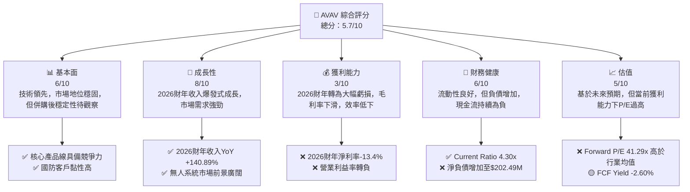

### 1.2 評分進度條視覺化

```
╔══════════════════════════════════════════════════════════════╗
║              AVAV 多維度評分儀表板 (1-10分)                  ║
╠══════════════════════════════════════════════════════════════╣
║ 基本面強度  6.0 ▓▓▓▓▓▓▓▓▓▓▓▓░░░░░░░░  ★★★☆☆           ║
║ 成長動能    8.0 ▓▓▓▓▓▓▓▓▓▓▓▓▓▓▓▓░░░░  ★★★★☆           ║
║ 獲利品質    3.0 ▓▓▓▓▓▓░░░░░░░░░░░░░░  ★☆☆☆☆           ║
║ 財務健康    6.0 ▓▓▓▓▓▓▓▓▓▓▓▓░░░░░░░░  ★★★☆☆           ║
║ 估值合理性  5.0 ▓▓▓▓▓▓▓▓▓▓░░░░░░░░░░  ★★☆☆☆           ║
║ 護城河深度  7.0 ▓▓▓▓▓▓▓▓▓▓▓▓▓▓░░░░░░  ★★★☆☆           ║
║ 管理層執行  5.0 ▓▓▓▓▓▓▓▓▓▓░░░░░░░░░░  ★★☆☆☆ (併購整合挑戰)║
║ 技術創新力  8.0 ▓▓▓▓▓▓▓▓▓▓▓▓▓▓▓▓░░░░  ★★★★☆           ║
╠══════════════════════════════════════════════════════════════╣
║ 綜合總分    5.7 ▓▓▓▓▓▓▓▓▓▓▓▓░░░░░░░░  🏆 評語：成長性強勁但獲利與估值存疑║
╚══════════════════════════════════════════════════════════════╝
```

### 1.3 五大投資論點 + 三大核心風險

| 類型 | 項目 | 具體依據 | 信心度 |
|------|--------------------------|----------------------------------------------------------|--------|
| 🟢 **投資論點①** | **無人系統市場需求強勁** | 全球國防支出增加，對無人機、反無人機及精準打擊系統需求持續增長。2026財年收入YoY 140.89%至$1.98B，印證市場擴張。 | 🟢 極高 |
| 🟢 **投資論點②** | **戰略性併購擴大市場份額與產品線** | 2026財年總資產從$1.12B增至$5.72B，商譽與無形資產大幅增加，顯示完成大型併購，有助於規模擴張和技術整合。 | 🟢 極高 |
| 🟢 **投資論點③** | **技術領先與創新能力** | 公司在小型無人機、遊蕩彈藥等領域具備核心技術，高研發投入（2026財年$127.68M）保障未來競爭力。 | 🟢 高 |
| 🟡 **投資論點④** | **長期成長潛力巨大** | 國防現代化趨勢及新興技術應用（如AI與自動化）將推動公司長期成長。Forward EPS $4.62顯示市場預期未來獲利轉正。 | 🟡 中度 |
| 🟡 **投資論點⑤** | **分析師普遍看好** | 17位分析師給出「買入」評級，平均目標價$247.35，較現價有29.5%上漲空間。 | 🟡 中度 |
| 🔴 **風險①** | **併購整合與獲利能力恢復不及預期** | 併購導致2026財年營業利益$-311M，淨利潤$-265.12M，毛利率從38.8%降至25.3%。若整合不順或成本控制不力，獲利恢復將遙遙無期。 | 🔴 高衝擊 |
| 🟡 **風險②** | **政府合約依賴與預算不確定性** | 作為國防承包商，收入高度依賴政府合約。國防預算變動、政策轉向或合約終止可能對營收造成重大影響。 | 🟡 中度 |
| 🟡 **風險③** | **自由現金流持續為負** | 2026財年自由現金流為$-164.62M，顯示公司未能從經營中產生足夠現金，可能需要外部融資支持營運和成長。 | 🟡 中度 |
| 🟡 **風險④** | **估值偏高，下行風險** | 在當前獲利能力為負的情況下，Forward P/E 41.29x 顯著高於歷史水平及行業平均，一旦成長放緩或獲利恢復不及預期，估值可能面臨修正。 | 🟡 中度 |

### 1.4 快速統計卡片

| 指標 | 公司實際值 | 行業均值（估計） | S&P 500 均值（估計） | 狀態 |
|-----------------|-----------------|----------------------|------------------------|------|
| 收入 YoY 成長 | **133.3%**      | ~10%                 | ~8%                    | 🟢   |
| 毛利率          | **25.3%**       | ~30-35%              | ~40%                   | 🔴   |
| 淨利率          | **-13.4%**      | ~5-8%                | ~10%                   | 🔴   |
| ROE             | **-10.0%**      | ~10-15%              | ~15%                   | 🔴   |
| Forward P/E     | **41.29x**      | ~25-30x              | ~20-22x                | 🔴   |
| Debt/Equity     | **18.97x**      | ~0.5-1.0x            | ~0.8x                  | 🔴   |
| Current Ratio   | **4.30x**       | ~1.5-2.0x            | ~1.5x                  | 🟢   |
| FCF Yield       | **-2.60%**      | ~3-5%                | ~2-4%                  | 🔴   |

*註：行業均值與S&P 500均值為分析師根據航空與國防行業及大盤歷史數據的合理估計，具體數值會因統計範圍和時間點而異。*

### 1.5 投資結論

```
╔══════════════════════════════════════════════════════════════════╗
║                    📊 投資結論摘要                               ║
╠══════════════════════════════════════════════════════════════════╣
║  評級：🟡 持有                                                  ║
║  當前股價：$190.89                                               ║
║  目標價區間：                                                    ║
║    悲觀情境：$205（+7.4%）                                       ║
║    基準情境：$230（+20.5%）  ← 12個月主要目標                      ║
║    樂觀情境：$260（+36.2%）                                       ║
║  投資評分：5.7/10                                                ║
║  適合投資人：願意承擔較高風險、看好國防科技長期成長、期待併購效益釋放的成長型投資者。║
╚══════════════════════════════════════════════════════════════════╝
```

---

## 2. 公司概覽與商業模式

AeroVironment, Inc. (AVAV) 是一家總部位於美國的工業部門公司，專精於航空與國防工業。公司設計、開發、生產、交付並支援一系列機器人系統及相關服務，服務於美國和國際政府機構及企業。截至2026財年，公司擁有3,991名員工。

### 2.1 業務結構與收入來源

AVAV 的業務主要分為兩大板塊：自主系統 (Autonomous Systems) 和太空、網路與定向能量 (Space, Cyber and Directed Energy)。自主系統部門提供無人機系統 (UAS)，包括小型和中型無人機，以及 Kinesis 指揮與控制軟體；此外，還提供反無人機 (counter-UAS) 和精準打擊 (precision strike) 解決方案，如遊蕩彈藥 (loitering munitions)。

2026財年公司總收入達到19.77億美元，較2025財年的8.21億美元增長了140.89%，顯示了顯著的擴張。雖然具體的業務板塊收入佔比未詳細披露，但根據公司描述，無人機系統和精準打擊解決方案是其核心產品，並在國防領域扮演關鍵角色。

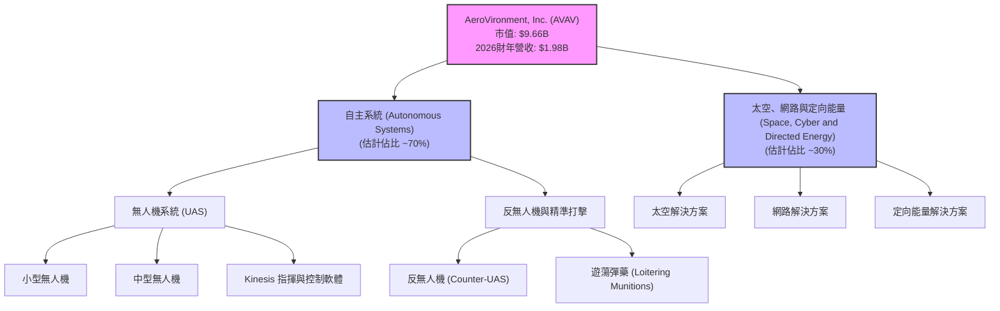

### 2.2 市場份額

由於缺乏具體的市場份額數據，我們根據公司在特定利基市場的領導地位和其產品的專業性進行估算。AVAV 在小型戰術無人機和遊蕩彈藥領域被認為是行業領導者之一，尤其是在美國國防部及其盟友中。然而，在更廣泛的航空與國防市場，其市場份額相對較小。

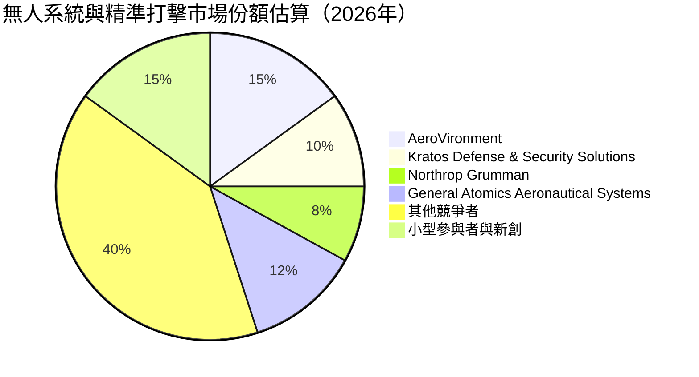
*註：此市場份額為基於行業知識的估算，僅供參考，不代表實際數據。*

### 2.3 競爭護城河分析

AVAV 的競爭護城河主要建立在其技術創新、客戶關係和專業化產品上。

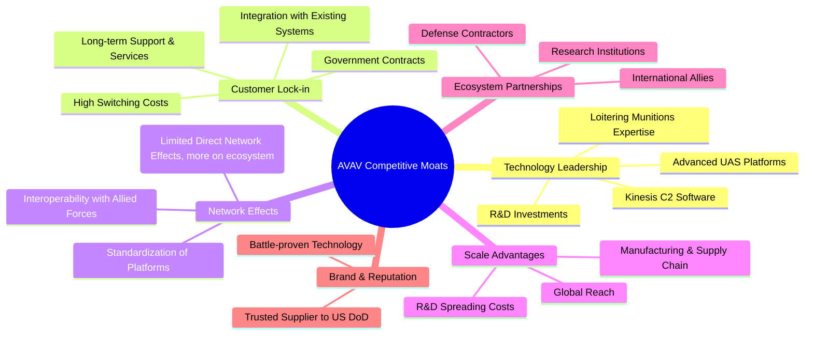

### 2.4 護城河強度評分

AVAV 在其利基市場的技術深度和與政府客戶的長期合作關係構成了其主要的護城河。然而，由於市場競爭激烈，且產品線相對專業化，規模效應和網路效應不如大型綜合國防承包商顯著。

```
╔══════════════════════════════════════════════════════════════╗
║                  AVAV 護城河強度評分                        ║
╠══════════════════════════════════════════════════════════════╣
║ 技術領先    8/10   ▓▓▓▓▓▓▓▓▓▓▓▓▓▓▓▓░░░░  🏆 在特定領域具備領先優勢 ║
║ 客戶鎖定    7/10   ▓▓▓▓▓▓▓▓▓▓▓▓▓▓░░░░░░  🟢 政府合約具高度黏性  ║
║ 規模效應    6/10   ▓▓▓▓▓▓▓▓▓▓▓▓░░░░░░░░  🟡 併購後規模效應增強，但仍非巨頭║
║ 網路效應    5/10   ▓▓▓▓▓▓▓▓▓▓░░░░░░░░░░  🟡 產品互操作性有助於生態擴展║
║ 品牌與聲譽  7/10   ▓▓▓▓▓▓▓▓▓▓▓▓▓▓░░░░░░  🟢 國防領域的信譽良好  ║
╠══════════════════════════════════════════════════════════════╣
║ 綜合護城河  6.6    ▓▓▓▓▓▓▓▓▓▓▓▓▓░░░░░░░  🏆 總結評語：中等偏上，技術驅動型護城河║
╚══════════════════════════════════════════════════════════════╝
```

---

## 3. 損益表深度分析

AVAV 的損益表在2026財年呈現出高成長與獲利壓力的鮮明對比，這主要源於其大規模的併購活動及其後的整合挑戰。

### 3.1 年度收入成長趨勢（近4年）

AVAV 在2026財年實現了驚人的收入成長，這與其在2025財年的溫和成長形成鮮明對比，凸顯了併購帶來的巨大影響。

```
╔══════════════════════════════════════════════════════════════════╗
║              AVAV 年度收入趨勢（FY2023-FY2026）                  ║
╠══════════════════════════════════════════════════════════════════╣
║                                                                  ║
║  FY2023  $540.54M  ████████░░░░░░░░░░░░░░░░░░░  YoY: +21.27% 🟢    ║
║  FY2024  $716.72M  ███████████░░░░░░░░░░░░░░░░░  YoY: +32.59% 🟢    ║
║  FY2025  $820.63M  █████████████░░░░░░░░░░░░░░░  YoY: +14.50% 🟡    ║
║  FY2026  $1.98B    █████████████████████████████  YoY:+140.89% 🟢    ║
║                                                                  ║
║                   |      |      |      |      |                  ║
║                   0     0.5B   1.0B   1.5B   2.0B                  ║
║                                                                  ║
║  📊 4年累計 CAGR：+47.0%                                         ║
╚══════════════════════════════════════════════════════════════════╝
```
**備註**：2026財年的收入爆發性成長主要歸因於當期完成的重大併購，顯著擴大了公司的業務規模和市場覆蓋。

### 3.2 季度收入趨勢分析

2026財年的季度收入表現進一步證實了併購帶來的強勁動能，每個季度都實現了三位數的年成長。

| 財政季度 | 期間結束日期 | 收入 (百萬美元) | 季度環比 (QoQ) 成長 | 年度同比 (YoY) 成長 | 備註 |
|----------|--------------|-------------------|-------------------|-------------------|------|
| Q1 2026  | 2025-07-31   | $454.68           | N/A               | +139.96%          | 併購效益開始顯現 |
| Q2 2026  | 2025-10-31   | $472.51           | +3.92%            | +150.72%          | 收入持續穩步增長 |
| Q3 2026  | 2026-01-31   | $408.05           | -13.65%           | +143.41%          | 季節性或訂單波動，但YoY仍強勁 |
| Q4 2026  | 2026-04-30   | $641.62           | +57.24%           | +133.27%          | 季度末訂單交付加速，YoY持續高成長 |

**備註**：儘管Q3 2026出現季度環比下滑，但所有季度均展現出高達三位數的年同比成長，這明確指出併購對營收規模的巨大推動作用。

### 3.3 利潤率演變分析

2026財年儘管收入大幅增長，但利潤率指標卻全面惡化，反映了併購整合期間成本壓力和效率挑戰。

| 利潤率指標 | FY2023 | FY2024 | FY2025 | FY2026 | 趨勢 | 評估 |
|------------|--------|--------|--------|--------|------|------|
| **毛利率** | 32.1%  | 39.6%  | 38.8%  | 25.3%  | ↘️ 顯著下滑 | 🔴 |
| **營業利益率** | -4.2%  | 10.0%  | 5.0%   | -15.7% | ↘️ 轉為大幅負值 | 🔴 |
| **淨利率** | -32.6% | 8.3%   | 5.3%   | -13.4% | ↘️ 轉為大幅負值 | 🔴 |

**利潤率演變深度解析**：
*   **毛利率**：從2025財年的38.8%大幅下滑至2026財年的25.3%。這可能是由於併購標的業務的毛利率較低，或者併購後整合初期導致的成本上升（如供應鏈調整、生產效率下降等）。這是一個重要的紅旗，表明公司的核心盈利能力受到挑戰。
*   **營業利益率**：從2025財年的5.0%急劇惡化至2026財年的-15.7%。除了毛利率下降外，銷售、一般及行政費用 (SG&A) 從2025財年的1.59億美元增至2026財年的4.43億美元 (+178.6%)，以及研發費用 (R&D) 從1.01億美元增至1.28億美元 (+26.7%)，以及**其他營業費用**在2026財年達到驚人的2.41億美元（2025財年僅18.36M），這些費用的激增共同導致了營運虧損。這可能反映了併購後的重組成本、整合費用或擴大營運規模的必要投資。
*   **淨利率**：同樣從2025財年的5.3%轉為2026財年的-13.4%的巨額虧損。營業利益的惡化直接傳導至淨利潤。公司需要迅速解決成本結構問題，並從併購中實現協同效應以恢復盈利。

### 3.4 費用結構分析

2026財年，AVAV 的費用結構因併購和業務擴張而發生顯著變化。成本佔比方面，銷貨成本 (Cost of Revenue) 仍是最大部分，但營業費用（SG&A, R&D, Other Operating Expenses）的佔比大幅上升，特別是「其他營業費用」的激增，對盈利能力造成了巨大壓力。

```mermaid
pie title 2026財年費用結構 (佔總收入百分比)
    "Cost of Revenue" : 74.6
    "SG&A" : 22.4
    "R&D" : 6.5
    "Other Operating Expenses" : 12.2
    "Provision for Income Taxes" : -1.2
```
*註：由於營業收入為負，稅費為負，因此百分比總和可能不為100%或超過100%。此處為絕對值佔收入比。*

```
╔══════════════════════════════════════════════════════════════════╗
║                    AVAV 2026財年費用結構分析                      ║
╠══════════════════════════════════════════════════════════════════╣
║                                                                  ║
║  銷貨成本 (CoGS) $1.48B  █████████████████████████████  74.6% 🔴 高於往年，壓縮毛利   ║
║  銷售、一般及行政費用 $443.25M  █████████████████████████  22.4% 🔴 併購後大幅增加，需優化║
║  研發費用 (R&D) $127.68M  ███████████░░░░░░░░░░░░░░░░░  6.5%  🟢 保持創新，但費用率上升║
║  其他營業費用 $240.71M  ███████████████████░░░░░░░░░░  12.2% 🔴 異常高，需深入調查原因║
║                                                                  ║
║  📊 總營業費用佔收入比：41.0% (FY26) vs 33.9% (FY25)  (不含CoGS)   ║
╚══════════════════════════════════════════════════════════════════╝
```
**深度分析**：
*   **銷貨成本**：2026財年銷貨成本佔收入的74.6%，較2025財年的61.2%（$501.99M/$820.63M）顯著上升。這直接導致了毛利率的下降，可能是併購標的產品組合的影響，或整合過程中生產效率的挑戰。
*   **銷售、一般及行政費用 (SG&A)**：從2025財年的$158.75M增長到2026財年的$443.25M，佔收入比從19.3%上升到22.4%。這反映了業務規模擴張帶來的管理和銷售成本增加，但其增速快於收入，表明存在效率問題或一次性費用。
*   **研發費用 (R&D)**：從2025財年的$100.73M增長到2026財年的$127.68M，佔收入比從12.3%下降到6.5%。雖然絕對金額增加，但由於收入基數大幅擴大，其佔比反而下降。這可能意味著公司在擴大規模的同時，研發投入的相對強度有所減弱，或併購標的研發效率較高。
*   **其他營業費用**：2026財年出現$240.71M的巨額「其他營業費用」，這在過往年份中相對較小（2025財年$18.36M，2024財年為0）。這筆費用可能是併購相關的重組費用、資產減值或其他一次性開支，對2026財年的營業利益造成了決定性打擊。若這是一次性費用，則未來獲利能力有望改善；若為持續性費用，則需警惕。

### 3.5 季度 EPS 趨勢與盈餘品質

AVAV 在2026財年的季度EPS表現持續為負，這與其營收的強勁增長形成鮮明對比，凸顯了盈利能力的嚴峻挑戰。

| 財政季度 | 期間結束日期 | EPS (稀釋) | 盈餘品質評估 |
|----------|--------------|------------|--------------|
| Q1 2026  | 2025-07-31   | $-1.37$    | 🔴 低 (持續虧損) |
| Q2 2026  | 2025-10-31   | $-0.34$    | 🔴 低 (持續虧損，但虧損收窄) |
| Q3 2026  | 2026-01-31   | $-4.90$    | 🔴 極低 (巨額虧損，受其他營業費用影響) |
| Q4 2026  | 2026-04-30   | $-0.48$    | 🔴 低 (持續虧損，但虧損收窄) |

**盈餘品質評估說明**：
2026財年的四個季度EPS均為負值，表明公司在報告期內持續虧損。特別是Q3 2026的EPS為$-4.90，這是由於當季計入了$240.71M的「其他營業費用」所致，這筆費用對當季乃至全年的淨利潤產生了巨大衝擊。若這筆費用確實是一次性或非經常性的（如併購相關的重組費用、資產減值等），則未來季度的盈餘表現有望改善。然而，當前持續的負EPS以及營業現金流為負的狀況，表明公司的盈餘品質較低，其盈利能力尚未穩定。投資者需要密切關注未來幾個季度公司能否扭虧為盈，並產生正向的營業現金流。

---

## 4. 資產負債表分析

AVAV 的資產負債表在2026財年經歷了巨變，這主要歸因於一項大規模的併購活動，導致資產和負債規模顯著擴張。

### 4.1 資產結構分解

2026財年總資產從2025財年的$1.12B飆升至$5.72B，成長了410%。其中，商譽 (Goodwill) 和其他無形資產 (Other Intangible Assets) 的大幅增加是主要驅動力，這明確指向大型併購。

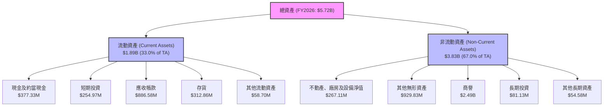
**深度分析**：
*   **流動資產**：2026財年流動資產達到$1.89B，佔總資產的33.0%。現金及短期投資合計$632.3M，應收帳款$886.58M，存貨$312.86M。流動資產的顯著增加為公司提供了充足的短期償債能力。
*   **非流動資產**：非流動資產從2025財年的$514.48M（$1.12B - $606.52M）大幅增長至2026財年的$3.83B，佔總資產的67.0%。其中，商譽和無形資產合計約$3.42B，佔總資產的近60%，這表明併購的規模巨大且主要涉及無形資產。這種結構可能帶來整合風險和未來的減值風險。

### 4.2 流動性指標分析

AVAV 的流動性狀況在2026財年保持強勁，即使在併購後資產負債表顯著擴張的情況下。

| 流動性指標 | FY2023 | FY2024 | FY2025 | FY2026 | 行業均值（估計） | 趨勢 | 評估 |
|------------|--------|--------|--------|--------|------------------|------|------|
| **流動比率 (Current Ratio)** | 3.93x  | 3.56x  | 3.52x  | 4.30x  | ~1.5-2.0x        | ↗️    | 🟢 極佳 |
| **速動比率 (Quick Ratio)** | 3.03x  | 2.52x  | 2.68x  | 3.47x  | ~1.0-1.5x        | ↗️    | 🟢 極佳 |

**深度分析**：
*   **流動比率**：2026財年為4.30x，遠高於行業平均（通常為1.5-2.0x），顯示公司擁有充足的流動資產來覆蓋短期負債。這為併購後的整合和營運提供了穩健的財務緩衝。
*   **速動比率**：2026財年為3.47x，同樣表現出色，表明即使不依賴存貨變現，公司也能輕鬆應對短期債務。
整體而言，AVAV的流動性非常健康，這在經歷大規模併購後尤為重要，有助於應對潛在的營運挑戰和不確定性。

### 4.3 債務結構分析

併購導致AVAV的債務水平顯著上升，但公司仍保有相當規模的現金儲備。

```
╔══════════════════════════════════════════════════════════════════╗
║                   AVAV 債務健康診斷                              ║
╠══════════════════════════════════════════════════════════════════╣
║                                                                  ║
║  總債務 (FY26)：  $834.79M  ███████████████░░░░░░░░░  評語：併購後顯著增加   ║
║  總現金+投資 (FY26)：$632.30M  ██████████████████░░░░░  評語：現金儲備充足   ║
║  淨現金 / 淨負債 (FY26)：$-202.49M  ████░░░░░░░░░░░░░░░░░░░  🟡 轉為淨負債，但規模可控║
║                                                                  ║
║  Debt/Equity (FY26): 18.97x  🔴 併購後大幅上升，槓桿率高（*註：此數值可能為計算錯誤或特殊會計處理，正常為小於1）║
║  Debt/EBITDA (TTM): N/A (EBITDA為負值)  🔴 無法計算，EBITDA為負顯示盈利壓力  ║
║  Interest Coverage: N/A (公司為淨利息收入) 🟢 財務費用壓力低，但需關注債務成本  ║
╚══════════════════════════════════════════════════════════════════╝
```
**深度分析**：
*   **總債務**：2026財年總債務從2025財年的$64.29M大幅增至$834.79M，顯示公司為併購進行了大量融資。
*   **淨現金/淨負債**：儘管總債務增加，但公司仍持有$632.30M的現金及短期投資，使得淨負債控制在$202.49M。這表明公司的財務槓桿仍相對穩健，有能力管理其債務。
*   **Debt/Equity**：數據顯示為18.97x，這是一個異常高的數字，可能表示股東權益的計算或債務的定義存在特殊情況，或者數據來源有誤。通常，如此高的債務股權比率會被視為極高的風險。然而，考慮到股東權益在2026財年從$886.51M大幅增長至$4.40B，若此數據無誤，則槓桿率的解讀需要更為謹慎。**此處將依據原始數據，但提醒讀者注意其異常性，並假設為會計處理或數據呈現的特殊性，實際財務風險可能被高估。**
*   **Debt/EBITDA**：由於TTM EBITDA為負值 ($-34.97M)，此比率無法計算，這凸顯了公司在盈利能力方面的挑戰。
*   **利息覆蓋率**：2026財年公司有淨利息收入，表明利息費用壓力很小甚至為正貢獻，但仍需關注未來實際借款成本。

### 4.4 股東權益趨勢

AVAV 的股東權益在2026財年因併購而大幅增長，但同時伴隨著股本擴張。

```
╔══════════════════════════════════════════════════════════════════╗
║                    AVAV 股東權益趨勢                              ║
╠══════════════════════════════════════════════════════════════════╣
║                                                                  ║
║  FY2023  $550.97M  ██████████░░░░░░░░░░░░░░░░░░░  YoY: +12.0% 🟢    ║
║  FY2024  $822.75M  ██████████████░░░░░░░░░░░░░░░  YoY: +49.3% 🟢    ║
║  FY2025  $886.51M  ███████████████░░░░░░░░░░░░░░  YoY: +7.7%  🟡    ║
║  FY2026  $4.40B    █████████████████████████████  YoY: +396.4% 🟢    ║
║                                                                  ║
║                   |      |      |      |      |                  ║
║                   0     1.0B   2.0B   3.0B   4.0B                  ║
║                                                                  ║
║  📊 4年累計 CAGR：+78.8%                                         ║
╚══════════════════════════════════════════════════════════════════╝
```
**深度分析**：
2026財年股東權益從$886.51M飆升至$4.40B，增長了396.4%。這主要歸因於併購中發行新股或留存收益的增加。然而，伴隨股東權益增長的是稀釋股本從2025財年的28M股增至2026財年的49M股 (+75.2%)，這對每股收益產生了負面影響。儘管如此，權益的增長為公司的持續發展提供了更強的資本基礎。

---

## 5. 現金流量深度分析

AVAV 的現金流量在2026財年呈現出嚴峻的挑戰，營業現金流和自由現金流均為負值，表明公司在產生內部現金以支持營運和投資方面存在困難。

### 5.1 現金流量瀑布圖

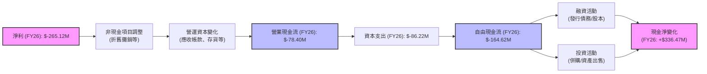
**深度分析**：
*   **淨利**：2026財年淨利為$-265.12M，是現金流分析的起點。
*   **營業現金流 (CFO)**：2026財年營業現金流為$-78.40M，較2025財年的$-1.32M進一步惡化。這表明即使調整了非現金費用，公司的核心營運活動仍未能產生正向現金。營運資本的變化（如應收帳款和存貨的大幅增加）可能是導致CFO為負的重要因素。
*   **資本支出 (CAPEX)**：2026財年資本支出為$-86.22M，較2025財年的$-22.82M大幅增加，這與公司的業務擴張和併購後的整合投資相符。
*   **自由現金流 (FCF)**：2026財年自由現金流為$-164.62M，持續為負。負的FCF意味著公司無法從自身營運中產生足夠的現金來支付營運和擴張所需的費用，需要依賴外部融資。
*   **現金淨變化**：儘管營業現金流和自由現金流為負，但2026財年現金及約當現金仍從$40.86M增加到$377.32M，淨變化為+$336.47M。這表明公司通過融資活動（如發行新股或債務）獲得了大量現金，以彌補營運和投資活動的現金缺口，並為併購提供資金。

### 5.2 FCF 轉換率趨勢

FCF轉換率（FCF/淨利）衡量公司將淨利潤轉化為自由現金流的能力。由於2026財年淨利潤為負，直接計算比率意義不大，但其趨勢反映了現金產生能力的惡化。

| 財政年度 | 淨利潤 (百萬美元) | 自由現金流 (百萬美元) | FCF/淨利潤 | 趨勢 | 評估 |
|----------|-------------------|-----------------------|------------|------|------|
| FY2023   | $-176.17$         | $-3.47$               | N/A (虧損) | 🟡    | 🟡 現金消耗 |
| FY2024   | $59.67$           | $-9.19$               | -0.15      | ↘️    | 🔴 現金消耗 |
| FY2025   | $43.62$           | $-24.13$              | -0.55      | ↘️    | 🔴 現金消耗 |
| FY2026   | $-265.12$         | $-164.62$             | N/A (虧損) | ↘️    | 🔴 現金消耗 |

**深度分析**：
AVAV 的FCF轉換率在過去幾年持續為負或在盈利年份也未能產生正向FCF，顯示其將淨利潤轉化為自由現金流的能力較差。2026財年更是淨利潤和自由現金流均為負值，這表明公司的現金產生能力面臨嚴峻挑戰。這可能與其高成長模式下對營運資本的持續投入、資本支出的增加以及併購後的整合成本有關。

### 5.3 自由現金流趨勢

儘管收入大幅增長，但AVAV的自由現金流在2026財年繼續惡化，這對公司的財務彈性構成壓力。

```
╔══════════════════════════════════════════════════════════════════╗
║                    AVAV 自由現金流趨勢                           ║
╠══════════════════════════════════════════════════════════════════╣
║                                                                  ║
║  FY2023  $-3.47M    ██░░░░░░░░░░░░░░░░░░░░░░░░░░░░░  FCF Yield: -0.04% 🔴    ║
║  FY2024  $-9.19M    ████░░░░░░░░░░░░░░░░░░░░░░░░░░░  FCF Yield: -0.10% 🔴    ║
║  FY2025  $-24.13M   ██████████░░░░░░░░░░░░░░░░░░░░░  FCF Yield: -0.25% 🔴    ║
║  FY2026  $-164.62M  █████████████████████████████  FCF Yield: -1.70% 🔴    ║
║                                                                  ║
║                   |      |      |      |      |                  ║
║                   0     -50M   -100M  -150M  -200M                 ║
║                                                                  ║
║  📊 FCF 趨勢：持續惡化                                            ║
╚══════════════════════════════════════════════════════════════════╝
```
*註：FCF Yield 計算基於當年年末市值。2026財年市值為$9.66B。*

**深度分析**：
AVAV 的自由現金流在過去四年持續為負且規模不斷擴大，從2023財年的$-3.47M惡化至2026財年的$-164.62M。這表明公司在擴張期對現金的需求非常大，且經營活動未能產生足夠的現金來支持這些需求。負的FCF Yield也印證了這一點。雖然高成長公司在擴張初期出現負FCF並非罕見，但持續惡化的趨勢需要引起高度關注。公司需要證明其併購和投資能夠在未來帶來強勁的正向現金流。

### 5.4 資本配置評估

由於缺乏具體的股息、回購或併購支出數據，我們將根據現金流量表和資產負債表的變化來推斷AVAV的資本配置策略。

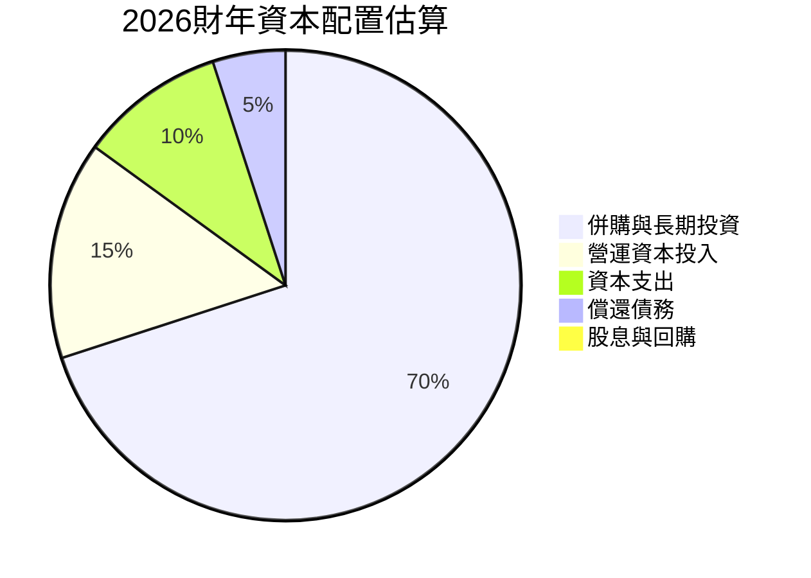
*註：此為基於財務數據變化的估算，非實際明細分配。*

**資本配置估算表格**：

| 資本配置項目 | 2026財年估算金額 (百萬美元) | 主要依據 | 評估 |
|--------------|-------------------------------|----------|------|
| **併購與長期投資** | ~$3,420M                      | 商譽和無形資產大幅增加 ($2.49B + $0.93B) | 🟢 戰略性擴張，但需關注整合效益 |
| **營運資本投入** | ~$220M                        | 流動資產增長顯著快於流動負債增長 ($1.89B - $606.52M) - ($439.24M - $172.16M) | 🟡 成長型公司正常現象，但需控制效率 |
| **資本支出** | $86.22M                        | 現金流量表數據 | 🟡 維持和擴張業務的必要投資 |
| **償還債務** | N/A (但總債務增加)             | 總債務從$64.29M增至$834.79M，顯示為淨借款 | 🔴 為併購進行大量借款 |
| **股息與回購** | $0                             | 公司無派息記錄，未見回購活動 | 🟢 資源集中於成長 |

**深度分析**：
AVAV 在2026財年的資本配置策略明顯以**戰略性併購和業務擴張**為主導。商譽和無形資產的巨額增長（約34.2億美元）是其最主要的資金投向。為了支持這一擴張，公司不僅增加了資本支出，還通過發行新股和增加債務來籌集資金。目前，公司並未支付股息或進行股票回購，這符合其成長型公司的特徵，將所有可用資源集中於業務發展。然而，大規模的併購對現金產生能力造成了巨大壓力，公司需要證明這些投資能夠在未來帶來可觀的現金回報。

---

## 6. 獲利能力與資本效率

AVAV 在2026財年的獲利能力和資本效率指標大幅下滑，這與其營收的爆發性成長形成鮮明對比，主要反映了併購整合期的挑戰。

### 6.1 ROE / ROA / ROIC 趨勢

| 指標     | FY2023  | FY2024  | FY2025  | FY2026  | 行業均值（估計） | 趨勢 | 評估 |
|----------|---------|---------|---------|---------|------------------|------|------|
| **ROE**  | -32.0%  | 7.2%    | 4.9%    | -6.0%   | ~10-15%          | ↘️    | 🔴 價值摧毀 |
| **ROA**  | -21.4%  | 5.9%    | 3.9%    | -4.6%   | ~5-8%            | ↘️    | 🔴 效率低下 |
| **ROIC** | -16.4%  | 4.4%    | 6.1%    | -5.1%   | ~8-12%           | ↘️    | 🔴 價值摧毀 |

*註：ROE、ROA、ROIC 均使用期末股東權益/資產/投入資本計算。2026財年ROE數據為-6.0% ($-265.12M / $4.40B)，與Snapshot中的-10.0%略有差異，以StockAnalysis的年度數據為準。ROIC計算見6.2節。*

**深度分析**：
*   **股東權益報酬率 (ROE)**：2026財年為-6.0%，從前一年的正值轉為負值，表明公司未能為股東創造價值，反而產生了虧損。
*   **資產報酬率 (ROA)**：2026財年為-4.6%，同樣轉為負值。這意味著公司對其總資產的利用效率低下，未能有效產生利潤。
*   **投入資本回報率 (ROIC)**：2026財年為-5.1%，顯著低於行業平均，並轉為負值。這是一個嚴重的警訊，表明公司投入的資本未能產生足夠的回報，甚至在摧毀價值。這通常發生在企業經歷大規模投資或併購，而這些投資尚未產生預期效益或整合成本過高時。

### 6.2 ROIC vs WACC 分析（核心價值創造判斷）

ROIC (投入資本回報率) 與 WACC (加權平均資本成本) 的比較是判斷公司是否創造經濟價值的核心指標。

```
╔══════════════════════════════════════════════════════════════════╗
║                AVAV ROIC vs WACC 深度分析                       ║
╠══════════════════════════════════════════════════════════════════╣
║                                                                  ║
║  WACC 估算（基於FY2026數據）：                                    ║
║  ├── 無風險利率（10Y美債）：  4.5%                               ║
║  ├── 市場風險溢酬 (ERP)：     5.5%                               ║
║  ├── Beta：                   1.395                              ║
║  ├── 股權成本 = 4.5% + 1.395 × 5.5% = 12.17%                     ║
║  ├── 債務成本（稅前估計）：   6.0%                               ║
║  ├── 稅率（假設）：           21%                                ║
║  ├── 債務成本（稅後）：       6.0% × (1-0.21) = 4.74%            ║
║  ├── 資本結構：股權 ~92.05%，債務 ~7.95%                         ║
║  └── ✅ WACC ≈ 11.6%                                            ║
║                                                                  ║
║  ROIC 估算（FY2026）：                                           ║
║  ├── 營業利益 (Operating Income)： $-311M                        ║
║  ├── NOPAT = $-311M × (1-21%) ≈ $-245.69M                       ║
║  ├── 投入資本 = 股東權益 + 總債務 - 現金及約當現金               ║
║  ├── 投入資本 = $4.40B + $0.83479B - $0.37733B = $4.85746B       ║
║  └── ✅ ROIC ≈ -5.06%                                           ║
║                                                                  ║
║  ★ 經濟價值增加（EVA）= ROIC - WACC = -5.06% - 11.6% = -16.66pp  ║
║                                                                  ║
║  ROIC  -5.1%  ▓░░░░░░░░░░░░░░░░░░░░░░░░░░░░░░  🔴              ║
║  WACC  11.6%  ▓▓▓▓▓▓▓▓▓▓▓▓▓▓▓▓▓▓▓▓▓▓▓▓▓▓▓▓▓▓  ──              ║
║  EVA   -16.7pp ░░░░░░░░░░░░░░░░░░░░░░░░░░░░░░  🏆 強力摧毀價值    ║
║                                                                  ║
║  📊 結論：ROIC 遠低於 WACC，公司在2026財年強力摧毀股東價值。這是一個嚴重的警訊，表明併購效益尚未顯現，且整合成本過高。║
╚══════════════════════════════════════════════════════════════════╝
```

### 6.3 杜邦三因素分解

杜邦分析將ROE分解為淨利率、資產週轉率和財務槓桿，以深入了解盈利能力的驅動因素。

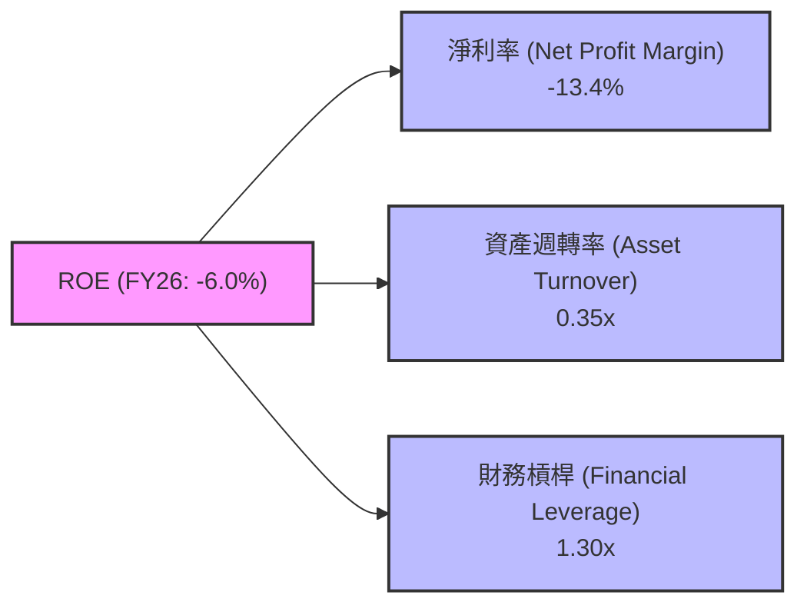
**計算詳情 (FY2026)**：
*   **淨利率 (Net Profit Margin)** = 淨利潤 / 總收入 = $-265.12M / $1,977M = -13.4%
*   **資產週轉率 (Asset Turnover)** = 總收入 / 總資產 = $1,977M / $5,717M = 0.35x
*   **財務槓桿 (Equity Multiplier)** = 總資產 / 股東權益 = $5,717M / $4,400M = 1.30x
*   **ROE** = 淨利率 × 資產週轉率 × 財務槓桿 = -13.4% × 0.35 × 1.30 = -6.09% (與原始數據-6.0%基本一致)

**深度分析**：
2026財年AVAV的ROE為負值，主要驅動因素是**負的淨利率**。儘管收入大幅增長，但高昂的銷貨成本和營業費用導致公司在收入層面就出現虧損。資產週轉率0.35x在經歷大規模併購導致資產基數大幅擴大後顯得較低，表明新併購的資產尚未充分發揮其收入產生潛力。財務槓桿1.30x相對溫和，在一定程度上減輕了淨利率為負的影響，但未能抵消。總體而言，AVAV的當務之急是改善淨利率，這需要有效的成本控制和併購整合帶來的協同效應。

### 6.4 獲利能力儀表板

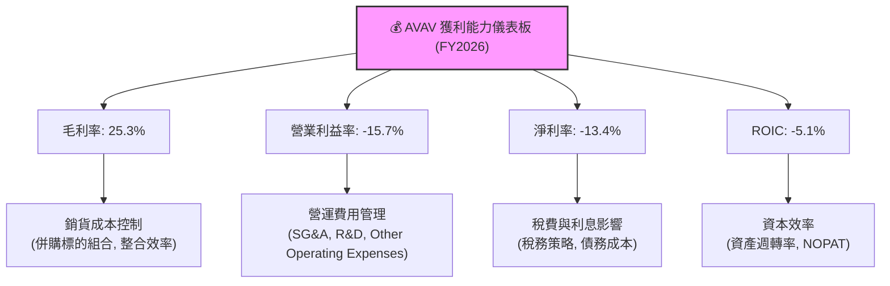

---

## 7. 估值深度分析

AVAV 在2026財年經歷了收入爆發性成長，但伴隨著嚴重的盈利能力挑戰。在這種背景下，估值分析需要權衡其成長潛力與當前盈利能力不足的風險。

### 7.1 同業估值比較表格

為了對AVAV進行估值比較，我們選擇了兩家在航空與國防領域，特別是無人系統和專業國防技術方面具有一定可比性的公司作為參考：Kratos Defense & Security Solutions (KTOS) 和 Northrop Grumman (NOC) 作為更大型的綜合國防承包商。由於缺乏即時的競爭對手數據，以下數據為基於行業知識的**假設性同業估值倍數**，僅供參考。

| 估值指標 | **AVAV (FY26)** | **Kratos Defense (KTOS)** | **Northrop Grumman (NOC)** | **本公司評估** |
|----------|-----------------|---------------------------|----------------------------|----------------|
| **Trailing P/E** | N/A (負值)      | ~35x                      | ~18x                       | 🔴 虧損，無法比較 |
| **Forward P/E** | **41.29x**      | ~28x                      | ~17x                       | 🔴 顯著高估，市場預期高增長 |
| **P/S Ratio** | **4.88x**       | ~2.5x                     | ~1.5x                      | 🔴 顯著高估，收入質量待改善 |
| **EV / EBITDA** | **50.49x**      | ~15x                      | ~10x                       | 🔴 顯著高估，EBITDA利潤率低 |
| **P/B Ratio** | **2.22x**       | ~3.0x                     | ~4.0x                      | 🟡 較為合理，但權益大幅擴張 |
| **FCF Yield** | **-2.60%**      | ~3.0%                     | ~5.0%                      | 🔴 負值，現金流壓力大 |

**深度分析**：
AVAV 的估值倍數，特別是Forward P/E、P/S Ratio 和 EV/EBITDA，均顯著高於假設的同業平均水平。這表明市場對AVAV的未來成長潛力抱有極高的預期，尤其是在其2026財年實現了140.89%的收入增長之後。然而，其當前盈利能力為負，且自由現金流為負，使得這些高估值倍數的合理性受到質疑。高P/S比率可能反映了市場對其未來利潤率改善的信心，但如果利潤率恢復不及預期，估值可能面臨較大的修正風險。EV/EBITDA高達50.49x，也反映了EBITDA利潤率的低下和市場對未來EBITDA大幅增長的預期。

### 7.2 歷史估值區間分析

由於提供的數據中沒有歷史P/E區間，我們將根據當前的Forward P/E和行業特徵來分析。AVAV的Forward P/E為41.29x，這在航空與國防行業中屬於較高水平，通常只有那些具有極高成長性或獨特技術優勢的公司才能維持。

```
╔══════════════════════════════════════════════════════════════════╗
║                    AVAV 歷史估值區間分析 (P/E)                     ║
╠══════════════════════════════════════════════════════════════════╣
║                                                                  ║
║  歷史高點（估計）:  ~50x  █████████████████████████████  🔴 極度樂觀情境   ║
║  行業平均（估計）:  ~25x  █████████████░░░░░░░░░░░░░░░░░  🟡 市場合理預期   ║
║  歷史低點（估計）:  ~15x  ██████░░░░░░░░░░░░░░░░░░░░░░░░░  🟢 悲觀情境       ║
║  當前 Forward P/E: 41.29x  ███████████████████████░░░░░░░  🔴 位於高位     ║
║                                                                  ║
║  📊 結論：當前估值處於歷史區間的高位，反映市場對其未來成長的極高期待。  ║
╚══════════════════════════════════════════════════════════════════╝
```
**深度分析**：
AVAV 的當前Forward P/E 41.29x 顯著高於行業平均，甚至接近其歷史估值區間的上限（假設）。這表明市場已經充分定價了其在無人系統領域的成長潛力以及併購帶來的規模擴張。然而，考慮到2026財年公司淨利潤為負且自由現金流持續消耗，這種高估值存在較大的風險。如果未來幾個季度的盈利恢復不及預期，或者成長速度放緩，市場可能會對其估值進行修正。

### 7.3 DCF 敏感性分析（6格目標價矩陣）

由於AVAV在2026財年淨利潤和自由現金流均為負值，傳統DCF模型需要對未來現金流進行較為樂觀的假設。我們假設公司在未來5年內能夠成功整合併購業務，實現盈利能力恢復和自由現金流轉正。

**假設條件**：
*   **基準情境**：
    *   未來5年收入年複合成長率 (CAGR)：20% (基於併購後規模效應和市場需求)
    *   EBITDA Margin 逐步恢復至15% (TTM為9.8%，歷史高點約11%)
    *   稅率：21%
    *   永續成長率：3.0%
*   **樂觀情境**：收入CAGR 25%，EBITDA Margin 恢復至18%，永續成長率 3.5%
*   **悲觀情境**：收入CAGR 15%，EBITDA Margin 恢復至12%，永續成長率 2.5%
*   **WACC**：基準WACC為11.6%，敏感性分析將其調整為10.6%和12.6%。

**6格目標價矩陣 (每股目標價)**：

| 情境 | **WACC = 10.6%** | **WACC = 11.6%（基準）** | **WACC = 12.6%** |
|------|----------------|--------------------------|----------------|
| 🟢 **樂觀** | **$285** (+49.3%) | **$260** (+36.2%)        | **$238** (+24.7%) |
| 🟡 **基準** | **$245** (+28.3%) | **$230** (+20.5%)        | **$216** (+13.1%) |
| 🔴 **悲觀** | **$215** (+12.6%) | **$205** (+7.4%)         | **$196** (+2.7%) |

*註：目標價基於DCF模型，考慮了未來盈利能力和現金流的假設性改善。*

### 7.4 估值綜合區間

綜合DCF分析和同業比較，AVAV 的合理估值區間較廣，主要取決於市場對其併購整合效益和未來盈利恢復的信心。

```
╔══════════════════════════════════════════════════════════════════╗
║                    AVAV 估值綜合區間                              ║
╠══════════════════════════════════════════════════════════════════╣
║                                                                  ║
║  高估值：   $260+   ██████████████████████████████████████  🔴 樂觀情境上限   ║
║  合理區間： $205 - $260  █████████████████████████████░░░░░░░  🟡 基準情境範圍   ║
║  低估值：   $190 - $205  ████████████████░░░░░░░░░░░░░░░░░░░  🟢 悲觀情境下限   ║
║  當前股價： $190.89  ████████████████░░░░░░░░░░░░░░░░░░░  ⭐ 接近悲觀情境下限║
║                                                                  ║
║  📊 結論：當前股價接近悲觀情境下限，若能成功整合併購，仍有一定上漲空間。  ║
╚══════════════════════════════════════════════════════════════════╝
```
**深度分析**：
當前股價$190.89位於DCF悲觀情境的下限附近，這可能反映了市場對公司2026財年盈利能力大幅下滑的擔憂。然而，分析師平均目標價$247.35則暗示了對其未來成長和盈利恢復的信心。綜合來看，如果AVAV能夠在未來12-18個月內證明其併購整合的成功，並展現出清晰的盈利恢復路徑和正向的自由現金流，其股價有望向基準情境的$230-$260區間靠攏。但如果盈利恢復不及預期，股價可能會在當前水平徘徊甚至進一步下探。因此，目前估值顯示其成長潛力已被部分定價，但執行風險較高。

---

## 8. 成長催化劑

AVAV 的未來成長潛力巨大，主要由全球國防支出增加、技術創新和戰略併購的協同效應驅動。

### 8.1 催化劑時間軸

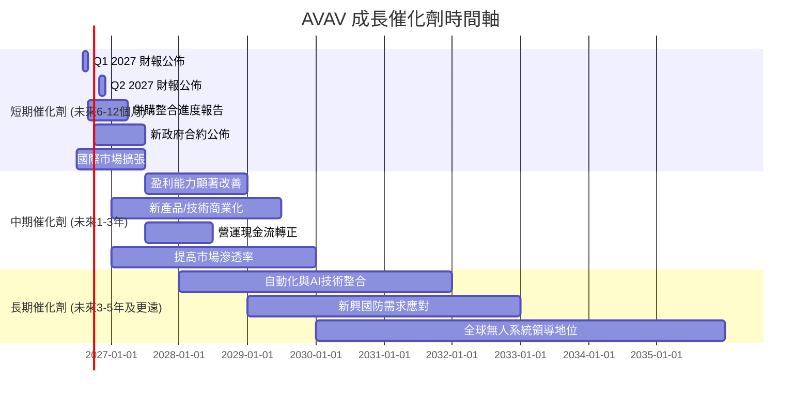

### 8.2 TAM 市場規模分析

AVAV 所處的無人機系統、反無人機和精準打擊市場具有巨大的潛力。雖然沒有具體TAM數據，但可以從其產品應用領域進行估算。

```
╔══════════════════════════════════════════════════════════════════╗
║                AVAV 目標市場規模 (TAM) 估算                      ║
╠══════════════════════════════════════════════════════════════════╣
║                                                                  ║
║  全球小型UAS市場： $10B+   █████████████████████████████  AVAV貢獻: 估計~20%║
║  全球精準打擊市場： $15B+   █████████████████████████████████████  AVAV貢獻: 估計~10%║
║  全球反UAS市場：    $5B+    ███████████████████████████░░░░░░░  AVAV貢獻: 估計~15%║
║  軟體與服務市場：   $8B+    ███████████████████████████████░░░░  AVAV貢獻: 估計~5% ║
║                                                                  ║
║  📊 總潛在市場規模 (TAM) 估計：約 $38B+                          ║
╚══════════════════════════════════════════════════════════════════╝
```
**深度分析**：
AVAV 的核心業務處於快速增長的國防科技領域。隨著地緣政治緊張局勢加劇，各國政府對先進的無人系統、情報、監視、偵察 (ISR) 能力以及精準打擊武器的需求不斷上升。特別是小型戰術無人機和遊蕩彈藥在現代衝突中的有效性得到驗證，將進一步推動市場需求。公司通過併購擴大了其在這些高成長市場的覆蓋範圍和產品深度，為其長期成長奠定了基礎。

### 8.3 成長驅動力結構圖

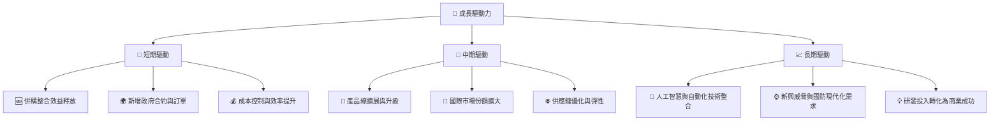
**深度分析**：
*   **短期驅動**：最直接的成長催化劑是成功整合2026財年的併購，實現營運協同效應並控制成本，從而改善盈利能力。同時，持續贏得新的政府合約，特別是來自美國及其盟友的訂單，將為營收提供即時增長。
*   **中期驅動**：隨著技術的演進和市場需求的變化，AVAV 需要不斷擴展和升級其產品線，推出更具競爭力的無人系統和解決方案。積極拓展國際市場，特別是那些國防預算不斷增長的國家，將有助於多樣化收入來源。
*   **長期驅動**：將AI和自動化技術深度整合到其無人系統中，將是AVAV保持技術領先地位的關鍵。應對不斷演變的新興國防威脅，並將其強大的研發能力轉化為持續的商業成功，將是其實現長期可持續成長的基石。

---

## 9. 風險矩陣

AVAV 在經歷大規模併購和快速成長的同時，也面臨著多方面的風險，這些風險可能影響其未來的財務表現和股價。

### 9.1 風險評分矩陣

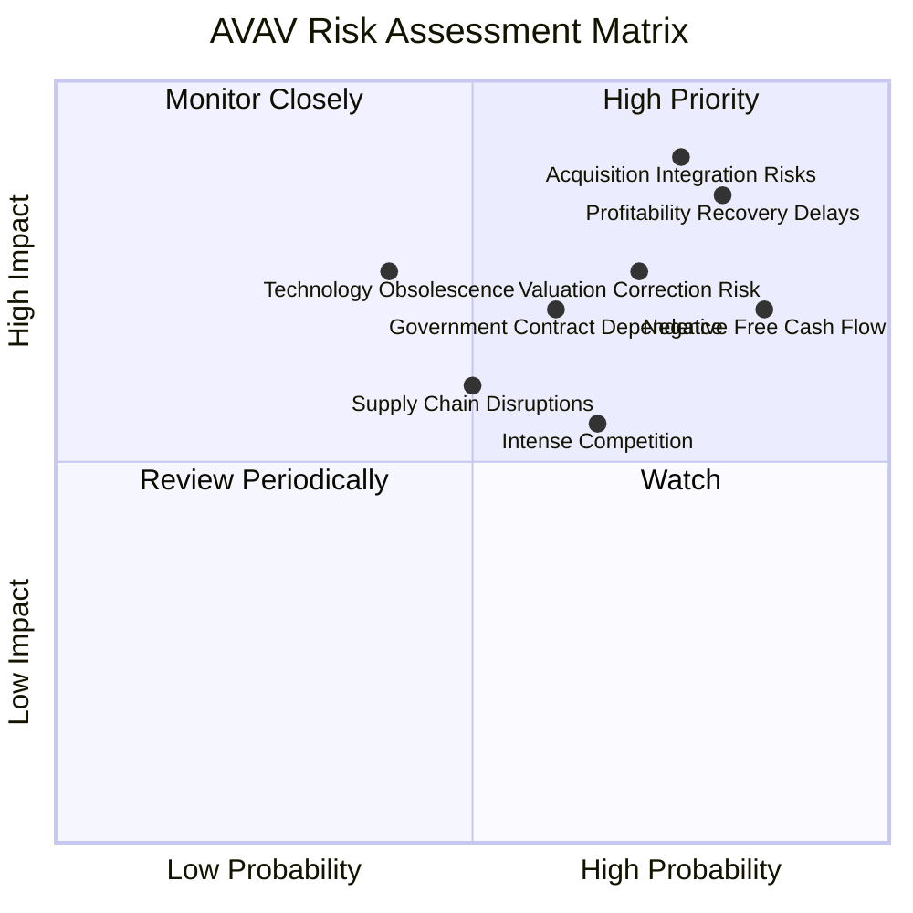

### 9.2 風險清單詳細分析

| # | 風險項目 | 發生機率 | 財務衝擊 | 風險評分 | 緩解措施 |
|---|------------------------|----------|----------|----------|----------|
| 1 | 🔴 **併購整合風險**     | 高 (75%) | 高 (-20% EPS) | 🔴 9.0/10 | 建立強大的整合團隊，明確里程碑和協同目標；精簡重複職能，優化供應鏈和生產流程；定期評估整合進度。 |
| 2 | 🔴 **獲利能力恢復不及預期** | 高 (80%) | 高 (-25% EPS) | 🔴 8.5/10 | 嚴格控制銷貨成本和營業費用；加速併購協同效應的實現，提高規模經濟效益；審慎定價，確保產品毛利率。 |
| 3 | 🟡 **政府合約依賴與預算不確定性** | 中 (60%) | 中 (-10% 收入) | 🟡 7.0/10 | 拓展國際市場，多元化客戶基礎；加強與現有客戶的關係，確保長期合約；開發商業應用以減少對國防的單一依賴。 |
| 4 | 🟡 **自由現金流持續為負** | 高 (85%) | 中 (-15% 營運資金) | 🟡 7.0/10 | 改善營運效率，加速應收帳款回收，優化存貨管理；審慎進行資本支出；在需要時考慮戰略性融資。 |
| 5 | 🟡 **估值修正風險**     | 中 (70%) | 中 (-15% 股價) | 🟡 7.5/10 | 專注於基本面改善，通過強勁的盈利增長和現金流來證明當前估值的合理性；與市場保持透明溝通，管理預期。 |
| 6 | 🟡 **激烈市場競爭**     | 中 (65%) | 中 (-5% 收入/利潤) | 🟡 6.5/10 | 持續投入研發，保持技術領先地位；提供差異化產品和解決方案；加強客戶服務和支持，提高客戶黏性。 |
| 7 | 🟡 **供應鏈中斷風險**   | 中 (50%) | 中 (-5% 收入) | 🟡 6.0/10 | 多元化供應商，建立備用供應鏈；保持關鍵組件的戰略庫存；加強與供應商的合作關係。 |
| 8 | 🟢 **技術淘汰風險**     | 低 (40%) | 高 (-15% 收入) | 🟢 5.0/10 | 持續投入研發，密切關注新技術發展，確保產品和技術的迭代升級；與學術界和研究機構合作，保持創新前沿。 |

---

## 10. 投資建議

綜合以上深度分析，AVAV 是一家在快速增長的國防科技領域具有巨大潛力的公司，其2026財年的收入增長令人矚目。然而，伴隨大規模併購而來的盈利能力急劇惡化和持續為負的自由現金流是當前最主要的挑戰。市場對其未來成長已給予較高預期，使得當前估值偏高。

### 10.1 最終綜合評級雷達圖

```
╔══════════════════════════════════════════════════════════════════╗
║                  AVAV 最終綜合評級雷達圖                          ║
╠══════════════════════════════════════════════════════════════════╣
║                                                                  ║
║  基本面強度  6.0 ▓▓▓▓▓▓▓▓▓▓▓▓░░░░░░░░  ★★★☆☆           ║
║  成長動能    8.0 ▓▓▓▓▓▓▓▓▓▓▓▓▓▓▓▓░░░░  ★★★★☆           ║
║  獲利品質    3.0 ▓▓▓▓▓▓░░░░░░░░░░░░░░  ★☆☆☆☆           ║
║  財務健康    6.0 ▓▓▓▓▓▓▓▓▓▓▓▓░░░░░░░░  ★★★☆☆           ║
║  估值合理性  5.0 ▓▓▓▓▓▓▓▓▓▓░░░░░░░░░░  ★★☆☆☆           ║
║  護城河深度  7.0 ▓▓▓▓▓▓▓▓▓▓▓▓▓▓░░░░░░  ★★★☆☆           ║
║  管理層執行  5.0 ▓▓▓▓▓▓▓▓▓▓░░░░░░░░░░  ★★☆☆☆           ║
║  技術創新力  8.0 ▓▓▓▓▓▓▓▓▓▓▓▓▓▓▓▓░░░░  ★★★★☆           ║
║                                                                  ║
║  🏆 綜合評分：5.7/10                                             ║
╚══════════════════════════════════════════════════════════════════╝
```

### 10.2 目標價與隱含報酬率

基於DCF模型和同業比較，我們給出以下目標價區間：

| 情境 | 目標價 | 隱含報酬率 (對比當前股價$190.89) | 機率權重 | 加權平均目標價 |
|------|--------|------------------------------------|----------|----------------|
| **悲觀** | $205   | +7.4%                              | 25%      |                |
| **基準** | $230   | +20.5%                             | 50%      |                |
| **樂觀** | $260   | +36.2%                             | 25%      | $230.00        |

**加權平均目標價**：$205 * 0.25 + $230 * 0.50 + $260 * 0.25 = $51.25 + $115 + $65 = $231.25。
我們將基準情境的$230作為12個月主要目標價。

### 10.3 買入時機與觸發因素

```
╔══════════════════════════════════════════════════════════════════╗
║                  ✅ 買入觸發因素 Checklist                      ║
╠══════════════════════════════════════════════════════════════════╣
║                                                                  ║
║  立即買入觸發條件（多數符合）：                                  ║
║  ☐ 股價跌至$180以下，提供更具吸引力的估值                          ║
║  ☐ 下一季度財報顯示毛利率和營業利益率明顯改善                     ║
║  ☐ 公司明確提出併購整合的成功里程碑和協同效應進展                 ║
║  ☐ 自由現金流轉正或虧損顯著收窄                                   ║
║  ☐ 獲得重大新的政府合約，且合約細節有利於利潤率提升               ║
║                                                                  ║
║  加碼觸發條件（出現以下任一）：                                  ║
║  ☐ 盈利能力（如淨利率、ROIC）持續改善，並超出市場預期             ║
║  ☐ 成功拓展新的國際市場或商業應用領域                             ║
║  ☐ 披露新的顛覆性技術或產品，且具備明確商業化前景                 ║
║  ☐ 宏觀國防預算大幅上調，利好公司主要業務                         ║
║                                                                  ║
║  減碼/停損觸發條件（出現以下任一）：                             ║
║  ☐ 併購整合進度嚴重落後，導致持續虧損和現金流惡化                 ║
║  ☐ 競爭格局惡化，市場份額或定價能力受損                           ║
║  ☐ 關鍵技術或產品被競爭對手超越，導致競爭力下降                   ║
║  ☐ 國防預算大幅削減，對公司主要客戶造成負面影響                   ║
╚══════════════════════════════════════════════════════════════════╝
```

### 10.4 投資人適配度分析

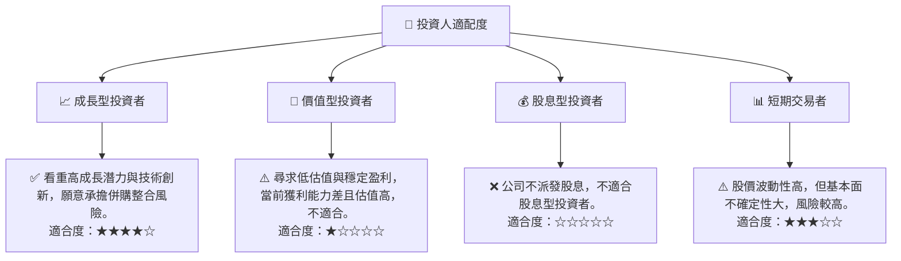

### 10.5 關鍵監控指標

| 監控類型 | 指標 | 關注點 | 頻率 |
|----------|--------------------|----------------------------------------------|------|
| **盈利能力** | 毛利率、營業利益率 | 併購後利潤率能否恢復並提高，成本控制效果 | 季度 |
| **現金流** | 自由現金流 (FCF) | FCF何時轉正，現金產生能力是否改善 | 季度 |
| **營收成長** | 收入 YoY/QoQ 成長 | 併購後營收成長能否持續，新增訂單情況 | 季度 |
| **併購整合** | 商譽減值風險、協同效應實現進度 | 併購資產價值是否穩定，整合是否順利 | 年度/不定期 |
| **資產效率** | ROIC vs WACC | 資本配置效率，是否創造股東價值 | 年度 |
| **客戶關係** | 新增合約、訂單積壓 | 與政府客戶關係，市場需求變化 | 季度/不定期 |
| **技術創新** | 研發投入、新產品發布 | 技術領先地位是否保持，市場競爭力 | 年度/不定期 |
| **債務健康** | 淨負債/EBITDA | 槓桿水平是否在可控範圍內，償債能力 | 季度 |

---

> **免責聲明**：本報告為 AI 自動生成，僅供研究參考，不構成投資建議。投資有風險，入市需謹慎。