# AVAV 綜合股票評估報告

> **報告日期**：2026-02-24 ｜ **評估師**：頂級美股投資評估系統 ｜ **數據來源**：Yahoo Finance
> **公司全名**：AeroVironment, Inc. ｜ **股票代碼**：AVAV ｜ **當前價格**：$261.33

---

## 目錄

| 章節 | 內容 |
|------|------|
| [§1](#1-評估總覽) | 評估總覽 · 綜合評分 · 快速結論 |
| [§2](#2-六維度評分矩陣) | 六維度評分矩陣 · 風險報酬象限 |
| [§3](#3-業務品質評估) | 商業模式 · 護城河 · 競爭格局 |
| [§4](#4-財務健康評估) | 財務儀表板 · 獲利趨勢 · 現金流 |
| [§5](#5-成長性評估) | 成長軌跡 · CAGR · 未來驅動力 |
| [§6](#6-估值合理性評估) | 多重估值法 · 同業比較 · 估值區間 |
| [§7](#7-風險評估) | 風險熱圖 · 風險清單 · 緩解措施 |
| [§8](#8-催化劑與觸發因素) | 時間軸 · 觸發因素樹 |
| [§9](#9-投資建議) | 最終評級 · 目標價 · 適配度 |

---

## 1. 評估總覽

### 🎯 六維度綜合評分概覽

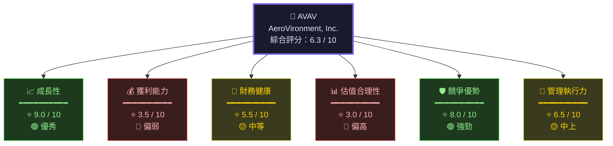

---

### 📡 ASCII 多維度雷達圖

```
                    成長性 (9.0)
                       ★★★★★★★★★☆
                    ╱──────────────╲
          競爭優勢 ╱                  ╲ 獲利能力
          (8.0)  ╱    ████████████    ╲  (3.5)
   ★★★★★★★★╱  ███████████████████  ╲★★★☆☆☆☆
         ╱  ████████████████████████  ╲
        ╱  ██████████████████████████  ╲
管理力 ╱  ████████████████████████████  ╲ 財務健康
(6.5) │  ██████████████████████████████  │ (5.5)
★★★★★★│  ████████ ← AVAV ████████████  │★★★★★☆
      ╲  ████████████████████████████  ╱
        ╲  ██████████████████████████  ╱
         ╲  ████████████████████████  ╱
          ╲                          ╱
            ╲──────────────────────╱
                   估值合理性 (3.0)
                    ★★★☆☆☆☆☆☆☆

    ████ AVAV實際範圍   ▓▓▓▓ 理想範圍(7.0以上)
    
    外圈=10分 | 中圈=5分 | 圓心=0分
```

---

### ⚡ 快速投資結論

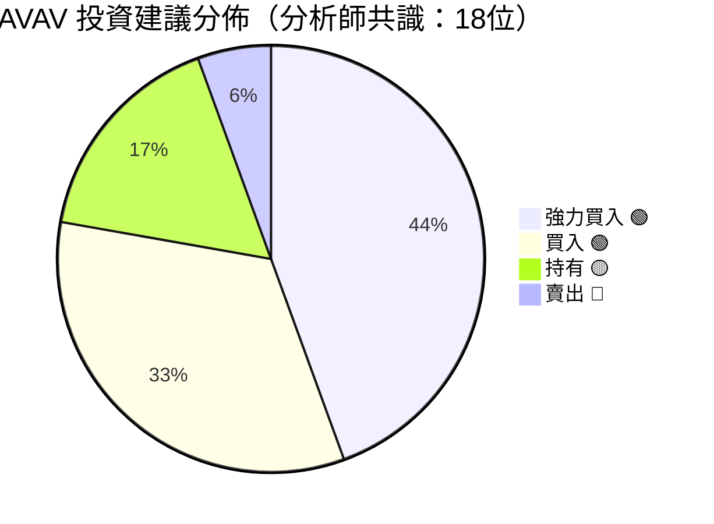

```
┌─────────────────────────────────────────────────────────────┐
│                    📋 快速評估摘要                           │
├─────────────────────────────────────────────────────────────┤
│  🏢 公司類型：無人機系統 + 精準打擊 + 太空防禦               │
│  💡 核心主題：無人機戰場革命 + 美國國防預算擴張              │
│  📊 當前估值：Premium（前瞻P/E 57x → 溢價明顯）             │
│  📈 成長動能：營收年增 150.7%（含收購）→ 強勁               │
│  ⚠️  主要風險：目前虧損、估值偏高、整合風險                  │
│  🎯 分析師目標價：$372.05（較現價+42%上行空間）              │
├─────────────────────────────────────────────────────────────┤
│  ✅ 建議：審慎買入｜適合：成長型/國防主題投資人              │
│  ⏱️  時間框架：12-24個月                                    │
│  🎯 進場區間：$240-$270（當前區間具吸引力）                  │
└─────────────────────────────────────────────────────────────┘
```

---

## 2. 六維度評分矩陣

### 📊 詳細評分表格

| 維度 | 評分 | 等級 | Unicode評分條 | 關鍵指標 | 評語 |
|------|------|------|--------------|----------|------|
| 📈 **成長性** | **9.0**/10 | 🟢 優秀 | `▓▓▓▓▓▓▓▓▓░` | 營收+150.7% YoY | 爆發式成長，全球無人機需求驅動 |
| 💰 **獲利能力** | **3.5**/10 | 🔴 偏弱 | `▓▓▓░░░░░░░` | 營業利益率-6.4% | TTM仍虧損，整合成本壓制利潤 |
| 🏦 **財務健康** | **5.5**/10 | 🟡 中等 | `▓▓▓▓▓░░░░░` | 流動比率5.08 | 流動性佳但自由現金流負值 |
| 📊 **估值合理性** | **3.0**/10 | 🔴 偏高 | `▓▓▓░░░░░░░` | 前瞻P/E 57x | EV/EBITDA 125x，溢價顯著 |
| 🛡️ **競爭優勢** | **8.0**/10 | 🟢 強勁 | `▓▓▓▓▓▓▓▓░░` | 技術壁壘+政府合約 | 無人機技術領導者，ITAR保護 |
| 👔 **管理執行力** | **6.5**/10 | 🟡 中上 | `▓▓▓▓▓▓░░░░` | 營收CAGR 16.6% | 穩健擴張，但現金流管理待改善 |
| 🌟 **加權綜合** | **6.3**/10 | 🟡 中上 | `▓▓▓▓▓▓░░░░` | — | 高成長高風險型標的 |

---

### 📊 Unicode 評分條視覺化詳解

```
╔═══════════════════════════════════════════════════════════════╗
║              AVAV 六維度評分視覺化儀表板                      ║
╠═══════════════════════════════════════════════════════════════╣
║                                                               ║
║  📈 成長性      [▓▓▓▓▓▓▓▓▓░]  9.0/10  🟢 ← 核心優勢         ║
║  🛡️ 競爭優勢   [▓▓▓▓▓▓▓▓░░]  8.0/10  🟢 ← 護城河深         ║
║  👔 管理執行力  [▓▓▓▓▓▓░░░░]  6.5/10  🟡 ← 待觀察           ║
║  🏦 財務健康    [▓▓▓▓▓░░░░░]  5.5/10  🟡 ← 流動性尚可       ║
║  💰 獲利能力   [▓▓▓░░░░░░░]  3.5/10  🔴 ← 仍在虧損         ║
║  📊 估值合理性  [▓▓▓░░░░░░░]  3.0/10  🔴 ← 估值偏高         ║
║                                                               ║
║  ━━━━━━━━━━━━━━━━━━━━━━━━━━━━━━━━━━━━━━━━━━━━━━━━━━━━━━━━  ║
║  🌟 綜合加權評分 [▓▓▓▓▓▓░░░░]  6.3/10  🟡 審慎買入          ║
║                                                               ║
║  評分標準：0-3🔴危險 | 4-5🟡偏弱 | 6-7🟡中等 | 8-10🟢優秀   ║
╚═══════════════════════════════════════════════════════════════╝
```

---

### 🎯 風險/報酬象限矩陣

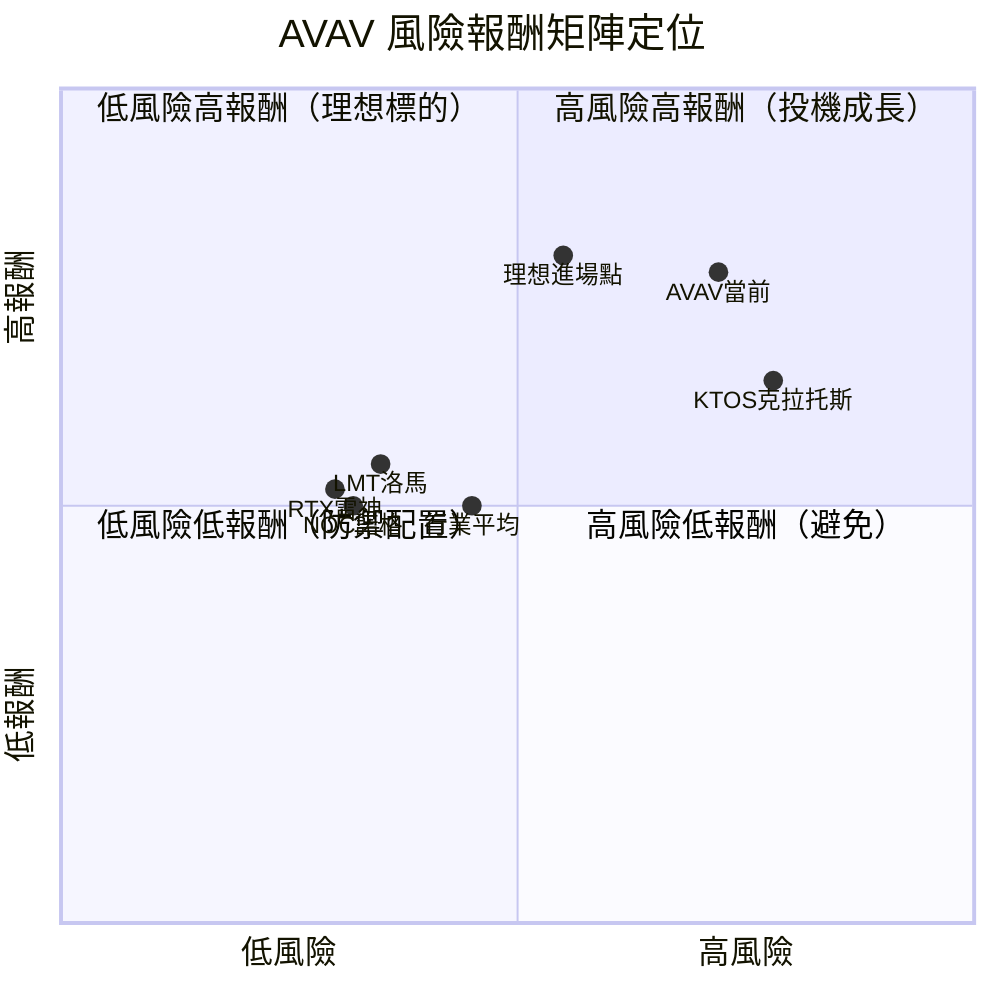

---

## 3. 業務品質評估

### 🏗️ 商業模式架構

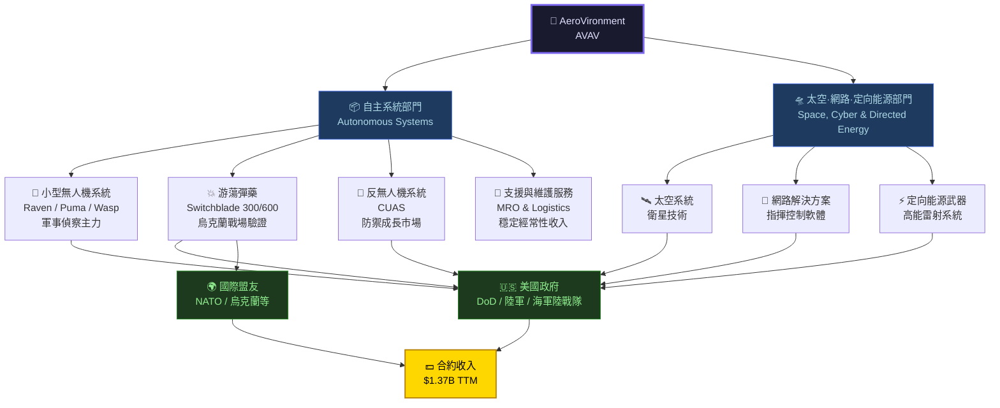

---

### 🏰 護城河評估

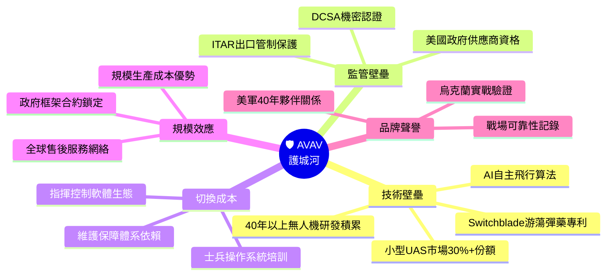

---

### ⚔️ 市場地位與競爭格局

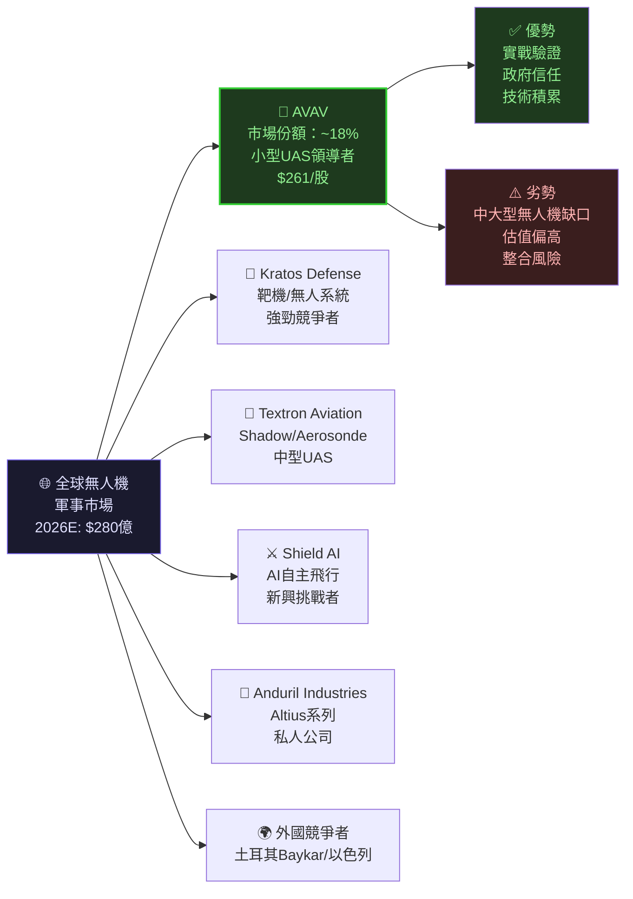

---

### 👔 管理層執行力評分

| 評估維度 | 評分 | 狀態 | 說明 |
|----------|------|------|------|
| 戰略清晰度 | 8/10 | 🟢 | 無人機戰場革命主軸明確 |
| 收購整合能力 | 6/10 | 🟡 | Tomahawk Robotics等收購需觀察整合效果 |
| 資本配置效率 | 5/10 | 🟡 | 現金流負值，資本密集度偏高 |
| R&D投入強度 | 8/10 | 🟢 | R&D佔營收12.3%，持續創新 |
| 政府關係管理 | 9/10 | 🟢 | 40年DoD夥伴，合約穩固 |
| 股東溝通透明度 | 7/10 | 🟡 | 定期法說會，指引清晰 |
| **綜合管理評分** | **7.2/10** | 🟡 | 中上水準，重在執行整合 |

---

## 4. 財務健康評估

### 📊 財務儀表板

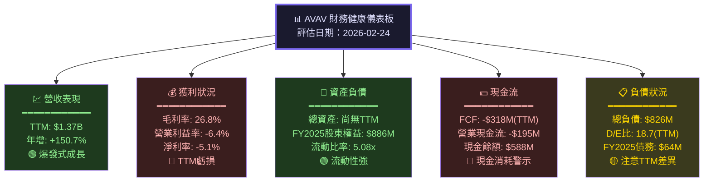

---

### 📈 獲利能力趨勢（近4年年報）

| 財務指標 | FY2022 | FY2023 | FY2024 | FY2025 | 趨勢 |
|----------|--------|--------|--------|--------|------|
| 總營收 | $445.7M | $540.5M | $716.7M | $820.6M | 🟢 持續成長 |
| 毛利潤 | $141.2M | $173.5M | $283.9M | $318.6M | 🟢 持續擴大 |
| 毛利率 | 31.7% | 32.1% | 39.6% | 38.8% | 🟡 略降但高位 |
| 營業利益 | -$9.9M | -$22.7M | +$71.8M | +$59.2M | 🟡 好轉但波動 |
| 營業利益率 | -2.2% | -4.2% | +10.0% | +7.2% | 🟢 逐步改善 |
| 淨利潤 | -$4.2M | -$176.2M | +$59.7M | +$43.6M | 🟡 波動較大 |
| EBITDA | $47.1M | -$79.0M | $103.2M | $82.9M | 🟡 波動恢復中 |
| R&D支出 | $54.7M | $64.3M | $97.7M | $100.7M | 🟢 持續加碼 |

> ⚠️ **注意**：TTM數據（截至2026-02）顯示營業利益率-6.4%、淨利率-5.1%，反映近期大型收購後整合成本飆升，與FY2025年報有差異，需持續追蹤。

---

### 🏦 資產負債表穩健度（FY2025年報）

```
╔═══════════════════════════════════════════════════════════════╗
║              AVAV 資產負債穩健度評估（FY2025）                ║
╠═══════════════════════════════════════════════════════════════╣
║                                                               ║
║  流動資產    [$606.5M] ▓▓▓▓▓▓▓▓▓▓▓▓▓▓▓▓▓▓▓▓ 🟢             ║
║  流動負債    [$172.2M] ▓▓▓▓▓▓  (流動比率 5.08x)             ║
║                                                               ║
║  總資產      [$1.12B]  ▓▓▓▓▓▓▓▓▓▓▓▓▓▓▓▓▓▓▓▓▓▓▓▓ 🟢         ║
║  總負債      [$234.1M] ▓▓▓▓▓  負債率 20.9%     🟢             ║
║  股東權益    [$886.5M] ▓▓▓▓▓▓▓▓▓▓▓▓▓▓▓▓▓▓▓▓ 🟢             ║
║                                                               ║
║  現金儲備    [$40.9M]  ▓▓  (FY2025年報，TTM為$588M) 🟡       ║
║  長期負債    [$64.3M]  ▓▓  槓桿極低             🟢             ║
║                                                               ║
║  ⚠️ TTM數據顯示總負債$826M，反映近期重大收購融資活動          ║
║     D/E比18.7x為異常值，FY2025年報D/E僅0.07x較健康          ║
║                                                               ║
║  整體評分：5.5/10 🟡  流動性強但現金流負值需關注             ║
╚═══════════════════════════════════════════════════════════════╝
```

---

### 💵 現金流生成分析

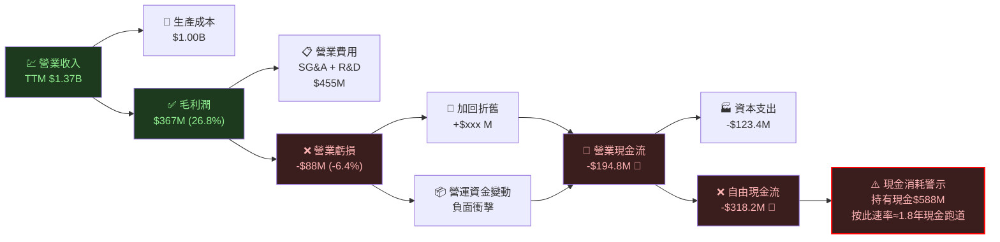

---

## 5. 成長性評估

### 📈 成長軌跡圖

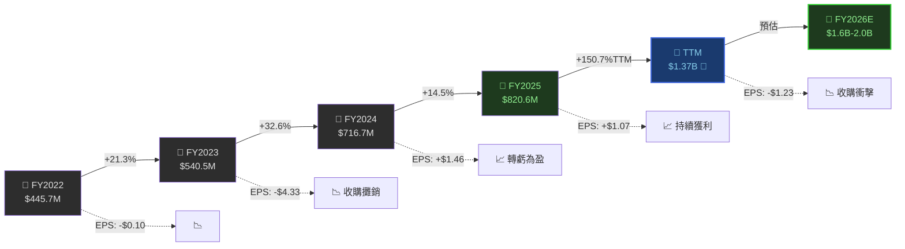

---

### 📊 歷史成長率 CAGR 分析

| 成長指標 | 2年CAGR (FY23-25) | 3年CAGR (FY22-25) | 最新YoY | 評級 |
|----------|-------------------|-------------------|---------|------|
| 📈 營收成長 | +23.2% | +22.6% | +150.7%* | 🟢 |
| 💰 毛利成長 | +35.4% | +30.8% | — | 🟢 |
| 📊 毛利率變化 | 38.8% vs 32.1% | +6.7pp | 26.8%(TTM) | 🟡 |
| 🔬 R&D投入 | +25.1% | +22.6% | +3.1% | 🟢 |
| 📋 人員規模 | — | — | 1,456人(小公司) | 🟡 |

> *TTM的150.7%成長率包含Tomahawk Robotics等重大收購的併入，非純有機成長

```
╔════════════════════════════════════════════════════════════╗
║           AVAV 有機vs無機成長拆解估計                      ║
╠════════════════════════════════════════════════════════════╣
║  TTM總成長率：+150.7%                                      ║
║  ┌─────────────────────────────────────┐                  ║
║  │ 有機成長（估計）：+25-30%           │ ████████████     ║
║  │ 收購貢獻（估計）：+120-125%         │ ████████████████ ║
║  └─────────────────────────────────────┘                  ║
║  → 有機成長仍然強勁，核心業務健康                          ║
╚════════════════════════════════════════════════════════════╝
```

---

### 🚀 未來成長驅動力

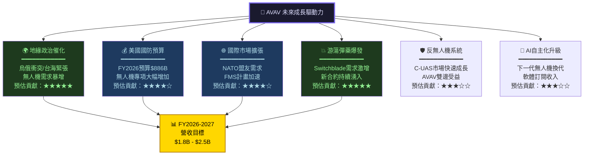

---

### 📊 市場份額趨勢

```
╔══════════════════════════════════════════════════════════════╗
║           美國小型軍用無人機市場份額趨勢估計                 ║
╠══════════════════════════════════════════════════════════════╣
║                                                              ║
║  2022年：                                                    ║
║  AVAV     [██████████████████████████████░░░]  ~35%         ║
║  Textron  [████████████████░░░░░░░░░░░░░░░░░]  ~20%         ║
║  其他     [████████████████████████░░░░░░░░░]  ~45%         ║
║                                                              ║
║  2025年：                                                    ║
║  AVAV     [████████████████████░░░░░░░░░░░░░]  ~25%*        ║
║  KTOS     [████████████░░░░░░░░░░░░░░░░░░░░░]  ~15%         ║
║  Anduril  [████████░░░░░░░░░░░░░░░░░░░░░░░░░]  ~10%         ║
║  其他+新  [██████████████████████████████░░░]  ~50%         ║
║                                                              ║
║  *市場整體快速擴大，AVAV絕對份額成長，相對份額略降           ║
║  → 市場擴張速度超過份額集中，整體受益                        ║
╚══════════════════════════════════════════════════════════════╝
```

---

## 6. 估值合理性評估

### 📊 估值矩陣決策樹

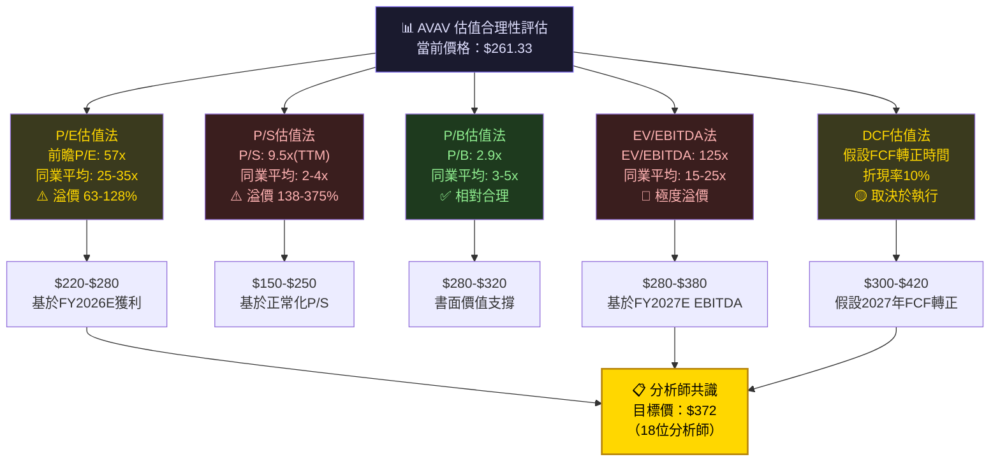

---

### 📋 多重估值法比較表格

| 估值方法 | 當前數值 | 同業基準 | 隱含目標價 | 溢折價 | 評級 |
|----------|----------|----------|-----------|--------|------|
| 前瞻 P/E | 57.0x | 25-35x | $115-$160 | 🔴 +63-128% | 高估 |
| 靜態 P/E | N/A（虧損） | — | — | — | — |
| P/S比率 | 9.5x | 2-4x | $55-$110 | 🔴 +138-375% | 嚴重高估 |
| P/B比率 | 2.9x | 3-5x | $290-$483 | 🟢 合理偏低 | 略低估 |
| EV/EBITDA | 125x | 15-25x | $18-$32 | 🔴 極度高估 | （TTM虧損失真） |
| **分析師共識** | — | 18位分析師 | **$372** | 🟢 +42%空間 | 買入 |
| **當前市價** | **$261.33** | — | — | — | — |

> 📝 **估值解讀**：傳統估值指標（EV/EBITDA、P/S）均顯示高估，但分析師普遍給予成長溢價。投資人需接受為「成長型防禦股」支付高溢價的邏輯。

---

### 🎯 估值區間視覺化

```
╔══════════════════════════════════════════════════════════════════╗
║                AVAV 估值區間定位圖                               ║
╠══════════════════════════════════════════════════════════════════╣
║                                                                  ║
║  $100    $150    $200    $250    $300    $350    $400    $450    ║
║    │       │       │       │       │       │       │       │    ║
║    ├───────┼───────┼───────┼───────┼───────┼───────┼───────┤    ║
║                                                                  ║
║  【低估區間】                                                    ║
║  $100-$180  悲觀估值（傳統P/S、P/E）                            ║
║  ████████                                                        ║
║                                                                  ║
║  【合理區間】                                                    ║
║  $180-$320  P/B支撐+部分成長溢價                                 ║
║                          ███████████████████                    ║
║                                 ↑                               ║
║                          當前$261.33                            ║
║                                                                  ║
║  【分析師目標區間】                                              ║
║  $259-$450  18位分析師目標區間                                   ║
║                       ███████████████████████████████████████  ║
║                       ↑                          ↑             ║
║                    低目標$259              高目標$450            ║
║                                  ↑                              ║
║                             均值$372                            ║
║                                                                  ║
║  🟢 低估  ██  🟡 合理 ████  🔴 高估 ████  ⭕當前位置           ║
╚══════════════════════════════════════════════════════════════════╝
```

---

### 🔍 同業比較表格

| 公司 | 股票 | 市值 | 前瞻P/E | P/S | P/B | 營收成長 | 評級 |
|------|------|------|---------|-----|-----|---------|------|
| **AeroVironment** | **AVAV** | **$13.1B** | **57x** | **9.5x** | **2.9x** | **+150%** | 🟡 |
| Lockheed Martin | LMT | $106B | 17x | 1.7x | N/A | +5% | 🟢 低估 |
| Raytheon Tech | RTX | $155B | 19x | 1.9x | 3.1x | +9% | 🟢 合理 |
| Northrop Grumman | NOC | $72B | 18x | 1.8x | 4.7x | +4% | 🟢 合理 |
| Kratos Defense | KTOS | $5.8B | 65x | 4.1x | 3.8x | +25% | 🟡 接近 |
| Textron | TXT | $13B | 14x | 0.8x | 2.1x | +3% | 🟢 低估 |
| L3Harris | LHX | $37B | 18x | 1.5x | 1.8x | +10% | 🟢 合理 |

> 💡 **結論**：AVAV估值在同業中最高，需以「純成長股」框架評估而非傳統防禦股框架。

---

## 7. 風險評估

### 🔥 風險熱圖

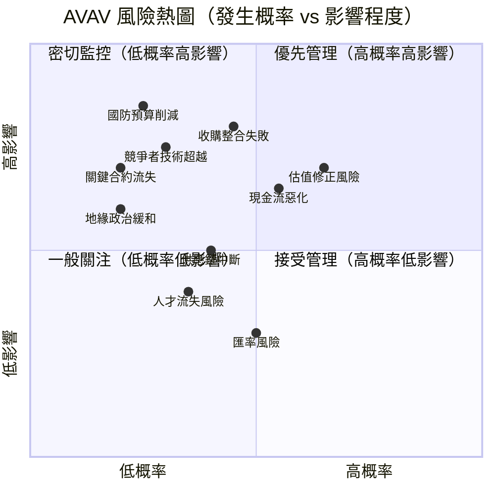

---

### ⚠️ 風險清單詳表

| # | 風險類型 | 風險描述 | 概率 | 影響 | 綜合 | 評級 |
|---|---------|---------|------|------|------|------|
| 1 | 📊 **估值修正** | 前瞻P/E 57x，一旦成長預期下調估值大幅壓縮 | 高 | 高 | 🔴 危險 | 🔴 |
| 2 | 🔗 **收購整合** | Tomahawk等收購整合不及預期，拖累獲利 | 中高 | 高 | 🔴 危險 | 🔴 |
| 3 | 💸 **現金消耗** | FCF-$318M，現金跑道<2年（TTM基礎） | 中高 | 高 | 🔴 危險 | 🔴 |
| 4 | 🏛️ **預算政治** | 美國國防預算受政治因素削減或項目取消 | 低中 | 極高 | 🟡 需監控 | 🟡 |
| 5 | ⚔️ **競爭加劇** | Anduril/Shield AI等新創搶奪市場份額 | 中 | 中高 | 🟡 需監控 | 🟡 |
| 6 | 🌍 **地緣緩和** | 烏俄/台海衝突緩和，緊迫需求下降 | 低 | 高 | 🟡 需監控 | 🟡 |
| 7 | ⚙️ **供應鏈** | 半導體/電子零件短缺影響生產交付 | 中 | 中 | 🟡 一般 | 🟡 |
| 8 | 👥 **人才競爭** | 與矽谷科技公司爭搶工程人才 | 中 | 中 | 🟡 一般 | 🟡 |
| 9 | 📜 **ITAR監管** | 出口管制變化影響國際銷售 | 低 | 中 | 🟢 低風險 | 🟢 |
| 10 | 💱 **匯率風險** | 美元走強影響國際營收換算 | 高 | 低 | 🟢 可管理 | 🟢 |

---

### 🛡️ 風險緩解措施

```
╔═══════════════════════════════════════════════════════════════╗
║                    風險緩解措施摘要                            ║
╠═══════════════════════════════════════════════════════════════╣
║                                                               ║
║  🔴 高危風險緩解：                                            ║
║  ├─ 估值修正：設置停損點（-20%至-25%），分批建倉降低風險      ║
║  ├─ 整合風險：追蹤季報中整合進度KPI，重點關注協同效益         ║
║  └─ 現金流：監控FCF轉正時間點，若持續惡化需重新評估          ║
║                                                               ║
║  🟡 中危風險緩解：                                            ║
║  ├─ 預算政治：追蹤NDAA進展，多元化合約避免單一項目依賴        ║
║  ├─ 競爭加劇：關注R&D支出效率及新產品發布節奏                 ║
║  └─ 供應鏈：查看公司長期採購合約及庫存水位                   ║
║                                                               ║
║  🟢 低危風險（已有緩解機制）：                                ║
║  ├─ ITAR保護本土競爭優勢                                      ║
║  ├─ 長期政府合約提供收入能見度                                 ║
║  └─ 充足流動資產（流動比率5.08x）支撐短期運營                 ║
╚═══════════════════════════════════════════════════════════════╝
```

---

## 8. 催化劑與觸發因素

### 📅 催化劑時間軸

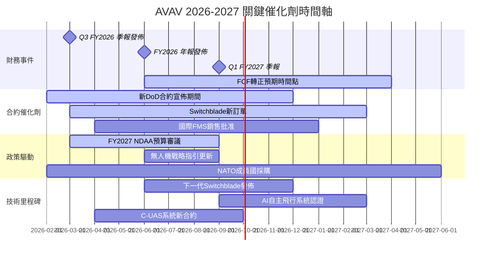

---

### 🎯 觸發因素樹

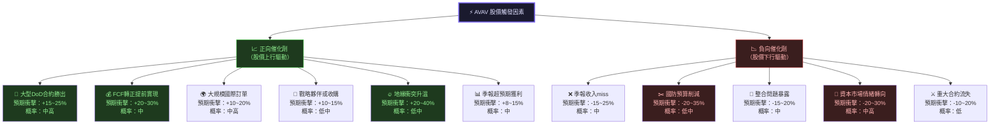

---

## 9. 投資建議

### 🏆 最終評級

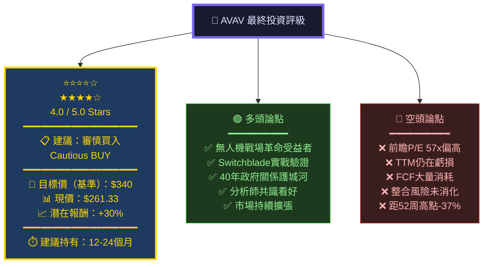

---

### ⭐ 評分總表

```
╔══════════════════════════════════════════════════════════════════╗
║                  AVAV 最終綜合評分卡                             ║
╠══════════════════════════════════════════════════════════════════╣
║                                                                  ║
║  📈 成長性          ★★★★★★★★★☆  9.0/10  🟢 核心優勢          ║
║  🛡️ 競爭優勢        ★★★★★★★★☆☆  8.0/10  🟢 深厚護城河        ║
║  👔 管理執行力      ★★★★★★☆☆☆☆  6.5/10  🟡 中上水準          ║
║  🏦 財務健康度      ★★★★★☆☆☆☆☆  5.5/10  🟡 流動性尚可        ║
║  💰 獲利能力        ★★★☆☆☆☆☆☆☆  3.5/10  🔴 仍在虧損          ║
║  📊 估值合理性      ★★★☆☆☆☆☆☆☆  3.0/10  🔴 估值偏高          ║
║  ━━━━━━━━━━━━━━━━━━━━━━━━━━━━━━━━━━━━━━━━━━━━━━━━━━━━━━━━━  ║
║  🌟 加權綜合評分    ★★★★★★☆☆☆☆  6.3/10  🟡 審慎看好          ║
║                                                                  ║
║  ━━━━━━━━━━━━━━━━━━━━━━━━━━━━━━━━━━━━━━━━━━━━━━━━━━━━━━━━━  ║
║              最終建議評級：★★★★☆  審慎買入                    ║
╚══════════════════════════════════════════════════════════════════╝
```

---

### 🎯 目標價區間分析

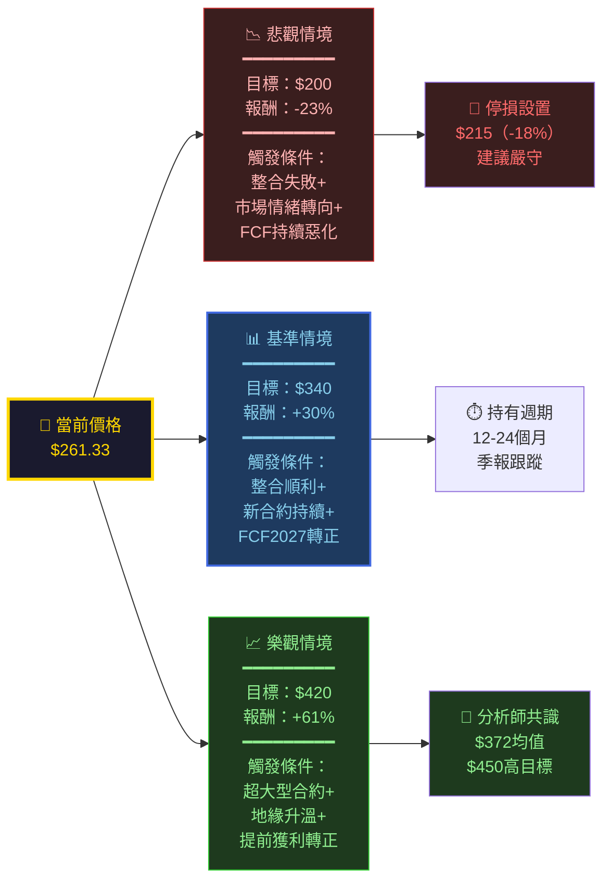

---

### 👤 投資人適配度評估

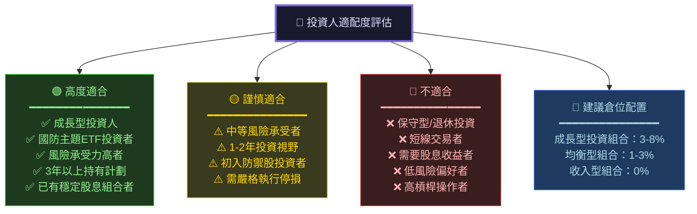

---

### 📋 操作策略建議

```
╔══════════════════════════════════════════════════════════════════╗
║               AVAV 可操作投資策略建議                            ║
╠══════════════════════════════════════════════════════════════════╣
║                                                                  ║
║  🎯 建議操作策略：分批建倉 + 嚴格停損                           ║
║                                                                  ║
║  📍 進場策略（分3批）：                                          ║
║  ├─ 第1批（30%）：$240-$265 → 當前區間具吸引力（現在）          ║
║  ├─ 第2批（40%）：$215-$240 → 若市場下跌加碼                   ║
║  └─ 第3批（30%）：季報確認獲利改善後加倉                        ║
║                                                                  ║
║  🛑 停損設置：                                                   ║
║  └─ 硬停損：$215（較當前-18%，技術支撐破位）                    ║
║                                                                  ║
║  🎯 獲利了結：                                                   ║
║  ├─ 第1目標：$340（+30%，基準情境達成）→ 賣出30%               ║
║  ├─ 第2目標：$380（+45%，接近分析師均值）→ 再賣30%             ║
║  └─ 第3目標：$420（+61%，樂觀情境）→ 剩餘部分                  ║
║                                                                  ║
║  ⏱️ 關鍵觀察時間點：                                            ║
║  ├─ 2026-03：下季度財報（關注FCF改善）                          ║
║  ├─ 2026-06：FY2026年報（整合效果評估）                         ║
║  └─ 2026-09：FY2027指引（成長預期確認）                         ║
║                                                                  ║
║  ⚠️ 關鍵警示信號（若出現應立即重評）：                          ║
║  ├─ 季報收入連續兩季低於預期                                     ║
║  ├─ FCF在2027年後仍未轉正                                       ║
║  ├─ 大型DoD合約被競爭者搶走                                     ║
║  └─ 管理層大規模股票拋售                                         ║
╚══════════════════════════════════════════════════════════════════╝
```

---

### 📊 投資論點總結

```
╔══════════════════════════════════════════════════════════════════╗
║                  核心投資論點（Bull Case）                        ║
╠══════════════════════════════════════════════════════════════════╣
║                                                                  ║
║  1️⃣  戰場無人化革命正在加速                                      ║
║     烏俄衝突已證明：無人機是現代戰爭的決定性武器                 ║
║     AVAV的Switchblade已成為戰場標配，訂單能見度高               ║
║                                                                  ║
║  2️⃣  美國國防支出中長期結構性增加                                ║
║     FY2026 NDAA $886B，無人機專項預算持續擴大                   ║
║     AVAV作為DoD 40年夥伴，優先受益地位確立                      ║
║                                                                  ║
║  3️⃣  技術護城河難以複製                                          ║
║     ITAR出口管制 + 政府安全認證 = 外國競爭者幾乎無法進入        ║
║     40年技術積累 + 士兵操作習慣 = 切換成本極高                  ║
║                                                                  ║
║  4️⃣  估值修正後的當前位置具吸引力                                ║
║     距52週高點$417已回調37%，風險已部分釋放                     ║
║     分析師目標均值$372，仍有+42%上行空間                        ║
║                                                                  ║
║  5️⃣  收購後整合效益將在FY2027顯現                                ║
║     短期整合成本壓制利潤屬正常，長期協同效益可期                 ║
║     FCF轉正是最大觸發點，一旦實現估值將大幅重估                  ║
║                                                                  ║
╠══════════════════════════════════════════════════════════════════╣
║  🏆 最終評級：★★★★☆ 審慎買入（Cautious BUY）                  ║
║  🎯 基準目標：$340（12-18個月）                                  ║
║  🛑 停損價位：$215（嚴格執行）                                   ║
║  💼 建議倉位：成長型組合3-8%                                    ║
╚══════════════════════════════════════════════════════════════════╝
```

---

> ⚠️ **免責聲明**：本報告由 AI 自動生成，所有數據基於 Yahoo Finance 提供之資訊（截至 2026-02-24），僅供研究參考用途，**不構成任何投資建議**。投資有風險，市場存在不確定性，投資人應獨立進行盡職調查，並諮詢專業財務顧問後做出投資決策。過去績效不代表未來表現。本報告中的目標價格及預測均為估算，實際結果可能與預測存在重大差異。