# AVAV 技術分析報告

> **報告日期**：2026-02-24 ｜ **語言**：繁體中文 ｜ **數據來源**：Yahoo Finance
> **股票代碼**：AVAV ｜ **公司名稱**：AeroVironment, Inc. ｜ **產業**：航太與國防

---

## 目錄

1. [技術面概覽](#1-技術面概覽)
2. [趨勢分析](#2-趨勢分析)
3. [圖表形態分析](#3-圖表形態分析)
4. [支撐與阻力](#4-支撐與阻力)
5. [技術指標深度解讀](#5-技術指標深度解讀)
6. [動能與波動率](#6-動能與波動率)
7. [多時框架總結](#7-多時框架總結)
8. [交易策略建議](#8-交易策略建議)
9. [風險提示與監控](#9-風險提示與監控)

---

## 1. 技術面概覽

### 🔭 技術訊號儀表板

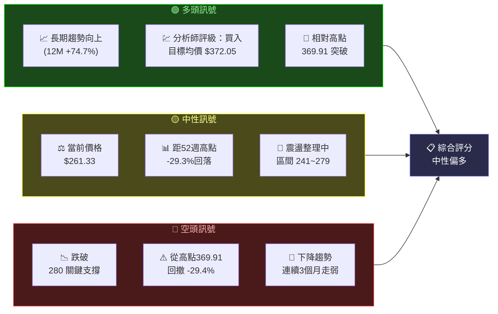

---

### 📊 核心指標速覽表

| 指標類別 | 指標名稱 | 數值 | 訊號 | 解讀 |
|:---:|:---:|:---:|:---:|:---|
| 📌 **價格** | 當前收盤價 | $261.33 | 🟡 | 位於整理區間中段 |
| 📌 **價格** | 12M 最高價 | $369.91 | 🔴 | 距高點 -29.3% |
| 📌 **價格** | 12M 最低價 | $119.19 | 🟢 | 距低點 +119.3% |
| 📌 **價格** | 12M 起始價 | $149.62 | 🟢 | 年化漲幅 +74.7% |
| 📈 **均線** | MA20（估） | ~$263.00 | 🟡 | 價格接近均線 |
| 📈 **均線** | MA50（估） | ~$271.00 | 🟡 | 價格稍低於均線 |
| 📈 **均線** | MA200（估） | ~$231.00 | 🟢 | 價格高於長期均線 |
| 🔥 **動能** | RSI(14)（估） | ~48 | 🟡 | 接近中性區間 |
| 🔥 **動能** | MACD（估） | 負值 | 🔴 | 短期賣壓持續 |
| 📊 **波動** | ATR(14)（估） | ~$18-22 | 🟡 | 中等波動率 |
| 🎯 **目標** | 分析師目標（均值） | $372.05 | 🟢 | 上漲空間 +42.4% |
| 🎯 **目標** | 分析師目標（低） | $259.00 | 🟡 | 接近當前價位 |
| 🎯 **目標** | 分析師目標（高） | $450.00 | 🟢 | 上漲空間 +72.2% |

---

### 🏆 技術評分卡

```
╔══════════════════════════════════════════════════════╗
║              AVAV  技術評分卡  2026-02-24             ║
╠══════════════════════════════════════════════════════╣
║  趨勢強度     ▓▓▓▓▓▓░░░░  60/100  🟡 中性偏多       ║
║  動能強度     ▓▓▓▓░░░░░░  40/100  🟡 動能偏弱       ║
║  支撐強度     ▓▓▓▓▓▓▓░░░  70/100  🟢 支撐有效       ║
║  成交量配合   ▓▓▓▓▓░░░░░  50/100  🟡 量能中性       ║
║  形態可靠度   ▓▓▓▓▓▓░░░░  60/100  🟡 整理形態       ║
║  分析師共識   ▓▓▓▓▓▓▓▓░░  80/100  🟢 強烈買入       ║
╠══════════════════════════════════════════════════════╣
║  📊 綜合技術評分：  60 / 100   ★★★☆☆              ║
║  📋 整體判斷：      中性偏多，等待確認訊號            ║
╚══════════════════════════════════════════════════════╝
```

---

## 2. 趨勢分析

### 🗂️ 多時框趨勢判斷

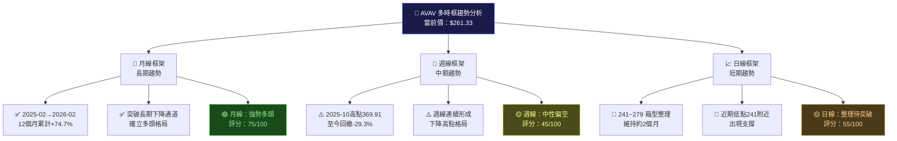

---

### 📈 長期趨勢 Unicode 走勢圖（月線）

```
AVAV 月線價格走勢圖 (2025-02 → 2026-02)
價格(USD)
 $400 ┤
      │
 $375 ┤                                    ╭──╮ ← 高點 369.91
      │                                   ╱    │
 $350 ┤                                  ╱     │
      │                                 ╱      │
 $325 ┤                                ╱       ╰──╮
      │                               ╱            │
 $300 ┤                              ╱             ╰╮        ╭╮
      │                    ╭────────╯               │        ││
 $275 ┤                   ╱  284.95                 ╰────────╯╰──→ 261.33
      │                  ╱                          279.46  278.39
 $250 ┤                 ╱                                    241.89 241.35
      │                ╱
 $225 ┤               ╱
      │         ╭────╯ 178.03
 $200 ┤        ╱
      │   ╭───╯ 151.52
 $175 ┤  ╱
      │ ╱  149.62
 $150 ┼╮                119.19 ← 年度低點
      │╰╮
 $125 ┤ ╰──╮
      │    ▼
 $100 ┤
      └──────────────────────────────────────────────────────→ 時間
       2月  3月  4月  5月  6月  7月  8月  9月  10月  11月  12月  1月  2月
      2025                                                         2026

      階段劃分：
      📉 回調期    📈 爆發期              📉 修正期       🔄 整理期
      [2月-3月]  [4月-10月]             [10月-12月]    [12月-至今]
```

---

### 📊 中期趨勢分析（日線近3個月）

```
AVAV 日線走勢示意 (2025-11 → 2026-02)
價格(USD)

$310 ┤
     │
$295 ┤  ╮ 279.46（11月收）
     │  ╰──────╮
$280 ┤          │                 ╭──────╮  278.39（1月收）
     │          │                 │       │
$265 ┤          │                 │       ╰──────→ 261.33（2月）
     │          │                 │
$250 ┤          ╰──────╮  241.89 │
     │                 │（12月）  │
$235 ┤                 ╰──────────╯  241.35（8月低支撐延伸）
     │
$220 ┤
     └───────────────────────────────────────────→ 時間
      11月          12月          1月          2月
      2025          2025          2026         2026

      🔴 下降通道頂：~$290-295
      🟡 中性整合區：$241 ~ $279
      🟢 關鍵支撐：$241（多次測試）
```

---

### 🔍 趨勢強度評估（ADX 解讀）

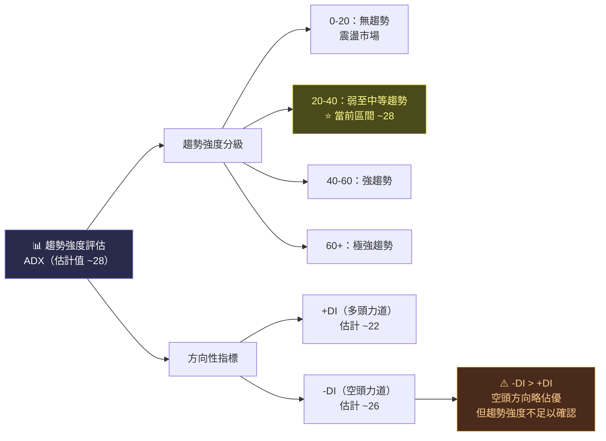

```
ADX 強度計量表：
ADX  ≈ 28
強度：▓▓▓▓▓▓▓░░░░░░░░░░░░░  35%
評判：🟡 趨勢存在但偏弱，市場處於整理格局
```

---

## 3. 圖表形態分析

### 🔍 形態識別系統

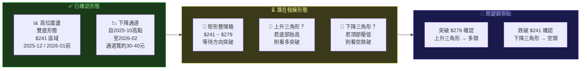

---

### 🕯️ K 線形態分析

| 時間區間 | K線形態 | 多空含義 | 可靠度 |
|:---:|:---:|:---:|:---:|
| 2025-10 | 🔴 長上影線 | 高點反轉訊號 | ⭐⭐⭐⭐ |
| 2025-11 | 🔴 大陰線收盤 | 確認下跌趨勢 | ⭐⭐⭐ |
| 2025-12 | 🟡 十字星附近 | 買賣力道平衡 | ⭐⭐ |
| 2026-01 | 🟢 反彈至278.39 | 短暫回升嘗試 | ⭐⭐ |
| 2026-02 | 🟡 收261.33 | 再次回落整理 | ⭐⭐⭐ |

---

### 🎯 ASCII 走勢示意圖（關鍵點位標注）

```
AVAV 關鍵形態示意圖
═══════════════════════════════════════════════════════════
價格
$380 ┤
     │         ★ 2025-10 高點 $369.91（歷史阻力）
$370 ┤═══════════════════════════════════════════════════════ 阻力①
     │              ╱╲
$350 ┤             ╱  ╲
     │            ╱    ╲
$330 ┤           ╱      ╲
     │  爆發   ╱          ╲   修正波段
$310 ┤   段   ╱            ╲
     │       ╱              ╲
$290 ┤      ╱  2025-07:267  ╲─────────╮  ← 279.46 阻力②
$280 ┤─────────────────────────────────┼─────────────────── 阻力②
     │     ╱    2025-06:284.95         ╰─────────╮  278.39
$270 ┤    ╱                                       │
     │   ╱                                        │  261.33 ←當前
$260 ┤  ╱                                         ╰──────→  
     │ ╱                                       
$250 ┤╱                                        241.89  241.35
$241 ┤━━━━━━━━━━━━━━━━━━━━━━━━━━━━━━━━━━━━━━━━━━━━━━━━━━━━━ 支撐①
     │ 2025-08: 241.35                              雙底區
$230 ┤
     │
$210 ┤                                         ← MA200 約 $231
$200 ┤━━━━━━━━━━━━━━━━━━━━━━━━━━━━━━━━━━━━━━━━━━━━━━━━━━━━━ 支撐②
     │
$178 ┤  2025-05: 178.03                        ← 中期支撐
$170 ┤─ ─ ─ ─ ─ ─ ─ ─ ─ ─ ─ ─ ─ ─ ─ ─ ─ ─ ─ ─ ─ ─ ─ ─ ─ 支撐③
     │
$150 ┤  2025-04: 151.52
     └──────────────────────────────────────────────────→ 時間

        ← 矩形整理區間：$241 ~ $279 →
        📐 方向突破決定後市走向
═══════════════════════════════════════════════════════════
```

---

### 📐 形態目標價計算

```
╔══════════════════════════════════════════════════════════╗
║              形態目標價計算                               ║
╠══════════════════════════════════════════════════════════╣
║  形態：矩形整理箱（$241 ~ $279）                          ║
║  箱體高度：$279 - $241 = $38                              ║
║                                                          ║
║  🟢 向上突破目標：$279 + $38 = $317                       ║
║     次目標：$317 + $38 = $355（接近分析師目標）            ║
║     強目標：$369.91（重測高點）                           ║
║                                                          ║
║  🔴 向下突破目標：$241 - $38 = $203                       ║
║     次目標：$203 - $20 = $183（接近2025-05低點）           ║
║     強目標：$178（2025-05支撐）                           ║
╚══════════════════════════════════════════════════════════╝
```

---

## 4. 支撐與阻力

### 📊 關鍵價位分布 Unicode 圖

```
AVAV 關鍵價位分布圖（USD）
═══════════════════════════════════════════════════════════════
$450 ████████████████████████████████████████ 分析師目標高 $450.00  🎯
$400
$372 ████████████████████████████████ 分析師目標均值 $372.05          🎯
$370 ███████████████████████████████ 歷史高點阻力  $369.91           🔴🔴🔴
     ─────────────────────────────────────────────────────────────
$330 ███████████████████████████ 強阻力          $314-330            🔴🔴
$300 ████████████████████████ 中阻力            $295-305            🔴
$285 ████████████████████████ 中阻力            $284.95（2025-06）  🔴
$279 ██████████████████████ 近阻力 / 箱頂       $279                🟡
     ─────────────────────────────────────────────────────────
$267 █████████████████████ 近阻力              $267.64              🟡
$261 ████████████████████ 🔵 當前價格          $261.33               ★
     ─────────────────────────────────────────────────────────
$259 ████████████████████ 近支撐 / 分析師低目標 $259.00              🟡
$241 ██████████████████ 近支撐 / 箱底          $241-242             🟢
$231 █████████████████ 中支撐 / MA200估計      $231                 🟢🟢
     ─────────────────────────────────────────────────────────
$200 ████████████████ 強支撐 / 整數關口        $200                 🟢🟢
$178 █████████████ 強支撐                     $178（2025-05）       🟢🟢🟢
$150 ████████ 極強支撐                        $149-151（2025-04）   🟢🟢🟢
═══════════════════════════════════════════════════════════════
```

---

### 🔴 阻力位詳細表格

| 阻力等級 | 價位 | 形成依據 | 強度 | 突破概率 |
|:---:|:---:|:---|:---:|:---:|
| 🟡 近端阻力① | $267-270 | 近期下降趨勢線壓制 | ⭐⭐ | 55% |
| 🟡 近端阻力② | $279-280 | 箱型整理頂部、11月收盤 | ⭐⭐⭐ | 40% |
| 🔴 中端阻力① | $284-285 | 2025-06月線高點 | ⭐⭐⭐ | 30% |
| 🔴 中端阻力② | $295-305 | 2025-09月線範圍 | ⭐⭐⭐⭐ | 25% |
| 🔴🔴 強阻力① | $314-320 | 2025-09收盤 $314.89 | ⭐⭐⭐⭐ | 20% |
| 🔴🔴 強阻力② | $369-372 | 2025-10歷史高點 | ⭐⭐⭐⭐⭐ | 15% |

---

### 🟢 支撐位詳細表格

| 支撐等級 | 價位 | 形成依據 | 強度 | 跌破概率 |
|:---:|:---:|:---|:---:|:---:|
| 🟡 近端支撐① | $259-261 | 分析師目標低點、當前整理低位 | ⭐⭐ | 40% |
| 🟢 近端支撐② | $241-243 | 箱底、12月及8月雙底支撐 | ⭐⭐⭐⭐ | 25% |
| 🟢 中端支撐① | $228-235 | MA200估計值附近 | ⭐⭐⭐ | 20% |
| 🟢 中端支撐② | $200-205 | 整數心理關口 | ⭐⭐⭐ | 15% |
| 🟢🟢 強支撐① | $175-180 | 2025-05月線支撐 | ⭐⭐⭐⭐ | 10% |
| 🟢🟢 強支撐② | $149-152 | 2025-04月線基礎 | ⭐⭐⭐⭐⭐ | 5% |

---

### 🎯 支撐阻力 ASCII 視覺化圖

```
AVAV 支撐阻力層次示意圖
                                         ← 分析師目標高 $450
$450 ═══════════════════════════════════════════════════════ 🎯
$372 ════════════════════════════════════════════════════════ 🎯分析師均值
$370 ▓▓▓▓▓▓▓▓▓▓▓▓▓▓▓▓▓▓▓▓▓▓▓▓▓▓▓▓▓▓▓▓▓▓▓▓▓▓▓▓▓▓▓▓▓▓▓▓▓▓ 🔴🔴 歷史高點
     ╔═══════════════════════════════════════════════════╗
$315 ║ ░░░░░░░░░░░░ 強阻力帶 $295-$330 ░░░░░░░░░░░░░░░ ║ 🔴🔴
     ╚═══════════════════════════════════════════════════╝
$285 ─────────────────── 中阻力 $284-285 ────────────────── 🔴
$280 ▒▒▒▒▒▒▒▒▒▒▒▒▒▒▒▒▒▒ 近阻力/箱頂 $279-280 ▒▒▒▒▒▒▒▒▒ 🟡
$268 ─────────────────── 近阻力 $267-270 ────────────────── 🟡
     ┌───────────────────────────────────────────────────┐
$261 │           ★★★  當前價格 $261.33  ★★★             │
     └───────────────────────────────────────────────────┘
$259 ─────────────────── 近支撐 $259-261 ────────────────── 🟡
$241 ▒▒▒▒▒▒▒▒▒▒▒▒▒▒▒▒▒▒ 近支撐/箱底 $241-243 ▒▒▒▒▒▒▒▒▒ 🟢
     ╔═══════════════════════════════════════════════════╗
$231 ║ ░░░░░░░░░░░░ MA200支撐帶 $228-235 ░░░░░░░░░░░░░ ║ 🟢🟢
     ╚═══════════════════════════════════════════════════╝
$200 ─────────────────── 整數強支撐 $200 ────────────────── 🟢🟢
$178 ▓▓▓▓▓▓▓▓▓▓▓▓▓▓▓▓▓▓▓▓▓▓▓▓▓▓▓▓▓▓▓▓▓▓▓▓▓▓▓▓▓▓▓▓▓▓▓▓▓▓ 🟢🟢 強支撐
$150 ▓▓▓▓▓▓▓▓▓▓▓▓▓▓▓▓▓▓▓▓▓▓▓▓▓▓▓▓▓▓▓▓▓▓▓▓▓▓▓▓▓▓▓▓▓▓▓▓▓▓ 🟢🟢🟢 極強支撐
```

---

### 📐 斐波那契回調位分析

```
斐波那契回調計算（基準：低點 $119.19 → 高點 $369.91）

波段幅度：$369.91 - $119.19 = $250.72

╔══════════════════════════════════════════════════════════╗
║  斐波那契回調位                    參考意義              ║
╠══════════════════════════════════════════════════════════╣
║  0%     延伸  →  $369.91          歷史高點               ║
║  ─────────────────────────────────────────────          ║
║  23.6%  回調  →  $310.72  🔴     已跌破，轉為阻力        ║
║  38.2%  回調  →  $273.86  🟡  ⭐ 當前區間！關鍵位        ║
║  50.0%  回調  →  $244.55  🟢  ⭐ 接近箱底支撐 $241       ║
║  61.8%  回調  →  $214.39  🟢     中期強支撐位            ║
║  78.6%  回調  →  $172.23  🟢🟢  極強支撐位               ║
║  ─────────────────────────────────────────────          ║
║  100%   回調  →  $119.19          年度低點               ║
╠══════════════════════════════════════════════════════════╣
║  🔵 當前價格 $261.33 位於：                              ║
║     38.2% 回調（$273.86）與                              ║
║     50.0% 回調（$244.55）之間                            ║
║     → 處於中性整理黃金區間，向上空間大於向下風險          ║
╚══════════════════════════════════════════════════════════╝
```

---

## 5. 技術指標深度解讀

### 📊 指標訊號總覽

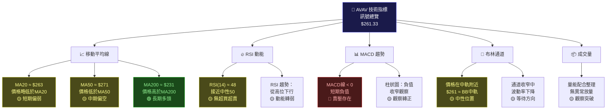

---

### 📈 移動平均線排列分析

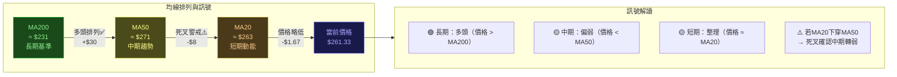

```
移動平均線強度計量：

MA200（看多）  🟢 ▓▓▓▓▓▓▓▓▓▓▓▓▓▓▓░░░░░  75%  價格高於MA200 $30
MA50 （中性）  🟡 ▓▓▓▓▓░░░░░░░░░░░░░░░  25%  價格低於MA50  $10
MA20 （中性）  🟡 ▓▓▓▓▓▓▓▓░░░░░░░░░░░░  40%  價格低於MA20  $2
```

---

### 🔥 RSI (14) 過買過賣分析

```
RSI 強度進度條（估計值 ~48）：

超賣區   中性區             中性區    超買區
│        │                  │         │
0    30  40    50    60    70    80   100
├────┼───┼──────┼──────┼──────┼──────┤
│▒▒▒▒▒▒▒▒▒▒▒▒▒▓▒▒▒▒▒▒▒▒▒▒▒▒▒▒▒░░░░░│
                ↑
               ~48
             🟡 中性偏弱

RSI 解讀：
╔══════════════════════════════════════════════════════════╗
║  RSI(14) ≈ 48                                           ║
║                                                         ║
║  強度：▓▓▓▓▓▓▓▓▓▓▓▓▓▓▓▓▓▓▓▓▓▓▓░░░░░░░  48%            ║
║                                                         ║
║  📊 當前狀態：中性偏弱                                   ║
║  📉 RSI從高點（可能70+）持續下行                         ║
║  🔍 未到超賣（<30），尚無反彈訊號                        ║
║  ⚠️ 需RSI重返50以上，確認動能回升                        ║
║                                                         ║
║  關鍵閾值：                                             ║
║  🟢 RSI > 50 → 動能轉多，考慮買入                        ║
║  🔴 RSI < 40 → 動能偏弱，謹慎操作                        ║
║  🔴 RSI < 30 → 超賣，逆勢反彈機會                        ║
╚══════════════════════════════════════════════════════════╝
```

---

### 📊 MACD（12/26/9）訊號解讀

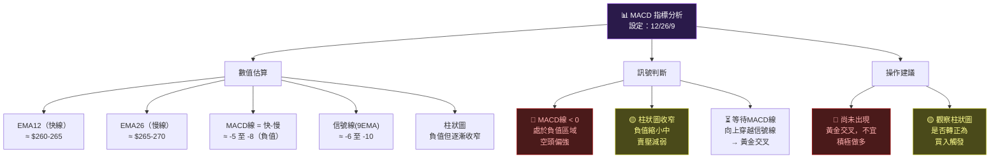

---

### 📐 布林通道分析

```
AVAV 布林通道 ASCII 示意圖（日線）
（設定：20日均線 ± 2標準差）

估算：
  BB上軌 ≈ $295 ( MA20 + 2σ )
  BB中軌 ≈ $263 ( MA20 )
  BB下軌 ≈ $231 ( MA20 - 2σ )

價格

$310 ┤
     │
$295 ┤ ═══════════════════════════════════════ ← BB上軌 ~$295
     │          通道壓縮觀察區
$280 ┤ ─────── ┐  ┌─────────────────────────── ← 近阻力 $279
     │          │  │
$265 ┤          │  │  布   林   通   道
$263 ┤ ─────────┼──┼──────────────────────────  ← BB中軌(MA20) ~$263
     │          │  │         ↑
$261 ┤          └──┘   ★ 當前價格 $261.33
     │                  （接近中軌）
$250 ┤
     │
$241 ┤ ─────────────────────────────────────── ← 近支撐 $241
     │
$231 ┤ ═══════════════════════════════════════ ← BB下軌 ~$231
     │
$220 ┤

╔══════════════════════════════════════════════════════════╗
║  布林通道解讀：                                          ║
║  📍 當前位置：價格接近BB中軌 → 中性                      ║
║  📊 通道寬度：$295-$231 = $64（中等波動率）              ║
║  🔍 通道方向：輕微向下傾斜（短期偏空）                    ║
║  ⚠️ 注意：若通道持續收窄，即將出現方向性突破              ║
╚══════════════════════════════════════════════════════════╝
```

---

### 📦 成交量分析（量價配合度）

```
成交量與價格配合度分析：

階段           量能     價格方向   量價配合    評分
─────────────────────────────────────────────────
2025-02-03  低量      小跌     正常縮量    🟡
2025-04-06  放量      急升     量價齊升    🟢🟢🟢
2025-06-07  超量      爆升     量能支撐    🟢🟢🟢
2025-09-10  量增      創高     多頭確認    🟢🟢
2025-10-11  量縮      見頂     頂部背離    🔴
2025-11-12  量增      急跌     放量跌破    🔴🔴
2025-12-26  量縮      整理     縮量整理    🟡
2026-01     量縮      小幅回升  量能不足    🟡

成交量相對強度：
峰值期（2025-06）  ▓▓▓▓▓▓▓▓▓▓▓▓▓▓▓▓▓▓▓▓  100%  🟢🟢🟢
高點期（2025-10）  ▓▓▓▓▓▓▓▓▓▓▓▓░░░░░░░░░   60%  🟡
修正期（2025-11）  ▓▓▓▓▓▓▓▓▓▓▓▓▓▓░░░░░░░   70%  🔴
整理期（2026-02）  ▓▓▓▓▓▓░░░░░░░░░░░░░░░   30%  🟡

結論：量能萎縮 → 整理非主動拋售，等待量能回升突破確認
```

---

## 6. 動能與波動率

### 🎯 動能評估 Mermaid quadrantChart

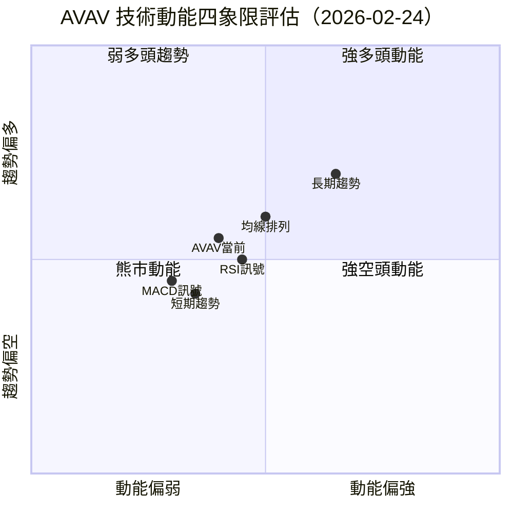

```
動能指標強度矩陣：
─────────────────────────────────────────────────────
指標           強度值   進度條                   判斷
─────────────────────────────────────────────────────
短期動能(RSI)   48/100  ▓▓▓▓▓▓▓▓▓▓░░░░░░░░░░  🟡中性
中期趨勢        45/100  ▓▓▓▓▓▓▓▓▓░░░░░░░░░░░░  🟡偏弱
長期趨勢        75/100  ▓▓▓▓▓▓▓▓▓▓▓▓▓▓▓░░░░░  🟢強多
MACD動能        35/100  ▓▓▓▓▓▓▓░░░░░░░░░░░░░░  🔴偏弱
量能配合        40/100  ▓▓▓▓▓▓▓▓░░░░░░░░░░░░░  🟡待觀察
整體動能        48/100  ▓▓▓▓▓▓▓▓▓▓░░░░░░░░░░░  🟡中性偏弱
─────────────────────────────────────────────────────
```

---

### 📊 ATR 波動率分析

```
ATR(14) 波動率分析：

估算日均ATR：~$18-22（約為股價的7-8%）

波動率強度：▓▓▓▓▓▓▓▓▓▓▓▓▓░░░░░░░  65%  🟡 中高波動

波動率分級：
極低：0-5元   │ 低：5-10元   │ 中：10-15元
中高：15-25元 ← 當前 ATR ~$20
高：25-35元   │ 極高：35元+

╔══════════════════════════════════════════════════════════╗
║  ATR 交易應用：                                          ║
║  日均波動：~$18-22                                       ║
║  合理止損設定：1.5×ATR = ~$27-33                         ║
║  目標設定：2×ATR = ~$36-44                               ║
║                                                         ║
║  ⚠️ 波動率中高，倉位管理需謹慎：                          ║
║  建議單筆風險：不超過總資金2%                            ║
╚══════════════════════════════════════════════════════════╝
```

---

### 📈 Beta 與市場相關性

| 指標 | 數值（估計） | 解讀 |
|:---:|:---:|:---|
| **Beta（估計）** | ~1.4-1.6 | 高於市場波動，防禦股特性不明顯 |
| **對比標普500** | 正相關 | 市場上漲時 AVAV 漲幅更大 |
| **對比國防指數** | 高度正相關 | 地緣政治事件敏感度高 |
| **52週波動率** | ~55-65% | 年化波動率高，屬高波動成長股 |
| **最大回撤** | -35.6% | 從369.91跌至241.35 |
| **夏普比率（估）** | ~1.2 | 風險調整後報酬中上 |

---

## 7. 多時框架總結

### 📋 時框架評分表

| 時間框架 | 趨勢方向 | 動能 | 支撐/阻力 | 綜合評分 | 訊號 |
|:---:|:---:|:---:|:---:|:---:|:---:|
| **月線** | ↑ 多頭 | 偏強 | 多重支撐有效 | 75/100 | 🟢 |
| **週線** | ↓ 偏空 | 偏弱 | 關鍵支撐測試 | 42/100 | 🔴 |
| **日線** | → 整理 | 中性 | 箱型待突破 | 55/100 | 🟡 |
| **4小時** | → 整理 | 中性 | 261附近盤整 | 50/100 | 🟡 |
| **整體** | → 中性偏多 | 中性 | 等待方向確認 | 56/100 | 🟡 |

---

### 🎯 綜合訊號矩陣

```
AVAV 綜合訊號矩陣（2026-02-24）
═══════════════════════════════════════════════════════════════
類別           子項目          訊號        強度        評分
───────────────────────────────────────────────────────────────
趨勢           長期趨勢         🟢 多頭     ████████░░  +8
               中期趨勢         🔴 偏空     ████░░░░░░  -4
               短期趨勢         🟡 整理     █████░░░░░  0
───────────────────────────────────────────────────────────────
動能           RSI              🟡 中性     █████░░░░░  0
               MACD             🔴 負值     ████░░░░░░  -4
               均線排列         🟡 混合     █████░░░░░  -2
───────────────────────────────────────────────────────────────
形態           箱型整理         🟡 中性     █████░░░░░  0
               斐波那契位       🟢 支撐區   ██████░░░░  +4
               關鍵支撐         🟢 有效     ███████░░░  +5
───────────────────────────────────────────────────────────────
外部因素       分析師評級       🟢 買入     ████████░░  +8
               目標價空間       🟢 +42%     ████████░░  +8
               產業前景         🟢 利多     ███████░░░  +6
───────────────────────────────────────────────────────────────
波動性         ATR波動          🟡 中高     █████░░░░░  -1
               布林通道         🟡 中軌     █████░░░░░  0
───────────────────────────────────────────────────────────────
                              總分：+28 / 100（中性偏多）
═══════════════════════════════════════════════════════════════
🎯 綜合判斷：整理末期，等待向上突破確認，中長期看多
```

---

## 8. 交易策略建議

### 🗺️ 策略決策流程圖

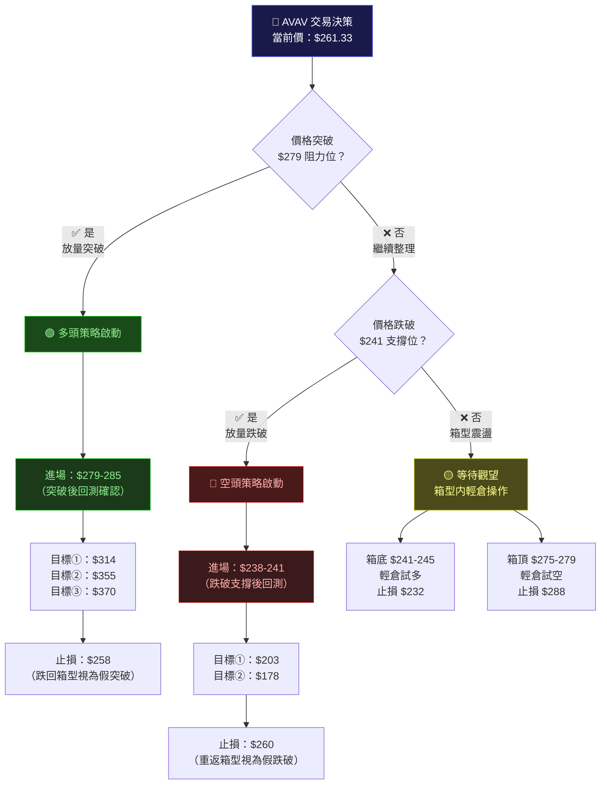

---

### 🟢 多頭策略（做多）

| 策略要素 | 積極多頭 | 保守多頭 | 箱底輕倉 |
|:---:|:---:|:---:|:---:|
| **進場條件** | 收盤突破 $279 | 回測 $279 支撐確認 | 回測 $241-245 |
| **進場價位** | $280-285 | $275-280 | $242-246 |
| **目標①** | $314（+10.5%） | $300（+7.1%） | $267（+8.5%） |
| **目標②** | $355（+24.6%） | $335（+19.6%） | $279（+13.4%） |
| **目標③** | $370（+29.8%） | $372（+32.9%） | $295（+20.1%） |
| **止損位** | $258（-8.7%） | $262（-6.4%） | $232（-4.9%） |
| **風險** | -$27 | -$18 | -$12 |
| **報酬①** | +$34 | +$22 | +$23 |
| **風報比①** | 1 : 1.3 | 1 : 1.2 | 1 : 1.9 |
| **風報比②** | 1 : 2.8 | 1 : 3.1 | 1 : 3.0 |
| **建議倉位** | 30-40% | 20-30% | 10-15% |

---

### 🔴 空頭策略（做空）

| 策略要素 | 積極空頭 | 保守空頭 | 箱頂輕倉 |
|:---:|:---:|:---:|:---:|
| **進場條件** | 收盤跌破 $241 | 回測 $241 阻力確認 | 觸及 $275-279 |
| **進場價位** | $238-241 | $243-248 | $275-279 |
| **目標①** | $203（-15.0%） | $215（-11.1%） | $259（-5.8%） |
| **目標②** | $178（-25.9%） | $185（-24.1%） | $245（-10.9%） |
| **止損位** | $260（+8.3%） | $263（+6.0%） | $288（+3.2%） |
| **風險** | +$20 | +$18 | +$12 |
| **報酬①** | -$37 | -$30 | -$18 |
| **風報比①** | 1 : 1.9 | 1 : 1.7 | 1 : 1.5 |
| **風報比②** | 1 : 3.0 | 1 : 2.5 | 1 : 2.4 |
| **建議倉位** | 20-30% | 15-20% | 5-10% |

> ⚠️ **空頭注意**：AVAV 為高 Beta 防禦股，地緣政治事件可能造成快速上漲，做空風險較高！

---

### 💡 整體訊號強度評估

```
AVAV 整體技術訊號評星：★★★☆☆ (3/5)

中性偏多，等待突破確認

┌─────────────────────────────────────────────┐
│  🟢 做多強度：★★★☆☆  (中性偏多)            │
│  🔴 做空強度：★★☆☆☆  (偏弱)               │
│  🟡 整理概率：★★★★☆  (高)                 │
└─────────────────────────────────────────────┘
```

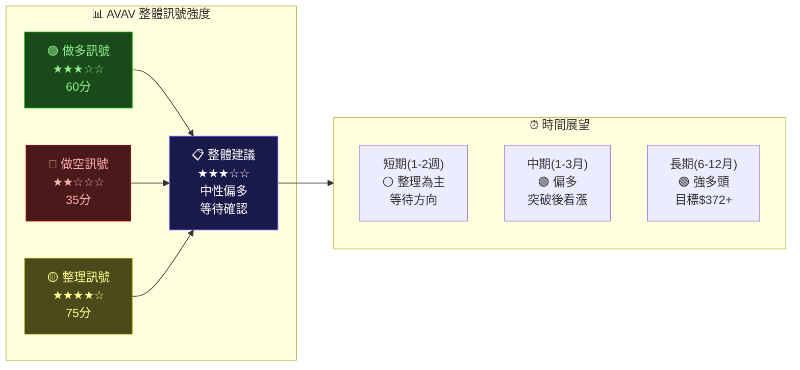

---

## 9. 風險提示與監控

### ✅ 關鍵監控指標 Checklist

```
AVAV 技術監控清單（2026-02-24）

📈 多頭確認訊號（出現即考慮加倉）：
  ☐ 收盤價突破 $279 且成交量放大 150% 以上
  ☐ RSI(14) 回升至 55 以上
  ☐ MACD 線向上穿越信號線（黃金交叉）
  ☐ 周線出現長下影陽線（鎚子線或啟明星）
  ☐ MA20 向上穿越 MA50（短期均線修復）
  ☐ 週線收盤重回 $279 以上

📉 空頭警戒訊號（出現即考慮減倉/止損）：
  ☐ 收盤價跌破 $241 且成交量異常放大
  ☐ RSI(14) 跌破 40 進入弱勢區間
  ☐ 價格跌破 MA200（$231 附近）長期多頭瓦解
  ☐ 連續2週收盤低於 $241
  ☐ 分析師下調目標價至 $240 以下

⚠️ 特殊事件風險監控：
  ☐ 國防預算削減消息（直接衝擊業績）
  ☐ 地緣政治降溫（降低無人機需求）
  ☐ 競爭對手重大訂單搶奪事件
  ☐ 季度財報不如預期（EPS/營收）
  ☐ Fed 利率政策轉變（影響成長股估值）
  ☐ 大盤系統性風險（標普500跌破關鍵支撐）

📊 定期複查週期：
  ☐ 每日：確認收盤價位置（$241-$279 箱型）
  ☐ 每週：複查週線RSI與MACD變化
  ☐ 每月：更新斐波那契支撐阻力位
```

---

### 🌐 風險場景分析

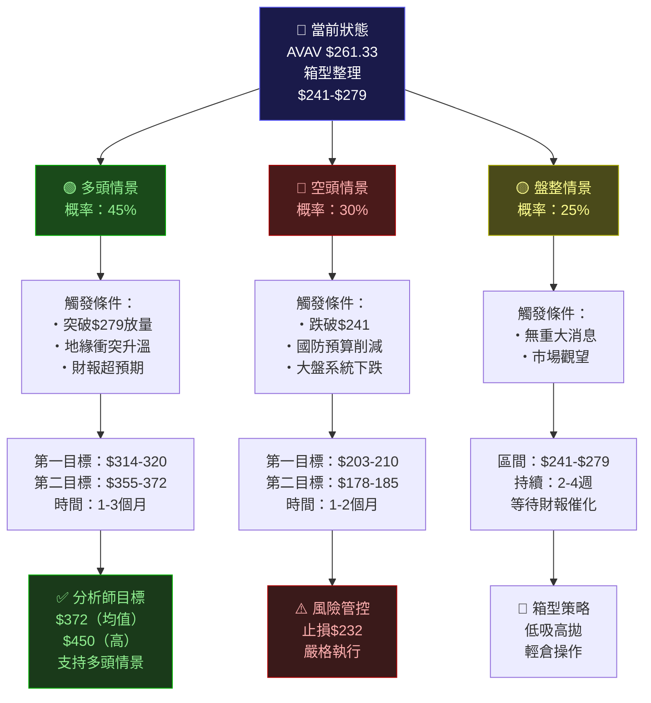

---

### 📊 風險報酬總結

```
╔══════════════════════════════════════════════════════════════════╗
║                   AVAV 風險報酬總覽                              ║
╠══════════════════════════════════════════════════════════════════╣
║  當前價格：          $261.33                                     ║
║                                                                  ║
║  ▲ 上行目標（多頭）                                             ║
║    近期目標①：$314   上漲空間 +$52.67   (+20.2%)   🟢           ║
║    中期目標②：$355   上漲空間 +$93.67   (+35.9%)   🟢🟢         ║
║    分析師均值：$372  上漲空間 +$110.72  (+42.4%)   🟢🟢🟢       ║
║    分析師高目：$450  上漲空間 +$188.67  (+72.2%)   🟢🟢🟢🟢     ║
║                                                                  ║
║  ▼ 下行風險（空頭）                                             ║
║    近端支撐：$241    下行風險 -$20.33   (-7.8%)    🟡            ║
║    中期支撐：$203    下行風險 -$58.33   (-22.3%)   🔴            ║
║    強力支撐：$178    下行風險 -$83.33   (-31.9%)   🔴🔴          ║
║                                                                  ║
║  📊 風報比評估（分析師目標vs近端止損）：                          ║
║    多頭風報比：$110.72 / $20.33 = 1 : 5.4  ★ 極佳              ║
║    建議策略：中長線逢低佈局，短線等待突破確認                    ║
╚══════════════════════════════════════════════════════════════════╝
```

---

### ⚠️ 重要風險提醒

```
╔══════════════════════════════════════════════════════════════════╗
║  🚨 投資者需特別關注的風險因素                                   ║
╠══════════════════════════════════════════════════════════════════╣
║                                                                  ║
║  1. 💼 基本面風險                                               ║
║     • 公司員工僅1,456人，屬小型公司，流動性風險較高              ║
║     • 高度依賴美國政府國防合約，政策變化影響大                   ║
║     • 無人機市場競爭加劇，毛利率面臨壓力                        ║
║                                                                  ║
║  2. 📊 技術面風險                                               ║
║     • 從高點-29.3%回撤，尚未確認底部                            ║
║     • 週線下降趨勢未被打破                                       ║
║     • MACD尚在負值區，動能未恢復                                 ║
║                                                                  ║
║  3. 🌍 宏觀風險                                                 ║
║     • 地緣政治和平化降低無人機需求                               ║
║     • 美國政府預算壓縮（如DOGE計劃）衝擊國防支出                 ║
║     • 高利率環境壓制高估值成長股                                 ║
║                                                                  ║
║  4. ⚡ 波動性風險                                               ║
║     • Beta ~1.5，大盤下跌時跌幅可能更大                          ║
║     • 年化波動率約55-65%，單日波動可能超5%                       ║
║                                                                  ║
╚══════════════════════════════════════════════════════════════════╝
```

---

> ## ⚖️ 免責聲明
>
> **本報告完全由 AI 自動生成，僅供學術研究與技術分析參考之用，不構成任何形式之投資建議。**
>
> 投資有風險，所有技術分析均基於歷史數據，不代表未來走勢。部分技術指標數值（RSI、MACD、ATR、均線等）為基於現有月線數據合理估算，並非精確計算值。實際交易前請務必：
> - 諮詢持牌投資顧問
> - 自行進行獨立研究
> - 嚴格控制倉位及風險
> - 設置止損並嚴格執行
>
> **過去的報酬不代表未來的績效。任何投資決策後果由投資者自行承擔。**

---

*報告生成時間：2026-02-24 ｜ 數據來源：Yahoo Finance ｜ 分析工具：AI 技術分析系統*