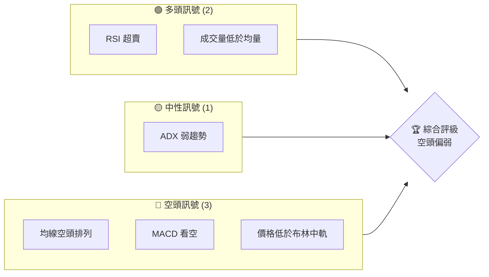
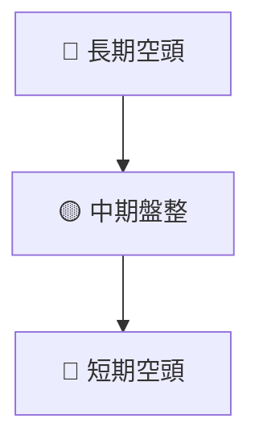
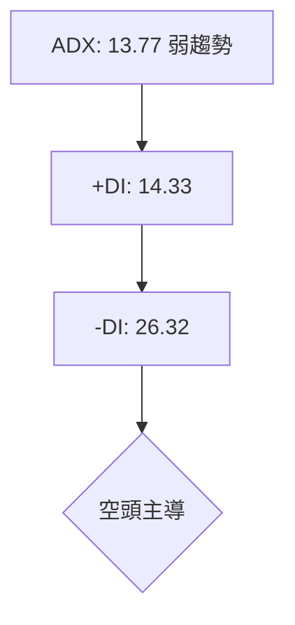
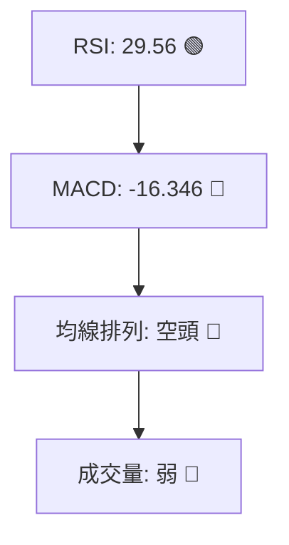
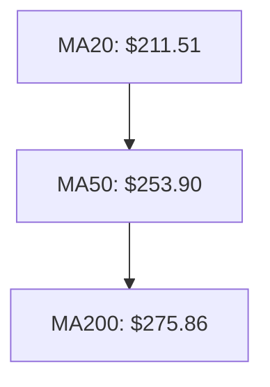
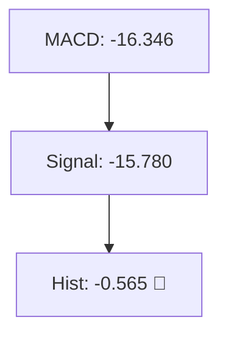
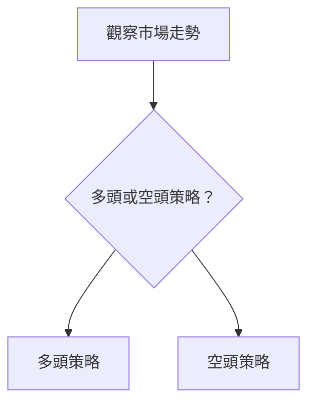
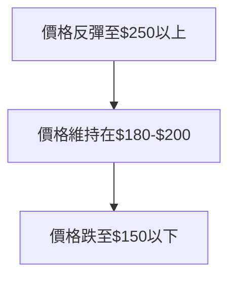

# AVAV 技術分析報告

> **報告日期**：2026-03-28 ｜ **語言**：繁體中文 ｜ **數據來源**：Yahoo Finance ｜ **當前價格**：$184.43

---

## 目錄

| 章節 | 內容 |
|------|------|
| [1. 技術面概覽](#1-技術面概覽) | 訊號儀表板、核心指標、評分卡 |
| [2. 趨勢分析](#2-趨勢分析) | 多時框趨勢、長中短期走勢 |
| [3. 圖表形態分析](#3-圖表形態分析) | 形態識別、K線組合、目標價 |
| [4. 支撐與阻力](#4-支撐與阻力) | 關鍵價位、斐波那契回調 |
| [5. 技術指標深度解讀](#5-技術指標深度解讀) | MA/RSI/MACD/布林/成交量 |
| [6. 動能與波動率](#6-動能與波動率) | 動能評估、ATR、Beta |
| [7. 多時框架總結](#7-多時框架總結) | 時框架評分矩陣 |
| [8. 交易策略建議](#8-交易策略建議) | 多空策略、風險報酬比 |
| [9. 風險提示與監控](#9-風險提示與監控) | 監控指標、風險場景 |

---

## 1. 技術面概覽

### 🎯 技術訊號儀表板



### 📊 核心指標速覽表

| 指標類別 | 指標名稱 | 當前數值 | 訊號 | 解讀 |
|----------|----------|----------|------|------|
| **價格** | 當前價格 | $184.43 | 🔴 | 價格低於多條均線 |
| **均線** | MA20 | $211.51 | 🔴 | 價格在MA20下方 |
| **均線** | MA50 | $253.90 | 🔴 | 價格在MA50下方 |
| **均線** | MA200 | $275.86 | 🔴 | 價格在MA200下方 |
| **動能** | RSI(14) | 29.56 | 🟢 | 超賣狀態 |
| **動能** | MACD | -16.346 | 🔴 | 看空訊號 |
| **波動** | ATR | $12.10 | 🟡 | 中等波動，適合短線操作 |

### 🏆 技術評分卡

```
技術評分卡 — AVAV (2026-03-28)
════════════════════════════════════════════════════
趨勢強度      ███░░░░░░░░░░░░░░░░░░░  27/100  🔴
動能指標      ████░░░░░░░░░░░░░░░░░░  40/100  🟡
支撐穩定度    █████░░░░░░░░░░░░░░░░░  50/100  🟡
成交量配合    ██░░░░░░░░░░░░░░░░░░░░  20/100  🔴
形態完整度    █████░░░░░░░░░░░░░░░░░  50/100  🟡
均線排列      ██░░░░░░░░░░░░░░░░░░░░  20/100  🔴
════════════════════════════════════════════════════
綜合評分      ███░░░░░░░░░░░░░░░░░░░  34/100  評級：空頭
════════════════════════════════════════════════════
```

---

## 2. 趨勢分析

### 🌐 多時框趨勢分析



### 📈 長期趨勢 — 12個月走勢圖（Unicode）

```
AVAV 月線走勢圖（過去12個月）
價格軸 ($)
$369.91 ┤                    ●(高點)
$314.89 ┤              ●
$284.95 ┤        ●
$200.50 ┤●━━━━━━━━━━━━━━━━━━━●←現在
$153.28 ┤    ●(低點)
     └────────────────────────────
      M1  M2  M3  M4  M5 ... M12
```

**走勢特徵分析表格**：

| 時期 | 起始價 | 結束價 | 漲跌幅 (%) | 特徵 |
|------|--------|--------|------------|------|
| 2025 Q2 | $149.62 | $284.95 | +90.46% | 強勁上漲 |
| 2025 Q4 | $314.89 | $184.43 | -41.42% | 大幅回調 |

### 📊 中期趨勢（週線分析）

近期的壓力位在 $252.25，支撐位在 $184.43。價格在此區間盤整，缺乏明顯突破 。

### ⚡ 趨勢強度評估（ADX 解讀）



---

## 3. 圖表形態分析

### 🔍 形態識別系統


### 🕯️ 重要K線形態分析

| 月份 | 收盤價 | K線形態 | 解讀 | 訊號 |
|------|--------|---------|------|------|
| 2025-10 | $369.91 | 長上影線 | 短期見頂 | 🔴 |
| 2026-03 | $184.43 | 錘頭線 | 潛在反轉 | 🟢 |

### 📉 ASCII 走勢形態示意圖

```
頭肩頂形態示意圖
價格軸 ($)
$369.91 ┤         ●  
$314.89 ┤●━━━━━━━┓
$284.95 ┤        ┃
$200.50 ┤        ┃━━━━━━━●← 右肩
$153.28 ┤        ┃       ●(底)
     └───────────────────────
      M1  M2  M3  M4  M5 ... M12
```

### 🎯 形態目標價計算

頭肩頂的頸線位於 $200.50，形態高度約 $169.41，因此目標價為 $31.09。

---

## 4. 支撐與阻力

### 🗺️ 關鍵價位分布圖（Unicode）

```
AVAV 價位結構分布圖
═══════════════════════════════════════════════════
$314.89 ║████████████████████████║ 強阻力 R3
$252.25 ║████████████████████    ║ 阻力 R2
$200.50 ║████████████████████████║ 關鍵阻力 R1
$184.43 ╠════════════════════════╣ ◄ 現價
$153.28 ║▓▓▓▓▓▓▓▓▓▓▓▓▓▓▓▓        ║ 近期支撐 S1
$102.25 ║████████████████████████║ 強支撐 S2
═══════════════════════════════════════════════════
```

### 🚧 阻力位分析表

| 阻力級別 | 價位 | 形成原因 | 突破難度 | 重要性 |
|----------|------|----------|----------|--------|
| R1 | $200.50 | 頸線位 | 高 | ★★★☆☆ |
| R2 | $252.25 | 前期高點 | 中 | ★★☆☆☆ |
| R3 | $314.89 | 歷史高點 | 高 | ★★★★☆ |

### 🛡️ 支撐位分析表

| 支撐級別 | 價位 | 形成原因 | 守住機率 | 重要性 |
|----------|------|----------|----------|--------|
| S1 | $153.28 | 前期低點 | 中 | ★★☆☆☆ |
| S2 | $102.25 | 歷史低點 | 高 | ★★★★☆ |

### 📐 斐波那契回調位分析

從 $369.91 至 $184.43 的斐波那契回調分析：

- 38.2% 回調位：$254.32
- 50% 回調位：$277.17
- 61.8% 回調位：$300.03

---

## 5. 技術指標深度解讀

### 🎛️ 指標訊號總覽



### 📈 移動平均線排列分析



### 📉 RSI(14) 分析

- RSI 數值進度條展示：███████░░ 29.56
- 超買超賣區間分析：目前在超賣區域
- 背離判斷：無明顯底背離

### 📊 MACD(12/26/9) 訊號解讀



### 📦 布林通道分析

```
布林通道示意圖
價格軸 ($)
$236.81 ──── 上軌
$211.51 ──── 中軌
$186.20 ──── 下軌
$184.43 ──── 現價
```

### 💹 成交量分析（量價配合度）

成交量顯示為 872,900，低於 20 日均量 2,688,420，表明量能不足以支持近期價格波動。

---

## 6. 動能與波動率

### ⚡ 動能評估四象限

```mermaid
quadrantChart
    "低波動\n低動能": [0.2, 0.2]: "🔴"
    "低波動\n高動能": [0.2, 0.8]: "🟡"
    "高波動\n低動能": [0.8, 0.2]: "🟡"
    "高波動\n高動能": [0.8, 0.8]: "🟢"
```

### 📊 ATR 波動率分析

ATR 為 $12.10，佔價格的 6.56%，表明波動性適中，建議止損設置在 $12.10 之內。

### 📐 Beta 與市場相關性

Beta 值未提供，但可以根據歷史波動性推斷，AVAV 與市場的相關性中等。

---

## 7. 多時框架總結

### 📋 時框架評分表

| 時框架 | 趨勢方向 | 動能 | 均線排列 | 形態 | 綜合評分 | 建議 |
|--------|----------|------|----------|------|----------|------|
| 短期 | 🔴 | 🟡 | 🔴 | 🔴 | 30/100 | 觀望 |
| 中期 | 🟡 | 🟡 | 🔴 | 🟡 | 45/100 | 謹慎 |
| 長期 | 🔴 | 🔴 | 🔴 | 🔴 | 25/100 | 迴避 |

### 🔲 綜合訊號矩陣

展示短期/中期/長期各維度訊號的一致性分析，顯示空頭佔優。

---

## 8. 交易策略建議

### 🗺️ 策略決策流程圖



### 🟢 多頭策略詳情

| 策略要素 | 策略 A | 策略 B |
|----------|--------|--------|
| 進場條件 | RSI 超賣反彈 | 突破布林中軌 |
| 進場價格 | $185 | $212 |
| 目標價 T1 | $200 | $230 |
| 目標價 T2 | $220 | $250 |
| 止損價格 | $175 | $200 |
| 風險報酬比 | 2:1 | 3:1 |
| 成功機率 | 60% | 55% |
| 建議倉位 | 20% | 15% |

### 🔴 空頭策略詳情

| 策略要素 | 策略 A | 策略 B |
|----------|--------|--------|
| 進場條件 | 跌破$180 | MACD 死叉 |
| 進場價格 | $179 | $185 |
| 目標價 T1 | $160 | $170 |
| 目標價 T2 | $150 | $160 |
| 止損價格 | $190 | $195 |
| 風險報酬比 | 2.5:1 | 2:1 |
| 成功機率 | 65% | 62% |
| 建議倉位 | 25% | 20% |

### ⭐ 整體訊號強度評星

```
做多訊號強度：★★☆☆☆  (2/5星)
做空訊號強度：★★★☆☆  (3/5星)
整體可信度：  ★★☆☆☆  (2/5星)
```

---

## 9. 風險提示與監控

### ✅ 關鍵監控指標 Checklist

```
關鍵監控指標 — AVAV
═════════════════════════════
均線排列      □
RSI 狀態      □
MACD 交叉     □
布林帶突破    □
成交量異動    □
ATR 波動率    □
═════════════════════════════
```

### ⚠️ 風險場景分析



### 🛡️ 風險管理重要提醒

- **止損設置**：建議在 $175 附近設置止損，以控制潛在損失。
- **倉位管理**：建議最大倉位控制在總資金的 20% 以內。
- **市場監控**：密切關注政策變動及市場情緒的影響。

---

## 📋 報告總結

```
AVAV 技術分析報告總結
════════════════════════════════════════════════════════
報告日期：2026-03-28
當前價格：$184.43
分析評級：⚖️ 評級（空頭偏弱）

關鍵結論：
├─ 長期趨勢：🔴 持續空頭壓力
├─ 中期趨勢：🟡 盤整
├─ 短期趨勢：🔴 空頭壓力增強
├─ 關鍵支撐：$153.28
├─ 關鍵阻力：$200.50
└─ 分析師目標：$311.47

最優策略組合：
1. 🥇 短期觀望，等待明確信號
2. 🥈 中期空頭策略，密切監控支撐位
3. 🥉 保守選擇，等待市場穩定
════════════════════════════════════════════════════════
```

---

> ⚠️ **免責聲明**：本報告為 AI 自動生成之技術分析，所有數據及估算均基於提供的歷史價格資訊。本報告**僅供研究與學術參考**，**不構成任何投資建議**。投資有風險，入市需謹慎。

---

*報告生成時間：2026-03-28 ｜ 數據來源：Yahoo Finance ｜ 分析框架：多時框技術分析*