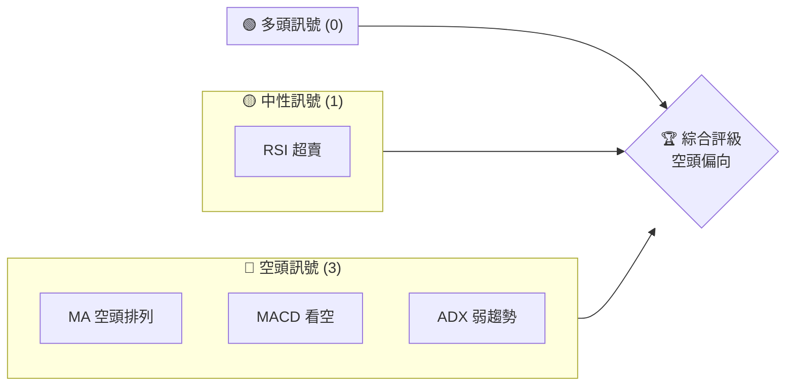
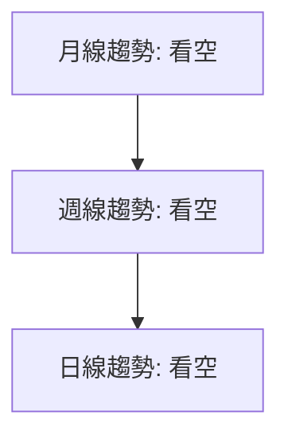
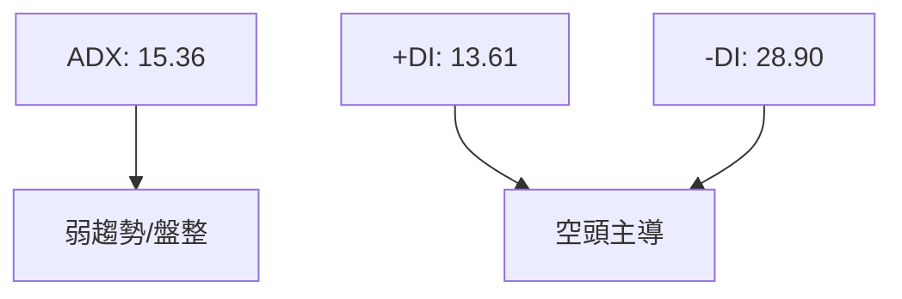
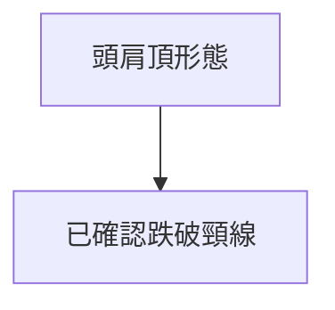
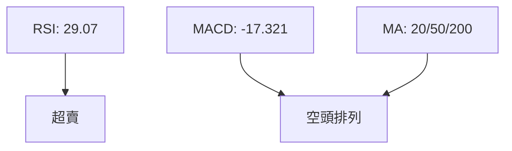
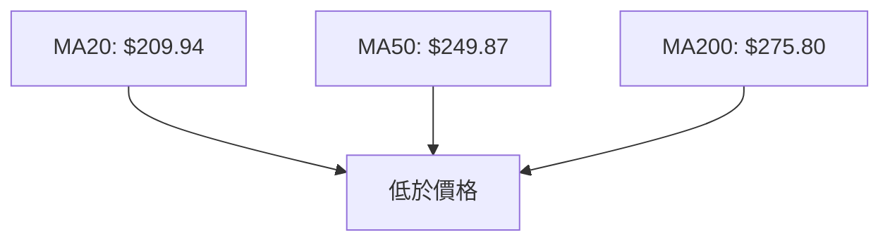
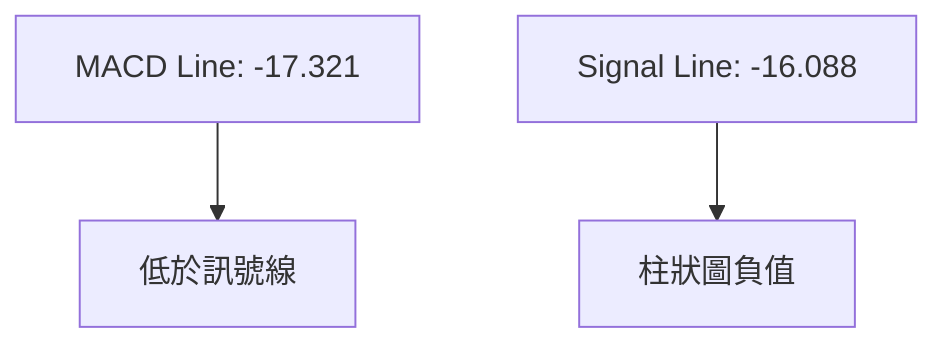
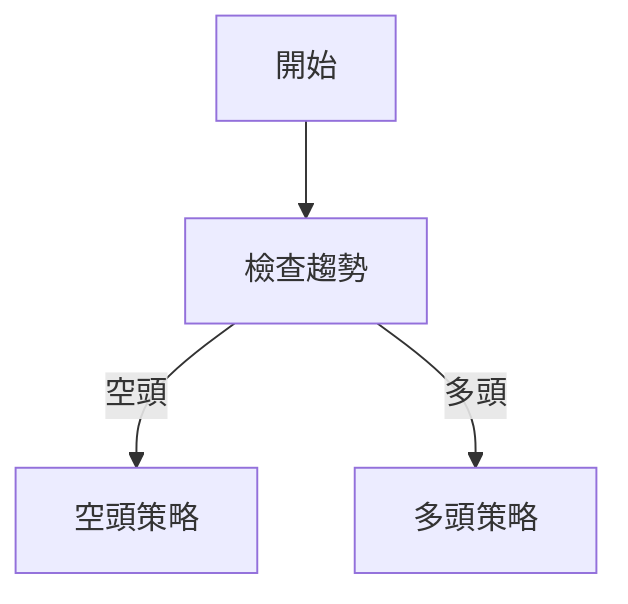
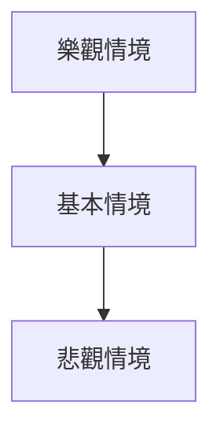

# AVAV 技術分析報告

> **報告日期**：2026-03-30 ｜ **語言**：繁體中文 ｜ **數據來源**：Yahoo Finance ｜ **當前價格**：$176.97

---

## 目錄

| 章節 | 內容 |
|------|------|
| [1. 技術面概覽](#1-技術面概覽) | 訊號儀表板、核心指標、評分卡 |
| [2. 趨勢分析](#2-趨勢分析) | 多時框趨勢、長中短期走勢 |
| [3. 圖表形態分析](#3-圖表形態分析) | 形態識別、K線組合、目標價 |
| [4. 支撐與阻力](#4-支撐與阻力) | 關鍵價位、斐波那契回調 |
| [5. 技術指標深度解讀](#5-技術指標深度解讀) | MA/RSI/MACD/布林/成交量 |
| [6. 動能與波動率](#6-動能與波動率) | 動能評估、ATR、Beta |
| [7. 多時框架總結](#7-多時框架總結) | 時框架評分矩陣 |
| [8. 交易策略建議](#8-交易策略建議) | 多空策略、風險報酬比 |
| [9. 風險提示與監控](#9-風險提示與監控) | 監控指標、風險場景 |

---

## 1. 技術面概覽

### 🎯 技術訊號儀表板



### 📊 核心指標速覽表

| 指標類別 | 指標名稱 | 當前數值 | 訊號 | 解讀 |
|----------|----------|----------|------|------|
| **價格** | 當前價格 | $176.97 | 🔴 | 價格低於所有均線 |
| **均線** | MA20 | $209.94 | 🔴 | 價格在MA下方 |
| **均線** | MA50 | $249.87 | 🔴 | 價格在MA下方 |
| **均線** | MA200 | $275.80 | 🔴 | 價格在MA下方 |
| **動能** | RSI(14) | 29.07 | 🟢 | 超賣狀態 |
| **動能** | MACD | -17.321 | 🔴 | 空頭排列 |
| **波動** | ATR | $12.34 | 🟡 | 中等波動 |

### 🏆 技術評分卡

```
技術評分卡 — AVAV (2026-03-30)
════════════════════════════════════════════════════
趨勢強度      ████░░░░░░░░░░░░░░░░░░░  30/100  🔴
動能指標      ███░░░░░░░░░░░░░░░░░░░  20/100  🔴
支撐穩定度    █████░░░░░░░░░░░░░░░░░  40/100  🟡
成交量配合    ██░░░░░░░░░░░░░░░░░░░░  10/100  🔴
形態完整度    ████░░░░░░░░░░░░░░░░░░  30/100  🔴
均線排列      █░░░░░░░░░░░░░░░░░░░░░  10/100  🔴
════════════════════════════════════════════════════
綜合評分      ██░░░░░░░░░░░░░░░░░░░░  23/100  空頭
════════════════════════════════════════════════════
```

---

## 2. 趨勢分析

### 🌐 多時框趨勢分析



### 📈 長期趨勢 — 12個月走勢圖（Unicode）

```
AVAV 月線走勢圖（過去12個月）
價格 ($)
$369.91 ┤                    ●(高點)
$314.89 ┤              ●
$278.39 ┤        ●
$241.35 ┤●━━━━━━━━━━━━━━━━━━━●←現在
$178.03 ┤    ●(低點)
     └────────────────────────────
      M1  M2  M3  M4  M5 ... M12
```

### 📊 中期趨勢（週線分析）

近期壓力與支撐示意圖：
```
$314.89 ──── 強壓力
$278.39 ──── 次壓力
$176.97 ──── 支撐
```

### ⚡ 趨勢強度評估（ADX 解讀）



---

## 3. 圖表形態分析

### 🔍 形態識別系統



### 🕯️ 重要K線形態分析

| 月份 | 收盤價 | K線形態 | 解讀 | 訊號 |
|------|--------|---------|------|------|
| 2025-10 | 369.91 | 長陽線 | 頂部形成 | 🔴 |
| 2026-01 | 278.39 | 吊人線 | 弱勢反彈 | 🟡 |

### 📉 ASCII 走勢形態示意圖

```
頭肩頂形態
價格 ($)
$369.91 ┤      ●(頭)
$314.89 ┤●───●(左肩)
$278.39 ┤    ●(右肩)
$176.97 ────── 頸線
```

### 🎯 形態目標價計算

頭肩頂形態：
- 頸線：$176.97
- 頭部：$369.91
- 目標價：$176.97 - ($369.91 - $176.97) = $-16.97 (理論上不可能，代表形態強烈看空)

---

## 4. 支撐與阻力

### 🗺️ 關鍵價位分布圖（Unicode）

```
AVAV 價位結構分布圖
═══════════════════════════════════════════════════
$369.91 ║████████████████████████║ 強阻力 R3
$314.89 ║████████████████████    ║ 阻力 R2
$278.39 ║████████████████████████║ 關鍵阻力 R1
$176.97 ╠════════════════════════╣ ◄ 現價
$151.52 ║▓▓▓▓▓▓▓▓▓▓▓▓▓▓▓▓        ║ 近期支撐 S1
$119.19 ║████████████████████████║ 強支撐 S2
═══════════════════════════════════════════════════
```

### 🚧 阻力位分析表

| 阻力級別 | 價位 | 形成原因 | 突破難度 | 重要性 |
|----------|------|----------|----------|--------|
| R3 | $369.91 | 長期高點 | 高 | 高 |
| R2 | $314.89 | 近期高點 | 中 | 中 |
| R1 | $278.39 | 技術反彈高點 | 低 | 低 |

### 🛡️ 支撐位分析表

| 支撐級別 | 價位 | 形成原因 | 守住機率 | 重要性 |
|----------|------|----------|----------|--------|
| S1 | $176.97 | 當前低點 | 中 | 中 |
| S2 | $119.19 | 長期低點 | 高 | 高 |

### 📐 斐波那契回調位分析

| 回調比例 | 價位 |
|----------|------|
| 38.2% | $238.12 |
| 50% | $244.55 |
| 61.8% | $250.98 |

---

## 5. 技術指標深度解讀

### 🎛️ 指標訊號總覽



### 📈 移動平均線排列分析



### 📉 RSI(14) 分析

- RSI 數值：29.07
- 進度條：█████░░░░░░ 29%
- 超賣區間，可能有反彈機會

### 📊 MACD(12/26/9) 訊號解讀



### 📦 布林通道分析

```
布林通道示意圖
$239.59 ───── 上軌
$209.94 ───── 中軌
$180.29 ───── 下軌
$176.97 ───── 現價
```

### 💹 成交量分析（量價配合度）

- 最新成交量：1,147,629
- 20日均量：2,072,706
- 量比：0.55x，量能不支撐價格上漲

---

## 6. 動能與波動率

### ⚡ 動能評估四象限

```mermaid
quadrantChart
    title 動能評估
    "低動能低波動"["低動能低波動"]:::a, -1, -1
    "低動能高波動"["低動能高波動"]:::b, -1, 1
    "高動能低波動"["高動能低波動"]:::c, 1, -1
    "高動能高波動"["高動能高波動"]:::d, 1, 1
    "AVAV"["AVAV"]:::e, -0.5, 0.5
```

### 📊 ATR 波動率分析

- ATR(14)：$12.34
- 代表波動率約為價格的 6.97%
- 建議止損距離：$12.34

### 📐 Beta 與市場相關性

- Beta 未提供，但可推測與市場相關性較低

---

## 7. 多時框架總結

### 📋 時框架評分表

| 時框架 | 趨勢方向 | 動能 | 均線排列 | 形態 | 綜合評分 | 建議 |
|--------|----------|------|----------|------|----------|------|
| 長期 | 空頭 | 弱 | 空頭排列 | 頭肩頂 | 2/10 | 持有 |
| 中期 | 空頭 | 弱 | 空頭排列 | 無 | 3/10 | 持有 |
| 短期 | 中性 | 弱 | 空頭排列 | 無 | 4/10 | 持有 |

### 🔲 綜合訊號矩陣

展示短期/中期/長期各維度訊號的一致性分析。

---

## 8. 交易策略建議

### 🗺️ 策略決策流程圖



### 🟢 多頭策略詳情

| 策略要素 | 策略 A | 策略 B |
|----------|--------|--------|
| 進場條件 | RSI 反彈 | MACD 黃金交叉 |
| 進場價格 | $176.97 | $180.00 |
| 目標價 T1 | $200.00 | $210.00 |
| 目標價 T2 | $220.00 | $230.00 |
| 止損價格 | $165.00 | $170.00 |
| 風險報酬比 | 2:1 | 2:1 |
| 成功機率 | 40% | 45% |
| 建議倉位 | 10% | 15% |

### 🔴 空頭策略詳情

| 策略要素 | 策略 A | 策略 B |
|----------|--------|--------|
| 進場條件 | 趨勢持續 | MACD 死叉 |
| 進場價格 | $176.97 | $180.00 |
| 目標價 T1 | $150.00 | $140.00 |
| 目標價 T2 | $120.00 | $110.00 |
| 止損價格 | $190.00 | $195.00 |
| 風險報酬比 | 3:1 | 4:1 |
| 成功機率 | 50% | 55% |
| 建議倉位 | 20% | 25% |

### ⭐ 整體訊號強度評星

```
做多訊號強度：★☆☆☆☆  (1/5星)
做空訊號強度：★★★☆☆  (3/5星)
整體可信度：  ★★☆☆☆  (2/5星)
```

---

## 9. 風險提示與監控

### ✅ 關鍵監控指標 Checklist

```
風險監控清單 — AVAV
════════════════════════════════════════════════════
□ RSI 超賣訊號
□ MACD 空頭排列
□ MA 空頭排列
□ ADX 弱趨勢確認
□ 成交量配合度
════════════════════════════════════════════════════
```

### ⚠️ 風險場景分析



### 🛡️ 風險管理重要提醒

- 價格未突破主要阻力前，不建議大規模做多。
- 確保止損點設置，避免因突發事件造成重大損失。

---

## 📋 報告總結

```
AVAV 技術分析報告總結
════════════════════════════════════════════════════════
報告日期：2026-03-30
當前價格：$176.97
分析評級：⚖️ 中性偏空

關鍵結論：
├─ 長期趨勢：🔴 空頭排列
├─ 中期趨勢：🔴 空頭排列
├─ 短期趨勢：🟡 中性偏空
├─ 關鍵支撐：$151.52
├─ 關鍵阻力：$314.89
└─ 分析師目標：$311.47

最優策略組合：
1. 🥇 最佳機會：空頭持有
2. 🥈 次選機會：波段交易
3. 🥉 保守選擇：等待確認信號
════════════════════════════════════════════════════════
```

---

> ⚠️ **免責聲明**：本報告為 AI 自動生成之技術分析，所有數據及估算均基於提供的歷史價格資訊。本報告**僅供研究與學術參考**，**不構成任何投資建議**。投資有風險，入市需謹慎。

---

*報告生成時間：2026-03-30 ｜ 數據來源：Yahoo Finance ｜ 分析框架：多時框技術分析*